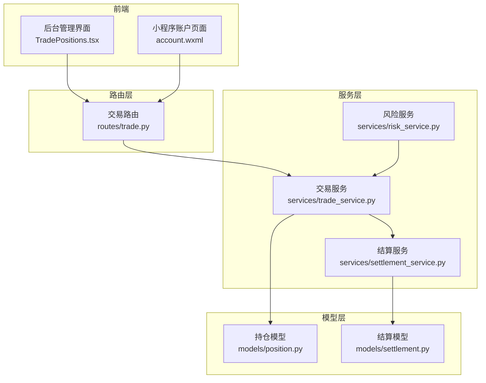
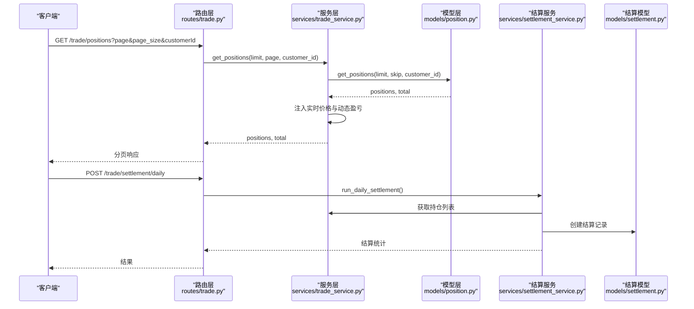
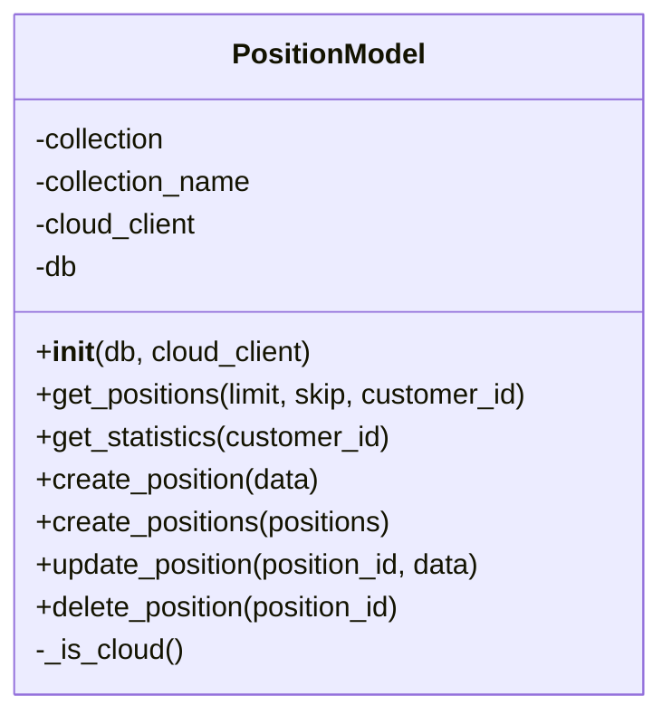
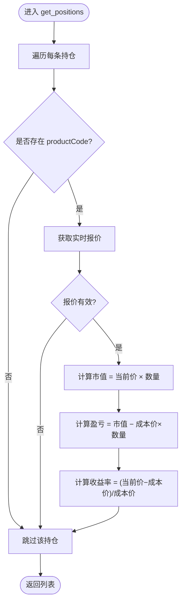
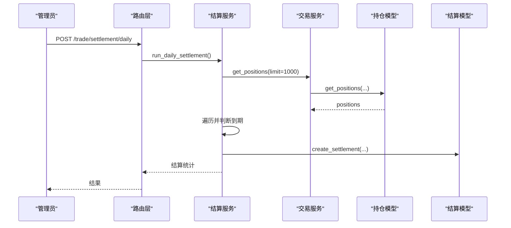
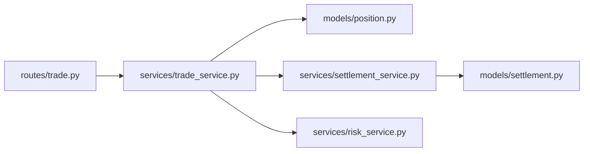

# 持仓模型

<cite>
**本文引用的文件**
- [models/position.py](file://models/position.py)
- [services/trade_service.py](file://services/trade_service.py)
- [routes/trade.py](file://routes/trade.py)
- [services/settlement_service.py](file://services/settlement_service.py)
- [models/settlement.py](file://models/settlement.py)
- [services/risk_service.py](file://services/risk_service.py)
- [admin-ui/src/pages/TradePositions.tsx](file://admin-ui/src/pages/TradePositions.tsx)
- [miniprogram/pages/account/account.wxml](file://miniprogram/pages/account/account.wxml)
- [miniprogram/utils/enhanced-features.js](file://miniprogram/utils/enhanced-features.js)
</cite>

## 目录
1. [简介](#简介)
2. [项目结构](#项目结构)
3. [核心组件](#核心组件)
4. [架构总览](#架构总览)
5. [详细组件分析](#详细组件分析)
6. [依赖分析](#依赖分析)
7. [性能考虑](#性能考虑)
8. [故障排查指南](#故障排查指南)
9. [结论](#结论)
10. [附录](#附录)

## 简介
本文件围绕“持仓模型”展开，重点阐述 PositionModel 类的设计架构与实现细节，覆盖以下主题：
- 持仓数据字段定义、数据类型、业务属性与约束条件
- 持仓数量、成本价、当前价与盈亏计算
- 持仓增删改查、平仓逻辑与结算流程
- 查询优化策略、实时价格更新机制与风险控制参数
- 与订单的关联关系、历史记录管理与报表生成逻辑
- 提供创建、调整与结算的代码示例路径

## 项目结构
与持仓模型相关的关键文件分布如下：
- 模型层：models/position.py（核心数据模型）、models/settlement.py（结算记录模型）
- 服务层：services/trade_service.py（交易服务，负责实时价格与盈亏计算）、services/settlement_service.py（结算服务）、services/risk_service.py（风险指标计算）
- 路由层：routes/trade.py（对外接口，提供查询、创建、更新、删除、统计等）
- 前端展示：admin-ui/src/pages/TradePositions.tsx（后台管理界面）、miniprogram/pages/account/account.wxml（小程序账户页面）

图表来源
- [routes/trade.py](file://routes/trade.py#L67-L149)
- [services/trade_service.py](file://services/trade_service.py#L125-L164)
- [services/settlement_service.py](file://services/settlement_service.py#L21-L60)
- [models/position.py](file://models/position.py#L10-L23)
- [models/settlement.py](file://models/settlement.py#L5-L16)

章节来源
- [routes/trade.py](file://routes/trade.py#L67-L149)
- [services/trade_service.py](file://services/trade_service.py#L125-L164)
- [services/settlement_service.py](file://services/settlement_service.py#L21-L60)
- [models/position.py](file://models/position.py#L10-L23)
- [models/settlement.py](file://models/settlement.py#L5-L16)

## 核心组件
- PositionModel：封装 MongoDB/云开发集合 positions 的 CRUD、分页与统计能力，支持本地与云数据库双模式切换。
- TradeService：对外提供 get_positions、create_position、update_position、get_position_statistics 等方法；在 get_positions 中注入实时价格与动态盈亏。
- SettlementService：按到期日扫描并结算到期持仓，生成结算记录并处理资金划转。
- SettlementModel：维护结算记录集合 settlements。
- RiskService：提供希腊字母计算与风控校验（余额与限额检查）。

章节来源
- [models/position.py](file://models/position.py#L10-L206)
- [services/trade_service.py](file://services/trade_service.py#L125-L205)
- [services/settlement_service.py](file://services/settlement_service.py#L10-L113)
- [models/settlement.py](file://models/settlement.py#L5-L57)
- [services/risk_service.py](file://services/risk_service.py#L7-L60)

## 架构总览
下图展示了从路由到服务再到模型的数据流与职责分工：

图表来源
- [routes/trade.py](file://routes/trade.py#L67-L97)
- [services/trade_service.py](file://services/trade_service.py#L125-L164)
- [models/position.py](file://models/position.py#L28-L63)
- [services/settlement_service.py](file://services/settlement_service.py#L21-L60)
- [models/settlement.py](file://models/settlement.py#L18-L41)

## 详细组件分析

### PositionModel 设计与实现
- 初始化与索引
  - 构造函数接收 db 与可选 cloud_client，建立集合引用并为 customerId 与 productCode 创建索引，提升查询效率。
- 双数据库模式
  - 通过 _is_cloud 判断是否使用云数据库客户端；云模式与本地模式在查询、计数、插入、更新、删除上分别调用对应接口。
- 查询与分页
  - get_positions 支持按 customer_id 过滤、按 createdAt 降序分页；云模式使用字符串拼接查询语法，本地模式使用 MongoDB 原生 API。
- 统计聚合
  - get_statistics 在云模式下采用“拉取上限条目并本地求和”的折衷方案；在本地模式使用聚合管道进行高效统计。
- 写入与更新
  - create_position/create_positions 自动填充 createdAt/updatedAt、默认 status/currency/market 字段；update_position 自动更新 updatedAt 并返回是否命中；delete_position 支持按 _id 删除。
- 时间与格式
  - 云模式使用 ISO 字符串时间，本地模式使用 datetime 对象，读取时统一转换为 ISO 字符串以保证前端一致性。

图表来源
- [models/position.py](file://models/position.py#L10-L206)

章节来源
- [models/position.py](file://models/position.py#L10-L206)

### 持仓数据字段定义、类型与约束
- 必填字段
  - customerId：客户标识
  - productCode：产品代码
- 常用字段
  - quantity：数量（数值型）
  - price：成本价（数值型）
  - marketValue：市值（数值型，动态计算）
  - profitLoss：账面盈亏（数值型，动态计算）
  - returnRate：收益率（数值型，动态计算）
  - currentPrice：当前价（数值型，动态注入）
  - status：状态（字符串，默认 active）
  - currency：币种（字符串，默认 CNY）
  - market：市场（字符串，默认 CN）
  - createdAt/updatedAt：时间戳（ISO 字符串或 datetime 对象）
- 约束与默认
  - 未显式传入时自动填充 status/currency/market；写入时统一设置 createdAt/updatedAt；云模式与本地模式时间格式统一处理。

章节来源
- [models/position.py](file://models/position.py#L120-L170)
- [services/trade_service.py](file://services/trade_service.py#L166-L178)

### 实时价格更新与动态盈亏计算
- 触发点
  - TradeService.get_positions 在返回前遍历每条持仓，尝试获取实时报价并计算：
    - marketValue = currentPrice × quantity
    - profitLoss = marketValue − (price × quantity)
    - returnRate = (currentPrice − price) / price（当 price > 0）
- 失败处理
  - 若获取报价失败，静默跳过，避免影响整体返回。

图表来源
- [services/trade_service.py](file://services/trade_service.py#L130-L164)

章节来源
- [services/trade_service.py](file://services/trade_service.py#L130-L164)

### 持仓增减操作与平仓逻辑
- 创建
  - TradeService.create_position 校验必填字段，确保数值类型，预设 marketValue 与 profitLoss，再委派给 PositionModel.create_position。
- 更新
  - TradeService.update_position 接受部分字段更新，自动将 quantity/price 转换为数值；PositionModel.update_position 统一更新 updatedAt。
- 删除
  - TradeService.delete_position 委派给 PositionModel.delete_position。
- 平仓
  - 代码中未提供独立的“平仓”接口；可通过将 quantity 调整为 0 或将 status 更新为非 active 来实现业务上的平仓效果。若需要自动结算，可结合 SettlementService 的到期结算流程。

章节来源
- [services/trade_service.py](file://services/trade_service.py#L166-L201)
- [models/position.py](file://models/position.py#L152-L205)

### 盈亏计算方法
- 市值：marketValue = currentPrice × quantity
- 账面盈亏：profitLoss = marketValue − (price × quantity)
- 收益率：returnRate = (currentPrice − price) / price（price > 0）

章节来源
- [services/trade_service.py](file://services/trade_service.py#L149-L160)

### 查询优化策略
- 索引
  - PositionModel 初始化时为 customerId 与 productCode 建立索引，加速按客户与产品过滤。
- 分页与排序
  - get_positions 使用 createdAt 降序分页，云模式与本地模式均支持 skip/limit。
- 统计聚合
  - 本地模式使用聚合管道一次性统计；云模式采用“拉取上限条目并本地求和”的折衷方案，避免复杂聚合限制。

章节来源
- [models/position.py](file://models/position.py#L17-L21)
- [models/position.py](file://models/position.py#L28-L63)
- [models/position.py](file://models/position.py#L65-L118)

### 风险控制参数
- 风险阈值（示例）
  - 持仓比例阈值：30%
  - 单笔持仓比例阈值：10%
  - 杠杆倍数阈值：5 倍
  - 盈亏比例阈值：20%
  - 临近到期预警天数：5 天
- 风险等级
  - 低风险、中风险、高风险、极高风险
- 应用建议
  - 在 TradeService.get_positions 返回前，可叠加 RiskService 的风险评估结果，用于前端提示与风控告警。

章节来源
- [services/risk_service.py](file://services/risk_service.py#L7-L60)
- [miniprogram/utils/enhanced-features.js](file://miniprogram/utils/enhanced-features.js#L8-L22)

### 与订单的关联关系
- 关联字段
  - 持仓与订单通过 productCode 关联产品维度；customerId 关联客户维度。
- 关联方式
  - 订单模型 OrderModel 提供订单集合 orders 的 CRUD 能力；持仓模型 PositionModel 提供 positions 集合的 CRUD 能力。
- 关联建议
  - 在业务层面，可通过 productCode 与 customerId 建立一对多关系；在查询时先获取订单，再根据订单中的产品与客户信息匹配持仓。

章节来源
- [models/order.py](file://models/order.py#L10-L26)
- [models/position.py](file://models/position.py#L10-L23)

### 历史记录管理与报表生成
- 历史记录
  - SettlementModel 维护结算记录集合，包含日期、持仓ID、用户ID、类型、行权价、结算价、盈亏、状态等字段。
- 报表生成
  - 后台管理界面 TradePositions.tsx 支持导出 CSV，包含关键字段如数量、成本价、现价、市值、盈亏、收益率、状态等。
- 报表字段映射
  - 导出列：持仓ID、客户、产品代码、产品名称、数量、成本价、现价、市值、盈亏、收益率、市场、币种、状态、建仓时间。

章节来源
- [models/settlement.py](file://models/settlement.py#L18-L57)
- [admin-ui/src/pages/TradePositions.tsx](file://admin-ui/src/pages/TradePositions.tsx#L109-L140)

### 结算流程与平仓逻辑
- 到期结算
  - SettlementService.run_daily_settlement 遍历活跃持仓，判断到期日并调用 _settle_position 计算结算价与盈亏，创建结算记录并转账（当 pnl > 0）。
- 平仓状态
  - 代码中未提供独立的“平仓”接口；可在业务上将 status 更新为非 active 或将 quantity 调整为 0 实现平仓效果。

图表来源
- [routes/trade.py](file://routes/trade.py#L55-L63)
- [services/settlement_service.py](file://services/settlement_service.py#L21-L60)
- [models/settlement.py](file://models/settlement.py#L18-L41)

章节来源
- [services/settlement_service.py](file://services/settlement_service.py#L21-L113)
- [models/settlement.py](file://models/settlement.py#L18-L57)

### 代码示例（路径）
- 创建持仓
  - 路由：POST /trade/positions
  - 示例路径：[routes/trade.py](file://routes/trade.py#L99-L118)
  - 服务：TradeService.create_position
  - 示例路径：[services/trade_service.py](file://services/trade_service.py#L166-L178)
  - 模型：PositionModel.create_position
  - 示例路径：[models/position.py](file://models/position.py#L152-L170)
- 调整持仓
  - 路由：PUT /trade/positions/{position_id}
  - 示例路径：[routes/trade.py](file://routes/trade.py#L120-L134)
  - 服务：TradeService.update_position
  - 示例路径：[services/trade_service.py](file://services/trade_service.py#L180-L197)
  - 模型：PositionModel.update_position
  - 示例路径：[models/position.py](file://models/position.py#L172-L191)
- 删除持仓
  - 路由：DELETE /trade/positions/{position_id}
  - 示例路径：[routes/trade.py](file://routes/trade.py#L136-L149)
  - 服务：TradeService.delete_position
  - 示例路径：[services/trade_service.py](file://services/trade_service.py#L199-L201)
  - 模型：PositionModel.delete_position
  - 示例路径：[models/position.py](file://models/position.py#L193-L205)
- 查询与实时更新
  - 路由：GET /trade/positions
  - 示例路径：[routes/trade.py](file://routes/trade.py#L67-L97)
  - 服务：TradeService.get_positions
  - 示例路径：[services/trade_service.py](file://services/trade_service.py#L125-L164)
  - 模型：PositionModel.get_positions
  - 示例路径：[models/position.py](file://models/position.py#L28-L63)
- 结算触发
  - 路由：POST /trade/settlement/daily
  - 示例路径：[routes/trade.py](file://routes/trade.py#L55-L63)
  - 服务：SettlementService.run_daily_settlement
  - 示例路径：[services/settlement_service.py](file://services/settlement_service.py#L21-L60)
  - 模型：SettlementModel.create_settlement
  - 示例路径：[models/settlement.py](file://models/settlement.py#L18-L41)

## 依赖分析
- 组件耦合
  - TradeService 依赖 PositionModel 与 SettlementService；SettlementService 依赖 TradeService 与 SettlementModel；RiskService 独立但可被 TradeService 调用。
- 外部依赖
  - 云数据库客户端（CloudDbClient）用于云模式下的查询、计数、新增、更新与删除；本地模式依赖 MongoDB。
- 潜在循环依赖
  - 当前文件间无循环导入；服务层通过延迟导入模型类，避免循环引用。

图表来源
- [routes/trade.py](file://routes/trade.py#L13-L16)
- [services/trade_service.py](file://services/trade_service.py#L113-L123)
- [services/settlement_service.py](file://services/settlement_service.py#L15-L19)

章节来源
- [routes/trade.py](file://routes/trade.py#L13-L16)
- [services/trade_service.py](file://services/trade_service.py#L113-L123)
- [services/settlement_service.py](file://services/settlement_service.py#L15-L19)

## 性能考虑
- 查询性能
  - 为 customerId 与 productCode 建立索引，减少过滤成本。
  - 云模式下统计采用“上限拉取+本地求和”，避免复杂聚合；本地模式使用聚合管道，性能更优。
- 实时更新
  - get_positions 中逐条获取报价并计算，建议在高频场景引入缓存或批量异步更新策略。
- 写入性能
  - create_positions 在云模式逐条插入，建议在批量场景评估事务或批处理策略（视云数据库能力而定）。

## 故障排查指南
- 云数据库不可用
  - 现象：get_positions 返回空列表且 total 为 0
  - 排查：确认 cloud_client 初始化与权限配置
  - 参考路径：[models/position.py](file://models/position.py#L29-L45)
- 写入失败
  - 现象：create_position/create_positions 返回失败
  - 排查：检查必填字段与数值类型；云模式下逐条插入可能部分失败
  - 参考路径：[models/position.py](file://models/position.py#L136-L150)
- 实时价格缺失
  - 现象：currentPrice、profitLoss、returnRate 未更新
  - 排查：StockService 获取报价异常；TradeService.get_positions 中已做容错
  - 参考路径：[services/trade_service.py](file://services/trade_service.py#L130-L164)
- 结算未生效
  - 现象：到期未结算
  - 排查：确认 expireTime 格式与到期判断逻辑；检查 SettlementModel 是否成功创建结算记录
  - 参考路径：[services/settlement_service.py](file://services/settlement_service.py#L42-L57), [models/settlement.py](file://models/settlement.py#L18-L41)

章节来源
- [models/position.py](file://models/position.py#L29-L45)
- [models/position.py](file://models/position.py#L136-L150)
- [services/trade_service.py](file://services/trade_service.py#L130-L164)
- [services/settlement_service.py](file://services/settlement_service.py#L42-L57)
- [models/settlement.py](file://models/settlement.py#L18-L41)

## 结论
PositionModel 以简洁的 CRUD 与统计能力为核心，配合 TradeService 的实时价格注入与动态盈亏计算，形成完整的持仓管理闭环。通过云/本地双模式兼容、索引优化与聚合统计，满足不同部署环境的需求。建议后续增强：
- 提供独立的“平仓”接口与状态机
- 引入缓存与批量异步更新以提升实时性
- 完善订单与持仓的关联查询与报表字段扩展

## 附录
- 前端展示要点
  - 后台管理界面支持搜索、分页、导出 CSV；小程序账户页面展示持仓卡片与关键指标。
  - 参考路径：
    - [admin-ui/src/pages/TradePositions.tsx](file://admin-ui/src/pages/TradePositions.tsx#L109-L140)
    - [miniprogram/pages/account/account.wxml](file://miniprogram/pages/account/account.wxml#L109-L146)