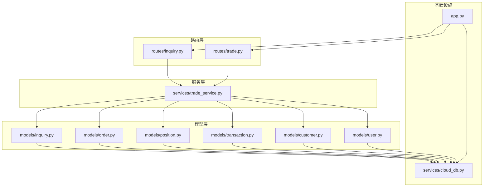
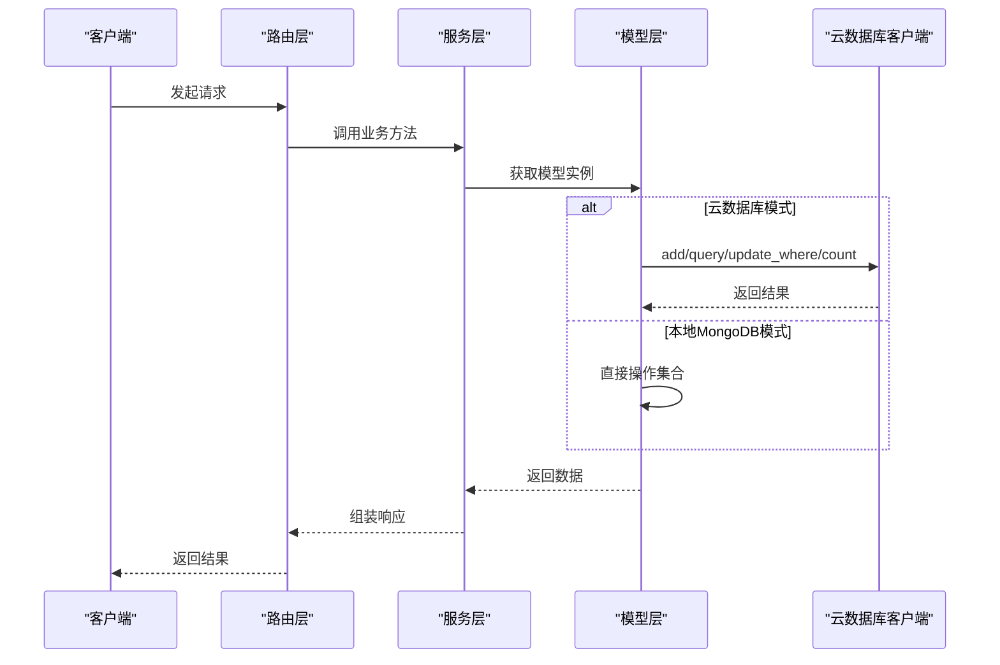
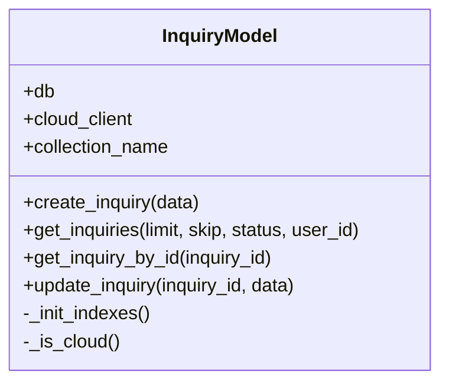
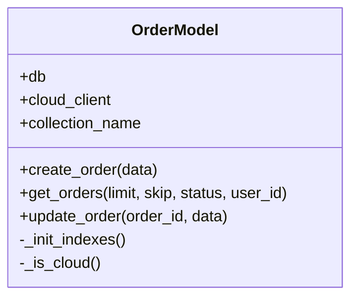
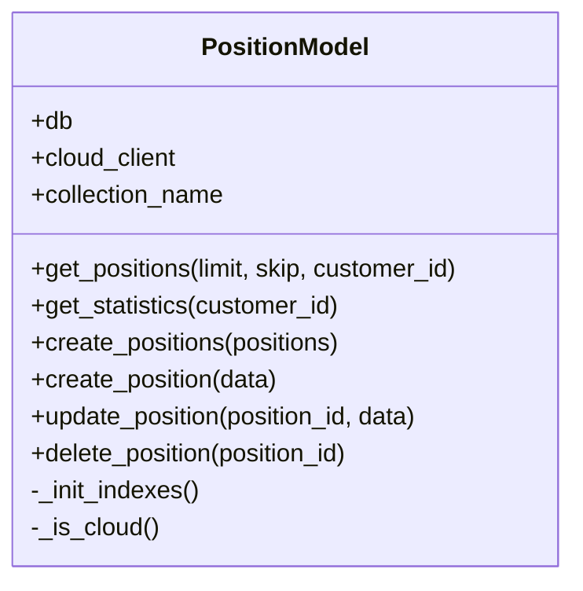
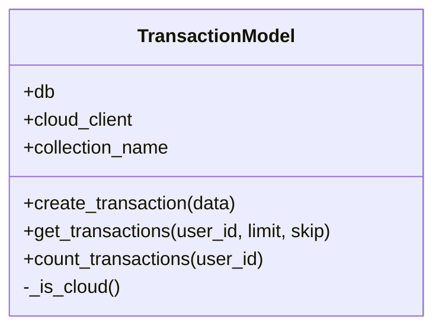
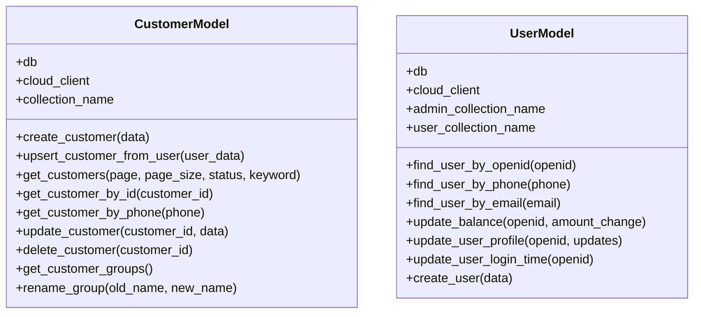
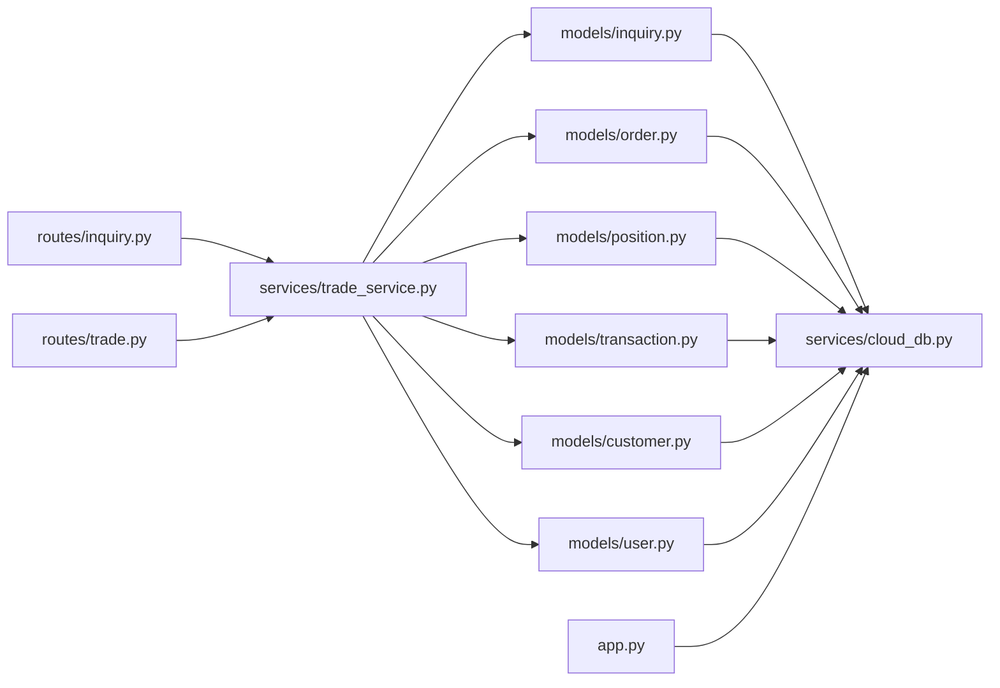

# 核心数据模型

<cite>
**本文档引用的文件**
- [models/inquiry.py](file://models/inquiry.py)
- [models/order.py](file://models/order.py)
- [models/position.py](file://models/position.py)
- [models/transaction.py](file://models/transaction.py)
- [models/customer.py](file://models/customer.py)
- [models/user.py](file://models/user.py)
- [services/trade_service.py](file://services/trade_service.py)
- [routes/inquiry.py](file://routes/inquiry.py)
- [routes/trade.py](file://routes/trade.py)
- [services/cloud_db.py](file://services/cloud_db.py)
- [app.py](file://app.py)
</cite>

## 目录
1. [简介](#简介)
2. [项目结构](#项目结构)
3. [核心组件](#核心组件)
4. [架构总览](#架构总览)
5. [详细组件分析](#详细组件分析)
6. [依赖关系分析](#依赖关系分析)
7. [性能考虑](#性能考虑)
8. [故障排除指南](#故障排除指南)
9. [结论](#结论)

## 简介
本文件聚焦于场外期权系统的核心数据模型，围绕询价模型、订单模型、持仓模型与交易模型进行深入解析。内容涵盖字段定义、数据类型、业务属性与约束、模型间关联关系、CRUD 方法、查询优化与索引设计、实例化与最佳实践、时间戳与状态管理以及数据验证规则。

## 项目结构
系统采用分层架构：路由层负责接口暴露与鉴权，服务层封装业务逻辑与跨模型协调，模型层封装数据访问与索引，云数据库客户端提供统一的云端访问能力。数据库支持本地 MongoDB 与微信云开发两种形态，通过统一的模型接口适配。

图表来源
- [routes/inquiry.py](file://routes/inquiry.py#L1-L175)
- [routes/trade.py](file://routes/trade.py#L1-L330)
- [services/trade_service.py](file://services/trade_service.py#L1-L318)
- [models/inquiry.py](file://models/inquiry.py#L1-L148)
- [models/order.py](file://models/order.py#L1-L119)
- [models/position.py](file://models/position.py#L1-L206)
- [models/transaction.py](file://models/transaction.py#L1-L61)
- [models/customer.py](file://models/customer.py#L1-L300)
- [models/user.py](file://models/user.py#L1-L309)
- [services/cloud_db.py](file://services/cloud_db.py#L1-L533)
- [app.py](file://app.py#L1-L350)

章节来源
- [routes/inquiry.py](file://routes/inquiry.py#L1-L175)
- [routes/trade.py](file://routes/trade.py#L1-L330)
- [services/trade_service.py](file://services/trade_service.py#L1-L318)
- [models/inquiry.py](file://models/inquiry.py#L1-L148)
- [models/order.py](file://models/order.py#L1-L119)
- [models/position.py](file://models/position.py#L1-L206)
- [models/transaction.py](file://models/transaction.py#L1-L61)
- [models/customer.py](file://models/customer.py#L1-L300)
- [models/user.py](file://models/user.py#L1-L309)
- [services/cloud_db.py](file://services/cloud_db.py#L1-L533)
- [app.py](file://app.py#L1-L350)

## 核心组件
本节概述四个核心模型的职责边界与关键字段。

- 询价模型（InquiryModel）
  - 职责：接收客户提交的期权询价请求，维护状态流转与历史备注，支持分页查询与统计。
  - 关键字段：createdAt、updatedAt、status、phone、openid、selectedProduct 等。
  - 约束：默认状态 pending；支持按状态与用户标识过滤；索引覆盖 createdAt、status、phone。

- 订单模型（OrderModel）
  - 职责：创建与管理订单，生成唯一 orderId，支持状态更新与分页查询。
  - 关键字段：orderId（唯一）、createdAt、updatedAt、status、openid 等。
  - 约束：orderId 唯一索引；默认状态 pending；支持按状态与用户标识过滤。

- 持仓模型（PositionModel）
  - 职责：管理客户持有的期权头寸，支持实时行情更新与统计聚合。
  - 关键字段：customerId、productCode、quantity、price、marketValue、profitLoss、status、currency、market 等。
  - 约束：索引覆盖 customerId、productCode；支持批量创建；统计聚合在本地 MongoDB 可用聚合管道，在云数据库需降级实现。

- 交易模型（TransactionModel）
  - 职责：记录资金流水，支持按用户维度分页查询与计数。
  - 关键字段：user_id、type（deposit/withdraw/buy/sell/fee）、amount、balance_after、created_at 等。
  - 约束：按 user_id 查询；支持分页与计数。

章节来源
- [models/inquiry.py](file://models/inquiry.py#L10-L148)
- [models/order.py](file://models/order.py#L10-L119)
- [models/position.py](file://models/position.py#L10-L206)
- [models/transaction.py](file://models/transaction.py#L6-L61)

## 架构总览
下图展示从路由到服务再到模型与云数据库的整体调用链路，体现多态数据库适配与统一接口。

图表来源
- [routes/inquiry.py](file://routes/inquiry.py#L11-L34)
- [routes/trade.py](file://routes/trade.py#L189-L242)
- [services/trade_service.py](file://services/trade_service.py#L38-L109)
- [models/inquiry.py](file://models/inquiry.py#L32-L53)
- [models/order.py](file://models/order.py#L28-L52)
- [models/position.py](file://models/position.py#L152-L170)
- [models/transaction.py](file://models/transaction.py#L19-L39)
- [services/cloud_db.py](file://services/cloud_db.py#L209-L303)

## 详细组件分析

### 询价模型（InquiryModel）
- 字段与类型
  - createdAt/updatedAt：时间戳（云端使用 ISO 字符串，本地使用 datetime 对象）
  - status：字符串枚举（如 pending/processing/completed/rejected）
  - phone：字符串，用于去重与检索
  - openid：字符串，与微信用户关联
  - selectedProduct：对象，包含产品名称与代码等
- 约束与校验
  - 默认状态 pending
  - 云端/本地双态：云端通过 HTTP API，本地通过 MongoDB
  - 索引：createdAt、status、phone
- CRUD 与查询
  - 创建：设置时间戳与默认状态，返回主键
  - 查询：支持按 status 与 openid 过滤，分页排序
  - 更新：更新 updatedAt 与状态/备注
- 时间戳与状态
  - 所有更新均追加 updatedAt
  - 状态字段用于流程控制与报表统计
- 索引与优化
  - 建议：为高频过滤字段建立复合索引（如 status+createdAt、openid+status）

图表来源
- [models/inquiry.py](file://models/inquiry.py#L10-L148)

章节来源
- [models/inquiry.py](file://models/inquiry.py#L10-L148)

### 订单模型（OrderModel）
- 字段与类型
  - orderId：字符串，唯一标识（云端/本地均保证唯一性）
  - createdAt/updatedAt：时间戳
  - status：字符串状态
  - openid：用户标识
- 约束与校验
  - orderId 唯一索引
  - 默认状态 pending
  - 支持按 status 与 openid 过滤
- CRUD 与查询
  - 创建：自动生成 orderId，设置时间戳
  - 查询：分页排序，支持状态过滤
  - 更新：更新 updatedAt 与状态
- 索引与优化
  - 建议：为 orderId 建唯一索引，为 createdAt 建普通索引

图表来源
- [models/order.py](file://models/order.py#L10-L119)

章节来源
- [models/order.py](file://models/order.py#L10-L119)

### 持仓模型（PositionModel）
- 字段与类型
  - customerId：客户标识
  - productCode：产品代码
  - quantity/price：数量与成本价
  - marketValue/profitLoss：市值与盈亏（可动态计算）
  - status/currency/market：状态、币种、市场
- 约束与校验
  - 索引：customerId、productCode
  - 默认 status=active，currency=CNY，market=CN
- 统计与聚合
  - 本地 MongoDB：使用聚合管道统计总市值、总盈亏与数量
  - 云端：受限实现，建议拉取小规模数据或迁移至云函数
- CRUD 与查询
  - 创建：批量/单笔创建，设置时间戳与默认字段
  - 查询：按 customerId 过滤，分页排序
  - 更新/删除：基于 _id 的更新与删除

图表来源
- [models/position.py](file://models/position.py#L10-L206)

章节来源
- [models/position.py](file://models/position.py#L10-L206)

### 交易模型（TransactionModel）
- 字段与类型
  - user_id：用户标识
  - type：交易类型（存款/取款/买入/卖出/手续费）
  - amount/balance_after：金额与余额
  - created_at：时间戳
- 约束与校验
  - 按 user_id 查询与计数
  - 支持分页
- CRUD 与查询
  - 创建：写入流水
  - 查询：按用户分页获取
  - 计数：统计总数

图表来源
- [models/transaction.py](file://models/transaction.py#L6-L61)

章节来源
- [models/transaction.py](file://models/transaction.py#L6-L61)

### 客户与用户模型（CustomerModel/UserModel）
- 客户模型（CustomerModel）
  - 关键字段：name、phone（唯一）、email、status、groupName、user_id、openid、createdAt/updatedAt、totalOrders 等
  - 约束：phone 唯一；支持按状态与关键字过滤；支持组名去重与重命名
- 用户模型（UserModel）
  - 关键字段：openid（WeChat）、phone/email、balance、last_login、created_at 等
  - 约束：余额原子更新（云端需降级实现）
  - 会话管理：刷新令牌哈希、设备信息、IP、过期时间、激活状态

图表来源
- [models/customer.py](file://models/customer.py#L10-L300)
- [models/user.py](file://models/user.py#L10-L309)

章节来源
- [models/customer.py](file://models/customer.py#L10-L300)
- [models/user.py](file://models/user.py#L10-L309)

## 依赖关系分析
- 路由到服务
  - 询价路由与交易路由均通过 TradeService 调用各模型方法
- 服务到模型
  - TradeService 在运行时根据上下文选择本地或云端模型实例
- 模型到云数据库
  - 模型通过 cloud_client 执行 add/query/update_where/count 等操作
- 应用初始化
  - app.py 注入 db 与 cloud_db 到全局，供服务层获取

图表来源
- [routes/inquiry.py](file://routes/inquiry.py#L11-L34)
- [routes/trade.py](file://routes/trade.py#L189-L242)
- [services/trade_service.py](file://services/trade_service.py#L12-L34)
- [models/inquiry.py](file://models/inquiry.py#L11-L19)
- [models/order.py](file://models/order.py#L11-L23)
- [models/position.py](file://models/position.py#L11-L23)
- [models/transaction.py](file://models/transaction.py#L7-L14)
- [models/customer.py](file://models/customer.py#L11-L18)
- [models/user.py](file://models/user.py#L11-L22)
- [services/cloud_db.py](file://services/cloud_db.py#L108-L207)
- [app.py](file://app.py#L119-L166)

章节来源
- [routes/inquiry.py](file://routes/inquiry.py#L11-L34)
- [routes/trade.py](file://routes/trade.py#L189-L242)
- [services/trade_service.py](file://services/trade_service.py#L12-L34)
- [models/inquiry.py](file://models/inquiry.py#L11-L19)
- [models/order.py](file://models/order.py#L11-L23)
- [models/position.py](file://models/position.py#L11-L23)
- [models/transaction.py](file://models/transaction.py#L7-L14)
- [models/customer.py](file://models/customer.py#L11-L18)
- [models/user.py](file://models/user.py#L11-L22)
- [services/cloud_db.py](file://services/cloud_db.py#L108-L207)
- [app.py](file://app.py#L119-L166)

## 性能考虑
- 索引策略
  - 询价：createdAt、status、phone
  - 订单：orderId（唯一）、createdAt
  - 持仓：customerId、productCode
- 查询优化
  - 使用分页与排序（按 createdAt 倒序）
  - 云端查询尽量使用 where 子句与 limit 控制数据量
  - 统计聚合在本地 MongoDB 使用聚合管道，云端采用拉取小样本或云函数
- 并发与限流
  - 云数据库客户端内置并发与重试机制，合理设置最大并发与重试次数
- 数据一致性
  - 余额更新在云端需降级为读取-更新-写入流程，防止竞态

[本节为通用指导，无需具体文件引用]

## 故障排除指南
- 云数据库配置错误
  - 现象：初始化失败或查询报错提示集合不存在
  - 排查：确认 WX_CLOUD_ENV、WX_APPID、WX_SECRET 是否正确设置
  - 处理：在微信云开发控制台创建对应集合
- 数据库连接失败
  - 现象：MongoDB 连接超时或失败
  - 排查：检查 MONGO_URI 与 DATABASE_NAME，确认网络可达
  - 处理：调整超时参数或切换到云端模式
- 查询异常
  - 现象：云端查询返回空或格式错误
  - 排查：检查查询语句构造与 where 条件拼接
  - 处理：参考云数据库客户端的查询与计数方法

章节来源
- [services/cloud_db.py](file://services/cloud_db.py#L15-L21)
- [services/cloud_db.py](file://services/cloud_db.py#L163-L207)
- [services/cloud_db.py](file://services/cloud_db.py#L209-L270)
- [app.py](file://app.py#L64-L88)
- [app.py](file://app.py#L121-L152)

## 结论
本系统通过统一的服务层与模型层抽象，实现了对本地 MongoDB 与微信云数据库的无缝适配。询价、订单、持仓与交易四大核心模型分别承担不同的业务职责，并通过状态字段与时间戳实现流程追踪与审计。建议在生产环境中强化索引策略、优化统计聚合与并发控制，并完善数据校验与异常处理，以提升整体稳定性与性能。