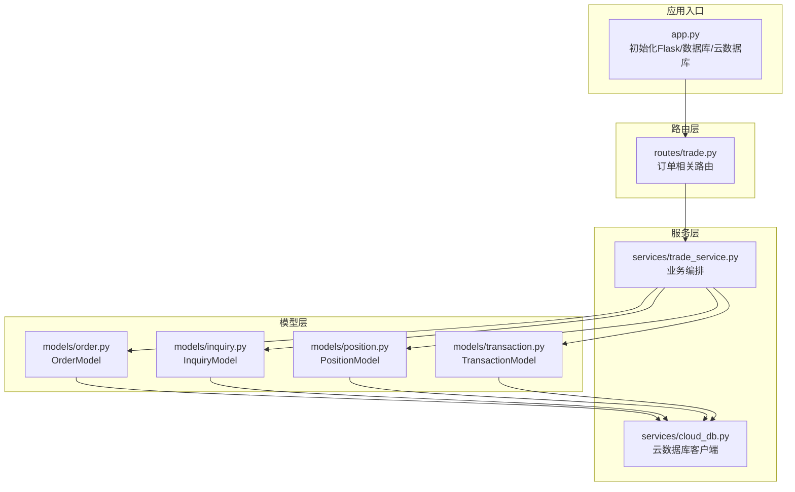
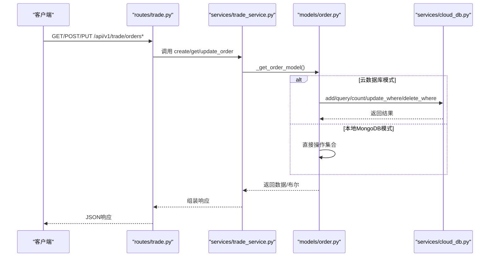
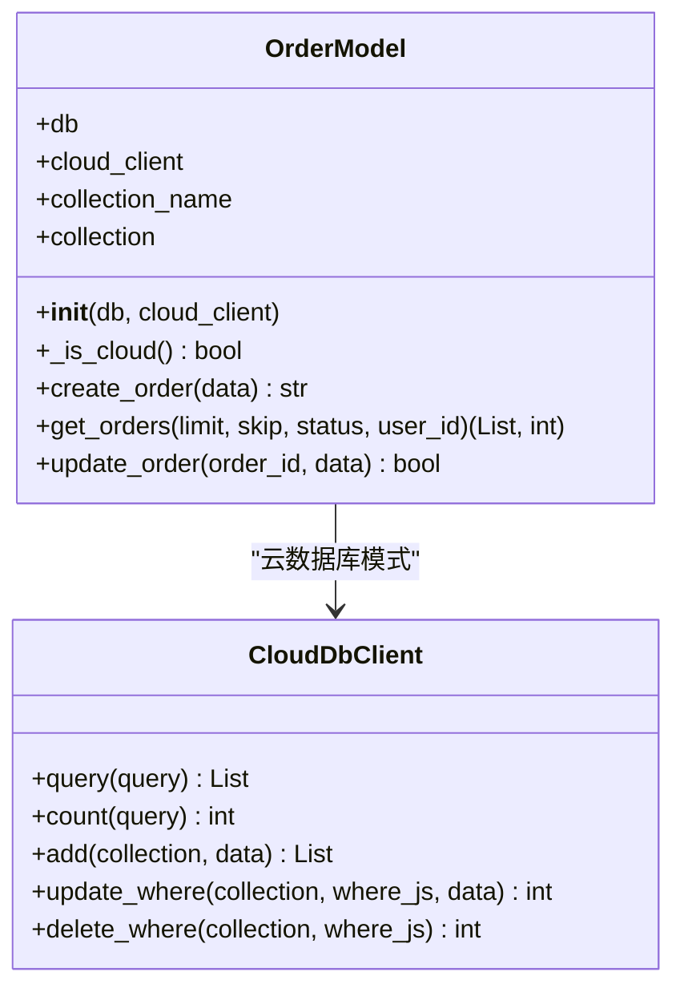
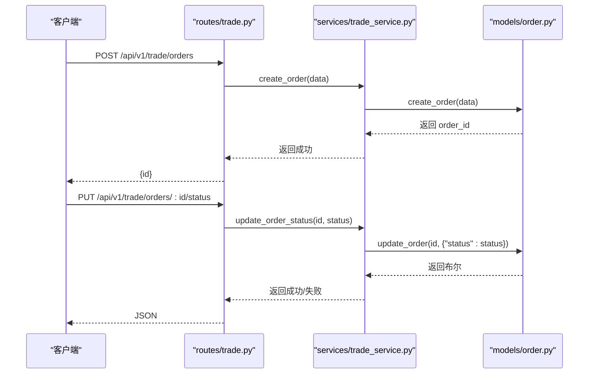
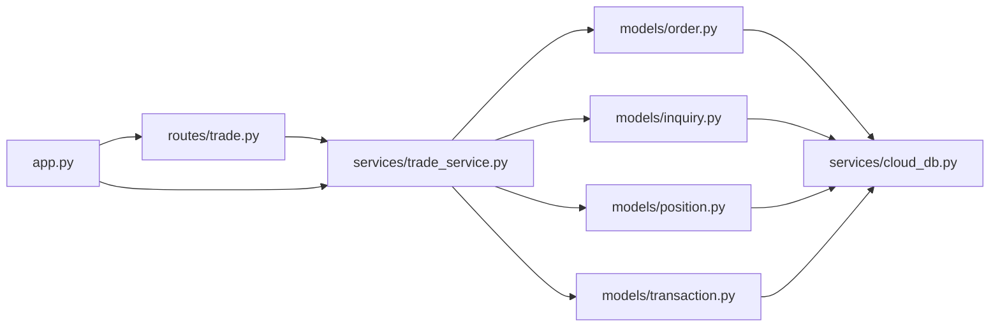

# 订单模型

<cite>
**本文引用的文件**
- [models/order.py](file://models/order.py)
- [services/trade_service.py](file://services/trade_service.py)
- [routes/trade.py](file://routes/trade.py)
- [services/cloud_db.py](file://services/cloud_db.py)
- [models/inquiry.py](file://models/inquiry.py)
- [models/position.py](file://models/position.py)
- [models/transaction.py](file://models/transaction.py)
- [app.py](file://app.py)
</cite>

## 目录
1. [简介](#简介)
2. [项目结构](#项目结构)
3. [核心组件](#核心组件)
4. [架构总览](#架构总览)
5. [详细组件分析](#详细组件分析)
6. [依赖关系分析](#依赖关系分析)
7. [性能考量](#性能考量)
8. [故障排查指南](#故障排查指南)
9. [结论](#结论)
10. [附录](#附录)

## 简介
本文件围绕订单模型（OrderModel）进行系统性文档化，覆盖其设计架构、字段定义、业务属性与约束、CRUD操作、生命周期与状态转换、查询优化与索引设计、以及与询价、持仓、资金流水等模块的关系处理与一致性保障。文档同时提供可直接定位到源码位置的“章节来源”与“图表来源”，便于读者快速回溯实现细节。

## 项目结构
订单模型位于后端 Python 代码的 models 层，配合服务层 TradeService、路由层 routes/trade.py 以及云数据库适配层 services/cloud_db.py 使用。应用入口 app.py 注入数据库与云数据库客户端，供各模型按需选择本地 MongoDB 或微信云数据库。

图表来源
- [app.py](file://app.py#L103-L200)
- [routes/trade.py](file://routes/trade.py#L188-L262)
- [services/trade_service.py](file://services/trade_service.py#L8-L35)
- [models/order.py](file://models/order.py#L10-L24)
- [services/cloud_db.py](file://services/cloud_db.py#L108-L208)

章节来源
- [app.py](file://app.py#L103-L200)
- [routes/trade.py](file://routes/trade.py#L188-L262)
- [services/trade_service.py](file://services/trade_service.py#L8-L35)

## 核心组件
- OrderModel：封装订单集合的 CRUD、查询与索引管理，支持本地 MongoDB 与微信云数据库双形态。
- TradeService：在路由层调用，负责订单创建、查询、状态更新等业务编排。
- CloudDbClient：抽象云数据库查询、计数、增删改等操作，屏蔽差异。
- 相关模型：InquiryModel（询价）、PositionModel（持仓）、TransactionModel（资金流水）。

章节来源
- [models/order.py](file://models/order.py#L10-L119)
- [services/trade_service.py](file://services/trade_service.py#L98-L110)
- [services/cloud_db.py](file://services/cloud_db.py#L108-L330)

## 架构总览
订单相关请求从路由进入，经由 TradeService 调用 OrderModel；OrderModel 根据是否注入云数据库客户端选择不同实现路径。查询与更新均支持分页与过滤，时间字段在本地与云环境下分别处理为 datetime 或 ISO 字符串。

图表来源
- [routes/trade.py](file://routes/trade.py#L190-L262)
- [services/trade_service.py](file://services/trade_service.py#L98-L110)
- [models/order.py](file://models/order.py#L28-L118)
- [services/cloud_db.py](file://services/cloud_db.py#L209-L330)

## 详细组件分析

### OrderModel 设计与实现
- 初始化与索引
  - 在本地 MongoDB 下创建唯一索引：orderId（用于去重）、createdAt（用于排序与范围查询）。
  - 云数据库模式下不显式创建索引，但可通过查询语法优化。
- 字段与约束
  - 必填字段：createdAt、updatedAt（云环境为ISO字符串，本地为datetime对象）。
  - 可选字段：orderId（若缺失则自动生成），openid（用户标识），status（订单状态）。
  - 业务属性：订单号唯一性、创建/更新时间戳、用户维度过滤。
- CRUD 方法
  - create_order：填充时间戳与订单号，调用云数据库 add 或本地 insert_one。
  - get_orders：支持 status 与 openid 过滤，分页 skip/limit，按 createdAt 降序。
  - update_order：统一设置 updatedAt，支持云数据库 update_where 或本地 update_one。
- 云/本地兼容
  - _is_cloud 判定是否使用云数据库客户端。
  - 云环境下返回的 _id 需转为字符串；时间字段在云环境下为 ISO 字符串。

图表来源
- [models/order.py](file://models/order.py#L10-L119)
- [services/cloud_db.py](file://services/cloud_db.py#L108-L330)

章节来源
- [models/order.py](file://models/order.py#L10-L119)

### 订单字段定义与业务属性
- 关键字段
  - orderId：字符串，唯一标识，若未提供则自动生成。
  - openid：字符串，用户标识，路由层会自动注入当前用户。
  - status：字符串，订单状态（如 pending/processing/completed/canceled 等，具体取值由业务约定）。
  - amount：数值，订单金额（若存在）。
  - quantity：数值，下单数量。
  - productCode/productName：产品标识与名称。
  - createdAt/updatedAt：时间戳，云环境为 ISO 字符串，本地为 datetime 对象。
- 业务属性
  - 用户维度：通过 openid 过滤个人订单。
  - 时间维度：按 createdAt 降序展示最新订单。
  - 状态维度：按 status 过滤不同阶段的订单。

章节来源
- [routes/trade.py](file://routes/trade.py#L221-L242)
- [models/order.py](file://models/order.py#L28-L97)

### CRUD 操作方法
- 创建订单
  - 路由：POST /api/v1/trade/orders
  - 服务：TradeService.create_order
  - 模型：OrderModel.create_order
  - 行为：填充时间戳、生成订单号、写入数据库。
- 查询订单
  - 路由：GET /api/v1/trade/orders
  - 服务：TradeService.get_orders
  - 模型：OrderModel.get_orders
  - 行为：支持 status 与 openid 过滤、分页、按时间倒序。
- 更新状态
  - 路由：PUT /api/v1/trade/orders/:order_id/status
  - 服务：TradeService.update_order_status
  - 模型：OrderModel.update_order（仅设置 status）
  - 行为：统一更新 updatedAt，写入新状态。

图表来源
- [routes/trade.py](file://routes/trade.py#L221-L262)
- [services/trade_service.py](file://services/trade_service.py#L98-L110)
- [models/order.py](file://models/order.py#L28-L118)

章节来源
- [routes/trade.py](file://routes/trade.py#L190-L262)
- [services/trade_service.py](file://services/trade_service.py#L98-L110)
- [models/order.py](file://models/order.py#L28-L118)

### 订单生命周期与状态转换
- 生命周期阶段
  - 创建：create_order 写入初始状态（如 pending）。
  - 处理：update_order_status 更新为 processing。
  - 完成/取消：根据业务规则更新为 completed 或 canceled。
- 状态转换逻辑
  - 当前实现仅提供状态更新入口，未在模型内强制状态机校验。
  - 建议在服务层增加状态转换校验与历史记录追加，以保证一致性与审计。

章节来源
- [routes/trade.py](file://routes/trade.py#L244-L262)
- [services/trade_service.py](file://services/trade_service.py#L107-L109)
- [models/order.py](file://models/order.py#L99-L118)

### 订单查询优化策略、索引设计与性能考虑
- 索引设计
  - 本地 MongoDB：orderId（唯一）、createdAt（排序/范围）。
  - 云数据库：不显式创建索引，但查询语法支持 where/orderBy/skip/limit。
- 查询优化
  - 使用 status 与 openid 过滤减少扫描范围。
  - 分页使用 skip/limit，避免一次性拉取大量数据。
  - createdAt 降序排序，优先命中索引。
- 性能考量
  - 云数据库查询基于字符串拼接，注意 where 条件与 orderBy 的组合。
  - 云数据库客户端支持并发与重试，需关注环境变量配置（如最大并发、重试次数）。
  - 本地 MongoDB 下，建议在高频查询字段上建立复合索引（如 {status: 1, openid: 1, createdAt: -1}）。

章节来源
- [models/order.py](file://models/order.py#L17-L21)
- [models/order.py](file://models/order.py#L54-L97)
- [services/cloud_db.py](file://services/cloud_db.py#L141-L160)

### 代码示例（路径定位）
- 创建订单
  - 路由：[routes/trade.py](file://routes/trade.py#L221-L242)
  - 服务：[services/trade_service.py](file://services/trade_service.py#L98-L100)
  - 模型：[models/order.py](file://models/order.py#L28-L52)
- 更新订单状态
  - 路由：[routes/trade.py](file://routes/trade.py#L244-L262)
  - 服务：[services/trade_service.py](file://services/trade_service.py#L107-L109)
  - 模型：[models/order.py](file://models/order.py#L99-L118)
- 历史查询（分页+过滤）
  - 路由：[routes/trade.py](file://routes/trade.py#L190-L219)
  - 服务：[services/trade_service.py](file://services/trade_service.py#L102-L105)
  - 模型：[models/order.py](file://models/order.py#L54-L97)

章节来源
- [routes/trade.py](file://routes/trade.py#L190-L262)
- [services/trade_service.py](file://services/trade_service.py#L98-L110)
- [models/order.py](file://models/order.py#L28-L118)

### 订单与询价、持仓的关系处理与一致性
- 与询价（InquiryModel）
  - 订单通常由询价转化而来，两者共享 openid 作为用户维度标识。
  - 询价状态变更与订单状态更新属于不同业务域，建议在服务层协调。
- 与持仓（PositionModel）
  - 订单完成后可能生成/更新持仓；当前模型未内置自动联动。
  - 建议在订单状态更新为 completed 后，触发创建或调整对应持仓。
- 与资金流水（TransactionModel）
  - 订单涉及资金变动时，应创建交易流水记录，便于对账与审计。
  - 资金流水模型提供存款/取款/买卖/手续费等类型字段，可扩展用于订单结算。
- 一致性与事务
  - 本地 MongoDB 支持单文档事务；跨集合事务需谨慎评估。
  - 云数据库不支持传统 ACID 事务，建议采用幂等设计与补偿机制（如 upsert、幂等键）。

章节来源
- [models/inquiry.py](file://models/inquiry.py#L10-L148)
- [models/position.py](file://models/position.py#L10-L206)
- [models/transaction.py](file://models/transaction.py#L6-L61)
- [services/cloud_db.py](file://services/cloud_db.py#L305-L330)

## 依赖关系分析
- 路由层依赖服务层；服务层按需注入数据库或云数据库客户端；模型层根据上下文选择实现路径。
- 应用入口 app.py 注入 db 与 cloud_db，供服务层动态获取。

图表来源
- [routes/trade.py](file://routes/trade.py#L188-L262)
- [services/trade_service.py](file://services/trade_service.py#L8-L35)
- [models/order.py](file://models/order.py#L10-L24)
- [services/cloud_db.py](file://services/cloud_db.py#L108-L208)
- [app.py](file://app.py#L103-L200)

章节来源
- [routes/trade.py](file://routes/trade.py#L188-L262)
- [services/trade_service.py](file://services/trade_service.py#L8-L35)
- [models/order.py](file://models/order.py#L10-L24)
- [services/cloud_db.py](file://services/cloud_db.py#L108-L208)
- [app.py](file://app.py#L103-L200)

## 性能考量
- 云数据库
  - 查询基于字符串拼接，建议尽量复用 where 条件，避免重复构造。
  - 并发与重试参数可通过环境变量调节，默认并发较高以满足行情同步需求。
- 本地 MongoDB
  - 建议为高频查询字段建立复合索引，减少 sort 与过滤成本。
  - 批量写入时使用 insert_many 或批量 upsert，降低网络往返。
- 通用建议
  - 分页参数合理设置，避免超大 skip。
  - 对于状态聚合统计，优先在服务层做缓存或预计算。

章节来源
- [services/cloud_db.py](file://services/cloud_db.py#L141-L160)
- [models/order.py](file://models/order.py#L17-L21)

## 故障排查指南
- 云数据库配置
  - 确认 WX_CLOUD_ENV、WX_APPID、WX_SECRET 环境变量正确设置。
  - 若集合不存在，云数据库查询会返回空列表或抛出 ResourceNotFound 异常。
- 日志与错误
  - 模型层在创建失败时记录错误日志，便于定位。
  - 路由层统一返回错误响应，便于前端处理。
- 常见问题
  - 订单号冲突：本地 MongoDB 通过唯一索引保证，云数据库需确保幂等键。
  - 时间字段格式：云环境下为 ISO 字符串，本地为 datetime 对象，序列化时需注意。

章节来源
- [services/cloud_db.py](file://services/cloud_db.py#L197-L207)
- [models/order.py](file://models/order.py#L41-L43)
- [routes/trade.py](file://routes/trade.py#L217-L242)

## 结论
OrderModel 提供了清晰的订单数据抽象与双形态（本地/云）实现，结合 TradeService 的业务编排与路由层的接口暴露，形成了完整的订单生命周期管理能力。建议后续增强：
- 在服务层引入状态机校验与历史记录；
- 在订单完成后自动联动创建/调整持仓；
- 在订单结算时生成资金流水；
- 针对高频查询建立复合索引并优化分页策略。

## 附录
- 与订单密切相关的其他模型
  - 询价模型：[models/inquiry.py](file://models/inquiry.py#L10-L148)
  - 持仓模型：[models/position.py](file://models/position.py#L10-L206)
  - 资金流水模型：[models/transaction.py](file://models/transaction.py#L6-L61)
- 应用入口与云数据库初始化
  - [app.py](file://app.py#L103-L200)
  - [services/cloud_db.py](file://services/cloud_db.py#L108-L208)