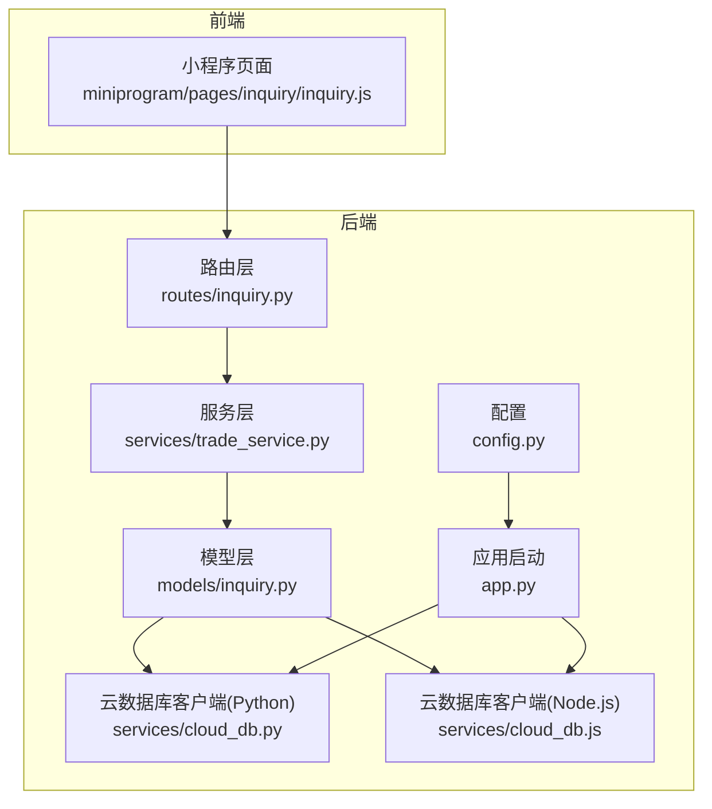
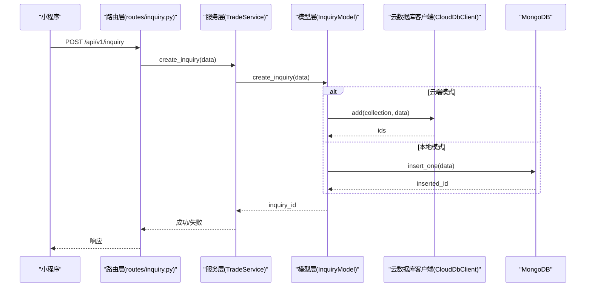
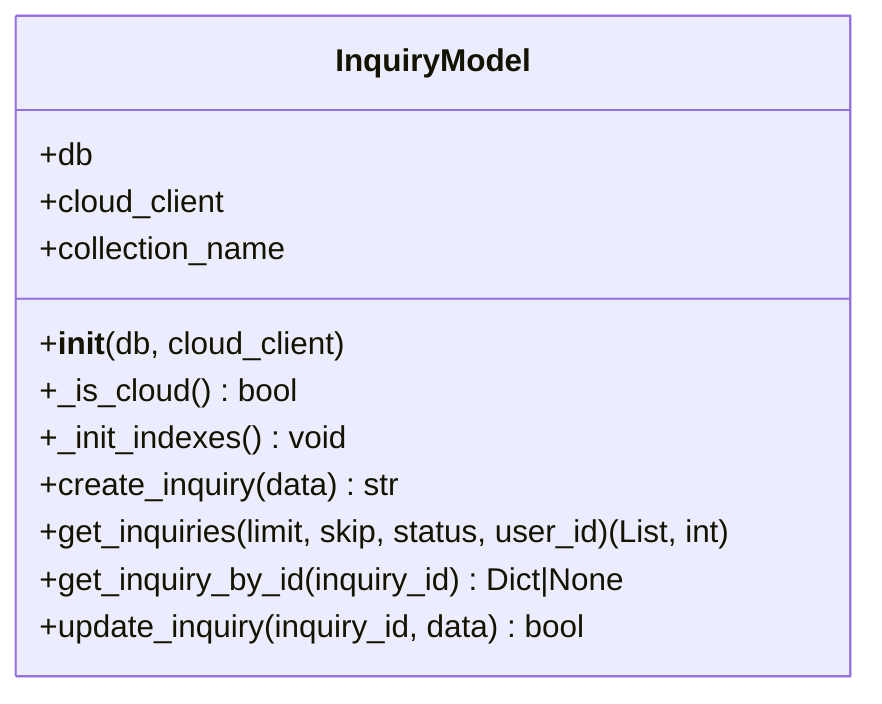
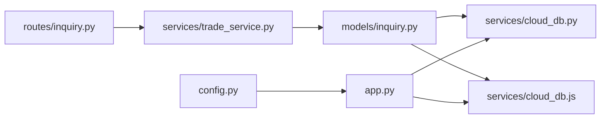

# 询价模型

<cite>
**本文引用的文件**
- [models/inquiry.py](file://models/inquiry.py)
- [services/trade_service.py](file://services/trade_service.py)
- [routes/inquiry.py](file://routes/inquiry.py)
- [services/cloud_db.py](file://services/cloud_db.py)
- [services/cloud_db.js](file://services/cloud_db.js)
- [app.py](file://app.py)
- [config.py](file://config.py)
- [miniprogram/pages/inquiry/inquiry.js](file://miniprogram/pages/inquiry/inquiry/inquiry.js)
</cite>

## 目录
1. [简介](#简介)
2. [项目结构](#项目结构)
3. [核心组件](#核心组件)
4. [架构概览](#架构概览)
5. [详细组件分析](#详细组件分析)
6. [依赖关系分析](#依赖关系分析)
7. [性能考量](#性能考量)
8. [故障排除指南](#故障排除指南)
9. [结论](#结论)
10. [附录](#附录)

## 简介
本文件系统性地文档化了“询价模型”InquiryModel的设计架构与实现细节，覆盖字段定义、业务属性、约束条件、CRUD操作、查询优化策略、索引设计、云端与本地数据库兼容性、错误处理与日志策略，并提供常见查询模式与最佳实践示例。目标读者既包括开发者，也包括需要理解系统运作原理的非技术用户。

## 项目结构
围绕询价模型的关键文件组织如下：
- 模型层：models/inquiry.py 定义 InquryModel 类及其 CRUD 方法
- 服务层：services/trade_service.py 作为业务服务入口，封装数据访问与业务逻辑
- 路由层：routes/inquiry.py 提供 REST API 接口，对接管理后台与前端
- 云数据库适配：services/cloud_db.py（Python）、services/cloud_db.js（Node.js）提供跨语言云数据库客户端
- 应用启动与配置：app.py 初始化数据库连接与云数据库客户端；config.py 定义配置项
- 前端交互：miniprogram/pages/inquiry/inquiry.js 负责小程序端询价表单与提交

图表来源
- [routes/inquiry.py](file://routes/inquiry.py#L1-L175)
- [services/trade_service.py](file://services/trade_service.py#L1-L318)
- [models/inquiry.py](file://models/inquiry.py#L1-L148)
- [services/cloud_db.py](file://services/cloud_db.py#L1-L533)
- [services/cloud_db.js](file://services/cloud_db.js#L1-L327)
- [app.py](file://app.py#L1-L350)
- [config.py](file://config.py#L1-L132)

章节来源
- [routes/inquiry.py](file://routes/inquiry.py#L1-L175)
- [services/trade_service.py](file://services/trade_service.py#L1-L318)
- [models/inquiry.py](file://models/inquiry.py#L1-L148)
- [services/cloud_db.py](file://services/cloud_db.py#L1-L533)
- [services/cloud_db.js](file://services/cloud_db.js#L1-L327)
- [app.py](file://app.py#L1-L350)
- [config.py](file://config.py#L1-L132)

## 核心组件
- InquiryModel：封装对“inquiries”集合的增删改查，自动适配云端与本地数据库，内置索引初始化与时间戳管理
- TradeService：业务服务层，负责路由与模型之间的协调，提供统一的查询与更新接口
- CloudDbClient（Python/Node.js）：云数据库客户端，提供查询、计数、新增、更新、删除、upsert、批量 upsert 等能力
- Flask 应用：初始化数据库与云数据库客户端，注册路由蓝图，提供健康检查与错误处理

章节来源
- [models/inquiry.py](file://models/inquiry.py#L10-L148)
- [services/trade_service.py](file://services/trade_service.py#L8-L318)
- [services/cloud_db.py](file://services/cloud_db.py#L108-L533)
- [services/cloud_db.js](file://services/cloud_db.js#L7-L327)
- [app.py](file://app.py#L103-L276)

## 架构概览
InquiryModel 通过 TradeService 与路由层交互，支持两种数据源：
- 云端（微信云开发）：使用 CloudDbClient 发送 TCB 查询语句，返回 JSON 解析后的文档
- 本地（MongoDB）：使用 PyMongo 对 inquiries 集合进行标准 CRUD 操作

图表来源
- [routes/inquiry.py](file://routes/inquiry.py#L11-L34)
- [services/trade_service.py](file://services/trade_service.py#L38-L40)
- [models/inquiry.py](file://models/inquiry.py#L32-L53)
- [services/cloud_db.py](file://services/cloud_db.py#L272-L283)

## 详细组件分析

### InquiryModel 设计与实现
- 数据源识别：通过构造函数注入 db 与 cloud_client，内部通过 _is_cloud() 判断当前模式
- 集合与索引：默认集合名为 inquiries，首次初始化时为 createdAt、status、phone 建立索引
- 时间戳管理：根据数据源类型选择 UTC ISO 字符串或 Python datetime 对象，统一在 create/update 时设置 createdAt/updatedAt
- 字段约定：状态字段 status 默认值为 pending；用户标识使用 openid（云端）或 userId（前端传入）

图表来源
- [models/inquiry.py](file://models/inquiry.py#L10-L148)

章节来源
- [models/inquiry.py](file://models/inquiry.py#L10-L148)

### 字段定义、业务属性与约束
- 必填字段（前端提交时校验）：selectedProduct、notionalAmount、strikePrice、contactName、contactPhone
- 业务字段（建议）：optionType、structure、term、selectedDealers、notes
- 联系信息：contactName、phone/contactPhone、contactEmail、contactInfo
- 用户标识：userId、userName、openid（云端模式下使用 openid）
- 状态管理：status（默认 pending），支持管理后台更新 remark/operator
- 时间戳：createdAt、updatedAt（云端使用 ISO 字符串，本地使用 datetime 对象）
- 历史记录：history（预留字段，当前未实现历史追加）

章节来源
- [miniprogram/pages/inquiry/inquiry.js](file://miniprogram/pages/inquiry/inquiry/inquiry.js#L501-L640)
- [models/inquiry.py](file://models/inquiry.py#L32-L53)

### CRUD 操作详解

#### create_inquiry
- 作用：创建一条询价记录
- 逻辑要点：
  - 自动填充 createdAt/updatedAt 与默认 status
  - 云端模式：调用 add(collection, data)，返回第一个 id
  - 本地模式：调用 insert_one，返回插入的 ObjectId 字符串
  - 异常捕获：记录错误日志并返回空字符串

章节来源
- [models/inquiry.py](file://models/inquiry.py#L32-L53)
- [services/trade_service.py](file://services/trade_service.py#L38-L40)

#### get_inquiries
- 作用：分页查询询价列表
- 参数：limit、skip、status、user_id（云端使用 openid）
- 云端模式：拼接 where 子句，先 count 再 get，最后将 _id 转为字符串
- 本地模式：使用 MongoDB 查询，将 ObjectId 转为字符串，将 datetime 转为 ISO 字符串
- 返回：(items, total)

章节来源
- [models/inquiry.py](file://models/inquiry.py#L55-L101)
- [services/trade_service.py](file://services/trade_service.py#L42-L45)

#### get_inquiry_by_id
- 作用：按 ID 获取单条询价
- 云端模式：使用 doc(id).get()，将 _id 转为字符串
- 本地模式：find_one，将 ObjectId 与 datetime 转换为字符串

章节来源
- [models/inquiry.py](file://models/inquiry.py#L103-L126)

#### update_inquiry
- 作用：通用更新（当前用于状态与备注）
- 逻辑要点：
  - 设置 updatedAt
  - 云端：update_where(collection, where_js, data)
  - 本地：update_one({ _id: ObjectId }, { $set: data })

章节来源
- [models/inquiry.py](file://models/inquiry.py#L128-L147)
- [services/trade_service.py](file://services/trade_service.py#L51-L68)

### 查询优化策略与索引设计
- 索引初始化：在集合创建时为 createdAt、status、phone 建立索引，提升排序与过滤效率
- 查询模式：
  - 按状态过滤：status 字段建立索引，适合管理后台筛选
  - 按用户过滤：openid 字段建立索引，适合用户维度查询
  - 按时间排序：createdAt 建立索引，支持降序分页
- 云端查询：使用 where + orderBy + skip + limit 的组合，配合 count 先统计再分页
- 本地查询：使用 sort + skip + limit，结合 count_documents 统计

章节来源
- [models/inquiry.py](file://models/inquiry.py#L24-L30)
- [models/inquiry.py](file://models/inquiry.py#L55-L101)

### 云端与本地数据库兼容性
- 数据源切换：通过构造函数注入 db/cloud_client，_is_cloud() 判断当前模式
- 云端客户端：
  - Python：CloudDbClient，提供 query/count/add/update_where/delete_where/upsert/batch_upsert
  - Node.js：CloudDbClient，提供等价方法
- 本地客户端：PyMongo，直接操作 MongoDB 集合
- 兼容性注意：
  - 云端使用 ISO 字符串时间戳，本地使用 datetime 对象
  - 云端查询使用 TCB JS 语法，本地使用 MongoDB 原生语法
  - 云端更新采用 update_where，本地采用 update_one($set)

章节来源
- [models/inquiry.py](file://models/inquiry.py#L21-L22)
- [services/cloud_db.py](file://services/cloud_db.py#L108-L533)
- [services/cloud_db.js](file://services/cloud_db.js#L7-L327)
- [app.py](file://app.py#L103-L166)

### 错误处理与日志策略
- 模型层：
  - 索引创建失败：记录警告日志
  - CRUD 失败：记录错误日志并返回空值/False
- 云数据库客户端：
  - 请求失败：抛出 CloudDbRequestError，包含重试与退避策略
  - 集合不存在：特殊处理并记录警告
- Flask 应用：
  - 全局错误处理：统一返回错误响应
  - 请求/响应日志：记录请求方法、URL、状态码

章节来源
- [models/inquiry.py](file://models/inquiry.py#L29-L30)
- [models/inquiry.py](file://models/inquiry.py#L42-L44)
- [services/cloud_db.py](file://services/cloud_db.py#L241-L247)
- [services/cloud_db.py](file://services/cloud_db.py#L526-L532)
- [app.py](file://app.py#L256-L274)

### 常见查询模式与最佳实践
- 分页查询：get_inquiries(limit, skip, status, user_id)，skip = (page-1)*limit
- 按状态统计：get_inquiries(limit=1, status=...) 循环统计各状态数量
- 按用户查询：user_id 传入 openid（云端）或 userId（本地）
- 状态更新：update_inquiry_status 仅更新 status/remark/operator
- 批量更新：管理后台提供批量更新接口，逐条调用 update_inquiry_status

章节来源
- [services/trade_service.py](file://services/trade_service.py#L42-L45)
- [services/trade_service.py](file://services/trade_service.py#L70-L94)
- [routes/inquiry.py](file://routes/inquiry.py#L36-L58)
- [routes/inquiry.py](file://routes/inquiry.py#L97-L122)

### 模型实例化与使用示例
- 服务层获取模型：TradeService._get_inquiry_model() 从 Flask 应用上下文中获取 db/cloud_db
- 路由层调用：routes/inquiry.py 中的 create_inquiry/get_inquiries 等接口
- 前端提交：小程序端构建表单数据，调用云数据库集合 inquiries 的 add 接口

章节来源
- [services/trade_service.py](file://services/trade_service.py#L12-L22)
- [routes/inquiry.py](file://routes/inquiry.py#L11-L34)
- [miniprogram/pages/inquiry/inquiry.js](file://miniprogram/pages/inquiry/inquiry/inquiry.js#L596-L639)

## 依赖关系分析

图表来源
- [routes/inquiry.py](file://routes/inquiry.py#L1-L10)
- [services/trade_service.py](file://services/trade_service.py#L12-L22)
- [models/inquiry.py](file://models/inquiry.py#L11-L19)
- [services/cloud_db.py](file://services/cloud_db.py#L162-L207)
- [services/cloud_db.js](file://services/cloud_db.js#L27-L37)
- [app.py](file://app.py#L103-L166)
- [config.py](file://config.py#L22-L62)

章节来源
- [routes/inquiry.py](file://routes/inquiry.py#L1-L10)
- [services/trade_service.py](file://services/trade_service.py#L12-L22)
- [models/inquiry.py](file://models/inquiry.py#L11-L19)
- [services/cloud_db.py](file://services/cloud_db.py#L162-L207)
- [services/cloud_db.js](file://services/cloud_db.js#L27-L37)
- [app.py](file://app.py#L103-L166)
- [config.py](file://config.py#L22-L62)

## 性能考量
- 索引策略：为高频查询字段（createdAt、status、phone）建立索引，减少扫描
- 分页与排序：使用 createdAt 降序 + skip/limit，避免全表扫描
- 云端并发：CloudDbClient 支持最大并发与重试配置，可通过环境变量调整
- 本地连接：MongoDB 连接超时设置为 1s，避免启动阻塞
- 批量操作：云数据库批量 add 限制为 100 条，批量 upsert 支持分块与并发

章节来源
- [models/inquiry.py](file://models/inquiry.py#L24-L30)
- [services/cloud_db.py](file://services/cloud_db.py#L141-L160)
- [services/cloud_db.py](file://services/cloud_db.py#L272-L283)
- [services/cloud_db.py](file://services/cloud_db.py#L331-L484)
- [app.py](file://app.py#L70-L88)

## 故障排除指南
- 云端集合不存在：云数据库客户端检测到集合不存在时记录警告，检查集合名称与环境配置
- 访问令牌失效：AccessTokenProvider 自动刷新，若多次失败需检查 WX_APPID/WX_SECRET
- 请求限流：云数据库客户端内置退避重试，遇到 QPS/频率限制会自动等待后重试
- 本地数据库连接失败：应用启动阶段记录错误并以无数据库模式运行，检查 MONGO_URI/DATABASE_NAME
- 查询无结果：确认查询条件（status、user_id）与集合数据一致性

章节来源
- [services/cloud_db.py](file://services/cloud_db.py#L243-L245)
- [services/cloud_db.py](file://services/cloud_db.py#L515-L518)
- [services/cloud_db.py](file://services/cloud_db.py#L526-L532)
- [app.py](file://app.py#L85-L88)

## 结论
InquiryModel 通过清晰的分层设计与云端/本地双数据源适配，提供了稳定可靠的询价数据管理能力。其索引策略、分页查询与错误处理机制共同保障了系统的可用性与性能。建议后续增强历史记录字段与复杂聚合统计能力，以满足更丰富的业务场景。

## 附录
- 环境变量参考：
  - WX_CLOUD_ENV、WX_APPID、WX_SECRET：云数据库配置
  - MONGO_URI、DATABASE_NAME：本地数据库配置
  - FLASK_PORT、NODE_ENV：应用端口与环境
- 常用 API：
  - POST /api/v1/inquiry：提交询价
  - GET /api/v1/admin/inquiries：管理后台查询
  - PUT /api/v1/admin/inquiries/<id>/status：更新状态
  - GET /api/v1/admin/inquiries/statistics：统计
  - POST /api/v1/admin/inquiries/batch-update：批量更新
  - GET /api/v1/admin/inquiries/export：导出

章节来源
- [config.py](file://config.py#L35-L62)
- [routes/inquiry.py](file://routes/inquiry.py#L11-L174)