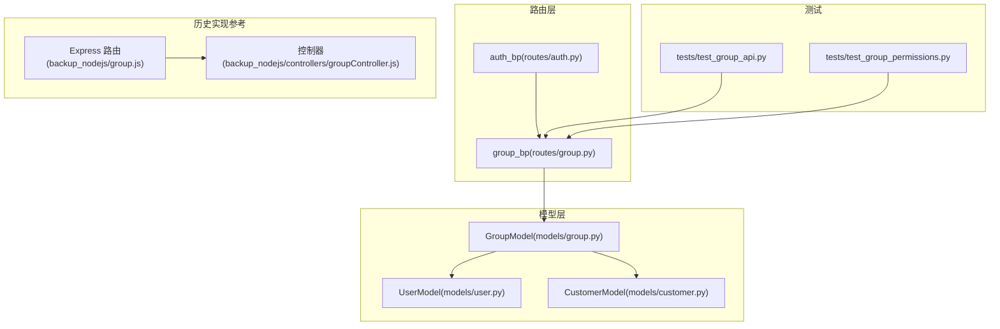
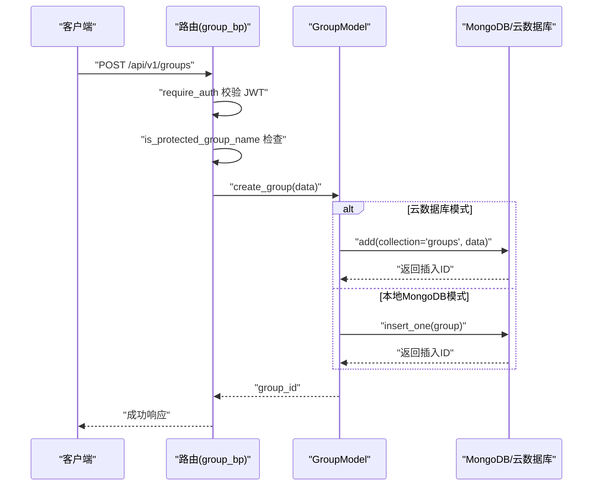
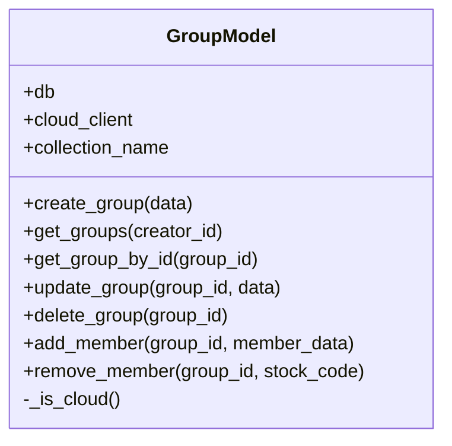
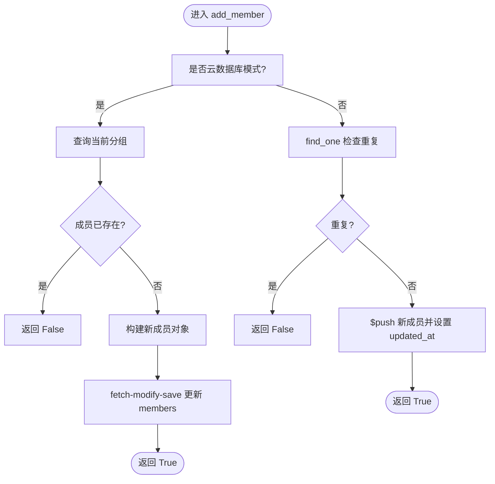
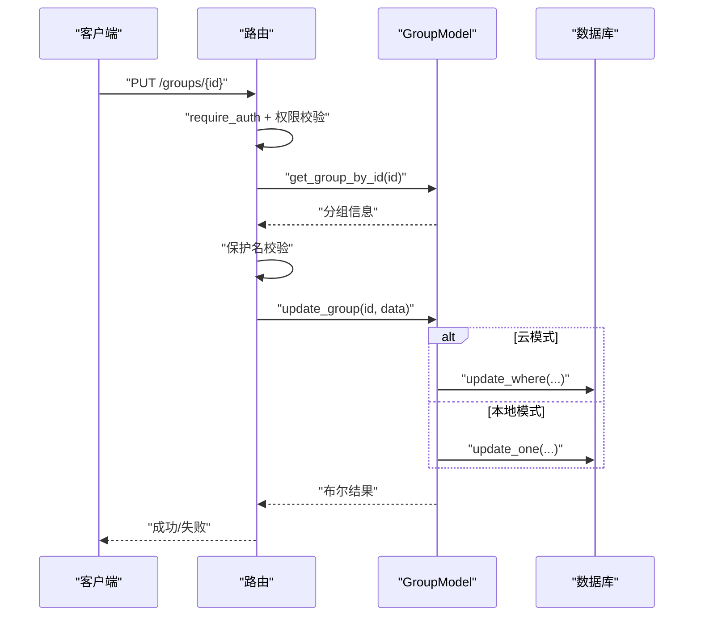
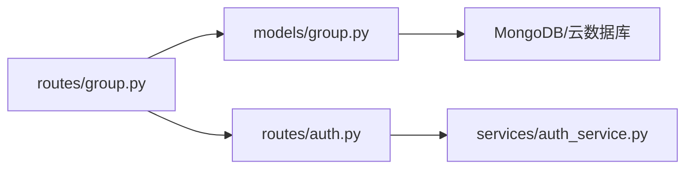

# 分组模型设计

<cite>
**本文引用的文件**
- [models/group.py](file://models/group.py)
- [routes/group.py](file://routes/group.py)
- [tests/test_group_api.py](file://tests/test_group_api.py)
- [tests/test_group_permissions.py](file://tests/test_group_permissions.py)
- [backup_nodejs/group.js](file://backup_nodejs/group.js)
- [backup_nodejs/controllers/groupController.js](file://backup_nodejs/controllers/groupController.js)
- [models/user.py](file://models/user.py)
- [models/customer.py](file://models/customer.py)
- [routes/auth.py](file://routes/auth.py)
- [services/auth_service.py](file://services/auth_service.py)
</cite>

## 目录
1. [简介](#简介)
2. [项目结构](#项目结构)
3. [核心组件](#核心组件)
4. [架构总览](#架构总览)
5. [详细组件分析](#详细组件分析)
6. [依赖关系分析](#依赖关系分析)
7. [性能考量](#性能考量)
8. [故障排查指南](#故障排查指南)
9. [结论](#结论)
10. [附录](#附录)

## 简介
本文件系统化梳理并文档化“分组模型”（GroupModel）的设计与实现，覆盖数据结构、业务逻辑、权限控制、成员管理、层级关系、一致性保障、与用户/客户的关系映射、以及扩展性与未来规划。目标读者既包括后端工程师，也包括产品经理与运维人员，力求以循序渐进的方式呈现复杂的技术细节。

## 项目结构
围绕分组模型的关键文件组织如下：
- 模型层：models/group.py 提供 GroupModel 类，封装 MongoDB 或云数据库的 CRUD 与成员增删逻辑
- 路由层：routes/group.py 提供 REST API，负责鉴权、参数校验、权限拦截与响应包装
- 测试：tests/test_group_api.py 与 tests/test_group_permissions.py 提供接口与权限行为的单元测试
- 历史实现参考：backup_nodejs 下的 Express 路由与控制器，体现早期实现思路
- 用户与客户：models/user.py 与 models/customer.py 提供用户与客户实体能力，支撑统一身份与客户分组
- 鉴权：routes/auth.py 与 services/auth_service.py 提供 JWT 鉴权与角色控制

图表来源
- [models/group.py](file://models/group.py#L10-L283)
- [routes/group.py](file://routes/group.py#L1-L269)
- [tests/test_group_api.py](file://tests/test_group_api.py#L1-L158)
- [tests/test_group_permissions.py](file://tests/test_group_permissions.py#L1-L76)
- [backup_nodejs/group.js](file://backup_nodejs/group.js#L1-L24)
- [backup_nodejs/controllers/groupController.js](file://backup_nodejs/controllers/groupController.js#L1-L268)
- [models/user.py](file://models/user.py#L10-L309)
- [models/customer.py](file://models/customer.py#L10-L300)
- [routes/auth.py](file://routes/auth.py#L1-L432)

章节来源
- [models/group.py](file://models/group.py#L10-L283)
- [routes/group.py](file://routes/group.py#L1-L269)

## 核心组件
- GroupModel：封装分组的创建、查询、更新、删除与成员管理；支持本地 MongoDB 与云数据库双模式
- 路由组（group_bp）：提供 /groups 及 /groups/<id>/members 等 REST 接口，内置鉴权与权限控制
- 测试套件：验证接口行为与权限策略
- 用户/客户模型：支撑统一身份与客户维度的分组/标签能力
- 鉴权中间件：require_auth 与 require_roles 提供基于 JWT 的认证与角色授权

章节来源
- [models/group.py](file://models/group.py#L10-L283)
- [routes/group.py](file://routes/group.py#L1-L269)
- [tests/test_group_api.py](file://tests/test_group_api.py#L1-L158)
- [tests/test_group_permissions.py](file://tests/test_group_permissions.py#L1-L76)
- [models/user.py](file://models/user.py#L10-L309)
- [models/customer.py](file://models/customer.py#L10-L300)
- [routes/auth.py](file://routes/auth.py#L1-L432)

## 架构总览
下图展示从路由到模型、再到数据库/云数据库的调用链路，以及权限控制点与数据一致性保障。

图表来源
- [routes/group.py](file://routes/group.py#L42-L66)
- [models/group.py](file://models/group.py#L23-L50)

章节来源
- [routes/group.py](file://routes/group.py#L42-L66)
- [models/group.py](file://models/group.py#L23-L50)

## 详细组件分析

### GroupModel 类设计与数据结构
- 关键字段
  - name：分组名称
  - creator_id：创建者标识
  - members：成员数组，元素包含 stock_code、market、name、added_at
  - created_at/updated_at：时间戳（UTC 字符串或 datetime 对象）
- 方法族
  - create_group：创建分组并返回 group_id
  - get_groups：按创建者过滤分组列表，支持云/本地两种模式
  - get_group_by_id：按 ID 查询单个分组
  - update_group：更新分组名称与更新时间
  - delete_group：删除分组
  - add_member/remove_member：成员增删，支持去重与 fetch-modify-save（云模式）

图表来源
- [models/group.py](file://models/group.py#L10-L283)

章节来源
- [models/group.py](file://models/group.py#L10-L283)

### 分组层级关系与权限继承机制
- 层级关系
  - 分组为一维集合，成员为“股票”实体（stock_code、market、name、added_at）
  - 当前未实现“子分组”或“树形层级”，若需扩展可在 members 中引入“子分组引用”或新增“parent_id”字段
- 权限继承
  - 路由层通过 require_auth 与 g.admin 注入的用户信息进行鉴权
  - 分组层面的“拥有者”控制：仅 creator_id 与 g.admin.role=admin 可修改/删除
  - 系统保护分组名白名单：禁止创建/重命名/删除特定保留名称

章节来源
- [routes/group.py](file://routes/group.py#L8-L20)
- [routes/group.py](file://routes/group.py#L108-L184)

### 成员管理功能
- 成员结构：stock_code、market、name、added_at
- 去重策略：云模式先查询再合并，本地模式使用 $push 并配合 find_one 查询避免重复
- 批量一致性：云模式采用 fetch-modify-save，确保原子性与一致性

图表来源
- [models/group.py](file://models/group.py#L192-L283)

章节来源
- [models/group.py](file://models/group.py#L192-L283)

### 分组创建、修改、删除流程与一致性保障
- 创建
  - 路由层：require_auth + 名称合法性 + 系统保护名校验
  - 模型层：根据 _is_cloud 判断云/本地写入；云模式集合不存在时抛出明确异常
- 修改
  - 路由层：校验分组存在、拥有者或管理员权限、保护名不可改
  - 模型层：更新 updated_at 与指定字段
- 删除
  - 路由层：校验分组存在、拥有者或管理员权限、保护名不可删
  - 模型层：删除分组记录

图表来源
- [routes/group.py](file://routes/group.py#L108-L139)
- [models/group.py](file://models/group.py#L147-L190)

章节来源
- [routes/group.py](file://routes/group.py#L108-L139)
- [models/group.py](file://models/group.py#L147-L190)

### 分组与用户、客户之间的关联关系
- 用户维度
  - 分组 creator_id 与 g.admin.sub 关联，体现“谁创建谁拥有”的所有权
  - 用户模型提供会话、登录、统一身份等能力，支撑分组的归属与权限
- 客户维度
  - 客户模型提供 groupName 字段，用于客户侧的分组/标签
  - 通过迁移脚本将用户同步到客户，实现统一身份下的客户分组
- 多对多关系
  - 分组与股票：一对多（一个分组包含多个股票）
  - 分组与用户：一对多（一个用户可创建多个分组）
  - 客户与分组：多对一（客户通过 groupName 关联到分组）

章节来源
- [models/user.py](file://models/user.py#L10-L309)
- [models/customer.py](file://models/customer.py#L10-L300)
- [routes/auth.py](file://routes/auth.py#L355-L432)

### 分组权限控制的具体实现
- 鉴权中间件
  - require_auth：解析 Bearer Token，注入 g.admin
  - require_roles：基于角色的授权装饰器
- 路由层权限
  - 创建：必须登录，且名称非系统保护名
  - 修改/删除：必须为拥有者或管理员；系统保护分组不可改名/删除
  - 查看行情：允许查看自己的或系统分组；否则需管理员

章节来源
- [routes/auth.py](file://routes/auth.py#L33-L72)
- [routes/group.py](file://routes/group.py#L42-L184)

### 实际应用场景
- 团队协作
  - 每个团队成员创建“团队分组”，将共同关注的股票加入，便于共享与复用
- 部门管理
  - 不同部门建立独立分组，结合管理员权限实现跨部门资源隔离
- 角色分配
  - 通过 g.admin.role=admin 放宽部分分组操作权限，满足运营/管理员需求
- 客户分层
  - 客户模型的 groupName 字段可与分组联动，实现客户维度的标签化管理

章节来源
- [models/customer.py](file://models/customer.py#L260-L300)
- [routes/group.py](file://routes/group.py#L242-L269)

### 扩展性设计与未来规划
- 子分组与层级
  - 引入 parent_id 或 children 字段，支持树形分组结构
- 权限模型增强
  - 引入角色/资源模型（RBAC），为分组增加读写/管理角色
- 成员类型扩展
  - 除股票外，支持“客户”、“产品”等成员类型，统一成员抽象
- 事件与审计
  - 记录分组变更事件，支持审计与回溯
- 性能优化
  - 云模式下减少 fetch-modify 次数，探索批量更新与索引优化

章节来源
- [models/group.py](file://models/group.py#L10-L283)
- [routes/group.py](file://routes/group.py#L1-L269)

## 依赖关系分析
- 组件耦合
  - 路由层依赖 GroupModel；GroupModel 依赖数据库/云数据库客户端
  - 鉴权中间件贯穿路由层，形成统一的安全入口
- 外部依赖
  - 云数据库客户端：提供 add/update_where/delete_where/query 等能力
  - Flask/JWT：提供路由、中间件与令牌解析
- 潜在循环依赖
  - 当前未见循环依赖；如引入更复杂的权限模型，需避免模型间相互引用

图表来源
- [routes/group.py](file://routes/group.py#L1-L269)
- [models/group.py](file://models/group.py#L10-L283)
- [routes/auth.py](file://routes/auth.py#L1-L432)
- [services/auth_service.py](file://services/auth_service.py#L1-L229)

章节来源
- [routes/group.py](file://routes/group.py#L1-L269)
- [models/group.py](file://models/group.py#L10-L283)
- [routes/auth.py](file://routes/auth.py#L1-L432)
- [services/auth_service.py](file://services/auth_service.py#L1-L229)

## 性能考量
- 查询优化
  - 本地模式：对 creator_id 建索引，提升分组列表查询效率
  - 云模式：尽量使用 where 条件与 orderBy，避免全表扫描
- 写入优化
  - 成员增删采用 fetch-modify-save，确保一致性；可考虑批量更新以降低往返次数
- 时间序列
  - created_at/updated_at 保持 UTC 字符串，避免序列化差异

章节来源
- [models/group.py](file://models/group.py#L52-L108)
- [models/group.py](file://models/group.py#L192-L283)

## 故障排查指南
- 数据库未连接
  - 现象：接口返回“数据库未连接”
  - 排查：确认 ensure_db/cloud_db 初始化；检查连接参数
- 集合不存在（云数据库）
  - 现象：创建/查询时报错提示集合不存在
  - 排查：在云开发控制台创建对应集合（如 groups）
- 权限不足
  - 现象：修改/删除/查看行情返回 403
  - 排查：确认 g.admin 中的 role 是否为 admin；确认分组是否为系统保护名
- 成员重复
  - 现象：添加成员返回失败或已存在
  - 排查：确认 stock_code 是否重复；云模式下先查询再更新

章节来源
- [models/group.py](file://models/group.py#L38-L45)
- [routes/group.py](file://routes/group.py#L113-L131)
- [routes/group.py](file://routes/group.py#L191-L212)

## 结论
GroupModel 以清晰的数据结构与严格的权限控制，实现了分组的创建、查询、更新、删除与成员管理。其云/本地双模式适配与 fetch-modify-save 保证了在云数据库场景下的数据一致性。结合用户/客户模型与鉴权中间件，形成了完整的身份与权限体系。未来可在层级化、权限模型、成员类型与审计等方面进一步演进，以满足更复杂的业务场景。

## 附录
- 历史实现参考
  - Express 路由与控制器展示了早期的分组 CRUD 与成员管理思路，可作为对比与迁移参考

章节来源
- [backup_nodejs/group.js](file://backup_nodejs/group.js#L1-L24)
- [backup_nodejs/controllers/groupController.js](file://backup_nodejs/controllers/groupController.js#L1-L268)