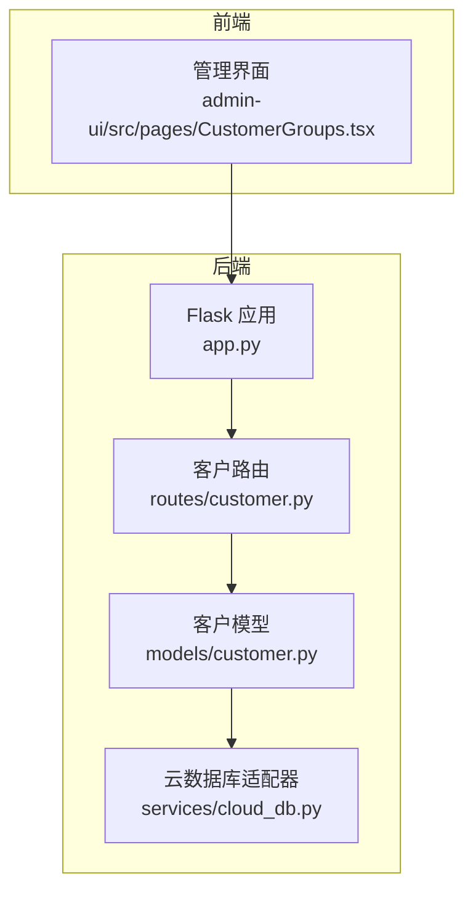
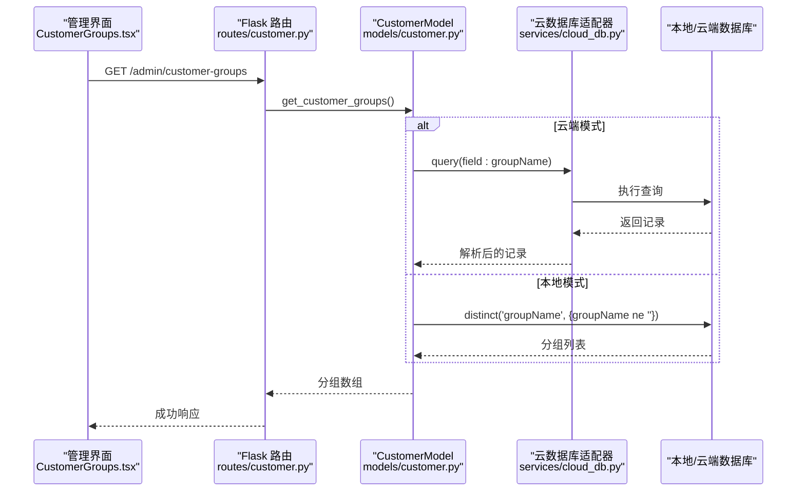
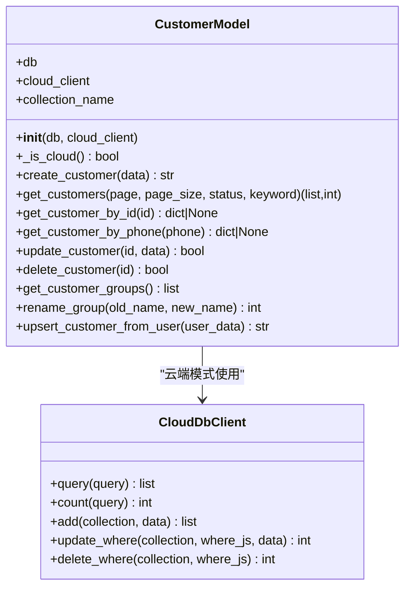
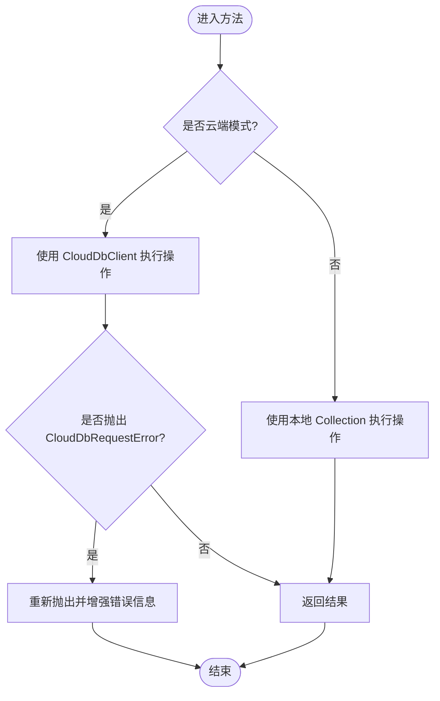
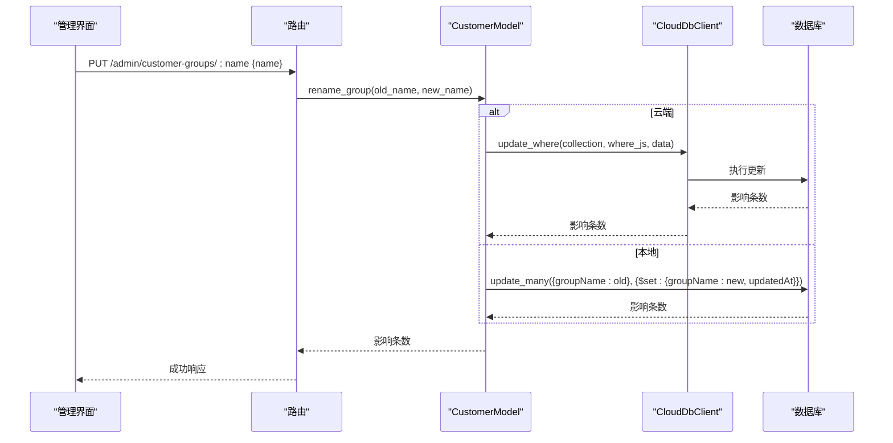
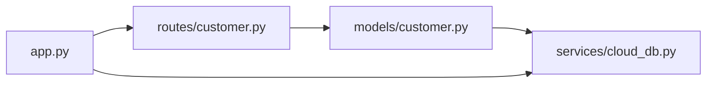

# 客户模型设计

<cite>
**本文引用的文件**
- [models/customer.py](file://models/customer.py)
- [routes/customer.py](file://routes/customer.py)
- [services/cloud_db.py](file://services/cloud_db.py)
- [app.py](file://app.py)
- [tests/test_fixes.py](file://tests/test_fixes.py)
- [admin-ui/src/pages/CustomerGroups.tsx](file://admin-ui/src/pages/CustomerGroups.tsx)
</cite>

## 目录
1. [简介](#简介)
2. [项目结构](#项目结构)
3. [核心组件](#核心组件)
4. [架构总览](#架构总览)
5. [详细组件分析](#详细组件分析)
6. [依赖关系分析](#依赖关系分析)
7. [性能考虑](#性能考虑)
8. [故障排除指南](#故障排除指南)
9. [结论](#结论)
10. [附录](#附录)

## 简介
本文件面向“客户模型”的设计与实现，围绕 CustomerModel 类展开，系统性阐述其数据结构、字段定义、业务规则、CRUD 方法、云端与本地数据库适配机制、分组管理能力，以及最佳实践与常见问题排查。文档同时提供关键流程的时序图与类图，帮助读者快速理解并正确使用该模型。

## 项目结构
本项目采用前后端分离与多语言混合架构：后端使用 Python Flask 提供 REST API；前端使用 TypeScript/React 构建管理界面；数据层支持本地 MongoDB 与微信云开发数据库两种存储后端。客户模型位于 models/customer.py，路由位于 routes/customer.py，云数据库适配器位于 services/cloud_db.py，应用入口在 app.py。

**图表来源**
- [app.py](file://app.py#L103-L200)
- [routes/customer.py](file://routes/customer.py#L1-L217)
- [models/customer.py](file://models/customer.py#L10-L300)
- [services/cloud_db.py](file://services/cloud_db.py#L108-L533)
- [admin-ui/src/pages/CustomerGroups.tsx](file://admin-ui/src/pages/CustomerGroups.tsx#L1-L124)

**章节来源**
- [app.py](file://app.py#L103-L200)
- [routes/customer.py](file://routes/customer.py#L1-L217)
- [models/customer.py](file://models/customer.py#L10-L300)
- [services/cloud_db.py](file://services/cloud_db.py#L108-L533)
- [admin-ui/src/pages/CustomerGroups.tsx](file://admin-ui/src/pages/CustomerGroups.tsx#L1-L124)

## 核心组件
- CustomerModel：封装客户数据的增删改查、分组查询与批量重命名、统一云端/本地适配。
- 路由层：提供 /customers、/customer-groups 等 API，负责参数校验、鉴权与响应包装。
- 云数据库适配器：抽象微信云开发数据库的查询、计数、新增、更新、删除等操作，抛出统一异常类型。
- 应用入口：初始化本地数据库与云数据库客户端，注入到蓝图中供路由使用。

**章节来源**
- [models/customer.py](file://models/customer.py#L10-L300)
- [routes/customer.py](file://routes/customer.py#L1-L217)
- [services/cloud_db.py](file://services/cloud_db.py#L108-L533)
- [app.py](file://app.py#L103-L200)

## 架构总览
下图展示了从前端到后端、再到数据层的整体交互流程，重点体现云端与本地数据库的切换逻辑与异常处理策略。

**图表来源**
- [admin-ui/src/pages/CustomerGroups.tsx](file://admin-ui/src/pages/CustomerGroups.tsx#L22-L34)
- [routes/customer.py](file://routes/customer.py#L175-L191)
- [models/customer.py](file://models/customer.py#L260-L280)
- [services/cloud_db.py](file://services/cloud_db.py#L209-L248)

## 详细组件分析

### CustomerModel 类设计
- 设计要点
  - 统一构造函数接收本地数据库连接与云数据库客户端，内部根据是否存在云客户端决定运行模式。
  - 通过 _is_cloud 判断当前模式，所有 CRUD 方法按需分支处理。
  - 字段标准化：统一时间字段格式（云端使用 ISO 字符串，本地使用 datetime 对象），并在序列化时转换为字符串。
  - 异常处理：对 CloudDbRequestError 进行捕获与二次抛出，增强错误提示（如集合不存在时给出创建指引）。

- 关键方法
  - create_customer：创建客户，云端模式先按手机号检查重复，再调用 add；本地模式同理。
  - get_customers：分页查询，支持状态过滤与关键词模糊检索（云端使用正则，本地使用 $or）。
  - get_customer_by_id / get_customer_by_phone：按主键或手机号查询，统一返回结构。
  - update_customer：允许更新 name、phone、email、status、groupName，统一设置 updatedAt。
  - delete_customer：按主键删除。
  - get_customer_groups：云端通过 field 查询 + distinct 去重，本地使用 distinct。
  - rename_group：批量更新旧分组名为新分组名，统一设置 updatedAt。

**图表来源**
- [models/customer.py](file://models/customer.py#L10-L300)
- [services/cloud_db.py](file://services/cloud_db.py#L108-L533)

**章节来源**
- [models/customer.py](file://models/customer.py#L10-L300)

### 数据结构与字段定义
- 必填字段
  - name：客户姓名
  - phone：手机号（唯一索引约束）
- 可选字段
  - email：邮箱
  - status：状态，默认 active
  - groupName：分组名
  - user_id：关联用户表的标识
  - openid：关联微信的标识
  - totalOrders：累计订单数（默认 0）
- 时间字段
  - createdAt / updatedAt：创建与更新时间，云端使用 ISO 字符串，本地使用 datetime 对象

**章节来源**
- [models/customer.py](file://models/customer.py#L23-L36)
- [models/customer.py](file://models/customer.py#L219-L244)

### 业务规则
- 重复检查
  - 创建客户前，云端与本地均按 phone 检查重复，若存在则抛出错误。
- 分组管理
  - 分组来源于 groupName 字段，云端通过字段提取 + 去重聚合，本地通过 distinct。
  - 重命名分组为批量更新操作，统一设置 updatedAt。
- 权限控制
  - 客户 CRUD 路由要求认证与角色（admin/editor），分组重命名同样要求相应权限。

**章节来源**
- [models/customer.py](file://models/customer.py#L38-L64)
- [models/customer.py](file://models/customer.py#L260-L299)
- [routes/customer.py](file://routes/customer.py#L102-L131)
- [routes/customer.py](file://routes/customer.py#L133-L152)
- [routes/customer.py](file://routes/customer.py#L154-L172)
- [routes/customer.py](file://routes/customer.py#L174-L216)

### 云端与本地数据库适配机制
- 适配策略
  - 云端：通过 CloudDbClient 发起查询、计数、新增、更新、删除等操作，使用 JavaScript 风格查询字符串。
  - 本地：直接使用 PyMongo 的 Collection 接口。
- 错误处理
  - CloudDbRequestError：捕获并针对“集合不存在”场景给出明确提示，引导用户在云开发控制台创建集合。
- 连接注入
  - 应用启动时初始化 cloud_db 客户端并注入到 Flask 应用上下文，路由通过 get_model() 获取实例。

**图表来源**
- [models/customer.py](file://models/customer.py#L38-L64)
- [services/cloud_db.py](file://services/cloud_db.py#L241-L270)
- [app.py](file://app.py#L121-L152)

**章节来源**
- [models/customer.py](file://models/customer.py#L38-L64)
- [services/cloud_db.py](file://services/cloud_db.py#L241-L270)
- [app.py](file://app.py#L121-L152)

### 客户分组管理
- 获取分组
  - 云端：查询字段并去重，限制返回数量以避免大数据集性能问题。
  - 本地：使用 distinct 过滤非空分组。
- 重命名分组
  - 云端：使用 update_where 批量更新，统一设置 updatedAt。
  - 本地：使用 update_many 批量更新，统一设置 updatedAt。
- 前端集成
  - 管理界面提供分组列表与重命名弹窗，调用 /admin/customer-groups 与 /admin/customer-groups/:name。

**图表来源**
- [routes/customer.py](file://routes/customer.py#L193-L216)
- [models/customer.py](file://models/customer.py#L282-L299)
- [services/cloud_db.py](file://services/cloud_db.py#L285-L303)

**章节来源**
- [models/customer.py](file://models/customer.py#L260-L299)
- [routes/customer.py](file://routes/customer.py#L174-L216)
- [admin-ui/src/pages/CustomerGroups.tsx](file://admin-ui/src/pages/CustomerGroups.tsx#L22-L57)

### CRUD 操作最佳实践
- 创建客户
  - 前端/调用方必须提供 name 与 phone；云端模式会预先检查重复，避免并发冲突。
  - 建议在调用前先调用 get_customer_by_phone 做幂等检查。
- 查询客户
  - 支持分页、状态过滤与关键词模糊查询；云端使用正则，本地使用 $or。
  - 注意云端正则的大小写不敏感选项与特殊字符转义。
- 更新客户
  - 仅允许更新白名单字段；统一设置 updatedAt。
  - 若需批量重命名分组，优先使用 rename_group，避免逐条更新。
- 删除客户
  - 删除前确认客户不存在关联订单等业务约束（模型层未强制校验）。

**章节来源**
- [routes/customer.py](file://routes/customer.py#L102-L131)
- [routes/customer.py](file://routes/customer.py#L133-L152)
- [routes/customer.py](file://routes/customer.py#L154-L172)
- [models/customer.py](file://models/customer.py#L23-L36)
- [models/customer.py](file://models/customer.py#L119-L177)
- [models/customer.py](file://models/customer.py#L219-L258)

### 代码示例（路径引用）
- 创建客户
  - 路由：[routes/customer.py](file://routes/customer.py#L102-L131)
  - 模型：[models/customer.py](file://models/customer.py#L23-L64)
- 查询客户列表
  - 路由：[routes/customer.py](file://routes/customer.py#L26-L69)
  - 模型：[models/customer.py](file://models/customer.py#L119-L177)
- 获取客户详情
  - 路由：[routes/customer.py](file://routes/customer.py#L71-L100)
  - 模型：[models/customer.py](file://models/customer.py#L179-L202)
- 更新客户
  - 路由：[routes/customer.py](file://routes/customer.py#L133-L152)
  - 模型：[models/customer.py](file://models/customer.py#L219-L244)
- 删除客户
  - 路由：[routes/customer.py](file://routes/customer.py#L154-L172)
  - 模型：[models/customer.py](file://models/customer.py#L246-L258)
- 获取分组
  - 路由：[routes/customer.py](file://routes/customer.py#L174-L191)
  - 模型：[models/customer.py](file://models/customer.py#L260-L280)
- 重命名分组
  - 路由：[routes/customer.py](file://routes/customer.py#L193-L216)
  - 模型：[models/customer.py](file://models/customer.py#L282-L299)
- 单元测试示例（端到端）
  - [tests/test_fixes.py](file://tests/test_fixes.py#L64-L95)

**章节来源**
- [routes/customer.py](file://routes/customer.py#L26-L216)
- [models/customer.py](file://models/customer.py#L23-L299)
- [tests/test_fixes.py](file://tests/test_fixes.py#L64-L95)

## 依赖关系分析
- 组件耦合
  - CustomerModel 依赖本地 PyMongo Collection 与 CloudDbClient，二者通过 _is_cloud 判定解耦。
  - 路由层通过 get_model() 获取 CustomerModel 实例，避免直接依赖具体数据库实现。
- 外部依赖
  - 云数据库适配器依赖微信云开发 API，统一异常类型 CloudDbRequestError。
  - 应用入口负责初始化本地与云端客户端，并注入到 Flask 上下文。

**图表来源**
- [routes/customer.py](file://routes/customer.py#L15-L24)
- [models/customer.py](file://models/customer.py#L10-L300)
- [services/cloud_db.py](file://services/cloud_db.py#L108-L533)
- [app.py](file://app.py#L103-L200)

**章节来源**
- [routes/customer.py](file://routes/customer.py#L15-L24)
- [models/customer.py](file://models/customer.py#L10-L300)
- [services/cloud_db.py](file://services/cloud_db.py#L108-L533)
- [app.py](file://app.py#L103-L200)

## 性能考虑
- 分页与排序
  - get_customers 在云端使用 orderBy + skip + limit，在本地使用 sort + skip + limit。
- 正则查询
  - 云端使用 db.RegExp，注意正则转义与大小写不敏感选项；本地使用 $or + $regex。
- 批量更新
  - rename_group 使用 update_where 或 update_many，避免逐条更新带来的网络与事务开销。
- 云端限制
  - 云端 distinct 能力有限，采用字段查询 + 去重策略；建议控制返回数量上限，避免大数据集性能问题。

**章节来源**
- [models/customer.py](file://models/customer.py#L119-L177)
- [models/customer.py](file://models/customer.py#L260-L299)

## 故障排除指南
- 云数据库集合不存在
  - 现象：查询/计数/新增等操作返回空或抛出 CloudDbRequestError。
  - 处理：根据错误信息在微信云开发控制台创建对应集合（如 customers、groups）。
- 请求繁忙/限流
  - 现象：出现“请求繁忙，请稍后重试”或速率限制错误。
  - 处理：降低并发或等待重试；检查 WX_DB_MAX_INFLIGHT/WX_DB_MAX_RETRIES 环境变量。
- 本地数据库未连接
  - 现象：路由返回“数据库未连接”，或模型抛出 RuntimeError。
  - 处理：检查 MONGO_URI 与 DATABASE_NAME 环境变量，确认 MongoDB 服务可用。
- 重复手机号
  - 现象：创建客户时报“该手机号已存在”。
  - 处理：先调用 get_customer_by_phone 检查，或在调用前做幂等校验。

**章节来源**
- [services/cloud_db.py](file://services/cloud_db.py#L241-L270)
- [services/cloud_db.py](file://services/cloud_db.py#L523-L532)
- [models/customer.py](file://models/customer.py#L38-L64)
- [app.py](file://app.py#L69-L88)

## 结论
CustomerModel 通过统一的数据结构与方法抽象，实现了云端与本地数据库的无缝适配，提供了完善的客户 CRUD 与分组管理能力。结合路由层的鉴权与响应包装，形成了一套清晰、可维护、可扩展的客户数据管理方案。建议在生产环境中配合幂等检查、批量更新与合理的分页策略，持续优化性能与稳定性。

## 附录
- 端到端测试参考
  - [tests/test_fixes.py](file://tests/test_fixes.py#L64-L95)