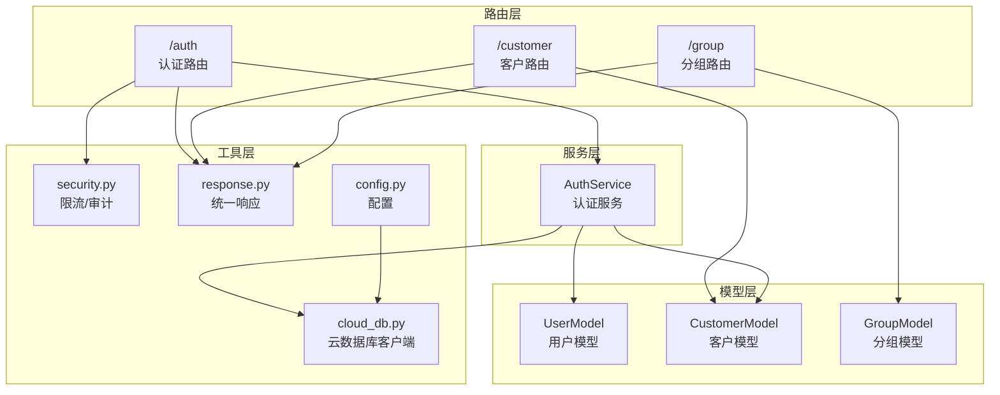
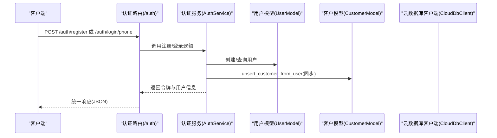
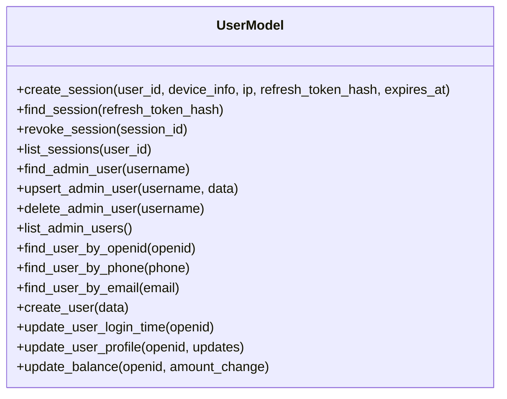
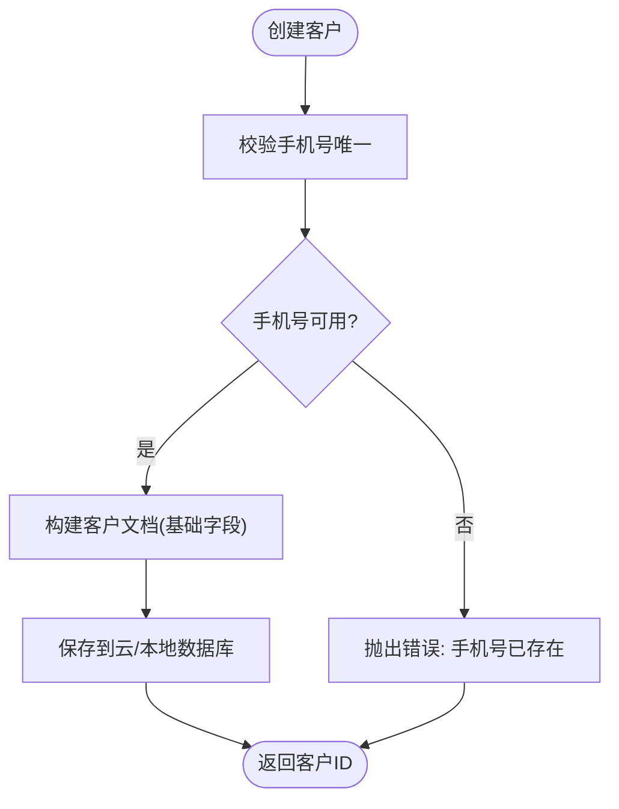
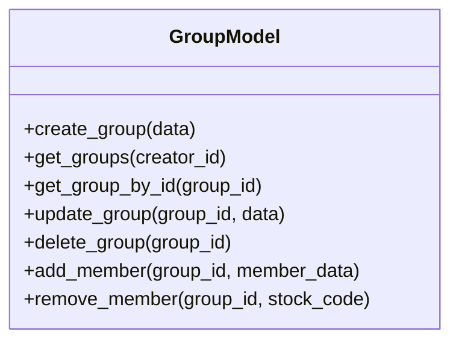
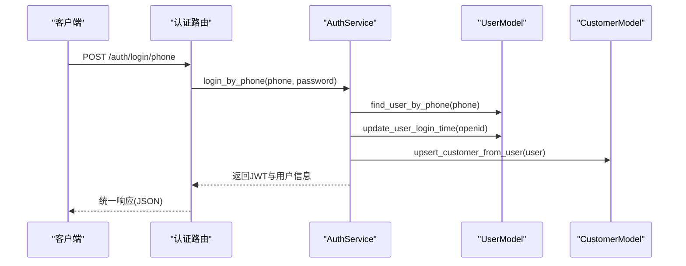
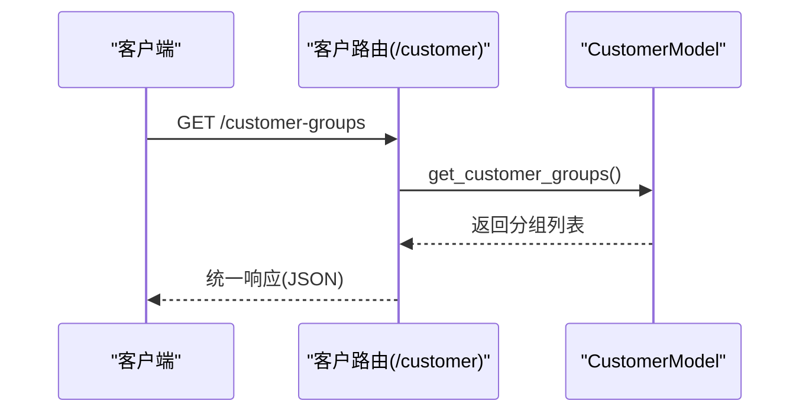
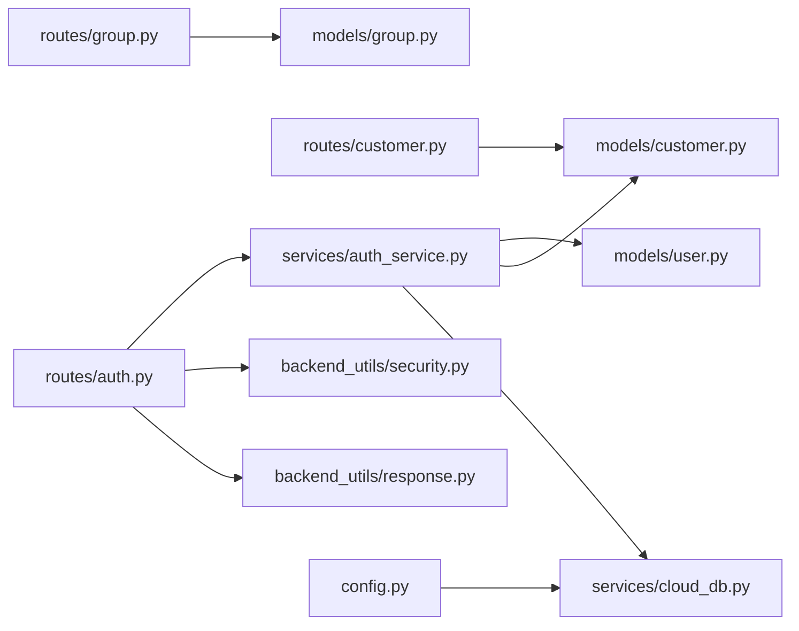

# 用户与客户模型

<cite>
**本文引用的文件**
- [models/user.py](file://models/user.py)
- [models/customer.py](file://models/customer.py)
- [models/group.py](file://models/group.py)
- [routes/auth.py](file://routes/auth.py)
- [routes/customer.py](file://routes/customer.py)
- [routes/group.py](file://routes/group.py)
- [services/auth_service.py](file://services/auth_service.py)
- [backend_utils/security.py](file://backend_utils/security.py)
- [backend_utils/response.py](file://backend_utils/response.py)
- [services/cloud_db.py](file://services/cloud_db.py)
- [config.py](file://config.py)
</cite>

## 目录
1. [简介](#简介)
2. [项目结构](#项目结构)
3. [核心组件](#核心组件)
4. [架构总览](#架构总览)
5. [详细组件分析](#详细组件分析)
6. [依赖关系分析](#依赖关系分析)
7. [性能考量](#性能考量)
8. [故障排查指南](#故障排查指南)
9. [结论](#结论)
10. [附录](#附录)

## 简介
本文件面向“用户与客户模型”的综合文档，聚焦以下目标：
- 设计架构：用户模型、客户模型、分组模型的职责边界与协作方式
- 权限体系：角色分级、鉴权中间件、路由级权限控制
- 客户管理：客户信息、联系信息、分组与重命名、客户等级字段
- 关联关系：用户与客户的一致性同步、数据一致性策略
- 认证与安全：登录、注册、令牌签发与刷新、会话存储、速率限制与审计日志
- 最佳实践：代码示例路径、常见问题与排障建议

## 项目结构
本项目采用“模型-服务-路由-工具”分层组织，用户与客户相关的核心文件如下：
- 模型层：用户、客户、分组模型，负责数据持久化与查询封装
- 服务层：认证服务，负责密码哈希、令牌签发、登录/注册、微信登录、用户与客户同步
- 路由层：认证路由、客户管理路由、分组管理路由，负责HTTP接口与权限控制
- 工具层：统一响应、安全装饰器（限流/审计）、云数据库客户端

图表来源
- [routes/auth.py](file://routes/auth.py#L1-L353)
- [routes/customer.py](file://routes/customer.py#L1-L217)
- [routes/group.py](file://routes/group.py#L1-L269)
- [services/auth_service.py](file://services/auth_service.py#L1-L416)
- [models/user.py](file://models/user.py#L1-L309)
- [models/customer.py](file://models/customer.py#L1-L300)
- [models/group.py](file://models/group.py#L1-L283)
- [backend_utils/security.py](file://backend_utils/security.py#L1-L117)
- [backend_utils/response.py](file://backend_utils/response.py#L1-L118)
- [services/cloud_db.py](file://services/cloud_db.py#L1-L533)
- [config.py](file://config.py#L1-L132)

章节来源
- [routes/auth.py](file://routes/auth.py#L1-L353)
- [routes/customer.py](file://routes/customer.py#L1-L217)
- [routes/group.py](file://routes/group.py#L1-L269)
- [services/auth_service.py](file://services/auth_service.py#L1-L416)
- [models/user.py](file://models/user.py#L1-L309)
- [models/customer.py](file://models/customer.py#L1-L300)
- [models/group.py](file://models/group.py#L1-L283)
- [backend_utils/security.py](file://backend_utils/security.py#L1-L117)
- [backend_utils/response.py](file://backend_utils/response.py#L1-L118)
- [services/cloud_db.py](file://services/cloud_db.py#L1-L533)
- [config.py](file://config.py#L1-L132)

## 核心组件
- 用户模型（UserModel）
  - 负责用户数据的增删改查、会话管理（创建、查找、撤销、列出）、管理员用户管理（查询、新增/更新、删除、列表）
  - 支持本地MongoDB与微信云数据库双模式
- 客户模型（CustomerModel）
  - 负责客户信息的创建、查询、更新、删除；支持按ID/手机号查询；支持分组列表与重命名
  - 提供“从用户数据向上同步到客户”的能力
- 分组模型（GroupModel）
  - 负责分组的创建、查询、更新、删除；支持成员（股票）的添加与移除
  - 保护系统保留分组名称，防止误操作
- 认证服务（AuthService）
  - 密码哈希与校验、JWT签发与刷新、登录/注册、微信登录、用户资料更新、用户与客户同步
- 路由与中间件
  - 认证中间件（Bearer令牌解码、角色校验）、限流与审计装饰器、统一响应格式

章节来源
- [models/user.py](file://models/user.py#L1-L309)
- [models/customer.py](file://models/customer.py#L1-L300)
- [models/group.py](file://models/group.py#L1-L283)
- [services/auth_service.py](file://services/auth_service.py#L1-L416)
- [routes/auth.py](file://routes/auth.py#L1-L353)
- [backend_utils/security.py](file://backend_utils/security.py#L1-L117)
- [backend_utils/response.py](file://backend_utils/response.py#L1-L118)

## 架构总览
用户与客户模型围绕“统一身份”展开：用户在登录/注册后，会同步到客户集合，保证用户与客户的一致性。认证服务贯穿登录、注册、微信登录、令牌签发与刷新等流程；路由层通过中间件实现鉴权与权限控制；模型层抽象数据库访问，支持本地与云数据库双写。

图表来源
- [routes/auth.py](file://routes/auth.py#L247-L303)
- [services/auth_service.py](file://services/auth_service.py#L356-L411)
- [models/user.py](file://models/user.py#L239-L289)
- [models/customer.py](file://models/customer.py#L66-L117)
- [services/cloud_db.py](file://services/cloud_db.py#L108-L207)

## 详细组件分析

### 用户模型（UserModel）
- 职责
  - 用户数据：创建、按手机号/邮箱/微信OpenID查询、更新资料、更新登录时间
  - 会话管理：创建会话（包含设备信息、IP、刷新令牌哈希、过期时间）、查找活跃会话、撤销会话、列出会话
  - 管理员用户：按用户名查询、新增/更新（含角色与密码哈希）、删除、列表（过滤敏感字段）
  - 余额原子性更新（本地模式下通过fetch-update实现）
- 数据一致性
  - 云数据库与本地数据库模式切换通过内部方法判断，避免重复逻辑
- 安全要点
  - 刷新令牌以哈希形式存储于会话集合，刷新时校验并旋转旧会话

图表来源
- [models/user.py](file://models/user.py#L10-L309)

章节来源
- [models/user.py](file://models/user.py#L1-L309)

### 客户模型（CustomerModel）
- 职责
  - 客户创建：校验手机号唯一性，构造基础字段（名称、电话、邮箱、状态、分组名、用户ID、微信OpenID、订单数、时间戳）
  - 查询：分页查询、按ID/手机号查询、按状态与关键词检索
  - 更新/删除：允许字段白名单更新，删除支持
  - 分组管理：获取分组列表（云/本地实现差异）、重命名分组（批量更新）
  - 与用户同步：从用户数据向上同步，确保统一身份
- 关键点
  - 云数据库模式下，集合不存在时抛出明确提示，便于快速定位
  - 重命名分组时更新时间戳，保证审计与排序

图表来源
- [models/customer.py](file://models/customer.py#L23-L64)

章节来源
- [models/customer.py](file://models/customer.py#L1-L300)

### 分组模型（GroupModel）
- 职责
  - 分组生命周期：创建、查询（按创建者筛选）、按ID查询、更新、删除
  - 成员管理：添加/移除股票成员（去重、带市场与名称、添加时间）
  - 保护机制：保留系统分组名，禁止创建/重命名/删除
- 安全与一致性
  - 云/本地模式下均进行存在性检查与去重判断
  - 成员数组更新在云模式下采用“读取-修改-写回”，避免复杂命令

图表来源
- [models/group.py](file://models/group.py#L10-L283)

章节来源
- [models/group.py](file://models/group.py#L1-L283)

### 认证与权限体系
- 角色与权限
  - 角色顺序：viewer(10) < editor(20) < admin(30)
  - 路由级权限：require_roles装饰器按角色白名单校验
- 认证流程
  - 登录/注册：密码哈希、JWT签发（Access/Refresh），刷新令牌时校验会话并旋转旧会话
  - 微信登录：支持开发模式Mock与真实API，成功后同步用户到客户
  - 用户资料更新：仅用户角色可更新昵称/头像/手机，更新后同步到客户
- 安全装饰器
  - 限流：基于IP+端点维度的滑动窗口限流
  - 审计：记录用户、IP、动作、状态

图表来源
- [routes/auth.py](file://routes/auth.py#L278-L303)
- [services/auth_service.py](file://services/auth_service.py#L393-L411)
- [models/user.py](file://models/user.py#L256-L271)
- [models/customer.py](file://models/customer.py#L66-L117)

章节来源
- [routes/auth.py](file://routes/auth.py#L1-L353)
- [services/auth_service.py](file://services/auth_service.py#L1-L416)
- [backend_utils/security.py](file://backend_utils/security.py#L1-L117)

### 客户管理与分组管理路由
- 客户路由
  - 列表/详情：分页、状态过滤、关键词搜索
  - 创建/更新/删除：管理员/编辑权限
  - 分组列表与重命名：支持批量更新
- 分组路由
  - 创建/查询/更新/删除：按创建者与系统保护名控制
  - 成员增删：按创建者或管理员控制
  - 行情查询：按创建者或系统保护分组控制

图表来源
- [routes/customer.py](file://routes/customer.py#L174-L191)
- [models/customer.py](file://models/customer.py#L260-L281)

章节来源
- [routes/customer.py](file://routes/customer.py#L1-L217)
- [routes/group.py](file://routes/group.py#L1-L269)

## 依赖关系分析
- 模块耦合
  - 路由依赖服务层（AuthService），服务层依赖模型层（UserModel/CustomerModel），模型层依赖云数据库客户端
  - 安全装饰器与统一响应独立于业务逻辑，降低耦合
- 外部依赖
  - 微信云数据库：AccessTokenProvider与CloudDbClient封装HTTP API
  - Flask中间件：蓝图、g对象传递认证上下文
- 潜在循环依赖
  - 通过延迟导入避免模型与服务互相导入

图表来源
- [routes/auth.py](file://routes/auth.py#L1-L353)
- [routes/customer.py](file://routes/customer.py#L1-L217)
- [routes/group.py](file://routes/group.py#L1-L269)
- [services/auth_service.py](file://services/auth_service.py#L1-L416)
- [models/user.py](file://models/user.py#L1-L309)
- [models/customer.py](file://models/customer.py#L1-L300)
- [models/group.py](file://models/group.py#L1-L283)
- [services/cloud_db.py](file://services/cloud_db.py#L1-L533)
- [backend_utils/security.py](file://backend_utils/security.py#L1-L117)
- [backend_utils/response.py](file://backend_utils/response.py#L1-L118)
- [config.py](file://config.py#L1-L132)

章节来源
- [services/auth_service.py](file://services/auth_service.py#L33-L43)
- [services/cloud_db.py](file://services/cloud_db.py#L108-L207)

## 性能考量
- 云数据库并发与重试
  - CloudDbClient内置线程池、信号量与指数退避重试，支持批量Upsert与并行查询
  - 默认最大并发与工作线程可通过环境变量调整
- 本地模式优化
  - 用户余额更新采用fetch-update，避免云数据库原子自增API复杂度
- 路由层分页与查询
  - 客户列表支持分页、状态与关键词过滤，云/本地实现一致化处理
- 缓存与会话
  - 会话以刷新令牌哈希存储，刷新时旋转旧会话，降低撞库风险

[本节为通用指导，无需特定文件引用]

## 故障排查指南
- 云数据库集合不存在
  - 现象：查询/统计返回空或抛出集合不存在错误
  - 处理：在微信云开发控制台创建对应集合；参考云数据库客户端的错误提示
- 令牌过期或无效
  - 现象：401未登录/过期
  - 处理：使用刷新令牌刷新；检查JWT密钥与算法配置
- 手机号重复
  - 现象：创建客户/注册时报手机号已存在
  - 处理：检查手机号唯一性；必要时清理重复数据
- 会话未找到或已撤销
  - 现象：刷新令牌失败
  - 处理：确认会话是否仍处于激活状态；检查会话存储与哈希一致性

章节来源
- [models/customer.py](file://models/customer.py#L48-L54)
- [services/auth_service.py](file://services/auth_service.py#L133-L160)
- [services/cloud_db.py](file://services/cloud_db.py#L243-L247)

## 结论
本系统通过“统一身份”与“角色驱动”的权限体系，实现了用户与客户数据的一致性与可追溯性。模型层抽象数据库访问，服务层封装认证与同步，路由层提供细粒度权限控制，工具层提供限流与审计保障。建议在生产环境中：
- 明确配置密钥与环境变量
- 在云开发控制台预先创建所需集合
- 严格区分管理员/编辑/访客角色
- 使用刷新令牌与会话旋转提升安全性
- 对高频接口启用限流与审计

[本节为总结，无需特定文件引用]

## 附录

### 用户与客户关联关系与数据同步
- 关联字段
  - 客户文档包含user_id与openid，指向用户集合
- 同步策略
  - 登录/注册/微信登录成功后，调用“用户→客户”同步，确保客户记录存在
- 权限继承
  - 客户与用户通过ID关联，路由层通过g.admin携带的sub与role进行权限判定

章节来源
- [models/customer.py](file://models/customer.py#L30-L36)
- [services/auth_service.py](file://services/auth_service.py#L242-L251)

### 用户认证与安全约束
- 字段设计
  - 用户：openid、unionid、昵称、头像、手机、邮箱、密码哈希、角色、创建/登录时间
  - 客户：名称、电话、邮箱、状态、分组名、user_id、openid、订单数、创建/更新时间
  - 会话：user_id、设备信息、IP、刷新令牌哈希、过期时间、是否激活
- 权限标识
  - viewer/editor/admin按数值顺序定义，路由装饰器require_roles按白名单校验
- 安全约束
  - 密码使用PBKDF2哈希；JWT密钥与算法从环境变量读取；刷新令牌旋转；限流与审计

章节来源
- [models/user.py](file://models/user.py#L27-L44)
- [models/user.py](file://models/user.py#L95-L147)
- [models/customer.py](file://models/customer.py#L25-L36)
- [services/auth_service.py](file://services/auth_service.py#L14-L31)
- [routes/auth.py](file://routes/auth.py#L56-L72)
- [backend_utils/security.py](file://backend_utils/security.py#L17-L45)

### 客户信息管理与分组管理
- 客户信息
  - 支持按状态与关键词检索；分页返回；更新字段白名单
- 分组管理
  - 保护系统保留分组名；成员去重；批量重命名；按创建者或管理员控制

章节来源
- [routes/customer.py](file://routes/customer.py#L26-L69)
- [routes/group.py](file://routes/group.py#L17-L20)
- [routes/group.py](file://routes/group.py#L113-L131)

### 代码示例与最佳实践
- 用户注册（示例路径）
  - 路由入口：[routes/auth.py](file://routes/auth.py#L247-L276)
  - 服务实现：[services/auth_service.py](file://services/auth_service.py#L356-L391)
  - 模型调用：[models/user.py](file://models/user.py#L239-L254)
- 用户登录（示例路径）
  - 路由入口：[routes/auth.py](file://routes/auth.py#L278-L303)
  - 服务实现：[services/auth_service.py](file://services/auth_service.py#L393-L411)
  - 会话存储：[models/user.py](file://models/user.py#L27-L44)
- 令牌刷新（示例路径）
  - 路由入口：[routes/auth.py](file://routes/auth.py#L221-L233)
  - 服务实现：[services/auth_service.py](file://services/auth_service.py#L133-L160)
  - 会话校验：[models/user.py](file://models/user.py#L45-L60)
- 客户创建（示例路径）
  - 路由入口：[routes/customer.py](file://routes/customer.py#L102-L131)
  - 模型实现：[models/customer.py](file://models/customer.py#L23-L64)
  - 同步到客户：[services/auth_service.py](file://services/auth_service.py#L242-L249)
- 分组管理（示例路径）
  - 路由入口：[routes/group.py](file://routes/group.py#L42-L66)
  - 模型实现：[models/group.py](file://models/group.py#L23-L50)
  - 成员增删：[models/group.py](file://models/group.py#L192-L253)