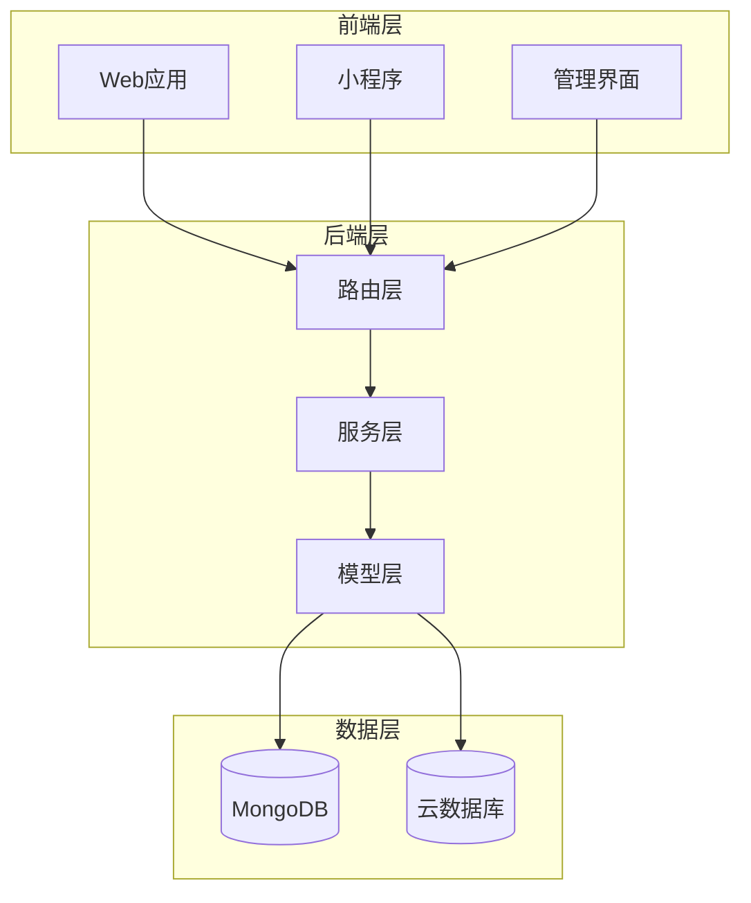
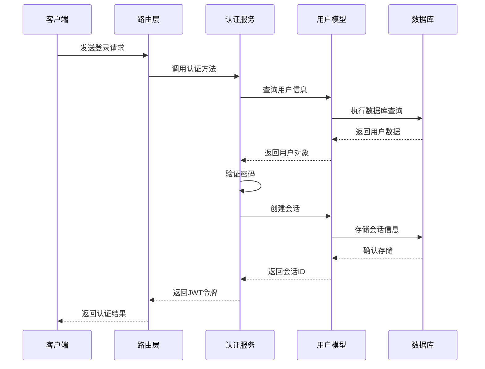
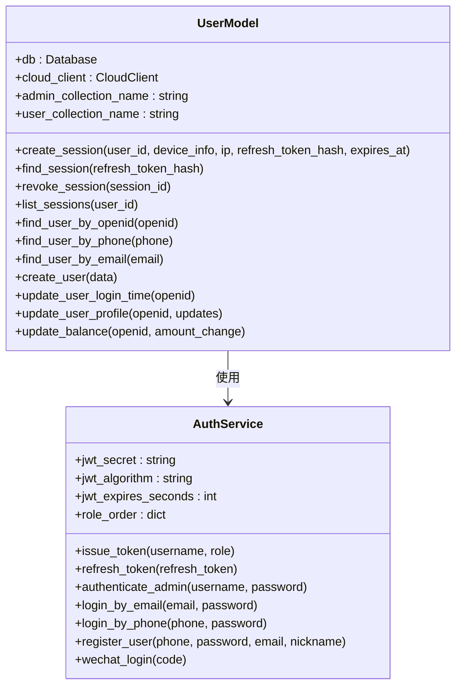
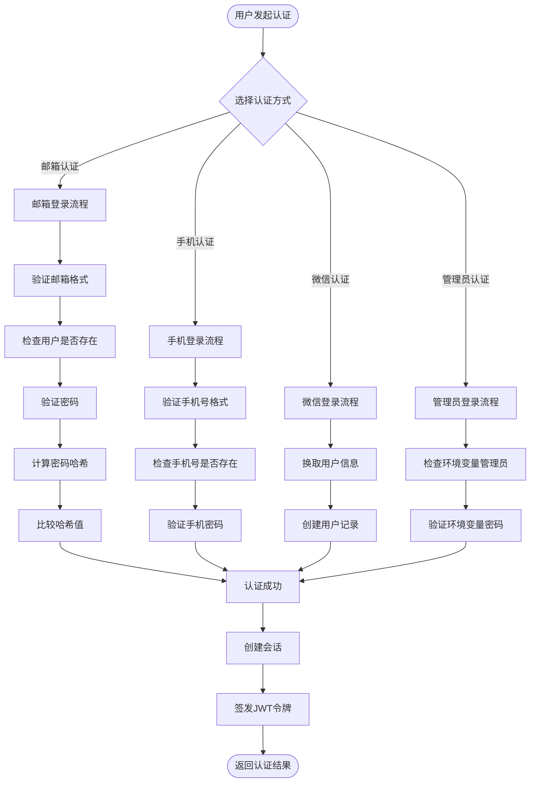
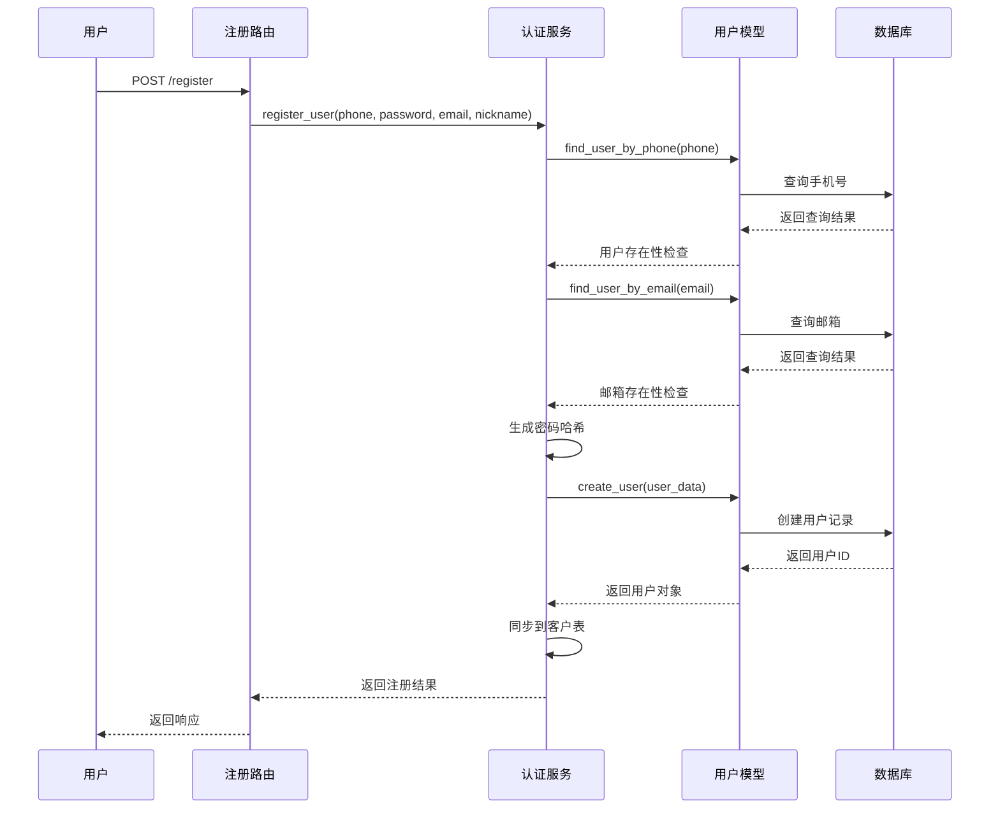
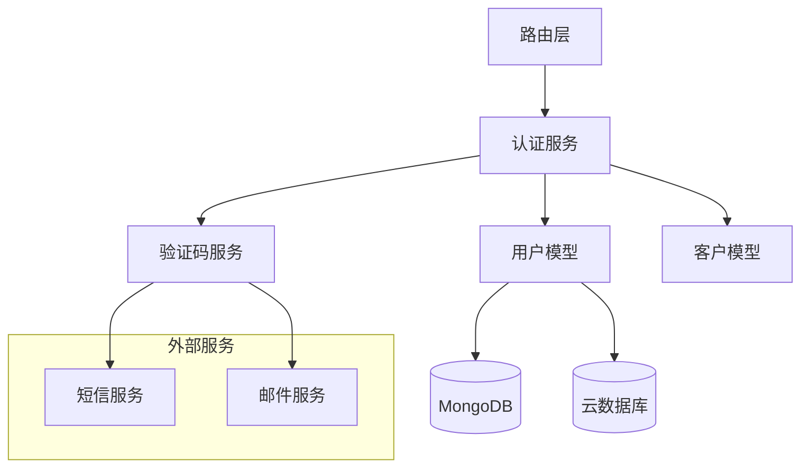

# 用户模型设计

<cite>
**本文档引用的文件**
- [models/user.py](file://models/user.py)
- [services/auth_service.py](file://services/auth_service.py)
- [routes/auth.py](file://routes/auth.py)
- [services/captcha_service.py](file://services/captcha_service.py)
- [models/customer.py](file://models/customer.py)
</cite>

## 目录
1. [简介](#简介)
2. [项目结构](#项目结构)
3. [核心组件](#核心组件)
4. [架构概览](#架构概览)
5. [详细组件分析](#详细组件分析)
6. [依赖关系分析](#依赖关系分析)
7. [性能考虑](#性能考虑)
8. [故障排除指南](#故障排除指南)
9. [结论](#结论)

## 简介

本文件详细阐述了场外期权项目中的用户模型设计，重点分析UserModel类的设计理念和实现架构。该系统实现了完整的用户认证、授权和会话管理机制，支持多种登录方式（邮箱、手机、微信），并提供了统一的身份管理体系。

## 项目结构

该项目采用分层架构设计，主要包含以下核心模块：

**图表来源**
- [routes/auth.py](file://routes/auth.py#L1-L432)
- [services/auth_service.py](file://services/auth_service.py#L1-L416)
- [models/user.py](file://models/user.py#L1-L309)

**章节来源**
- [routes/auth.py](file://routes/auth.py#L1-L432)
- [services/auth_service.py](file://services/auth_service.py#L1-L416)
- [models/user.py](file://models/user.py#L1-L309)

## 核心组件

### UserModel类设计

UserModel是用户数据访问的核心类，负责处理所有用户相关的数据库操作。其设计特点包括：

- **双环境支持**：同时支持本地MongoDB和云数据库
- **会话管理**：提供完整的用户会话生命周期管理
- **多用户类型**：支持普通用户和管理员用户
- **统一接口**：为上层服务提供一致的数据访问接口

### 认证服务架构

AuthService作为认证服务的核心，实现了以下关键功能：

- **密码安全**：使用PBKDF2算法进行密码哈希
- **JWT令牌**：实现基于JWT的无状态认证
- **多因子登录**：支持邮箱、手机、微信等多种登录方式
- **权限控制**：基于角色的访问控制(RBAC)

**章节来源**
- [models/user.py](file://models/user.py#L10-L309)
- [services/auth_service.py](file://services/auth_service.py#L14-L416)

## 架构概览

系统采用经典的三层架构模式，通过清晰的职责分离确保系统的可维护性和扩展性：

**图表来源**
- [routes/auth.py](file://routes/auth.py#L74-L96)
- [services/auth_service.py](file://services/auth_service.py#L86-L131)
- [models/user.py](file://models/user.py#L27-L43)

## 详细组件分析

### 用户模型类分析

UserModel类提供了完整的用户数据管理功能，包括：

#### 会话管理功能

**图表来源**
- [models/user.py](file://models/user.py#L10-L309)
- [services/auth_service.py](file://services/auth_service.py#L14-L416)

#### 用户认证流程

系统支持多种用户认证方式，每种方式都有相应的处理逻辑：

**图表来源**
- [services/auth_service.py](file://services/auth_service.py#L162-L178)
- [services/auth_service.py](file://services/auth_service.py#L393-L411)
- [services/auth_service.py](file://services/auth_service.py#L253-L331)
- [services/auth_service.py](file://services/auth_service.py#L196-L210)

#### 权限体系设计

系统实现了基于角色的访问控制(RBAC)，支持以下角色层级：

| 角色 | 权限等级 | 描述 |
|------|----------|------|
| viewer | 10 | 只读访问权限 |
| editor | 20 | 内容编辑权限 |
| admin | 30 | 管理员权限 |

权限验证通过装饰器机制实现，确保API调用的安全性。

**章节来源**
- [services/auth_service.py](file://services/auth_service.py#L27-L31)
- [routes/auth.py](file://routes/auth.py#L56-L72)

### 用户注册流程

用户注册流程包含多个安全检查和数据验证步骤：

**图表来源**
- [routes/auth.py](file://routes/auth.py#L247-L276)
- [services/auth_service.py](file://services/auth_service.py#L356-L391)
- [models/user.py](file://models/user.py#L239-L254)

### 会话管理策略

系统采用JWT令牌配合数据库会话存储的方式实现会话管理：

#### 令牌生命周期

| 令牌类型 | 有效期 | 用途 |
|----------|--------|------|
| Access Token | 15分钟 | API访问认证 |
| Refresh Token | 7天 | 刷新Access Token |
| Session记录 | 7天 | 会话状态管理 |

#### 会话安全特性

- **会话轮换**：每次刷新令牌时撤销旧会话
- **并发控制**：同一用户只能保持有限数量的活跃会话
- **设备追踪**：记录会话创建的设备信息和IP地址

**章节来源**
- [services/auth_service.py](file://services/auth_service.py#L86-L131)
- [models/user.py](file://models/user.py#L27-L91)

### 数据安全存储

系统在数据存储方面采用了多重安全措施：

#### 密码加密

使用PBKDF2算法进行密码哈希，包含以下安全特性：
- 200,000次迭代次数
- 随机盐值生成
- URL安全的Base64编码
- 时间常数比较防止侧信道攻击

#### 敏感数据保护

- 用户密码仅存储哈希值
- 会话令牌存储为哈希值
- 邮箱和手机号等敏感信息进行适当的字段级保护

**章节来源**
- [services/auth_service.py](file://services/auth_service.py#L49-L84)
- [models/user.py](file://models/user.py#L291-L309)

## 依赖关系分析

系统各组件之间的依赖关系如下：

**图表来源**
- [routes/auth.py](file://routes/auth.py#L1-L18)
- [services/auth_service.py](file://services/auth_service.py#L1-L44)
- [models/user.py](file://models/user.py#L1-L8)

### 关键依赖点

1. **路由层依赖认证服务**：所有认证相关路由都依赖AuthService
2. **认证服务依赖用户模型**：AuthService通过UserModel访问数据库
3. **用户模型依赖数据库客户端**：支持本地和云数据库两种模式
4. **验证码服务独立运行**：提供短信和邮件验证码功能

**章节来源**
- [routes/auth.py](file://routes/auth.py#L1-L18)
- [services/auth_service.py](file://services/auth_service.py#L33-L43)
- [models/user.py](file://models/user.py#L11-L22)

## 性能考虑

### 数据库优化

- **索引策略**：对常用查询字段建立索引（openid、phone、email）
- **查询优化**：使用投影减少不必要的字段传输
- **批量操作**：支持批量用户数据操作

### 缓存策略

- **会话缓存**：Redis缓存活跃会话信息
- **用户信息缓存**：缓存用户基础信息减少数据库查询
- **配置缓存**：缓存系统配置避免重复加载

### 并发控制

- **连接池管理**：合理配置数据库连接池大小
- **请求限流**：对敏感操作实施请求频率限制
- **事务管理**：重要操作使用数据库事务保证一致性

## 故障排除指南

### 常见问题诊断

#### 认证失败问题

**症状**：用户无法登录或令牌验证失败
**可能原因**：
- JWT密钥配置错误
- 令牌过期
- 数据库连接异常

**解决步骤**：
1. 检查JWT_SECRET环境变量配置
2. 验证令牌签名算法设置
3. 确认数据库连接状态

#### 用户数据不一致

**症状**：用户信息在不同模块显示不一致
**可能原因**：
- 统一身份同步失败
- 数据库事务冲突
- 缓存数据过期

**解决步骤**：
1. 检查CustomerModel同步逻辑
2. 验证数据库事务完整性
3. 清理相关缓存数据

#### 会话管理异常

**症状**：用户会话状态异常或频繁掉线
**可能原因**：
- 会话存储配置错误
- 会话清理任务异常
- 令牌轮换逻辑问题

**解决步骤**：
1. 检查会话存储配置
2. 验证会话清理定时任务
3. 审核令牌轮换逻辑

**章节来源**
- [services/auth_service.py](file://services/auth_service.py#L133-L160)
- [models/user.py](file://models/user.py#L62-L91)

## 结论

该用户模型设计体现了现代Web应用的最佳实践，具有以下特点：

### 设计优势

1. **安全性优先**：采用多层安全防护机制
2. **可扩展性**：支持多种数据库和部署环境
3. **易维护性**：清晰的分层架构和职责分离
4. **用户体验**：提供多种认证方式和流畅的会话管理

### 改进建议

1. **增强监控**：添加详细的认证日志和审计跟踪
2. **性能优化**：实现更高效的缓存策略
3. **安全加固**：增加二次验证和风险控制
4. **测试覆盖**：完善单元测试和集成测试

该设计为场外期权业务提供了坚实的技术基础，能够支持业务的持续发展和扩展需求。