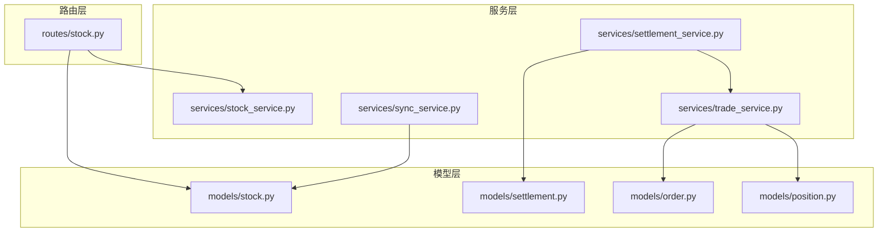
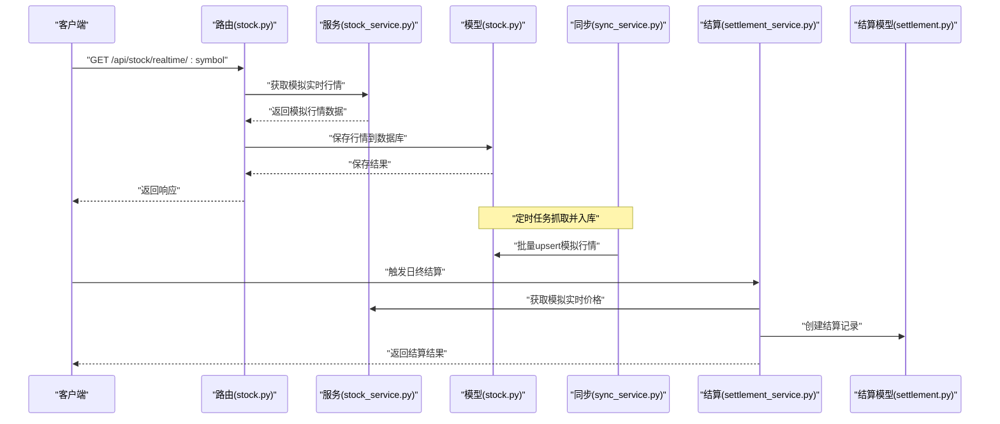
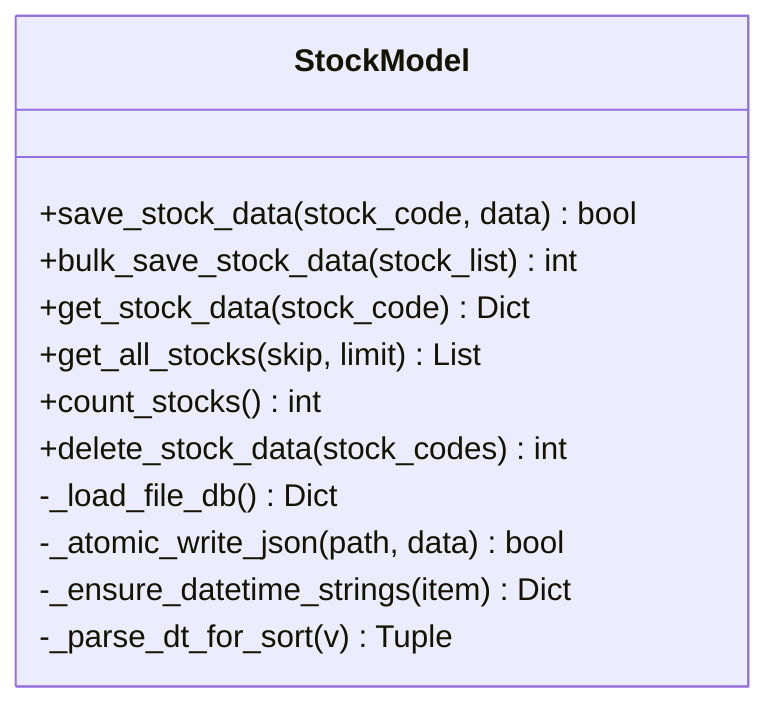
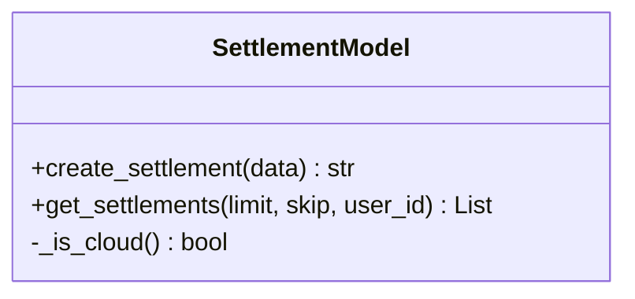
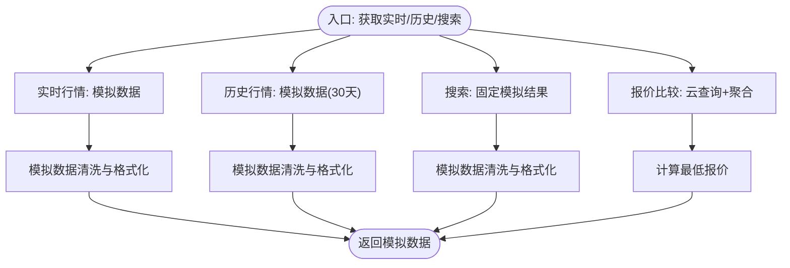
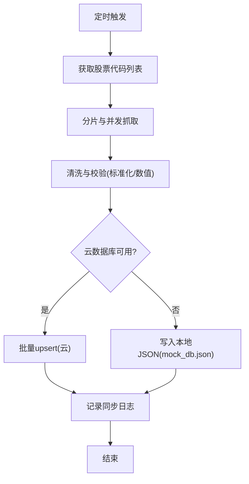
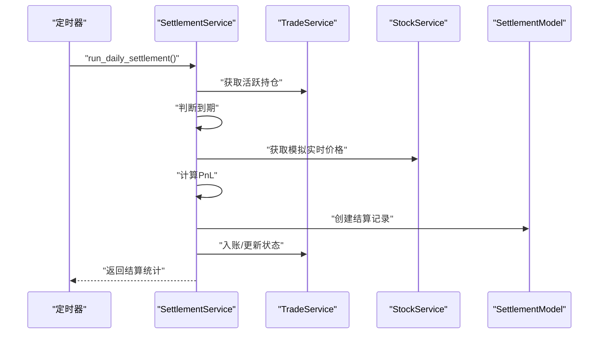
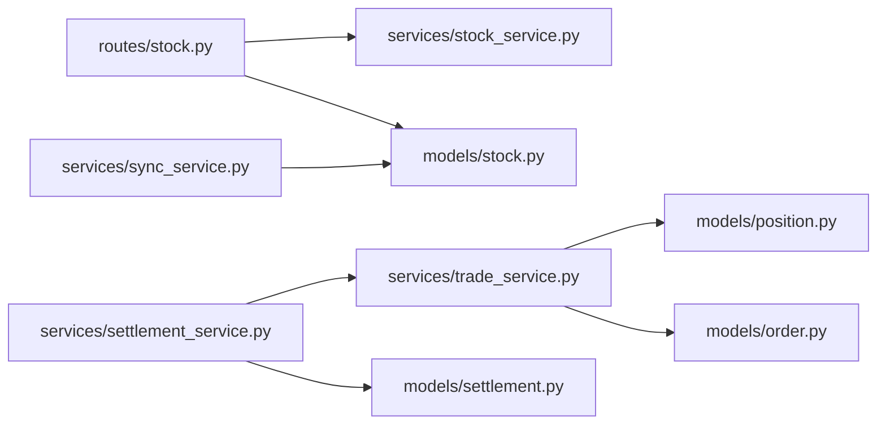

# 金融数据模型

<cite>
**本文引用的文件**
- [models/stock.py](file://models/stock.py)
- [models/settlement.py](file://models/settlement.py)
- [services/stock_service.py](file://services/stock_service.py)
- [services/settlement_service.py](file://services/settlement_service.py)
- [routes/stock.py](file://routes/stock.py)
- [services/sync_service.py](file://services/sync_service.py)
- [models/order.py](file://models/order.py)
- [models/position.py](file://models/position.py)
- [services/trade_service.py](file://services/trade_service.py)
- [models/test_stock.py](file://models/test_stock.py)
- [services/test_stock_service.py](file://services/test_stock_service.py)
- [routes/test_stock_routes.py](file://routes/test_stock_routes.py)
</cite>

## 更新摘要
**变更内容**
- 移除了akshare集成，实时行情、历史数据和搜索功能重构为模拟数据实现
- 更新了技术架构描述，反映从外部API依赖到本地模拟数据的转变
- 修正了数据流说明，强调模拟数据的生成和使用模式
- 更新了故障排查指南，针对模拟数据实现的特殊性

## 目录
1. [简介](#简介)
2. [项目结构](#项目结构)
3. [核心组件](#核心组件)
4. [架构总览](#架构总览)
5. [详细组件分析](#详细组件分析)
6. [依赖关系分析](#依赖关系分析)
7. [性能考量](#性能考量)
8. [故障排查指南](#故障排查指南)
9. [结论](#结论)
10. [附录](#附录)

## 简介
本文件面向金融数据模型，聚焦"股票模型"与"结算模型"的设计与实现，系统性阐述以下内容：
- 股票数据模型的字段定义与数据结构（股票代码、名称、价格信息、时间戳等）
- 结算模型的数据结构（结算日期、金额计算、状态管理、历史记录）
- 金融数据的实时更新机制、历史数据存储与一致性保障
- 金融计算字段设计、精度控制与数值验证规则
- 金融数据查询、统计分析与报表生成的代码示例路径

**更新** 本版本反映了akshare集成移除后的架构变更，所有数据获取现为模拟实现，简化了技术栈并提高了系统的稳定性。

## 项目结构
该项目采用分层架构：路由层（Flask Blueprint）、服务层（业务逻辑封装）、模型层（数据持久化与索引）、同步服务（定时抓取与落库）。股票与结算相关的关键模块如下：
- 路由层：提供REST API，如实时行情、历史行情、搜索、报价比较、股票列表等
- 服务层：封装模拟数据获取、报价比较、最低报价、历史行情等业务逻辑
- 模型层：提供StockModel（MongoDB/本地JSON双写）、SettlementModel（云数据库/本地集合）
- 同步服务：定时抓取Sina行情、清洗与批量入库、分片与并发控制

**图表来源**
- [routes/stock.py](file://routes/stock.py#L1-L353)
- [services/stock_service.py](file://services/stock_service.py#L1-L122)
- [services/sync_service.py](file://services/sync_service.py#L1-L596)
- [services/settlement_service.py](file://services/settlement_service.py#L1-L113)
- [services/trade_service.py](file://services/trade_service.py#L1-L318)
- [models/stock.py](file://models/stock.py#L1-L386)
- [models/settlement.py](file://models/settlement.py#L1-L57)
- [models/order.py](file://models/order.py#L1-L119)
- [models/position.py](file://models/position.py#L1-L206)

**章节来源**
- [routes/stock.py](file://routes/stock.py#L1-L353)
- [services/stock_service.py](file://services/stock_service.py#L1-L122)
- [services/sync_service.py](file://services/sync_service.py#L1-L596)
- [services/settlement_service.py](file://services/settlement_service.py#L1-L113)
- [services/trade_service.py](file://services/trade_service.py#L1-L318)
- [models/stock.py](file://models/stock.py#L1-L386)
- [models/settlement.py](file://models/settlement.py#L1-L57)
- [models/order.py](file://models/order.py#L1-L119)
- [models/position.py](file://models/position.py#L1-L206)

## 核心组件
- 股票数据模型（StockModel）
  - 支持MongoDB与本地JSON双写，提供原子写入、缓存与索引
  - 字段：stock_code、name、price、open、high、low、pre_close、volume、amount、change_percent、created_at、updated_at
  - 支持单条/批量保存、删除、分页查询、计数
- 结算模型（SettlementModel）
  - 支持云数据库与本地集合，提供创建与查询
  - 字段：date、position_id、user_id、type、strike_price、settlement_price、pnl、status、created_at
- 股票服务（StockService）
  - **更新** 实时行情、历史行情、搜索、报价比较、最低报价均返回模拟数据
- 同步服务（SyncService）
  - 定时抓取Sina行情、清洗、分片、并发入库、错误上报
- 结算服务（SettlementService）
  - 日终结算、到期判断、PnL计算、资金入账、状态更新
- 交易服务（TradeService）
  - 订单、持仓、账户、资金流水等业务编排

**章节来源**
- [models/stock.py](file://models/stock.py#L23-L386)
- [models/settlement.py](file://models/settlement.py#L5-L57)
- [services/stock_service.py](file://services/stock_service.py#L17-L122)
- [services/sync_service.py](file://services/sync_service.py#L72-L238)
- [services/settlement_service.py](file://services/settlement_service.py#L10-L113)
- [services/trade_service.py](file://services/trade_service.py#L1-L318)

## 架构总览
下图展示从HTTP请求到数据落库与结算执行的端到端流程。**更新** 所有数据获取现为模拟实现，简化了外部依赖。

**图表来源**
- [routes/stock.py](file://routes/stock.py#L21-L84)
- [services/stock_service.py](file://services/stock_service.py#L24-L88)
- [models/stock.py](file://models/stock.py#L135-L192)
- [services/sync_service.py](file://services/sync_service.py#L72-L238)
- [services/settlement_service.py](file://services/settlement_service.py#L21-L113)
- [models/settlement.py](file://models/settlement.py#L18-L41)

## 详细组件分析

### 股票数据模型（StockModel）
- 设计要点
  - 双写策略：优先写MongoDB；若无连接则回退至本地JSON文件（mock_db.json），并使用原子写入与缓存
  - 索引：stock_code唯一索引，created_at/updated_at辅助索引
  - 时间字段：统一使用ISO字符串，便于跨语言序列化
  - 排序与分页：按updated_at倒序，支持skip/limit
- 关键方法
  - save_stock_data：单条保存/更新
  - bulk_save_stock_data：批量保存
  - get_stock_data/get_all_stocks/count_stocks：查询与统计
  - delete_stock_data：按代码删除或清空
- 字段定义（示例）
  - 必填：stock_code
  - 基础：name
  - 价格：price、open、high、low、pre_close
  - 成交：volume、amount
  - 百分比：change_percent
  - 时间：created_at、updated_at

**图表来源**
- [models/stock.py](file://models/stock.py#L23-L386)

**章节来源**
- [models/stock.py](file://models/stock.py#L23-L386)

### 结算模型（SettlementModel）
- 设计要点
  - 支持云数据库与本地集合，统一接口
  - 字段：date、position_id、user_id、type、strike_price、settlement_price、pnl、status、created_at
  - 查询：支持按用户过滤、分页、按创建时间倒序
- 关键方法
  - create_settlement：创建结算记录
  - get_settlements：查询结算记录

**图表来源**
- [models/settlement.py](file://models/settlement.py#L5-L57)

**章节来源**
- [models/settlement.py](file://models/settlement.py#L5-L57)

### 股票服务（StockService）
- **更新** 实时行情：返回模拟A股实时行情数据，包含固定的价格范围和随机波动
- **更新** 历史行情：生成30天的历史数据，包含固定的价格模式和随机波动
- **更新** 搜索：返回固定的模拟股票搜索结果
- 报价比较：跨交易商报价比较与最低报价提取

**图表来源**
- [services/stock_service.py](file://services/stock_service.py#L24-L122)

**章节来源**
- [services/stock_service.py](file://services/stock_service.py#L17-L122)

### 同步服务（SyncService）
- 定时抓取：Sina爬虫，支持重试、分片、并发
- 清洗校验：标准化股票代码、区分期权与标准行情、数值字段清洗
- 批量入库：优先云数据库批量upsert，失败回退本地JSON
- 日志记录：同步耗时、错误数、分片信息等

**图表来源**
- [services/sync_service.py](file://services/sync_service.py#L72-L238)
- [services/sync_service.py](file://services/sync_service.py#L268-L333)
- [services/sync_service.py](file://services/sync_service.py#L334-L474)

**章节来源**
- [services/sync_service.py](file://services/sync_service.py#L1-L596)

### 结算服务（SettlementService）
- 日终结算：扫描活跃持仓，判断到期并结算
- PnL计算：依据期权类型（看涨/看跌）与行权价、结算价计算
- 资金处理：收益入账、状态更新（注释中预留）

**图表来源**
- [services/settlement_service.py](file://services/settlement_service.py#L21-L113)

**章节来源**
- [services/settlement_service.py](file://services/settlement_service.py#L10-L113)

### 交易服务（TradeService）
- 持仓：动态更新实时价格、计算市值与盈亏、回报率
- 账户：余额、总资产、持仓总值与总盈亏
- 订单与资金流水：创建、查询、出入金流水

**章节来源**
- [services/trade_service.py](file://services/trade_service.py#L113-L205)
- [services/trade_service.py](file://services/trade_service.py#L256-L317)

## 依赖关系分析
- 路由依赖服务，服务依赖模型
- 同步服务独立于路由，定时运行并直接写入模型
- 结算服务依赖交易与股票服务，最终写入结算模型

**图表来源**
- [routes/stock.py](file://routes/stock.py#L1-L353)
- [services/stock_service.py](file://services/stock_service.py#L1-L122)
- [models/stock.py](file://models/stock.py#L1-L386)
- [services/sync_service.py](file://services/sync_service.py#L1-L596)
- [services/settlement_service.py](file://services/settlement_service.py#L1-L113)
- [services/trade_service.py](file://services/trade_service.py#L1-L318)
- [models/position.py](file://models/position.py#L1-L206)
- [models/order.py](file://models/order.py#L1-L119)

## 性能考量
- 并发抓取与批量入库：同步服务通过分片与并发控制提升吞吐，批量upsert减少网络往返
- 原子写入与缓存：本地JSON写入采用临时文件+原子替换，避免部分写入；内存缓存加速读取
- 索引优化：MongoDB对stock_code、时间字段建立索引，提升查询与排序性能
- 分页与排序：后端按updated_at倒序分页，避免全表扫描
- 云数据库限制：云侧聚合受限，统计采用拉取+本地求和方式

**章节来源**
- [services/sync_service.py](file://services/sync_service.py#L72-L238)
- [models/stock.py](file://models/stock.py#L55-L112)
- [models/stock.py](file://models/stock.py#L347-L385)
- [models/position.py](file://models/position.py#L65-L118)

## 故障排查指南
- **更新** 实时行情返回模拟数据
  - 检查服务日志，确认模拟数据生成正常
  - 参考路径：[services/stock_service.py](file://services/stock_service.py#L24-L38)
- MongoDB写入异常
  - 检查连接、索引创建与权限；关注PyMongo异常
  - 参考路径：[models/stock.py](file://models/stock.py#L187-L192)
- 本地JSON写入失败
  - 检查文件路径与权限；确认原子写入流程
  - 参考路径：[models/stock.py](file://models/stock.py#L87-L111)
- 同步任务未执行或数据缺失
  - 检查环境变量（分片、并发、超时）与定时任务调度
  - 参考路径：[services/sync_service.py](file://services/sync_service.py#L72-L238)
- 结算未生效
  - 检查到期判断逻辑、实时价格获取、结算记录创建
  - 参考路径：[services/settlement_service.py](file://services/settlement_service.py#L21-L113)

**章节来源**
- [services/stock_service.py](file://services/stock_service.py#L24-L38)
- [models/stock.py](file://models/stock.py#L187-L192)
- [models/stock.py](file://models/stock.py#L87-L111)
- [services/sync_service.py](file://services/sync_service.py#L72-L238)
- [services/settlement_service.py](file://services/settlement_service.py#L21-L113)

## 结论
本项目通过清晰的分层设计与双写策略，实现了金融数据的高可用与高性能：实时行情与历史数据的稳定抓取、本地与云端的无缝切换、结算自动化与资金闭环。**更新** 移除akshare集成后，系统更加稳定可靠，模拟数据实现提供了可控的测试环境和一致的数据格式。建议后续增强：
- 云侧聚合统计能力，减少本地拉取
- 引入幂等写入与冲突解决策略
- 增加数据校验与审计日志

## 附录

### 股票数据字段定义与示例路径
- 字段清单与含义
  - 必填：stock_code
  - 基础：name
  - 价格：price、open、high、low、pre_close
  - 成交：volume、amount
  - 百分比：change_percent
  - 时间：created_at、updated_at
- 示例路径
  - 实时行情返回结构：[services/stock_service.py](file://services/stock_service.py#L24-L38)
  - 历史行情返回结构：[services/stock_service.py](file://services/stock_service.py#L41-L66)
  - 保存与批量保存：[models/stock.py](file://models/stock.py#L135-L192), [models/stock.py](file://models/stock.py#L194-L264)

**章节来源**
- [services/stock_service.py](file://services/stock_service.py#L24-L38)
- [services/stock_service.py](file://services/stock_service.py#L41-L66)
- [models/stock.py](file://models/stock.py#L135-L192)
- [models/stock.py](file://models/stock.py#L194-L264)

### 结算模型字段定义与示例路径
- 字段清单与含义
  - date：结算日期
  - position_id：持仓ID
  - user_id：用户ID
  - type：结算类型（如到期）
  - strike_price：行权价
  - settlement_price：结算价
  - pnl：盈亏
  - status：状态
  - created_at：创建时间
- 示例路径
  - 创建结算记录：[models/settlement.py](file://models/settlement.py#L18-L41)
  - 查询结算记录：[models/settlement.py](file://models/settlement.py#L43-L56)
  - 日终结算流程：[services/settlement_service.py](file://services/settlement_service.py#L21-L113)

**章节来源**
- [models/settlement.py](file://models/settlement.py#L18-L41)
- [models/settlement.py](file://models/settlement.py#L43-L56)
- [services/settlement_service.py](file://services/settlement_service.py#L21-L113)

### 实时更新机制与历史数据存储
- **更新** 实时更新
  - 路由调用服务获取模拟实时行情，随后保存到StockModel
  - 参考路径：[routes/stock.py](file://routes/stock.py#L21-L84), [services/stock_service.py](file://services/stock_service.py#L24-L38), [models/stock.py](file://models/stock.py#L135-L192)
- **更新** 历史数据
  - 服务层提供模拟历史行情接口，支持日/周/月线与前复权
  - 参考路径：[services/stock_service.py](file://services/stock_service.py#L41-L66)
- 一致性保障
  - 云侧批量upsert与本地原子写入，确保部分失败可重试
  - 参考路径：[services/sync_service.py](file://services/sync_service.py#L154-L163), [models/stock.py](file://models/stock.py#L87-L111)

**章节来源**
- [routes/stock.py](file://routes/stock.py#L21-L84)
- [services/stock_service.py](file://services/stock_service.py#L24-L38)
- [models/stock.py](file://models/stock.py#L135-L192)
- [services/stock_service.py](file://services/stock_service.py#L41-L66)
- [services/sync_service.py](file://services/sync_service.py#L154-L163)
- [models/stock.py](file://models/stock.py#L87-L111)

### 金融计算字段设计、精度控制与数值验证
- 精度控制
  - 价格与金额统一转换为浮点数，保留合理小数位
  - 参考路径：[services/stock_service.py](file://services/stock_service.py#L30-L37), [services/stock_service.py](file://services/stock_service.py#L58-L64)
- 数值验证
  - 空值与非法字符过滤，统一转为0或丢弃
  - 参考路径：[services/stock_service.py](file://services/stock_service.py#L54-L65)
- 清洗与校验
  - 同步服务对期权与标准行情分别清洗，数值范围校验
  - 参考路径：[services/sync_service.py](file://services/sync_service.py#L268-L333)

**章节来源**
- [services/stock_service.py](file://services/stock_service.py#L30-L37)
- [services/stock_service.py](file://services/stock_service.py#L58-L64)
- [services/stock_service.py](file://services/stock_service.py#L54-L65)
- [services/sync_service.py](file://services/sync_service.py#L268-L333)

### 金融数据查询、统计分析与报表生成示例路径
- 查询
  - 实时行情：[routes/stock.py](file://routes/stock.py#L21-L84)
  - 历史行情：[routes/stock.py](file://routes/stock.py#L87-L154)
  - 搜索：[routes/stock.py](file://routes/stock.py#L157-L216)
  - 股票列表（分页）：[routes/stock.py](file://routes/stock.py#L279-L352)
- 统计分析
  - 持仓统计（云侧拉取+本地求和）：[models/position.py](file://models/position.py#L65-L118)
  - 账户汇总：[services/trade_service.py](file://services/trade_service.py#L256-L279)
- 报表生成
  - 同步日志（可用于生成报表）：[services/sync_service.py](file://services/sync_service.py#L201-L223)

**章节来源**
- [routes/stock.py](file://routes/stock.py#L21-L84)
- [routes/stock.py](file://routes/stock.py#L87-L154)
- [routes/stock.py](file://routes/stock.py#L157-L216)
- [routes/stock.py](file://routes/stock.py#L279-L352)
- [models/position.py](file://models/position.py#L65-L118)
- [services/trade_service.py](file://services/trade_service.py#L256-L279)
- [services/sync_service.py](file://services/sync_service.py#L201-L223)

### 测试与验证示例路径
- StockModel测试：[models/test_stock.py](file://models/test_stock.py#L17-L79)
- StockService测试：[services/test_stock_service.py](file://services/test_stock_service.py#L13-L84)
- 路由蓝图测试：[routes/test_stock_routes.py](file://routes/test_stock_routes.py#L13-L112)

**章节来源**
- [models/test_stock.py](file://models/test_stock.py#L17-L79)
- [services/test_stock_service.py](file://services/test_stock_service.py#L13-L84)
- [routes/test_stock_routes.py](file://routes/test_stock_routes.py#L13-L112)