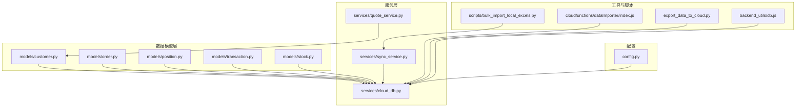
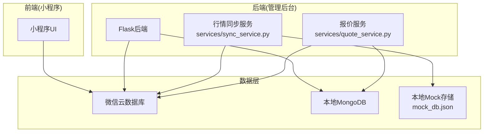
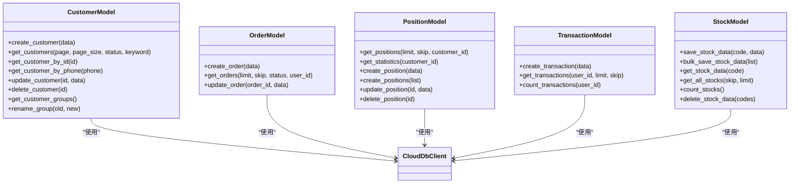
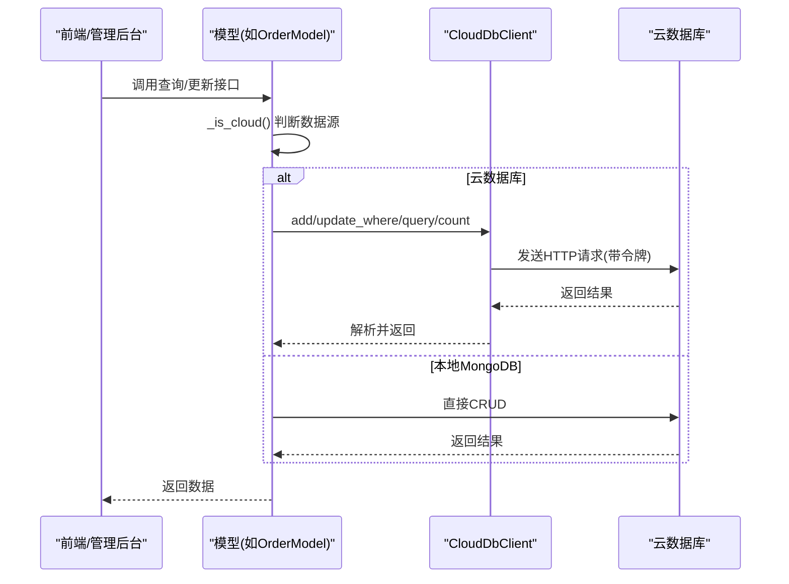
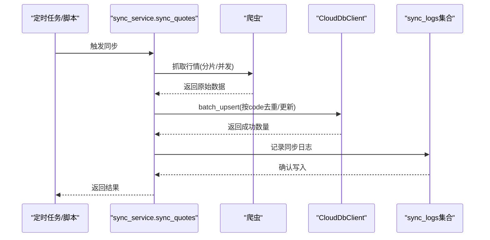
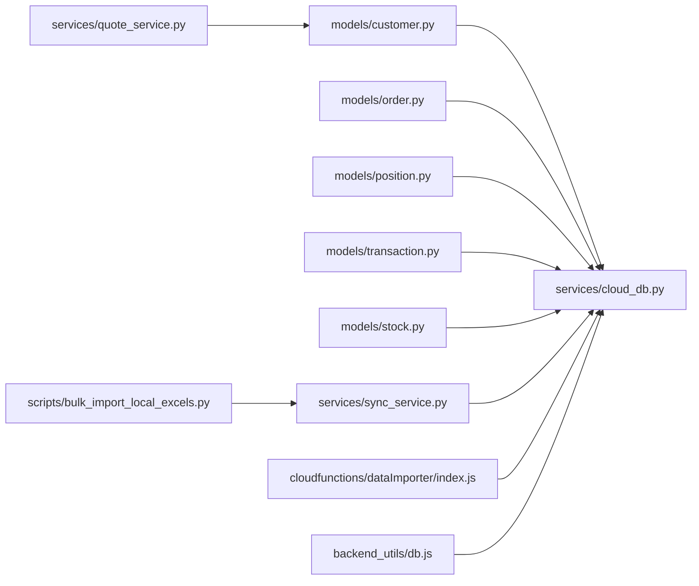

# 数据管理

<cite>
**本文引用的文件**
- [models/customer.py](file://models/customer.py)
- [models/order.py](file://models/order.py)
- [models/position.py](file://models/position.py)
- [models/transaction.py](file://models/transaction.py)
- [models/stock.py](file://models/stock.py)
- [services/cloud_db.py](file://services/cloud_db.py)
- [services/sync_service.py](file://services/sync_service.py)
- [services/quote_service.py](file://services/quote_service.py)
- [backend_utils/db.js](file://backend_utils/db.js)
- [config.py](file://config.py)
- [export_data_to_cloud.py](file://export_data_to_cloud.py)
- [scripts/bulk_import_local_excels.py](file://scripts/bulk_import_local_excels.py)
- [cloudfunctions/dataImporter/index.js](file://cloudfunctions/dataImporter/index.js)
</cite>

## 目录
1. [简介](#简介)
2. [项目结构](#项目结构)
3. [核心组件](#核心组件)
4. [架构总览](#架构总览)
5. [详细组件分析](#详细组件分析)
6. [依赖分析](#依赖分析)
7. [性能考量](#性能考量)
8. [故障排查指南](#故障排查指南)
9. [结论](#结论)
10. [附录](#附录)

## 简介
本文件面向场外期权交易系统的数据管理，系统采用“云数据库优先 + 本地MongoDB辅助”的混合数据源架构，围绕客户、订单、持仓、交易流水、股票行情等核心实体构建数据模型，并通过统一的云数据库客户端实现跨环境一致的数据访问。系统同时提供行情抓取与导入、批量数据清洗与入库、删除与清理、以及基于环境变量的配置与部署支持。

## 项目结构
- 数据模型层：按领域划分，分别定义客户、订单、持仓、交易流水、股票行情等模型，负责数据结构与基础CRUD。
- 服务层：封装云数据库客户端、行情同步、报价服务、文件解析与导入等能力。
- 工具与脚本：提供导出到云数据库、批量Excel导入、以及本地Mock存储工具。
- 配置与部署：通过环境变量控制数据源模式、日志级别、跨域等运行参数。

**图表来源**
- [models/customer.py](file://models/customer.py#L10-L300)
- [models/order.py](file://models/order.py#L10-L119)
- [models/position.py](file://models/position.py#L10-L206)
- [models/transaction.py](file://models/transaction.py#L6-L61)
- [models/stock.py](file://models/stock.py#L23-L386)
- [services/cloud_db.py](file://services/cloud_db.py#L108-L533)
- [services/sync_service.py](file://services/sync_service.py#L72-L596)
- [services/quote_service.py](file://services/quote_service.py#L9-L109)
- [export_data_to_cloud.py](file://export_data_to_cloud.py#L5-L74)
- [scripts/bulk_import_local_excels.py](file://scripts/bulk_import_local_excels.py#L17-L100)
- [cloudfunctions/dataImporter/index.js](file://cloudfunctions/dataImporter/index.js#L1-L392)
- [backend_utils/db.js](file://backend_utils/db.js#L1-L64)
- [config.py](file://config.py#L22-L132)

**章节来源**
- [config.py](file://config.py#L6-L12)

## 核心组件
- 数据模型层：统一抽象客户、订单、持仓、交易流水、股票行情等实体，支持本地MongoDB与微信云数据库双模式访问。
- 云数据库客户端：封装微信云数据库的鉴权、请求、并发与重试、批量Upsert、分片与限流等能力。
- 行情同步与导入：提供定时抓取、文件导入、批量清洗、去重与Upsert、进度回调与日志记录。
- 配置与工具：通过环境变量切换数据源模式，提供导出脚本与本地Mock存储工具。

**章节来源**
- [models/customer.py](file://models/customer.py#L10-L300)
- [models/order.py](file://models/order.py#L10-L119)
- [models/position.py](file://models/position.py#L10-L206)
- [models/transaction.py](file://models/transaction.py#L6-L61)
- [models/stock.py](file://models/stock.py#L23-L386)
- [services/cloud_db.py](file://services/cloud_db.py#L108-L533)
- [services/sync_service.py](file://services/sync_service.py#L72-L596)
- [services/quote_service.py](file://services/quote_service.py#L9-L109)
- [export_data_to_cloud.py](file://export_data_to_cloud.py#L5-L74)
- [scripts/bulk_import_local_excels.py](file://scripts/bulk_import_local_excels.py#L17-L100)
- [cloudfunctions/dataImporter/index.js](file://cloudfunctions/dataImporter/index.js#L1-L392)
- [backend_utils/db.js](file://backend_utils/db.js#L1-L64)
- [config.py](file://config.py#L22-L132)

## 架构总览
系统采用“云数据库优先”的前端数据源，管理后台与数据处理使用本地MongoDB；通过定期导出与云函数导入实现双向同步。行情数据通过爬虫与文件导入两种方式进入云数据库，支持分片、并发与重试保障吞吐与稳定性。

**图表来源**
- [config.py](file://config.py#L6-L12)
- [services/sync_service.py](file://services/sync_service.py#L72-L238)
- [services/quote_service.py](file://services/quote_service.py#L9-L109)
- [backend_utils/db.js](file://backend_utils/db.js#L1-L64)

## 详细组件分析

### 数据模型与索引策略
- 客户模型：支持按手机号唯一性校验、按状态与关键词检索、分组名聚合与重命名。
- 订单模型：orderId唯一索引、createdAt索引，支持按状态与用户标识查询。
- 持仓模型：customerId与productCode索引，支持活跃状态聚合统计。
- 交易模型：按用户ID查询与计数。
- 股票模型：stock_code唯一索引、created_at与updated_at索引，支持本地文件缓存与原子写入。

**图表来源**
- [models/customer.py](file://models/customer.py#L10-L300)
- [models/order.py](file://models/order.py#L10-L119)
- [models/position.py](file://models/position.py#L10-L206)
- [models/transaction.py](file://models/transaction.py#L6-L61)
- [models/stock.py](file://models/stock.py#L23-L386)
- [services/cloud_db.py](file://services/cloud_db.py#L108-L533)

**章节来源**
- [models/customer.py](file://models/customer.py#L10-L300)
- [models/order.py](file://models/order.py#L10-L119)
- [models/position.py](file://models/position.py#L10-L206)
- [models/transaction.py](file://models/transaction.py#L6-L61)
- [models/stock.py](file://models/stock.py#L23-L386)

### 数据访问与缓存策略
- 统一访问模式：所有模型均通过构造函数注入db与cloud_client，内部通过_is_cloud判断使用云数据库还是本地MongoDB。
- 缓存策略：报价服务对分组行情结果进行内存缓存，TTL为60秒；股票模型对本地文件数据库进行内存字典缓存与原子写入，避免竞态。
- 并发与限流：云数据库客户端内置信号量与线程池，支持最大并发与重试配置；行情同步支持分片与并发写入。

**图表来源**
- [models/order.py](file://models/order.py#L28-L119)
- [services/cloud_db.py](file://services/cloud_db.py#L108-L533)

**章节来源**
- [services/quote_service.py](file://services/quote_service.py#L9-L109)
- [models/stock.py](file://models/stock.py#L29-L112)
- [services/cloud_db.py](file://services/cloud_db.py#L108-L533)

### 行情同步与导入流程
- 定时同步：从新浪等数据源抓取行情，构建标准文档，调用云数据库批量Upsert，记录同步日志。
- 文件导入：解析Excel报价矩阵，清洗与去重，按code唯一键进行Upsert，支持进度回调与错误统计。
- 删除清理：支持按股票代码范围删除或全量删除，提供进度反馈。

**图表来源**
- [services/sync_service.py](file://services/sync_service.py#L72-L238)
- [cloudfunctions/dataImporter/index.js](file://cloudfunctions/dataImporter/index.js#L273-L318)

**章节来源**
- [services/sync_service.py](file://services/sync_service.py#L72-L596)
- [cloudfunctions/dataImporter/index.js](file://cloudfunctions/dataImporter/index.js#L1-L392)

### 数据验证与业务规则
- 数据清洗：标准化股票代码长度与格式，过滤非法值；期权矩阵字段校验与唯一ID生成。
- 业务规则：客户创建前手机号唯一性检查；订单生成时自动生成orderId；持仓默认状态与货币/市场字段填充。
- 完整性保障：云数据库批量Upsert返回错误集合；本地文件写入采用原子替换与缓存更新；删除采用分批与进度反馈。

**章节来源**
- [services/sync_service.py](file://services/sync_service.py#L268-L333)
- [models/customer.py](file://models/customer.py#L23-L64)
- [models/order.py](file://models/order.py#L28-L52)
- [models/position.py](file://models/position.py#L120-L170)
- [backend_utils/db.js](file://backend_utils/db.js#L17-L32)

### 数据生命周期与归档清理
- 生命周期：客户、订单、持仓、交易流水均维护createdAt/updatedAt；股票行情按updated_at排序与分页。
- 归档与清理：提供按股票代码范围删除与全量删除接口；支持通过脚本批量导入与清理，便于历史数据归档与空间回收。

**章节来源**
- [models/customer.py](file://models/customer.py#L119-L177)
- [models/order.py](file://models/order.py#L54-L97)
- [models/position.py](file://models/position.py#L28-L63)
- [models/transaction.py](file://models/transaction.py#L39-L61)
- [models/stock.py](file://models/stock.py#L312-L386)
- [services/sync_service.py](file://services/sync_service.py#L477-L596)

### 导入导出、备份与恢复
- 导出：脚本从AkShare抓取实时行情并输出JSON Lines，便于导入云数据库。
- 导入：本地Excel批量解析与Upsert；云函数支持文件下载、去重、并发写入与作业状态管理。
- 备份与恢复：本地Mock存储提供文件级备份；云数据库通过集合导出/导入实现备份与恢复。

**章节来源**
- [export_data_to_cloud.py](file://export_data_to_cloud.py#L5-L74)
- [scripts/bulk_import_local_excels.py](file://scripts/bulk_import_local_excels.py#L17-L100)
- [cloudfunctions/dataImporter/index.js](file://cloudfunctions/dataImporter/index.js#L273-L318)
- [backend_utils/db.js](file://backend_utils/db.js#L13-L32)

### 数据安全、隐私与访问控制
- 访问控制：云数据库客户端通过AccessTokenProvider获取与刷新令牌，支持超时与重试；严格校验环境变量配置。
- 隐私保护：模型与服务层避免敏感字段泄露；文件导入与导出遵循最小必要原则。
- 安全配置：生产环境强制要求密钥配置，防止默认密钥泄露。

**章节来源**
- [services/cloud_db.py](file://services/cloud_db.py#L36-L106)
- [config.py](file://config.py#L103-L116)

### 数据迁移、版本与兼容
- 迁移路径：通过导出脚本生成标准JSON Lines，再由云函数或云数据库导入界面完成迁移。
- 版本管理：云函数与脚本均记录作业状态与摘要，便于追踪与回滚。
- 兼容性：支持多源数据（爬虫与Excel）统一清洗与Upsert，兼容不同格式与字段映射。

**章节来源**
- [export_data_to_cloud.py](file://export_data_to_cloud.py#L5-L74)
- [cloudfunctions/dataImporter/index.js](file://cloudfunctions/dataImporter/index.js#L48-L165)
- [services/sync_service.py](file://services/sync_service.py#L334-L474)

### 数据同步机制、实时更新与一致性
- 同步机制：定时任务与脚本驱动的批量同步；云函数作业队列处理重复文件与并发冲突。
- 实时更新：报价服务对分组行情进行缓存；股票模型对本地文件进行原子写入与缓存更新。
- 一致性：云数据库批量Upsert返回错误集合；本地文件写入采用原子替换，避免部分写入导致的数据不一致。

**章节来源**
- [services/sync_service.py](file://services/sync_service.py#L72-L238)
- [services/quote_service.py](file://services/quote_service.py#L28-L109)
- [models/stock.py](file://models/stock.py#L87-L112)
- [cloudfunctions/dataImporter/index.js](file://cloudfunctions/dataImporter/index.js#L233-L340)

## 依赖分析
- 模块耦合：各模型依赖云数据库客户端；同步服务依赖爬虫与云数据库客户端；报价服务依赖股票服务与模型。
- 外部依赖：AkShare用于实时行情抓取；微信云开发API用于数据库操作；node-xlsx用于Excel解析。
- 潜在循环：当前结构未发现循环依赖，模块职责清晰。

**图表来源**
- [models/customer.py](file://models/customer.py#L1-L20)
- [models/order.py](file://models/order.py#L1-L20)
- [models/position.py](file://models/position.py#L1-L20)
- [models/transaction.py](file://models/transaction.py#L1-L10)
- [models/stock.py](file://models/stock.py#L1-L20)
- [services/cloud_db.py](file://services/cloud_db.py#L1-L20)
- [services/sync_service.py](file://services/sync_service.py#L1-L10)
- [services/quote_service.py](file://services/quote_service.py#L1-L10)
- [scripts/bulk_import_local_excels.py](file://scripts/bulk_import_local_excels.py#L1-L15)
- [cloudfunctions/dataImporter/index.js](file://cloudfunctions/dataImporter/index.js#L1-L10)
- [backend_utils/db.js](file://backend_utils/db.js#L1-L10)

**章节来源**
- [services/cloud_db.py](file://services/cloud_db.py#L108-L533)
- [services/sync_service.py](file://services/sync_service.py#L72-L238)
- [services/quote_service.py](file://services/quote_service.py#L9-L109)

## 性能考量
- 并发与限流：云数据库客户端通过信号量与线程池控制并发，支持环境变量调整最大并发与重试次数。
- 批量写入：批量Upsert减少网络往返，提高吞吐；分片与并发写入提升大规模数据处理效率。
- 缓存：报价服务与股票模型的内存缓存降低重复查询成本；原子写入避免频繁IO。
- 索引：核心集合建立唯一索引与常用查询字段索引，提升查询性能。

**章节来源**
- [services/cloud_db.py](file://services/cloud_db.py#L141-L160)
- [services/sync_service.py](file://services/sync_service.py#L331-L484)
- [models/order.py](file://models/order.py#L18-L21)
- [models/position.py](file://models/position.py#L18-L21)
- [models/stock.py](file://models/stock.py#L46-L50)

## 故障排查指南
- 云数据库配置错误：检查WX_CLOUD_ENV、WX_APPID、WX_SECRET是否正确设置；确认集合是否存在。
- 请求失败与重试：关注速率限制与QPS阈值，适当增加重试次数与并发；查看错误日志定位具体失败原因。
- 数据导入异常：检查Excel格式与字段映射；确认文件大小限制与重复文件检测；查看导入作业状态。
- 本地存储问题：核对mock_db.json路径与权限；确认原子写入是否成功；检查缓存一致性。

**章节来源**
- [services/cloud_db.py](file://services/cloud_db.py#L197-L207)
- [cloudfunctions/dataImporter/index.js](file://cloudfunctions/dataImporter/index.js#L276-L301)
- [backend_utils/db.js](file://backend_utils/db.js#L13-L32)

## 结论
本系统通过统一的云数据库客户端与清晰的模块边界，实现了客户、订单、持仓、交易流水与股票行情等核心数据的高效管理。结合批量同步、文件导入、缓存与索引策略，在保证数据一致性的同时提升了性能与可维护性。建议持续完善监控与告警、扩展更多索引与分区策略，并加强数据治理与合规审计。

## 附录
- 环境变量参考：WX_CLOUD_ENV、WX_APPID、WX_SECRET、DATA_SOURCE_MODE、MONGO_URI、FILE_DB_PATH等。
- 关键集合：customers、orders、positions、transactions、stocks、quotes、sync_logs、import_jobs等。

**章节来源**
- [config.py](file://config.py#L35-L63)
- [backend_utils/db.js](file://backend_utils/db.js#L13-L15)
- [services/sync_service.py](file://services/sync_service.py#L201-L223)
- [cloudfunctions/dataImporter/index.js](file://cloudfunctions/dataImporter/index.js#L233-L249)