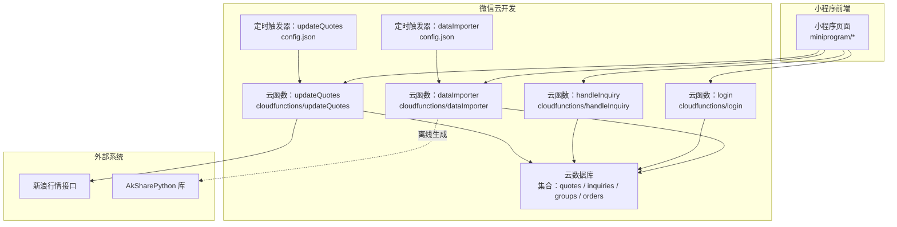
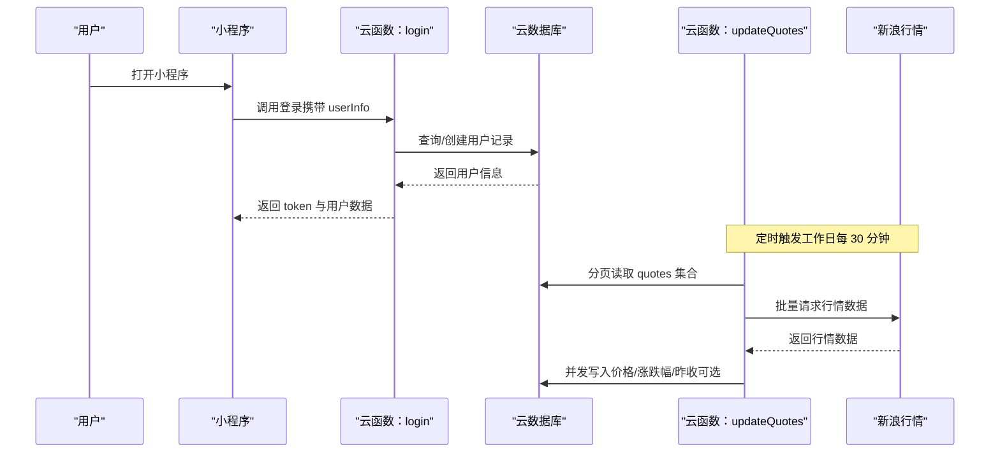
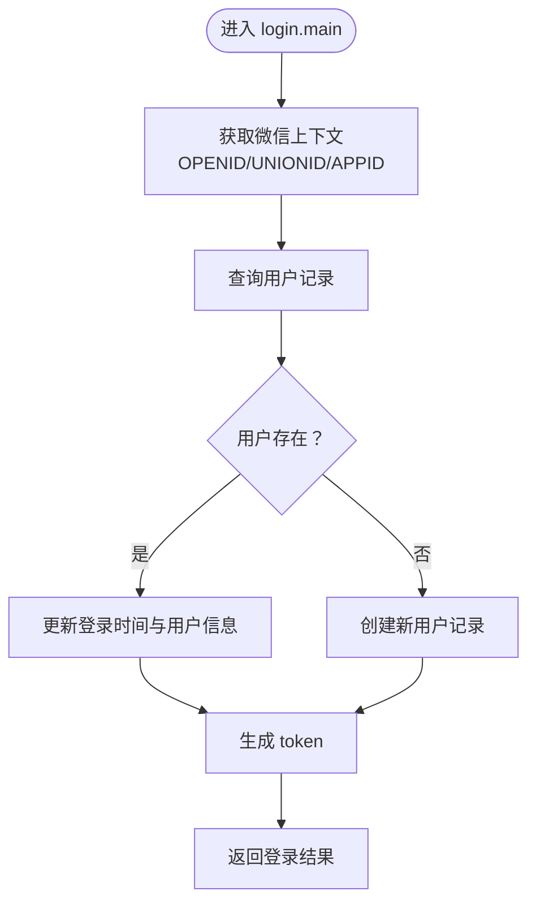
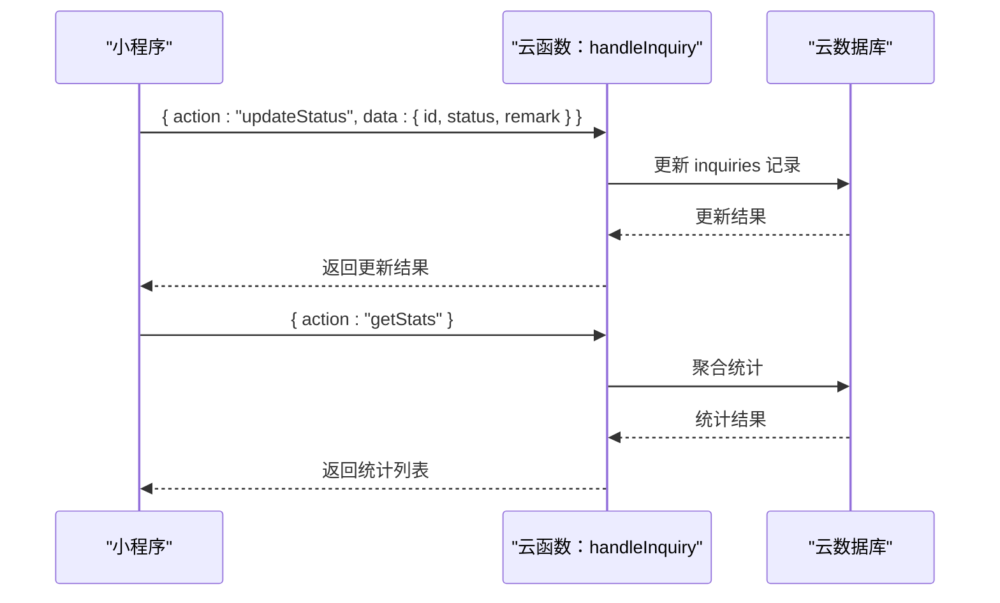
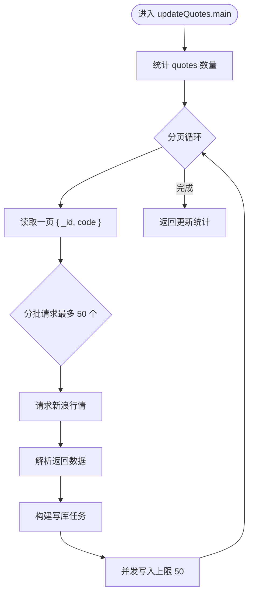
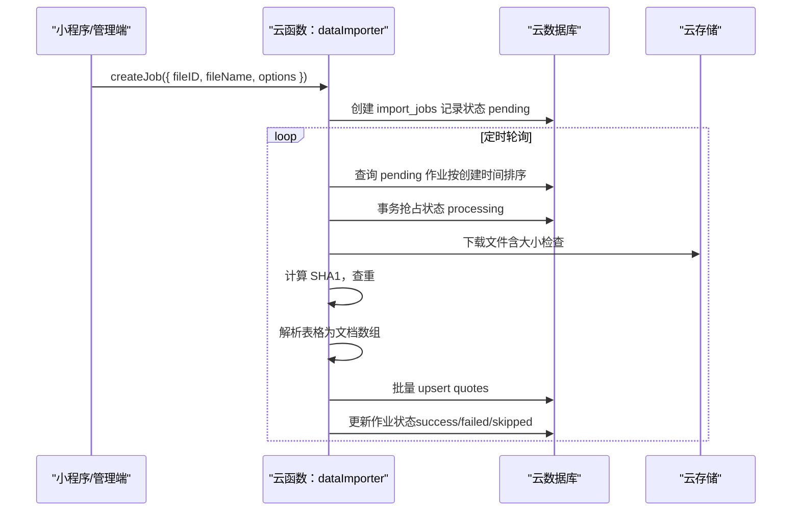
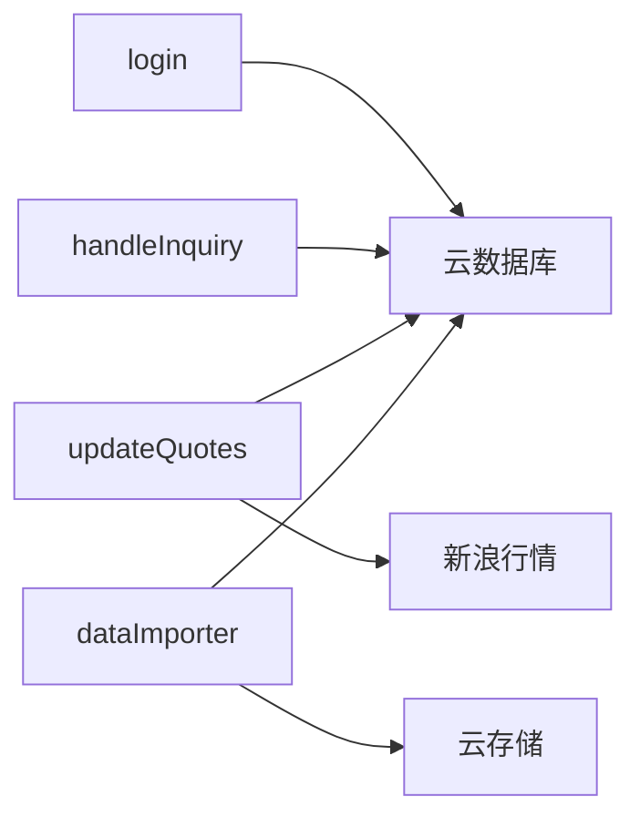

# 云服务架构设计

<cite>
**本文引用的文件**
- [cloudfunctions/dataImporter/index.js](file://cloudfunctions/dataImporter/index.js)
- [cloudfunctions/dataImporter/config.json](file://cloudfunctions/dataImporter/config.json)
- [cloudfunctions/updateQuotes/index.js](file://cloudfunctions/updateQuotes/index.js)
- [cloudfunctions/updateQuotes/config.json](file://cloudfunctions/updateQuotes/config.json)
- [cloudfunctions/handleInquiry/index.js](file://cloudfunctions/handleInquiry/index.js)
- [cloudfunctions/login/index.js](file://cloudfunctions/login/index.js)
- [CLOUD_README.md](file://CLOUD_README.md)
- [project.config.json](file://project.config.json)
- [miniprogram/app.json](file://miniprogram/app.json)
- [export_data_to_cloud.py](file://export_data_to_cloud.py)
- [cloud_import_data.json](file://cloud_import_data.json)
- [scripts/verify_cloud_setup.py](file://scripts/verify_cloud_setup.py)
- [deploy/README.md](file://deploy/README.md)
</cite>

## 目录
1. [引言](#引言)
2. [项目结构](#项目结构)
3. [核心组件](#核心组件)
4. [架构总览](#架构总览)
5. [组件详细分析](#组件详细分析)
6. [依赖关系分析](#依赖关系分析)
7. [性能考量](#性能考量)
8. [故障排除指南](#故障排除指南)
9. [结论](#结论)
10. [附录](#附录)

## 引言
本设计文档面向微信云开发的集成架构，围绕云函数、数据库与文件存储策略展开，系统性阐述云函数的设计模式、触发机制、异步处理与错误重试策略；同时给出与传统后端协作、数据同步与状态管理的方案，并覆盖安全配置、权限管理、成本优化、部署流程、版本管理与监控建议，最后提供最佳实践与故障排除指南。

## 项目结构
该项目采用“小程序前端 + 微信云开发（云函数 + 云数据库 + 云存储）”的轻量后端架构。云函数目录统一放置于 cloudfunctions 下，各云函数通过定时触发器或前端直接调用触发；前端通过 wx.cloud 初始化并访问数据库与云函数；Python 脚本负责离线生成数据并导入云数据库，形成“集中处理 + 云数据库”的数据流。

图表来源
- [project.config.json](file://project.config.json#L53-L53)
- [cloudfunctions/updateQuotes/config.json](file://cloudfunctions/updateQuotes/config.json#L5-L16)
- [cloudfunctions/dataImporter/config.json](file://cloudfunctions/dataImporter/config.json#L5-L12)
- [export_data_to_cloud.py](file://export_data_to_cloud.py#L1-L74)

章节来源
- [project.config.json](file://project.config.json#L53-L53)
- [miniprogram/app.json](file://miniprogram/app.json#L1-L78)

## 核心组件
- 云函数层
  - 登录鉴权：login，负责用户身份识别与用户记录的查询/创建。
  - 询价管理：handleInquiry，负责状态更新与统计聚合。
  - 行情更新：updateQuotes，负责定时抓取新浪行情并批量更新数据库。
  - 数据导入：dataImporter，负责解析上传文件、去重、批量入库与作业调度。
- 数据层
  - 云数据库：quotes（行情）、inquiries（询价）、groups（自选分组）、orders（订单）等集合。
- 触发器
  - updateQuotes：工作日定时拉取行情；dailyClosingUpdate：收盘后补充昨收。
  - dataImporter：周期轮询待处理作业，自动执行导入任务。
- 前端
  - 小程序通过 wx.cloud 初始化，直接读取数据库或调用云函数。

章节来源
- [cloudfunctions/login/index.js](file://cloudfunctions/login/index.js#L1-L92)
- [cloudfunctions/handleInquiry/index.js](file://cloudfunctions/handleInquiry/index.js#L1-L81)
- [cloudfunctions/updateQuotes/index.js](file://cloudfunctions/updateQuotes/index.js#L1-L180)
- [cloudfunctions/dataImporter/index.js](file://cloudfunctions/dataImporter/index.js#L1-L392)
- [cloudfunctions/updateQuotes/config.json](file://cloudfunctions/updateQuotes/config.json#L1-L17)
- [cloudfunctions/dataImporter/config.json](file://cloudfunctions/dataImporter/config.json#L1-L13)

## 架构总览
该架构以“前端直连云数据库 + 云函数编排”为核心，结合定时任务与离线导入，实现低运维成本、高扩展性的数据处理链路。云函数通过事务与分页/分批写入保障一致性与性能；前端通过小程序能力直接访问云数据库，减少传统后端服务器成本。

图表来源
- [cloudfunctions/login/index.js](file://cloudfunctions/login/index.js#L11-L92)
- [cloudfunctions/updateQuotes/index.js](file://cloudfunctions/updateQuotes/index.js#L95-L180)
- [cloudfunctions/updateQuotes/config.json](file://cloudfunctions/updateQuotes/config.json#L5-L16)

## 组件详细分析

### 云函数：登录（login）
- 设计模式
  - 典型的“鉴权 + 用户画像”云函数，基于微信上下文提取 OPENID/UNIONID，查询或创建用户记录，返回 token。
- 关键逻辑
  - 查询用户是否存在，存在则更新最近登录时间与用户信息；不存在则新增用户记录。
  - 生成简易 token（生产建议使用 JWT）。
- 错误处理
  - 捕获异常并返回结构化错误信息。
- 性能与安全
  - 读写均在云数据库内完成，避免跨服务调用；建议在前端侧对 token 做有效期与刷新策略。

图表来源
- [cloudfunctions/login/index.js](file://cloudfunctions/login/index.js#L11-L92)

章节来源
- [cloudfunctions/login/index.js](file://cloudfunctions/login/index.js#L1-L92)

### 云函数：询价管理（handleInquiry）
- 设计模式
  - 基于 action 的多路由云函数，支持状态更新与统计聚合。
- 关键逻辑
  - 状态更新：根据 id 更新状态、备注、更新时间与操作人 OPENID。
  - 统计聚合：按状态分组统计数量。
- 错误处理
  - 参数校验失败与数据库异常均返回明确错误信息。

图表来源
- [cloudfunctions/handleInquiry/index.js](file://cloudfunctions/handleInquiry/index.js#L12-L81)

章节来源
- [cloudfunctions/handleInquiry/index.js](file://cloudfunctions/handleInquiry/index.js#L1-L81)

### 云函数：行情更新（updateQuotes）
- 设计模式
  - 分页 + 分批 + 并发写入的“流式管道”处理，避免一次性加载导致 OOM。
- 关键逻辑
  - 分页读取 quotes 集合，按批次请求新浪行情，解析后并发写回数据库。
  - 支持通过触发器名称或事件参数决定是否更新昨收。
  - 对外网请求设置超时，避免阻塞。
- 错误处理
  - 单批次失败不影响其他批次；异常被捕获并记录。
- 性能与成本
  - 通过 PAGE_SIZE 与写并发控制吞吐；合理设置定时频率以平衡时效与成本。

图表来源
- [cloudfunctions/updateQuotes/index.js](file://cloudfunctions/updateQuotes/index.js#L95-L180)

章节来源
- [cloudfunctions/updateQuotes/index.js](file://cloudfunctions/updateQuotes/index.js#L1-L180)
- [cloudfunctions/updateQuotes/config.json](file://cloudfunctions/updateQuotes/config.json#L1-L17)

### 云函数：数据导入（dataImporter）
- 设计模式
  - 作业驱动（Job Queue）+ 事务抢占 + 并发写入，保证幂等与一致性。
- 关键逻辑
  - 作业创建：记录文件 ID、文件名、存储前缀、元数据与选项。
  - 作业抢占：事务保证同一作业只被一个实例处理。
  - 去重：基于文件 SHA1，避免重复导入。
  - 解析：支持复杂矩阵表头与常规表头两种模式，自动映射字段。
  - 批量入库：分批读取现有 ID 映射，区分新增/更新，支持静态字段优先策略。
  - 作业收尾：记录状态、耗时、错误信息与统计摘要。
- 错误处理与重试
  - 作业失败会标记失败并保留错误信息；定时轮询器会继续尝试处理待处理作业。
- 性能与成本
  - 读写均采用分块与并发控制；对超大文件进行内存上限检查，避免 OOM。

图表来源
- [cloudfunctions/dataImporter/index.js](file://cloudfunctions/dataImporter/index.js#L233-L340)
- [cloudfunctions/dataImporter/config.json](file://cloudfunctions/dataImporter/config.json#L5-L12)

章节来源
- [cloudfunctions/dataImporter/index.js](file://cloudfunctions/dataImporter/index.js#L1-L392)
- [cloudfunctions/dataImporter/config.json](file://cloudfunctions/dataImporter/config.json#L1-L13)

### 数据库与文件存储策略
- 集合设计
  - quotes：行情数据，包含基础字段与期权特有字段（如 underlying、strike、expiry、iv 等）。
  - inquiries：询价记录，包含状态、备注、操作人等。
  - groups：自选分组（名称为主）。
  - orders：订单数据（按需扩展）。
- 存储与导入
  - Python 脚本导出 JSON Lines 文件，再通过云开发控制台或 HTTP API 导入云数据库。
  - dataImporter 亦可解析上传的 Excel 并入库，支持去重与作业追踪。
- 权限与安全
  - 建议将集合权限设为“所有用户可读，仅创建者可读写”，或根据业务细化角色权限。
  - 云函数内严格限定字段写入范围（静态字段优先），降低越权风险。

章节来源
- [CLOUD_README.md](file://CLOUD_README.md#L34-L42)
- [export_data_to_cloud.py](file://export_data_to_cloud.py#L1-L74)
- [cloud_import_data.json](file://cloud_import_data.json#L1-L10)

### 与传统后端协作机制
- 替代方案
  - 将原 Python 后端的部分能力迁移至云函数与云数据库，前端直连云数据库或通过云函数编排，减少服务器运维成本。
- 协作方式
  - Python 脚本负责离线数据生成与导入；云函数负责在线业务编排与定时任务。
  - 通过 HTTP API（Access Token）实现自动化导入，无需人工干预。

章节来源
- [CLOUD_README.md](file://CLOUD_README.md#L43-L87)
- [scripts/verify_cloud_setup.py](file://scripts/verify_cloud_setup.py#L51-L96)

### 数据同步与状态管理
- 同步策略
  - 行情：定时任务增量更新；询价：前端提交后状态流转，后台统计聚合。
  - 导入：作业队列 + 去重 + 幂等写入，失败重试由轮询器兜底。
- 状态管理
  - 作业状态：pending → processing → success/failed/skipped。
  - 询价状态：前端提交后由管理员更新，支持按状态统计。

章节来源
- [cloudfunctions/updateQuotes/index.js](file://cloudfunctions/updateQuotes/index.js#L95-L180)
- [cloudfunctions/handleInquiry/index.js](file://cloudfunctions/handleInquiry/index.js#L12-L81)
- [cloudfunctions/dataImporter/index.js](file://cloudfunctions/dataImporter/index.js#L233-L340)

### 触发机制、异步处理与错误重试
- 触发机制
  - updateQuotes：工作日定时拉取行情；dailyClosingUpdate：收盘后补充昨收。
  - dataImporter：定时轮询 pending 作业，自动执行导入。
- 异步处理
  - 云函数内部采用分页/分批/并发写入，避免 OOM 与长事务。
  - 外网请求设置超时，失败不阻塞主流程。
- 错误重试
  - 作业失败标记失败并保留错误信息；定时轮询器继续尝试处理。
  - 建议在前端对关键操作增加重试与退避策略。

章节来源
- [cloudfunctions/updateQuotes/config.json](file://cloudfunctions/updateQuotes/config.json#L5-L16)
- [cloudfunctions/dataImporter/config.json](file://cloudfunctions/dataImporter/config.json#L5-L12)
- [cloudfunctions/updateQuotes/index.js](file://cloudfunctions/updateQuotes/index.js#L130-L136)
- [cloudfunctions/dataImporter/index.js](file://cloudfunctions/dataImporter/index.js#L320-L340)

### 安全配置、权限管理与成本优化
- 安全配置
  - 云函数初始化使用动态环境 ID，避免硬编码。
  - 建议为敏感操作启用云函数权限与来源校验。
- 权限管理
  - 集合权限建议“所有用户可读，仅创建者可读写”，或按角色细化。
  - 用户登录后返回 OPENID，便于后续审计与权限控制。
- 成本优化
  - 合理设置定时频率与并发度，避免过度调用。
  - 使用分页与并发写入，缩短任务时长，降低计费时长。
  - 对超大文件进行内存上限检查，避免 OOM 导致的失败重试。

章节来源
- [cloudfunctions/login/index.js](file://cloudfunctions/login/index.js#L4-L6)
- [cloudfunctions/updateQuotes/index.js](file://cloudfunctions/updateQuotes/index.js#L106-L164)
- [cloudfunctions/dataImporter/index.js](file://cloudfunctions/dataImporter/index.js#L276-L318)
- [CLOUD_README.md](file://CLOUD_README.md#L34-L42)

### 部署流程、版本管理与监控
- 部署流程
  - 在微信开发者工具中上传并部署云函数；创建所需集合并设置权限。
  - 前端通过 wx.cloud.init 指定环境 ID，确保与云函数一致。
- 版本管理
  - 云函数支持版本与别名管理，建议灰度发布与回滚策略。
- 监控方案
  - 使用云开发控制台查看云函数日志、调用次数与耗时。
  - 建议对关键作业（导入、行情更新）设置告警阈值。

章节来源
- [CLOUD_README.md](file://CLOUD_README.md#L15-L42)
- [project.config.json](file://project.config.json#L53-L53)
- [deploy/README.md](file://deploy/README.md#L1-L44)

## 依赖关系分析
- 组件耦合
  - 云函数之间低耦合，主要通过云数据库交互；updateQuotes 依赖新浪行情接口；dataImporter 依赖云存储下载。
- 外部依赖
  - 外网 HTTP 请求（新浪行情）与第三方库（AkShare）。
- 潜在风险
  - 外网请求超时与失败；定时任务频率过高导致成本上升；文件过大引发内存溢出。

图表来源
- [cloudfunctions/login/index.js](file://cloudfunctions/login/index.js#L11-L92)
- [cloudfunctions/handleInquiry/index.js](file://cloudfunctions/handleInquiry/index.js#L12-L81)
- [cloudfunctions/updateQuotes/index.js](file://cloudfunctions/updateQuotes/index.js#L95-L180)
- [cloudfunctions/dataImporter/index.js](file://cloudfunctions/dataImporter/index.js#L273-L318)

章节来源
- [cloudfunctions/updateQuotes/index.js](file://cloudfunctions/updateQuotes/index.js#L32-L56)
- [cloudfunctions/dataImporter/index.js](file://cloudfunctions/dataImporter/index.js#L273-L318)

## 性能考量
- 内存与吞吐
  - 分页读取、分批请求、并发写入，避免一次性加载全部数据。
- 网络与超时
  - 外网请求设置超时，失败不阻塞主流程。
- 定时策略
  - 行情更新按工作日 30 分钟一次，收盘后补充昨收，兼顾时效与成本。
- 字段写入控制
  - 静态字段优先策略，减少无关字段写入，提升写入效率。

章节来源
- [cloudfunctions/updateQuotes/index.js](file://cloudfunctions/updateQuotes/index.js#L106-L164)
- [cloudfunctions/updateQuotes/index.js](file://cloudfunctions/updateQuotes/index.js#L130-L136)
- [cloudfunctions/dataImporter/index.js](file://cloudfunctions/dataImporter/index.js#L182-L231)

## 故障排除指南
- 云函数报错
  - 查看云函数日志定位异常；确认外网请求超时与失败重试策略是否生效。
- 数据导入失败
  - 检查文件大小是否超过限制；确认 SHA1 去重逻辑与作业状态是否正确流转。
- 行情更新异常
  - 检查定时触发器配置与网络可达性；确认分页/并发参数是否合理。
- 权限问题
  - 校验集合权限设置；使用脚本验证 Access Token 与集合存在性。

章节来源
- [cloudfunctions/updateQuotes/index.js](file://cloudfunctions/updateQuotes/index.js#L130-L136)
- [cloudfunctions/dataImporter/index.js](file://cloudfunctions/dataImporter/index.js#L276-L318)
- [scripts/verify_cloud_setup.py](file://scripts/verify_cloud_setup.py#L51-L96)

## 结论
该架构以微信云开发为核心，通过云函数与云数据库实现低成本、可扩展的数据处理与业务编排。定时任务与离线导入相结合，既满足实时性要求又控制成本；通过作业队列与事务保障一致性；前端直连云数据库简化了传统后端依赖。建议在生产环境中进一步完善权限模型、监控告警与版本发布策略，持续优化定时频率与并发参数，确保系统稳定与成本可控。

## 附录
- 前端初始化与调用示例
  - 参考云开发使用指南中的前端调用示例，包括获取行情与提交询价。
- Python 导入脚本
  - 使用 AkShare 获取数据并导出为 JSON Lines，便于导入云数据库。

章节来源
- [CLOUD_README.md](file://CLOUD_README.md#L61-L87)
- [export_data_to_cloud.py](file://export_data_to_cloud.py#L1-L74)
- [cloud_import_data.json](file://cloud_import_data.json#L1-L10)