# 云函数架构设计

<cite>
**本文档引用的文件**
- [app.py](file://cloudfunctions/flask-backend/app.py)
- [main.py](file://cloudfunctions/flask-backend/main.py)
- [config.py](file://cloudfunctions/flask-backend/config.py)
- [requirements.txt](file://cloudfunctions/flask-backend/requirements.txt)
- [cloud_db.py](file://cloudfunctions/flask-backend/services/cloud_db.py)
- [inquiry.py](file://cloudfunctions/flask-backend/routes/inquiry.py)
- [inquiry_model.py](file://cloudfunctions/flask-backend/models/inquiry.py)
- [user_model.py](file://cloudfunctions/flask-backend/models/user.py)
- [customer_model.py](file://cloudfunctions/flask-backend/models/customer.py)
- [index.js](file://cloudfunctions/dataImporter/index.js)
- [updateQuotes/index.js](file://cloudfunctions/updateQuotes/index.js)
- [initDatabase/index.js](file://cloudfunctions/initDatabase/index.js)
- [handleInquiry/index.js](file://cloudfunctions/handleInquiry/index.js)
- [submitInquiry/index.js](file://cloudfunctions/submitInquiry/index.js)
</cite>

## 目录
1. [项目概述](#项目概述)
2. [整体架构](#整体架构)
3. [核心组件分析](#核心组件分析)
4. [数据流设计](#数据流设计)
5. [云函数实现](#云函数实现)
6. [数据库架构](#数据库架构)
7. [安全与权限](#安全与权限)
8. [性能优化策略](#性能优化策略)
9. [部署与运维](#部署与运维)
10. [故障排除指南](#故障排除指南)

## 项目概述

本项目是一个基于微信云开发的场外期权交易平台，采用前后端分离架构，通过云函数提供RESTful API服务。系统支持期权询价、行情更新、用户管理、订单处理等核心功能。

## 整体架构

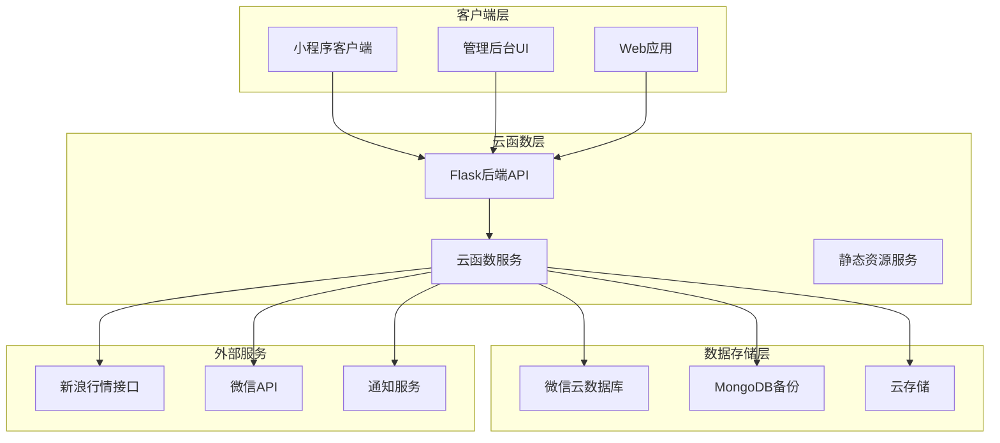

**图表来源**
- [app.py:152-442](file://cloudfunctions/flask-backend/app.py#L152-L442)
- [main.py:10-73](file://cloudfunctions/flask-backend/main.py#L10-L73)

## 核心组件分析

### Flask后端服务

Flask后端作为主要的API网关，提供了完整的RESTful服务：

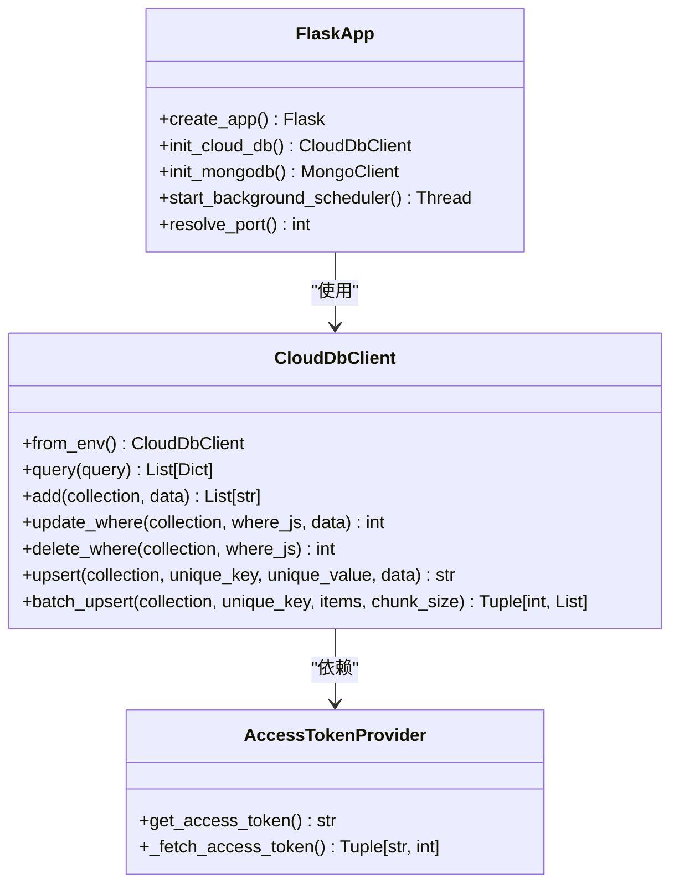

**图表来源**
- [app.py:152-442](file://cloudfunctions/flask-backend/app.py#L152-L442)
- [cloud_db.py:112-232](file://cloudfunctions/flask-backend/services/cloud_db.py#L112-L232)

**章节来源**
- [app.py:152-442](file://cloudfunctions/flask-backend/app.py#L152-L442)
- [cloud_db.py:112-232](file://cloudfunctions/flask-backend/services/cloud_db.py#L112-L232)

### 云函数架构

系统采用多种云函数实现不同业务场景：

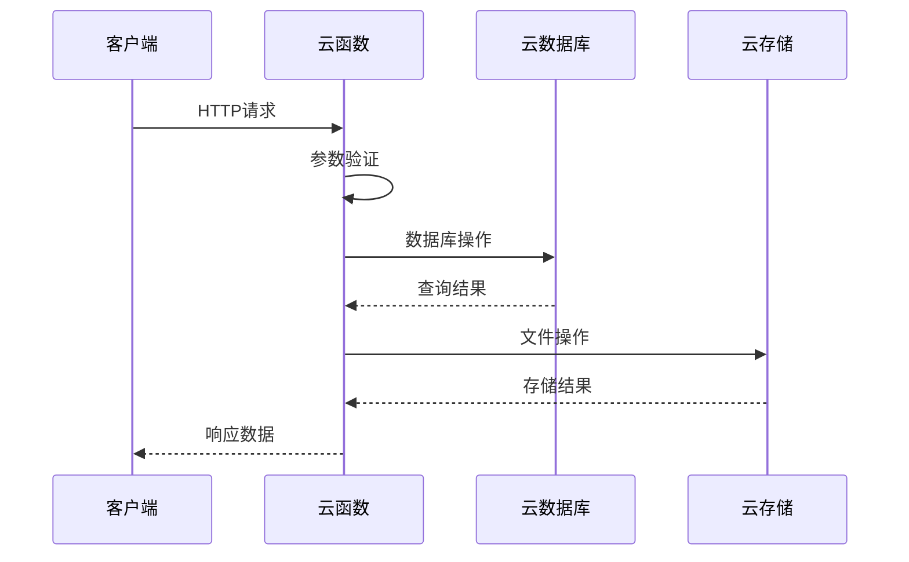

**图表来源**
- [main.py:10-73](file://cloudfunctions/flask-backend/main.py#L10-L73)
- [index.js:342-391](file://cloudfunctions/dataImporter/index.js#L342-L391)

**章节来源**
- [main.py:10-73](file://cloudfunctions/flask-backend/main.py#L10-L73)
- [index.js:342-391](file://cloudfunctions/dataImporter/index.js#L342-L391)

## 数据流设计

### 询价处理流程

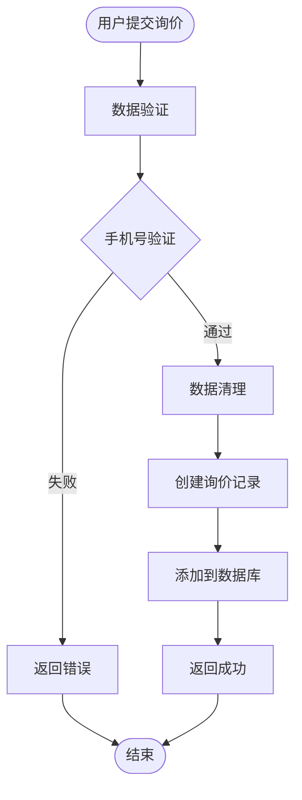

**图表来源**
- [submitInquiry/index.js:43-90](file://cloudfunctions/submitInquiry/index.js#L43-L90)
- [inquiry.py:138-171](file://cloudfunctions/flask-backend/routes/inquiry.py#L138-L171)

### 行情更新流程

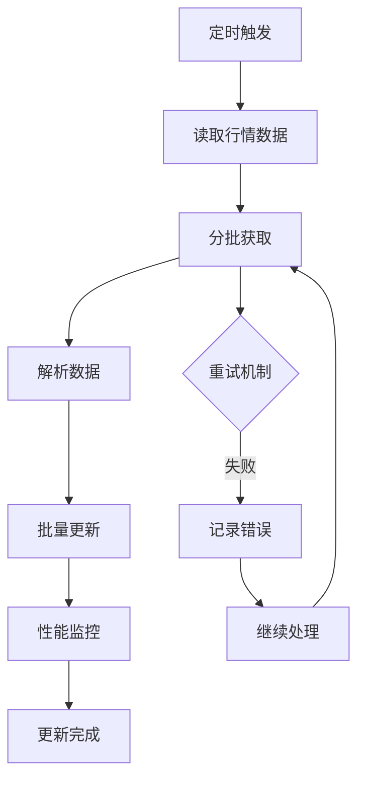

**图表来源**
- [updateQuotes/index.js:177-285](file://cloudfunctions/updateQuotes/index.js#L177-L285)

**章节来源**
- [submitInquiry/index.js:43-90](file://cloudfunctions/submitInquiry/index.js#L43-L90)
- [inquiry.py:138-171](file://cloudfunctions/flask-backend/routes/inquiry.py#L138-L171)
- [updateQuotes/index.js:177-285](file://cloudfunctions/updateQuotes/index.js#L177-L285)

## 云函数实现

### 数据导入云函数

数据导入云函数实现了复杂的数据处理和批量导入功能：

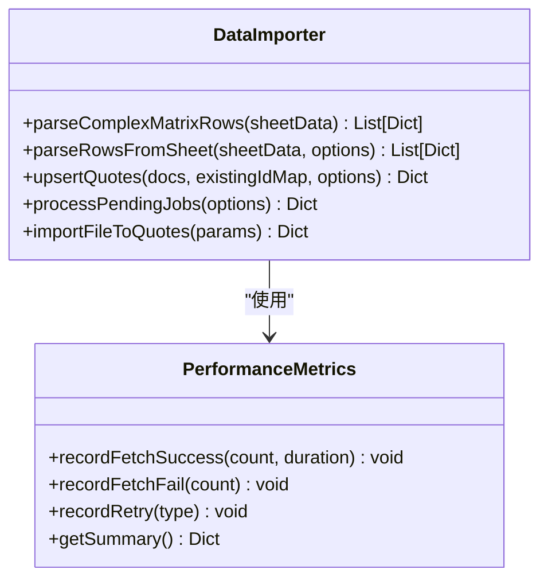

**图表来源**
- [index.js:133-318](file://cloudfunctions/dataImporter/index.js#L133-L318)

### 数据库初始化云函数

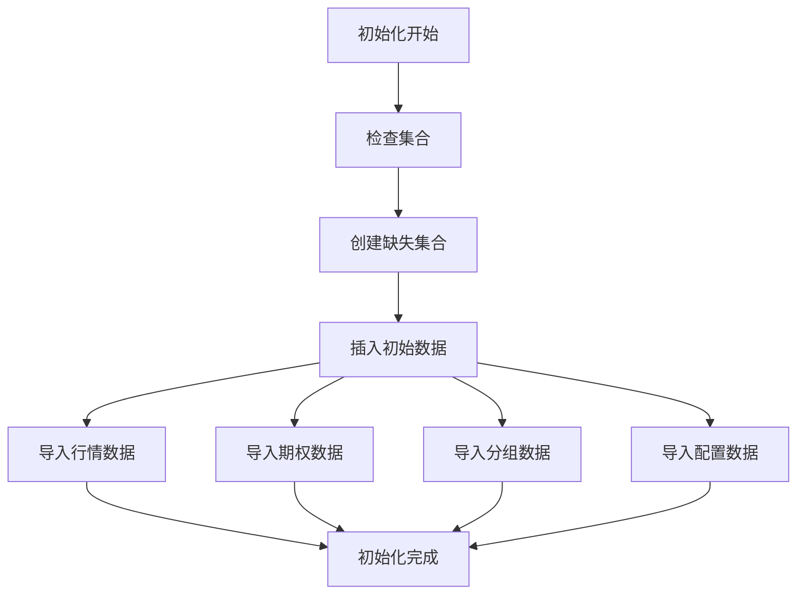

**图表来源**
- [initDatabase/index.js:348-386](file://cloudfunctions/initDatabase/index.js#L348-L386)

**章节来源**
- [index.js:133-318](file://cloudfunctions/dataImporter/index.js#L133-L318)
- [initDatabase/index.js:348-386](file://cloudfunctions/initDatabase/index.js#L348-L386)

## 数据库架构

### 数据模型设计

系统采用双数据库架构，微信云数据库作为主数据源，MongoDB作为备份：

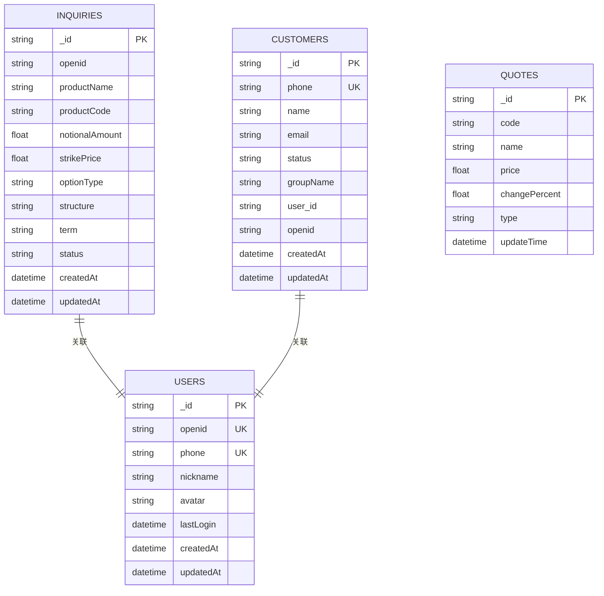

**图表来源**
- [inquiry_model.py:10-382](file://cloudfunctions/flask-backend/models/inquiry.py#L10-L382)
- [user_model.py:10-505](file://cloudfunctions/flask-backend/models/user.py#L10-L505)
- [customer_model.py:10-304](file://cloudfunctions/flask-backend/models/customer.py#L10-L304)

**章节来源**
- [inquiry_model.py:10-382](file://cloudfunctions/flask-backend/models/inquiry.py#L10-L382)
- [user_model.py:10-505](file://cloudfunctions/flask-backend/models/user.py#L10-L505)
- [customer_model.py:10-304](file://cloudfunctions/flask-backend/models/customer.py#L10-L304)

## 安全与权限

### 认证授权机制

系统实现了多层次的安全防护：

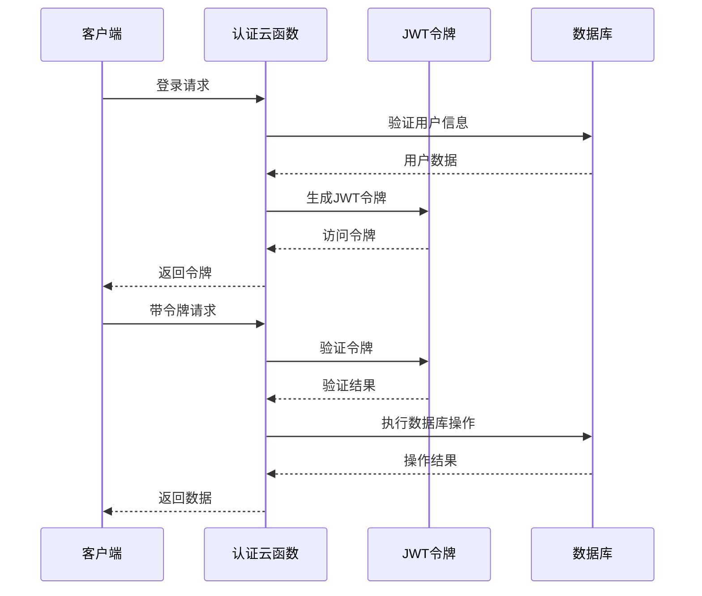

**图表来源**
- [inquiry.py:17-24](file://cloudfunctions/flask-backend/routes/inquiry.py#L17-L24)

### 数据访问控制

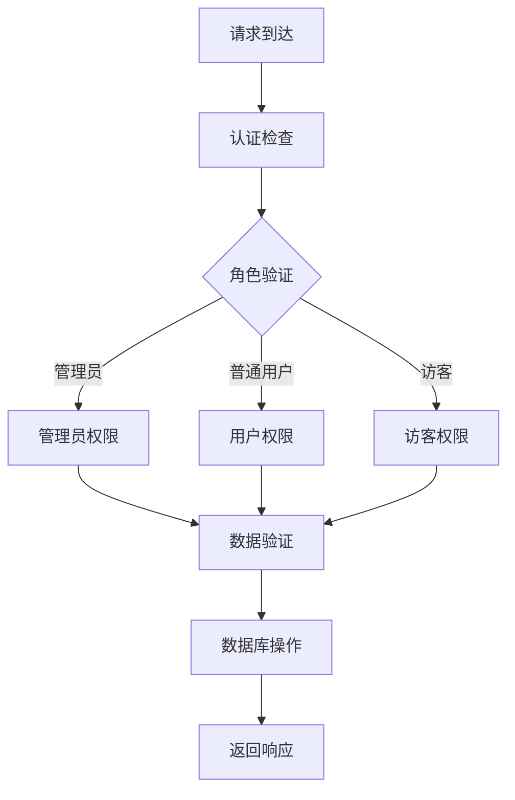

**图表来源**
- [inquiry.py:173-201](file://cloudfunctions/flask-backend/routes/inquiry.py#L173-L201)

**章节来源**
- [inquiry.py:17-24](file://cloudfunctions/flask-backend/routes/inquiry.py#L17-L24)
- [inquiry.py:173-201](file://cloudfunctions/flask-backend/routes/inquiry.py#L173-L201)

## 性能优化策略

### 连接池管理

云数据库客户端实现了智能的连接池管理：

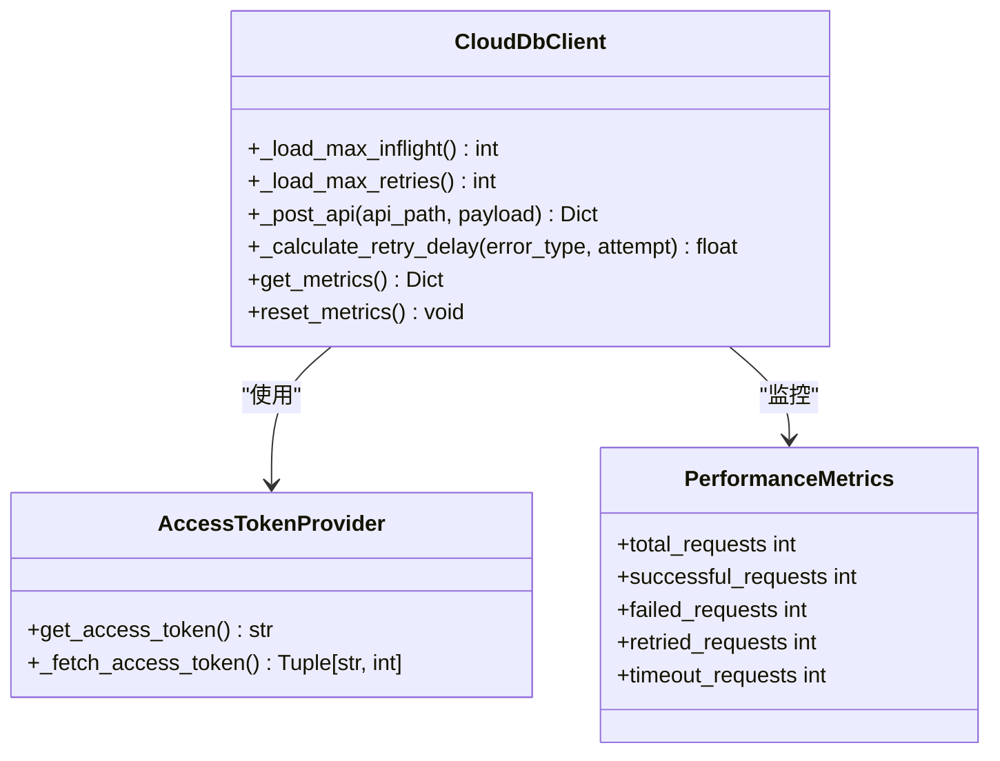

**图表来源**
- [cloud_db.py:112-636](file://cloudfunctions/flask-backend/services/cloud_db.py#L112-L636)

### 批量处理优化

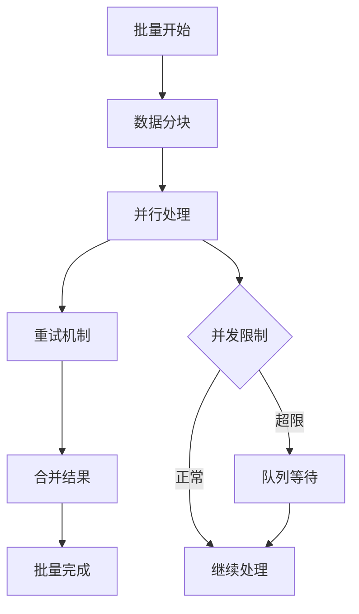

**图表来源**
- [cloud_db.py:356-509](file://cloudfunctions/flask-backend/services/cloud_db.py#L356-L509)

**章节来源**
- [cloud_db.py:112-636](file://cloudfunctions/flask-backend/services/cloud_db.py#L112-L636)
- [cloud_db.py:356-509](file://cloudfunctions/flask-backend/services/cloud_db.py#L356-L509)

## 部署与运维

### 环境配置

系统支持多环境部署，通过环境变量控制配置：

| 环境变量 | 描述 | 默认值 |
|---------|------|--------|
| NODE_ENV | 应用环境 | development |
| WX_CLOUD_ENV | 微信云环境ID | develop-8gx7kh9g045e6c9a |
| WX_APPID | 微信应用ID | 空 |
| WX_SECRET | 微信应用密钥 | 空 |
| FLASK_PORT | Flask端口 | 5002 |
| ENABLE_AUTO_SYNC | 启用自动同步 | false |

### 监控告警

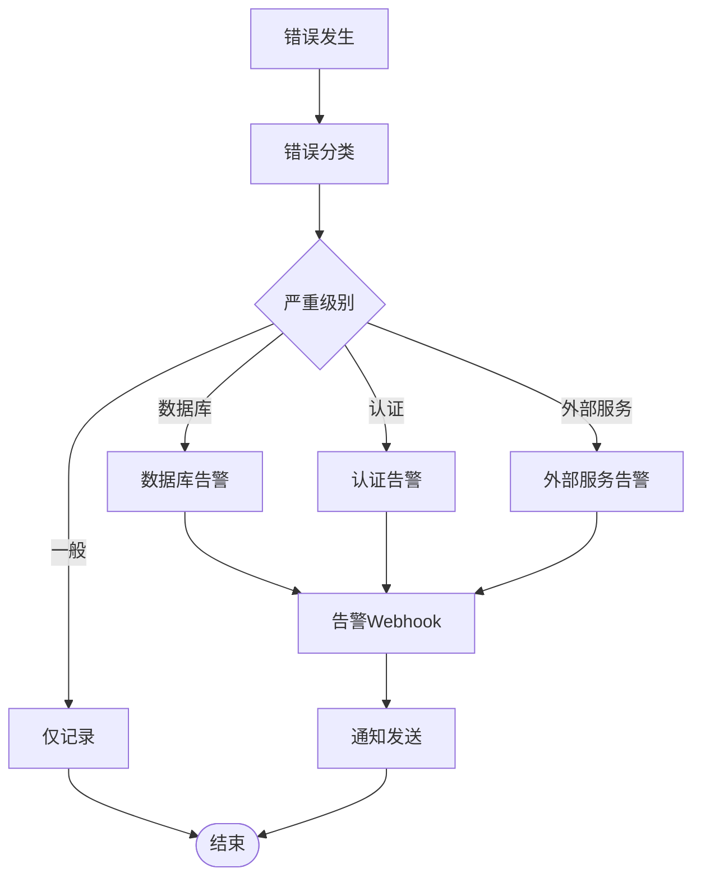

**图表来源**
- [app.py:445-466](file://cloudfunctions/flask-backend/app.py#L445-L466)
- [app.py:469-508](file://cloudfunctions/flask-backend/app.py#L469-L508)

**章节来源**
- [app.py:445-466](file://cloudfunctions/flask-backend/app.py#L445-L466)
- [app.py:469-508](file://cloudfunctions/flask-backend/app.py#L469-L508)

## 故障排除指南

### 常见问题诊断

| 问题类型 | 症状 | 解决方案 |
|---------|------|----------|
| 数据库连接失败 | 500错误，连接超时 | 检查WX_CLOUD_ENV配置，验证网络连通性 |
| API响应缓慢 | 响应时间超过3秒 | 检查并发设置，优化查询索引 |
| 文件上传失败 | 5MB限制错误 | 优化文件大小，使用分片上传 |
| 行情更新异常 | 部分数据更新失败 | 检查重试机制，验证网络稳定性 |

### 性能调优建议

1. **连接池优化**：根据业务量调整`WX_DB_MAX_INFLIGHT`参数
2. **缓存策略**：合理使用Redis缓存热点数据
3. **数据库索引**：为常用查询字段建立复合索引
4. **异步处理**：将耗时操作改为异步执行

**章节来源**
- [app.py:511-532](file://cloudfunctions/flask-backend/app.py#L511-L532)
- [cloud_db.py:166-185](file://cloudfunctions/flask-backend/services/cloud_db.py#L166-L185)