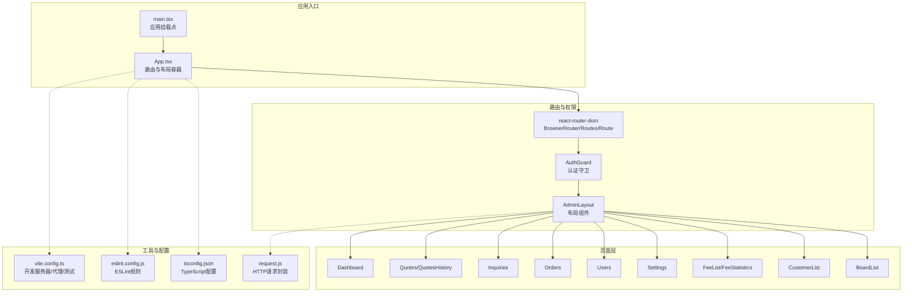
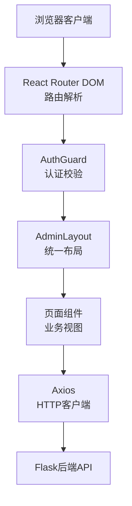
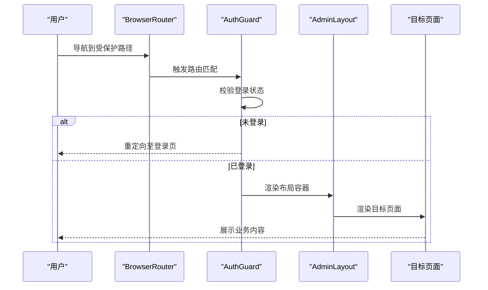
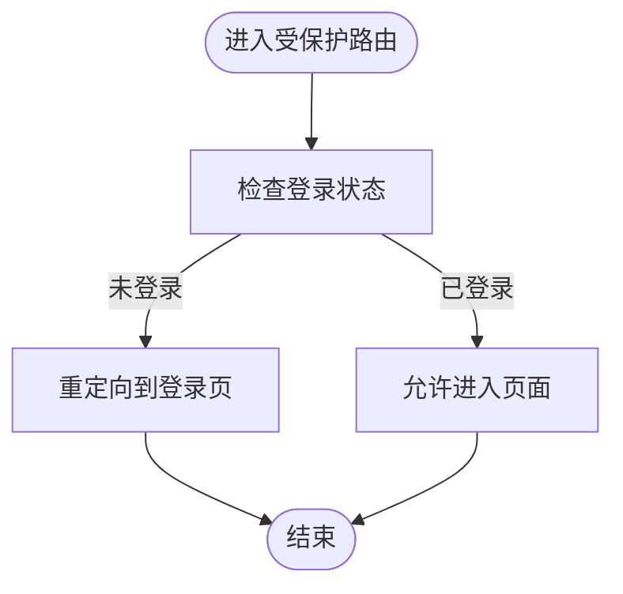
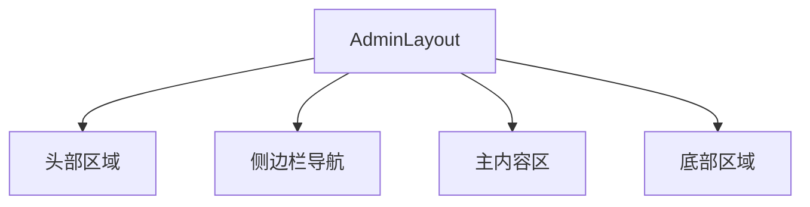
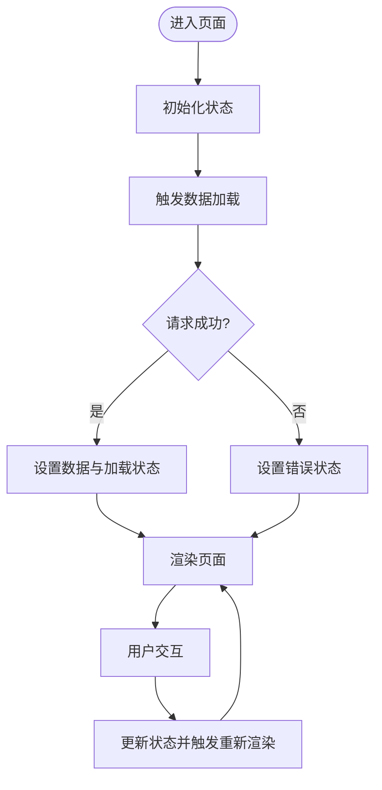
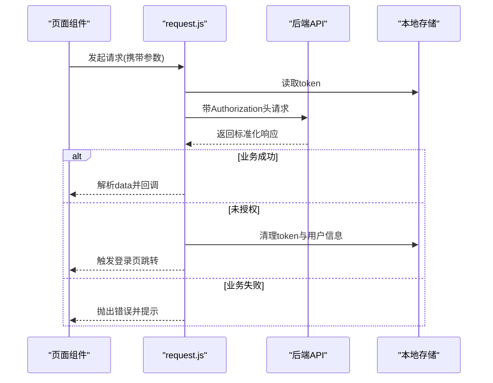
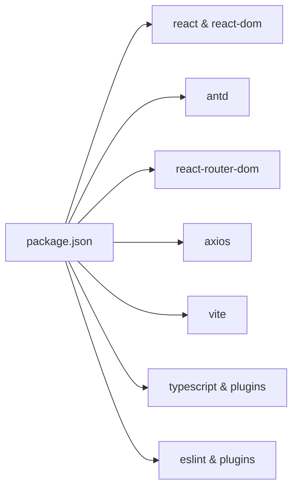

# React管理后台架构

<cite>
**本文档引用的文件**
- [package.json](file://admin-ui/package.json)
- [vite.config.ts](file://admin-ui/vite.config.ts)
- [main.tsx](file://admin-ui/src/main.tsx)
- [App.tsx](file://admin-ui/src/App.tsx)
- [tsconfig.json](file://admin-ui/tsconfig.json)
- [eslint.config.js](file://admin-ui/eslint.config.js)
- [request.js](file://utils/request.js)
</cite>

## 目录
1. [引言](#引言)
2. [项目结构](#项目结构)
3. [核心组件](#核心组件)
4. [架构总览](#架构总览)
5. [详细组件分析](#详细组件分析)
6. [依赖关系分析](#依赖关系分析)
7. [性能考虑](#性能考虑)
8. [故障排除指南](#故障排除指南)
9. [结论](#结论)
10. [附录](#附录)

## 引言
本文件面向React管理后台的架构设计与实现，重点阐述组件化架构、路由系统、状态管理模式、组件复用机制、前端与后端API交互模式、错误处理策略以及开发与部署流程。文档同时覆盖Ant Design组件库集成、TypeScript类型系统配置与Vite构建工具优化策略，帮助开发者快速理解并高效维护该系统。

## 项目结构
React管理后台位于admin-ui目录，采用现代前端技术栈：React 19、TypeScript、Vite 7、Ant Design 6、React Router DOM 7。项目通过分层组织实现高内聚低耦合：入口脚本负责应用挂载；路由层定义页面路径与权限守卫；页面层承载业务视图；组件层提供可复用UI与布局；工具层封装请求与通用逻辑。

**图表来源**
- [main.tsx](file://admin-ui/src/main.tsx#L1-L14)
- [App.tsx](file://admin-ui/src/App.tsx#L1-L57)
- [vite.config.ts](file://admin-ui/vite.config.ts#L1-L78)
- [eslint.config.js](file://admin-ui/eslint.config.js#L1-L24)
- [tsconfig.json](file://admin-ui/tsconfig.json#L1-L8)
- [request.js](file://utils/request.js#L1-L70)

**章节来源**
- [package.json](file://admin-ui/package.json#L1-L38)
- [vite.config.ts](file://admin-ui/vite.config.ts#L1-L78)
- [main.tsx](file://admin-ui/src/main.tsx#L1-L14)
- [App.tsx](file://admin-ui/src/App.tsx#L1-L57)
- [tsconfig.json](file://admin-ui/tsconfig.json#L1-L8)
- [eslint.config.js](file://admin-ui/eslint.config.js#L1-L24)

## 核心组件
- 应用入口与挂载
  - main.tsx负责在DOM根节点渲染应用，并包裹Ant Design的全局上下文组件以启用其主题与国际化能力。
- 路由与权限控制
  - App.tsx集中声明所有路由，使用BrowserRouter进行历史模式路由管理；通过AuthGuard对受保护页面进行认证拦截。
- 布局组件
  - AdminLayout作为页面容器，提供统一的侧边栏导航、面包屑、头部区域等，确保各页面共享一致的视觉与交互体验。
- 页面组件
  - Dashboard、Quotes、QuotesHistory、Inquiries、Orders、Users、Settings、FeeList、FeeStatistics、CustomerList、BoardList等，分别对应不同业务域。
- 请求封装
  - request.js提供统一的HTTP请求方法（get/post/put/delete），内置鉴权头注入与401处理逻辑，便于跨页面复用。

**章节来源**
- [main.tsx](file://admin-ui/src/main.tsx#L1-L14)
- [App.tsx](file://admin-ui/src/App.tsx#L1-L57)
- [request.js](file://utils/request.js#L1-L70)

## 架构总览
系统采用“入口挂载 → 路由分发 → 权限守卫 → 布局容器 → 页面视图”的分层架构。Ant Design提供丰富的UI组件与设计体系，React Router DOM负责页面导航与参数传递，Axios用于HTTP通信，Vite提供开发与构建支持。

**图表来源**
- [App.tsx](file://admin-ui/src/App.tsx#L1-L57)
- [main.tsx](file://admin-ui/src/main.tsx#L1-L14)
- [request.js](file://utils/request.js#L1-L70)

## 详细组件分析

### 路由系统设计
- 路由组织
  - 使用嵌套路由与路径前缀实现模块化管理，如费用管理、客户管理、行情管理、交易管理、消息管理、配置管理等。
  - 提供旧路由兼容，保证迁移期间的平滑过渡。
- 权限守卫
  - AuthGuard包裹AdminLayout，未通过认证时阻止进入受保护页面，保障后台访问安全。
- 路由切换与参数
  - 通过路由参数与查询字符串传递业务数据，结合页面内的状态管理实现动态渲染。

**图表来源**
- [App.tsx](file://admin-ui/src/App.tsx#L1-L57)

**章节来源**
- [App.tsx](file://admin-ui/src/App.tsx#L1-L57)

### 认证守卫（AuthGuard）
- 设计理念
  - 在路由层进行统一认证拦截，避免重复在每个页面中编写登录判断逻辑，提升代码复用性与安全性。
- 实现要点
  - 与路由守卫配合，根据用户状态决定是否允许进入受保护页面。
  - 可扩展为角色权限校验，满足多角色后台场景。

**图表来源**
- [App.tsx](file://admin-ui/src/App.tsx#L1-L57)

**章节来源**
- [App.tsx](file://admin-ui/src/App.tsx#L1-L57)

### 布局组件（AdminLayout）
- 设计理念
  - 提供统一的头部、侧边栏、主内容区与底部区域，确保后台界面风格一致。
- 复用机制
  - 所有业务页面均通过AdminLayout进行包裹，减少重复代码，便于统一更新主题与导航行为。

**图表来源**
- [App.tsx](file://admin-ui/src/App.tsx#L1-L57)

**章节来源**
- [App.tsx](file://admin-ui/src/App.tsx#L1-L57)

### 页面状态管理（PageState）
- 设计理念
  - 页面级状态通过React Hooks进行管理，结合useEffect处理副作用与数据加载。
  - 对于跨页面共享的状态，建议引入集中式状态管理（如Zustand或Redux Toolkit），以降低组件间通信复杂度。
- 状态粒度
  - 列表页：查询条件、分页参数、排序字段、加载状态、数据列表。
  - 表单页：表单字段值、校验结果、提交状态。
  - 详情页：主键、详情数据、操作按钮状态。

**图表来源**
- [App.tsx](file://admin-ui/src/App.tsx#L1-L57)

**章节来源**
- [App.tsx](file://admin-ui/src/App.tsx#L1-L57)

### Ant Design组件库集成
- 组件选择
  - 表格、表单、模态框、标签页、面包屑、下拉菜单等常用组件提升开发效率与一致性。
- 主题与国际化
  - 通过AntdApp全局上下文启用主题变量与国际化配置，确保组件样式与文案符合后台规范。
- 样式管理
  - 推荐使用CSS Modules或styled-components管理组件样式，避免全局污染；必要时可在全局样式中覆盖Antd默认样式。

**章节来源**
- [main.tsx](file://admin-ui/src/main.tsx#L1-L14)

### TypeScript类型系统配置
- 多配置文件
  - 通过tsconfig.json聚合多个子配置，分别针对应用与Node工具链，确保编译器行为一致。
- 类型增强
  - 为Axios响应、路由参数、表单字段等定义强类型接口，提升开发体验与运行时稳定性。

**章节来源**
- [tsconfig.json](file://admin-ui/tsconfig.json#L1-L8)

### Vite构建工具优化策略
- 开发服务器与代理
  - 支持本地与云端两种代理模式，自动注入超时与错误处理，提升开发体验。
- 插件生态
  - 集成React热更新插件，提升开发效率；测试环境使用jsdom，保证单元测试可用。
- 构建优化
  - 通过基础路径与去重策略减少包体积，结合生产环境压缩与缓存策略提升首屏性能。

**章节来源**
- [vite.config.ts](file://admin-ui/vite.config.ts#L1-L78)

### 前端与后端API交互模式
- 请求封装
  - request.js提供统一的HTTP方法封装，自动注入Authorization头，处理401与业务错误码，简化页面调用。
- 错误处理
  - 对网络异常与业务错误进行分类处理，未授权时清理本地存储并跳转登录页。
- 数据流设计
  - 页面发起请求 → 服务端返回标准化响应 → 组件更新状态 → UI渲染，形成清晰的数据流闭环。

**图表来源**
- [request.js](file://utils/request.js#L1-L70)

**章节来源**
- [request.js](file://utils/request.js#L1-L70)

## 依赖关系分析
- 运行时依赖
  - React与React DOM提供UI渲染与生命周期管理；Ant Design提供UI组件与主题；React Router DOM负责路由；Axios处理HTTP请求。
- 开发依赖
  - Vite提供开发服务器与打包；TypeScript与相关插件提供类型检查与编译；ESLint与插件保证代码质量。
- 环境变量
  - 通过Vite加载仓库根目录下的环境变量，支持本地与云端代理切换。

**图表来源**
- [package.json](file://admin-ui/package.json#L1-L38)

**章节来源**
- [package.json](file://admin-ui/package.json#L1-L38)

## 性能考虑
- 代码分割与懒加载
  - 对大型页面或不常用模块进行按需加载，减少初始包体积。
- 图片与静态资源
  - 使用合适的图片格式与尺寸，开启压缩与缓存策略。
- 状态更新优化
  - 使用React.memo、useMemo、useCallback避免不必要的重渲染。
- 构建优化
  - 启用Tree Shaking与最小化策略，合理拆分vendor包，利用CDN加速静态资源。

## 故障排除指南
- 开发代理失败
  - 检查Vite代理配置与后端服务端口，确认代理目标地址正确；查看控制台日志定位具体错误。
- 登录后仍被重定向
  - 核对本地存储中的token与用户信息是否正确；确认后端返回的鉴权头格式。
- 页面空白或组件不显示
  - 检查AntdApp包裹是否生效；确认组件导出与路由路径一致。

**章节来源**
- [vite.config.ts](file://admin-ui/vite.config.ts#L1-L78)
- [request.js](file://utils/request.js#L1-L70)

## 结论
该React管理后台以组件化为核心，结合Ant Design与TypeScript提升开发效率与代码质量，通过Vite提供高效的开发与构建体验。路由系统与认证守卫确保了后台的安全与可维护性，页面状态管理与API交互模式形成了清晰的数据流闭环。建议后续引入集中式状态管理与完善的测试体系，持续优化性能与可扩展性。

## 附录
- 组件开发规范
  - 使用函数组件与Hooks；为props与返回值定义明确类型；组件职责单一，避免过度耦合。
- 样式管理方案
  - 优先使用CSS Modules或styled-components；必要时在全局样式中进行Antd覆盖。
- 调试工具使用
  - React DevTools用于组件树与状态检查；浏览器Network面板监控API请求；ESLint与TypeScript检查语法与类型错误。
- 生产构建与部署
  - 使用Vite进行生产构建，输出静态资源；结合CDN与缓存策略提升加载速度；通过Docker或Nginx部署。