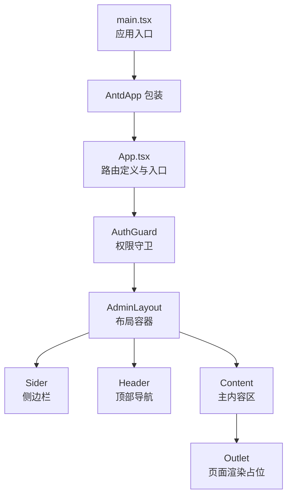
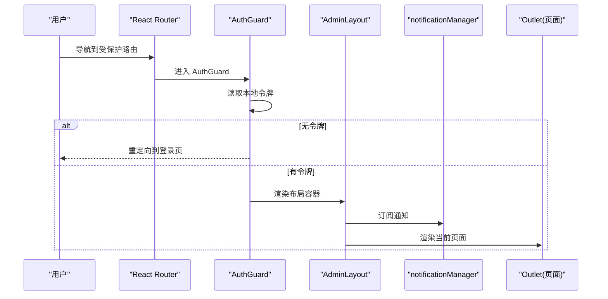
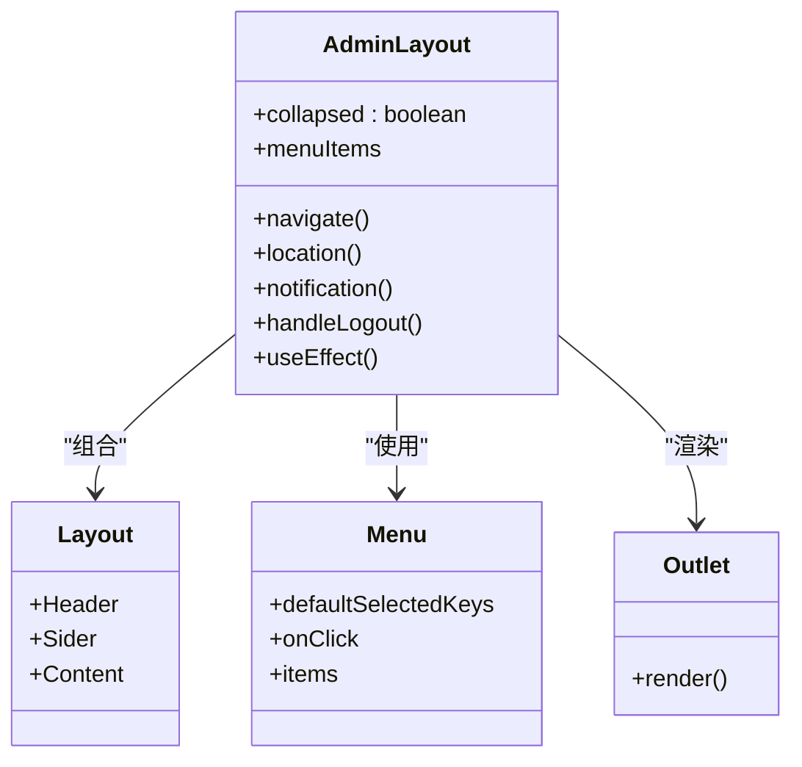
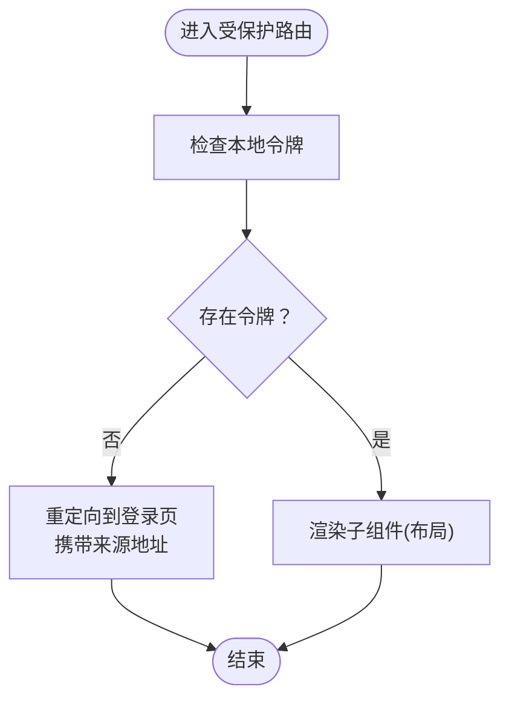
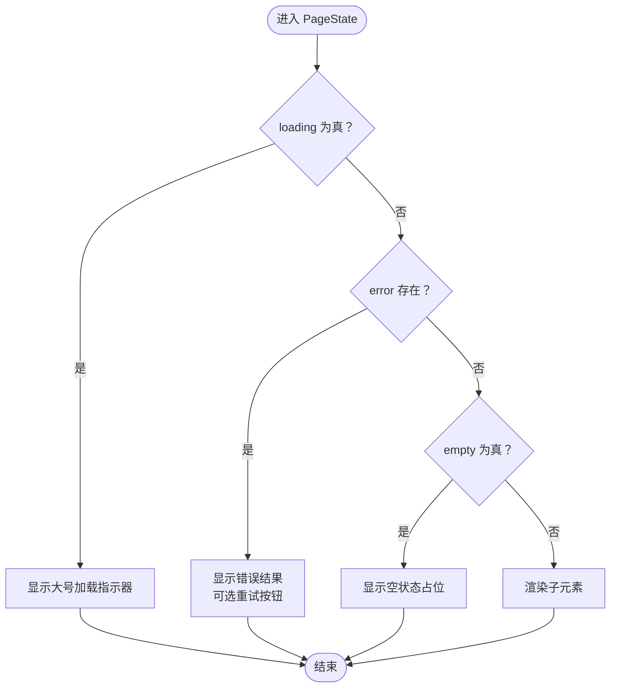
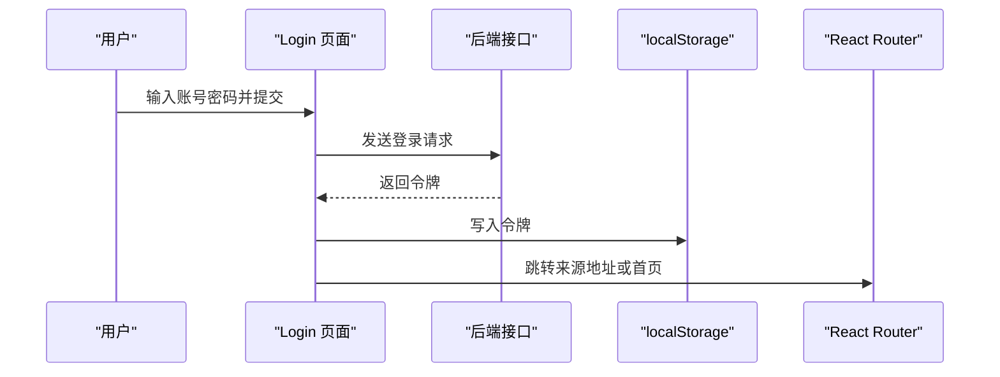
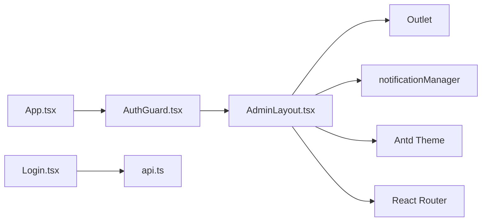

# 布局系统设计

<cite>
**本文引用的文件**
- [App.tsx](file://admin-ui/src/App.tsx)
- [main.tsx](file://admin-ui/src/main.tsx)
- [AdminLayout.tsx](file://admin-ui/src/components/AdminLayout.tsx)
- [AuthGuard.tsx](file://admin-ui/src/components/AuthGuard.tsx)
- [PageState.tsx](file://admin-ui/src/components/PageState.tsx)
- [Login.tsx](file://admin-ui/src/pages/Login.tsx)
- [notification.ts](file://admin-ui/src/utils/notification.ts)
- [api.ts](file://admin-ui/src/utils/api.ts)
</cite>

## 目录
1. [引言](#引言)
2. [项目结构](#项目结构)
3. [核心组件](#核心组件)
4. [架构总览](#架构总览)
5. [详细组件分析](#详细组件分析)
6. [依赖关系分析](#依赖关系分析)
7. [性能考虑](#性能考虑)
8. [故障排除指南](#故障排除指南)
9. [结论](#结论)
10. [附录](#附录)

## 引言
本文件系统性阐述后台管理界面的布局系统设计，重点围绕 AdminLayout 布局组件的整体架构、侧边栏导航、顶部导航栏与主内容区域的布局策略；PageState 页面状态管理组件对加载、错误与空状态的统一处理；以及布局系统与路由、权限控制、通知机制的集成方式。同时提供响应式设计思路、主题切换机制、组件复用模式、定制化方案、样式覆盖方法与性能优化建议。

## 项目结构
后台管理前端采用 React + TypeScript + Ant Design 技术栈，入口在 main.tsx 中挂载 AntdApp 包装的 App 组件。App.tsx 使用 React Router v6 的 Routes/Route 定义路由，并通过 AuthGuard 对受保护路由进行鉴权拦截。AdminLayout 作为受保护路由的根布局，内部包含侧边栏、顶部导航与主内容区，主内容区通过 Outlet 渲染具体页面。

图表来源
- [main.tsx](file://admin-ui/src/main.tsx#L1-L14)
- [App.tsx](file://admin-ui/src/App.tsx#L1-L57)
- [AdminLayout.tsx](file://admin-ui/src/components/AdminLayout.tsx#L1-L180)
- [AuthGuard.tsx](file://admin-ui/src/components/AuthGuard.tsx#L1-L20)

章节来源
- [main.tsx](file://admin-ui/src/main.tsx#L1-L14)
- [App.tsx](file://admin-ui/src/App.tsx#L1-L57)

## 核心组件
- AdminLayout：负责整体布局、侧边栏折叠、顶部导航、主内容区与通知订阅。
- AuthGuard：基于本地令牌进行路由级权限控制。
- PageState：统一处理页面加载、错误与空状态，支持重试。
- 登录页 Login：负责认证流程，写入令牌并跳转。

章节来源
- [AdminLayout.tsx](file://admin-ui/src/components/AdminLayout.tsx#L1-L180)
- [AuthGuard.tsx](file://admin-ui/src/components/AuthGuard.tsx#L1-L20)
- [PageState.tsx](file://admin-ui/src/components/PageState.tsx#L1-L44)
- [Login.tsx](file://admin-ui/src/pages/Login.tsx#L1-L47)

## 架构总览
布局系统以 AdminLayout 为核心容器，结合 React Router 的嵌套路由与 Outlet，实现“布局 + 页面”的解耦。权限守卫 AuthGuard 在进入受保护路由前校验令牌，未通过则重定向到登录页。通知系统通过 notificationManager 订阅全局消息并在顶部右上角展示。

图表来源
- [App.tsx](file://admin-ui/src/App.tsx#L1-L57)
- [AuthGuard.tsx](file://admin-ui/src/components/AuthGuard.tsx#L1-L20)
- [AdminLayout.tsx](file://admin-ui/src/components/AdminLayout.tsx#L1-L180)
- [notification.ts](file://admin-ui/src/utils/notification.ts)

## 详细组件分析

### AdminLayout 布局组件
- 布局结构：使用 Ant Design Layout 提供的 Sider/Header/Content 分层，Sider 支持可折叠，Header 包含折叠按钮与登出操作，Content 通过 Outlet 承载页面内容。
- 侧边栏导航：基于 Menu 组件，使用图标与分组构建多级菜单，点击项触发路由跳转；默认选中项与当前路径保持一致。
- 顶部导航栏：左侧为折叠按钮，右侧显示当前用户信息与退出登录按钮。
- 主内容区域：设置内边距、圆角与背景色，溢出自动滚动，承载页面内容。
- 通知集成：在组件挂载时订阅 notificationManager，收到消息后通过 Ant Design 的 App.notification 展示提示。
- 主题适配：使用 theme.useToken 获取容器背景色与圆角半径，保证与 Antd 设计体系一致。

图表来源
- [AdminLayout.tsx](file://admin-ui/src/components/AdminLayout.tsx#L1-L180)

章节来源
- [AdminLayout.tsx](file://admin-ui/src/components/AdminLayout.tsx#L1-L180)

### AuthGuard 权限守卫
- 作用：在进入受保护路由前检查本地存储中的令牌是否存在，不存在则重定向至登录页，并携带来源地址以便登录后返回。
- 适用范围：通过路由嵌套包裹 AdminLayout，确保所有后台页面均受保护。

图表来源
- [AuthGuard.tsx](file://admin-ui/src/components/AuthGuard.tsx#L1-L20)

章节来源
- [AuthGuard.tsx](file://admin-ui/src/components/AuthGuard.tsx#L1-L20)

### PageState 页面状态管理
- 设计目标：统一处理页面加载、错误与空状态，避免在各页面重复实现相同逻辑。
- 状态判定顺序：loading > error > empty > children。
- 交互能力：当提供 onRetry 时，错误状态下显示重试按钮。
- 使用场景：适用于数据拉取、异步初始化等场景，显著提升开发效率与一致性。

图表来源
- [PageState.tsx](file://admin-ui/src/components/PageState.tsx#L1-L44)

章节来源
- [PageState.tsx](file://admin-ui/src/components/PageState.tsx#L1-L44)

### 登录流程与路由集成
- 登录页 Login：收集用户名与密码，调用后端接口获取令牌，成功后写入本地存储并根据来源地址跳转。
- 路由集成：App.tsx 定义了登录路由与受保护路由组，受保护路由通过 AuthGuard 包裹 AdminLayout。
- 令牌持久化：登录成功后将令牌保存在 localStorage，AuthGuard 以此判断是否放行。

图表来源
- [Login.tsx](file://admin-ui/src/pages/Login.tsx#L1-L47)
- [App.tsx](file://admin-ui/src/App.tsx#L1-L57)
- [api.ts](file://admin-ui/src/utils/api.ts)

章节来源
- [Login.tsx](file://admin-ui/src/pages/Login.tsx#L1-L47)
- [App.tsx](file://admin-ui/src/App.tsx#L1-L57)

## 依赖关系分析
- 组件耦合：AdminLayout 依赖 Ant Design 的 Layout/Menu/Button/Theme 与 React Router 的 useNavigate/useLocation/Outlet；AuthGuard 依赖 React Router 的 Navigate/useLocation；PageState 仅依赖 Antd 的基础组件。
- 外部依赖：notificationManager 提供全局通知订阅；api 提供统一的网络请求封装。
- 路由依赖：App.tsx 定义路由树，AdminLayout 作为受保护路由的根布局，承载菜单与页面渲染。

图表来源
- [App.tsx](file://admin-ui/src/App.tsx#L1-L57)
- [AuthGuard.tsx](file://admin-ui/src/components/AuthGuard.tsx#L1-L20)
- [AdminLayout.tsx](file://admin-ui/src/components/AdminLayout.tsx#L1-L180)
- [Login.tsx](file://admin-ui/src/pages/Login.tsx#L1-L47)
- [notification.ts](file://admin-ui/src/utils/notification.ts)
- [api.ts](file://admin-ui/src/utils/api.ts)

章节来源
- [App.tsx](file://admin-ui/src/App.tsx#L1-L57)
- [AdminLayout.tsx](file://admin-ui/src/components/AdminLayout.tsx#L1-L180)
- [AuthGuard.tsx](file://admin-ui/src/components/AuthGuard.tsx#L1-L20)
- [Login.tsx](file://admin-ui/src/pages/Login.tsx#L1-L47)

## 性能考虑
- 布局渲染：AdminLayout 使用固定尺寸与最小高度，避免频繁重排；Content 设置 overflow: auto，减少滚动穿透影响。
- 通知订阅：在 useEffect 中订阅并在卸载时取消，防止内存泄漏与重复订阅。
- 路由跳转：Menu 的 onClick 直接使用 navigate(key)，避免额外状态同步开销。
- 组件拆分：PageState 将状态逻辑抽象，减少页面重复代码，间接降低渲染复杂度。
- 主题与样式：通过 theme.useToken 获取设计变量，避免硬编码样式带来的重绘成本。

## 故障排除指南
- 登录后无法进入后台页面
  - 检查本地是否正确写入令牌；确认 AuthGuard 是否包裹 AdminLayout；核对路由路径是否匹配。
- 侧边栏菜单不选中
  - 确认 Menu 的 defaultSelectedKeys 与当前路径一致；检查路由 key 与路径是否对应。
- 通知不显示
  - 确认 notificationManager 是否正确订阅；检查传入参数类型与消息队列。
- 错误状态不显示重试
  - 确认 PageState 的 onRetry 回调已传入；检查错误字符串是否非空。
- 退出登录后仍可访问
  - 确认 localStorage 中令牌已被清除；检查 AuthGuard 判断逻辑。

章节来源
- [AuthGuard.tsx](file://admin-ui/src/components/AuthGuard.tsx#L1-L20)
- [AdminLayout.tsx](file://admin-ui/src/components/AdminLayout.tsx#L1-L180)
- [PageState.tsx](file://admin-ui/src/components/PageState.tsx#L1-L44)
- [notification.ts](file://admin-ui/src/utils/notification.ts)

## 结论
该布局系统以 AdminLayout 为核心，结合 AuthGuard、PageState 与路由体系，实现了清晰的权限控制、统一的状态管理与良好的用户体验。通过 Ant Design 的主题与布局能力，系统具备良好的可维护性与扩展性。后续可在菜单动态生成、权限细粒度控制、主题切换与国际化等方面进一步增强。

## 附录

### 响应式设计与主题切换
- 响应式：AdminLayout 的 Sider 支持折叠，Content 设置了合理的内边距与圆角，配合 Antd 的栅格系统可进一步扩展移动端适配。
- 主题切换：通过 theme.useToken 获取设计变量，可在应用层引入主题上下文，实现浅色/深色主题切换。

### 布局组件复用模式
- 将 AdminLayout 作为受保护路由的根布局，所有后台页面共享同一布局骨架。
- 通过 PageState 在页面层统一处理加载/错误/空状态，减少重复代码。

### Props 设计与事件处理
- AdminLayout
  - props：无（使用路由与主题钩子）
  - 事件：handleLogout、Menu.onClick、折叠按钮点击
- PageState
  - props：loading、error、empty、onRetry、children
  - 事件：onRetry 回调
- AuthGuard
  - props：children
  - 逻辑：令牌校验与重定向

### 状态提升策略
- 将全局状态（如用户信息、主题偏好、语言选择）提升至应用顶层，通过 Context 或状态库管理，避免在布局组件中直接访问全局存储。

### 定制化方案与样式覆盖
- 菜单与头部样式：通过 Antd 的 CSS-in-JS 与 theme.useToken 注入自定义变量，避免直接覆盖类名。
- 布局间距：统一使用 Content 的 margin/padding 与圆角，确保视觉一致性。
- 图标与文案：菜单项的图标与标签集中管理，便于统一风格与国际化。

### 性能优化技巧
- 路由懒加载：对大型页面组件启用懒加载，减少首屏体积。
- 通知批处理：合并短时间内多次通知，避免频繁弹窗。
- 图片与资源：对静态资源进行压缩与按需加载，减少白屏时间。