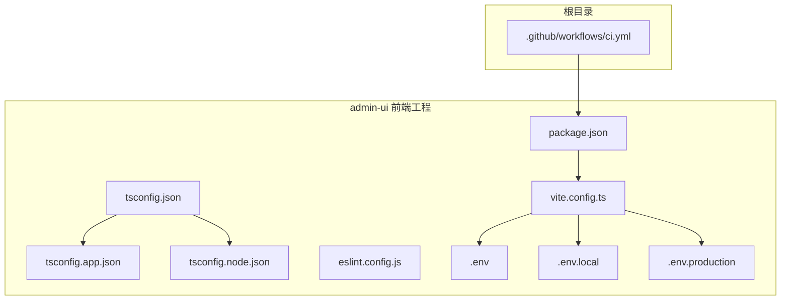
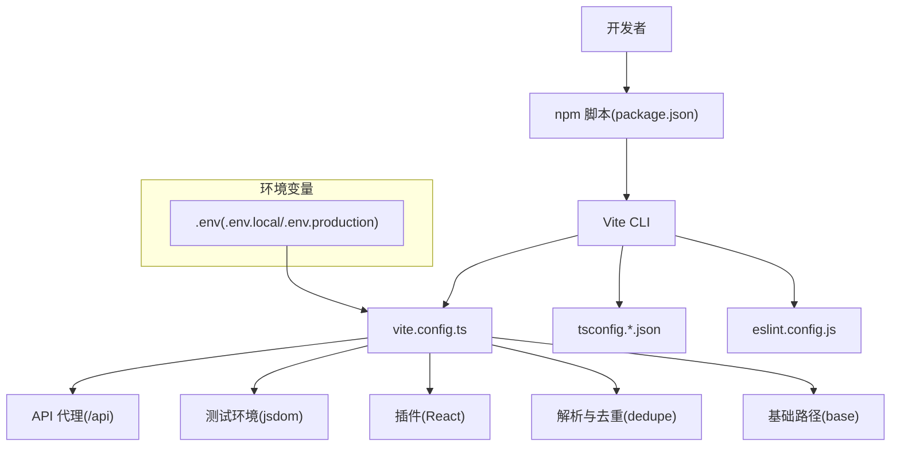
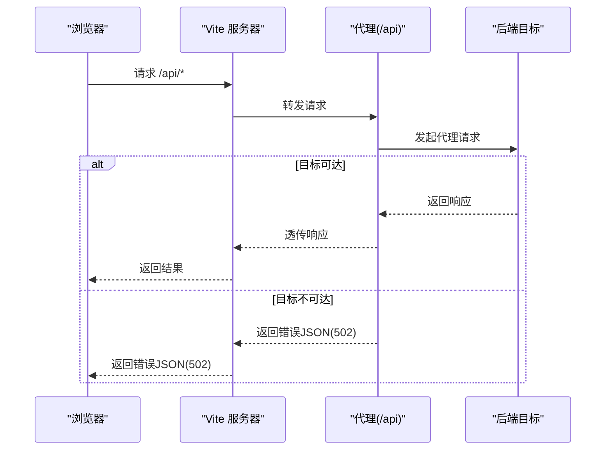
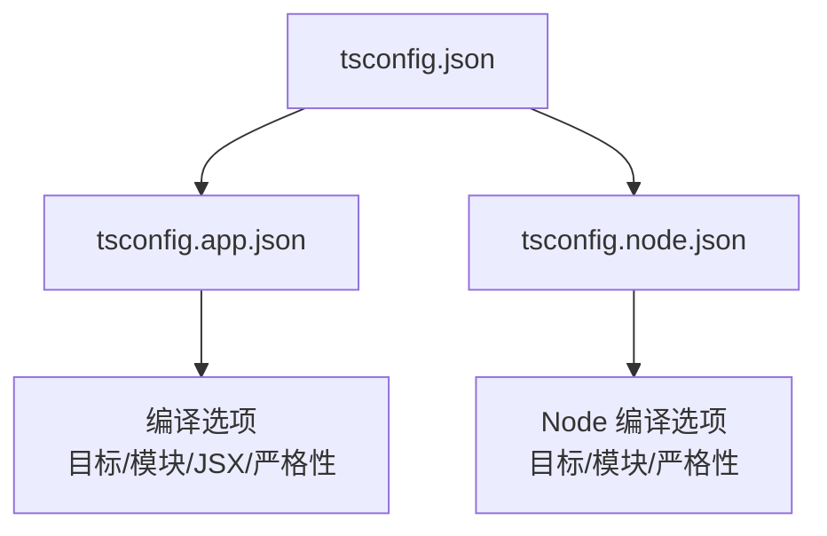
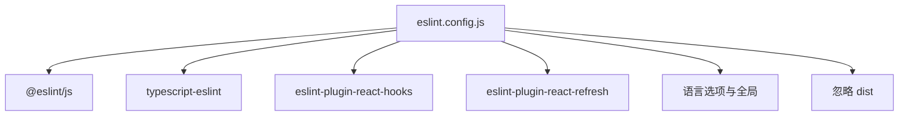
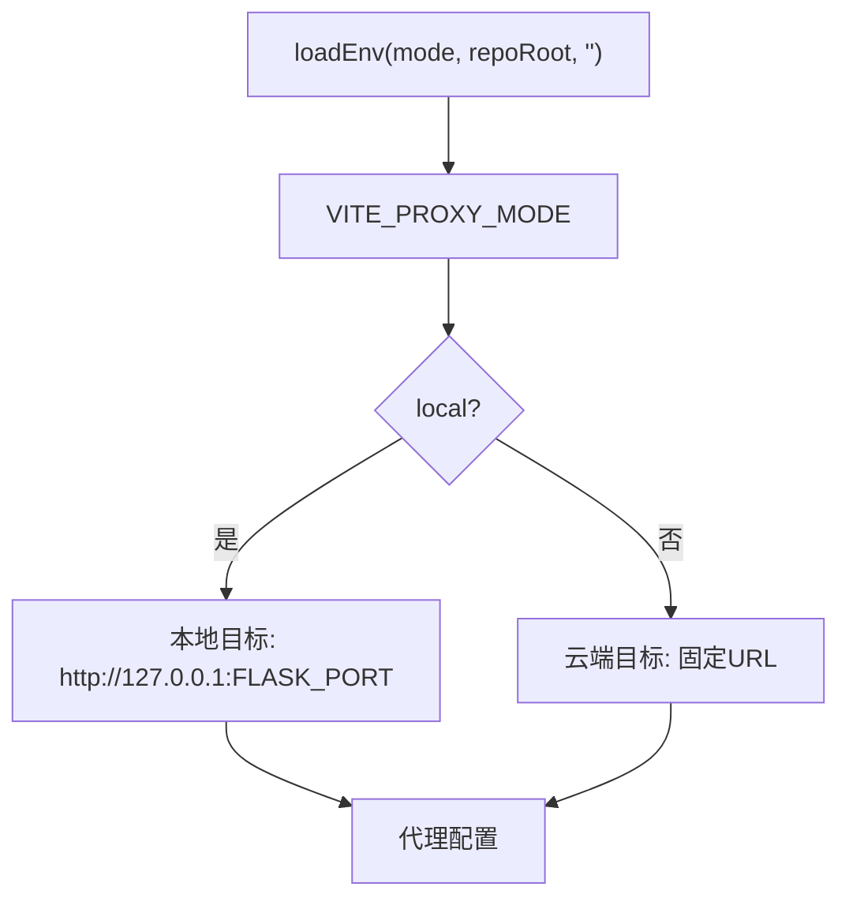
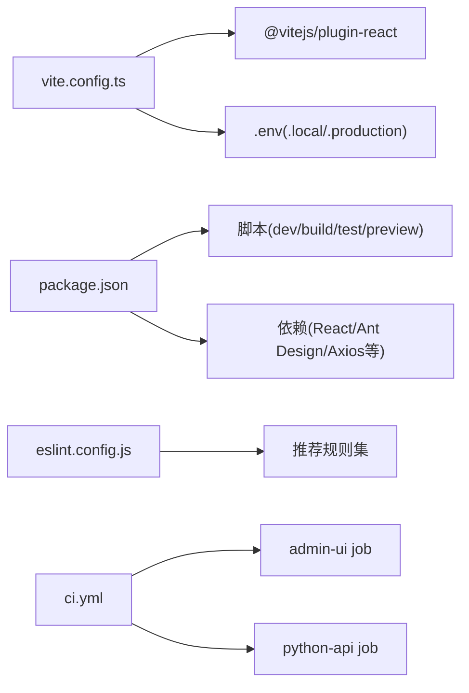

# 构建配置管理

<cite>
**本文引用的文件**
- [vite.config.ts](file://admin-ui/vite.config.ts)
- [package.json](file://admin-ui/package.json)
- [tsconfig.json](file://admin-ui/tsconfig.json)
- [tsconfig.app.json](file://admin-ui/tsconfig.app.json)
- [tsconfig.node.json](file://admin-ui/tsconfig.node.json)
- [eslint.config.js](file://admin-ui/eslint.config.js)
- [.eslintrc.json](file://.eslintrc.json)
- [.env](file://.env)
- [.env.local](file://.env.local)
- [.env.production](file://.env.production)
- [ci.yml](file://.github/workflows/ci.yml)
</cite>

## 目录
1. [简介](#简介)
2. [项目结构](#项目结构)
3. [核心组件](#核心组件)
4. [架构总览](#架构总览)
5. [详细组件分析](#详细组件分析)
6. [依赖关系分析](#依赖关系分析)
7. [性能考虑](#性能考虑)
8. [故障排除指南](#故障排除指南)
9. [结论](#结论)
10. [附录](#附录)

## 简介
本文件系统性梳理并文档化了本仓库前端构建配置管理，重点覆盖以下方面：
- Vite 开发服务器配置、API 代理、热重载与测试配置
- TypeScript 编译配置、路径别名与类型检查规则
- ESLint 代码规范与 Prettier 格式化集成现状
- 环境变量管理与多环境配置
- 构建产物优化、代码分割与缓存策略
- 开发调试与生产部署优化
- CI/CD 集成方案与构建性能监控建议

## 项目结构
本项目采用多包/多入口的组织方式，前端管理后台位于 admin-ui 目录，使用 Vite + React 进行构建；根目录包含后端 Python API、小程序、云开发脚本等。前端构建相关的关键文件集中在 admin-ui 子目录。

图表来源
- [vite.config.ts](file://admin-ui/vite.config.ts#L1-L78)
- [package.json](file://admin-ui/package.json#L1-L38)
- [tsconfig.json](file://admin-ui/tsconfig.json#L1-L8)
- [tsconfig.app.json](file://admin-ui/tsconfig.app.json#L1-L30)
- [tsconfig.node.json](file://admin-ui/tsconfig.node.json#L1-L27)
- [eslint.config.js](file://admin-ui/eslint.config.js#L1-L24)
- [.env](file://.env#L1-L32)
- [.env.local](file://.env.local#L1-L16)
- [.env.production](file://.env.production#L1-L53)
- [ci.yml](file://.github/workflows/ci.yml#L1-L35)

章节来源
- [vite.config.ts](file://admin-ui/vite.config.ts#L1-L78)
- [package.json](file://admin-ui/package.json#L1-L38)
- [tsconfig.json](file://admin-ui/tsconfig.json#L1-L8)
- [tsconfig.app.json](file://admin-ui/tsconfig.app.json#L1-L30)
- [tsconfig.node.json](file://admin-ui/tsconfig.node.json#L1-L27)
- [eslint.config.js](file://admin-ui/eslint.config.js#L1-L24)
- [.env](file://.env#L1-L32)
- [.env.local](file://.env.local#L1-L16)
- [.env.production](file://.env.production#L1-L53)
- [ci.yml](file://.github/workflows/ci.yml#L1-L35)

## 核心组件
- Vite 构建与开发服务器配置：定义插件、代理、测试环境、解析与基础路径等。
- TypeScript 多配置文件：应用层与 Node 层分别配置，确保严格类型与 bundler 模式。
- ESLint 规范：采用 Flat Config，统一推荐规则与 React Refresh 支持。
- 环境变量：多文件分层管理，支持开发、本地与生产环境切换。
- CI/CD：GitHub Actions 对前端与后端分别执行安装、检查、测试与构建。

章节来源
- [vite.config.ts](file://admin-ui/vite.config.ts#L6-L77)
- [package.json](file://admin-ui/package.json#L6-L12)
- [tsconfig.app.json](file://admin-ui/tsconfig.app.json#L1-L30)
- [tsconfig.node.json](file://admin-ui/tsconfig.node.json#L1-L27)
- [eslint.config.js](file://admin-ui/eslint.config.js#L8-L23)
- [.env](file://.env#L20-L23)
- [.env.local](file://.env.local#L1-L16)
- [.env.production](file://.env.production#L1-L53)
- [ci.yml](file://.github/workflows/ci.yml#L8-L23)

## 架构总览
前端构建体系围绕 Vite 的配置中心展开，结合 TypeScript 编译、ESLint 规范与环境变量，形成“开发—测试—构建—部署”的闭环。

图表来源
- [package.json](file://admin-ui/package.json#L6-L12)
- [vite.config.ts](file://admin-ui/vite.config.ts#L6-L77)
- [tsconfig.app.json](file://admin-ui/tsconfig.app.json#L1-L30)
- [tsconfig.node.json](file://admin-ui/tsconfig.node.json#L1-L27)
- [eslint.config.js](file://admin-ui/eslint.config.js#L8-L23)
- [.env](file://.env#L20-L23)
- [.env.local](file://.env.local#L1-L16)
- [.env.production](file://.env.production#L1-L53)

## 详细组件分析

### Vite 配置与开发服务器
- 插件系统：启用 React 插件以支持 JSX 与热重载。
- 解析与去重：对 react 与 react-dom 进行去重，减少重复打包。
- 测试环境：默认使用 jsdom，便于 DOM API 的单元测试。
- 基础路径：设置为根路径，适配多种部署场景。
- API 代理：
  - 代理前缀：/api
  - 目标选择：根据 VITE_PROXY_MODE 切换本地或云端目标
  - 超时控制：代理与连接超时均设置为 300 秒
  - 错误处理：代理失败时返回标准化 JSON 错误响应，包含目标地址与错误信息，并设置状态码 502
  - 开发日志：开发模式下输出当前代理目标

图表来源
- [vite.config.ts](file://admin-ui/vite.config.ts#L21-L59)

章节来源
- [vite.config.ts](file://admin-ui/vite.config.ts#L6-L77)

### TypeScript 编译配置
- 组织结构：通过根 tsconfig.json 引用应用与 Node 两套配置，实现分层管理。
- 应用层配置：
  - 目标与运行时：ES2022，包含 DOM/DOM.Iterable
  - 模块系统：ESNext，bundler 模式，强制 moduleDetection
  - 类字段：使用 define 语义
  - JSX：react-jsx
  - 严格性：开启严格模式与未使用/未检查导入等规则
- Node 层配置：
  - 目标：ES2023
  - 模块：ESNext，bundler 模式
  - 语言特性：严格模式与未使用/未检查导入等规则
  - 作用域：仅包含 vite.config.ts

图表来源
- [tsconfig.json](file://admin-ui/tsconfig.json#L1-L8)
- [tsconfig.app.json](file://admin-ui/tsconfig.app.json#L1-L30)
- [tsconfig.node.json](file://admin-ui/tsconfig.node.json#L1-L27)

章节来源
- [tsconfig.json](file://admin-ui/tsconfig.json#L1-L8)
- [tsconfig.app.json](file://admin-ui/tsconfig.app.json#L1-L30)
- [tsconfig.node.json](file://admin-ui/tsconfig.node.json#L1-L27)

### ESLint 与代码规范
- 配置方式：采用 Flat Config，集中声明 extends 与语言选项。
- 推荐规则：基于 @eslint/js、typescript-eslint、react-hooks、react-refresh。
- 文件范围：针对 ts/tsx 文件生效。
- 全局忽略：忽略 dist 输出目录。

图表来源
- [eslint.config.js](file://admin-ui/eslint.config.js#L8-L23)

章节来源
- [eslint.config.js](file://admin-ui/eslint.config.js#L1-L24)
- [.eslintrc.json](file://.eslintrc.json#L1-L24)

### 环境变量管理
- 根环境变量：
  - NODE_ENV、PORT、JWT 密钥、管理员账号、数据库路径、代理模式、Flask 端口、微信云参数、行情数据源与更新间隔等。
- 本地开发环境：
  - NODE_ENV、PORT、FLASK_PORT、VITE_API_PROXY_TARGET、VITE_PROXY_MODE、FLASK_APP、跨域白名单、数据源与缓存、日志级别、微信云参数等。
- 生产环境：
  - NODE_ENV、FLASK_PORT、FLASK_APP、密钥、JWT 过期时间、跨域白名单、MongoDB 连接、管理员账号、API 基础 URL、日志、数据源与缓存、API 限流、第三方 Token 等。
- Vite 代理目标选择逻辑：
  - 读取 VITE_PROXY_MODE，local 指向本地 Flask，否则指向云端目标
  - 通过 loadEnv(mode, repoRoot, '') 注入环境变量

图表来源
- [vite.config.ts](file://admin-ui/vite.config.ts#L10-L15)
- [.env](file://.env#L20-L23)
- [.env.local](file://.env.local#L1-L16)
- [.env.production](file://.env.production#L1-L53)

章节来源
- [.env](file://.env#L1-L32)
- [.env.local](file://.env.local#L1-L16)
- [.env.production](file://.env.production#L1-L53)
- [vite.config.ts](file://admin-ui/vite.config.ts#L6-L15)

### 插件系统与构建优化
- 插件：React 插件提供 JSX 支持与开发体验增强。
- 构建脚本：先执行 tsc -b 进行类型检查，再进行 Vite 构建，确保类型安全后再产出产物。
- 测试：Vitest 使用 jsdom 环境，便于 DOM 相关测试。
- 预览：Vite 提供本地预览能力。

章节来源
- [package.json](file://admin-ui/package.json#L6-L12)
- [vite.config.ts](file://admin-ui/vite.config.ts#L63-L70)

### 代码分割与缓存策略
- 代码分割：Vite 默认按需加载与动态导入进行代码分割，具体策略由路由与模块拆分决定。
- 缓存：未发现显式的持久化缓存配置，建议在生产构建中启用压缩与哈希命名，以提升缓存命中率。

章节来源
- [package.json](file://admin-ui/package.json#L8-L8)
- [vite.config.ts](file://admin-ui/vite.config.ts#L61-L77)

### 开发调试与生产部署
- 开发调试：使用 Vite 开发服务器，配合 React 插件与代理配置，快速迭代。
- 生产部署：通过 CI/CD 在 Ubuntu Runner 上执行安装、检查、测试与构建，产物可部署至静态托管或反向代理。

章节来源
- [ci.yml](file://.github/workflows/ci.yml#L8-L23)

## 依赖关系分析
- Vite 作为核心构建工具，依赖 React 插件与 TypeScript 配置。
- ESLint 通过 Flat Config 统一规则，避免多份配置冲突。
- 环境变量贯穿开发与生产，驱动代理目标与后端连接。
- CI/CD 作业分别运行前端与后端，保证整体质量。

图表来源
- [vite.config.ts](file://admin-ui/vite.config.ts#L1-L3)
- [package.json](file://admin-ui/package.json#L13-L36)
- [eslint.config.js](file://admin-ui/eslint.config.js#L8-L23)
- [ci.yml](file://.github/workflows/ci.yml#L8-L34)

章节来源
- [vite.config.ts](file://admin-ui/vite.config.ts#L1-L3)
- [package.json](file://admin-ui/package.json#L13-L36)
- [eslint.config.js](file://admin-ui/eslint.config.js#L8-L23)
- [ci.yml](file://.github/workflows/ci.yml#L8-L34)

## 性能考虑
- 构建阶段：先类型检查再打包，降低运行时错误概率。
- 代理超时：300 秒超时适合长连接或大数据请求，但需结合后端实际需求调整。
- 依赖去重：对 react 与 react-dom 进行去重，减少重复包体积。
- 代码分割：保持按需加载与动态导入，避免单体 bundle。
- 缓存：建议在生产构建中启用压缩与文件名哈希，提升缓存命中率。
- Bundle 分析：建议引入分析工具（如 rollup-plugin-visualizer 或 vite-bundle-analyzer）进行可视化分析。

## 故障排除指南
- 代理失败（502）：
  - 现象：浏览器收到 502，响应体包含目标地址与错误信息。
  - 排查：确认后端是否启动、端口是否正确、VITE_PROXY_MODE 与 VITE_API_PROXY_TARGET 设置是否匹配。
  - 参考：代理错误回调与日志输出。
- 环境变量未生效：
  - 确认 .env、.env.local、.env.production 的优先级与加载顺序，确保 mode 正确。
- 类型检查失败：
  - 先执行 tsc -b，修正类型错误后再进行构建。
- 测试失败：
  - 确保 jsdom 环境可用，DOM API 使用符合 jsdom 行为。

章节来源
- [vite.config.ts](file://admin-ui/vite.config.ts#L26-L59)
- [.env](file://.env#L20-L23)
- [.env.local](file://.env.local#L1-L16)
- [package.json](file://admin-ui/package.json#L8-L8)

## 结论
本项目的前端构建配置以 Vite 为核心，结合 TypeScript 严格模式与 ESLint 推荐规则，形成了从开发到生产的完整链路。通过环境变量灵活控制代理目标，配合 CI/CD 自动化流程，能够稳定支撑管理后台的迭代与发布。建议后续补充 Prettier 配置、Bundle 分析与缓存优化策略，进一步提升开发体验与构建性能。

## 附录
- Prettier 配置建议：新增 .prettierrc 或在 eslint.config.js 中集成 prettier 规则，统一格式化风格。
- Git 钩子：可在 husky 或 lefthook 中集成 lint-staged，实现提交前自动格式化与检查。
- 构建性能监控：引入分析工具生成可视化报告，识别大体积依赖与重复模块。
- 依赖优化：定期审计依赖版本，清理未使用包，利用 Tree Shaking 与懒加载减少首屏体积。