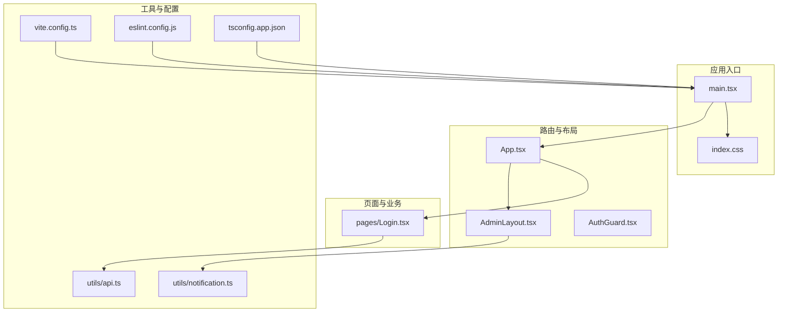
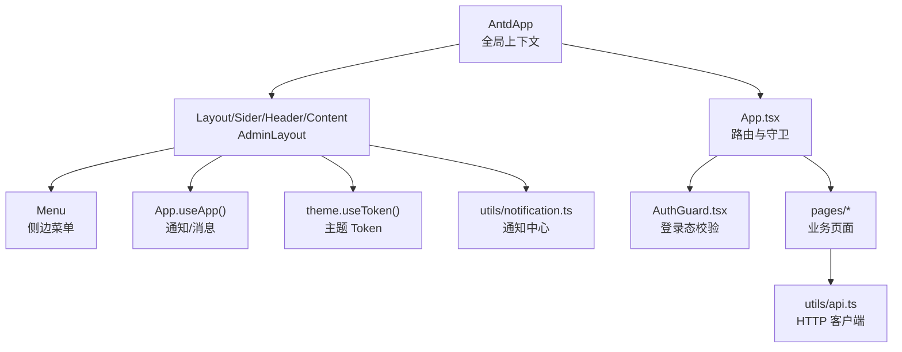
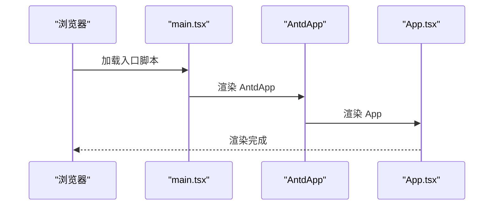
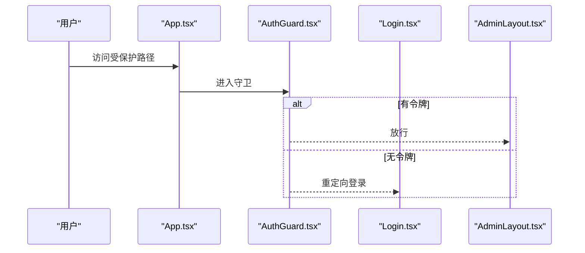
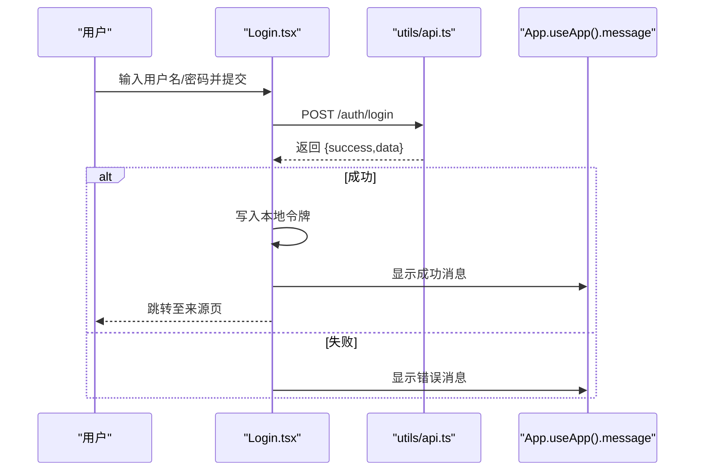
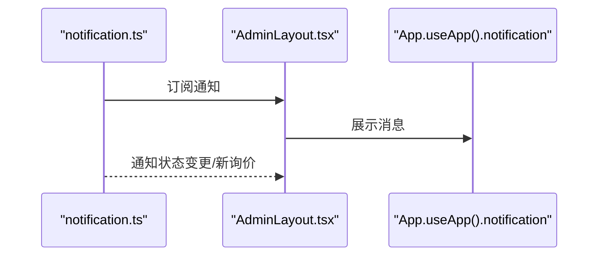
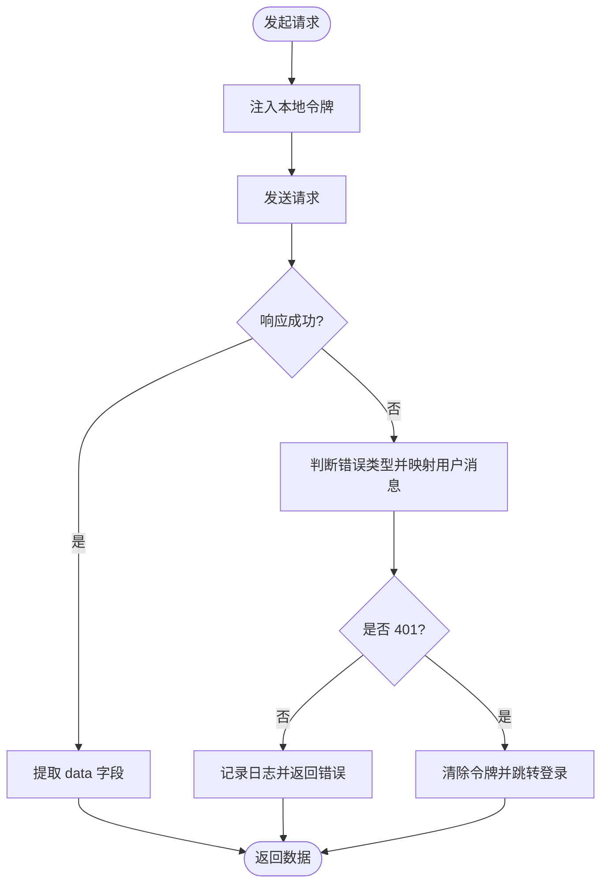
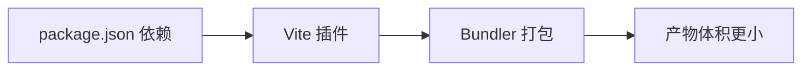
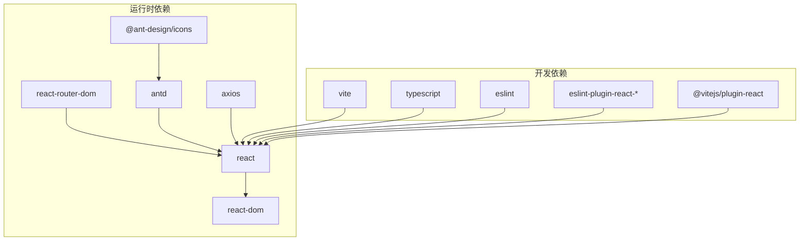

# 组件库集成使用

<cite>
**本文引用的文件**
- [package.json](file://admin-ui/package.json)
- [vite.config.ts](file://admin-ui/vite.config.ts)
- [src/main.tsx](file://admin-ui/src/main.tsx)
- [src/App.tsx](file://admin-ui/src/App.tsx)
- [src/index.css](file://admin-ui/src/index.css)
- [src/components/AdminLayout.tsx](file://admin-ui/src/components/AdminLayout.tsx)
- [src/components/AuthGuard.tsx](file://admin-ui/src/components/AuthGuard.tsx)
- [src/pages/Login.tsx](file://admin-ui/src/pages/Login.tsx)
- [src/utils/api.ts](file://admin-ui/src/utils/api.ts)
- [src/utils/notification.ts](file://admin-ui/src/utils/notification.ts)
- [tsconfig.app.json](file://admin-ui/tsconfig.app.json)
- [eslint.config.js](file://admin-ui/eslint.config.js)
</cite>

## 目录
1. [简介](#简介)
2. [项目结构](#项目结构)
3. [核心组件](#核心组件)
4. [架构总览](#架构总览)
5. [详细组件分析](#详细组件分析)
6. [依赖关系分析](#依赖关系分析)
7. [性能考量](#性能考量)
8. [故障排查指南](#故障排查指南)
9. [结论](#结论)
10. [附录](#附录)

## 简介
本文件面向“场外期权后台管理系统”的前端工程，系统性阐述 Ant Design 组件库在项目中的集成策略与使用规范，涵盖以下主题：
- 组件按需引入与构建优化
- 主题定制与样式覆盖方案
- 常用业务组件的二次封装模式（表格、表单、弹窗、图表等）
- 属性设计、事件处理与状态管理最佳实践
- 组件间通信、数据流与性能优化策略
- 自定义组件开发规范、组件测试方法与文档编写指南
- 常见业务场景的组件组合方案与 UI 一致性保障措施

## 项目结构
该工程采用 Vite + React + TypeScript 技术栈，Ant Design 作为主要 UI 组件库，整体结构如下：
- 应用入口与全局样式：main.tsx、index.css
- 路由与布局：App.tsx、AdminLayout.tsx、AuthGuard.tsx
- 页面与业务组件：各页面位于 pages 目录，通用布局与权限控制位于 components 目录
- 工具与配置：utils 下的 API 与通知管理；Vite、ESLint、TypeScript 配置



**图表来源**
- [src/main.tsx](file://admin-ui/src/main.tsx#L1-L14)
- [src/index.css](file://admin-ui/src/index.css#L1-L25)
- [src/App.tsx](file://admin-ui/src/App.tsx#L1-L57)
- [src/components/AdminLayout.tsx](file://admin-ui/src/components/AdminLayout.tsx#L1-L180)
- [src/components/AuthGuard.tsx](file://admin-ui/src/components/AuthGuard.tsx#L1-L20)
- [src/pages/Login.tsx](file://admin-ui/src/pages/Login.tsx#L1-L78)
- [src/utils/api.ts](file://admin-ui/src/utils/api.ts#L1-L125)
- [src/utils/notification.ts](file://admin-ui/src/utils/notification.ts#L1-L84)
- [vite.config.ts](file://admin-ui/vite.config.ts#L1-L78)
- [tsconfig.app.json](file://admin-ui/tsconfig.app.json#L1-L30)
- [eslint.config.js](file://admin-ui/eslint.config.js#L1-L24)

**章节来源**
- [src/main.tsx](file://admin-ui/src/main.tsx#L1-L14)
- [src/App.tsx](file://admin-ui/src/App.tsx#L1-L57)
- [src/components/AdminLayout.tsx](file://admin-ui/src/components/AdminLayout.tsx#L1-L180)
- [src/components/AuthGuard.tsx](file://admin-ui/src/components/AuthGuard.tsx#L1-L20)
- [src/pages/Login.tsx](file://admin-ui/src/pages/Login.tsx#L1-L78)
- [src/utils/api.ts](file://admin-ui/src/utils/api.ts#L1-L125)
- [src/utils/notification.ts](file://admin-ui/src/utils/notification.ts#L1-L84)
- [vite.config.ts](file://admin-ui/vite.config.ts#L1-L78)
- [tsconfig.app.json](file://admin-ui/tsconfig.app.json#L1-L30)
- [eslint.config.js](file://admin-ui/eslint.config.js#L1-L24)

## 核心组件
- AntdApp 包裹：应用根节点通过 AntdApp 提供全局上下文，确保 App、Message、Notification 等组件可用。
- AdminLayout：侧边栏导航、顶部操作区、内容区容器，统一承载业务页面。
- AuthGuard：基于本地令牌的路由守卫，未登录跳转至登录页。
- Login 页面：基于 Ant Design 的表单组件实现登录流程，结合 API 工具与消息提示。

**章节来源**
- [src/main.tsx](file://admin-ui/src/main.tsx#L1-L14)
- [src/components/AdminLayout.tsx](file://admin-ui/src/components/AdminLayout.tsx#L1-L180)
- [src/components/AuthGuard.tsx](file://admin-ui/src/components/AuthGuard.tsx#L1-L20)
- [src/pages/Login.tsx](file://admin-ui/src/pages/Login.tsx#L1-L78)

## 架构总览
Ant Design 在本项目中的使用遵循“按需引入 + 全局包裹 + 主题与样式扩展”的策略：
- 按需引入：通过 Vite 插件与构建链路，仅打包实际使用的组件与图标，减少体积。
- 全局包裹：AntdApp 作为根组件，提供全局通知、消息等能力。
- 主题与样式：通过 Ant Design 提供的主题 Token 与 CSS 变量，结合项目基础样式，统一视觉风格。



**图表来源**
- [src/main.tsx](file://admin-ui/src/main.tsx#L1-L14)
- [src/App.tsx](file://admin-ui/src/App.tsx#L1-L57)
- [src/components/AdminLayout.tsx](file://admin-ui/src/components/AdminLayout.tsx#L1-L180)
- [src/components/AuthGuard.tsx](file://admin-ui/src/components/AuthGuard.tsx#L1-L20)
- [src/utils/api.ts](file://admin-ui/src/utils/api.ts#L1-L125)
- [src/utils/notification.ts](file://admin-ui/src/utils/notification.ts#L1-L84)

## 详细组件分析

### AntdApp 全局包裹与入口渲染
- 在入口文件中以 AntdApp 包裹整个应用树，确保全局消息、通知等能力可用。
- 通过严格模式与根节点挂载，保证 React 19 的运行环境。



**图表来源**
- [src/main.tsx](file://admin-ui/src/main.tsx#L1-L14)

**章节来源**
- [src/main.tsx](file://admin-ui/src/main.tsx#L1-L14)

### 路由与权限守卫
- 使用 React Router DOM 进行路由配置，AdminLayout 作为受保护的主框架。
- AuthGuard 读取本地令牌，无令牌则重定向至登录页。



**图表来源**
- [src/App.tsx](file://admin-ui/src/App.tsx#L1-L57)
- [src/components/AuthGuard.tsx](file://admin-ui/src/components/AuthGuard.tsx#L1-L20)
- [src/pages/Login.tsx](file://admin-ui/src/pages/Login.tsx#L1-L78)

**章节来源**
- [src/App.tsx](file://admin-ui/src/App.tsx#L1-L57)
- [src/components/AuthGuard.tsx](file://admin-ui/src/components/AuthGuard.tsx#L1-L20)

### 登录页面与表单组件
- 使用 Ant Design 的 Form、Input、Button、Card、Typography 等组件构建登录表单。
- 结合 App.useApp().message 提示用户反馈。
- 使用 utils/api.ts 发起登录请求，并根据响应设置本地令牌与路由跳转。



**图表来源**
- [src/pages/Login.tsx](file://admin-ui/src/pages/Login.tsx#L1-L78)
- [src/utils/api.ts](file://admin-ui/src/utils/api.ts#L1-L125)

**章节来源**
- [src/pages/Login.tsx](file://admin-ui/src/pages/Login.tsx#L1-L78)
- [src/utils/api.ts](file://admin-ui/src/utils/api.ts#L1-L125)

### 通知中心与消息提示
- AdminLayout 通过 App.useApp().notification 订阅通知中心，实现全局消息展示。
- utils/notification.ts 提供通知订阅、状态变更通知与新询价通知等能力。



**图表来源**
- [src/components/AdminLayout.tsx](file://admin-ui/src/components/AdminLayout.tsx#L1-L180)
- [src/utils/notification.ts](file://admin-ui/src/utils/notification.ts#L1-L84)

**章节来源**
- [src/components/AdminLayout.tsx](file://admin-ui/src/components/AdminLayout.tsx#L1-L180)
- [src/utils/notification.ts](file://admin-ui/src/utils/notification.ts#L1-L84)

### 布局组件（AdminLayout）与主题定制
- 使用 Layout、Menu、Button、theme.useToken 等组件与钩子，实现可折叠侧边栏、主题色板与圆角风格。
- 通过 CSS 变量与 Ant Design Token，统一背景、圆角等视觉元素。

```mermaid
classDiagram
class AdminLayout {
+collapsed : boolean
+menuItems : MenuProps.items
+handleLogout() : void
}
class Theme {
+useToken() : tokens
}
class AppContext {
+useApp() : { notification, message }
}
AdminLayout --> Theme : "使用主题 Token"
AdminLayout --> AppContext : "使用通知/消息"
```

**图表来源**
- [src/components/AdminLayout.tsx](file://admin-ui/src/components/AdminLayout.tsx#L1-L180)

**章节来源**
- [src/components/AdminLayout.tsx](file://admin-ui/src/components/AdminLayout.tsx#L1-L180)

### API 客户端与错误处理
- utils/api.ts 基于 axios 创建客户端，统一添加 Authorization 头与响应数据提取。
- 对 401、超时、网络异常等进行统一错误映射与用户提示。



**图表来源**
- [src/utils/api.ts](file://admin-ui/src/utils/api.ts#L1-L125)

**章节来源**
- [src/utils/api.ts](file://admin-ui/src/utils/api.ts#L1-L125)

### 组件按需引入与构建优化
- 项目依赖中包含 antd 与 @ant-design/icons，结合 Vite 插件与 bundler 模式，实现按需打包。
- 通过 tsconfig.app.json 的 bundler 模式与 verbatimModuleSyntax，提升类型安全与打包效率。



**图表来源**
- [package.json](file://admin-ui/package.json#L1-L38)
- [vite.config.ts](file://admin-ui/vite.config.ts#L1-L78)
- [tsconfig.app.json](file://admin-ui/tsconfig.app.json#L1-L30)

**章节来源**
- [package.json](file://admin-ui/package.json#L1-L38)
- [vite.config.ts](file://admin-ui/vite.config.ts#L1-L78)
- [tsconfig.app.json](file://admin-ui/tsconfig.app.json#L1-L30)

### 主题定制与样式覆盖
- 通过 theme.useToken 获取颜色与圆角等 Token，结合 CSS 变量覆盖组件默认样式。
- 基础样式位于 index.css，统一字体、背景与根元素尺寸。

**章节来源**
- [src/components/AdminLayout.tsx](file://admin-ui/src/components/AdminLayout.tsx#L1-L180)
- [src/index.css](file://admin-ui/src/index.css#L1-L25)

### 常用业务组件的二次封装模式
- 表格组件：建议在业务页面中封装分页、筛选、排序与批量操作，统一加载态与空状态。
- 表单组件：将表单项与校验规则抽象为可复用的表单域组件，支持动态字段与联动。
- 弹窗组件：封装 Modal 的打开/关闭、表单校验与提交流程，统一消息提示与重载逻辑。
- 图表组件：封装 ECharts 或 Ant Design Charts，提供主题适配与响应式布局。

说明：以上为通用封装模式建议，具体实现应结合业务页面的实际使用情况与 Ant Design 组件能力进行扩展。

### 属性设计、事件处理与状态管理最佳实践
- 属性设计：以只读与受控为主，避免直接修改外部传入值；对可选属性提供明确默认值。
- 事件处理：统一使用 Ant Design 的回调命名（如 onChange/onFinish），并在组件内部进行必要的参数校验与错误捕获。
- 状态管理：优先使用 React Hooks 管理本地状态；跨组件共享状态使用 Context 或集中式状态库（如需要）。

### 组件间通信、数据流向与性能优化
- 通信模式：父子组件通过 props 传递数据与回调；兄弟组件通过共同父组件或 Context 传递；跨页面通过路由与全局状态。
- 数据流：从 API 客户端获取数据，经页面组件处理后渲染 UI；错误与加载状态贯穿整个流程。
- 性能优化：按需引入组件与图标；合理拆分组件，避免不必要的重渲染；使用 React.memo/useCallback/useMemo 优化高频组件。

### 自定义组件开发规范、组件测试方法与文档编写指南
- 开发规范：组件命名语义化；导出类型清晰；提供最小可运行示例；遵循 Ant Design 设计语言。
- 测试方法：单元测试覆盖关键逻辑；使用 Vitest 与 jsdom；对异步流程进行时序断言。
- 文档编写：README 中包含安装、使用示例、属性说明与注意事项；必要时提供 Storybook 示例。

### 常见业务场景的组件组合方案与 UI 一致性保障
- 登录页：Form + Input + Button + Card，统一消息提示与路由跳转。
- 管理页：Layout + Menu + App.useApp().notification，统一主题与交互反馈。
- 一致性保障：统一使用 Ant Design Token 与 CSS 变量；建立组件库使用规范与样式指南。

## 依赖关系分析
- 依赖关系：Ant Design 与 @ant-design/icons 为核心 UI 依赖；React 与 React Router DOM 提供基础能力；Axios 提供 HTTP 能力；Vite 与 TypeScript 提供构建与类型支持。
- 配置关系：Vite 插件负责 React 与代理；ESLint 与 TypeScript 配置保障代码质量与类型安全。



**图表来源**
- [package.json](file://admin-ui/package.json#L1-L38)
- [vite.config.ts](file://admin-ui/vite.config.ts#L1-L78)
- [eslint.config.js](file://admin-ui/eslint.config.js#L1-L24)
- [tsconfig.app.json](file://admin-ui/tsconfig.app.json#L1-L30)

**章节来源**
- [package.json](file://admin-ui/package.json#L1-L38)
- [vite.config.ts](file://admin-ui/vite.config.ts#L1-L78)
- [eslint.config.js](file://admin-ui/eslint.config.js#L1-L24)
- [tsconfig.app.json](file://admin-ui/tsconfig.app.json#L1-L30)

## 性能考量
- 按需引入：确保仅打包使用到的组件与图标，降低首屏体积。
- 构建优化：启用 bundler 模式与严格类型检查，减少运行时开销。
- 样式优化：统一使用 Ant Design Token 与 CSS 变量，避免重复样式计算。
- 网络优化：API 客户端统一超时与错误处理，减少无效重试。

## 故障排查指南
- 登录失败：检查 utils/api.ts 的请求拦截器与响应拦截器，确认令牌写入与 401 处理逻辑。
- 代理失败：查看 vite.config.ts 的代理配置与错误回调，确认后端服务可达性。
- 样式异常：核对 src/index.css 与 AdminLayout 的主题 Token 使用，确保 CSS 变量一致。

**章节来源**
- [src/utils/api.ts](file://admin-ui/src/utils/api.ts#L1-L125)
- [vite.config.ts](file://admin-ui/vite.config.ts#L1-L78)
- [src/index.css](file://admin-ui/src/index.css#L1-L25)
- [src/components/AdminLayout.tsx](file://admin-ui/src/components/AdminLayout.tsx#L1-L180)

## 结论
本项目以 Ant Design 为核心 UI 框架，结合 Vite + React + TypeScript 实现高效开发与构建。通过 AntdApp 全局包裹、AdminLayout 统一布局、AuthGuard 权限守卫与 utils/api.ts 统一网络层，形成清晰的组件使用与数据流体系。建议在后续迭代中进一步沉淀业务组件封装、完善测试与文档，并持续优化按需引入与主题定制策略，以提升开发效率与用户体验。

## 附录
- 术语说明：AntdApp 为 Ant Design 提供的全局上下文组件；Theme Token 为 Ant Design 的主题变量集合；Bundler 模式为 Vite 的模块解析方式。
- 参考文件：上述章节中涉及的具体文件与行号已在相应位置标注，便于快速定位与查阅。