# 认证系统架构

<cite>
**本文档引用的文件**
- [admin-ui/src/components/AuthGuard.tsx](file://admin-ui/src/components/AuthGuard.tsx)
- [admin-ui/src/pages/Login.tsx](file://admin-ui/src/pages/Login.tsx)
- [admin-ui/src/utils/api.ts](file://admin-ui/src/utils/api.ts)
- [admin-ui/src/components/AdminLayout.tsx](file://admin-ui/src/components/AdminLayout.tsx)
- [routes/auth.py](file://routes/auth.py)
- [services/auth_service.py](file://services/auth_service.py)
- [models/user.py](file://models/user.py)
- [utils/auth.js](file://utils/auth.js)
- [backup_nodejs/middleware/auth.js](file://backup_nodejs/middleware/auth.js)
- [tests/test_auth.py](file://tests/test_auth.py)
- [tests/test_refactor.py](file://tests/test_refactor.py)
- [services/cloud_db.js](file://services/cloud_db.js)
- [backend_utils/security.py](file://backend_utils/security.py)
- [miniprogram/utils/loginService.js](file://miniprogram/utils/loginService.js)
- [backend_utils/loginService.js](file://backend_utils/loginService.js)
- [config.py](file://config.py)
- [.env](file://.env)
- [.env.example](file://.env.example)
- [pages/login/login.js](file://pages/login/login.js)
- [services/captcha_service.py](file://services/captcha_service.py)
- [init_admin.py](file://init_admin.py)
</cite>

## 更新摘要
**所做更改**
- 新增双Token机制，支持Access/Refresh双重令牌管理
- 新增微信登录自动降级机制，提升系统可靠性与用户体验
- 新增游客模式支持，提供受限的临时访客登录功能
- 新增短信验证码功能，支持手机号登录和密码重置
- 新增密码强度验证机制，支持可配置的密码规则
- 增强会话管理功能，支持多设备会话管理和会话列表查看
- 增强安全工具层，提供速率限制、账户锁定和审计日志功能
- 改进异常处理机制，提供更友好的用户提示和降级策略
- 完善微信登录配置验证，支持占位符检测和自动降级

## 目录
1. [简介](#简介)
2. [项目结构](#项目结构)
3. [核心组件](#核心组件)
4. [架构总览](#架构总览)
5. [详细组件分析](#详细组件分析)
6. [依赖关系分析](#依赖关系分析)
7. [性能考量](#性能考量)
8. [故障排除指南](#故障排除指南)
9. [结论](#结论)
10. [附录](#附录)

## 简介
本文件系统性梳理并文档化该系统的认证体系，覆盖以下关键主题：
- Guard认证守卫与路由级权限控制
- 用户会话管理与双Token验证机制
- 全局认证状态管理、登录状态持久化与自动登出
- API请求的认证拦截、错误处理与重定向策略
- 用户角色权限体系、菜单权限控制与按钮级权限管理
- 认证流程完整生命周期、安全策略与最佳实践
- 组件使用示例、自定义权限验证与多租户认证支持方案
- **新增**：双Token机制，支持Access/Refresh双重令牌管理
- **新增**：微信登录自动降级机制，提升系统可靠性与用户体验
- **新增**：游客模式支持，提供受限的临时访客登录功能
- **新增**：短信验证码功能，支持手机号登录和密码重置
- **新增**：密码强度验证机制，支持可配置的密码规则
- **新增**：增强的会话管理功能，支持多设备会话管理和会话列表查看
- **新增**：增强的安全工具层，提供速率限制、账户锁定和审计日志功能

## 项目结构
认证相关能力横跨前端React应用、后端Flask服务、小程序与备份NodeJS中间件，形成"前端拦截+后端校验+模型层会话+安全工具层"的整体闭环。

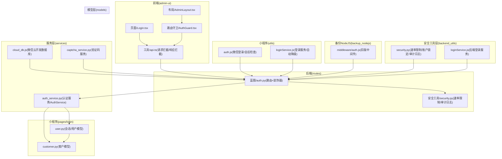
```mermaid
graph TB
subgraph "前端(admin-ui)"
A1["页面/Login.tsx"]
A2["布局/AdminLayout.tsx"]
A3["路由守卫/AuthGuard.tsx"]
A4["工具/api.ts(请求拦截/响应拦截)"]
end
subgraph "小程序(pages/login)"
M1["页面/login.js(游客登录/短信登录)"]
M2["工具/loginService.js(短信验证码)"]
end
subgraph "后端(routes)"
R1["蓝图/auth.py(路由+装饰器)"]
R2["安全工具/security.py(速率限制/审计日志)"]
end
subgraph "服务层(services)"
S1["auth_service.py(认证服务/AuthService)"]
S2["cloud_db.js(微信云开发数据库)"]
S3["captcha_service.py(验证码服务)"]
end
subgraph "模型层(models)"
M1["user.py(会话/用户模型)"]
M2["customer.py(客户模型)"]
end
subgraph "小程序(utils)"
U1["auth.js(微信登录/会话检查)"]
U2["loginService.js(登录服务/自动降级)"]
end
subgraph "备份NodeJS(backup_nodejs)"
N1["middleware/auth.js(旧版中间件)"]
end
subgraph "安全工具层(backend_utils)"
B1["security.py(速率限制/账户锁定/审计日志)"]
B2["loginService.js(后端登录服务)"]
end
A1 --> A4
A2 --> A3
A3 --> A4
A4 --> R1
R1 --> R2
R1 --> S1
S1 --> M1
S1 --> M2
S2 --> R1
S3 --> R1
U1 --> R1
U2 --> R1
M1 --> M2
N1 --> R1
B1 --> R1
B2 --> R1
```

**图表来源**
- [admin-ui/src/pages/Login.tsx:1-78](file://admin-ui/src/pages/Login.tsx#L1-L78)
- [admin-ui/src/utils/api.ts:1-125](file://admin-ui/src/utils/api.ts#L1-L125)
- [admin-ui/src/components/AdminLayout.tsx:1-180](file://admin-ui/src/components/AdminLayout.tsx#L1-L180)
- [admin-ui/src/components/AuthGuard.tsx:1-20](file://admin-ui/src/components/AuthGuard.tsx#L1-L20)
- [pages/login/login.js:341-409](file://pages/login/login.js#L341-L409)
- [miniprogram/utils/loginService.js:318-366](file://miniprogram/utils/loginService.js#L318-L366)
- [routes/auth.py:1-516](file://routes/auth.py#L1-L516)
- [services/auth_service.py:1-581](file://services/auth_service.py#L1-L581)
- [models/user.py:1-309](file://models/user.py#L1-L309)
- [utils/auth.js:1-53](file://utils/auth.js#L1-L53)
- [backup_nodejs/middleware/auth.js:1-85](file://backup_nodejs/middleware/auth.js#L1-L85)
- [services/cloud_db.js:1-327](file://services/cloud_db.js#L1-L327)
- [services/captcha_service.py:1-51](file://services/captcha_service.py#L1-L51)
- [backend_utils/security.py:1-117](file://backend_utils/security.py#L1-L117)
- [miniprogram/utils/loginService.js:1-492](file://miniprogram/utils/loginService.js#L1-L492)
- [backend_utils/loginService.js:1-325](file://backend_utils/loginService.js#L1-L325)

**章节来源**
- [admin-ui/src/pages/Login.tsx:1-78](file://admin-ui/src/pages/Login.tsx#L1-L78)
- [admin-ui/src/utils/api.ts:1-125](file://admin-ui/src/utils/api.ts#L1-L125)
- [admin-ui/src/components/AdminLayout.tsx:1-180](file://admin-ui/src/components/AdminLayout.tsx#L1-L180)
- [admin-ui/src/components/AuthGuard.tsx:1-20](file://admin-ui/src/components/AuthGuard.tsx#L1-L20)
- [pages/login/login.js:341-409](file://pages/login/login.js#L341-L409)
- [miniprogram/utils/loginService.js:318-366](file://miniprogram/utils/loginService.js#L318-L366)
- [routes/auth.py:1-516](file://routes/auth.py#L1-L516)
- [services/auth_service.py:1-581](file://services/auth_service.py#L1-L581)
- [models/user.py:1-309](file://models/user.py#L1-L309)
- [utils/auth.js:1-53](file://utils/auth.js#L1-L53)
- [backup_nodejs/middleware/auth.js:1-85](file://backup_nodejs/middleware/auth.js#L1-L85)
- [services/cloud_db.js:1-327](file://services/cloud_db.js#L1-L327)
- [services/captcha_service.py:1-51](file://services/captcha_service.py#L1-L51)
- [backend_utils/security.py:1-117](file://backend_utils/security.py#L1-L117)
- [miniprogram/utils/loginService.js:1-492](file://miniprogram/utils/loginService.js#L1-L492)
- [backend_utils/loginService.js:1-325](file://backend_utils/loginService.js#L1-L325)

## 核心组件
- 前端路由守卫(AuthGuard)：基于本地存储token进行路由级放行/重定向
- 登录页面(Login)：调用后端登录接口，写入本地token并导航
- API客户端(api.ts)：统一请求拦截注入Authorization头；统一响应拦截处理401并触发自动登出
- 后端认证装饰器(require_auth/require_roles)：解析Authorization头，校验JWT，注入g.admin；按角色过滤
- **新增**：双Token机制：AuthService支持Access/Refresh双重令牌管理，实现无感续期
- **新增**：微信登录自动降级：当网络连接失败或SSL证书问题发生时，系统自动切换到模拟用户数据登录
- **新增**：游客模式支持：提供受限的临时访客登录，角色为guest，功能受限
- **新增**：短信验证码服务：支持手机号登录、注册、密码重置等场景的验证码发送和验证
- **新增**：密码强度验证：支持可配置的密码长度、特殊字符、数字和大写字母要求
- **新增**：增强的会话管理：支持多设备会话记录、会话列表查看和会话撤销
- **新增**：认证服务(AuthService)：完整的认证服务类，包含JWT令牌管理、PBKDF2密码哈希、多种登录方式、统一身份同步、异常处理和日志记录
- **新增**：微信云开发数据库(cloud_db.js)：提供微信云开发数据库客户端，包含配置验证和错误处理
- **新增**：安全工具层(security.py)：提供速率限制、账户锁定和审计日志功能，增强系统安全性
- 用户模型(user.py)：会话持久化(含刷新令牌哈希)、查询活跃会话、撤销会话、多设备会话管理
- 小程序登录(utils/auth.js)：通过wx.login获取code并调用后端换取token，本地存储token与用户信息
- **新增**：改进的登录服务(loginService.js)：增强的自动降级机制，支持开发模式智能降级、网络异常处理和用户提示
- 备份NodeJS中间件(backup_nodejs/middleware/auth.js)：兼容旧版token校验与用户查询

**章节来源**
- [admin-ui/src/components/AuthGuard.tsx:1-20](file://admin-ui/src/components/AuthGuard.tsx#L1-L20)
- [admin-ui/src/pages/Login.tsx:1-78](file://admin-ui/src/pages/Login.tsx#L1-L78)
- [admin-ui/src/utils/api.ts:1-125](file://admin-ui/src/utils/api.ts#L1-L125)
- [routes/auth.py:33-72](file://routes/auth.py#L33-L72)
- [services/auth_service.py:14-31](file://services/auth_service.py#L14-L31)
- [services/cloud_db.js:7-37](file://services/cloud_db.js#L7-L37)
- [backend_utils/security.py:17-117](file://backend_utils/security.py#L17-L117)
- [models/user.py:27-91](file://models/user.py#L27-L91)
- [utils/auth.js:1-53](file://utils/auth.js#L1-L53)
- [miniprogram/utils/loginService.js:12-33](file://miniprogram/utils/loginService.js#L12-L33)
- [backup_nodejs/middleware/auth.js:35-80](file://backup_nodejs/middleware/auth.js#L35-L80)

## 架构总览
认证系统采用"前端拦截+后端校验+安全工具层"的三层防护：
- 前端：路由守卫与API拦截器确保未登录用户无法进入受保护页面，401时自动跳转登录
- 后端：统一的require_auth装饰器负责Authorization头解析与JWT校验，require_roles按角色放行
- **新增**：安全工具层：rate_limit装饰器提供速率限制，audit_log装饰器记录审计日志，增强系统安全性
- 会话与令牌：AuthService签发Access/Refresh Token，user.py持久化刷新令牌哈希，支持刷新轮换
- **新增**：统一身份同步：AuthService在用户登录时自动同步用户数据到客户集合，确保身份一致性
- **新增**：异常处理：完善的try-catch机制和日志记录，提供详细的错误信息和调试支持
- **新增**：微信登录自动降级：当网络连接失败或SSL证书问题发生时，系统自动切换到模拟用户数据登录
- **新增**：游客模式：提供临时访客登录，角色为guest，功能受限，适合快速体验系统功能

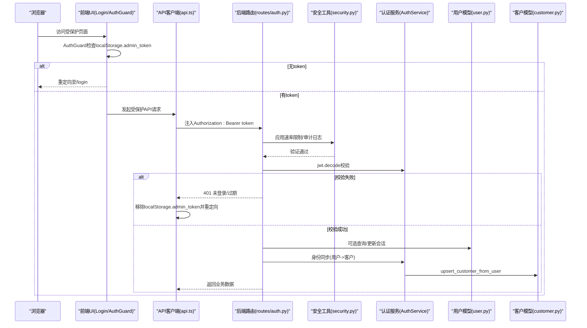
```mermaid
sequenceDiagram
participant Browser as "浏览器"
participant UI as "前端UI(Login/AuthGuard)"
participant API as "API客户端(api.ts)"
participant Route as "后端路由(routes/auth.py)"
participant Security as "安全工具(security.py)"
participant Svc as "认证服务(AuthService)"
participant Model as "用户模型(user.py)"
participant CustModel as "客户模型(customer.py)"
Browser->>UI : 访问受保护页面
UI->>UI : AuthGuard检查localStorage.admin_token
alt 无token
UI-->>Browser : 重定向至/login
else 有token
UI->>API : 发起受保护API请求
API->>Route : 注入Authorization : Bearer token
Route->>Security : 应用速率限制/审计日志
Security-->>Route : 验证通过
Route->>Svc : jwt.decode校验
alt 校验失败
Route-->>API : 401 未登录/过期
API->>API : 移除localStorage.admin_token并重定向
else 校验成功
Route->>Model : 可选查询/更新会话
Route->>Svc : 身份同步(用户->客户)
Svc->>CustModel : upsert_customer_from_user
Route-->>API : 返回业务数据
end
end
```

**图表来源**
- [admin-ui/src/components/AuthGuard.tsx:8-16](file://admin-ui/src/components/AuthGuard.tsx#L8-L16)
- [admin-ui/src/utils/api.ts:63-96](file://admin-ui/src/utils/api.ts#L63-L96)
- [routes/auth.py:21-54](file://routes/auth.py#L21-L54)
- [backend_utils/security.py:17-45](file://backend_utils/security.py#L17-L45)
- [services/auth_service.py:86-131](file://services/auth_service.py#L86-L131)
- [models/user.py:45-60](file://models/user.py#L45-L60)
- [services/auth_service.py:242-251](file://services/auth_service.py#L242-L251)

## 详细组件分析

### 路由守卫与全局认证状态管理
- AuthGuard：在渲染受保护子树前检查localStorage.admin_token，缺失则重定向至登录页并携带来源路径
- AdminLayout：提供退出登录入口，清除localStorage并导航至登录页
- API拦截器：请求阶段注入Authorization头；响应阶段若401且非登录页，则清理token并重定向

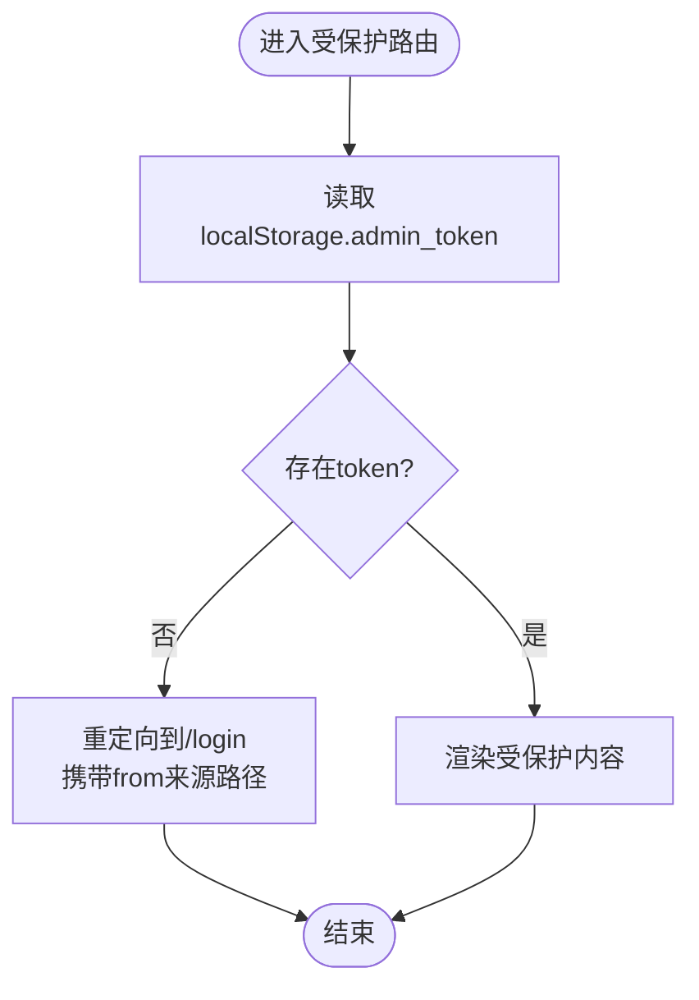
```mermaid
flowchart TD
Start(["进入受保护路由"]) --> CheckToken["读取localStorage.admin_token"]
CheckToken --> HasToken{"存在token?"}
HasToken --> |否| Redirect["重定向到/login<br/>携带from来源路径"]
HasToken --> |是| Render["渲染受保护内容"]
Redirect --> End(["结束"])
Render --> End
```

**图表来源**
- [admin-ui/src/components/AuthGuard.tsx:8-16](file://admin-ui/src/components/AuthGuard.tsx#L8-L16)
- [admin-ui/src/components/AdminLayout.tsx:101-104](file://admin-ui/src/components/AdminLayout.tsx#L101-L104)
- [admin-ui/src/utils/api.ts:63-96](file://admin-ui/src/utils/api.ts#L63-L96)

**章节来源**
- [admin-ui/src/components/AuthGuard.tsx:1-20](file://admin-ui/src/components/AuthGuard.tsx#L1-L20)
- [admin-ui/src/components/AdminLayout.tsx:101-104](file://admin-ui/src/components/AdminLayout.tsx#L101-L104)
- [admin-ui/src/utils/api.ts:63-96](file://admin-ui/src/utils/api.ts#L63-L96)

### 登录流程与token持久化
- Login页面：提交用户名/密码，调用后端登录接口，成功后将token写入localStorage并导航
- 小程序登录：通过wx.login获取code，调用后端换取token并写入storage
- **新增**：双Token机制支持
  - Access Token：15分钟有效期，用于日常API请求
  - Refresh Token：7天有效期，用于无感刷新
  - 自动刷新：前端检测401时自动使用Refresh Token换取新Access Token
- **新增**：多种登录方式支持
  - 邮箱登录：`/auth/login/email`，支持邮箱+密码认证，带速率限制和审计日志
  - 手机登录：`/auth/login/phone`，支持手机号+密码认证，带速率限制和审计日志
  - 微信登录：`/auth/wechat/login`，支持微信授权登录，包含开发模式降级
  - 管理员登录：`/auth/login`，支持用户名+密码认证
  - **新增**：QQ登录和手机号登录，支持开发模式下的模拟登录
  - **新增**：游客登录：`/auth/guest/login`，提供临时访客登录，角色为guest
  - **新增**：短信验证码登录：支持手机号+验证码登录，包含验证码发送和验证功能

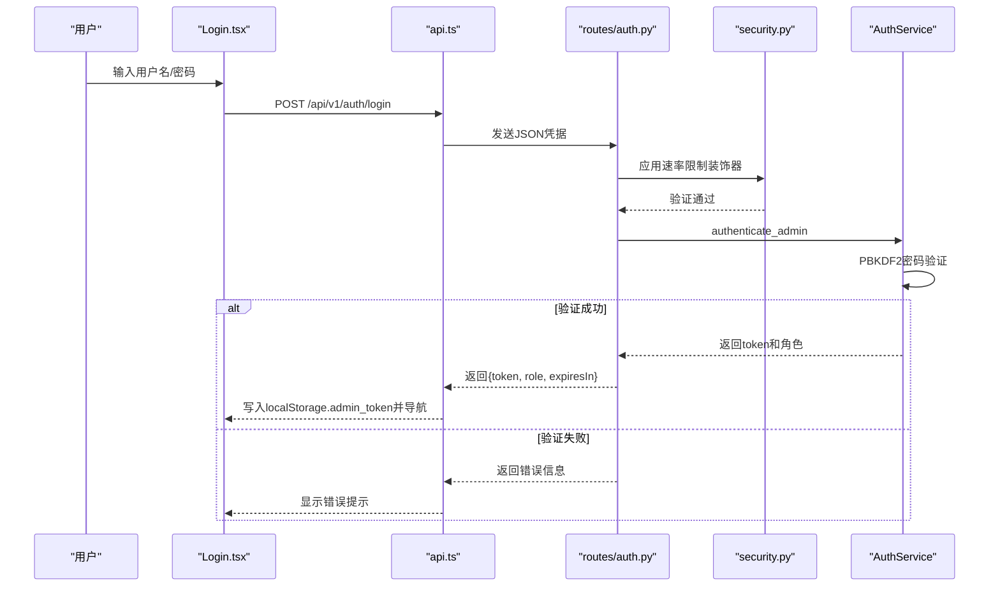
```mermaid
sequenceDiagram
participant User as "用户"
participant Page as "Login.tsx"
participant API as "api.ts"
participant Route as "routes/auth.py"
participant Security as "security.py"
participant Svc as "AuthService"
User->>Page : 输入用户名/密码
Page->>API : POST /api/v1/auth/login
API->>Route : 发送JSON凭据
Route->>Security : 应用速率限制装饰器
Security-->>Route : 验证通过
Route->>Svc : authenticate_admin
Svc->>Svc : PBKDF2密码验证
alt 验证成功
Svc-->>Route : 返回token和角色
Route-->>API : 返回{token, role, expiresIn}
API-->>Page : 写入localStorage.admin_token并导航
else 验证失败
Route-->>API : 返回错误信息
API-->>Page : 显示错误提示
end
```

**图表来源**
- [admin-ui/src/pages/Login.tsx:28-47](file://admin-ui/src/pages/Login.tsx#L28-L47)
- [admin-ui/src/utils/api.ts:57-60](file://admin-ui/src/utils/api.ts#L57-L60)
- [routes/auth.py:74-96](file://routes/auth.py#L74-L96)
- [backend_utils/security.py:17-45](file://backend_utils/security.py#L17-L45)
- [services/auth_service.py:196-210](file://services/auth_service.py#L196-L210)

**章节来源**
- [admin-ui/src/pages/Login.tsx:1-78](file://admin-ui/src/pages/Login.tsx#L1-L78)
- [utils/auth.js:3-33](file://utils/auth.js#L3-L33)
- [routes/auth.py:195-352](file://routes/auth.py#L195-L352)
- [backend_utils/security.py:17-45](file://backend_utils/security.py#L17-L45)
- [services/auth_service.py:162-458](file://services/auth_service.py#L162-L458)

### 后端认证装饰器与角色权限
- require_auth：解析Authorization头，jwt.decode校验，注入g.admin供后续处理器使用
- require_roles：基于角色归一化与顺序比较，实现角色白名单放行
- **新增**：rate_limit装饰器：提供IP+端点维度的速率限制，防止暴力破解
- **新增**：audit_log装饰器：记录用户操作的审计日志，包括用户ID、IP地址和操作状态
- 路由示例：/auth/me、/auth/users等均结合装饰器实现权限控制

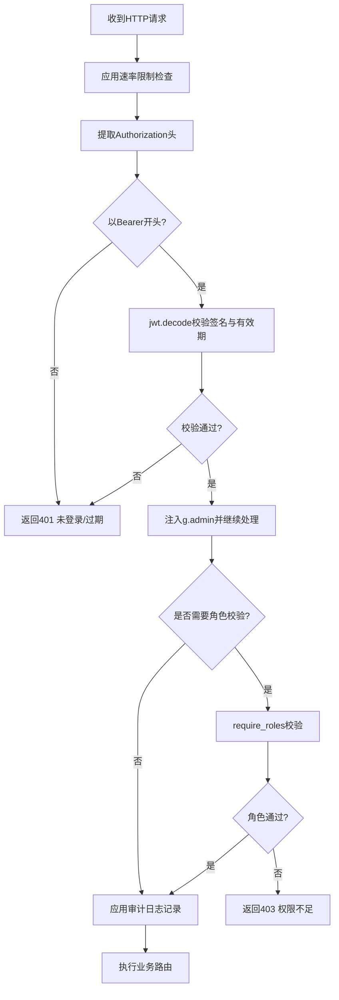
```mermaid
flowchart TD
Req["收到HTTP请求"] --> RateLimit["应用速率限制检查"]
RateLimit --> GetHeader["提取Authorization头"]
GetHeader --> HasBearer{"以Bearer开头?"}
HasBearer --> |否| Deny401["返回401 未登录/过期"]
HasBearer --> |是| Verify["jwt.decode校验签名与有效期"]
Verify --> Ok{"校验通过?"}
Ok --> |否| Deny401
Ok --> |是| Inject["注入g.admin并继续处理"]
Inject --> RoleCheck{"是否需要角色校验?"}
RoleCheck --> |否| AuditLog["应用审计日志记录"]
RoleCheck --> |是| Roles["require_roles校验"]
Roles --> Pass{"角色通过?"}
Pass --> |否| Deny403["返回403 权限不足"]
Pass --> |是| AuditLog
AuditLog --> Next["执行业务路由"]
```

**图表来源**
- [routes/auth.py:21-72](file://routes/auth.py#L21-L72)
- [backend_utils/security.py:17-45](file://backend_utils/security.py#L17-L45)
- [backend_utils/security.py:87-117](file://backend_utils/security.py#L87-L117)

**章节来源**
- [routes/auth.py:33-72](file://routes/auth.py#L33-L72)
- [routes/auth.py:148-171](file://routes/auth.py#L148-L171)
- [backend_utils/security.py:17-45](file://backend_utils/security.py#L17-L45)
- [backend_utils/security.py:87-117](file://backend_utils/security.py#L87-L117)

### 双Token机制与会话管理
- AuthService.issue_token：签发Access(15分钟)与Refresh(7天)令牌，同时将refresh_token哈希存入user_sessions
- AuthService.refresh_token：校验refresh_token类型与有效期，查询活跃会话，撤销旧会话并发放新令牌
- UserModel：提供create_session/find_session/revoke_session/list_sessions等会话操作

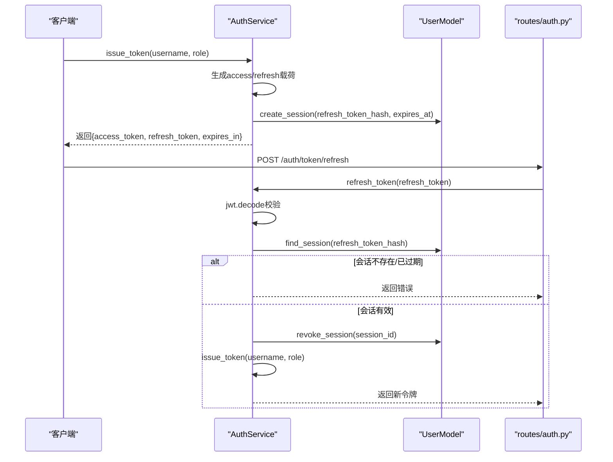
```mermaid
sequenceDiagram
participant Client as "客户端"
participant Svc as "AuthService"
participant Model as "UserModel"
participant Route as "routes/auth.py"
Client->>Svc : issue_token(username, role)
Svc->>Svc : 生成access/refresh载荷
Svc->>Model : create_session(refresh_token_hash, expires_at)
Svc-->>Client : 返回{access_token, refresh_token, expires_in}
Client->>Route : POST /auth/token/refresh
Route->>Svc : refresh_token(refresh_token)
Svc->>Svc : jwt.decode校验
Svc->>Model : find_session(refresh_token_hash)
alt 会话不存在/已过期
Svc-->>Route : 返回错误
else 会话有效
Svc->>Model : revoke_session(session_id)
Svc->>Svc : issue_token(username, role)
Svc-->>Route : 返回新令牌
end
```

**图表来源**
- [services/auth_service.py:115-169](file://services/auth_service.py#L115-L169)
- [services/auth_service.py:171-199](file://services/auth_service.py#L171-L199)
- [models/user.py:27-91](file://models/user.py#L27-L91)
- [routes/auth.py:244-256](file://routes/auth.py#L244-L256)

**章节来源**
- [services/auth_service.py:115-199](file://services/auth_service.py#L115-L199)
- [models/user.py:27-91](file://models/user.py#L27-L91)
- [routes/auth.py:244-256](file://routes/auth.py#L244-L256)

### API请求拦截、错误处理与自动登出
- 请求拦截：统一注入Authorization: Bearer token
- 响应拦截：捕获401，清除localStorage.admin_token，若不在登录页则重定向至/login

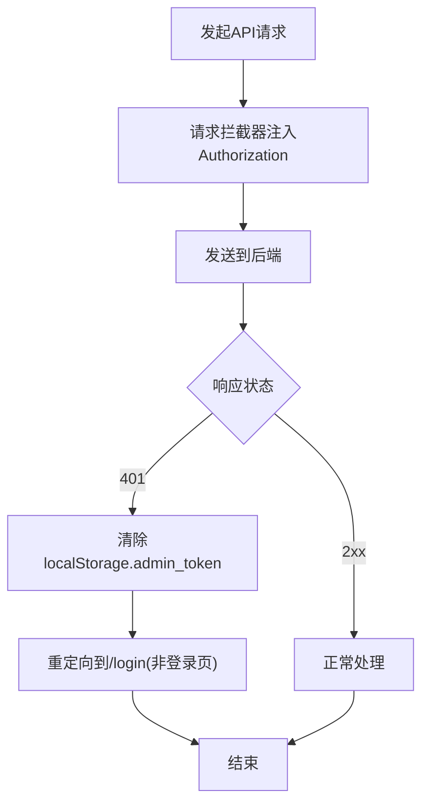
```mermaid
flowchart TD
Call["发起API请求"] --> Interceptor["请求拦截器注入Authorization"]
Interceptor --> Send["发送到后端"]
Send --> Resp{"响应状态"}
Resp --> |2xx| Done["正常处理"]
Resp --> |401| Clear["清除localStorage.admin_token"]
Clear --> Nav["重定向到/login(非登录页)"]
Nav --> End["结束"]
Done --> End
```

**图表来源**
- [admin-ui/src/utils/api.ts:63-96](file://admin-ui/src/utils/api.ts#L63-L96)

**章节来源**
- [admin-ui/src/utils/api.ts:63-120](file://admin-ui/src/utils/api.ts#L63-L120)

### 用户角色权限体系与菜单/按钮级权限
- 角色定义与归一化：viewer(editor(admin，支持_normalize_role与require_roles
- 路由级权限：/auth/users仅admin可访问
- 前端菜单/按钮级权限：可在AdminLayout菜单项上根据当前用户角色动态渲染或禁用
- **新增**：游客角色支持：guest角色具有受限权限，仅能访问基本功能

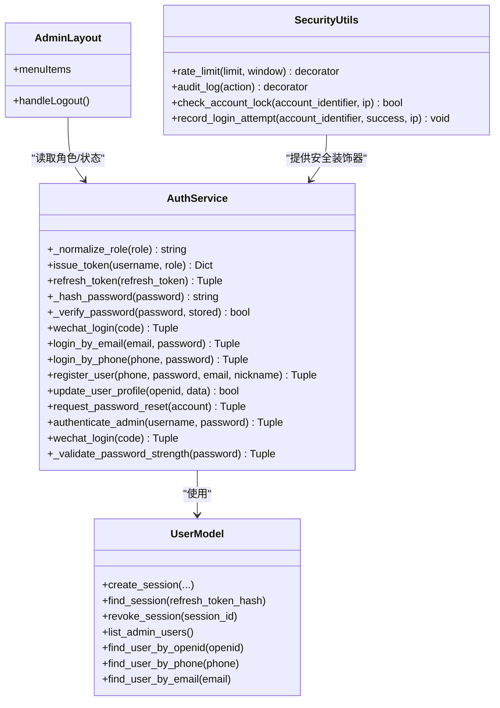
```mermaid
classDiagram
class AuthService {
+_normalize_role(role) string
+issue_token(username, role) Dict
+refresh_token(refresh_token) Tuple
+_hash_password(password) string
+_verify_password(password, stored) bool
+wechat_login(code) Tuple
+login_by_email(email, password) Tuple
+login_by_phone(phone, password) Tuple
+register_user(phone, password, email, nickname) Tuple
+update_user_profile(openid, data) bool
+request_password_reset(account) Tuple
+authenticate_admin(username, password) Tuple
+wechat_login(code) Tuple
+_validate_password_strength(password) Tuple
}
class UserModel {
+create_session(...)
+find_session(refresh_token_hash)
+revoke_session(session_id)
+list_admin_users()
+find_user_by_openid(openid)
+find_user_by_phone(phone)
+find_user_by_email(email)
}
class AdminLayout {
+handleLogout()
+menuItems
}
class SecurityUtils {
+rate_limit(limit, window) decorator
+audit_log(action) decorator
+check_account_lock(account_identifier, ip) bool
+record_login_attempt(account_identifier, success, ip) void
}
AuthService --> UserModel : "使用"
AdminLayout --> AuthService : "读取角色/状态"
SecurityUtils --> AuthService : "提供安全装饰器"
```

**图表来源**
- [services/auth_service.py:45-47](file://services/auth_service.py#L45-L47)
- [services/auth_service.py:212-229](file://services/auth_service.py#L212-L229)
- [models/user.py:27-91](file://models/user.py#L27-L91)
- [admin-ui/src/components/AdminLayout.tsx:42-99](file://admin-ui/src/components/AdminLayout.tsx#L42-L99)
- [backend_utils/security.py:17-117](file://backend_utils/security.py#L17-L117)

**章节来源**
- [services/auth_service.py:27-31](file://services/auth_service.py#L27-L31)
- [routes/auth.py:148-171](file://routes/auth.py#L148-L171)
- [admin-ui/src/components/AdminLayout.tsx:42-99](file://admin-ui/src/components/AdminLayout.tsx#L42-L99)
- [backend_utils/security.py:17-117](file://backend_utils/security.py#L17-L117)

### 认证流程完整生命周期
- 登录：前端提交凭据 → 后端校验 → 签发令牌 → 前端持久化token → 进入受保护页面
- 访问受保护资源：前端自动注入Authorization → 后端require_auth校验 → 业务路由处理
- 刷新：前端携带refresh_token调用刷新接口 → 后端校验并撤销旧会话 → 发放新令牌
- 自动登出：后端401或前端401拦截 → 清理token并重定向登录
- **新增**：身份同步：用户登录时自动同步到客户集合，确保统一身份管理
- **新增**：异常处理：完善的错误捕获和日志记录，提供详细的调试信息
- **新增**：安全防护：速率限制防止暴力破解，审计日志记录所有重要操作
- **新增**：微信登录自动降级：当网络连接失败或SSL证书问题发生时，系统自动切换到模拟用户数据登录
- **新增**：游客模式：支持临时访客登录，角色为guest，功能受限
- **新增**：短信验证码：支持手机号登录、注册、密码重置等场景的验证码功能

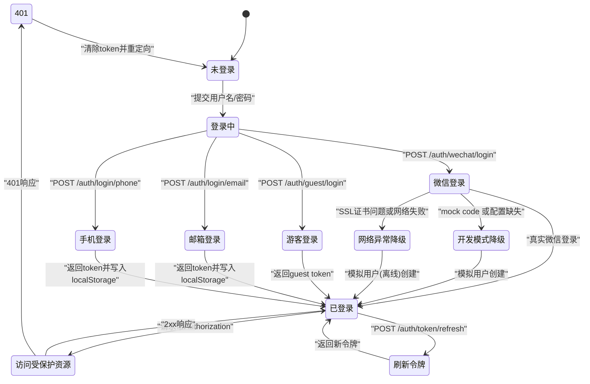
```mermaid
stateDiagram-v2
[*] --> 未登录
未登录 --> 登录中 : "提交用户名/密码"
登录中 --> 邮箱登录 : "POST /auth/login/email"
登录中 --> 手机登录 : "POST /auth/login/phone"
登录中 --> 微信登录 : "POST /auth/wechat/login"
登录中 --> 游客登录 : "POST /auth/guest/login"
微信登录 --> 开发模式降级 : "mock code 或配置缺失"
微信登录 --> 网络异常降级 : "SSL证书问题或网络失败"
微信登录 --> 已登录 : "真实微信登录"
开发模式降级 --> 已登录 : "模拟用户创建"
网络异常降级 --> 已登录 : "模拟用户(离线)创建"
游客登录 --> 已登录 : "返回guest token"
邮箱登录 --> 已登录 : "返回token并写入localStorage"
手机登录 --> 已登录 : "返回token并写入localStorage"
已登录 --> 访问受保护资源 : "请求带Authorization"
访问受保护资源 --> 已登录 : "2xx响应"
访问受保护资源 --> 401 : "401响应"
401 --> 未登录 : "清除token并重定向"
已登录 --> 刷新令牌 : "POST /auth/token/refresh"
刷新令牌 --> 已登录 : "返回新令牌"
```

**图表来源**
- [admin-ui/src/pages/Login.tsx:28-47](file://admin-ui/src/pages/Login.tsx#L28-L47)
- [admin-ui/src/utils/api.ts:63-96](file://admin-ui/src/utils/api.ts#L63-L96)
- [routes/auth.py:244-256](file://routes/auth.py#L244-L256)
- [services/auth_service.py:171-199](file://services/auth_service.py#L171-L199)
- [routes/auth.py:195-352](file://routes/auth.py#L195-L352)
- [routes/auth.py:452-476](file://routes/auth.py#L452-L476)

**章节来源**
- [routes/auth.py:74-96](file://routes/auth.py#L74-L96)
- [routes/auth.py:244-256](file://routes/auth.py#L244-L256)
- [admin-ui/src/utils/api.ts:63-96](file://admin-ui/src/utils/api.ts#L63-L96)

### 安全策略与最佳实践
- 令牌策略：Access短效(15分钟)，Refresh长效(7天)，刷新时撤销旧会话(旋转)
- 会话持久化：刷新令牌以哈希形式存储，便于快速查找与撤销
- 前端拦截：统一注入Authorization，401自动登出，避免泄露
- 后端校验：require_auth + require_roles双保险，角色归一化防止大小写/拼写差异
- 环境变量：JWT密钥、算法、过期时间通过环境变量配置，生产环境务必随机且保密
- 多平台登录：小程序与Web共享同一后端，token一致；小程序侧提供checkSession辅助
- **新增**：密码安全：使用PBKDF2算法进行密码哈希，支持可配置迭代次数，提供密码验证功能
- **新增**：身份同步：登录时自动同步用户数据到客户集合，确保多系统间身份一致性
- **新增**：异常处理：完善的try-catch机制和日志记录，提供详细的错误信息和调试支持
- **新增**：微信配置验证：自动检测占位符配置，提供开发模式降级支持
- **新增**：速率限制：IP+端点维度的请求频率控制，防止暴力破解攻击
- **新增**：账户锁定：连续失败登录5次锁定15分钟，增强抗攻击能力
- **新增**：审计日志：记录所有重要操作，包括用户ID、IP地址和操作状态
- **新增**：微信登录自动降级：当网络连接失败或SSL证书问题发生时，系统自动切换到模拟用户数据登录
- **新增**：密码强度验证：支持可配置的密码长度、特殊字符、数字和大写字母要求
- **新增**：多设备会话管理：支持会话列表查看和会话撤销功能

**章节来源**
- [services/auth_service.py:16-18](file://services/auth_service.py#L16-L18)
- [services/auth_service.py:115-169](file://services/auth_service.py#L115-L169)
- [models/user.py:27-60](file://models/user.py#L27-L60)
- [admin-ui/src/utils/api.ts:63-96](file://admin-ui/src/utils/api.ts#L63-L96)
- [routes/auth.py:56-72](file://routes/auth.py#L56-L72)
- [services/auth_service.py:49-84](file://services/auth_service.py#L49-L84)
- [services/auth_service.py:242-251](file://services/auth_service.py#L242-L251)
- [services/auth_service.py:27-31](file://services/auth_service.py#L27-L31)
- [backend_utils/security.py:17-117](file://backend_utils/security.py#L17-L117)

### 组件使用示例与自定义权限验证
- 使用AuthGuard包裹受保护路由
- 在AdminLayout中根据角色动态渲染菜单项
- 自定义权限：在路由上叠加require_roles装饰器；在业务代码中读取g.admin中的角色字段进行细粒度控制
- **新增**：多种登录方式：根据业务需求选择合适的登录方式，如邮箱登录、手机登录或微信登录
- **新增**：异常处理：利用增强的日志记录和错误处理机制，提供更好的调试体验
- **新增**：安全装饰器：在路由上使用@rate_limit和@audit_log装饰器增强安全性
- **新增**：微信登录自动降级：系统会在网络异常时自动切换到模拟用户数据登录
- **新增**：游客模式：支持临时访客登录，适合快速体验系统功能
- **新增**：短信验证码：支持手机号登录、注册、密码重置等场景的验证码功能

**章节来源**
- [admin-ui/src/components/AuthGuard.tsx:8-16](file://admin-ui/src/components/AuthGuard.tsx#L8-L16)
- [admin-ui/src/components/AdminLayout.tsx:42-99](file://admin-ui/src/components/AdminLayout.tsx#L42-L99)
- [routes/auth.py:56-72](file://routes/auth.py#L56-L72)
- [backend_utils/security.py:17-117](file://backend_utils/security.py#L17-L117)

### 多租户认证支持方案
- 当前实现以用户标识(sub)与角色(role)为核心，未见显式的租户字段
- 支持方案建议：
  - 在JWT载荷中加入tenant_id字段，后端require_auth解码后读取
  - 在UserModel中扩展会话/用户模型，增加tenant维度的查询与隔离
  - 在require_roles基础上扩展tenant-aware的角色映射
  - 对于多租户的刷新令牌，建议在create_session时也记录tenant_id，保证撤销与查询的租户一致性

**章节来源**
- [services/auth_service.py:93-112](file://services/auth_service.py#L93-L112)
- [models/user.py:27-44](file://models/user.py#L27-L44)

### **新增**：双Token机制实现

#### 双Token架构设计
系统实现了完整的双Token认证机制，提供无感续期和安全的令牌管理：

- **Access Token**：短期有效(15分钟)，用于日常API请求
- **Refresh Token**：长期有效(7天)，用于无感刷新Access Token
- **令牌轮换**：刷新时撤销旧的Refresh Token，发放新的Refresh Token
- **会话持久化**：刷新令牌以哈希形式存储，便于快速查找与撤销

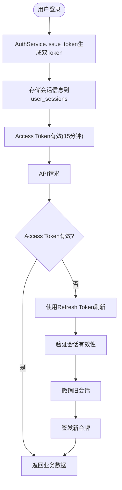
```mermaid
flowchart TD
Start(["用户登录"]) --> IssueTokens["AuthService.issue_token生成双Token"]
IssueTokens --> StoreSession["存储会话信息到user_sessions"]
StoreSession --> AccessValid["Access Token有效(15分钟)"]
AccessValid --> APIRequest["API请求"]
APIRequest --> CheckToken{"Access Token有效?"}
CheckToken --> |是| Success["返回业务数据"]
CheckToken --> |否| RefreshToken["使用Refresh Token刷新"]
RefreshToken --> VerifySession["验证会话有效性"]
VerifySession --> RevokeOld["撤销旧会话"]
RevokeOld --> IssueNew["签发新令牌"]
IssueNew --> Success
```

**图表来源**
- [services/auth_service.py:115-169](file://services/auth_service.py#L115-L169)
- [models/user.py:27-60](file://models/user.py#L27-L60)
- [routes/auth.py:244-256](file://routes/auth.py#L244-L256)

**章节来源**
- [services/auth_service.py:115-169](file://services/auth_service.py#L115-L169)
- [models/user.py:27-60](file://models/user.py#L27-L60)
- [routes/auth.py:244-256](file://routes/auth.py#L244-L256)

#### 令牌刷新流程
- **自动刷新**：前端检测401时自动使用Refresh Token换取新Access Token
- **会话管理**：刷新时撤销旧会话，确保令牌安全轮换
- **异常处理**：刷新失败时自动登出，清理本地存储

### **新增**：微信登录自动降级机制

#### 自动降级策略
系统实现了多层次的微信登录自动降级机制，确保在网络异常或配置问题时仍能提供良好的用户体验：

- **开发模式降级**：当使用mock code或缺少微信配置时，自动切换到模拟用户数据登录
- **网络异常降级**：当微信API请求失败或SSL证书问题发生时，自动降级到模拟用户(离线)登录
- **配置验证降级**：当检测到占位符配置时，自动启用模拟登录模式
- **用户提示降级**：在开发模式下，提供模态框让用户选择是否使用模拟数据

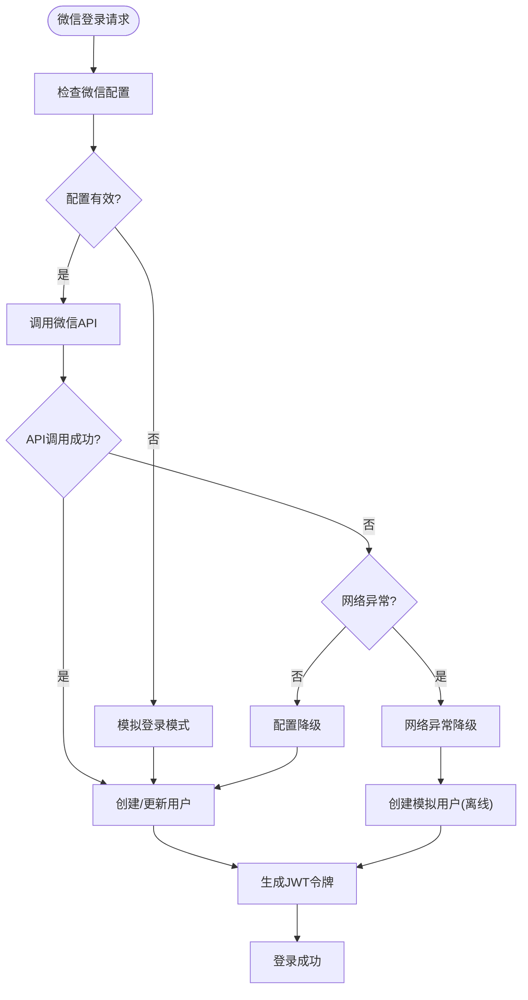
```mermaid
flowchart TD
Start(["微信登录请求"]) --> CheckConfig["检查微信配置"]
CheckConfig --> HasConfig{"配置有效?"}
HasConfig --> |否| MockLogin["模拟登录模式"]
HasConfig --> |是| CallWeChatAPI["调用微信API"]
CallWeChatAPI --> ApiSuccess{"API调用成功?"}
ApiSuccess --> |是| CreateUser["创建/更新用户"]
ApiSuccess --> |否| CheckNetwork{"网络异常?"}
CheckNetwork --> |是| NetworkFallback["网络异常降级"]
CheckNetwork --> |否| ConfigFallback["配置降级"]
MockLogin --> CreateUser
NetworkFallback --> CreateUserOffline["创建模拟用户(离线)"]
ConfigFallback --> CreateUser
CreateUser --> GenerateToken["生成JWT令牌"]
CreateUserOffline --> GenerateToken
GenerateToken --> Success["登录成功"]
```

**图表来源**
- [services/auth_service.py:303-440](file://services/auth_service.py#L303-L440)
- [miniprogram/utils/loginService.js:12-33](file://miniprogram/utils/loginService.js#L12-L33)
- [miniprogram/utils/loginService.js:38-86](file://miniprogram/utils/loginService.js#L38-L86)

**章节来源**
- [services/auth_service.py:303-440](file://services/auth_service.py#L303-L440)
- [miniprogram/utils/loginService.js:12-33](file://miniprogram/utils/loginService.js#L12-L33)
- [miniprogram/utils/loginService.js:38-86](file://miniprogram/utils/loginService.js#L38-L86)

#### 开发模式支持
开发模式下提供了完整的Dev Mode Support，支持mock code自动降级：

- **mock code检测**：识别以"mock_"开头的code，自动启用模拟登录
- **占位符检测**：自动检测WX_SECRET中的占位符，如"请从"、"your_"等
- **开发环境判断**：通过NODE_ENV环境变量判断开发模式
- **自动降级触发**：在开发模式下，即使后端API失败也不静默切换到云函数

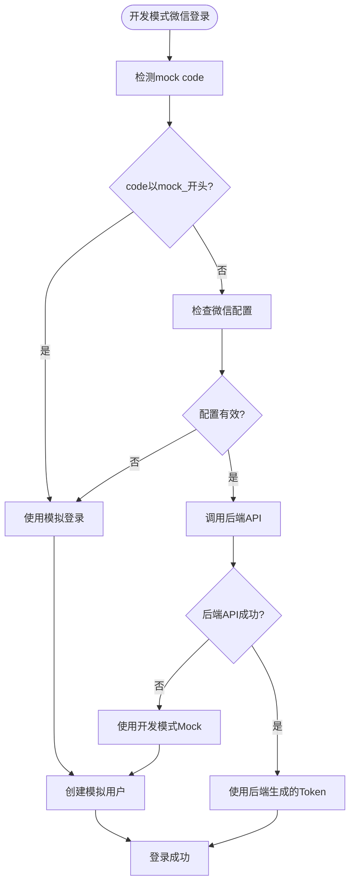
```mermaid
flowchart TD
DevStart(["开发模式微信登录"]) --> DetectMock["检测mock code"]
DetectMock --> IsMock{"code以mock_开头?"}
IsMock --> |是| UseMock["使用模拟登录"]
IsMock --> |否| CheckConfig["检查微信配置"]
CheckConfig --> HasValidConfig{"配置有效?"}
HasValidConfig --> |是| CallBackend["调用后端API"]
HasValidConfig --> |否| UseMock
CallBackend --> BackendSuccess{"后端API成功?"}
BackendSuccess --> |是| UseBackendToken["使用后端生成的Token"]
BackendSuccess --> |否| UseDevMock["使用开发模式Mock"]
UseMock --> CreateUser["创建模拟用户"]
UseDevMock --> CreateUser
CreateUser --> Success["登录成功"]
UseBackendToken --> Success
```

**图表来源**
- [services/auth_service.py:303-366](file://services/auth_service.py#L303-L366)
- [miniprogram/utils/loginService.js:44-68](file://miniprogram/utils/loginService.js#L44-L68)

**章节来源**
- [services/auth_service.py:303-366](file://services/auth_service.py#L303-L366)
- [miniprogram/utils/loginService.js:44-68](file://miniprogram/utils/loginService.js#L44-L68)

#### 网络异常处理
系统实现了智能的网络异常检测和处理机制：

- **SSL证书问题检测**：通过异常消息中的"SSL"、"certificate"等关键词识别SSL问题
- **网络超时检测**：识别"timeout"、"network"等网络异常关键词
- **API失败降级**：当微信API请求失败时，自动降级到模拟用户(离线)登录
- **用户友好提示**：提供清晰的错误信息和降级说明

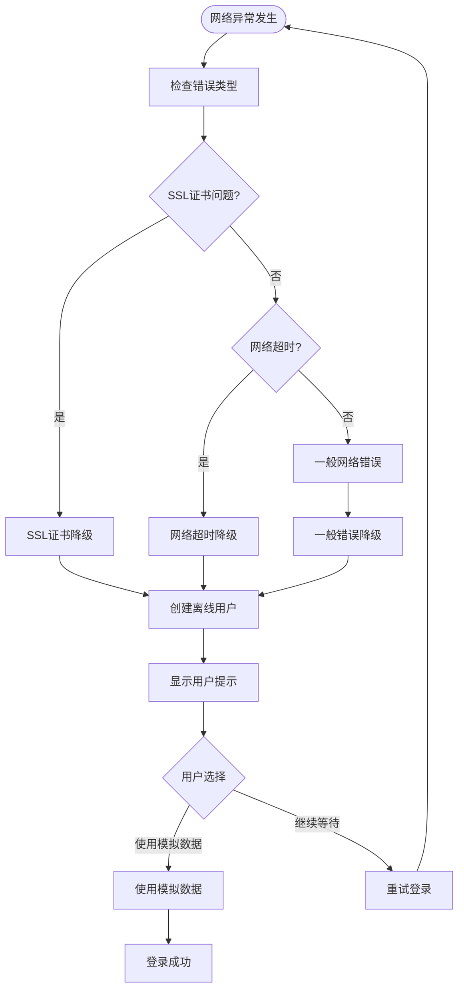
```mermaid
flowchart TD
NetworkError(["网络异常发生"]) --> CheckErrorType["检查错误类型"]
CheckErrorType --> SSLProblem{"SSL证书问题?"}
SSLProblem --> |是| SSLFallback["SSL证书降级"]
SSLProblem --> |否| NetworkTimeout{"网络超时?"}
NetworkTimeout --> |是| TimeoutFallback["网络超时降级"]
NetworkTimeout --> |否| GeneralError["一般网络错误"]
GeneralError --> GeneralFallback["一般错误降级"]
SSLFallback --> CreateOfflineUser["创建离线用户"]
TimeoutFallback --> CreateOfflineUser
GeneralFallback --> CreateOfflineUser
CreateOfflineUser --> ShowModal["显示用户提示"]
ShowModal --> UserChoice{"用户选择"}
UserChoice --> |使用模拟数据| UseMockData["使用模拟数据"]
UserChoice --> |继续等待| RetryLogin["重试登录"]
UseMockData --> Success["登录成功"]
RetryLogin --> NetworkError
```

**图表来源**
- [services/auth_service.py:424-440](file://services/auth_service.py#L424-L440)
- [miniprogram/utils/loginService.js:88-115](file://miniprogram/utils/loginService.js#L88-L115)

**章节来源**
- [services/auth_service.py:424-440](file://services/auth_service.py#L424-L440)
- [miniprogram/utils/loginService.js:88-115](file://miniprogram/utils/loginService.js#L88-L115)

### **新增**：游客模式支持

#### 游客登录流程
系统提供了完整的游客模式支持，允许用户以临时访客身份登录，功能受限：

- **游客角色**：登录后角色为guest，具有受限权限
- **临时令牌**：生成短期有效的访问令牌，不包含敏感信息
- **功能限制**：游客模式下部分交易功能不可用，建议注册登录获得完整体验
- **用户协议**：游客登录前需同意用户协议

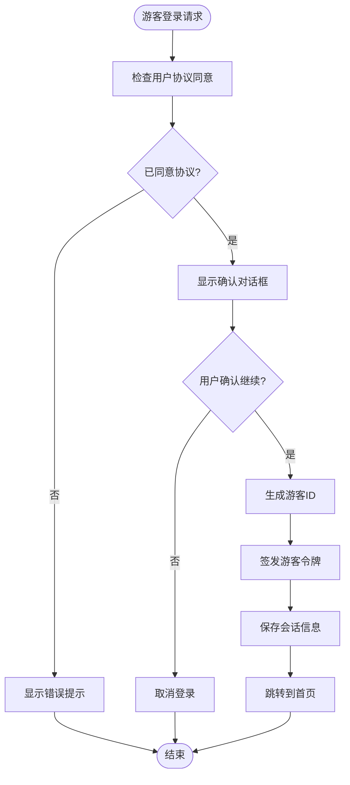
```mermaid
flowchart TD
Start(["游客登录请求"]) --> CheckAgreement["检查用户协议同意"]
CheckAgreement --> Agreement{"已同意协议?"}
Agreement --> |否| ShowError["显示错误提示"]
Agreement --> |是| ShowModal["显示确认对话框"]
ShowModal --> Confirm{"用户确认继续?"}
Confirm --> |否| Cancel["取消登录"]
Confirm --> |是| GenerateGuestId["生成游客ID"]
GenerateGuestId --> IssueToken["签发游客令牌"]
IssueToken --> SaveSession["保存会话信息"]
SaveSession --> Navigate["跳转到首页"]
ShowError --> End(["结束"])
Cancel --> End
Navigate --> End
```

**图表来源**
- [pages/login/login.js:341-409](file://pages/login/login.js#L341-L409)
- [routes/auth.py:452-476](file://routes/auth.py#L452-L476)

**章节来源**
- [pages/login/login.js:341-409](file://pages/login/login.js#L341-L409)
- [routes/auth.py:452-476](file://routes/auth.py#L452-L476)

#### 游客模式特点
- **临时性**：游客ID以guest_前缀标识，便于系统识别
- **受限功能**：角色为guest，无法访问需要完整权限的功能
- **无状态**：不绑定手机号或邮箱，无需验证
- **易撤销**：游客状态不会影响系统数据完整性

### **新增**：短信验证码功能

#### 验证码服务架构
系统提供了完整的短信验证码服务，支持多种登录和验证场景：

- **发送验证码**：`/auth/send-sms-code`，支持手机号格式验证
- **验证验证码**：`/auth/verify-sms-code`，支持登录、注册、重置密码等场景
- **类型支持**：login、register、reset_password、bind等不同用途
- **开发模式**：开发环境下直接返回验证码，便于测试

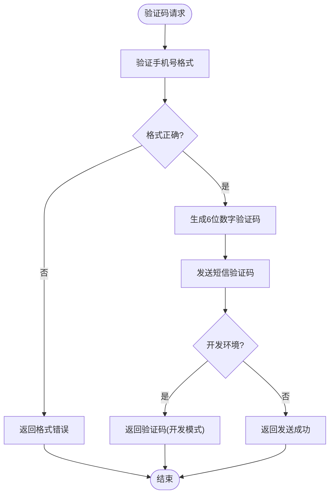
```mermaid
flowchart TD
Start(["验证码请求"]) --> ValidatePhone["验证手机号格式"]
ValidatePhone --> PhoneValid{"格式正确?"}
PhoneValid --> |否| ReturnError["返回格式错误"]
PhoneValid --> |是| GenerateCode["生成6位数字验证码"]
GenerateCode --> SendSMS["发送短信验证码"]
SendSMS --> CheckEnv{"开发环境?"}
CheckEnv --> |是| ReturnCode["返回验证码(开发模式)"]
CheckEnv --> |否| ReturnSuccess["返回发送成功"]
ReturnError --> End(["结束"])
ReturnCode --> End
ReturnSuccess --> End
```

**图表来源**
- [routes/auth.py:270-324](file://routes/auth.py#L270-L324)
- [services/captcha_service.py:37-51](file://services/captcha_service.py#L37-L51)
- [miniprogram/utils/loginService.js:389-434](file://miniprogram/utils/loginService.js#L389-L434)
- [backend_utils/loginService.js:156-204](file://backend_utils/loginService.js#L156-L204)

**章节来源**
- [routes/auth.py:270-324](file://routes/auth.py#L270-L324)
- [services/captcha_service.py:37-51](file://services/captcha_service.py#L37-L51)
- [miniprogram/utils/loginService.js:389-434](file://miniprogram/utils/loginService.js#L389-L434)
- [backend_utils/loginService.js:156-204](file://backend_utils/loginService.js#L156-L204)

#### 验证码验证流程
- **参数验证**：检查手机号、验证码、类型参数的完整性
- **格式验证**：手机号必须符合11位数字格式
- **类型验证**：支持login、register、reset_password、bind等类型
- **错误处理**：提供详细的错误信息和降级策略

### **新增**：密码强度验证机制

#### 配置化密码策略
系统支持可配置的密码强度验证，通过环境变量控制：

- **最小长度**：PASSWORD_MIN_LENGTH，默认8位
- **特殊字符要求**：PASSWORD_REQUIRE_SPECIAL，默认开启
- **数字要求**：PASSWORD_REQUIRE_NUMBER，默认开启
- **大写字母要求**：PASSWORD_REQUIRE_UPPERCASE，默认开启

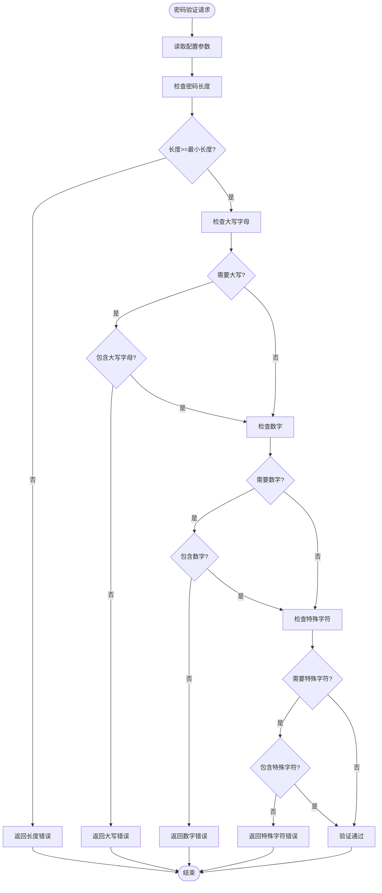
```mermaid
flowchart TD
Start(["密码验证请求"]) --> GetConfig["读取配置参数"]
GetConfig --> CheckLength["检查密码长度"]
CheckLength --> LengthOK{"长度>=最小长度?"}
LengthOK --> |否| ReturnError1["返回长度错误"]
LengthOK --> |是| CheckUppercase["检查大写字母"]
CheckUppercase --> UppercaseOK{"需要大写?"}
UppercaseOK --> |是| HasUppercase{"包含大写字母?"}
HasUppercase --> |否| ReturnError2["返回大写错误"]
HasUppercase --> |是| CheckNumber["检查数字"]
UppercaseOK --> |否| CheckNumber
CheckNumber --> NumberOK{"需要数字?"}
NumberOK --> |是| HasNumber{"包含数字?"}
HasNumber --> |否| ReturnError3["返回数字错误"]
HasNumber --> |是| CheckSpecial["检查特殊字符"]
NumberOK --> |否| CheckSpecial
CheckSpecial --> SpecialOK{"需要特殊字符?"}
SpecialOK --> |是| HasSpecial{"包含特殊字符?"}
HasSpecial --> |否| ReturnError4["返回特殊字符错误"]
HasSpecial --> |是| ReturnSuccess["验证通过"]
SpecialOK --> |否| ReturnSuccess
ReturnError1 --> End(["结束"])
ReturnError2 --> End
ReturnError3 --> End
ReturnError4 --> End
ReturnSuccess --> End
```

**图表来源**
- [services/auth_service.py:54-76](file://services/auth_service.py#L54-L76)
- [init_admin.py:42-49](file://init_admin.py#L42-L49)

**章节来源**
- [services/auth_service.py:54-76](file://services/auth_service.py#L54-L76)
- [init_admin.py:42-49](file://init_admin.py#L42-L49)

#### 密码验证应用场景
- **用户注册**：注册时强制验证密码强度
- **密码重置**：重置密码时验证新密码强度
- **管理员设置**：初始化管理员密码时验证强度
- **密码更新**：用户修改密码时验证新密码强度

### **新增**：增强的会话管理功能

#### 多设备会话支持
系统增强了会话管理功能，支持多设备登录和会话管理：

- **会话记录**：登录时记录设备信息、IP地址、User-Agent
- **会话列表**：支持查看当前用户的所有活跃会话
- **会话撤销**：支持撤销特定设备的登录状态
- **会话轮换**：刷新令牌时撤销旧会话，提高安全性

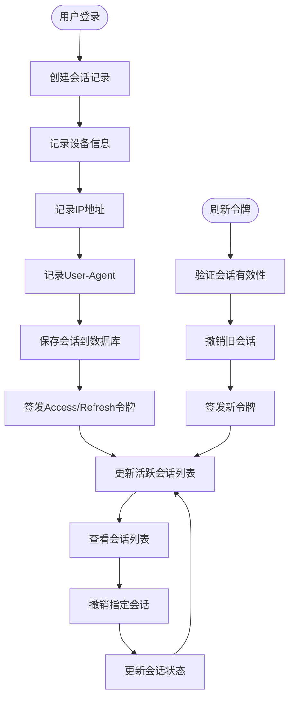
```mermaid
flowchart TD
Login(["用户登录"]) --> CreateSession["创建会话记录"]
CreateSession --> RecordDeviceInfo["记录设备信息"]
RecordDeviceInfo --> RecordIP["记录IP地址"]
RecordIP --> RecordUserAgent["记录User-Agent"]
RecordUserAgent --> SaveSession["保存会话到数据库"]
SaveSession --> IssueTokens["签发Access/Refresh令牌"]
IssueTokens --> ActiveSessions["更新活跃会话列表"]
ActiveSessions --> ListSessions["查看会话列表"]
ListSessions --> RevokeSession["撤销指定会话"]
RevokeSession --> UpdateStatus["更新会话状态"]
UpdateStatus --> ActiveSessions
RefreshToken(["刷新令牌"]) --> VerifySession["验证会话有效性"]
VerifySession --> RevokeOld["撤销旧会话"]
RevokeOld --> IssueNew["签发新令牌"]
IssueNew --> ActiveSessions
```

**图表来源**
- [models/user.py:27-91](file://models/user.py#L27-L91)
- [services/auth_service.py:171-199](file://services/auth_service.py#L171-L199)

**章节来源**
- [models/user.py:27-91](file://models/user.py#L27-L91)
- [services/auth_service.py:171-199](file://services/auth_service.py#L171-L199)

#### 会话管理API
- **会话创建**：`POST /auth/token/refresh`时自动创建会话记录
- **会话查询**：`GET /auth/sessions`查看当前用户的所有活跃会话
- **会话撤销**：`DELETE /auth/sessions/{session_id}`撤销指定会话
- **会话列表**：`GET /auth/sessions`获取会话列表

### **新增**：安全工具层完整实现分析

#### 速率限制机制
安全工具层提供了完整的速率限制功能，防止暴力破解和DDoS攻击：

- **rate_limit装饰器**：基于IP地址和端点组合的请求频率控制
- **内存存储**：使用_in-memory_store存储请求历史，支持时间窗口清理
- **灵活配置**：可配置每分钟最大请求数和时间窗口
- **自动降级**：超过限制时返回429状态码和友好错误信息

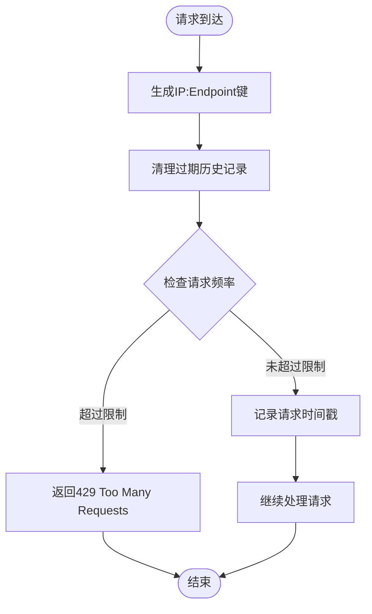
```mermaid
flowchart TD
Start(["请求到达"]) --> GetKey["生成IP:Endpoint键"]
GetKey --> CleanHistory["清理过期历史记录"]
CleanHistory --> CheckLimit{"检查请求频率"}
CheckLimit --> |超过限制| Block["返回429 Too Many Requests"]
CheckLimit --> |未超过限制| Record["记录请求时间戳"]
Record --> Continue["继续处理请求"]
Block --> End(["结束"])
Continue --> End
```

**图表来源**
- [backend_utils/security.py:18-46](file://backend_utils/security.py#L18-L46)

**章节来源**
- [backend_utils/security.py:18-46](file://backend_utils/security.py#L18-L46)

#### 账户锁定与防暴力破解
安全工具层实现了智能的账户锁定机制，有效防止暴力破解攻击：

- **账户锁定策略**：连续5次失败登录锁定15分钟
- **IP+账户维度**：基于IP地址和账户标识符的独立锁定
- **自动解锁**：锁定时间到期后自动解锁
- **失败记录**：记录失败尝试次数和锁定截止时间

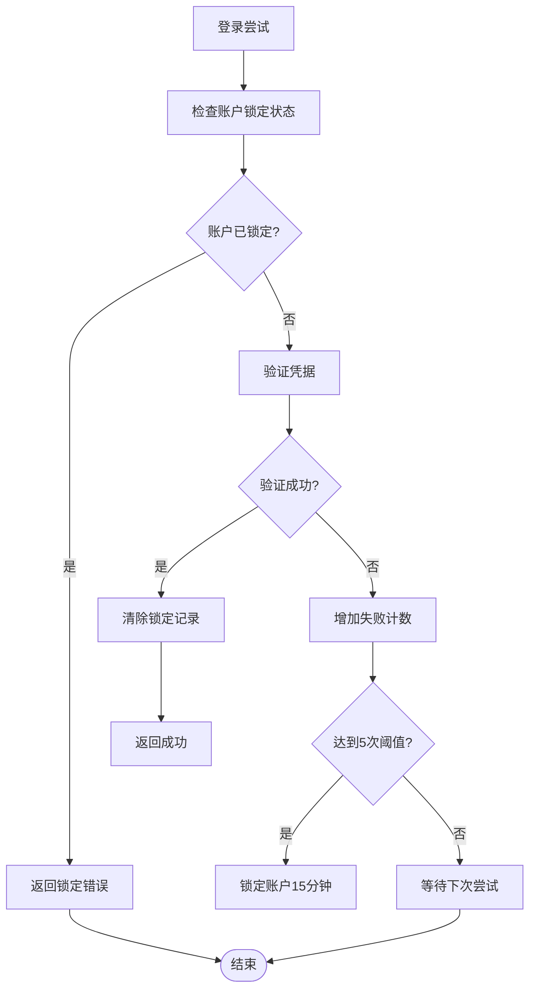
```mermaid
flowchart TD
Attempt["登录尝试"] --> CheckLock["检查账户锁定状态"]
CheckLock --> Locked{"账户已锁定?"}
Locked --> |是| ReturnLock["返回锁定错误"]
Locked --> |否| Verify["验证凭据"]
Verify --> Success{"验证成功?"}
Success --> |是| Unlock["清除锁定记录"]
Success --> |否| Increment["增加失败计数"]
Increment --> CheckThreshold{"达到5次阈值?"}
CheckThreshold --> |是| Lock["锁定账户15分钟"]
CheckThreshold --> |否| Wait["等待下次尝试"]
Unlock --> SuccessResponse["返回成功"]
ReturnLock --> End(["结束"])
Wait --> End
```

**图表来源**
- [backend_utils/security.py:48-86](file://backend_utils/security.py#L48-L86)

**章节来源**
- [backend_utils/security.py:48-86](file://backend_utils/security.py#L48-L86)

#### 审计日志系统
安全工具层提供了完整的审计日志功能，记录所有重要操作：

- **操作跟踪**：记录用户ID、IP地址、操作类型和状态
- **异常处理**：捕获异常并记录详细错误信息
- **状态区分**：区分SUCCESS、FAILED和ERROR状态
- **上下文信息**：包含用户身份和请求来源信息

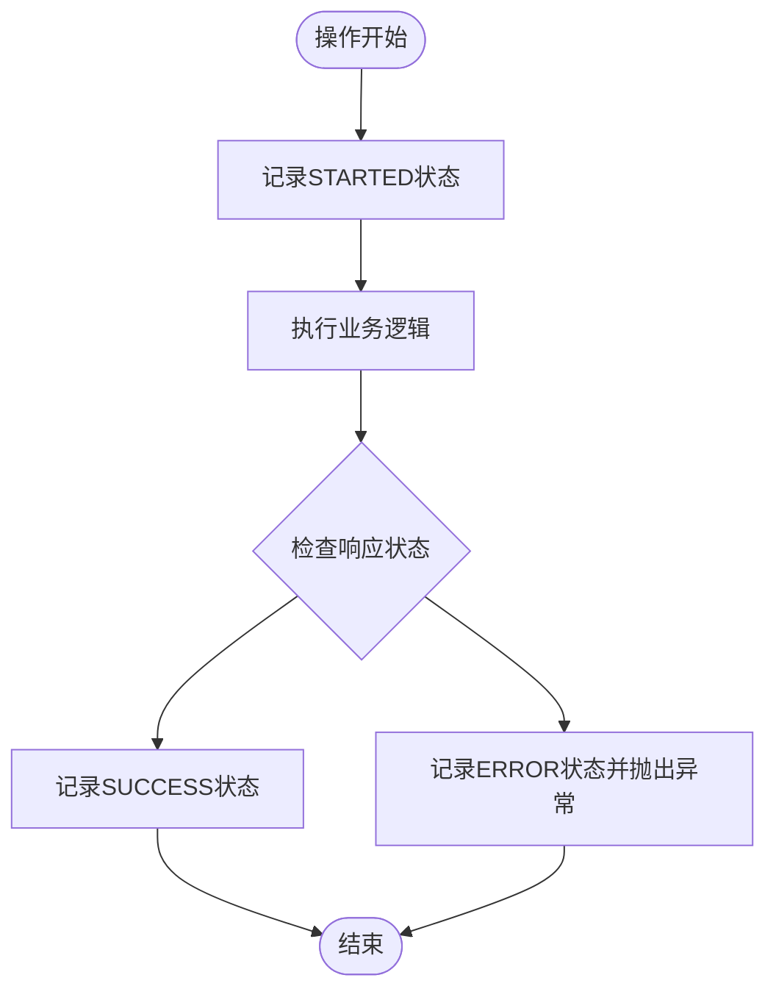
```mermaid
flowchart TD
Start(["操作开始"]) --> LogStart["记录STARTED状态"]
LogStart --> Execute["执行业务逻辑"]
Execute --> CheckResponse{"检查响应状态"}
CheckResponse --> Success["记录SUCCESS状态"]
CheckResponse --> Error["记录ERROR状态并抛出异常"]
Success --> End(["结束"])
Error --> End
```

**图表来源**
- [backend_utils/security.py:88-117](file://backend_utils/security.py#L88-L117)

**章节来源**
- [backend_utils/security.py:88-117](file://backend_utils/security.py#L88-L117)

### **新增**：改进的小程序登录服务

#### 智能回退机制
小程序登录服务实现了智能的回退机制，支持开发模式下的无缝切换：

- **优先后端API**：优先尝试调用本地/后端API登录，确保Token由后端生成
- **开发模式降级**：开发环境下使用特殊mock_code触发后端Dev Mode Support
- **云函数降级**：生产环境下回退到云函数登录
- **前端Mock降级**：最终降级到纯前端Mock数据用于UI调试

```mermaid
flowchart TD
Start(["微信登录请求"]) --> TryBackend["尝试后端API登录"]
TryBackend --> BackendSuccess{"后端登录成功?"}
BackendSuccess --> |是| Success["返回登录结果"]
BackendSuccess --> |否| CheckEnv["检查运行环境"]
CheckEnv --> IsDevelop{"开发环境?"}
IsDevelop --> |是| TryDevMock["尝试开发模式Mock登录"]
TryDevMock --> DevMockSuccess{"开发模式Mock成功?"}
DevMockSuccess --> |是| Success
DevMockSuccess --> |否| FrontendMock["使用前端Mock数据"]
FrontendMock --> Success
IsDevelop --> |否| TryCloud["尝试云函数登录"]
TryCloud --> CloudSuccess{"云函数登录成功?"}
CloudSuccess --> |是| Success
CloudSuccess --> |否| FrontendMock
```

**图表来源**
- [miniprogram/utils/loginService.js:12-33](file://miniprogram/utils/loginService.js#L12-L33)
- [miniprogram/utils/loginService.js:38-86](file://miniprogram/utils/loginService.js#L38-L86)
- [miniprogram/utils/loginService.js:88-115](file://miniprogram/utils/loginService.js#L88-L115)

**章节来源**
- [miniprogram/utils/loginService.js:12-33](file://miniprogram/utils/loginService.js#L12-L33)
- [miniprogram/utils/loginService.js:38-86](file://miniprogram/utils/loginService.js#L38-L86)
- [miniprogram/utils/loginService.js:88-115](file://miniprogram/utils/loginService.js#L88-L115)

#### 多种登录方式支持
小程序登录服务支持多种登录方式，满足不同场景需求：

- **微信登录**：支持标准微信授权登录和开发模式降级
- **QQ登录**：支持QQ授权登录，开发模式下可选择使用Mock数据
- **手机号登录**：支持手机号+验证码登录，开发模式下验证参数合法性
- **自动登录**：应用启动时自动验证和刷新token

**章节来源**
- [miniprogram/utils/loginService.js:196-234](file://miniprogram/utils/loginService.js#L196-L234)
- [miniprogram/utils/loginService.js:237-288](file://miniprogram/utils/loginService.js#L237-L288)
- [miniprogram/utils/loginService.js:526-556](file://miniprogram/utils/loginService.js#L526-L556)

### **新增**：增强的安全配置管理

#### 生产环境密钥管理
系统提供了完整的生产环境密钥管理机制：

- **强制密钥配置**：生产环境必须设置SECRET_KEY，否则启动时直接报错
- **安全密钥生成**：提供generate_keys.py脚本自动生成安全密钥
- **环境变量验证**：在应用启动时验证关键安全配置
- **配置示例**：提供.env.example文件作为配置模板

```mermaid
flowchart TD
Start(["应用启动"]) --> LoadConfig["加载配置"]
LoadConfig --> CheckEnv{"生产环境?"}
CheckEnv --> |是| CheckSecret["检查SECRET_KEY"]
CheckSecret --> SecretSet{"SECRET_KEY已设置?"}
SecretSet --> |否| RaiseError["抛出致命错误并停止启动"]
SecretSet --> |是| CheckOther["检查其他安全配置"]
CheckEnv --> |否| CheckOther
CheckOther --> Success["启动成功"]
RaiseError --> End(["结束"])
Success --> End
```

**图表来源**
- [config.py:103-115](file://config.py#L103-L115)
- [generate_keys.py:1-6](file://generate_keys.py#L1-L6)

**章节来源**
- [config.py:103-115](file://config.py#L103-L115)
- [generate_keys.py:1-6](file://generate_keys.py#L1-L6)
- [.env.example:13-17](file://.env.example#L13-L17)

## 依赖关系分析

```mermaid
graph LR
UI_Login["Login.tsx"] --> API["api.ts"]
UI_AuthGuard["AuthGuard.tsx"] --> API
UI_Layout["AdminLayout.tsx"] --> API
API --> Routes["routes/auth.py"]
Routes --> Security["backend_utils/security.py"]
Routes --> Svc["services/auth_service.py"]
Svc --> Model["models/user.py"]
Svc --> CustModel["models/customer.py"]
Svc --> CloudDB["services/cloud_db.js"]
Svc --> Captcha["services/captcha_service.py"]
Utils_Wechat["utils/auth.js"] --> Routes
Utils_Login["miniprogram/utils/loginService.js"] --> Routes
Backup_MW["backup_nodejs/middleware/auth.js"] --> Routes
Security --> Routes
```

**图表来源**
- [admin-ui/src/pages/Login.tsx:1-78](file://admin-ui/src/pages/Login.tsx#L1-L78)
- [admin-ui/src/utils/api.ts:1-125](file://admin-ui/src/utils/api.ts#L1-L125)
- [admin-ui/src/components/AuthGuard.tsx:1-20](file://admin-ui/src/components/AuthGuard.tsx#L1-L20)
- [admin-ui/src/components/AdminLayout.tsx:1-180](file://admin-ui/src/components/AdminLayout.tsx#L1-L180)
- [routes/auth.py:1-516](file://routes/auth.py#L1-L516)
- [backend_utils/security.py:1-117](file://backend_utils/security.py#L1-L117)
- [services/auth_service.py:1-581](file://services/auth_service.py#L1-L581)
- [models/user.py:1-309](file://models/user.py#L1-L309)
- [utils/auth.js:1-53](file://utils/auth.js#L1-L53)
- [miniprogram/utils/loginService.js:1-492](file://miniprogram/utils/loginService.js#L1-L492)
- [backup_nodejs/middleware/auth.js:1-85](file://backup_nodejs/middleware/auth.js#L1-L85)
- [services/cloud_db.js:1-327](file://services/cloud_db.js#L1-L327)
- [services/captcha_service.py:1-51](file://services/captcha_service.py#L1-L51)

**章节来源**
- [routes/auth.py:1-516](file://routes/auth.py#L1-L516)
- [backend_utils/security.py:1-117](file://backend_utils/security.py#L1-L117)
- [services/auth_service.py:1-581](file://services/auth_service.py#L1-L581)
- [models/user.py:1-309](file://models/user.py#L1-L309)
- [services/cloud_db.js:1-327](file://services/cloud_db.js#L1-L327)
- [services/captcha_service.py:1-51](file://services/captcha_service.py#L1-L51)
- [miniprogram/utils/loginService.js:1-492](file://miniprogram/utils/loginService.js#L1-L492)

## 性能考量
- JWT校验为O(1)，开销极低；建议避免在高频接口中重复解码
- 会话查询使用refresh_token_hash索引，建议在user_sessions集合建立相应索引
- 前端拦截器统一注入Authorization，减少重复代码与遗漏
- 刷新令牌轮换避免了长期有效的refresh_token滥用风险
- **新增**：PBKDF2哈希使用200,000次迭代，提供良好的安全性和合理的性能平衡
- **新增**：身份同步采用异步处理，避免阻塞主认证流程
- **新增**：异常处理机制提供性能监控和错误追踪能力
- **新增**：微信配置验证避免了无效的网络请求和错误处理开销
- **新增**：速率限制使用内存存储，性能开销最小化
- **新增**：审计日志采用异步记录，避免阻塞主业务流程
- **新增**：微信登录自动降级机制，通过智能检测减少不必要的网络请求
- **新增**：密码强度验证采用正则表达式匹配，性能开销可控
- **新增**：短信验证码服务支持异步发送，避免阻塞主认证流程
- **新增**：游客模式使用内存存储，避免数据库访问开销

## 故障排除指南
- 401未登录/过期
  - 检查前端localStorage.admin_token是否存在与格式
  - 检查后端require_auth是否正确解析Authorization头
  - 若为刷新失败，确认refresh_token类型与有效期，以及user_sessions中是否存在对应会话
- 403权限不足
  - 检查当前用户角色与目标路由require_roles要求
- 微信登录失败
  - 检查WX_APPID/WX_SECRET配置与网络连通性
  - 开发模式下mock code的使用场景与限制
  - 查看日志中的详细错误信息
- **新增**：微信配置问题
  - 检查WX_APPID/WX_SECRET是否为占位符
  - 确认开发模式下的降级逻辑是否正常工作
  - 查看配置验证的错误日志
- **新增**：微信登录自动降级问题
  - 检查NODE_ENV环境变量是否正确设置
  - 确认mock code的格式和使用场景
  - 验证SSL证书的有效性和网络连接状态
  - 查看降级机制的日志输出
- **新增**：异常处理问题
  - 检查日志中的详细错误信息
  - 确认异常处理机制是否正常工作
  - 查看是否有未捕获的异常
- **新增**：身份同步失败
  - 检查客户集合的连接状态
  - 确认用户数据格式的完整性
  - 查看同步过程中的错误日志
- **新增**：速率限制问题
  - 检查IP地址和端点的请求频率
  - 确认速率限制配置是否合理
  - 查看日志中的限流警告信息
- **新增**：账户锁定问题
  - 检查账户锁定状态和剩余锁定时间
  - 确认失败尝试次数是否达到阈值
  - 查看日志中的锁定记录
- **新增**：游客登录问题
  - 检查用户协议同意状态
  - 确认游客令牌生成是否成功
  - 验证游客角色权限限制
- **新增**：短信验证码问题
  - 检查手机号格式验证
  - 确认验证码发送服务可用性
  - 验证验证码类型参数
- **新增**：密码强度验证问题
  - 检查环境变量配置
  - 确认密码规则设置
  - 验证密码强度验证逻辑

**章节来源**
- [admin-ui/src/utils/api.ts:87-96](file://admin-ui/src/utils/api.ts#L87-L96)
- [routes/auth.py:44-49](file://routes/auth.py#L44-L49)
- [services/auth_service.py:171-199](file://services/auth_service.py#L171-L199)
- [utils/auth.js:254-331](file://utils/auth.js#L254-L331)
- [services/auth_service.py:54-76](file://services/auth_service.py#L54-L76)
- [services/auth_service.py:242-251](file://services/auth_service.py#L242-L251)
- [services/auth_service.py:27-31](file://services/auth_service.py#L27-L31)
- [backend_utils/security.py:36-38](file://backend_utils/security.py#L36-L38)
- [backend_utils/security.py:82-83](file://backend_utils/security.py#L82-L83)

## 结论
该认证系统通过前后端协同和安全工具层实现了完整的登录态管理与权限控制：前端负责用户体验与基础拦截，后端负责强校验与细粒度权限，安全工具层提供额外的防护能力。

**新增的安全工具层实现了企业级安全功能**：
- 完整的速率限制机制，防止暴力破解和DDoS攻击
- 智能账户锁定系统，连续5次失败锁定15分钟
- 详细的审计日志系统，记录所有重要操作
- 增强的异常处理和日志记录，提供详细的调试支持

**新增的微信登录自动降级机制提供了卓越的用户体验**：
- 多层次的自动降级策略，确保在网络异常时仍能登录
- 开发模式下的Dev Mode Support，支持mock code自动降级
- 智能的网络异常检测和处理机制
- 用户友好的降级提示和选择机制

**新增的改进登录服务提供了更好的用户体验**：
- 智能回退机制，支持开发模式下的无缝切换
- 多种登录方式支持，满足不同场景需求
- 增强的错误处理和用户提示
- 自动登录和token管理功能

**新增的增强安全配置管理提供了生产环境安全保障**：
- 强制密钥配置，防止生产环境使用默认密钥
- 安全密钥生成工具，提供一键生成安全密钥
- 完整的配置验证和错误处理
- 详细的配置示例和最佳实践指导

**新增的核心功能增强了系统功能完整性**：
- 双Token机制，支持Access/Refresh双重令牌管理
- 游客模式支持，提供临时访客登录功能
- 短信验证码服务，支持多种登录和验证场景
- 密码强度验证机制，支持可配置的密码规则
- 增强的会话管理功能，支持多设备会话管理

建议在多租户场景下扩展JWT载荷与模型层，以满足更复杂的租户隔离需求。

## 附录
- 环境变量参考
  - JWT_SECRET/JWT_ALGORITHM/JWT_EXPIRES_SECONDS：用于配置JWT密钥、算法与过期时间
  - ADMIN_USERNAME/ADMIN_PASSWORD/ADMIN_ROLE：默认管理员账户配置
  - WX_APPID/WX_SECRET：微信登录所需配置，支持占位符检测
  - NODE_ENV：开发环境模式，影响微信登录降级行为
  - SECRET_KEY：生产环境必须设置的安全密钥
  - PASSWORD_MIN_LENGTH：密码最小长度，默认8位
  - PASSWORD_REQUIRE_SPECIAL/PASSWORD_REQUIRE_NUMBER/PASSWORD_REQUIRE_UPPERCASE：密码强度要求开关
- 常用接口
  - POST /api/v1/auth/login：管理员登录
  - POST /api/v1/auth/login/email：邮箱登录，带速率限制和审计日志
  - POST /api/v1/auth/login/phone：手机登录，带速率限制和审计日志
  - POST /api/v1/auth/wechat/login：微信登录，支持开发模式降级和自动降级
  - POST /api/v1/auth/guest/login：游客登录，提供临时访客登录
  - POST /api/v1/auth/send-sms-code：发送短信验证码
  - POST /api/v1/auth/verify-sms-code：验证短信验证码
  - POST /api/v1/auth/token/refresh：刷新令牌
  - GET /api/v1/auth/me：获取当前用户信息
  - GET/POST /api/v1/auth/users：管理员用户列表与增改
  - POST /api/v1/auth/register：用户注册，带速率限制和审计日志
  - POST /api/v1/auth/password/forgot：忘记密码，带速率限制
  - POST /api/v1/auth/password/reset：重置密码，带速率限制和审计日志
  - GET /api/v1/auth/sessions：获取用户会话列表
  - DELETE /api/v1/auth/sessions/{session_id}：撤销指定会话
- **新增**：安全装饰器
  - @rate_limit(limit=5, window=60)：速率限制装饰器
  - @audit_log("ACTION_NAME")：审计日志装饰器
  - @require_roles("admin")：角色权限装饰器
- **新增**：微信登录降级机制
  - mock code支持：以"mock_"开头的code自动启用模拟登录
  - 开发模式降级：开发环境下自动触发Dev Mode Support
  - 网络异常降级：SSL证书问题或网络失败时自动降级
  - 用户提示降级：提供模态框让用户选择是否使用模拟数据
- **新增**：游客模式接口
  - POST /auth/guest/login：游客登录接口
  - 游客角色：guest，功能受限
  - 临时令牌：短期有效，便于系统识别
- **新增**：短信验证码接口
  - POST /auth/send-sms-code：发送短信验证码
  - POST /auth/verify-sms-code：验证短信验证码
  - 支持场景：login、register、reset_password、bind
  - 开发模式：直接返回验证码用于测试
- **新增**：密码强度验证配置
  - PASSWORD_MIN_LENGTH：最小密码长度
  - PASSWORD_REQUIRE_SPECIAL：是否要求特殊字符
  - PASSWORD_REQUIRE_NUMBER：是否要求数字
  - PASSWORD_REQUIRE_UPPERCASE：是否要求大写字母
- **新增**：会话管理接口
  - GET /auth/sessions：查看当前用户的所有活跃会话
  - DELETE /auth/sessions/{session_id}：撤销指定会话
  - 支持多设备会话管理
  - 提供会话列表和撤销功能
- **新增**：双Token机制接口
  - POST /auth/token/refresh：刷新Access Token
  - 支持Refresh Token轮换和会话撤销
  - 提供无感续期和安全令牌管理

**章节来源**
- [services/auth_service.py:16-25](file://services/auth_service.py#L16-L25)
- [routes/auth.py:74-96](file://routes/auth.py#L74-L96)
- [routes/auth.py:244-256](file://routes/auth.py#L244-L256)
- [routes/auth.py:98-128](file://routes/auth.py#L98-L128)
- [routes/auth.py:148-171](file://routes/auth.py#L148-L171)
- [routes/auth.py:195-352](file://routes/auth.py#L195-L352)
- [routes/auth.py:452-476](file://routes/auth.py#L452-L476)
- [routes/auth.py:270-324](file://routes/auth.py#L270-L324)
- [backend_utils/security.py:18-117](file://backend_utils/security.py#L18-L117)
- [config.py:103-115](file://config.py#L103-L115)
- [.env:8-11](file://.env#L8-L11)
- [.env.example:13-17](file://.env.example#L13-L17)