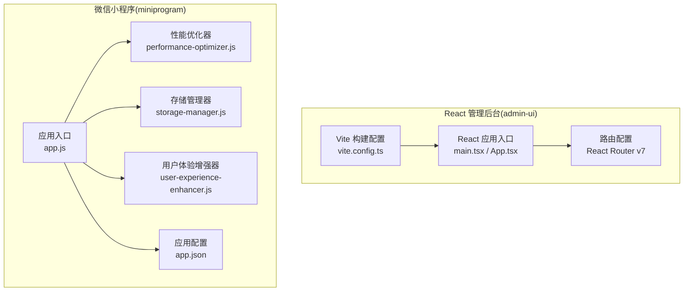
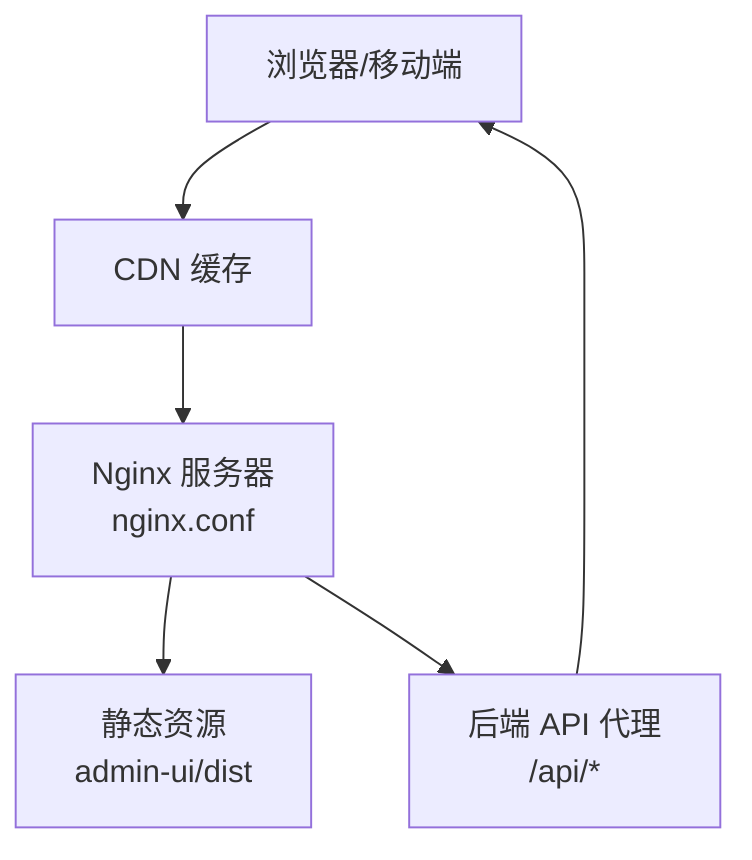
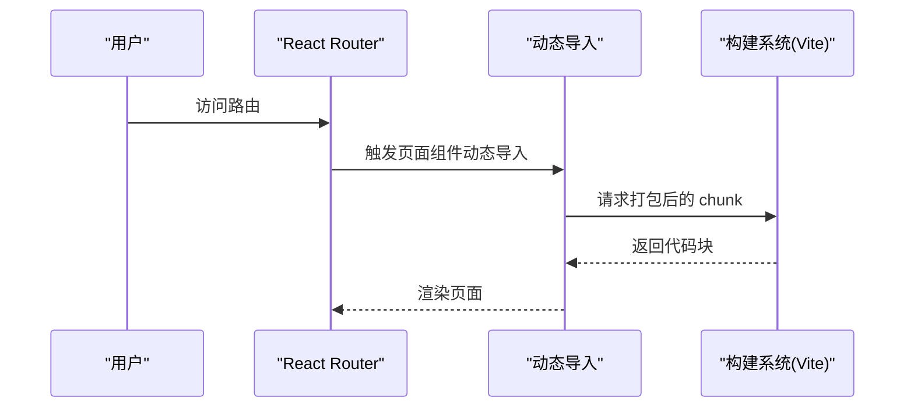
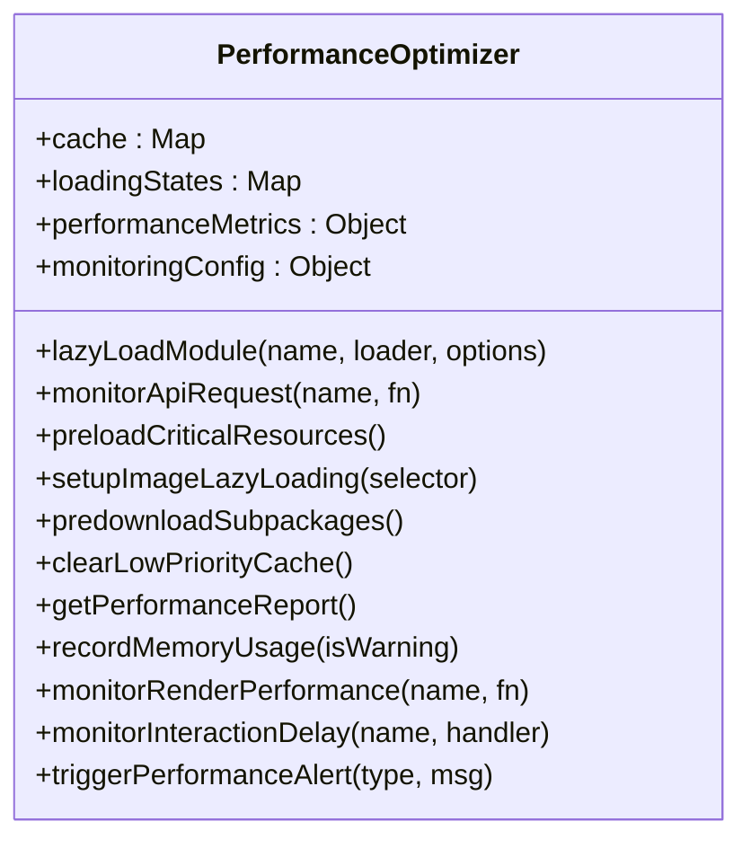
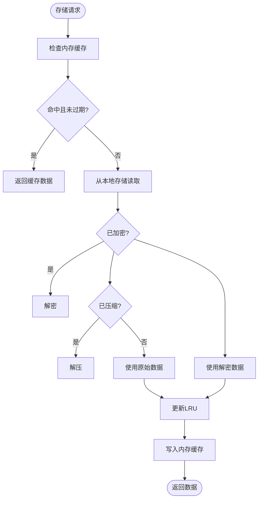
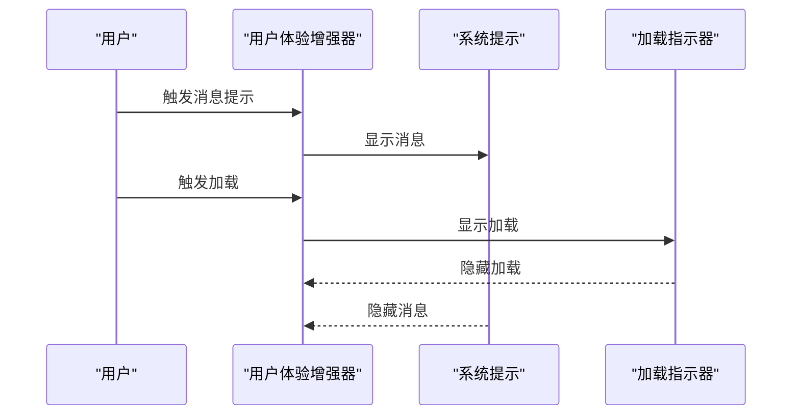
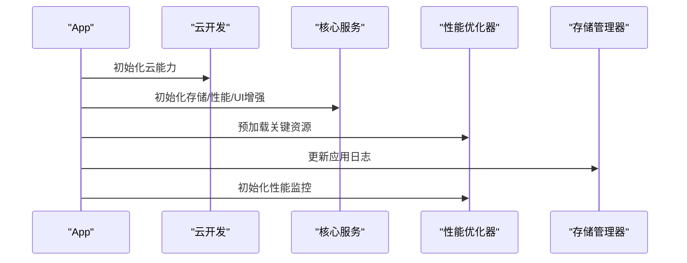
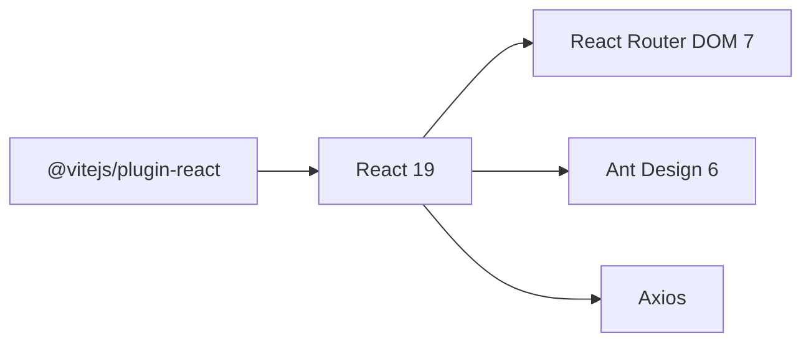

# 前端性能优化

<cite>
**本文引用的文件**
- [vite.config.ts](file://admin-ui/vite.config.ts)
- [package.json](file://admin-ui/package.json)
- [App.tsx](file://admin-ui/src/App.tsx)
- [main.tsx](file://admin-ui/src/main.tsx)
- [app.js](file://miniprogram/app.js)
- [app.json](file://miniprogram/app.json)
- [performance-optimizer.js](file://miniprogram/utils/performance-optimizer.js)
- [storage-manager.js](file://miniprogram/utils/storage-manager.js)
- [user-experience-enhancer.js](file://miniprogram/utils/user-experience-enhancer.js)
- [nginx.conf](file://deploy/nginx.conf)
</cite>

## 目录
1. [简介](#简介)
2. [项目结构](#项目结构)
3. [核心组件](#核心组件)
4. [架构总览](#架构总览)
5. [详细组件分析](#详细组件分析)
6. [依赖关系分析](#依赖关系分析)
7. [性能考量](#性能考量)
8. [故障排查指南](#故障排查指南)
9. [结论](#结论)
10. [附录](#附录)

## 简介
本文件面向 React 管理后台与微信小程序双端的前端性能优化，系统性梳理代码分割与懒加载、渲染优化、包体积控制、启动速度优化、资源压缩与缓存策略、CDN 配置、组件性能监控、内存管理与垃圾回收优化、首屏加载优化、路由懒加载以及图片资源优化方案，并提供性能测试工具使用、性能指标监控与优化效果评估方法。

## 项目结构
项目采用多端分离架构：
- React 管理后台位于 admin-ui，基于 Vite 构建，使用 React Router v7 进行路由管理。
- 微信小程序位于 miniprogram，采用原生小程序框架，内置性能优化器、存储管理器与用户体验增强器。

**图表来源**
- [vite.config.ts](file://admin-ui/vite.config.ts#L1-L78)
- [main.tsx](file://admin-ui/src/main.tsx#L1-L14)
- [App.tsx](file://admin-ui/src/App.tsx#L1-L57)
- [app.js](file://miniprogram/app.js#L1-L225)
- [app.json](file://miniprogram/app.json#L1-L78)

**章节来源**
- [vite.config.ts](file://admin-ui/vite.config.ts#L1-L78)
- [package.json](file://admin-ui/package.json#L1-L38)
- [App.tsx](file://admin-ui/src/App.tsx#L1-L57)
- [main.tsx](file://admin-ui/src/main.tsx#L1-L14)
- [app.js](file://miniprogram/app.js#L1-L225)
- [app.json](file://miniprogram/app.json#L1-L78)

## 核心组件
- React 管理后台
  - 构建与代理：Vite 配置包含开发代理、插件与基础路径设置，便于联调后端。
  - 路由：使用 React Router v7 的路由声明式配置，支持嵌套路由与守卫。
- 小程序
  - 性能优化器：提供懒加载、模块缓存、API 性能监控、图片懒加载、分包预下载、缓存清理与性能报告。
  - 存储管理器：提供智能缓存、压缩、加密、LRU 淘汰、批量操作、同步队列与统计。
  - 用户体验增强器：提供动画、消息提示、加载指示器、确认对话框等交互增强。

**章节来源**
- [vite.config.ts](file://admin-ui/vite.config.ts#L1-L78)
- [package.json](file://admin-ui/package.json#L1-L38)
- [App.tsx](file://admin-ui/src/App.tsx#L1-L57)
- [main.tsx](file://admin-ui/src/main.tsx#L1-L14)
- [performance-optimizer.js](file://miniprogram/utils/performance-optimizer.js#L1-L817)
- [storage-manager.js](file://miniprogram/utils/storage-manager.js#L1-L776)
- [user-experience-enhancer.js](file://miniprogram/utils/user-experience-enhancer.js#L1-L452)

## 架构总览
React 管理后台通过 Vite 构建，生产环境由 Nginx 提供静态资源服务与反向代理；小程序端通过 App 生命周期初始化核心服务，结合性能优化器与存储管理器提升启动与运行性能。

**图表来源**
- [nginx.conf](file://deploy/nginx.conf#L1-L61)

**章节来源**
- [nginx.conf](file://deploy/nginx.conf#L1-L61)

## 详细组件分析

### React 应用与路由性能优化
- 代码分割与懒加载
  - 使用 React Router v7 的路由声明式配置，可结合动态导入实现按需加载页面组件，减少首屏包体。
  - 建议对非首屏路由与重型页面组件采用动态导入，配合 Suspense 与骨架屏提升体验。
- 首屏加载优化
  - 通过 Vite 配置 base 与资源路径，确保构建产物部署在根路径或正确子路径。
  - 控制第三方依赖体积，启用 Tree Shaking，拆分 vendor 包。
- 资源压缩与缓存
  - 生产构建默认启用压缩；可在 Nginx 层设置静态资源缓存与压缩策略，提升二次访问性能。

**图表来源**
- [App.tsx](file://admin-ui/src/App.tsx#L1-L57)
- [vite.config.ts](file://admin-ui/vite.config.ts#L1-L78)

**章节来源**
- [App.tsx](file://admin-ui/src/App.tsx#L1-L57)
- [vite.config.ts](file://admin-ui/vite.config.ts#L1-L78)
- [package.json](file://admin-ui/package.json#L1-L38)

### 小程序性能优化器
- 懒加载与模块缓存
  - 支持带 TTL 的模块缓存、并发加载去重、命中率统计与性能指标记录。
- API 性能监控
  - 记录响应时间、估算网络速度、触发性能告警。
- 图片懒加载与分包预下载
  - 基于 IntersectionObserver 的图片懒加载；支持分包预下载以降低首屏等待。
- 缓存管理与内存监控
  - 定期记录内存使用、清理低优先级缓存、网络断开时清理 API 缓存。
- 性能报告与告警
  - 生成综合性能报告，包含页面加载、渲染、交互、缓存与网络指标，并给出优化建议。

**图表来源**
- [performance-optimizer.js](file://miniprogram/utils/performance-optimizer.js#L1-L817)

**章节来源**
- [performance-optimizer.js](file://miniprogram/utils/performance-optimizer.js#L1-L817)

### 小程序存储管理器
- 智能缓存与压缩
  - 支持压缩阈值、压缩/解压、加密/解密、TTL 与 LRU 淘汰。
- 批量操作与同步队列
  - 支持批量 set/get/remove/clear，异步同步队列与重试机制。
- 统计与可观测性
  - 记录命中/未命中/错误数、缓存详情、存储信息与命中率。

**图表来源**
- [storage-manager.js](file://miniprogram/utils/storage-manager.js#L1-L776)

**章节来源**
- [storage-manager.js](file://miniprogram/utils/storage-manager.js#L1-L776)

### 小程序用户体验增强器
- 动画与反馈
  - 预设动画、关键帧动画、触觉与语音反馈（预留）、消息提示与加载指示器。
- 交互增强
  - 确认对话框与动作菜单，统一交互体验。

**图表来源**
- [user-experience-enhancer.js](file://miniprogram/utils/user-experience-enhancer.js#L1-L452)

**章节来源**
- [user-experience-enhancer.js](file://miniprogram/utils/user-experience-enhancer.js#L1-L452)

### 小程序应用生命周期与启动优化
- App 初始化
  - 云开发初始化、核心服务初始化、预加载关键资源、自动登录检查、性能监控初始化。
- 内存与性能监控
  - 监听内存警告、定期生成性能报告、记录页面导航与网络状态变化。
- 数据同步与清理
  - 应用隐藏时同步数据，显示时检查更新；定期清理过期缓存。

**图表来源**
- [app.js](file://miniprogram/app.js#L1-L225)

**章节来源**
- [app.js](file://miniprogram/app.js#L1-L225)

## 依赖关系分析
- React 管理后台
  - 依赖 React 19、React Router DOM 7、Ant Design 6、Axios 等；Vite 插件体系支撑开发与构建。
- 小程序
  - 性能优化器、存储管理器与用户体验增强器作为全局单例被 App 使用，形成清晰的职责边界。

**图表来源**
- [package.json](file://admin-ui/package.json#L1-L38)

**章节来源**
- [package.json](file://admin-ui/package.json#L1-L38)

## 性能考量
- 代码分割与懒加载
  - 对非关键路由与重型组件采用动态导入；结合 Suspense 与骨架屏，改善感知性能。
- 包体积控制
  - 合理拆分 vendor 与业务包，启用 Tree Shaking；对第三方库按需引入。
- 启动速度优化
  - 小程序端通过预加载关键资源与分包预下载缩短首屏等待；React 端减少首屏依赖与内联关键 CSS/JS。
- 资源压缩与缓存
  - 生产构建启用压缩；Nginx 设置静态资源缓存与压缩；合理设置 Cache-Control 与 ETag。
- CDN 配置
  - 将静态资源托管至 CDN，利用边缘节点加速；结合 HTTPS 与安全策略。
- 组件性能监控
  - 小程序端记录页面加载、渲染、交互与缓存命中率；React 端可接入性能 API 与埋点。
- 内存管理与垃圾回收
  - 小程序端监听内存警告并清理低优先级缓存；React 端避免内存泄漏，及时清理事件与定时器。
- 图片资源优化
  - 使用懒加载与合适的尺寸/格式；小程序端结合分包与预加载策略。

[本节为通用指导，无需列出具体文件来源]

## 故障排查指南
- React 开发代理问题
  - 若代理失败，检查代理目标与端口配置，确认后端服务可用。
- 小程序性能告警
  - 查看性能报告中的页面加载、API 响应、渲染与缓存命中率，定位瓶颈。
- 存储异常
  - 检查存储统计与缓存详情，确认压缩/加密流程与 LRU 淘汰是否正常。
- Nginx 配置问题
  - 确认静态资源根目录、路由回退与 API 反向代理配置正确，检查日志定位错误。

**章节来源**
- [vite.config.ts](file://admin-ui/vite.config.ts#L1-L78)
- [performance-optimizer.js](file://miniprogram/utils/performance-optimizer.js#L1-L817)
- [storage-manager.js](file://miniprogram/utils/storage-manager.js#L1-L776)
- [nginx.conf](file://deploy/nginx.conf#L1-L61)

## 结论
本项目在 React 管理后台与微信小程序两端均实现了系统性的性能优化方案：前端侧通过代码分割、懒加载、资源压缩与缓存策略提升加载与运行效率；小程序侧通过性能优化器、存储管理器与用户体验增强器实现启动优化、内存管理与交互增强。建议持续监控性能指标，迭代优化关键路径，结合 CDN 与缓存策略进一步提升全球用户的访问体验。

## 附录
- 性能测试工具
  - React：使用浏览器开发者工具的 Performance/Network 面板与 Lighthouse。
  - 小程序：使用微信开发者工具的性能面板与真机调试。
- 性能指标监控
  - 页面加载时间、首屏渲染时间、API 响应时间、缓存命中率、内存使用峰值、交互延迟。
- 优化效果评估
  - 对比优化前后的指标变化，关注用户体验关键指标（如 Core Web Vitals）与业务指标（如转化率）。

[本节为通用指导，无需列出具体文件来源]