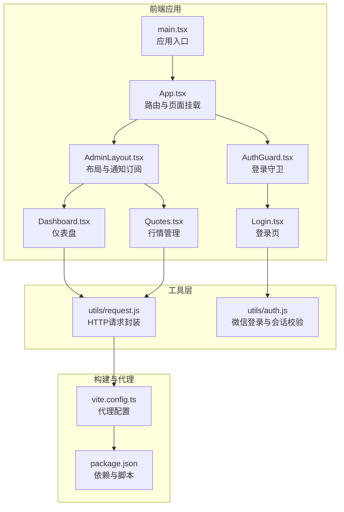
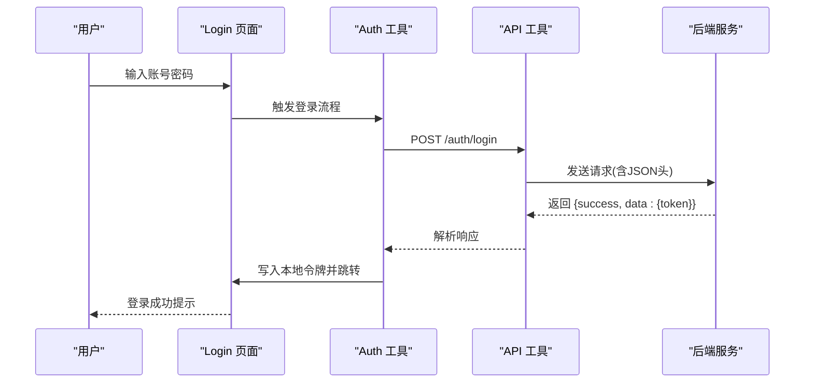
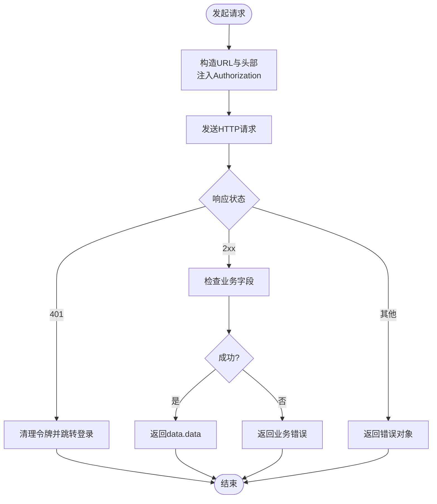
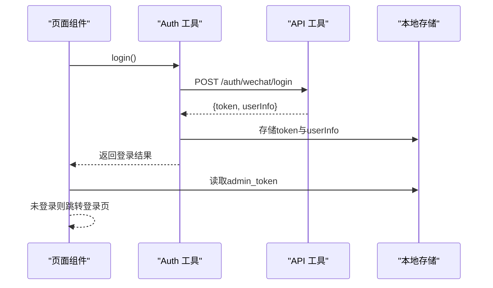
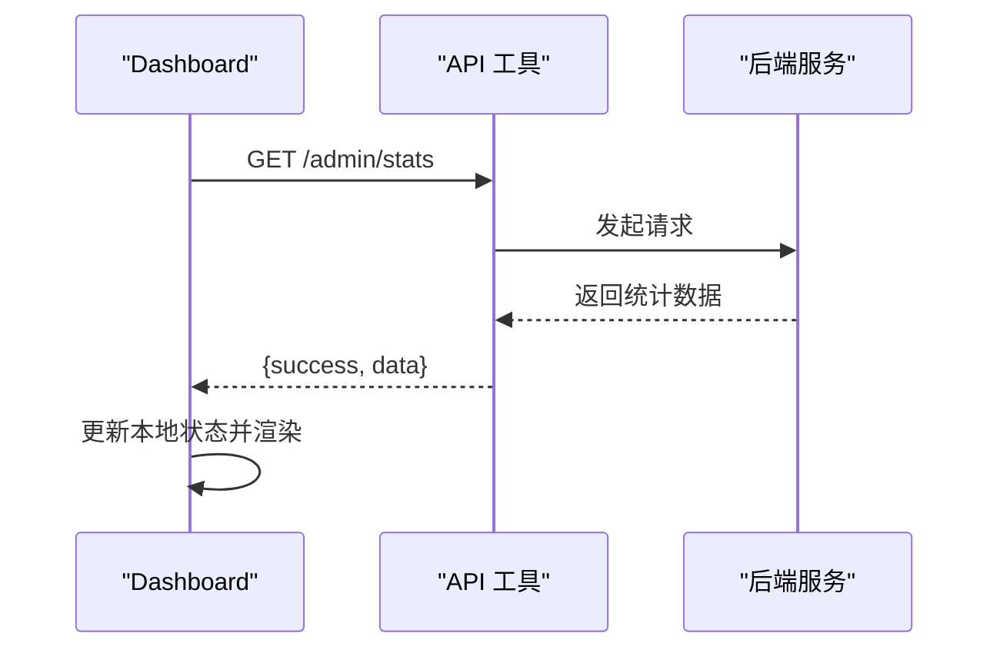
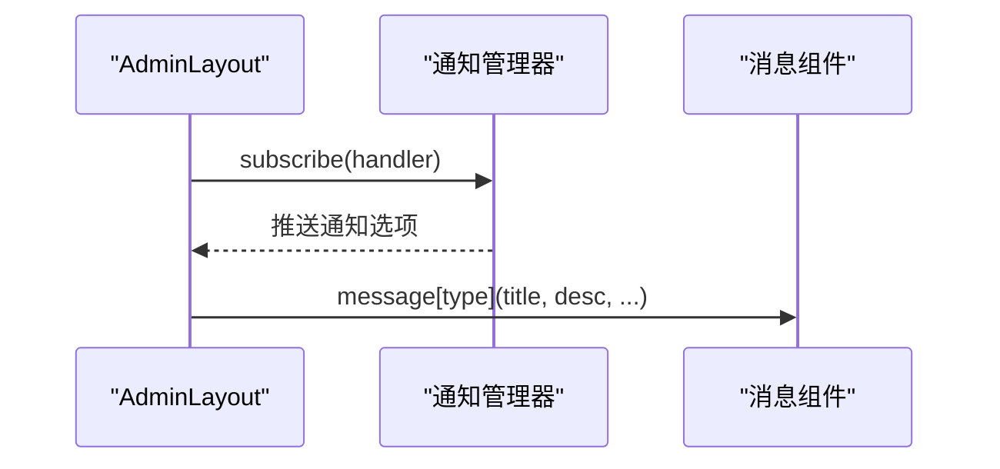
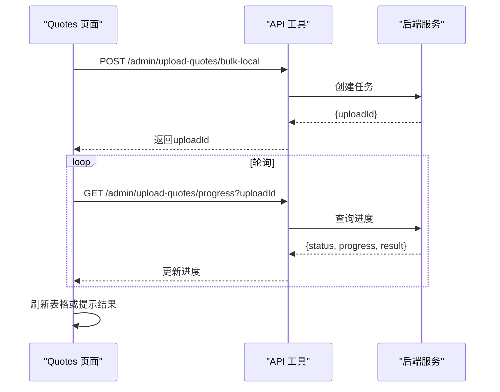
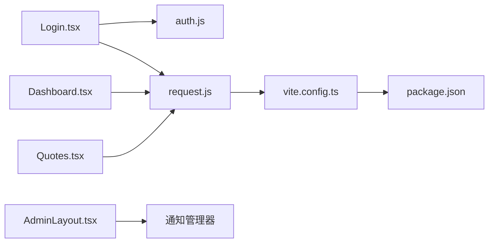

# 前端数据流设计

<cite>
**本文引用的文件**
- [admin-ui/src/main.tsx](file://admin-ui/src/main.tsx)
- [admin-ui/src/App.tsx](file://admin-ui/src/App.tsx)
- [admin-ui/src/components/AdminLayout.tsx](file://admin-ui/src/components/AdminLayout.tsx)
- [admin-ui/src/components/AuthGuard.tsx](file://admin-ui/src/components/AuthGuard.tsx)
- [admin-ui/src/pages/Login.tsx](file://admin-ui/src/pages/Login.tsx)
- [admin-ui/src/pages/Dashboard.tsx](file://admin-ui/src/pages/Dashboard.tsx)
- [admin-ui/src/pages/Quotes.tsx](file://admin-ui/src/pages/Quotes.tsx)
- [admin-ui/package.json](file://admin-ui/package.json)
- [admin-ui/vite.config.ts](file://admin-ui/vite.config.ts)
- [utils/request.js](file://utils/request.js)
- [utils/auth.js](file://utils/auth.js)
</cite>

## 目录
1. [引言](#引言)
2. [项目结构](#项目结构)
3. [核心组件](#核心组件)
4. [架构总览](#架构总览)
5. [详细组件分析](#详细组件分析)
6. [依赖关系分析](#依赖关系分析)
7. [性能考量](#性能考量)
8. [故障排查指南](#故障排查指南)
9. [结论](#结论)
10. [附录](#附录)

## 引言
本文件面向前端数据流设计，系统性阐述该系统的前后端数据交互模式、API 请求封装与响应处理机制；总结前端状态管理策略、数据缓存与本地存储方案；文档化错误处理流程、通知系统与用户反馈机制；解释数据验证规则、格式转换与数据同步策略；给出 API 接口设计规范、请求拦截器配置与响应处理模式；并提供数据安全、性能优化与用户体验提升方案。

## 项目结构
本项目采用 React + Vite 的前台工程，结合后端 Flask 提供 REST API。前端通过 Vite 的代理能力访问后端接口，页面组件负责数据拉取、状态管理与用户交互，工具层封装统一的请求与鉴权逻辑。

图表来源
- [admin-ui/src/main.tsx](file://admin-ui/src/main.tsx#L1-L14)
- [admin-ui/src/App.tsx](file://admin-ui/src/App.tsx#L1-L57)
- [admin-ui/src/components/AdminLayout.tsx](file://admin-ui/src/components/AdminLayout.tsx#L1-L180)
- [admin-ui/src/components/AuthGuard.tsx](file://admin-ui/src/components/AuthGuard.tsx#L1-L20)
- [admin-ui/src/pages/Login.tsx](file://admin-ui/src/pages/Login.tsx#L1-L78)
- [admin-ui/src/pages/Dashboard.tsx](file://admin-ui/src/pages/Dashboard.tsx#L1-L134)
- [admin-ui/src/pages/Quotes.tsx](file://admin-ui/src/pages/Quotes.tsx#L1-L907)
- [admin-ui/vite.config.ts](file://admin-ui/vite.config.ts#L1-L78)
- [admin-ui/package.json](file://admin-ui/package.json#L1-L38)
- [utils/request.js](file://utils/request.js#L1-L70)
- [utils/auth.js](file://utils/auth.js#L1-L53)

章节来源
- [admin-ui/src/main.tsx](file://admin-ui/src/main.tsx#L1-L14)
- [admin-ui/src/App.tsx](file://admin-ui/src/App.tsx#L1-L57)
- [admin-ui/vite.config.ts](file://admin-ui/vite.config.ts#L1-L78)
- [admin-ui/package.json](file://admin-ui/package.json#L1-L38)

## 核心组件
- 应用入口与根组件：负责渲染 Ant Design 包裹的根应用，并挂载路由。
- 路由与页面：集中定义后台管理各页面路由与懒加载布局。
- 布局与守卫：提供侧边菜单、头部区域与登录态守卫。
- 页面组件：如登录、仪表盘、行情管理等，承担数据获取、状态管理与交互。
- 工具层：统一请求封装与鉴权逻辑，支持代理、错误处理与权限头注入。

章节来源
- [admin-ui/src/main.tsx](file://admin-ui/src/main.tsx#L1-L14)
- [admin-ui/src/App.tsx](file://admin-ui/src/App.tsx#L1-L57)
- [admin-ui/src/components/AdminLayout.tsx](file://admin-ui/src/components/AdminLayout.tsx#L1-L180)
- [admin-ui/src/components/AuthGuard.tsx](file://admin-ui/src/components/AuthGuard.tsx#L1-L20)
- [admin-ui/src/pages/Login.tsx](file://admin-ui/src/pages/Login.tsx#L1-L78)
- [admin-ui/src/pages/Dashboard.tsx](file://admin-ui/src/pages/Dashboard.tsx#L1-L134)
- [admin-ui/src/pages/Quotes.tsx](file://admin-ui/src/pages/Quotes.tsx#L1-L907)
- [utils/request.js](file://utils/request.js#L1-L70)
- [utils/auth.js](file://utils/auth.js#L1-L53)

## 架构总览
前端采用“页面组件 + 工具层 + 构建代理”的分层架构。页面组件通过统一的 API 工具发起请求，Vite 在开发时通过代理将 /api 前缀转发到后端服务，生产环境则由部署层统一反向代理。鉴权采用本地存储令牌与路由守卫相结合的方式。

图表来源
- [admin-ui/src/pages/Login.tsx](file://admin-ui/src/pages/Login.tsx#L28-L47)
- [utils/auth.js](file://utils/auth.js#L1-L53)
- [utils/request.js](file://utils/request.js#L1-L70)

章节来源
- [admin-ui/src/pages/Login.tsx](file://admin-ui/src/pages/Login.tsx#L1-L78)
- [utils/auth.js](file://utils/auth.js#L1-L53)
- [utils/request.js](file://utils/request.js#L1-L70)

## 详细组件分析

### 统一请求封装与响应处理
- 请求封装：提供通用 request 方法，支持 GET/POST/PUT/DELETE，自动注入 Authorization 头（若存在令牌），对状态码与业务字段进行判断。
- 错误处理：区分网络错误、HTTP 状态异常与业务失败；对 401 进行登出清理并跳转登录页。
- 导出方法：get/post/put/del 及 BASE_URL，便于页面组件直接调用。

图表来源
- [utils/request.js](file://utils/request.js#L6-L42)

章节来源
- [utils/request.js](file://utils/request.js#L1-L70)

### 登录与会话管理
- 登录流程：通过微信登录换取后端令牌，成功后写入本地存储并设置用户信息。
- 会话校验：检查本地存储令牌是否存在，作为页面守卫依据。
- 守卫逻辑：未登录重定向至登录页，已登录放行。

图表来源
- [utils/auth.js](file://utils/auth.js#L3-L33)
- [admin-ui/src/components/AuthGuard.tsx](file://admin-ui/src/components/AuthGuard.tsx#L8-L17)

章节来源
- [utils/auth.js](file://utils/auth.js#L1-L53)
- [admin-ui/src/components/AuthGuard.tsx](file://admin-ui/src/components/AuthGuard.tsx#L1-L20)

### 页面数据流与状态管理
- 仪表盘：组件挂载后定时拉取统计数据，错误通过消息提示，成功更新本地状态。
- 行情管理：分页加载、批量导入预览与入库、全量/快速同步、删除任务轮询、同步历史查询等复杂流程均通过统一 API 工具实现。

图表来源
- [admin-ui/src/pages/Dashboard.tsx](file://admin-ui/src/pages/Dashboard.tsx#L29-L46)

章节来源
- [admin-ui/src/pages/Dashboard.tsx](file://admin-ui/src/pages/Dashboard.tsx#L1-L134)

### 通知系统与用户反馈
- 通知订阅：布局组件订阅通知管理器，按类型弹出消息提示。
- 用户反馈：页面组件在请求成功/失败时通过消息组件展示反馈；模态框用于二次确认与进度展示。

图表来源
- [admin-ui/src/components/AdminLayout.tsx](file://admin-ui/src/components/AdminLayout.tsx#L28-L40)

章节来源
- [admin-ui/src/components/AdminLayout.tsx](file://admin-ui/src/components/AdminLayout.tsx#L1-L180)

### 数据同步策略与轮询
- 批量导入：先启动任务获取 uploadId，再轮询进度直至完成或失败，最后根据结果决定是否刷新表格。
- 删除任务：支持任务型删除，轮询进度并乐观更新本地状态。
- 全量同步：启动任务后轮询状态，完成后刷新数据。
- 快速同步：支持取消信号，避免重复请求。

图表来源
- [admin-ui/src/pages/Quotes.tsx](file://admin-ui/src/pages/Quotes.tsx#L267-L320)
- [admin-ui/src/pages/Quotes.tsx](file://admin-ui/src/pages/Quotes.tsx#L282-L313)

章节来源
- [admin-ui/src/pages/Quotes.tsx](file://admin-ui/src/pages/Quotes.tsx#L1-L907)

### API 接口设计规范与请求拦截器
- 接口规范：统一以 /api 前缀访问（开发时由 Vite 代理），请求体为 JSON，响应体包含 success、code、message、data 字段。
- 请求拦截：在请求层注入 Authorization 头，自动处理 401 清理与跳转。
- 响应处理：页面组件仅处理业务字段，统一错误提示与降级。

章节来源
- [utils/request.js](file://utils/request.js#L4-L42)
- [admin-ui/vite.config.ts](file://admin-ui/vite.config.ts#L21-L59)

## 依赖关系分析
- 页面组件依赖 API 工具与 Ant Design 组件库。
- 布局组件依赖通知管理器与主题 Token。
- 登录组件依赖表单校验与消息提示。
- 构建层通过 Vite 插件与代理配置连接前端与后端。

图表来源
- [admin-ui/src/pages/Login.tsx](file://admin-ui/src/pages/Login.tsx#L1-L78)
- [admin-ui/src/pages/Dashboard.tsx](file://admin-ui/src/pages/Dashboard.tsx#L1-L134)
- [admin-ui/src/pages/Quotes.tsx](file://admin-ui/src/pages/Quotes.tsx#L1-L907)
- [admin-ui/src/components/AdminLayout.tsx](file://admin-ui/src/components/AdminLayout.tsx#L1-L180)
- [utils/auth.js](file://utils/auth.js#L1-L53)
- [utils/request.js](file://utils/request.js#L1-L70)
- [admin-ui/vite.config.ts](file://admin-ui/vite.config.ts#L1-L78)
- [admin-ui/package.json](file://admin-ui/package.json#L1-L38)

章节来源
- [admin-ui/src/pages/Login.tsx](file://admin-ui/src/pages/Login.tsx#L1-L78)
- [admin-ui/src/pages/Dashboard.tsx](file://admin-ui/src/pages/Dashboard.tsx#L1-L134)
- [admin-ui/src/pages/Quotes.tsx](file://admin-ui/src/pages/Quotes.tsx#L1-L907)
- [admin-ui/src/components/AdminLayout.tsx](file://admin-ui/src/components/AdminLayout.tsx#L1-L180)
- [utils/auth.js](file://utils/auth.js#L1-L53)
- [utils/request.js](file://utils/request.js#L1-L70)
- [admin-ui/vite.config.ts](file://admin-ui/vite.config.ts#L1-L78)
- [admin-ui/package.json](file://admin-ui/package.json#L1-L38)

## 性能考量
- 请求并发控制：对高频操作（如轮询）采用节流与去抖，避免重复请求。
- 本地状态与乐观更新：在删除任务等场景先更新本地状态，降低感知延迟。
- 分页与虚拟滚动：表格组件启用横向与纵向滚动，减少 DOM 重排。
- 代理超时与错误兜底：Vite 代理配置设置较长超时与错误响应，保障开发体验。
- 资源去重：构建时去重 React 与 React DOM，减少包体积。

章节来源
- [admin-ui/src/pages/Quotes.tsx](file://admin-ui/src/pages/Quotes.tsx#L322-L456)
- [admin-ui/src/pages/Quotes.tsx](file://admin-ui/src/pages/Quotes.tsx#L491-L534)
- [admin-ui/vite.config.ts](file://admin-ui/vite.config.ts#L21-L59)
- [admin-ui/package.json](file://admin-ui/package.json#L63-L67)

## 故障排查指南
- 登录失败：检查后端登录接口返回结构与令牌写入逻辑；确认本地存储键名一致。
- 401 未授权：检查请求头 Authorization 是否正确注入；确认令牌是否过期或被清理。
- 代理不通：确认 Vite 代理目标与端口配置；查看代理错误回调输出的具体原因。
- 轮询无响应：检查任务 ID 与轮询间隔；确保后端任务状态接口可用。
- 表格无数据：检查分页参数与后端分页返回结构；确认本地 rowKey 生成策略。

章节来源
- [utils/request.js](file://utils/request.js#L34-L55)
- [admin-ui/vite.config.ts](file://admin-ui/vite.config.ts#L26-L58)
- [admin-ui/src/pages/Quotes.tsx](file://admin-ui/src/pages/Quotes.tsx#L282-L313)
- [admin-ui/src/pages/Quotes.tsx](file://admin-ui/src/pages/Quotes.tsx#L364-L432)

## 结论
该前端数据流设计以“页面组件 + 工具层 + 构建代理”为核心，通过统一的请求封装与鉴权机制，实现了清晰的数据交互与状态管理。配合通知系统与用户反馈机制，提升了可维护性与用户体验。后续可在鉴权粒度、缓存策略与埋点上报方面进一步增强。

## 附录
- 数据模型与字段约定：遵循后端返回的统一结构（success/code/message/data），页面组件仅消费 data 字段。
- 本地存储策略：登录令牌与用户信息分别存储于本地存储与临时内存，避免敏感信息泄露。
- 安全建议：生产环境务必启用 HTTPS、CORS 白名单与接口限流；对敏感操作增加二次确认与审计日志。