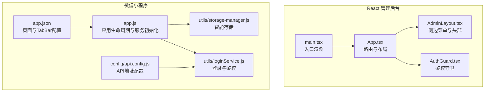
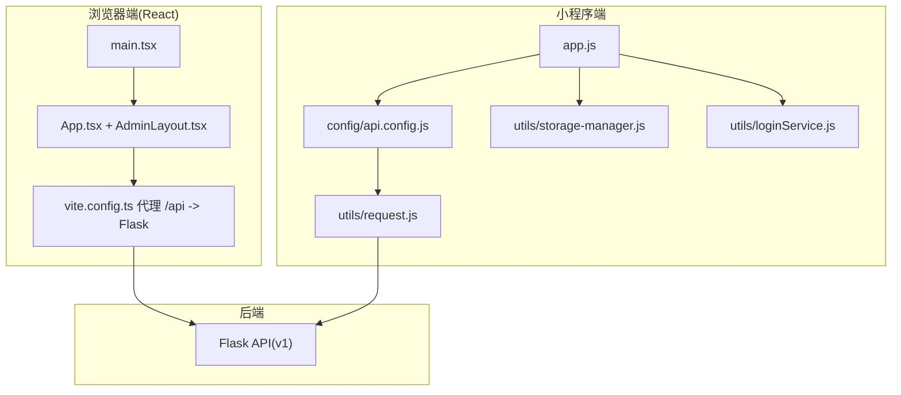
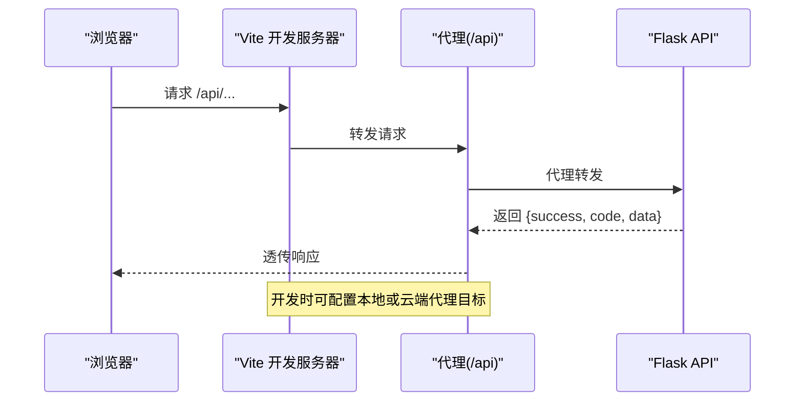
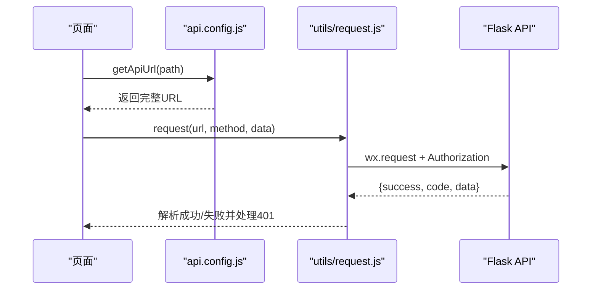
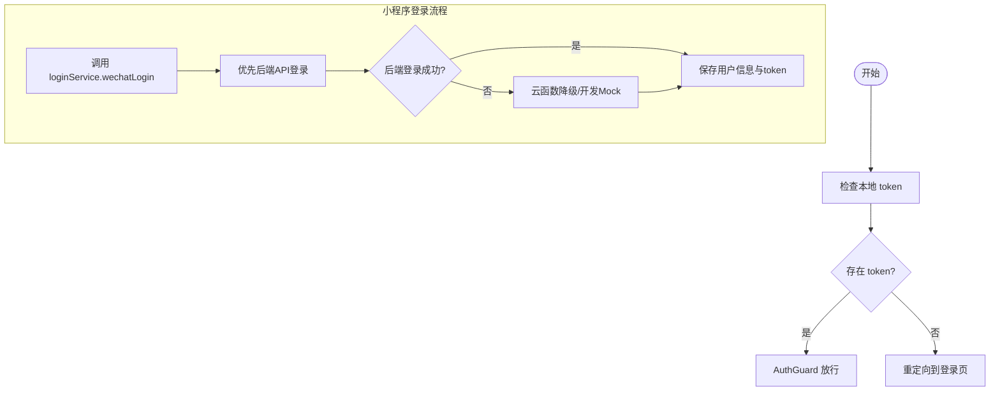
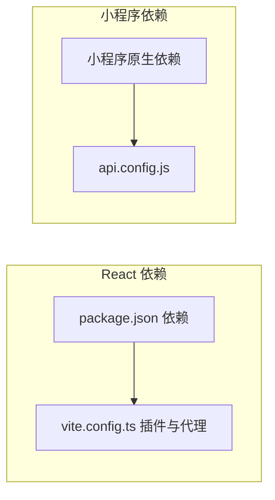

# 前端架构设计

<cite>
**本文引用的文件**
- [admin-ui/package.json](file://admin-ui/package.json)
- [admin-ui/vite.config.ts](file://admin-ui/vite.config.ts)
- [admin-ui/src/main.tsx](file://admin-ui/src/main.tsx)
- [admin-ui/src/App.tsx](file://admin-ui/src/App.tsx)
- [admin-ui/src/components/AdminLayout.tsx](file://admin-ui/src/components/AdminLayout.tsx)
- [admin-ui/src/components/AuthGuard.tsx](file://admin-ui/src/components/AuthGuard.tsx)
- [miniprogram/app.js](file://miniprogram/app.js)
- [miniprogram/app.json](file://miniprogram/app.json)
- [miniprogram/config/api.config.js](file://miniprogram/config/api.config.js)
- [utils/request.js](file://utils/request.js)
- [miniprogram/utils/storage-manager.js](file://miniprogram/utils/storage-manager.js)
- [miniprogram/utils/loginService.js](file://miniprogram/utils/loginService.js)
</cite>

## 目录
1. [引言](#引言)
2. [项目结构](#项目结构)
3. [核心组件](#核心组件)
4. [架构总览](#架构总览)
5. [详细组件分析](#详细组件分析)
6. [依赖关系分析](#依赖关系分析)
7. [性能考虑](#性能考虑)
8. [故障排查指南](#故障排查指南)
9. [结论](#结论)
10. [附录](#附录)

## 引言
本文件面向场外期权交易系统的前端架构，系统采用“React 管理后台 + 微信小程序”的双端架构。React 管理后台基于 Vite + TypeScript + React Router + Ant Design；微信小程序采用原生框架，结合自研工具模块（存储、登录、性能优化等）。本文档覆盖组件化架构、状态管理模式、路由系统、目录结构、构建配置与部署策略、前后端 API 交互模式、数据流与错误处理、组件复用策略、UI 组件库使用、响应式设计原则、性能优化与缓存机制、用户体验设计、开发环境与调试工具、以及构建部署流程。

## 项目结构
项目采用多端并行组织方式：
- admin-ui：React 管理后台，TypeScript + Vite 构建，Antd UI，React Router 路由。
- miniprogram：微信小程序，原生框架，按 pages 与 components 分层，配合 utils 工具模块。
- utils：通用请求封装（用于部分页面或迁移场景）。
- backend_utils：后端工具（与前端交互较少，此处不展开）。
- deploy：容器与 Nginx 配置（与前端构建相关）。

**图表来源**
- [admin-ui/src/main.tsx](file://admin-ui/src/main.tsx#L1-L14)
- [admin-ui/src/App.tsx](file://admin-ui/src/App.tsx#L1-L57)
- [admin-ui/src/components/AdminLayout.tsx](file://admin-ui/src/components/AdminLayout.tsx#L1-L180)
- [admin-ui/src/components/AuthGuard.tsx](file://admin-ui/src/components/AuthGuard.tsx#L1-L20)
- [miniprogram/app.js](file://miniprogram/app.js#L1-L225)
- [miniprogram/app.json](file://miniprogram/app.json#L1-L78)
- [miniprogram/config/api.config.js](file://miniprogram/config/api.config.js#L1-L90)
- [miniprogram/utils/storage-manager.js](file://miniprogram/utils/storage-manager.js#L1-L776)
- [miniprogram/utils/loginService.js](file://miniprogram/utils/loginService.js#L1-L492)

**章节来源**
- [admin-ui/package.json](file://admin-ui/package.json#L1-L38)
- [admin-ui/vite.config.ts](file://admin-ui/vite.config.ts#L1-L78)
- [admin-ui/src/main.tsx](file://admin-ui/src/main.tsx#L1-L14)
- [admin-ui/src/App.tsx](file://admin-ui/src/App.tsx#L1-L57)
- [admin-ui/src/components/AdminLayout.tsx](file://admin-ui/src/components/AdminLayout.tsx#L1-L180)
- [admin-ui/src/components/AuthGuard.tsx](file://admin-ui/src/components/AuthGuard.tsx#L1-L20)
- [miniprogram/app.js](file://miniprogram/app.js#L1-L225)
- [miniprogram/app.json](file://miniprogram/app.json#L1-L78)
- [miniprogram/config/api.config.js](file://miniprogram/config/api.config.js#L1-L90)
- [utils/request.js](file://utils/request.js#L1-L70)
- [miniprogram/utils/storage-manager.js](file://miniprogram/utils/storage-manager.js#L1-L776)
- [miniprogram/utils/loginService.js](file://miniprogram/utils/loginService.js#L1-L492)

## 核心组件
- React 管理后台
  - 入口渲染：AntdApp 包裹，StrictMode 渲染，挂载根节点。
  - 路由与布局：BrowserRouter + Routes，AdminLayout 作为主布局，AuthGuard 保护受控路由。
  - 侧边菜单：AdminLayout 内部维护菜单项与子路由，支持折叠与登出。
- 微信小程序
  - 应用生命周期：初始化云开发、核心服务、性能监控、自动登录与错误上报。
  - 页面与 TabBar：app.json 统一声明页面与 TabBar。
  - API 配置：api.config.js 统一管理开发/生产环境 API 地址。
  - 存储与登录：storage-manager.js 提供智能缓存与同步，loginService.js 提供多渠道登录与 Token 管理。

**章节来源**
- [admin-ui/src/main.tsx](file://admin-ui/src/main.tsx#L1-L14)
- [admin-ui/src/App.tsx](file://admin-ui/src/App.tsx#L1-L57)
- [admin-ui/src/components/AdminLayout.tsx](file://admin-ui/src/components/AdminLayout.tsx#L1-L180)
- [admin-ui/src/components/AuthGuard.tsx](file://admin-ui/src/components/AuthGuard.tsx#L1-L20)
- [miniprogram/app.js](file://miniprogram/app.js#L1-L225)
- [miniprogram/app.json](file://miniprogram/app.json#L1-L78)
- [miniprogram/config/api.config.js](file://miniprogram/config/api.config.js#L1-L90)
- [miniprogram/utils/storage-manager.js](file://miniprogram/utils/storage-manager.js#L1-L776)
- [miniprogram/utils/loginService.js](file://miniprogram/utils/loginService.js#L1-L492)

## 架构总览
双端架构遵循“前端渲染 + 后端 API”模式：
- React 管理后台：Vite 开发服务器 + 代理转发，构建产物静态部署。
- 微信小程序：原生框架 + 云开发（可选），通过统一 API 配置访问后端。
- 通用请求：utils/request.js 提供 wx.request 的封装，支持鉴权头与业务错误处理。
- 状态与缓存：小程序侧采用智能存储管理器，支持压缩、加密、LRU、TTL、同步队列与观察者模式。

**图表来源**
- [admin-ui/vite.config.ts](file://admin-ui/vite.config.ts#L1-L78)
- [admin-ui/src/main.tsx](file://admin-ui/src/main.tsx#L1-L14)
- [admin-ui/src/App.tsx](file://admin-ui/src/App.tsx#L1-L57)
- [admin-ui/src/components/AdminLayout.tsx](file://admin-ui/src/components/AdminLayout.tsx#L1-L180)
- [miniprogram/config/api.config.js](file://miniprogram/config/api.config.js#L1-L90)
- [utils/request.js](file://utils/request.js#L1-L70)
- [miniprogram/utils/storage-manager.js](file://miniprogram/utils/storage-manager.js#L1-L776)
- [miniprogram/utils/loginService.js](file://miniprogram/utils/loginService.js#L1-L492)

## 详细组件分析

### React 管理后台组件分析
- 入口与主题
  - main.tsx 使用 AntdApp 包裹，保证全局样式与主题一致性。
- 路由与布局
  - App.tsx 定义顶层路由，AdminLayout.tsx 提供侧边菜单、头部与内容区，AuthGuard.tsx 保护受控路由。
- 代理与开发体验
  - vite.config.ts 支持本地与云端两种代理目标，开发时输出代理目标，异常时返回标准化错误体。

**图表来源**
- [admin-ui/vite.config.ts](file://admin-ui/vite.config.ts#L21-L59)
- [admin-ui/src/App.tsx](file://admin-ui/src/App.tsx#L1-L57)

**章节来源**
- [admin-ui/src/main.tsx](file://admin-ui/src/main.tsx#L1-L14)
- [admin-ui/src/App.tsx](file://admin-ui/src/App.tsx#L1-L57)
- [admin-ui/src/components/AdminLayout.tsx](file://admin-ui/src/components/AdminLayout.tsx#L1-L180)
- [admin-ui/src/components/AuthGuard.tsx](file://admin-ui/src/components/AuthGuard.tsx#L1-L20)
- [admin-ui/vite.config.ts](file://admin-ui/vite.config.ts#L1-L78)

### 微信小程序组件分析
- 应用生命周期与服务初始化
  - app.js 初始化云开发、核心服务（存储、性能、UI 增强、通知）、预加载关键资源、自动登录、性能监控与错误上报。
- API 配置与请求
  - api.config.js 根据运行环境选择开发/生产 API 地址；utils/request.js 封装 wx.request，处理鉴权头与业务错误。
- 存储与登录
  - storage-manager.js 提供智能缓存（压缩/加密/LRU/TTL）、同步队列、观察者、批量操作与统计；loginService.js 提供微信/QQ/手机登录、Token 刷新与校验、登出与自动登录。

**图表来源**
- [miniprogram/config/api.config.js](file://miniprogram/config/api.config.js#L66-L82)
- [utils/request.js](file://utils/request.js#L6-L42)

**章节来源**
- [miniprogram/app.js](file://miniprogram/app.js#L1-L225)
- [miniprogram/app.json](file://miniprogram/app.json#L1-L78)
- [miniprogram/config/api.config.js](file://miniprogram/config/api.config.js#L1-L90)
- [utils/request.js](file://utils/request.js#L1-L70)
- [miniprogram/utils/storage-manager.js](file://miniprogram/utils/storage-manager.js#L1-L776)
- [miniprogram/utils/loginService.js](file://miniprogram/utils/loginService.js#L1-L492)

### 登录与鉴权流程
- React 端：AuthGuard 读取本地 token，无 token 则重定向至登录页。
- 小程序端：loginService.js 提供多种登录方式与自动登录/刷新逻辑，支持开发环境降级与 Mock 数据。

**图表来源**
- [admin-ui/src/components/AuthGuard.tsx](file://admin-ui/src/components/AuthGuard.tsx#L8-L17)
- [miniprogram/utils/loginService.js](file://miniprogram/utils/loginService.js#L12-L33)

**章节来源**
- [admin-ui/src/components/AuthGuard.tsx](file://admin-ui/src/components/AuthGuard.tsx#L1-L20)
- [miniprogram/utils/loginService.js](file://miniprogram/utils/loginService.js#L1-L492)

### 数据流与错误处理
- React 管理后台：开发代理统一拦截错误并返回标准化 JSON，便于前端提示。
- 小程序：request.js 对 401 进行登出处理并跳转登录；loginService.js 在开发环境提供降级与 Mock，避免阻塞 UI 调试。

**章节来源**
- [admin-ui/vite.config.ts](file://admin-ui/vite.config.ts#L26-L56)
- [utils/request.js](file://utils/request.js#L22-L55)
- [miniprogram/utils/loginService.js](file://miniprogram/utils/loginService.js#L88-L115)

## 依赖关系分析
- React 管理后台
  - 依赖：react、react-dom、react-router-dom、antd、@ant-design/icons、axios。
  - 构建：Vite + TypeScript，插件 react，测试环境 jsdom。
- 微信小程序
  - 依赖：原生框架 + 云开发；通过 utils/request.js 与后端通信。
  - 配置：app.json 声明页面与 TabBar；api.config.js 统一 API 地址。

**图表来源**
- [admin-ui/package.json](file://admin-ui/package.json#L13-L36)
- [admin-ui/vite.config.ts](file://admin-ui/vite.config.ts#L61-L77)
- [miniprogram/config/api.config.js](file://miniprogram/config/api.config.js#L11-L24)

**章节来源**
- [admin-ui/package.json](file://admin-ui/package.json#L1-L38)
- [admin-ui/vite.config.ts](file://admin-ui/vite.config.ts#L1-L78)
- [miniprogram/config/api.config.js](file://miniprogram/config/api.config.js#L1-L90)

## 性能考虑
- React 管理后台
  - Vite 启动快、热更新快；代理超时与错误处理提升开发稳定性。
- 微信小程序
  - storage-manager.js：压缩/加密、LRU、TTL、同步队列、批量操作、统计与观察者，降低存储开销与提升可用性。
  - app.js：关键资源懒加载与预加载、内存告警清理、定期性能报告。
  - loginService.js：开发环境降级与 Mock，减少等待时间。

**章节来源**
- [admin-ui/vite.config.ts](file://admin-ui/vite.config.ts#L17-L59)
- [miniprogram/utils/storage-manager.js](file://miniprogram/utils/storage-manager.js#L1-L776)
- [miniprogram/app.js](file://miniprogram/app.js#L92-L175)
- [miniprogram/utils/loginService.js](file://miniprogram/utils/loginService.js#L44-L68)

## 故障排查指南
- React 开发代理失败
  - 确认后端已启动；检查 FLASK_PORT 与代理目标；查看代理错误回调返回的标准化错误体。
- 小程序登录失败
  - 开发环境优先尝试后端 API 登录，失败则降级到云函数或 Mock；检查网络与环境版本。
- 请求 401
  - 小程序端会清除本地 token 并跳转登录页；检查后端鉴权逻辑与 Token 有效期。

**章节来源**
- [admin-ui/vite.config.ts](file://admin-ui/vite.config.ts#L26-L56)
- [utils/request.js](file://utils/request.js#L44-L55)
- [miniprogram/utils/loginService.js](file://miniprogram/utils/loginService.js#L38-L86)

## 结论
该前端架构以 React 管理后台与微信小程序双端并行，分别满足管理与移动端用户需求。React 侧通过 Vite 与代理提升开发效率，Antd 提供一致的 UI 体验；小程序侧通过统一 API 配置与工具模块实现稳定的数据流与良好的用户体验。整体具备清晰的组件化、路由与状态管理边界，以及完善的性能与错误处理策略。

## 附录
- 目录结构要点
  - admin-ui：src 下按 pages、components、utils、styles、assets 组织；构建产物 dist。
  - miniprogram：pages 下按功能划分页面；utils 下存放工具模块；config 统一配置。
- 构建与部署
  - React：Vite 构建后静态资源部署；代理配置支持本地/云端切换。
  - 小程序：原生构建，云开发可选；API 地址按环境自动切换。
- 开发环境与调试
  - React：Vitest + jsdom；ESLint + TypeScript；VS Code tasks.json 可辅助任务。
  - 小程序：开发者工具调试；app.js 输出性能与错误日志；storage-manager.js 提供统计与详情。

**章节来源**
- [admin-ui/package.json](file://admin-ui/package.json#L6-L12)
- [admin-ui/vite.config.ts](file://admin-ui/vite.config.ts#L68-L77)
- [miniprogram/app.js](file://miniprogram/app.js#L144-L175)
- [miniprogram/utils/storage-manager.js](file://miniprogram/utils/storage-manager.js#L529-L536)