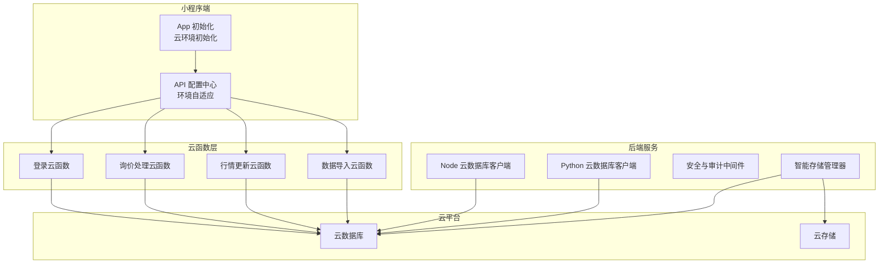
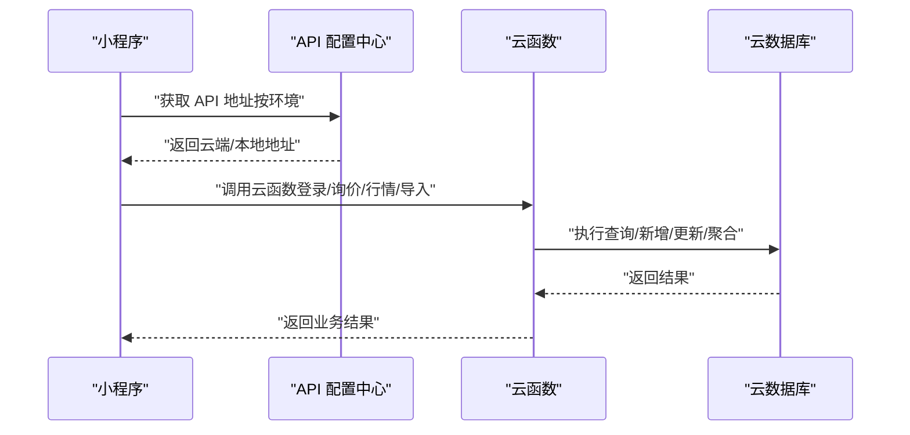
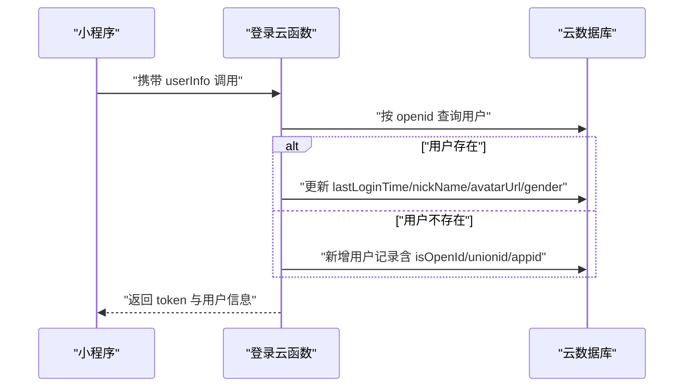
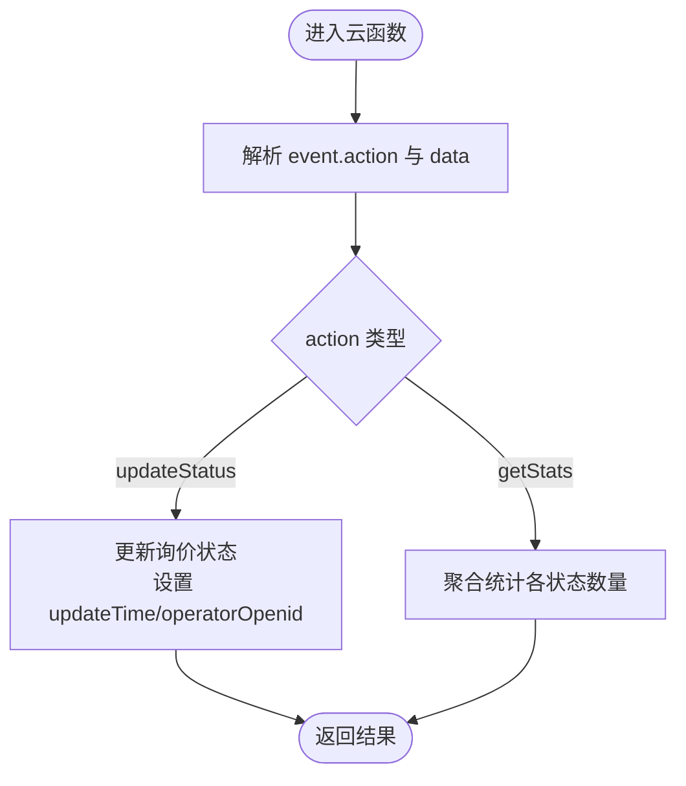
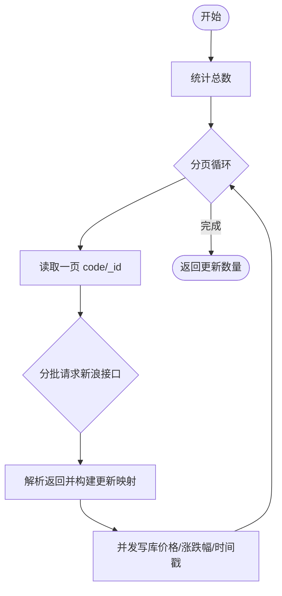
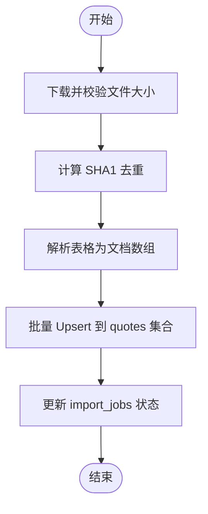
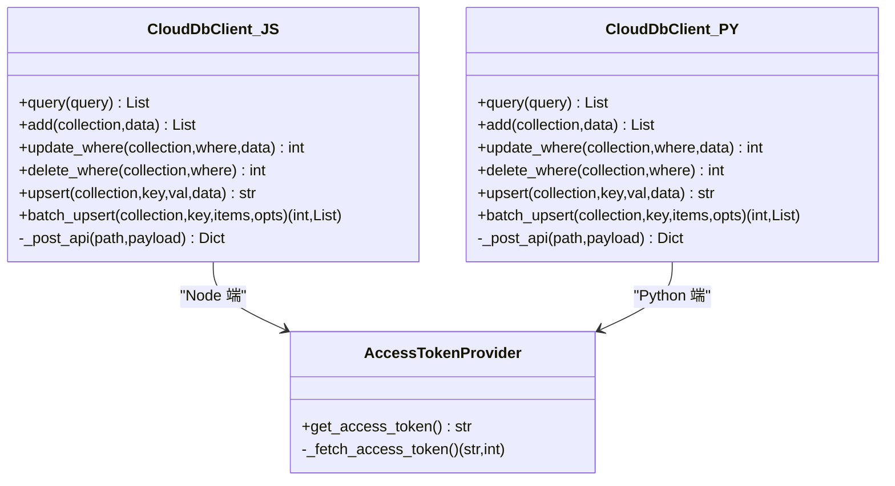
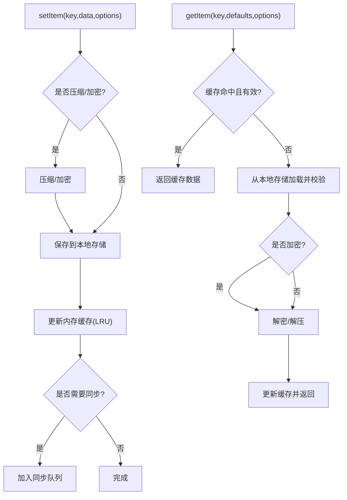
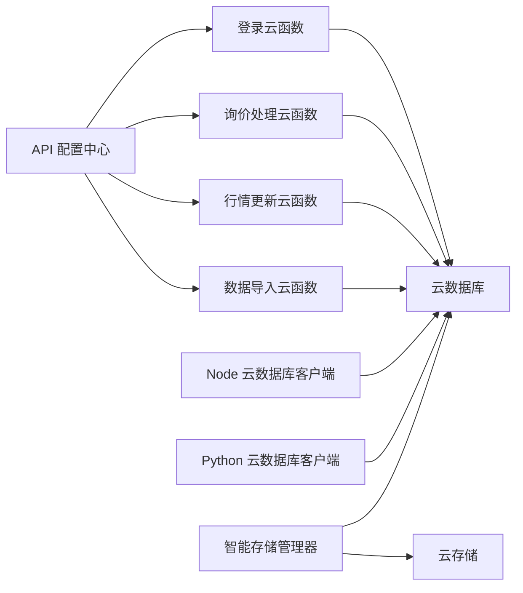

# 云开发集成架构

<cite>
**本文引用的文件**
- [cloudfunctions/login/index.js](file://cloudfunctions/login/index.js)
- [cloudfunctions/login/package.json](file://cloudfunctions/login/package.json)
- [cloudfunctions/handleInquiry/index.js](file://cloudfunctions/handleInquiry/index.js)
- [cloudfunctions/handleInquiry/package.json](file://cloudfunctions/handleInquiry/package.json)
- [cloudfunctions/dataImporter/index.js](file://cloudfunctions/dataImporter/index.js)
- [cloudfunctions/dataImporter/package.json](file://cloudfunctions/dataImporter/package.json)
- [cloudfunctions/dataImporter/config.json](file://cloudfunctions/dataImporter/config.json)
- [cloudfunctions/updateQuotes/index.js](file://cloudfunctions/updateQuotes/index.js)
- [cloudfunctions/updateQuotes/package.json](file://cloudfunctions/updateQuotes/package.json)
- [cloudfunctions/updateQuotes/config.json](file://cloudfunctions/updateQuotes/config.json)
- [miniprogram/app.js](file://miniprogram/app.js)
- [miniprogram/config/api.config.js](file://miniprogram/config/api.config.js)
- [services/cloud_db.js](file://services/cloud_db.js)
- [services/cloud_db.py](file://services/cloud_db.py)
- [backend_utils/db.js](file://backend_utils/db.js)
- [backend_utils/security.py](file://backend_utils/security.py)
- [backend_utils/storage-manager.js](file://backend_utils/storage-manager.js)
</cite>

## 目录
1. [引言](#引言)
2. [项目结构](#项目结构)
3. [核心组件](#核心组件)
4. [架构总览](#架构总览)
5. [详细组件分析](#详细组件分析)
6. [依赖关系分析](#依赖关系分析)
7. [性能考量](#性能考量)
8. [故障排查指南](#故障排查指南)
9. [结论](#结论)
10. [附录](#附录)

## 引言
本文件面向微信小程序云开发集成场景，系统化梳理项目在云函数、云数据库、云存储与认证授权方面的整体架构与实现细节。内容覆盖：
- 云开发配置与初始化
- 云函数调用与定时触发
- 云数据库操作与跨语言客户端封装
- 云存储与文件导入流程
- 认证机制、安全策略与访问控制
- 部署流程、调试方法与性能优化
- 最佳实践、成本控制与故障排查

## 项目结构
项目采用“前端小程序 + 后端服务 + 云函数 + 云数据库/云存储”的分层架构。云函数位于 cloudfunctions 目录，提供登录、询价处理、行情更新与数据导入等能力；后端服务通过 Node/Python 客户端封装云数据库 API；小程序端负责初始化云环境、路由与 API 地址选择。

图表来源
- [miniprogram/app.js](file://miniprogram/app.js#L25-L42)
- [miniprogram/config/api.config.js](file://miniprogram/config/api.config.js#L30-L47)
- [cloudfunctions/login/index.js](file://cloudfunctions/login/index.js#L4-L6)
- [cloudfunctions/handleInquiry/index.js](file://cloudfunctions/handleInquiry/index.js#L4-L6)
- [cloudfunctions/updateQuotes/index.js](file://cloudfunctions/updateQuotes/index.js#L6)
- [cloudfunctions/dataImporter/index.js](file://cloudfunctions/dataImporter/index.js#L5-L7)
- [services/cloud_db.js](file://services/cloud_db.js#L8-L25)
- [services/cloud_db.py](file://services/cloud_db.py#L108-L140)
- [backend_utils/storage-manager.js](file://backend_utils/storage-manager.js#L7-L34)

章节来源
- [miniprogram/app.js](file://miniprogram/app.js#L25-L42)
- [miniprogram/config/api.config.js](file://miniprogram/config/api.config.js#L30-L47)
- [cloudfunctions/login/index.js](file://cloudfunctions/login/index.js#L4-L6)
- [cloudfunctions/handleInquiry/index.js](file://cloudfunctions/handleInquiry/index.js#L4-L6)
- [cloudfunctions/updateQuotes/index.js](file://cloudfunctions/updateQuotes/index.js#L6)
- [cloudfunctions/dataImporter/index.js](file://cloudfunctions/dataImporter/index.js#L5-L7)
- [services/cloud_db.js](file://services/cloud_db.js#L8-L25)
- [services/cloud_db.py](file://services/cloud_db.py#L108-L140)
- [backend_utils/storage-manager.js](file://backend_utils/storage-manager.js#L7-L34)

## 核心组件
- 小程序云环境初始化与 API 地址选择：在 App 启动时初始化云环境，并通过 API 配置中心按环境自动选择云端或本地地址。
- 云函数：提供登录、询价处理、行情更新、Excel 导入等能力，支持定时触发与事件驱动。
- 云数据库客户端：Node 与 Python 两端封装，统一查询、新增、更新、删除与批量 Upsert 能力，内置重试、并发与速率控制。
- 智能存储管理器：在小程序端提供缓存、压缩、加密、LRU 淘汰、同步队列与观察者模式等能力，兼顾离线与一致性。
- 安全与审计：基于 Flask 的限流、账户锁定与审计日志装饰器，保障后端接口安全。

章节来源
- [miniprogram/app.js](file://miniprogram/app.js#L25-L42)
- [miniprogram/config/api.config.js](file://miniprogram/config/api.config.js#L53-L86)
- [cloudfunctions/login/index.js](file://cloudfunctions/login/index.js#L11-L92)
- [cloudfunctions/handleInquiry/index.js](file://cloudfunctions/handleInquiry/index.js#L12-L81)
- [cloudfunctions/updateQuotes/index.js](file://cloudfunctions/updateQuotes/index.js#L95-L180)
- [cloudfunctions/dataImporter/index.js](file://cloudfunctions/dataImporter/index.js#L342-L392)
- [services/cloud_db.js](file://services/cloud_db.js#L106-L139)
- [services/cloud_db.py](file://services/cloud_db.py#L486-L533)
- [backend_utils/storage-manager.js](file://backend_utils/storage-manager.js#L118-L185)
- [backend_utils/security.py](file://backend_utils/security.py#L17-L45)

## 架构总览
下图展示从小程序端发起请求到云函数与云数据库交互的关键路径，以及定时任务驱动的数据导入与行情更新流程。

图表来源
- [miniprogram/config/api.config.js](file://miniprogram/config/api.config.js#L95-L103)
- [cloudfunctions/login/index.js](file://cloudfunctions/login/index.js#L11-L92)
- [cloudfunctions/handleInquiry/index.js](file://cloudfunctions/handleInquiry/index.js#L12-L81)
- [cloudfunctions/updateQuotes/index.js](file://cloudfunctions/updateQuotes/index.js#L95-L180)
- [cloudfunctions/dataImporter/index.js](file://cloudfunctions/dataImporter/index.js#L342-L392)

## 详细组件分析

### 登录云函数
- 功能要点
  - 初始化云环境并获取上下文（OPENID/UNIONID/APPID）
  - 读取小程序传入的用户信息，查询或创建用户记录
  - 更新最近登录时间与用户资料
  - 生成简易 token 并返回结果
- 关键点
  - 使用云数据库集合 users 进行用户管理
  - 对用户字段进行安全赋值与时间戳更新
  - 异常捕获并返回结构化错误信息

图表来源
- [cloudfunctions/login/index.js](file://cloudfunctions/login/index.js#L11-L92)

章节来源
- [cloudfunctions/login/index.js](file://cloudfunctions/login/index.js#L11-L92)
- [cloudfunctions/login/package.json](file://cloudfunctions/login/package.json#L11-L13)

### 询价处理云函数
- 功能要点
  - 支持多动作：更新状态、获取统计
  - 基于 OPENID 与上下文进行操作
  - 使用聚合查询统计各状态数量
- 关键点
  - 参数校验与缺失保护
  - 使用云数据库命令进行更新与聚合

图表来源
- [cloudfunctions/handleInquiry/index.js](file://cloudfunctions/handleInquiry/index.js#L12-L81)

章节来源
- [cloudfunctions/handleInquiry/index.js](file://cloudfunctions/handleInquiry/index.js#L12-L81)
- [cloudfunctions/handleInquiry/package.json](file://cloudfunctions/handleInquiry/package.json#L6-L9)

### 行情更新云函数
- 功能要点
  - 分页读取报价集合，按批请求新浪行情接口
  - 并发写库，支持每日收盘与盘中定时任务
  - 超时控制与错误降级
- 关键点
  - 流式 Pipeline 避免 OOM
  - 并发池与分批请求提升吞吐
  - 可通过触发器名称识别每日任务

图表来源
- [cloudfunctions/updateQuotes/index.js](file://cloudfunctions/updateQuotes/index.js#L95-L180)

章节来源
- [cloudfunctions/updateQuotes/index.js](file://cloudfunctions/updateQuotes/index.js#L95-L180)
- [cloudfunctions/updateQuotes/package.json](file://cloudfunctions/updateQuotes/package.json#L6-L10)
- [cloudfunctions/updateQuotes/config.json](file://cloudfunctions/updateQuotes/config.json#L5-L16)

### 数据导入云函数
- 功能要点
  - Excel/CSV 解析与字段映射
  - 去重与哈希校验，避免重复导入
  - 事务性作业管理（pending/processing/success/failed）
  - 并发写入与批量 Upsert
- 关键点
  - 限制文件大小，防止内存溢出
  - 通过 import_jobs 集合跟踪作业状态
  - 支持定时轮询处理待处理作业

图表来源
- [cloudfunctions/dataImporter/index.js](file://cloudfunctions/dataImporter/index.js#L273-L318)
- [cloudfunctions/dataImporter/config.json](file://cloudfunctions/dataImporter/config.json#L5-L12)

章节来源
- [cloudfunctions/dataImporter/index.js](file://cloudfunctions/dataImporter/index.js#L273-L318)
- [cloudfunctions/dataImporter/package.json](file://cloudfunctions/dataImporter/package.json#L6-L10)
- [cloudfunctions/dataImporter/config.json](file://cloudfunctions/dataImporter/config.json#L5-L12)

### 云数据库客户端（Node/Python）
- Node 客户端
  - 令牌获取与缓存、请求重试与退避
  - 查询/新增/更新/删除/Upsert/Batch Upsert
  - 并发上限与等待队列
- Python 客户端
  - 线程安全的令牌提供器
  - 连接池与信号量控制并发
  - 详细的日志与错误分类

图表来源
- [services/cloud_db.js](file://services/cloud_db.js#L36-L106)
- [services/cloud_db.js](file://services/cloud_db.js#L106-L139)
- [services/cloud_db.js](file://services/cloud_db.js#L144-L323)
- [services/cloud_db.py](file://services/cloud_db.py#L36-L106)
- [services/cloud_db.py](file://services/cloud_db.py#L486-L533)

章节来源
- [services/cloud_db.js](file://services/cloud_db.js#L106-L139)
- [services/cloud_db.js](file://services/cloud_db.js#L144-L323)
- [services/cloud_db.py](file://services/cloud_db.py#L486-L533)

### 智能存储管理器（小程序端）
- 功能要点
  - 缓存管理（内存 Map/LRU）、压缩/加密、TTL
  - 同步队列与重试、观察者模式
  - 生命周期监听（App Hide/Show）、统计与诊断
- 关键点
  - 仅在小程序环境使用 wx.* 接口
  - 支持批量操作与优先级调度

图表来源
- [backend_utils/storage-manager.js](file://backend_utils/storage-manager.js#L118-L185)
- [backend_utils/storage-manager.js](file://backend_utils/storage-manager.js#L193-L279)
- [backend_utils/storage-manager.js](file://backend_utils/storage-manager.js#L472-L496)

章节来源
- [backend_utils/storage-manager.js](file://backend_utils/storage-manager.js#L118-L185)
- [backend_utils/storage-manager.js](file://backend_utils/storage-manager.js#L193-L279)
- [backend_utils/storage-manager.js](file://backend_utils/storage-manager.js#L472-L496)

### 安全与审计（Flask 中间件）
- 限流：基于 IP+端点的滑动窗口限流
- 账户锁定：连续失败达到阈值锁定一段时间
- 审计日志：记录用户、IP、动作与状态

章节来源
- [backend_utils/security.py](file://backend_utils/security.py#L17-L45)
- [backend_utils/security.py](file://backend_utils/security.py#L62-L86)
- [backend_utils/security.py](file://backend_utils/security.py#L87-L117)

## 依赖关系分析
- 小程序端依赖 API 配置中心按环境选择云端或本地地址，避免本地开发域名校验问题
- 云函数依赖 wx-server-sdk 与云数据库命令，定时触发器驱动周期性任务
- 后端服务通过 Node/Python 客户端封装云数据库 API，支持批量 Upsert 与并发控制
- 存储管理器在小程序端提供缓存与同步能力，减少对云存储的直接依赖

图表来源
- [miniprogram/config/api.config.js](file://miniprogram/config/api.config.js#L95-L103)
- [cloudfunctions/login/index.js](file://cloudfunctions/login/index.js#L11-L92)
- [cloudfunctions/handleInquiry/index.js](file://cloudfunctions/handleInquiry/index.js#L12-L81)
- [cloudfunctions/updateQuotes/index.js](file://cloudfunctions/updateQuotes/index.js#L95-L180)
- [cloudfunctions/dataImporter/index.js](file://cloudfunctions/dataImporter/index.js#L342-L392)
- [services/cloud_db.js](file://services/cloud_db.js#L106-L139)
- [services/cloud_db.py](file://services/cloud_db.py#L486-L533)
- [backend_utils/storage-manager.js](file://backend_utils/storage-manager.js#L472-L496)

章节来源
- [miniprogram/config/api.config.js](file://miniprogram/config/api.config.js#L95-L103)
- [cloudfunctions/login/index.js](file://cloudfunctions/login/index.js#L11-L92)
- [cloudfunctions/handleInquiry/index.js](file://cloudfunctions/handleInquiry/index.js#L12-L81)
- [cloudfunctions/updateQuotes/index.js](file://cloudfunctions/updateQuotes/index.js#L95-L180)
- [cloudfunctions/dataImporter/index.js](file://cloudfunctions/dataImporter/index.js#L342-L392)
- [services/cloud_db.js](file://services/cloud_db.js#L106-L139)
- [services/cloud_db.py](file://services/cloud_db.py#L486-L533)
- [backend_utils/storage-manager.js](file://backend_utils/storage-manager.js#L472-L496)

## 性能考量
- 云函数
  - 分页与并发：行情更新采用分页读取与并发写入，避免一次性加载导致内存压力
  - 超时与退避：请求外部接口设置超时，失败时指数退避
  - 事务与幂等：导入流程通过作业状态与去重哈希保证幂等
- 云数据库
  - Node/Python 客户端内置并发上限与重试，批量 Upsert 降低请求次数
  - 速率限制与 QPS 退避，避免触发平台限流
- 小程序端
  - 智能存储管理器提供 LRU、压缩、加密与同步队列，平衡离线体验与一致性

章节来源
- [cloudfunctions/updateQuotes/index.js](file://cloudfunctions/updateQuotes/index.js#L101-L164)
- [cloudfunctions/updateQuotes/index.js](file://cloudfunctions/updateQuotes/index.js#L32-L56)
- [services/cloud_db.js](file://services/cloud_db.js#L106-L139)
- [services/cloud_db.py](file://services/cloud_db.py#L486-L533)
- [backend_utils/storage-manager.js](file://backend_utils/storage-manager.js#L316-L336)

## 故障排查指南
- 云函数常见问题
  - 登录失败：检查 openid/unionid 获取与用户集合字段
  - 询价更新失败：确认 id/status 参数与集合存在性
  - 行情更新超时：检查外部接口可达性与超时配置
  - 数据导入失败：关注文件大小限制、去重哈希与作业状态
- 云数据库
  - 访问令牌失效：刷新令牌或检查 appid/secret
  - 集合不存在：在云开发控制台创建对应集合
  - 速率限制：降低并发或增加退避时间
- 小程序端
  - 存储异常：检查本地存储容量与过期清理
  - 同步失败：查看同步队列与重试次数

章节来源
- [cloudfunctions/login/index.js](file://cloudfunctions/login/index.js#L84-L91)
- [cloudfunctions/handleInquiry/index.js](file://cloudfunctions/handleInquiry/index.js#L34-L58)
- [cloudfunctions/updateQuotes/index.js](file://cloudfunctions/updateQuotes/index.js#L133-L136)
- [cloudfunctions/dataImporter/index.js](file://cloudfunctions/dataImporter/index.js#L287-L291)
- [services/cloud_db.js](file://services/cloud_db.js#L117-L139)
- [services/cloud_db.py](file://services/cloud_db.py#L515-L520)
- [backend_utils/storage-manager.js](file://backend_utils/storage-manager.js#L502-L524)

## 结论
本项目通过云函数、云数据库与小程序端的协同，实现了从用户登录、询价处理到行情与数据导入的完整闭环。Node/Python 两端云数据库客户端提供了稳定的底层支撑，智能存储管理器增强了小程序端的用户体验。结合定时触发器与安全中间件，系统具备良好的可维护性与扩展性。

## 附录
- 部署与调试
  - 使用云函数包内的依赖声明与触发器配置，按需启用定时任务
  - 在小程序端通过 API 配置中心自动选择云端地址，避免本地开发域名校验问题
- 最佳实践
  - 严格区分生产与开发环境，使用环境变量控制云数据库客户端行为
  - 对批量操作设置合理的并发与重试策略，避免平台限流
  - 在小程序端充分利用缓存与同步队列，提升离线可用性
- 成本控制
  - 控制云函数执行时长与并发，合理设置定时任务频率
  - 通过去重与哈希避免重复导入，减少写入成本