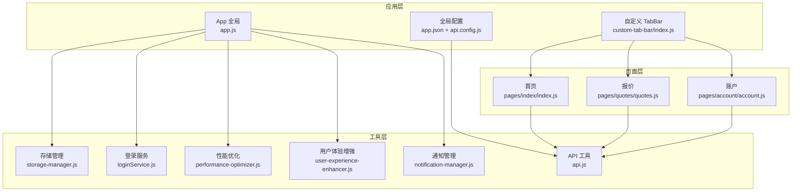
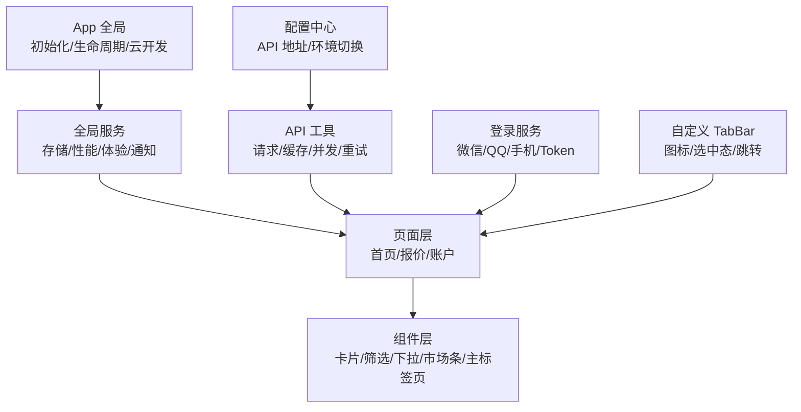
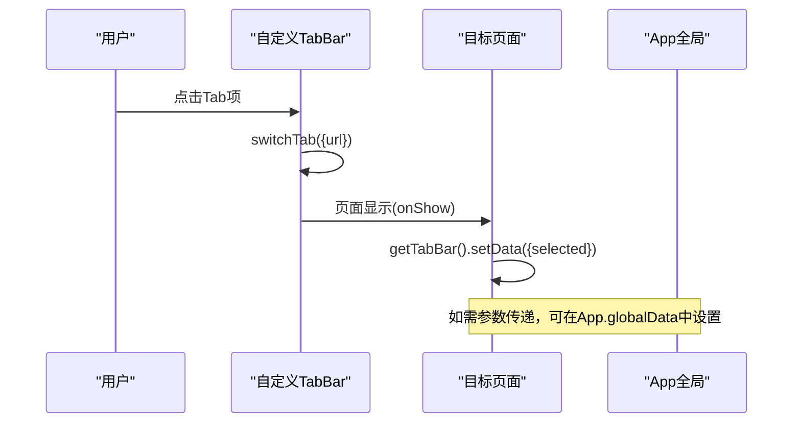
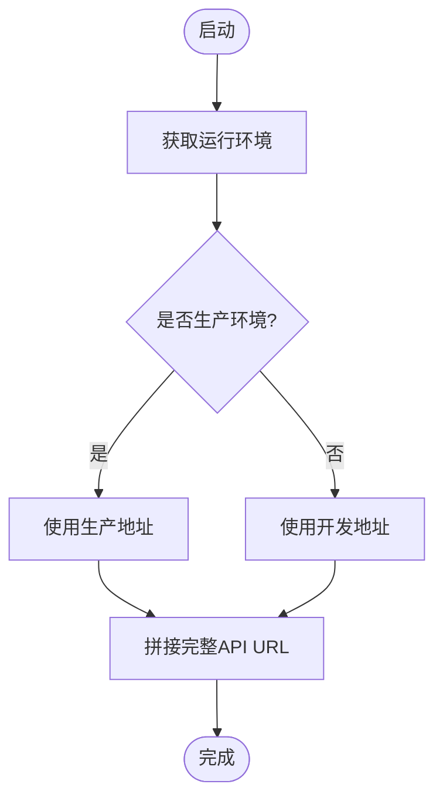
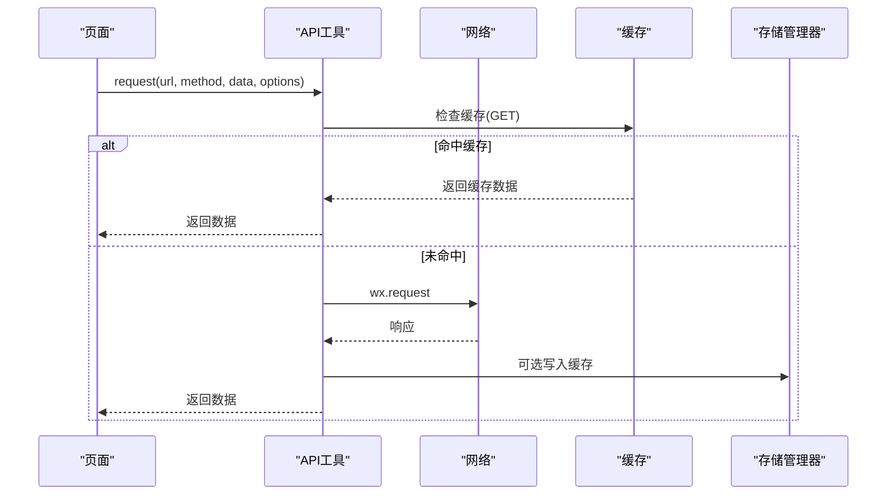
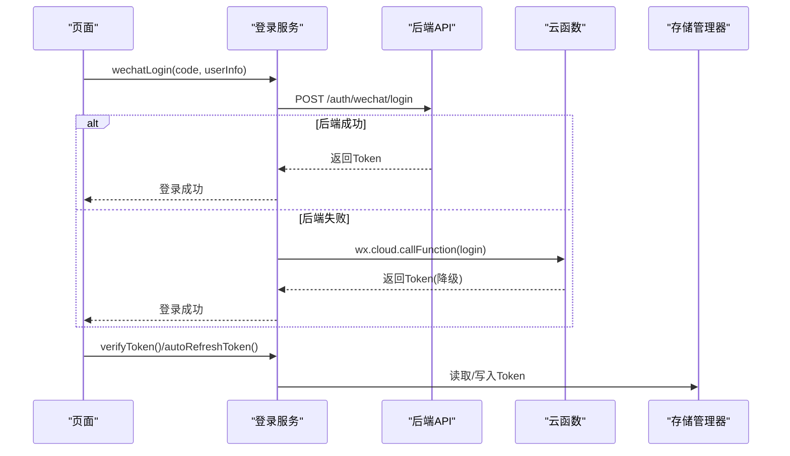
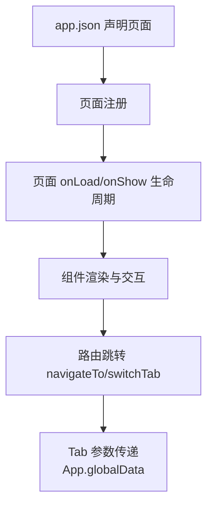
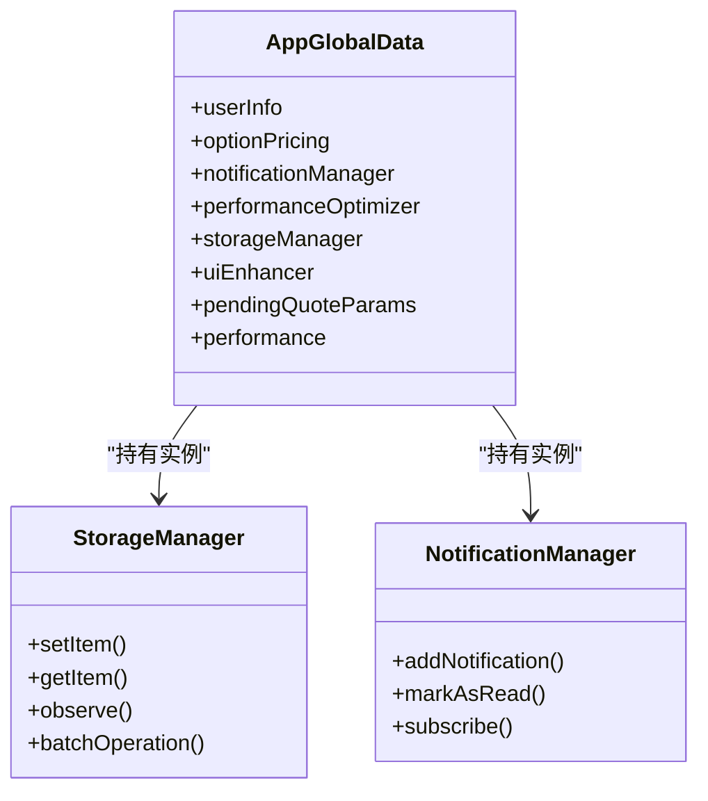
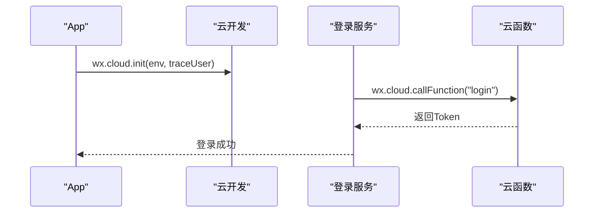
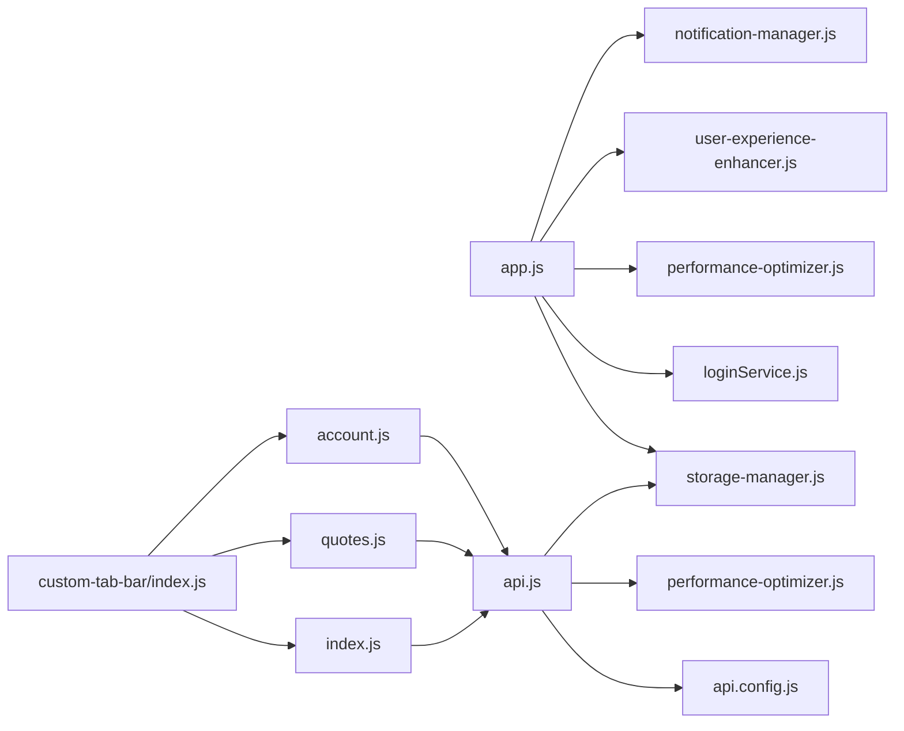

# 微信小程序架构

<cite>
**本文档引用的文件**
- [miniprogram/app.js](file://miniprogram/app.js)
- [miniprogram/app.json](file://miniprogram/app.json)
- [miniprogram/custom-tab-bar/index.js](file://miniprogram/custom-tab-bar/index.js)
- [miniprogram/config/api.config.js](file://miniprogram/config/api.config.js)
- [utils/request.js](file://utils/request.js)
- [miniprogram/utils/storage-manager.js](file://miniprogram/utils/storage-manager.js)
- [miniprogram/utils/loginService.js](file://miniprogram/utils/loginService.js)
- [miniprogram/utils/performance-optimizer.js](file://miniprogram/utils/performance-optimizer.js)
- [miniprogram/utils/user-experience-enhancer.js](file://miniprogram/utils/user-experience-enhancer.js)
- [miniprogram/utils/notification-manager.js](file://miniprogram/utils/notification-manager.js)
- [miniprogram/utils/api.js](file://miniprogram/utils/api.js)
- [miniprogram/pages/index/index.js](file://miniprogram/pages/index/index.js)
- [miniprogram/pages/quotes/quotes.js](file://miniprogram/pages/quotes/quotes.js)
- [miniprogram/pages/account/account.js](file://miniprogram/pages/account/account.js)
</cite>

## 目录
1. [简介](#简介)
2. [项目结构](#项目结构)
3. [核心组件](#核心组件)
4. [架构总览](#架构总览)
5. [详细组件分析](#详细组件分析)
6. [依赖关系分析](#依赖关系分析)
7. [性能考虑](#性能考虑)
8. [故障排除指南](#故障排除指南)
9. [结论](#结论)
10. [附录](#附录)

## 简介
本文件面向微信小程序开发者与技术管理者，系统化梳理项目整体架构、页面与组件化设计、自定义 TabBar 实现、全局配置管理、Vant Weapp 组件库集成、API 请求封装与数据管理策略、路由系统、状态管理机制、与微信云开发的集成方式、云函数调用与数据存储策略，以及开发规范、性能优化与用户体验设计原则。文档同时提供开发工具使用、调试方法与发布部署流程指导。

## 项目结构
项目采用分层与模块化组织方式：
- 应用入口与全局配置：app.js、app.json、custom-tab-bar/
- 配置中心：config/api.config.js
- 工具层：utils/*（存储管理、登录服务、性能优化、用户体验增强、通知管理、API 工具）
- 页面层：pages/*（首页、报价、账户、工作台等）
- 组件层：components/*（卡片列表、下拉选择、筛选栏、市场条、主标签页等）
- 服务层：services/*（业务服务封装）
- 第三方库：miniprogram/miniprogram_npm/@vant/weapp（Vant Weapp）

**图表来源**
- [miniprogram/app.js](file://miniprogram/app.js#L1-L225)
- [miniprogram/app.json](file://miniprogram/app.json#L1-L78)
- [miniprogram/custom-tab-bar/index.js](file://miniprogram/custom-tab-bar/index.js#L1-L31)
- [miniprogram/config/api.config.js](file://miniprogram/config/api.config.js#L1-L90)
- [miniprogram/utils/storage-manager.js](file://miniprogram/utils/storage-manager.js#L1-L776)
- [miniprogram/utils/loginService.js](file://miniprogram/utils/loginService.js#L1-L492)
- [miniprogram/utils/performance-optimizer.js](file://miniprogram/utils/performance-optimizer.js#L1-L817)
- [miniprogram/utils/user-experience-enhancer.js](file://miniprogram/utils/user-experience-enhancer.js#L1-L452)
- [miniprogram/utils/notification-manager.js](file://miniprogram/utils/notification-manager.js#L1-L205)
- [miniprogram/utils/api.js](file://miniprogram/utils/api.js#L1-L714)
- [miniprogram/pages/index/index.js](file://miniprogram/pages/index/index.js#L1-L710)
- [miniprogram/pages/quotes/quotes.js](file://miniprogram/pages/quotes/quotes.js#L1-L800)
- [miniprogram/pages/account/account.js](file://miniprogram/pages/account/account.js#L1-L177)

**章节来源**
- [miniprogram/app.js](file://miniprogram/app.js#L1-L225)
- [miniprogram/app.json](file://miniprogram/app.json#L1-L78)

## 核心组件
- 全局应用生命周期与云开发初始化：负责应用启动、自动登录、性能监控、错误上报与全局服务初始化。
- 自定义 TabBar：完全自绘 TabBar，支持图标、选中态与点击跳转。
- API 配置中心：集中管理开发/生产环境 API 地址，支持云端与本地地址切换。
- API 工具：统一请求封装、缓存、并发控制、重试、拦截器、去重、统计与错误处理。
- 存储管理器：智能缓存、LRU、TTL、加解密、压缩、批量操作、观察者模式、同步队列。
- 登录服务：微信/QQ/手机登录、Token 刷新与校验、离线模式、降级策略。
- 性能优化器：懒加载、模块缓存、图片懒加载、分包预下载、内存告警、性能报告。
- 用户体验增强器：动画、消息提示、加载指示器、确认对话框、操作菜单。
- 通知管理器：本地存储通知、订阅通知变更、价格预警、询价状态通知。
- 页面与路由：首页、报价、账户等页面，支持 Tab 切换与参数传递。

**章节来源**
- [miniprogram/app.js](file://miniprogram/app.js#L1-L225)
- [miniprogram/custom-tab-bar/index.js](file://miniprogram/custom-tab-bar/index.js#L1-L31)
- [miniprogram/config/api.config.js](file://miniprogram/config/api.config.js#L1-L90)
- [miniprogram/utils/api.js](file://miniprogram/utils/api.js#L1-L714)
- [miniprogram/utils/storage-manager.js](file://miniprogram/utils/storage-manager.js#L1-L776)
- [miniprogram/utils/loginService.js](file://miniprogram/utils/loginService.js#L1-L492)
- [miniprogram/utils/performance-optimizer.js](file://miniprogram/utils/performance-optimizer.js#L1-L817)
- [miniprogram/utils/user-experience-enhancer.js](file://miniprogram/utils/user-experience-enhancer.js#L1-L452)
- [miniprogram/utils/notification-manager.js](file://miniprogram/utils/notification-manager.js#L1-L205)

## 架构总览
小程序采用“应用层-工具层-页面层-组件层”的分层架构，配合全局配置中心与云开发初始化，形成清晰的职责边界与可扩展性。

**图表来源**
- [miniprogram/app.js](file://miniprogram/app.js#L1-L225)
- [miniprogram/utils/api.js](file://miniprogram/utils/api.js#L1-L714)
- [miniprogram/custom-tab-bar/index.js](file://miniprogram/custom-tab-bar/index.js#L1-L31)

## 详细组件分析

### 自定义 TabBar 实现
- 完全自绘，使用 SVG 图标与数据驱动列表，支持点击切换与样式定制。
- 通过 wx.switchTab 实现 Tab 切换，结合页面 onShow 设置选中态。
- 与全局参数传递配合，支持从首页跳转至报价页并携带参数。

**图表来源**
- [miniprogram/custom-tab-bar/index.js](file://miniprogram/custom-tab-bar/index.js#L1-L31)
- [miniprogram/pages/index/index.js](file://miniprogram/pages/index/index.js#L225-L283)

**章节来源**
- [miniprogram/custom-tab-bar/index.js](file://miniprogram/custom-tab-bar/index.js#L1-L31)
- [miniprogram/pages/index/index.js](file://miniprogram/pages/index/index.js#L225-L283)

### 全局配置管理
- API 配置中心：根据运行环境动态选择开发/生产地址，支持云端与本地地址切换。
- app.json：声明页面、窗口样式、TabBar、权限、网络超时、调试开关与 sitemap。

**图表来源**
- [miniprogram/config/api.config.js](file://miniprogram/config/api.config.js#L1-L90)
- [miniprogram/app.json](file://miniprogram/app.json#L1-L78)

**章节来源**
- [miniprogram/config/api.config.js](file://miniprogram/config/api.config.js#L1-L90)
- [miniprogram/app.json](file://miniprogram/app.json#L1-L78)

### API 请求封装与数据管理策略
- 统一请求工具：支持 GET/POST/PUT/DELETE、上传/下载、拦截器、并发控制、缓存、去重、重试与统计。
- 登录态与鉴权：自动刷新 Token、未授权处理、跳转登录。
- 存储策略：本地缓存、TTL、LRU、加解密、压缩、批量操作、观察者模式、同步队列。

**图表来源**
- [miniprogram/utils/api.js](file://miniprogram/utils/api.js#L1-L714)
- [miniprogram/utils/storage-manager.js](file://miniprogram/utils/storage-manager.js#L1-L776)

**章节来源**
- [miniprogram/utils/api.js](file://miniprogram/utils/api.js#L1-L714)
- [miniprogram/utils/storage-manager.js](file://miniprogram/utils/storage-manager.js#L1-L776)

### 登录与鉴权流程
- 微信/QQ/手机登录，优先调用后端 API，失败时降级到云函数。
- Token 刷新与校验，离线模式下的降级策略与用户确认。
- 自动登录：启动时验证 Token，失败则刷新或清除状态。

**图表来源**
- [miniprogram/utils/loginService.js](file://miniprogram/utils/loginService.js#L1-L492)

**章节来源**
- [miniprogram/utils/loginService.js](file://miniprogram/utils/loginService.js#L1-L492)

### 页面路由系统与组件化开发
- 页面声明：app.json 中集中声明页面路径。
- 路由跳转：navigateTo/switchTab，Tab 页面参数通过全局变量传递。
- 组件化：页面内使用组件（如卡片列表、筛选栏等），通过 props 与事件通信。

**图表来源**
- [miniprogram/app.json](file://miniprogram/app.json#L1-L78)
- [miniprogram/pages/index/index.js](file://miniprogram/pages/index/index.js#L225-L283)

**章节来源**
- [miniprogram/app.json](file://miniprogram/app.json#L1-L78)
- [miniprogram/pages/index/index.js](file://miniprogram/pages/index/index.js#L225-L283)

### 状态管理机制
- 全局状态：App.globalData 统一存放用户信息、全局服务实例、跳转参数等。
- 页面局部状态：Page.data 管理页面渲染所需数据。
- 存储观察者：存储管理器提供观察者模式，订阅键变化事件。
- 通知系统：通知管理器维护本地通知列表，支持订阅与广播。

**图表来源**
- [miniprogram/app.js](file://miniprogram/app.js#L1-L225)
- [miniprogram/utils/storage-manager.js](file://miniprogram/utils/storage-manager.js#L1-L776)
- [miniprogram/utils/notification-manager.js](file://miniprogram/utils/notification-manager.js#L1-L205)

**章节来源**
- [miniprogram/app.js](file://miniprogram/app.js#L1-L225)
- [miniprogram/utils/storage-manager.js](file://miniprogram/utils/storage-manager.js#L1-L776)
- [miniprogram/utils/notification-manager.js](file://miniprogram/utils/notification-manager.js#L1-L205)

### Vant Weapp 组件库集成
- 项目包含 miniprogram/miniprogram_npm/@vant/weapp，可按需引入组件。
- 建议在页面中按需引入，减少包体积；样式通过 app.wxss 或页面 wxss 控制。
- 与自定义 TabBar 协同：TabBar 为自绘组件，不依赖第三方 TabBar 组件。

**章节来源**
- [miniprogram/app.js](file://miniprogram/app.js#L1-L225)

### 与微信云开发集成
- App 启动时初始化云开发，设置环境 ID 与 traceUser。
- 登录服务在后端失败时可调用云函数作为降级方案。
- 存储管理器支持云端备份选项（注释中预留），可结合云存储策略扩展。

**图表来源**
- [miniprogram/app.js](file://miniprogram/app.js#L25-L41)
- [miniprogram/utils/loginService.js](file://miniprogram/utils/loginService.js#L1-L492)

**章节来源**
- [miniprogram/app.js](file://miniprogram/app.js#L25-L41)
- [miniprogram/utils/loginService.js](file://miniprogram/utils/loginService.js#L1-L492)

### 页面路由与参数传递
- 首页到报价页：safeNavigate 判断是否 Tab 页面，若为 Tab 页面则通过 App.globalData 传递参数，再 switchTab。
- 报价页 onShow 时检查并处理全局参数，随后清空。

**章节来源**
- [miniprogram/pages/index/index.js](file://miniprogram/pages/index/index.js#L225-L283)
- [miniprogram/pages/quotes/quotes.js](file://miniprogram/pages/quotes/quotes.js#L193-L220)

## 依赖关系分析

**图表来源**
- [miniprogram/app.js](file://miniprogram/app.js#L1-L225)
- [miniprogram/utils/api.js](file://miniprogram/utils/api.js#L1-L714)
- [miniprogram/config/api.config.js](file://miniprogram/config/api.config.js#L1-L90)
- [miniprogram/custom-tab-bar/index.js](file://miniprogram/custom-tab-bar/index.js#L1-L31)
- [miniprogram/pages/index/index.js](file://miniprogram/pages/index/index.js#L1-L710)
- [miniprogram/pages/quotes/quotes.js](file://miniprogram/pages/quotes/quotes.js#L1-L800)
- [miniprogram/pages/account/account.js](file://miniprogram/pages/account/account.js#L1-L177)

**章节来源**
- [miniprogram/app.js](file://miniprogram/app.js#L1-L225)
- [miniprogram/utils/api.js](file://miniprogram/utils/api.js#L1-L714)

## 性能考虑
- 懒加载与模块缓存：性能优化器提供模块懒加载与缓存，降低首屏压力。
- 图片懒加载与分包预下载：提升渲染性能与资源加载效率。
- 请求并发控制与重试：限制并发数、指数退避重试、请求去重与缓存。
- 存储优化：LRU、TTL、压缩与加解密，减少 IO 与内存占用。
- 内存告警与缓存清理：监听内存警告，清理低优先级缓存。
- 性能报告：周期性生成性能报告，识别瓶颈并给出优化建议。

**章节来源**
- [miniprogram/utils/performance-optimizer.js](file://miniprogram/utils/performance-optimizer.js#L1-L817)
- [miniprogram/utils/api.js](file://miniprogram/utils/api.js#L1-L714)
- [miniprogram/utils/storage-manager.js](file://miniprogram/utils/storage-manager.js#L1-L776)

## 故障排除指南
- 登录失败：检查后端 API 可用性与 Token 刷新逻辑，必要时降级到云函数或前端 Mock。
- 请求失败：查看 API 工具错误处理与重试日志，关注网络超时与 401/403/500 状态码。
- 存储异常：检查存储统计与清理任务，确认 TTL 与 LRU 策略是否生效。
- 性能问题：启用性能监控与报告，定位慢请求与渲染瓶颈。
- 通知不显示：确认通知订阅与本地存储，检查推送服务启停。

**章节来源**
- [miniprogram/utils/loginService.js](file://miniprogram/utils/loginService.js#L1-L492)
- [miniprogram/utils/api.js](file://miniprogram/utils/api.js#L1-L714)
- [miniprogram/utils/storage-manager.js](file://miniprogram/utils/storage-manager.js#L1-L776)
- [miniprogram/utils/performance-optimizer.js](file://miniprogram/utils/performance-optimizer.js#L1-L817)
- [miniprogram/utils/notification-manager.js](file://miniprogram/utils/notification-manager.js#L1-L205)

## 结论
本项目通过清晰的分层架构、完善的工具链与可扩展的全局配置，实现了稳定的小程序运行环境。自定义 TabBar、统一 API 工具、智能存储与性能优化共同保障了良好的用户体验与开发效率。建议持续完善云存储策略、监控与告警体系，并在组件化与状态管理上进一步沉淀最佳实践。

## 附录
- 开发工具：微信开发者工具、VS Code 插件、ESLint/Stylelint 规范。
- 调试方法：控制台日志、性能面板、网络面板、Storage 面板。
- 发布部署：配置 app.json 与 sitemap，按需配置分包与云开发环境，遵循小程序审核规范。