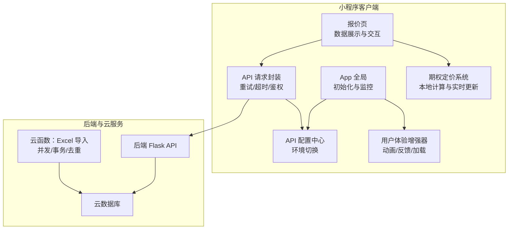
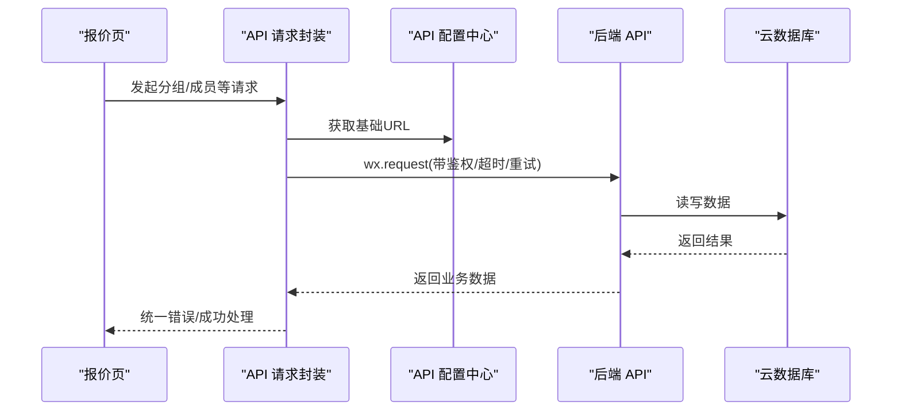
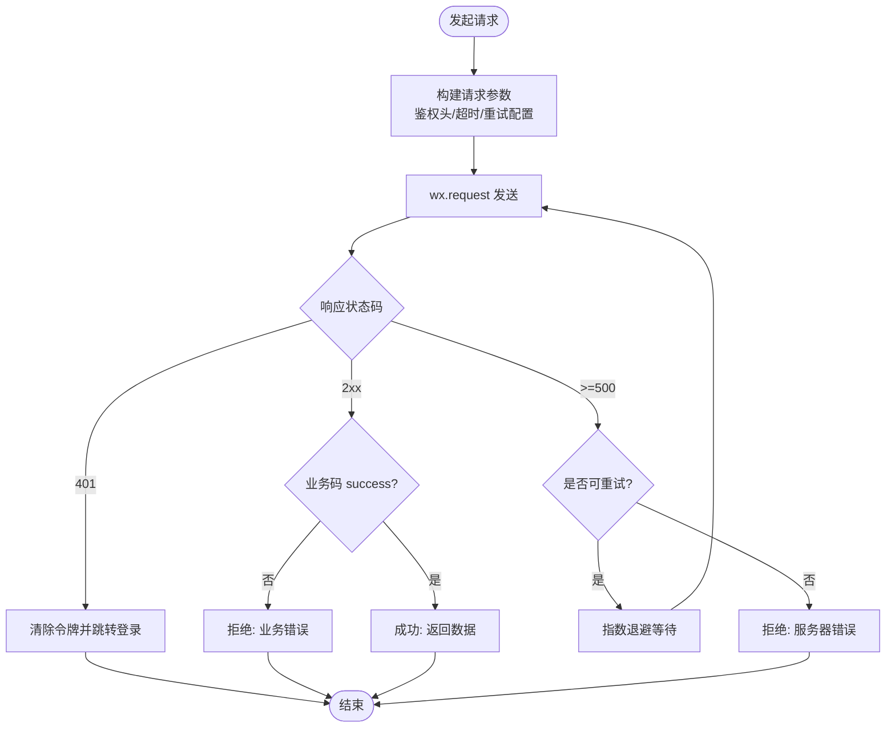
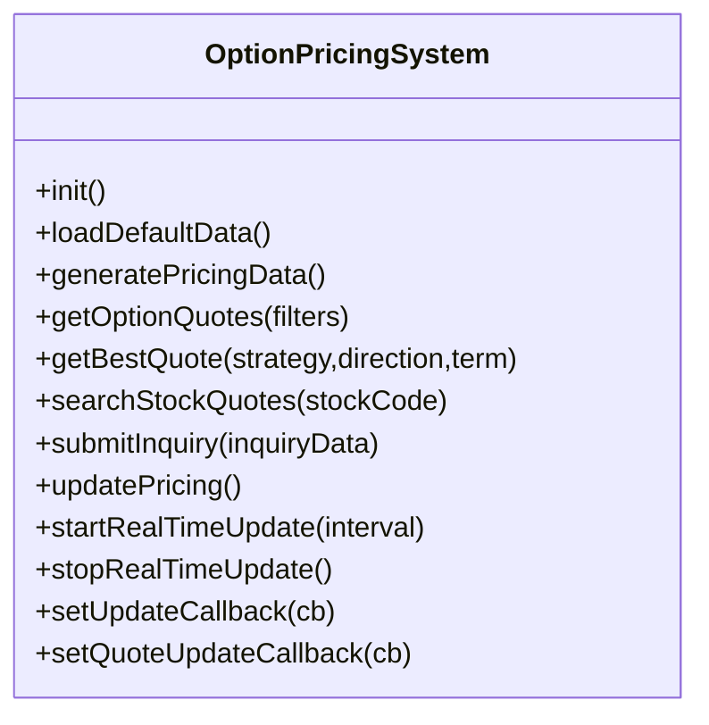
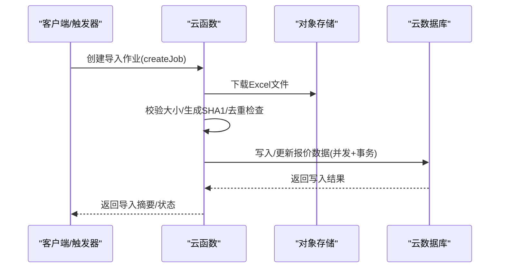
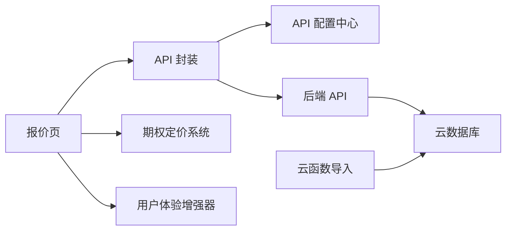

# 数据管理架构

<cite>
**本文引用的文件**
- [miniprogram/app.js](file://miniprogram/app.js)
- [miniprogram/config/api.config.js](file://miniprogram/config/api.config.js)
- [utils/request.js](file://utils/request.js)
- [miniprogram/utils/api-group.js](file://miniprogram/utils/api-group.js)
- [miniprogram/pages/quotes/quotes.js](file://miniprogram/pages/quotes/quotes.js)
- [miniprogram/utils/option-pricing.js](file://miniprogram/utils/option-pricing.js)
- [miniprogram/utils/inquiry-logic.js](file://miniprogram/utils/inquiry-logic.js)
- [miniprogram/utils/user-experience-enhancer.js](file://miniprogram/utils/user-experience-enhancer.js)
- [cloudfunctions/dataImporter/index.js](file://cloudfunctions/dataImporter/index.js)
</cite>

## 目录
1. [简介](#简介)
2. [项目结构](#项目结构)
3. [核心组件](#核心组件)
4. [架构总览](#架构总览)
5. [详细组件分析](#详细组件分析)
6. [依赖关系分析](#依赖关系分析)
7. [性能考量](#性能考量)
8. [故障排查指南](#故障排查指南)
9. [结论](#结论)
10. [附录](#附录)

## 简介
本文件系统性梳理微信小程序的数据管理架构，覆盖API请求封装、接口配置、网络请求管理、数据缓存与本地存储、数据同步、数据流与状态管理、错误重试与安全策略，并提供性能优化与调试建议。目标读者包括前端工程师、全栈开发者与技术负责人。

## 项目结构
小程序采用“页面-服务-工具-云函数”的分层组织方式：
- 页面层：负责UI渲染与用户交互，典型如报价页。
- 服务层：封装API请求与重试策略，统一管理请求头与超时。
- 工具层：提供环境配置、请求封装、用户体验增强、期权定价等通用能力。
- 云函数层：负责批量数据导入、去重、并发写入与事务控制。

图表来源
- [miniprogram/app.js](file://miniprogram/app.js#L1-L225)
- [miniprogram/config/api.config.js](file://miniprogram/config/api.config.js#L1-L90)
- [miniprogram/utils/api-group.js](file://miniprogram/utils/api-group.js#L1-L122)
- [miniprogram/utils/option-pricing.js](file://miniprogram/utils/option-pricing.js#L1-L347)
- [miniprogram/pages/quotes/quotes.js](file://miniprogram/pages/quotes/quotes.js#L1-L800)
- [cloudfunctions/dataImporter/index.js](file://cloudfunctions/dataImporter/index.js#L1-L392)

章节来源
- [miniprogram/app.js](file://miniprogram/app.js#L1-L225)
- [miniprogram/config/api.config.js](file://miniprogram/config/api.config.js#L1-L90)

## 核心组件
- API 配置中心：集中管理开发/生产环境的API基础URL，支持按需切换云端地址。
- API 请求封装：统一处理鉴权头、超时、重试、错误归一化与业务码校验。
- 期权定价系统：本地生成期权报价数据，支持筛选、排序与实时更新。
- 用户体验增强器：提供动画、消息提示、加载指示器与确认对话框等交互增强。
- 云函数数据导入：Excel 解析、字段映射、去重、并发写入与事务保障。

章节来源
- [miniprogram/config/api.config.js](file://miniprogram/config/api.config.js#L1-L90)
- [miniprogram/utils/api-group.js](file://miniprogram/utils/api-group.js#L1-L122)
- [miniprogram/utils/option-pricing.js](file://miniprogram/utils/option-pricing.js#L1-L347)
- [miniprogram/utils/user-experience-enhancer.js](file://miniprogram/utils/user-experience-enhancer.js#L1-L452)
- [cloudfunctions/dataImporter/index.js](file://cloudfunctions/dataImporter/index.js#L1-L392)

## 架构总览
小程序端通过API配置中心获取后端地址，请求封装统一处理鉴权与错误；报价页结合期权定价系统进行本地数据展示与交互；云函数负责批量数据导入与一致性保障。

图表来源
- [miniprogram/utils/api-group.js](file://miniprogram/utils/api-group.js#L31-L81)
- [miniprogram/config/api.config.js](file://miniprogram/config/api.config.js#L66-L82)
- [miniprogram/pages/quotes/quotes.js](file://miniprogram/pages/quotes/quotes.js#L774-L800)

## 详细组件分析

### API 请求封装与网络管理
- 统一鉴权：从本地存储读取令牌并注入请求头。
- 超时与重试：支持配置重试次数、退避延迟与超时时间；对特定状态码自动重试。
- 错误归一化：将失败场景统一为结构化错误对象，便于上层处理。
- 业务码校验：对后端返回的业务状态进行判定，异常时拒绝并透传业务错误。

图表来源
- [miniprogram/utils/api-group.js](file://miniprogram/utils/api-group.js#L24-L81)
- [utils/request.js](file://utils/request.js#L6-L61)

章节来源
- [miniprogram/utils/api-group.js](file://miniprogram/utils/api-group.js#L1-L122)
- [utils/request.js](file://utils/request.js#L1-L70)

### API 配置中心与环境切换
- 通过微信小程序账户信息判断当前环境，优先选择生产环境；否则回退到开发环境。
- 支持显式指定使用云端地址，便于灰度与测试。
- 提供获取完整URL与基础URL的工具方法，避免硬编码。

章节来源
- [miniprogram/config/api.config.js](file://miniprogram/config/api.config.js#L1-L90)

### 期权定价系统与本地数据流
- 本地生成报价数据：包含策略、方向、期限、隐含波动率、希腊字母等。
- 支持筛选与排序，便于矩阵视图展示。
- 实时更新：周期性更新与单点波动模拟，触发页面回调更新UI。
- 与页面交互：报价页通过系统实例获取数据、设置回调、启动/停止实时更新。

图表来源
- [miniprogram/utils/option-pricing.js](file://miniprogram/utils/option-pricing.js#L6-L347)

章节来源
- [miniprogram/utils/option-pricing.js](file://miniprogram/utils/option-pricing.js#L1-L347)
- [miniprogram/pages/quotes/quotes.js](file://miniprogram/pages/quotes/quotes.js#L1-L800)

### 用户体验增强器与状态管理
- 动画与反馈：提供多种预设动画、消息提示、加载指示器与确认对话框。
- 队列化反馈：避免多消息同时出现，提升交互稳定性。
- 配置化开关：可按需启用/禁用动画、触觉与语音反馈。

章节来源
- [miniprogram/utils/user-experience-enhancer.js](file://miniprogram/utils/user-experience-enhancer.js#L1-L452)

### 云函数数据导入与同步
- Excel 解析：支持复杂矩阵表头与常规表头两种解析路径。
- 去重与并发：基于文件SHA1去重，限制并发写入，避免内存溢出。
- 事务与作业：使用数据库事务锁定作业状态，保证导入过程一致性。
- 作业调度：按创建时间顺序批量处理待处理作业。

图表来源
- [cloudfunctions/dataImporter/index.js](file://cloudfunctions/dataImporter/index.js#L273-L318)
- [cloudfunctions/dataImporter/index.js](file://cloudfunctions/dataImporter/index.js#L320-L340)

章节来源
- [cloudfunctions/dataImporter/index.js](file://cloudfunctions/dataImporter/index.js#L1-L392)

### 分组与收藏逻辑（本地状态管理）
- 分组管理：提供新建、重命名、删除、迁移等逻辑，保护系统分组不可变更。
- 收藏与分组计数：根据收藏集合计算各分组成员数量，支持“我的持仓”等特殊分组。
- 本地存储：使用微信本地存储保存自定义分组与收藏列表，页面加载时读取并格式化。

章节来源
- [miniprogram/utils/inquiry-logic.js](file://miniprogram/utils/inquiry-logic.js#L1-L204)
- [miniprogram/pages/quotes/quotes.js](file://miniprogram/pages/quotes/quotes.js#L588-L720)

## 依赖关系分析
- 页面依赖服务：报价页依赖API封装与期权定价系统。
- 服务依赖配置：API封装依赖配置中心以获取基础URL。
- 工具相互独立：用户体验增强器与期权定价系统解耦，便于复用。
- 云函数独立运行：数据导入逻辑与小程序端解耦，通过云数据库交互。

图表来源
- [miniprogram/pages/quotes/quotes.js](file://miniprogram/pages/quotes/quotes.js#L1-L800)
- [miniprogram/utils/api-group.js](file://miniprogram/utils/api-group.js#L1-L122)
- [miniprogram/config/api.config.js](file://miniprogram/config/api.config.js#L1-L90)
- [miniprogram/utils/option-pricing.js](file://miniprogram/utils/option-pricing.js#L1-L347)
- [miniprogram/utils/user-experience-enhancer.js](file://miniprogram/utils/user-experience-enhancer.js#L1-L452)
- [cloudfunctions/dataImporter/index.js](file://cloudfunctions/dataImporter/index.js#L1-L392)

## 性能考量
- 启动阶段懒加载与预加载：App在启动后异步预加载关键资源，避免阻塞主线程。
- 内存告警处理：监听内存警告事件，主动清理低优先级缓存。
- 请求重试与退避：对网络超时、限流与5xx错误进行指数退避重试，降低抖动。
- 并发与批处理：云函数限制并发与批次大小，避免OOM与长事务。
- 实时更新节流：报价系统周期性更新与单点波动，避免频繁重绘。

章节来源
- [miniprogram/app.js](file://miniprogram/app.js#L92-L175)
- [miniprogram/utils/api-group.js](file://miniprogram/utils/api-group.js#L24-L81)
- [cloudfunctions/dataImporter/index.js](file://cloudfunctions/dataImporter/index.js#L24-L35)

## 故障排查指南
- 401 未授权：移除本地令牌并跳转登录页；检查鉴权头是否正确注入。
- 业务错误：查看后端返回的业务码与消息，定位具体失败原因。
- 网络错误：检查超时配置与重试策略；关注状态码0（网络失败）。
- 服务器错误：观察5xx错误是否触发重试；必要时降低并发或增加重试次数。
- 云函数导入失败：检查文件大小限制、SHA1去重、作业状态与事务回滚信息。

章节来源
- [utils/request.js](file://utils/request.js#L44-L55)
- [miniprogram/utils/api-group.js](file://miniprogram/utils/api-group.js#L66-L78)
- [cloudfunctions/dataImporter/index.js](file://cloudfunctions/dataImporter/index.js#L276-L318)

## 结论
该小程序采用清晰的分层架构：页面专注交互，服务统一请求与重试，工具提供通用能力，云函数保障数据导入的一致性与性能。通过配置中心与请求封装实现环境隔离与错误治理，结合本地缓存与实时更新满足交互需求。建议持续优化重试策略、引入请求拦截与响应拦截器、完善错误上报与埋点，进一步提升稳定性与可观测性。

## 附录
- 最佳实践
  - 使用配置中心集中管理API地址，避免硬编码。
  - 对所有网络请求统一注入鉴权头与用户ID，便于追踪与风控。
  - 对易失败接口开启重试与退避，合理设置超时与最大重试次数。
  - 本地状态与远端状态分离，明确脏标记与同步策略。
  - 云函数严格限制并发与批次大小，使用事务与幂等设计。
- 安全与隐私
  - 令牌存储于本地，避免明文日志；401时立即清理。
  - 传输建议使用HTTPS（配置中心与API封装已默认）。
  - 云函数对输入文件进行大小与去重校验，防止滥用。
- 调试方法
  - 使用App全局错误捕获与性能监控，定期输出性能报告。
  - 页面与服务层打印请求日志，定位失败节点。
  - 云函数记录作业状态与摘要，便于回溯与重试。