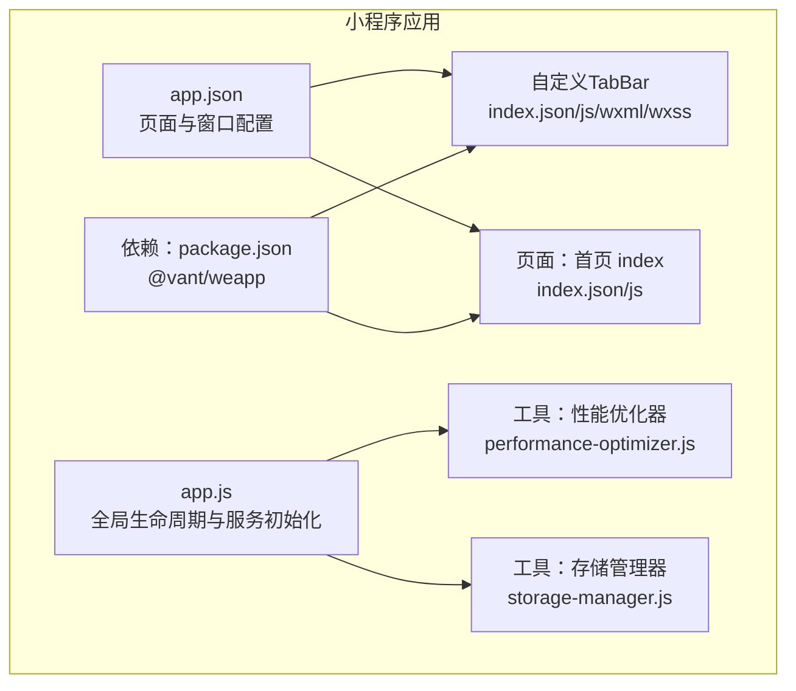
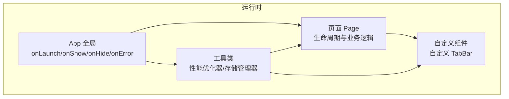
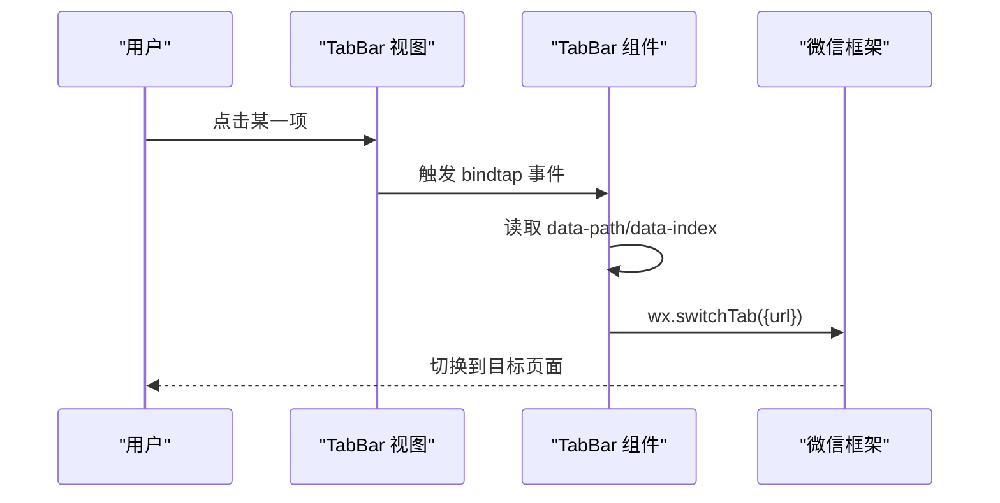
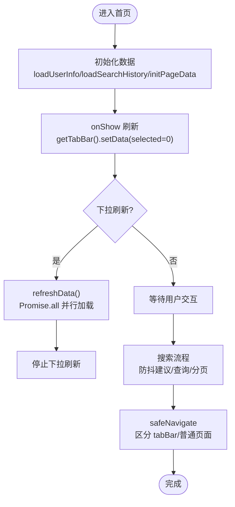
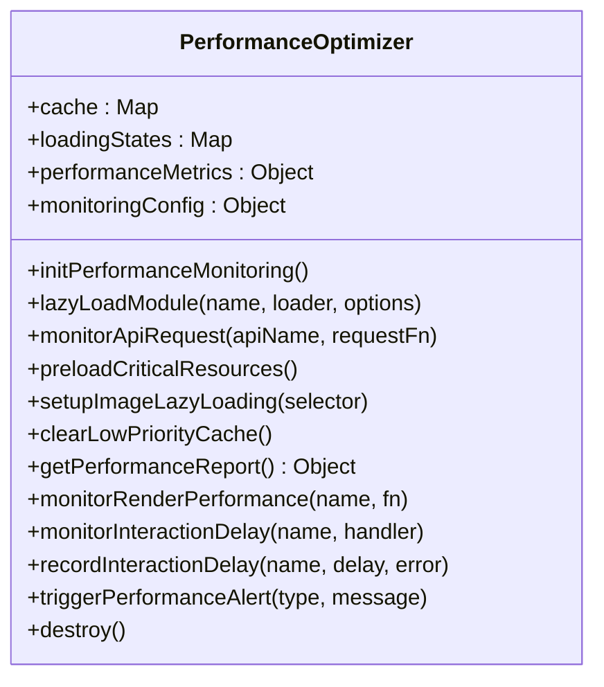
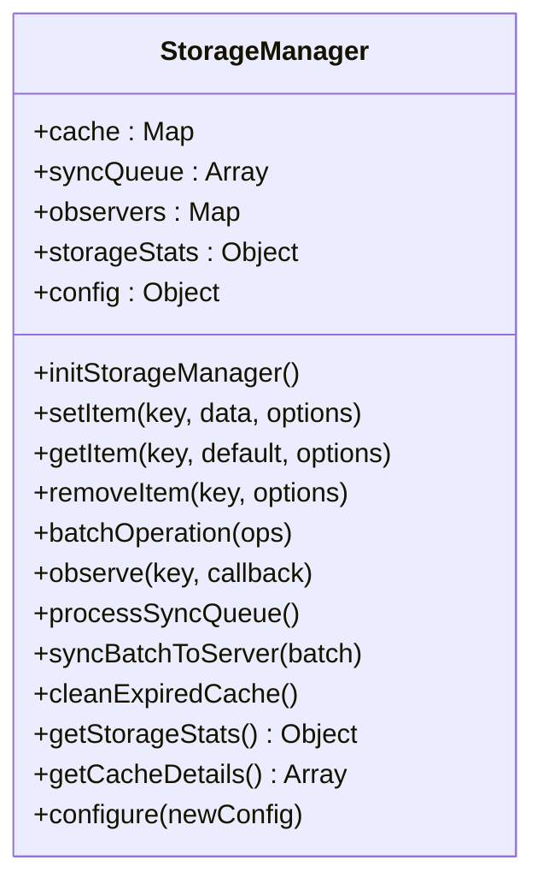
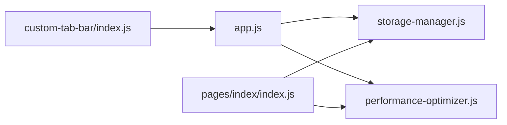

# 组件系统架构

<cite>
**本文引用的文件**
- [miniprogram/app.json](file://miniprogram/app.json)
- [miniprogram/package.json](file://miniprogram/package.json)
- [miniprogram/custom-tab-bar/index.json](file://miniprogram/custom-tab-bar/index.json)
- [miniprogram/custom-tab-bar/index.js](file://miniprogram/custom-tab-bar/index.js)
- [miniprogram/custom-tab-bar/index.wxml](file://miniprogram/custom-tab-bar/index.wxml)
- [miniprogram/custom-tab-bar/index.wxss](file://miniprogram/custom-tab-bar/index.wxss)
- [miniprogram/pages/index/index.json](file://miniprogram/pages/index/index.json)
- [miniprogram/pages/index/index.js](file://miniprogram/pages/index/index.js)
- [miniprogram/utils/performance-optimizer.js](file://miniprogram/utils/performance-optimizer.js)
- [miniprogram/utils/storage-manager.js](file://miniprogram/utils/storage-manager.js)
- [miniprogram/app.js](file://miniprogram/app.js)
</cite>

## 目录
1. [简介](#简介)
2. [项目结构](#项目结构)
3. [核心组件](#核心组件)
4. [架构总览](#架构总览)
5. [详细组件分析](#详细组件分析)
6. [依赖关系分析](#依赖关系分析)
7. [性能考量](#性能考量)
8. [故障排查指南](#故障排查指南)
9. [结论](#结论)
10. [附录](#附录)

## 简介
本文件面向微信小程序“组件系统架构”，聚焦以下目标：
- Vant Weapp 组件库的集成与使用现状
- 自定义组件的设计模式、属性配置与事件处理机制
- 组件间通信与数据传递策略
- 原生组件与自定义组件的协同开发与复用机制
- 状态管理、生命周期钩子与性能优化技巧
- 组件开发规范、样式定制与主题配置
- 组件测试方法、调试技巧与最佳实践

说明：当前仓库中未发现 Vant Weapp 的显式使用痕迹；本文在“集成使用”部分以通用实践进行阐述，并结合现有自定义 TabBar 组件与页面逻辑给出可落地的参考方案。

## 项目结构
小程序采用标准分层组织：页面、组件、工具类与全局配置。关键节点如下：
- 全局配置：app.json 定义页面、导航栏、tabBar、权限与超时等
- 自定义 TabBar：独立组件，通过自定义渲染替代默认 tabBar
- 页面：如首页 index，承载业务数据与交互逻辑
- 工具类：性能优化器与存储管理器，提供跨页面复用能力
- 依赖声明：package.json 引入 @vant/weapp

图表来源
- [miniprogram/app.json](file://miniprogram/app.json#L1-L78)
- [miniprogram/app.js](file://miniprogram/app.js#L1-L225)
- [miniprogram/custom-tab-bar/index.json](file://miniprogram/custom-tab-bar/index.json#L1-L3)
- [miniprogram/custom-tab-bar/index.js](file://miniprogram/custom-tab-bar/index.js#L1-L31)
- [miniprogram/custom-tab-bar/index.wxml](file://miniprogram/custom-tab-bar/index.wxml#L1-L7)
- [miniprogram/custom-tab-bar/index.wxss](file://miniprogram/custom-tab-bar/index.wxss#L1-L52)
- [miniprogram/pages/index/index.json](file://miniprogram/pages/index/index.json#L1-L6)
- [miniprogram/pages/index/index.js](file://miniprogram/pages/index/index.js#L1-L710)
- [miniprogram/utils/performance-optimizer.js](file://miniprogram/utils/performance-optimizer.js#L1-L817)
- [miniprogram/utils/storage-manager.js](file://miniprogram/utils/storage-manager.js#L1-L776)
- [miniprogram/package.json](file://miniprogram/package.json#L1-L15)

章节来源
- [miniprogram/app.json](file://miniprogram/app.json#L1-L78)
- [miniprogram/package.json](file://miniprogram/package.json#L1-L15)

## 核心组件
- 自定义 TabBar 组件：通过 Component 定义，提供图标、文本与颜色切换，绑定点击事件触发页面跳转
- 首页 Page：承载用户信息、搜索、轮播图、快捷功能、热门期权与持仓案例等业务数据与交互
- 工具类组件：
  - 性能优化器：提供懒加载、API 监控、渲染监控、缓存与内存告警等能力
  - 存储管理器：提供智能缓存、批量操作、观察者模式、压缩/加密与同步队列等能力

章节来源
- [miniprogram/custom-tab-bar/index.js](file://miniprogram/custom-tab-bar/index.js#L1-L31)
- [miniprogram/pages/index/index.js](file://miniprogram/pages/index/index.js#L1-L710)
- [miniprogram/utils/performance-optimizer.js](file://miniprogram/utils/performance-optimizer.js#L1-L817)
- [miniprogram/utils/storage-manager.js](file://miniprogram/utils/storage-manager.js#L1-L776)

## 架构总览
整体架构围绕“页面-组件-工具”的三层设计展开，配合全局 App 生命周期与配置文件，形成统一的运行时环境。

图表来源
- [miniprogram/app.js](file://miniprogram/app.js#L1-L225)
- [miniprogram/pages/index/index.js](file://miniprogram/pages/index/index.js#L1-L710)
- [miniprogram/custom-tab-bar/index.js](file://miniprogram/custom-tab-bar/index.js#L1-L31)
- [miniprogram/utils/performance-optimizer.js](file://miniprogram/utils/performance-optimizer.js#L1-L817)
- [miniprogram/utils/storage-manager.js](file://miniprogram/utils/storage-manager.js#L1-L776)

## 详细组件分析

### 自定义 TabBar 组件
- 设计要点
  - 通过 Component 定义，data 包含列表、颜色与选中态；methods 提供 switchTab 事件处理
  - wxml 使用 wx:for 渲染列表，绑定 bindtap 事件
  - wxss 使用 mask-image 实现 SVG 图标着色与过渡动画
- 属性与事件
  - 属性：list（数组）、color（字符串）、selectedColor（字符串）、selected（数字）
  - 事件：bindtap（内部封装为 switchTab，透传到 wx.switchTab）
- 数据流
  - 列表数据来自组件 data.list，点击事件通过 data-path 与 data-index 传递给 switchTab
  - switchTab 调用 wx.switchTab，实现 tabBar 页面跳转

图表来源
- [miniprogram/custom-tab-bar/index.wxml](file://miniprogram/custom-tab-bar/index.wxml#L1-L7)
- [miniprogram/custom-tab-bar/index.js](file://miniprogram/custom-tab-bar/index.js#L24-L30)

章节来源
- [miniprogram/custom-tab-bar/index.json](file://miniprogram/custom-tab-bar/index.json#L1-L3)
- [miniprogram/custom-tab-bar/index.js](file://miniprogram/custom-tab-bar/index.js#L1-L31)
- [miniprogram/custom-tab-bar/index.wxml](file://miniprogram/custom-tab-bar/index.wxml#L1-L7)
- [miniprogram/custom-tab-bar/index.wxss](file://miniprogram/custom-tab-bar/index.wxss#L1-L52)

### 首页 Page（index）
- 页面配置
  - index.json 控制标题、下拉刷新、背景色与文字样式
- 数据与状态
  - 用户信息、搜索结果、轮播图、快捷功能、热门期权、持仓案例与加载状态
- 生命周期
  - onLoad 初始化数据；onShow 刷新；onPullDownRefresh 下拉刷新
- 事件处理
  - 搜索输入、建议、历史、高级筛选、查看更多、轮播图点击、快捷功能与指数/期权卡片点击
- 导航策略
  - safeNavigate 统一封装，区分 tabBar 与普通页面跳转；支持参数透传至全局 pendingQuoteParams

图表来源
- [miniprogram/pages/index/index.json](file://miniprogram/pages/index/index.json#L1-L6)
- [miniprogram/pages/index/index.js](file://miniprogram/pages/index/index.js#L267-L323)
- [miniprogram/pages/index/index.js](file://miniprogram/pages/index/index.js#L444-L575)
- [miniprogram/pages/index/index.js](file://miniprogram/pages/index/index.js#L225-L265)

章节来源
- [miniprogram/pages/index/index.json](file://miniprogram/pages/index/index.json#L1-L6)
- [miniprogram/pages/index/index.js](file://miniprogram/pages/index/index.js#L1-L710)

### 工具类组件：性能优化器（PerformanceOptimizer）
- 能力概览
  - 懒加载模块、API 请求监控、图片懒加载、分包预下载、缓存与内存告警、渲染与交互延迟监控、性能报告生成
- 关键接口
  - lazyLoad、monitorApi、preloadCritical、setupImageLazy、clearCache、getReport、monitorRender
- 性能监控维度
  - 页面加载时间、API 响应时间、缓存命中率、渲染时间、交互延迟、网络速度、内存使用

图表来源
- [miniprogram/utils/performance-optimizer.js](file://miniprogram/utils/performance-optimizer.js#L1-L817)

章节来源
- [miniprogram/utils/performance-optimizer.js](file://miniprogram/utils/performance-optimizer.js#L1-L817)

### 工具类组件：存储管理器（StorageManager）
- 能力概览
  - 智能缓存、批量操作、观察者模式、压缩/加密、同步队列、LRU 淘汰、过期清理、统计与配置
- 关键接口
  - setItem/getItem/removeItem/batchOperation/syncAllData/clearAll/observe/getStorageStats/getCacheDetails/configure
- 生命周期与监听
  - 定时清理、周期同步、应用隐藏/显示事件监听

图表来源
- [miniprogram/utils/storage-manager.js](file://miniprogram/utils/storage-manager.js#L1-L776)

章节来源
- [miniprogram/utils/storage-manager.js](file://miniprogram/utils/storage-manager.js#L1-L776)

### Vant Weapp 组件库的集成与使用（通用实践）
- 安装与启用
  - 通过 package.json 引入 @vant/weapp；在 app.json 中按需启用相应组件（如在页面或自定义组件中引入）
- 组件属性与事件
  - 通过 json 的 componentGenerics 启用泛型；在 wxml 中使用组件标签，绑定属性与事件
- 主题与样式
  - 通过全局 wxss 或页面 wxss 覆盖变量；使用 less/scss 时注意构建链路
- 事件处理
  - 在 js 中监听组件触发的事件，更新页面 data 并触发 setData
- 注意事项
  - 避免在 setData 中频繁变更大对象；合理拆分状态与局部更新
  - 对于复杂交互，结合性能优化器的监控能力定位瓶颈

章节来源
- [miniprogram/package.json](file://miniprogram/package.json#L1-L15)
- [miniprogram/app.json](file://miniprogram/app.json#L1-L78)

## 依赖关系分析
- 全局 App 依赖工具类：在 onLaunch 中初始化存储管理器、性能优化器与 UI 增强器
- 页面依赖工具类：首页在数据加载与交互中使用性能监控与格式化工具
- 自定义组件依赖全局配置：通过 app.globalData 传递参数（如报价跳转参数）

图表来源
- [miniprogram/app.js](file://miniprogram/app.js#L44-L62)
- [miniprogram/pages/index/index.js](file://miniprogram/pages/index/index.js#L1-L710)
- [miniprogram/custom-tab-bar/index.js](file://miniprogram/custom-tab-bar/index.js#L1-L31)
- [miniprogram/utils/storage-manager.js](file://miniprogram/utils/storage-manager.js#L1-L776)
- [miniprogram/utils/performance-optimizer.js](file://miniprogram/utils/performance-optimizer.js#L1-L817)

章节来源
- [miniprogram/app.js](file://miniprogram/app.js#L1-L225)
- [miniprogram/pages/index/index.js](file://miniprogram/pages/index/index.js#L1-L710)
- [miniprogram/custom-tab-bar/index.js](file://miniprogram/custom-tab-bar/index.js#L1-L31)

## 性能考量
- 懒加载与缓存
  - 使用性能优化器的 lazyLoad 与缓存命中率统计，降低首屏与关键路径负载
- API 与渲染监控
  - monitorApi 与 monitorRender 提供响应时间与渲染耗时的量化指标
- 内存与网络
  - onMemoryWarning 触发清理低优先级缓存；网络状态变化时清理 API 缓存
- 存储与同步
  - 存储管理器的批量操作与同步队列，减少主线程阻塞与网络抖动影响

章节来源
- [miniprogram/utils/performance-optimizer.js](file://miniprogram/utils/performance-optimizer.js#L42-L64)
- [miniprogram/utils/performance-optimizer.js](file://miniprogram/utils/performance-optimizer.js#L288-L301)
- [miniprogram/utils/performance-optimizer.js](file://miniprogram/utils/performance-optimizer.js#L537-L567)
- [miniprogram/utils/storage-manager.js](file://miniprogram/utils/storage-manager.js#L470-L496)

## 故障排查指南
- 全局错误捕获
  - App.onError 记录错误并增加计数，便于后续上报与分析
- 页面生命周期
  - onShow/onHide 中触发存储同步与数据检查，避免后台长时间驻留导致数据不同步
- 组件事件
  - 自定义 TabBar 的 switchTab 事件需确保 data-path 正确传递；首页 safeNavigate 需区分 tabBar 与普通页面跳转
- 性能告警
  - 性能优化器会根据阈值触发告警，结合 getPerformanceReport 定位慢点

章节来源
- [miniprogram/app.js](file://miniprogram/app.js#L191-L198)
- [miniprogram/app.js](file://miniprogram/app.js#L184-L189)
- [miniprogram/custom-tab-bar/index.js](file://miniprogram/custom-tab-bar/index.js#L24-L30)
- [miniprogram/pages/index/index.js](file://miniprogram/pages/index/index.js#L225-L265)
- [miniprogram/utils/performance-optimizer.js](file://miniprogram/utils/performance-optimizer.js#L694-L715)

## 结论
本项目通过自定义 TabBar 与首页 Page 形成清晰的入口与导航体验，借助性能优化器与存储管理器实现跨页面的可维护性与稳定性。对于 Vant Weapp 的集成，建议在现有工程化基础上按需引入并遵循统一的主题与事件处理规范，以保证一致性与可扩展性。

## 附录
- 组件开发规范
  - 属性命名与默认值：在 json 中声明 defaults；在 js 中校验与回退
  - 事件命名：采用 onXxx 模式；避免在事件中直接操作 DOM
  - 状态拆分：将大对象拆分为小粒度状态，减少 setData 范围
- 样式定制与主题
  - 使用全局 wxss 定义变量；组件内通过 class 与内联样式组合
  - 对于第三方组件，遵循其提供的主题变量与覆盖规则
- 测试与调试
  - 单元测试：对工具类方法进行隔离测试（懒加载、缓存、序列化）
  - 集成测试：模拟页面生命周期与组件事件流
  - 调试技巧：利用性能报告与内存告警定位问题；在关键路径埋点监控