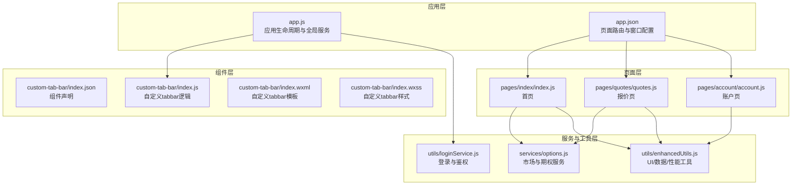
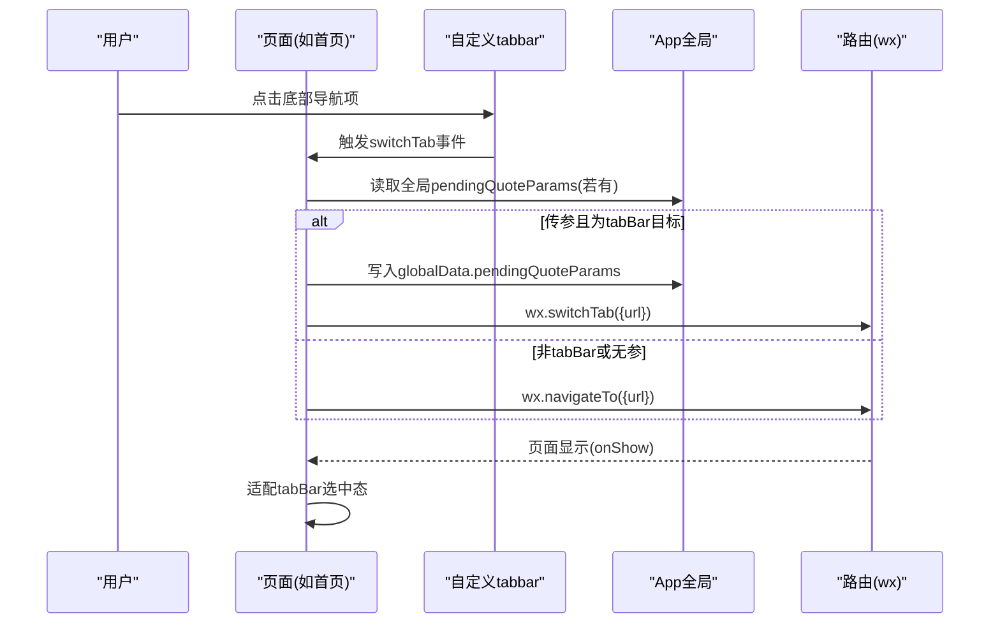
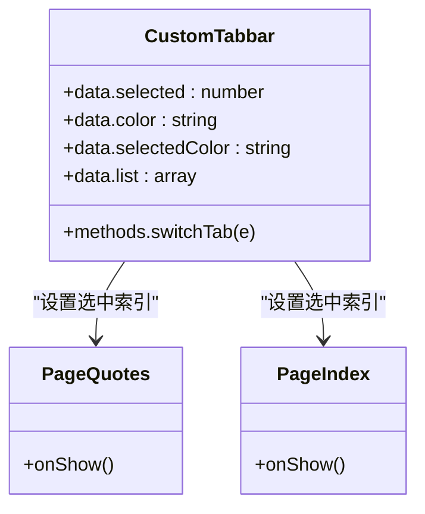
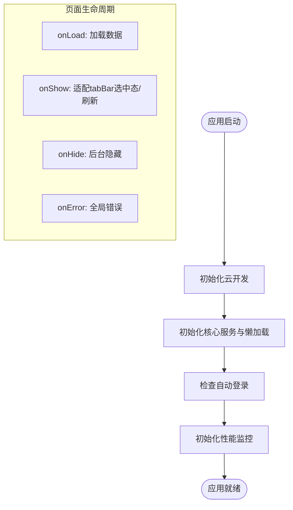
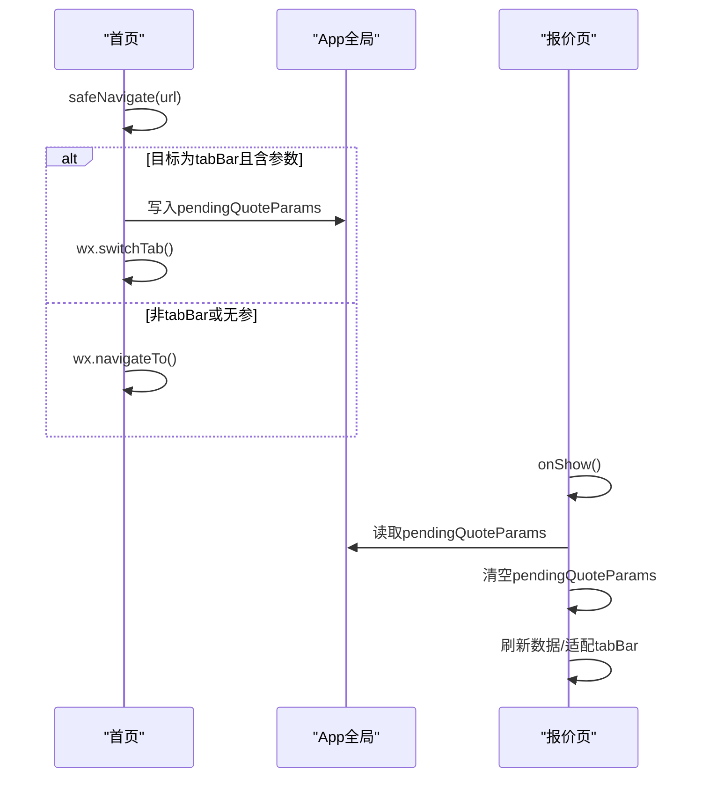
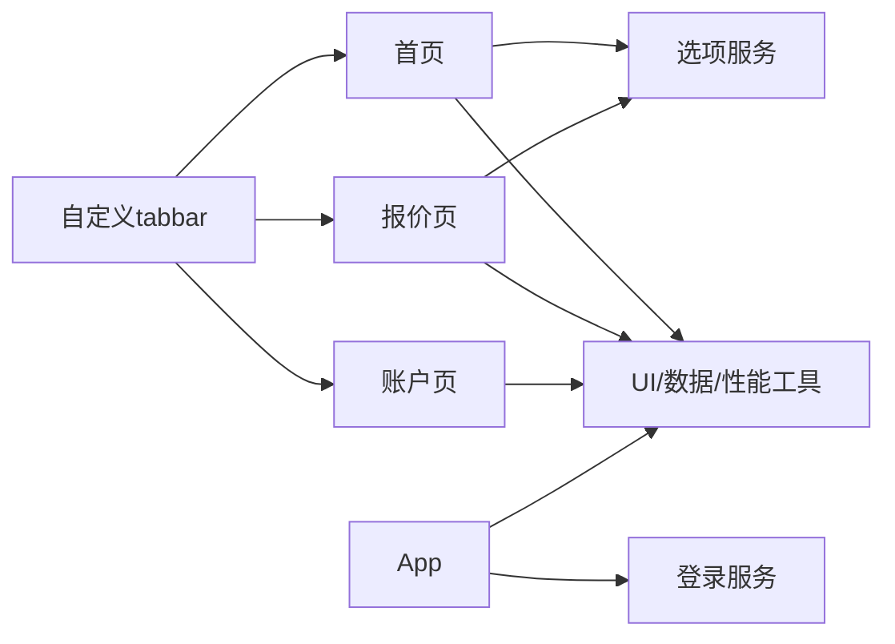

# 页面系统架构

<cite>
**本文引用的文件**
- [miniprogram/app.json](file://miniprogram/app.json)
- [miniprogram/app.js](file://miniprogram/app.js)
- [miniprogram/custom-tab-bar/index.json](file://miniprogram/custom-tab-bar/index.json)
- [miniprogram/custom-tab-bar/index.js](file://miniprogram/custom-tab-bar/index.js)
- [miniprogram/custom-tab-bar/index.wxml](file://miniprogram/custom-tab-bar/index.wxml)
- [miniprogram/custom-tab-bar/index.wxss](file://miniprogram/custom-tab-bar/index.wxss)
- [miniprogram/pages/index/index.js](file://miniprogram/pages/index/index.js)
- [miniprogram/pages/quotes/quotes.js](file://miniprogram/pages/quotes/quotes.js)
- [miniprogram/pages/account/account.js](file://miniprogram/pages/account/account.js)
- [miniprogram/utils/enhancedUtils.js](file://miniprogram/utils/enhancedUtils.js)
- [miniprogram/services/options.js](file://miniprogram/services/options.js)
- [miniprogram/utils/loginService.js](file://miniprogram/utils/loginService.js)
</cite>

## 目录
1. [简介](#简介)
2. [项目结构](#项目结构)
3. [核心组件](#核心组件)
4. [架构总览](#架构总览)
5. [详细组件分析](#详细组件分析)
6. [依赖关系分析](#依赖关系分析)
7. [性能考量](#性能考量)
8. [故障排查指南](#故障排查指南)
9. [结论](#结论)
10. [附录](#附录)

## 简介
本文件系统性梳理微信小程序页面系统架构，围绕页面路由配置、页面生命周期管理、页面间通信机制展开；深入解析自定义tabbar的实现原理、图标资源管理与状态切换逻辑；文档化页面结构设计、导航栏配置与背景样式设置；解释页面权限配置、网络超时设置与调试模式配置；并提供页面开发规范、性能优化策略与用户体验设计原则，以及页面路由跳转、参数传递与页面缓存的最佳实践。

## 项目结构
小程序采用分层与按功能域组织的结构：
- 应用层：全局入口与配置，负责应用生命周期、全局服务初始化与性能监控
- 页面层：各业务页面（首页、报价、账户、个人中心等），承载业务逻辑与交互
- 组件层：自定义tabbar组件，统一底部导航
- 服务与工具层：选项服务、UI增强与数据格式化、登录服务等

图表来源
- [miniprogram/app.json](file://miniprogram/app.json#L1-L78)
- [miniprogram/app.js](file://miniprogram/app.js#L1-L225)
- [miniprogram/custom-tab-bar/index.json](file://miniprogram/custom-tab-bar/index.json#L1-L3)
- [miniprogram/custom-tab-bar/index.js](file://miniprogram/custom-tab-bar/index.js#L1-L31)
- [miniprogram/custom-tab-bar/index.wxml](file://miniprogram/custom-tab-bar/index.wxml#L1-L7)
- [miniprogram/custom-tab-bar/index.wxss](file://miniprogram/custom-tab-bar/index.wxss#L1-L52)
- [miniprogram/pages/index/index.js](file://miniprogram/pages/index/index.js#L1-L710)
- [miniprogram/pages/quotes/quotes.js](file://miniprogram/pages/quotes/quotes.js#L1-L800)
- [miniprogram/pages/account/account.js](file://miniprogram/pages/account/account.js#L1-L177)
- [miniprogram/services/options.js](file://miniprogram/services/options.js#L1-L231)
- [miniprogram/utils/enhancedUtils.js](file://miniprogram/utils/enhancedUtils.js#L1-L239)
- [miniprogram/utils/loginService.js](file://miniprogram/utils/loginService.js#L1-L492)

章节来源
- [miniprogram/app.json](file://miniprogram/app.json#L1-L78)
- [miniprogram/app.js](file://miniprogram/app.js#L1-L225)

## 核心组件
- 应用入口与生命周期
  - 全局App初始化、云开发环境初始化、核心服务实例化与懒加载、性能监控与内存告警处理、全局错误捕获
- 自定义tabbar
  - 组件化封装，数据驱动渲染，状态切换与点击跳转
- 页面路由与窗口配置
  - 页面清单、窗口样式、tabBar自定义、权限与网络超时、调试开关
- 页面业务逻辑
  - 首页：轮播图、快捷功能、搜索与历史、市场指数与热门期权、持仓案例与知识
  - 报价页：自选/指数/ETF矩阵视图、期权报价、交易商与期限筛选、下单弹窗
  - 账户页：账户切换、资产概览、持仓列表与筛选
- 服务与工具
  - 选项服务：市场指数、热门期权、搜索与建议、期权链
  - UI增强与数据格式化：Toast、导航标题、节流防抖、百分比/金额/体积格式化、性能监控
  - 登录服务：微信/QQ/手机登录、Token刷新与校验、自动登录、登出与状态清理

章节来源
- [miniprogram/app.js](file://miniprogram/app.js#L1-L225)
- [miniprogram/custom-tab-bar/index.js](file://miniprogram/custom-tab-bar/index.js#L1-L31)
- [miniprogram/app.json](file://miniprogram/app.json#L1-L78)
- [miniprogram/pages/index/index.js](file://miniprogram/pages/index/index.js#L1-L710)
- [miniprogram/pages/quotes/quotes.js](file://miniprogram/pages/quotes/quotes.js#L1-L800)
- [miniprogram/pages/account/account.js](file://miniprogram/pages/account/account.js#L1-L177)
- [miniprogram/services/options.js](file://miniprogram/services/options.js#L1-L231)
- [miniprogram/utils/enhancedUtils.js](file://miniprogram/utils/enhancedUtils.js#L1-L239)
- [miniprogram/utils/loginService.js](file://miniprogram/utils/loginService.js#L1-L492)

## 架构总览
小程序页面系统采用“配置驱动 + 组件化 + 服务化”的架构：
- 配置驱动：app.json集中声明页面、窗口样式、tabBar、权限、网络超时与调试开关
- 组件化：自定义tabbar组件独立维护，通过数据与事件与页面解耦
- 服务化：页面通过服务与工具模块进行数据获取、UI增强与性能监控

图表来源
- [miniprogram/pages/index/index.js](file://miniprogram/pages/index/index.js#L225-L265)
- [miniprogram/pages/quotes/quotes.js](file://miniprogram/pages/quotes/quotes.js#L193-L220)
- [miniprogram/custom-tab-bar/index.js](file://miniprogram/custom-tab-bar/index.js#L24-L30)
- [miniprogram/app.js](file://miniprogram/app.js#L17-L17)

章节来源
- [miniprogram/app.json](file://miniprogram/app.json#L31-L63)
- [miniprogram/custom-tab-bar/index.wxml](file://miniprogram/custom-tab-bar/index.wxml#L1-L7)
- [miniprogram/custom-tab-bar/index.wxss](file://miniprogram/custom-tab-bar/index.wxss#L1-L52)

## 详细组件分析

### 自定义tabbar实现原理与状态切换
- 组件声明与渲染
  - 组件通过index.json声明为组件，index.wxml使用列表渲染与数据绑定，index.wxss提供样式与过渡动画
- 状态与切换逻辑
  - 组件内部维护selected索引、颜色与列表数据；点击事件触发switchTab，调用wx.switchTab跳转至目标页面
  - 页面onShow中通过getTabBar().setData同步选中态，确保与当前页面一致
- 图标资源管理
  - 支持静态图片与SVG内联Base64两种形式；通过CSS的mask-image实现图标着色与主题切换

图表来源
- [miniprogram/custom-tab-bar/index.js](file://miniprogram/custom-tab-bar/index.js#L1-L31)
- [miniprogram/custom-tab-bar/index.wxml](file://miniprogram/custom-tab-bar/index.wxml#L1-L7)
- [miniprogram/custom-tab-bar/index.wxss](file://miniprogram/custom-tab-bar/index.wxss#L1-L52)
- [miniprogram/pages/quotes/quotes.js](file://miniprogram/pages/quotes/quotes.js#L193-L220)
- [miniprogram/pages/index/index.js](file://miniprogram/pages/index/index.js#L274-L283)

章节来源
- [miniprogram/custom-tab-bar/index.json](file://miniprogram/custom-tab-bar/index.json#L1-L3)
- [miniprogram/custom-tab-bar/index.js](file://miniprogram/custom-tab-bar/index.js#L1-L31)
- [miniprogram/custom-tab-bar/index.wxml](file://miniprogram/custom-tab-bar/index.wxml#L1-L7)
- [miniprogram/custom-tab-bar/index.wxss](file://miniprogram/custom-tab-bar/index.wxss#L1-L52)
- [miniprogram/pages/quotes/quotes.js](file://miniprogram/pages/quotes/quotes.js#L193-L220)
- [miniprogram/pages/index/index.js](file://miniprogram/pages/index/index.js#L274-L283)

### 页面路由配置与生命周期管理
- 路由配置
  - app.json中pages定义页面清单；window配置导航栏样式与背景；tabBar启用custom并配置颜色、背景与列表项
- 生命周期
  - App.onLaunch：初始化云开发、核心服务、性能监控与自动登录
  - 页面onLoad/onShow：加载数据、适配tabBar选中态、刷新数据
  - App.onHide/App.onShow：前台/后台切换时的数据同步与存储管理
  - App.onError：全局错误捕获与计数

图表来源
- [miniprogram/app.js](file://miniprogram/app.js#L25-L175)
- [miniprogram/pages/index/index.js](file://miniprogram/pages/index/index.js#L267-L283)
- [miniprogram/pages/quotes/quotes.js](file://miniprogram/pages/quotes/quotes.js#L168-L220)
- [miniprogram/app.json](file://miniprogram/app.json#L24-L30)

章节来源
- [miniprogram/app.json](file://miniprogram/app.json#L1-L78)
- [miniprogram/app.js](file://miniprogram/app.js#L1-L225)

### 页面间通信机制与参数传递
- 全局参数透传
  - 首页safeNavigate对tabBar目标进行判断，若携带查询参数则写入app.globalData.pendingQuoteParams，报价页onShow中读取并清空
- 页面内参数传递
  - 首页/报价页通过wx.navigateTo/wx.switchTab传递参数；报价页handleNavigationParams解析stock或code/name等参数并更新当前股票信息
- 本地存储与状态
  - 自选列表、搜索历史、分组管理等通过本地存储维护，页面onShow中读取与刷新

图表来源
- [miniprogram/pages/index/index.js](file://miniprogram/pages/index/index.js#L225-L265)
- [miniprogram/pages/quotes/quotes.js](file://miniprogram/pages/quotes/quotes.js#L201-L220)
- [miniprogram/app.js](file://miniprogram/app.js#L17-L17)

章节来源
- [miniprogram/pages/index/index.js](file://miniprogram/pages/index/index.js#L225-L265)
- [miniprogram/pages/quotes/quotes.js](file://miniprogram/pages/quotes/quotes.js#L222-L269)

### 页面结构设计、导航栏与背景样式
- 导航栏配置
  - backgroundColor、navigationBarTitleText、navigationBarTextStyle、navigationBarBackgroundColor
- 背景样式
  - backgroundColor与window.backgroundTextStyle
- 自定义tabbar
  - custom: true启用自定义tabbar，颜色与边框样式由tabBar配置与组件样式共同决定

章节来源
- [miniprogram/app.json](file://miniprogram/app.json#L24-L30)
- [miniprogram/app.json](file://miniprogram/app.json#L31-L63)
- [miniprogram/custom-tab-bar/index.wxss](file://miniprogram/custom-tab-bar/index.wxss#L1-L52)

### 权限配置、网络超时与调试模式
- 权限
  - permission中声明位置权限描述
- 网络超时
  - networkTimeout配置request与downloadFile超时时间
- 调试模式
  - debug布尔值控制调试模式开关

章节来源
- [miniprogram/app.json](file://miniprogram/app.json#L64-L77)

### 首页页面功能与交互
- 轮播图与快捷功能
  - 轮播图配置autoplay/circular/duration；快捷功能数组驱动导航
- 搜索与历史
  - 防抖建议获取、搜索历史本地存储、高级筛选与分页加载
- 市场指数与热门期权
  - 通过选项服务获取数据并格式化展示
- 持仓案例与知识
  - Tab切换与动画、文章跳转

章节来源
- [miniprogram/pages/index/index.js](file://miniprogram/pages/index/index.js#L1-L710)
- [miniprogram/services/options.js](file://miniprogram/services/options.js#L1-L231)
- [miniprogram/utils/enhancedUtils.js](file://miniprogram/utils/enhancedUtils.js#L74-L124)

### 报价页功能与交互
- 自选/指数/ETF矩阵视图
  - 矩阵列与行构建、交易商与期限筛选、点击单元格弹出下单表单
- 期权报价与分组
  - watchlist加载、收藏状态、分组管理与切换
- 参数传递与页面适配
  - 通过handleNavigationParams解析外部传参，onShow中读取全局参数

章节来源
- [miniprogram/pages/quotes/quotes.js](file://miniprogram/pages/quotes/quotes.js#L1-L800)
- [miniprogram/services/options.js](file://miniprogram/services/options.js#L1-L231)

### 账户页功能与交互
- 账户切换与资产概览
  - 账户列表与选中态、资产概览与成本明细展开
- 持仓列表与筛选
  - 存续/即将到期/已平仓三类Tab切换与过滤

章节来源
- [miniprogram/pages/account/account.js](file://miniprogram/pages/account/account.js#L1-L177)

## 依赖关系分析
- 页面对服务与工具的依赖
  - 首页/报价页依赖选项服务与UI增强工具
  - App全局依赖登录服务与性能优化器
- 组件对页面的依赖
  - 自定义tabbar通过事件与页面解耦，页面在onShow中主动同步选中态
- 配置对行为的影响
  - app.json的pages与tabBar配置决定页面可达性与导航形态

图表来源
- [miniprogram/pages/index/index.js](file://miniprogram/pages/index/index.js#L1-L710)
- [miniprogram/pages/quotes/quotes.js](file://miniprogram/pages/quotes/quotes.js#L1-L800)
- [miniprogram/pages/account/account.js](file://miniprogram/pages/account/account.js#L1-L177)
- [miniprogram/services/options.js](file://miniprogram/services/options.js#L1-L231)
- [miniprogram/utils/enhancedUtils.js](file://miniprogram/utils/enhancedUtils.js#L1-L239)
- [miniprogram/utils/loginService.js](file://miniprogram/utils/loginService.js#L1-L492)
- [miniprogram/custom-tab-bar/index.js](file://miniprogram/custom-tab-bar/index.js#L1-L31)
- [miniprogram/app.js](file://miniprogram/app.js#L1-L225)

章节来源
- [miniprogram/app.json](file://miniprogram/app.json#L1-L78)

## 性能考量
- 启动阶段
  - App.onLaunch中延迟初始化与懒加载关键资源，避免阻塞启动
  - 内存告警监听与低优先级缓存清理
- 页面渲染
  - 首页搜索建议防抖、轮播图加载状态与错误兜底
  - 报价页矩阵视图按需计算与本地存储分组
- 数据访问
  - 选项服务内置1分钟缓存与增量刷新，降低网络压力
- UI反馈
  - UI增强工具提供Toast、节流防抖与性能监控，便于定位瓶颈

章节来源
- [miniprogram/app.js](file://miniprogram/app.js#L92-L119)
- [miniprogram/app.js](file://miniprogram/app.js#L152-L175)
- [miniprogram/pages/index/index.js](file://miniprogram/pages/index/index.js#L460-L482)
- [miniprogram/pages/index/index.js](file://miniprogram/pages/index/index.js#L660-L671)
- [miniprogram/services/options.js](file://miniprogram/services/options.js#L4-L87)
- [miniprogram/utils/enhancedUtils.js](file://miniprogram/utils/enhancedUtils.js#L44-L68)

## 故障排查指南
- 登录与鉴权
  - 登录失败降级策略：后端API失败时尝试云函数或前端Mock；开发环境可使用Dev Mock Code
  - Token验证失败自动刷新，失败则清理登录状态
- 网络与超时
  - networkTimeout配置request与downloadFile超时；登录服务对网络异常做降级处理
- 全局错误
  - App.onError统计错误次数并可扩展上报
- 页面跳转
  - safeNavigate对tabBar目标与参数进行统一处理，避免重复跳转与参数丢失

章节来源
- [miniprogram/utils/loginService.js](file://miniprogram/utils/loginService.js#L12-L86)
- [miniprogram/utils/loginService.js](file://miniprogram/utils/loginService.js#L461-L488)
- [miniprogram/app.json](file://miniprogram/app.json#L72-L77)
- [miniprogram/app.js](file://miniprogram/app.js#L191-L198)
- [miniprogram/pages/index/index.js](file://miniprogram/pages/index/index.js#L225-L265)

## 结论
该小程序页面系统以配置驱动与组件化为核心，结合服务化与工具化能力，实现了清晰的页面路由、稳定的生命周期管理与灵活的页面间通信。自定义tabbar提供了良好的可定制性与一致性体验；选项服务与UI增强工具保障了性能与可用性；登录服务与App全局监控提升了健壮性与可观测性。遵循本文最佳实践可在保证开发效率的同时提升用户体验与系统稳定性。

## 附录
- 页面开发规范
  - 统一使用UI增强工具进行Toast与加载提示
  - 搜索与高频操作使用防抖/节流
  - 页面参数传递遵循safeNavigate约定，tabBar目标参数通过全局变量透传
- 性能优化策略
  - 启动阶段懒加载与缓存预热
  - 选项服务缓存与增量刷新
  - 内存告警时清理低优先级缓存
- 用户体验设计原则
  - 自定义tabbar图标与文字颜色随选中态变化，提供视觉反馈
  - 轮播图与图片加载提供占位与错误兜底
  - 下拉刷新与加载状态明确，避免空白屏