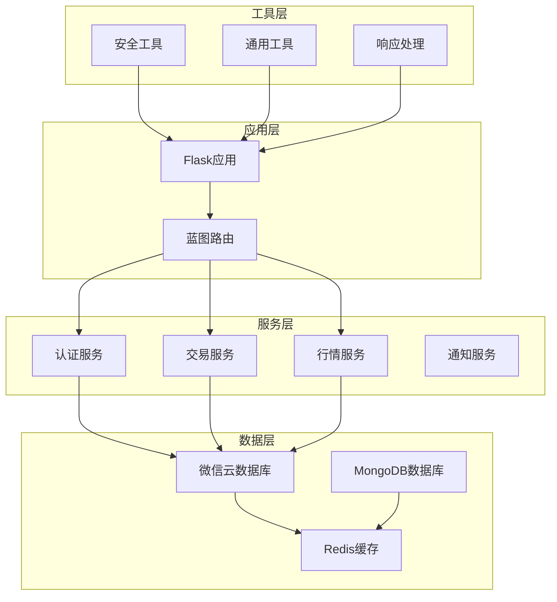
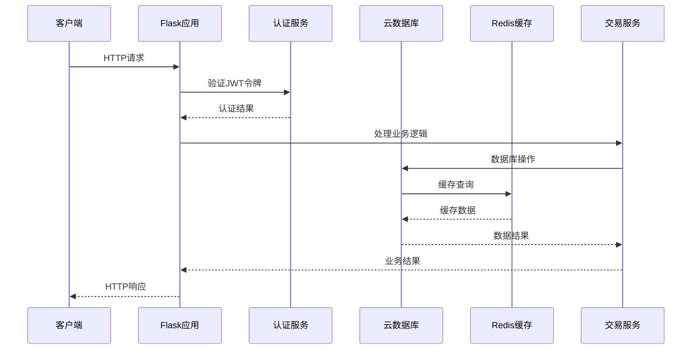
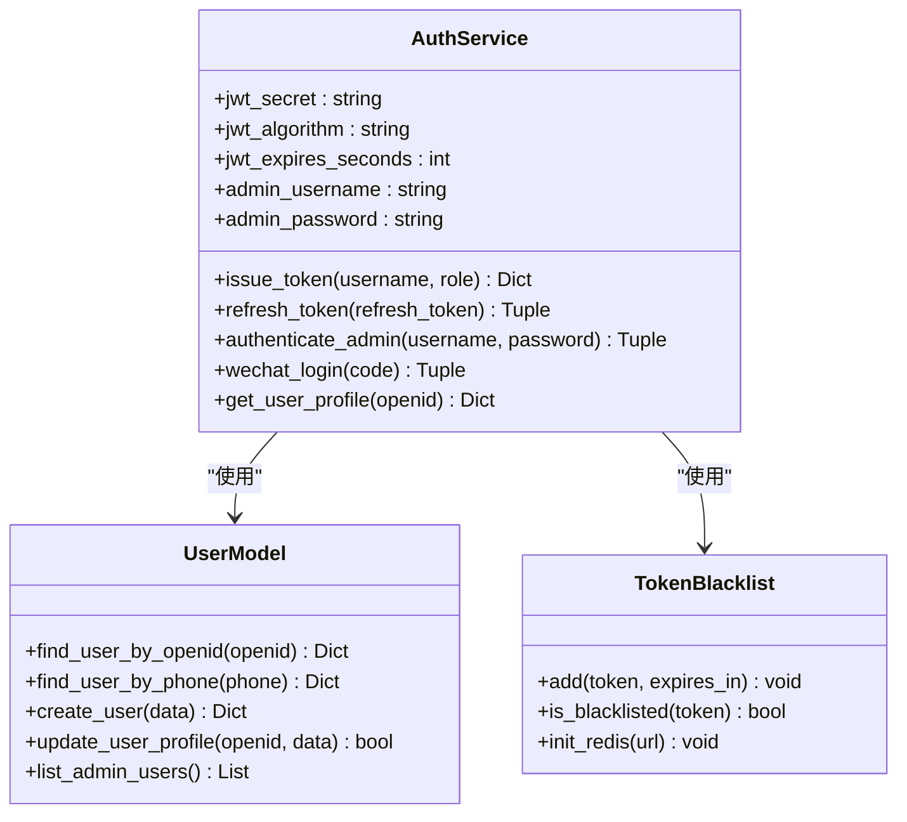
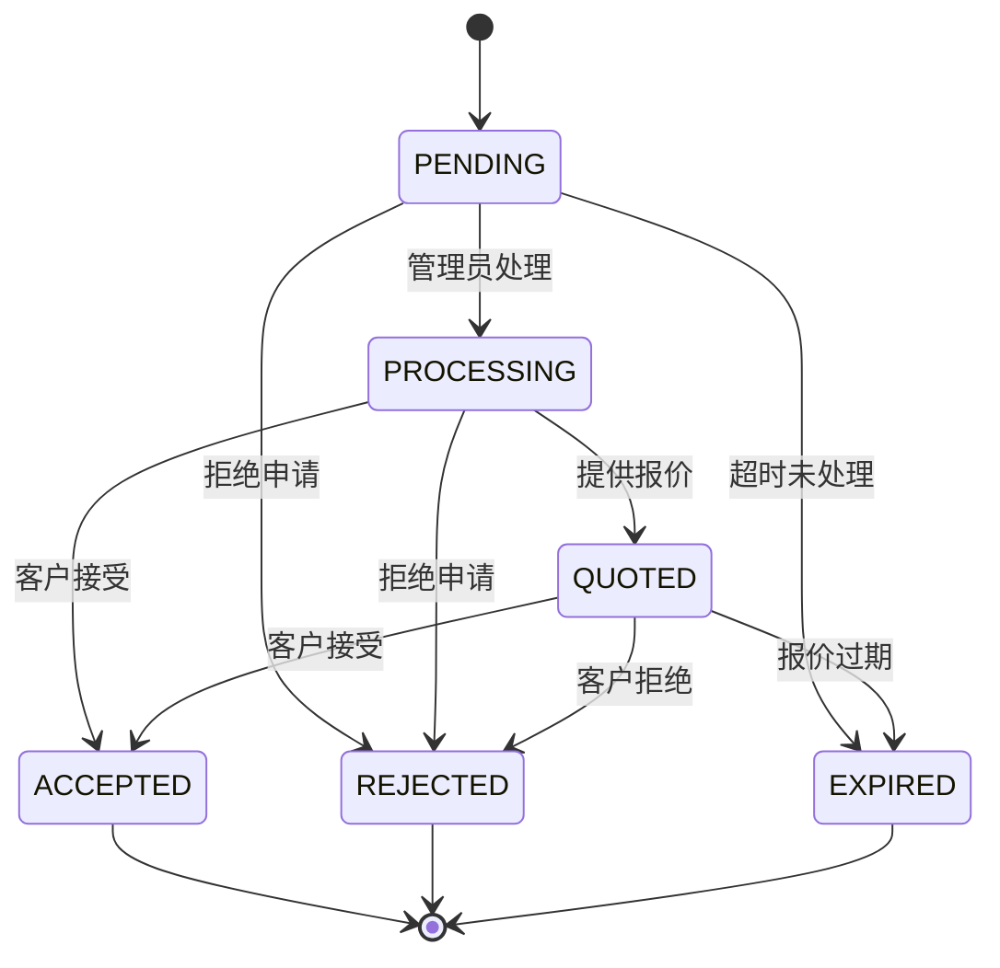
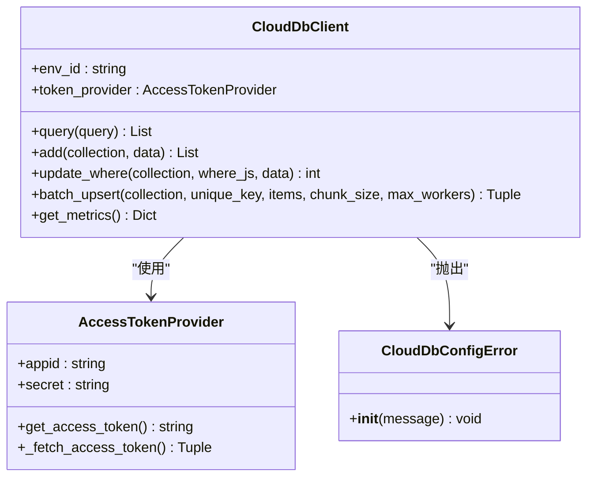
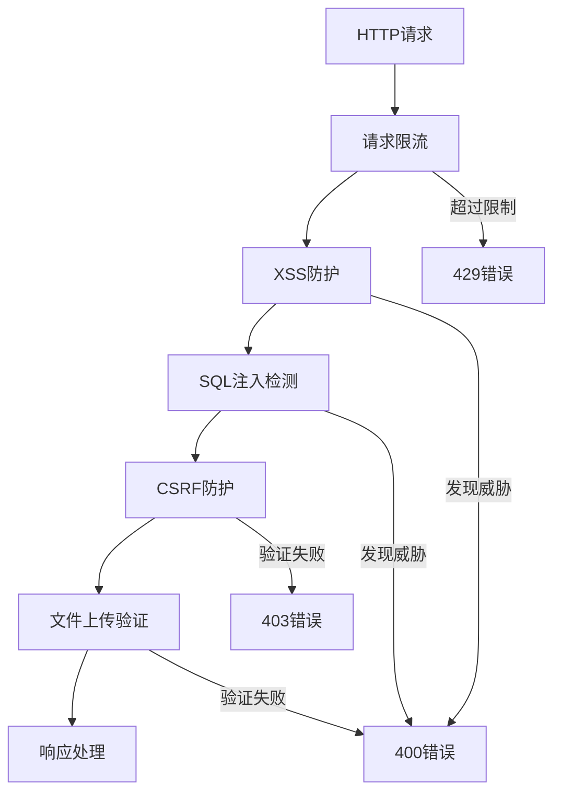
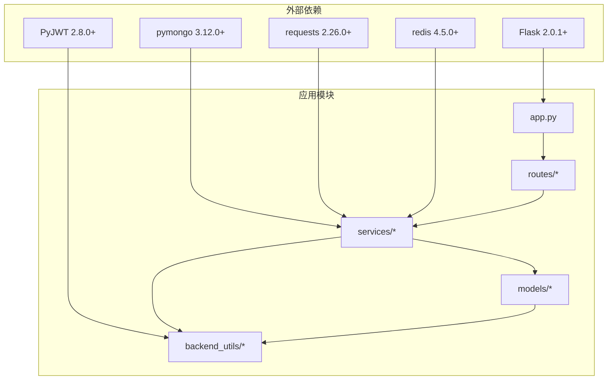

# Flask后端服务

<cite>
**本文档引用的文件**
- [app.py](file://app.py)
- [config.py](file://config.py)
- [requirements.txt](file://requirements.txt)
- [routes/admin.py](file://routes/admin.py)
- [routes/auth.py](file://routes/auth.py)
- [routes/inquiry.py](file://routes/inquiry.py)
- [models/inquiry.py](file://models/inquiry.py)
- [services/cloud_db.py](file://services/cloud_db.py)
- [services/auth_service.py](file://services/auth_service.py)
- [backend_utils/security.py](file://backend_utils/security.py)
</cite>

## 目录
1. [项目概述](#项目概述)
2. [项目结构](#项目结构)
3. [核心组件](#核心组件)
4. [架构概览](#架构概览)
5. [详细组件分析](#详细组件分析)
6. [依赖关系分析](#依赖关系分析)
7. [性能考虑](#性能考虑)
8. [故障排除指南](#故障排除指南)
9. [结论](#结论)

## 项目概述

这是一个基于Flask框架构建的期权交易后端服务，专门为微信小程序和管理后台提供完整的期权数据服务。该系统采用微信云开发架构，支持实时行情数据、询价管理、用户认证和交易服务等功能。

### 主要特性

- **多数据源架构**：支持微信云数据库和本地MongoDB双重数据源
- **完整的认证体系**：支持管理员登录、微信小程序用户登录、游客模式
- **实时行情同步**：自动同步A股期权行情数据
- **询价管理系统**：完整的询价提交、处理和状态跟踪
- **安全防护**：多层次的安全防护机制，包括限流、CSRF防护、XSS防护等
- **监控告警**：完善的错误监控和告警机制

## 项目结构

**图表来源**
- [app.py:154-414](file://app.py#L154-L414)
- [routes/admin.py:25-25](file://routes/admin.py#L25-L25)
- [routes/auth.py:17-17](file://routes/auth.py#L17-L17)

**章节来源**
- [app.py:154-414](file://app.py#L154-L414)
- [config.py:22-132](file://config.py#L22-L132)

## 核心组件

### 应用入口与配置

应用入口位于`app.py`文件中，采用工厂模式创建Flask应用实例，支持多种环境配置和数据源切换。

### 蓝图路由系统

系统采用Flask蓝图(BP)组织路由，主要包含：
- `/api/v1/auth` - 认证相关路由
- `/api/v1` - 询价相关路由  
- `/api/v1/stock` - 股票行情路由
- `/api/v1/admin` - 管理后台路由
- `/api/v1/trade` - 交易相关路由

### 数据模型层

提供统一的数据访问接口，支持微信云数据库和本地MongoDB：
- `InquiryModel` - 询价数据模型
- `UserModel` - 用户数据模型
- `StockModel` - 股票数据模型
- `OrderModel` - 订单数据模型

**章节来源**
- [app.py:154-414](file://app.py#L154-L414)
- [models/inquiry.py:10-382](file://models/inquiry.py#L10-L382)

## 架构概览

**图表来源**
- [services/auth_service.py:14-668](file://services/auth_service.py#L14-L668)
- [services/cloud_db.py:112-814](file://services/cloud_db.py#L112-L814)

### 数据流架构

系统采用分层架构设计，各层职责清晰：

1. **表示层**：Flask蓝图路由处理HTTP请求
2. **业务层**：服务类处理业务逻辑和数据验证
3. **数据访问层**：模型类提供统一的数据访问接口
4. **数据存储层**：支持微信云数据库和本地MongoDB

**章节来源**
- [routes/inquiry.py:1-800](file://routes/inquiry.py#L1-L800)
- [services/auth_service.py:14-668](file://services/auth_service.py#L14-L668)

## 详细组件分析

### 认证与授权系统

**图表来源**
- [services/auth_service.py:14-668](file://services/auth_service.py#L14-L668)
- [models/inquiry.py:14-382](file://models/inquiry.py#L14-L382)

#### 认证流程

系统支持多种认证方式：

1. **管理员认证**：用户名密码认证
2. **微信小程序认证**：通过微信JS-Code换取用户信息
3. **JWT令牌认证**：基于JWT的无状态认证
4. **游客模式**：匿名用户访问限制

**章节来源**
- [routes/auth.py:206-800](file://routes/auth.py#L206-L800)
- [services/auth_service.py:241-464](file://services/auth_service.py#L241-L464)

### 询价管理系统

**图表来源**
- [routes/inquiry.py:630-751](file://routes/inquiry.py#L630-L751)
- [models/inquiry.py:174-244](file://models/inquiry.py#L174-L244)

#### 询价流程

系统提供完整的询价生命周期管理：

1. **提交询价**：支持匿名和登录用户提交
2. **状态管理**：完整的状态流转控制
3. **通知机制**：状态变更通知用户
4. **历史记录**：完整的操作历史追踪

**章节来源**
- [routes/inquiry.py:351-486](file://routes/inquiry.py#L351-L486)
- [models/inquiry.py:53-382](file://models/inquiry.py#L53-L382)

### 数据库访问层

**图表来源**
- [services/cloud_db.py:112-814](file://services/cloud_db.py#L112-L814)

#### 数据库特性

1. **连接池管理**：智能连接池配置和重试机制
2. **并发控制**：支持高并发请求处理
3. **错误恢复**：自动重试和错误分类处理
4. **性能监控**：详细的性能指标收集

**章节来源**
- [services/cloud_db.py:112-814](file://services/cloud_db.py#L112-L814)

### 安全防护系统

**图表来源**
- [backend_utils/security.py:21-734](file://backend_utils/security.py#L21-L734)

#### 安全机制

系统实现多层次安全防护：

1. **请求限流**：防止恶意刷取
2. **XSS防护**：输入净化和HTML转义
3. **SQL注入检测**：模式匹配检测
4. **CSRF防护**：Token验证机制
5. **文件上传验证**：类型和大小限制

**章节来源**
- [backend_utils/security.py:21-734](file://backend_utils/security.py#L21-L734)

## 依赖关系分析

**图表来源**
- [requirements.txt:1-23](file://requirements.txt#L1-L23)
- [app.py:14-18](file://app.py#L14-L18)

### 核心依赖

| 依赖包 | 版本要求 | 用途 |
|--------|----------|------|
| Flask | >=2.0.1 | Web框架 |
| Flask-Cors | >=3.0.10 | 跨域支持 |
| pymongo | >=3.12.0 | MongoDB驱动 |
| requests | >=2.26.0 | HTTP请求 |
| PyJWT | >=2.8.0 | JWT令牌处理 |
| redis | >=4.5.0 | 缓存和会话存储 |

**章节来源**
- [requirements.txt:1-23](file://requirements.txt#L1-L23)

## 性能考虑

### 缓存策略

系统采用多层缓存机制：

1. **Redis缓存**：热点数据缓存
2. **进程内缓存**：报价数据缓存
3. **数据库索引**：查询性能优化

### 并发处理

- **线程池**：支持高并发请求处理
- **连接池**：数据库连接复用
- **异步任务**：后台数据同步任务

### 监控指标

系统提供详细的性能监控：

- 请求响应时间
- 错误率统计
- 数据库连接状态
- 缓存命中率

## 故障排除指南

### 常见问题

1. **数据库连接失败**
   - 检查微信云数据库配置
   - 验证网络连接
   - 查看连接池状态

2. **认证失败**
   - 检查JWT密钥配置
   - 验证用户凭据
   - 查看令牌过期时间

3. **API限流**
   - 检查限流配置
   - 降低请求频率
   - 实现重试机制

### 日志分析

系统提供详细的日志记录：

- 请求日志：记录所有HTTP请求
- 错误日志：捕获异常和错误
- 性能日志：监控响应时间和资源使用

**章节来源**
- [app.py:338-410](file://app.py#L338-L410)

## 结论

该Flask后端服务采用现代化的架构设计，提供了完整的期权交易服务功能。系统具有以下优势：

1. **架构清晰**：分层设计，职责分离
2. **扩展性强**：支持多种数据源和部署方式
3. **安全性高**：多重安全防护机制
4. **性能优秀**：缓存和并发优化
5. **易于维护**：模块化设计，文档完善

建议在生产环境中重点关注：
- 数据库连接监控
- 安全配置验证
- 性能指标持续监控
- 备份和灾难恢复策略