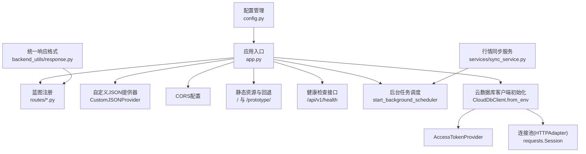
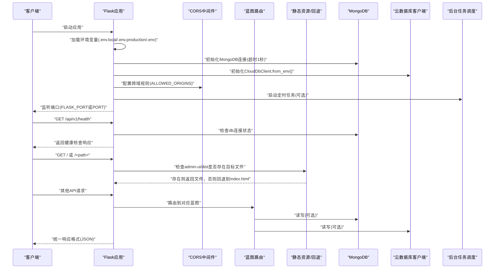
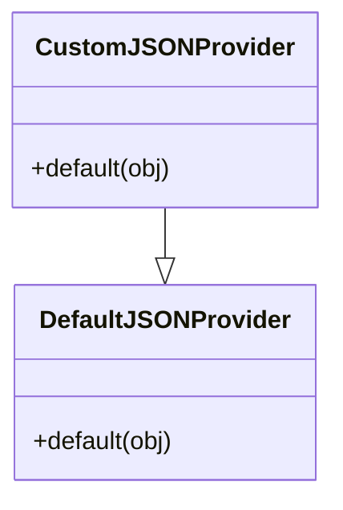
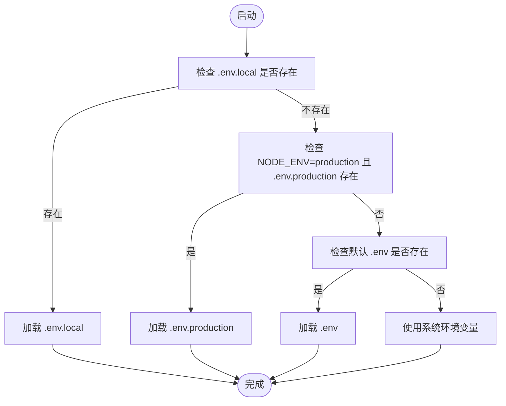
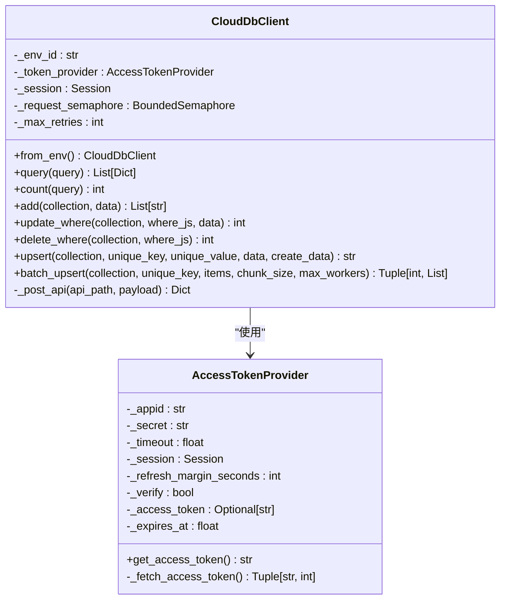
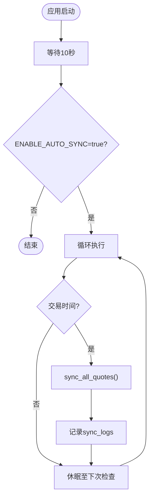

# Flask应用核心

<cite>
**本文引用的文件**
- [app.py](file://app.py)
- [config.py](file://config.py)
- [requirements.txt](file://requirements.txt)
- [.env.example](file://.env.example)
- [services/cloud_db.py](file://services/cloud_db.py)
- [services/sync_service.py](file://services/sync_service.py)
- [backend_utils/response.py](file://backend_utils/response.py)
- [routes/inquiry.py](file://routes/inquiry.py)
- [routes/stock.py](file://routes/stock.py)
- [deploy/docker-compose.yml](file://deploy/docker-compose.yml)
</cite>

## 目录
1. [简介](#简介)
2. [项目结构](#项目结构)
3. [核心组件](#核心组件)
4. [架构总览](#架构总览)
5. [详细组件分析](#详细组件分析)
6. [依赖关系分析](#依赖关系分析)
7. [性能考量](#性能考量)
8. [故障排查指南](#故障排查指南)
9. [结论](#结论)
10. [附录](#附录)

## 简介
本文件面向Flask应用“期权数据服务”的核心架构文档，聚焦于应用初始化流程、配置管理、服务启动机制、自定义JSON序列化器、环境变量加载、数据库连接池与云数据库客户端初始化、CORS跨域、请求日志记录、错误处理、健康检查接口、静态资源服务与路由回退、应用启动流程与端口解析逻辑、以及后台任务调度等关键主题。文档旨在帮助开发者快速理解并维护该Flask后端系统。

## 项目结构
该项目采用“蓝图+服务层+工具模块”的分层组织方式：
- 应用入口与核心初始化：app.py
- 配置管理：config.py
- 依赖声明：requirements.txt
- 示例环境变量：.env.example
- 云数据库客户端与连接池：services/cloud_db.py
- 行情同步与后台任务：services/sync_service.py
- 统一响应格式：backend_utils/response.py
- 路由模块：routes/*.py（如询价、股票等）

图表来源
- [app.py](file://app.py#L103-L276)
- [services/cloud_db.py](file://services/cloud_db.py#L108-L208)
- [services/sync_service.py](file://services/sync_service.py#L241-L266)
- [backend_utils/response.py](file://backend_utils/response.py#L64-L93)
- [routes/inquiry.py](file://routes/inquiry.py#L1-L175)
- [routes/stock.py](file://routes/stock.py#L1-L200)

章节来源
- [app.py](file://app.py#L103-L276)
- [config.py](file://config.py#L22-L132)
- [requirements.txt](file://requirements.txt#L1-L12)
- [.env.example](file://.env.example#L1-L50)

## 核心组件
- 应用工厂与初始化：create_app()负责创建Flask应用、注册蓝图、配置CORS、日志、错误处理、静态资源与回退、健康检查接口、以及后台任务调度。
- 自定义JSON序列化器：CustomJSONProvider覆盖DefaultJSONProvider.default，统一处理ObjectId与datetime类型的序列化。
- 环境变量加载：按优先级加载.env.local、NODE_ENV=production下的.env.production、默认.env，或回退到系统环境变量。
- 数据库连接：MongoDB连接池初始化，支持超时与连接验证；支持无数据库模式运行。
- 云数据库客户端：CloudDbClient封装微信云数据库访问，内置访问令牌管理、连接池、并发控制、重试与错误处理。
- CORS跨域：基于ALLOWED_ORIGINS配置，支持预检请求与凭证传递。
- 请求日志：before_request与after_request钩子记录请求与响应状态。
- 错误处理：统一404/500与通用异常处理，结合NODE_ENV输出简化或详细错误信息。
- 健康检查：/api/v1/health返回服务状态、数据库连接状态、版本与环境信息。
- 静态资源与回退：根路径与/prototype/代理到前端构建产物；React路由回退至index.html。
- 后台任务调度：定时同步行情，受环境变量控制，仅在交易时间内执行。

章节来源
- [app.py](file://app.py#L16-L276)
- [services/cloud_db.py](file://services/cloud_db.py#L108-L208)
- [services/sync_service.py](file://services/sync_service.py#L241-L266)
- [backend_utils/response.py](file://backend_utils/response.py#L64-L93)

## 架构总览
下图展示Flask应用启动到请求处理的关键交互链路，包括环境变量加载、数据库与云数据库初始化、CORS、蓝图路由、静态资源与回退、健康检查、后台任务调度，以及请求日志与错误处理。

图表来源
- [app.py](file://app.py#L37-L101)
- [app.py](file://app.py#L103-L276)
- [services/cloud_db.py](file://services/cloud_db.py#L162-L208)
- [routes/inquiry.py](file://routes/inquiry.py#L1-L175)
- [routes/stock.py](file://routes/stock.py#L1-L200)

## 详细组件分析

### 自定义JSON序列化器：CustomJSONProvider
- 目标：解决Flask默认JSON序列化对bson.ObjectId与datetime的兼容性问题，确保API响应中这些类型被正确序列化为字符串。
- 实现要点：
  - 继承DefaultJSONProvider，覆写default(obj)方法。
  - ObjectId：转换为字符串。
  - datetime：转换为ISO格式字符串。
  - 其他类型：委托给父类处理。
- 使用位置：在create_app()中将app.json替换为CustomJSONProvider实例。

图表来源
- [app.py](file://app.py#L16-L22)

章节来源
- [app.py](file://app.py#L16-L22)

### 环境变量加载机制
- 优先级策略：
  - 若存在.env.local，优先加载。
  - 否则若系统环境变量NODE_ENV=production且存在.env.production，则加载之。
  - 否则加载默认.env。
  - 若均不存在，尝试使用系统环境变量。
- 关键变量：
  - NODE_ENV、FLASK_PORT、ALLOWED_ORIGINS、WX_APPID、WX_SECRET、WX_CLOUD_ENV、WX_VERIFY_SSL、LOG_LEVEL、LOG_FILE等。
- 日志配置：同时输出到控制台与server.log文件。

图表来源
- [app.py](file://app.py#L37-L57)

章节来源
- [app.py](file://app.py#L37-L57)
- [.env.example](file://.env.example#L1-L50)

### 数据库连接池管理与无数据库模式
- MongoDB连接：
  - 使用MongoClient，设置serverSelectionTimeoutMS与connectTimeoutMS为1秒，避免启动阻塞。
  - 通过admin.command('ping')验证连接。
  - 失败时记录警告并返回None，应用以“无数据库模式”运行，部分功能受限。
- 无数据库模式：
  - 支持通过环境变量SKIP_DB_INIT=1或NODE_ENV=testing跳过初始化。
  - 提供ensure_db()动态尝试重建连接，带冷却时间防止频繁重试。

章节来源
- [app.py](file://app.py#L64-L89)
- [app.py](file://app.py#L154-L166)

### 云数据库客户端初始化与连接池
- CloudDbClient.from_env()：
  - 从环境变量WX_CLOUD_ENV、WX_APPID、WX_SECRET加载配置。
  - 校验环境变量完整性，缺失或为空时抛出CloudDbConfigError。
  - 使用AccessTokenProvider获取与刷新access_token。
  - 使用requests.Session并挂载HTTPAdapter，启用连接池与并发控制。
  - 通过_BoundedSemaphore限制并发请求数，受WX_DB_MAX_INFLIGHT影响。
  - 支持重试次数配置WX_DB_MAX_RETRIES。
- API调用：
  - _post_api封装请求发送与错误处理，包含指数退避重试与速率限制处理。
  - query/count/add/update_where/delete_where/upsert/batch_upsert等方法提供常用操作。

图表来源
- [services/cloud_db.py](file://services/cloud_db.py#L108-L208)
- [services/cloud_db.py](file://services/cloud_db.py#L36-L106)

章节来源
- [services/cloud_db.py](file://services/cloud_db.py#L108-L208)
- [services/cloud_db.py](file://services/cloud_db.py#L486-L533)

### CORS跨域配置
- 配置范围：/api/*。
- 允许方法：GET、POST、PUT、DELETE、OPTIONS。
- 允许请求头：Content-Type、Authorization、X-Requested-With、X-User-ID。
- 支持凭据：允许携带Cookie/Credentials。
- 预检缓存：max_age=86400秒。

章节来源
- [app.py](file://app.py#L168-L181)

### 请求日志记录与错误处理
- 请求日志：
  - before_request：记录请求方法与URL，若存在X-User-ID则记录用户标识。
  - after_request：记录响应状态码。
- 错误处理：
  - 404：返回统一错误响应。
  - 500：记录堆栈，生产环境返回简要信息。
  - 通用异常：捕获未处理异常，记录堆栈并返回统一错误响应。

章节来源
- [app.py](file://app.py#L211-L275)

### 健康检查接口
- 路径：/api/v1/health
- 返回字段：status、db连接状态、version、service、environment。
- 使用统一响应格式，便于监控与自动化检查。

章节来源
- [app.py](file://app.py#L185-L197)
- [backend_utils/response.py](file://backend_utils/response.py#L64-L93)

### 静态资源服务与路由回退
- 根路径与/prototype/：
  - 代理到admin-web目录（用于原型/演示）。
- 管理后台静态资源：
  - 代理到admin-ui/dist目录。
  - 若目标文件存在则直接返回；否则回退到index.html，支持React路由。
- API请求保护：
  - 以/api/开头的路径不会进入静态资源处理，避免API被静态文件覆盖。

章节来源
- [app.py](file://app.py#L226-L250)

### 应用启动流程与端口解析逻辑
- 端口解析：
  - 优先使用FLASK_PORT，其次PORT，最后默认5002。
  - 开发环境且端口小于1024时，若未显式允许，回退到5000。
- 启动行为：
  - 根据NODE_ENV决定debug与use_reloader。
  - 若端口绑定失败，尝试回退端口并再次启动。
- Docker部署：
  - docker-compose映射宿主5002到容器5002，Nginx反向代理静态资源与API。

章节来源
- [app.py](file://app.py#L90-L101)
- [app.py](file://app.py#L336-L350)
- [deploy/docker-compose.yml](file://deploy/docker-compose.yml#L10-L11)
- [deploy/docker-compose.yml](file://deploy/docker-compose.yml#L26-L28)

### 后台任务调度
- 触发条件：SKIP_SCHEDULER!=1。
- 调度器：
  - 启动后等待10秒，避免与应用启动竞争。
  - 从环境变量读取ENABLE_AUTO_SYNC与AUTO_SYNC_INTERVAL_SECONDS。
  - 仅在交易时间内（周一至周五 9:15-11:30、13:00-15:00）执行全量行情同步。
  - 使用线程守护方式运行，避免阻塞主进程。
- 同步服务：
  - sync_all_quotes：抓取全部股票代码并同步行情。
  - 使用CloudDbClient.batch_upsert进行高效批量写入。
  - 记录同步日志到云数据库的sync_logs集合。

图表来源
- [app.py](file://app.py#L279-L330)
- [services/sync_service.py](file://services/sync_service.py#L241-L266)

章节来源
- [app.py](file://app.py#L222-L330)
- [services/sync_service.py](file://services/sync_service.py#L241-L266)

## 依赖关系分析
- Flask核心：Flask、Flask-Cors、python-dotenv、gunicorn。
- 数据库：pymongo、akshare。
- 工具：pandas、openpyxl、requests、lxml、PyJWT。

章节来源
- [requirements.txt](file://requirements.txt#L1-L12)

## 性能考量
- 连接池与并发：
  - 云数据库客户端使用HTTPAdapter配置连接池，最大并发受WX_DB_MAX_INFLIGHT控制。
  - 使用BoundedSemaphore限制并发请求，避免QPS过高导致限流。
- 超时与重试：
  - MongoDB连接超时1秒，避免启动阻塞。
  - 云数据库请求支持指数退避重试，针对速率限制场景增加抖动。
- 后台任务：
  - 交易时间窗口内执行同步，减少非必要开销。
  - 批量写入使用多线程与分块，提升吞吐量。
- 日志与监控：
  - 统一日志格式，便于集中化采集与分析。
  - 健康检查接口便于容器编排与负载均衡探活。

[本节为通用性能建议，无需特定文件来源]

## 故障排查指南
- 环境变量未生效：
  - 检查.env.local/.env.production/.env加载顺序与文件存在性。
  - 确认NODE_ENV与系统环境变量一致。
- MongoDB连接失败：
  - 查看server.log中连接失败日志，确认URI与网络可达性。
  - 开发环境可临时设置SKIP_DB_INIT=1以绕过数据库。
- 云数据库初始化失败：
  - 检查WX_CLOUD_ENV、WX_APPID、WX_SECRET是否配置完整。
  - 若WX_VERIFY_SSL=false，需确认网络环境允许。
- CORS跨域问题：
  - 确认ALLOWED_ORIGINS包含前端域名，且请求头包含X-User-ID等必要字段。
- 健康检查失败：
  - 检查/db连接状态与NODE_ENV，确认应用已成功初始化。
- 静态资源404：
  - 确认admin-ui/dist已构建，且路径正确。
  - API路径不应以/api/开头，避免被静态资源拦截。
- 后台任务未执行：
  - 检查SKIP_SCHEDULER、ENABLE_AUTO_SYNC、AUTO_SYNC_INTERVAL_SECONDS。
  - 确认交易时间窗口内才会触发同步。

章节来源
- [app.py](file://app.py#L37-L57)
- [app.py](file://app.py#L64-L89)
- [services/cloud_db.py](file://services/cloud_db.py#L162-L208)
- [app.py](file://app.py#L168-L181)
- [app.py](file://app.py#L185-L197)
- [app.py](file://app.py#L226-L250)
- [app.py](file://app.py#L222-L330)

## 结论
该Flask应用通过清晰的初始化流程、完善的配置管理、自定义JSON序列化器、稳健的数据库与云数据库客户端、严格的CORS与日志/错误处理、以及可选的后台任务调度，构建了一个可扩展、可观测、可运维的期权数据服务后端。其蓝图化路由设计与静态资源回退机制，使得前后端分离的开发与部署更加灵活。

[本节为总结性内容，无需特定文件来源]

## 附录
- 配置示例：参考.env.example，包含NODE_ENV、FLASK_PORT、ALLOWED_ORIGINS、WX_*、JWT、缓存、日志等关键配置项。
- Docker部署：docker-compose.yml定义了Flask与Nginx的服务编排，映射端口与卷，便于生产部署。

章节来源
- [.env.example](file://.env.example#L1-L50)
- [deploy/docker-compose.yml](file://deploy/docker-compose.yml#L1-L42)