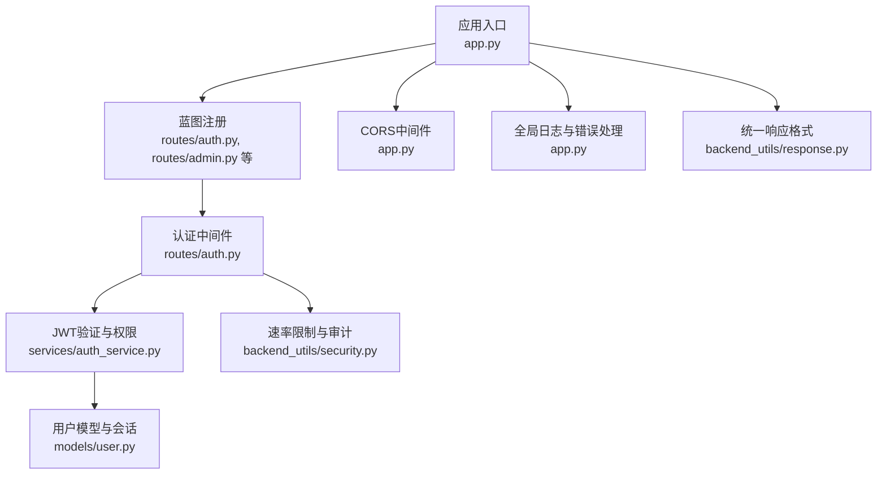
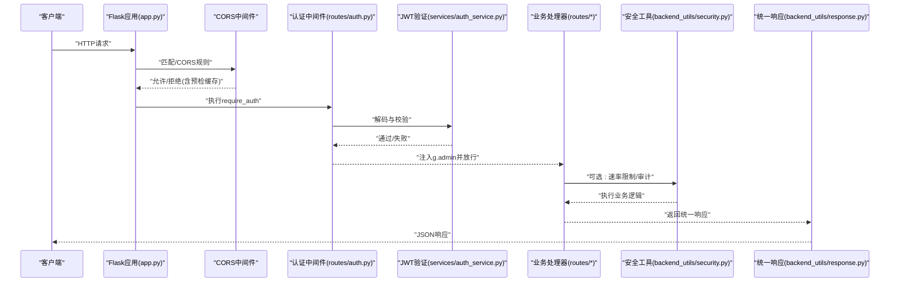
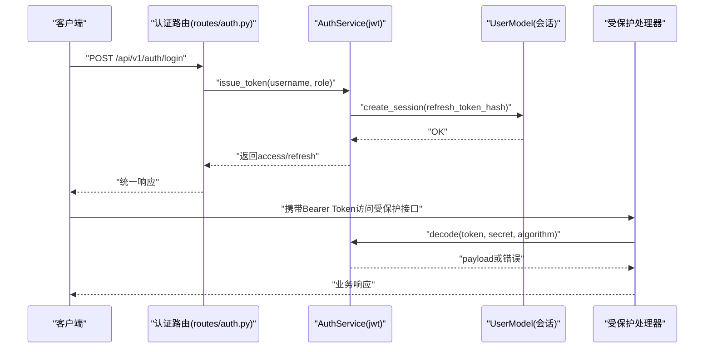
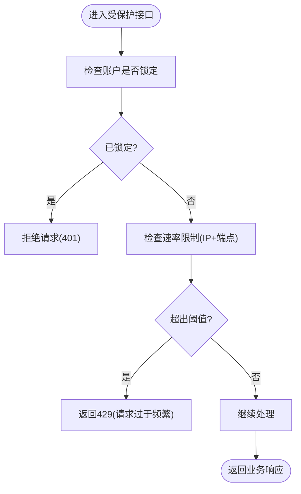
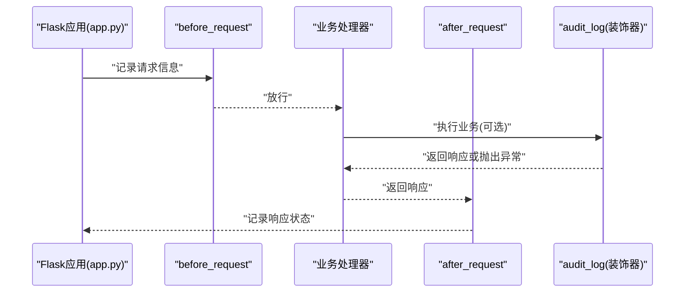
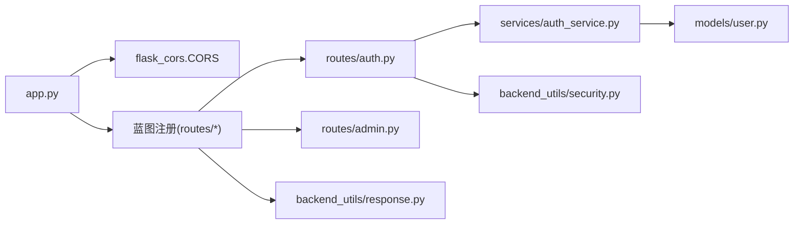

# 中间件与安全

<cite>
**本文引用的文件**
- [app.py](file://app.py)
- [config.py](file://config.py)
- [backend_utils/security.py](file://backend_utils/security.py)
- [backend_utils/response.py](file://backend_utils/response.py)
- [routes/auth.py](file://routes/auth.py)
- [routes/admin.py](file://routes/admin.py)
- [services/auth_service.py](file://services/auth_service.py)
- [models/user.py](file://models/user.py)
- [services/captcha_service.py](file://services/captcha_service.py)
</cite>

## 目录
1. [引言](#引言)
2. [项目结构](#项目结构)
3. [核心组件](#核心组件)
4. [架构总览](#架构总览)
5. [详细组件分析](#详细组件分析)
6. [依赖分析](#依赖分析)
7. [性能考虑](#性能考虑)
8. [故障排除指南](#故障排除指南)
9. [结论](#结论)
10. [附录](#附录)

## 引言
本文件聚焦于系统的中间件与安全架构，围绕Flask中间件机制与安全防护策略展开，涵盖CORS中间件配置、请求预检处理与跨域安全策略；认证中间件、JWT令牌验证与权限控制机制；请求响应拦截、日志记录与审计追踪；输入验证、SQL注入防护与XSS攻击防范；以及安全配置最佳实践、漏洞扫描与安全监控方案。文档旨在帮助开发者与运维人员理解并优化系统的安全性与可维护性。

## 项目结构
系统采用Flask应用结构，通过蓝图组织路由，并在应用层集中配置CORS、日志与错误处理等中间件能力。安全相关能力主要分布在应用入口、通用安全工具模块与认证路由中。

图表来源
- [app.py](file://app.py#L103-L276)
- [routes/auth.py](file://routes/auth.py#L1-L432)
- [services/auth_service.py](file://services/auth_service.py#L1-L416)
- [models/user.py](file://models/user.py#L1-L309)
- [backend_utils/security.py](file://backend_utils/security.py#L1-L117)
- [backend_utils/response.py](file://backend_utils/response.py#L1-L118)

章节来源
- [app.py](file://app.py#L103-L276)

## 核心组件
- CORS中间件与跨域策略：在应用入口集中配置，限定允许来源、方法、头部与凭据，支持预检缓存。
- 认证中间件与JWT：提供Bearer令牌解析、解码与过期校验，结合g对象传递用户上下文。
- 权限控制：基于角色的访问控制（RBAC），支持多角色与角色归一化。
- 速率限制与账户锁定：基于内存的简单限流与失败尝试锁定策略。
- 审计日志：统一的审计装饰器，记录用户、IP、动作与结果状态。
- 统一响应格式：标准化成功/错误/分页响应，便于前端与监控系统消费。
- 日志与错误处理：全局before/after请求钩子与错误处理器，输出结构化日志。

章节来源
- [app.py](file://app.py#L168-L181)
- [routes/auth.py](file://routes/auth.py#L33-L72)
- [services/auth_service.py](file://services/auth_service.py#L14-L44)
- [backend_utils/security.py](file://backend_utils/security.py#L17-L117)
- [backend_utils/response.py](file://backend_utils/response.py#L11-L118)

## 架构总览
下图展示请求在系统中的流转与安全控制点：

图表来源
- [app.py](file://app.py#L168-L181)
- [routes/auth.py](file://routes/auth.py#L33-L54)
- [services/auth_service.py](file://services/auth_service.py#L86-L131)
- [backend_utils/security.py](file://backend_utils/security.py#L17-L45)
- [backend_utils/response.py](file://backend_utils/response.py#L64-L93)

## 详细组件分析

### CORS中间件与跨域安全策略
- 配置范围：对/api/*路径启用CORS，允许GET/POST/PUT/DELETE/OPTIONS方法。
- 允许来源：从环境变量读取，支持多域名白名单。
- 允许头部：Content-Type、Authorization、X-Requested-With、X-User-ID等常用头部。
- 凭据支持：开启supports_credentials，允许携带Cookie/自定义头。
- 预检缓存：max_age设置为一天，降低重复预检开销。
- 安全要点：
  - 生产环境务必严格限制ALLOWED_ORIGINS，避免通配符暴露。
  - 对敏感接口谨慎开启credentials，避免CSRF风险。
  - 预检缓存需与实际变更策略一致，防止浏览器缓存导致策略失效。

章节来源
- [app.py](file://app.py#L168-L181)
- [config.py](file://config.py#L55-L57)

### 认证中间件与JWT令牌验证
- Bearer令牌解析：从Authorization头提取，校验前缀与格式。
- JWT解码：使用服务端密钥与算法进行解码，捕获过期与无效令牌错误。
- 用户上下文：通过g.admin注入用户负载，供后续处理器使用。
- 刷新令牌：支持刷新令牌类型校验、会话存在性校验与旋转策略。
- 会话管理：刷新令牌哈希持久化，支持撤销与轮换。

图表来源
- [routes/auth.py](file://routes/auth.py#L74-L96)
- [services/auth_service.py](file://services/auth_service.py#L86-L131)
- [models/user.py](file://models/user.py#L27-L44)

章节来源
- [routes/auth.py](file://routes/auth.py#L21-L54)
- [services/auth_service.py](file://services/auth_service.py#L14-L44)

### 权限控制机制（RBAC）
- 角色归一化：将输入角色标准化为viewer/editor/admin。
- 装饰器require_roles：在g.admin中读取当前角色，与允许集合比较。
- 使用场景：管理后台用户管理、报价删除、同步等敏感操作。

章节来源
- [routes/auth.py](file://routes/auth.py#L56-L72)
- [services/auth_service.py](file://services/auth_service.py#L27-L31)

### 速率限制与账户锁定
- 速率限制：
  - 以“IP+端点”为键，窗口内统计请求次数，超过阈值返回429。
  - 提供装饰器rate_limit，可灵活应用于登录、注册等高频接口。
- 账户锁定：
  - 记录失败尝试次数与锁定截止时间，超过阈值临时锁定。
  - 登录成功则清除锁定记录，避免误伤。
- 审计日志：
  - 通过audit_log装饰器记录动作开始/结束与状态，便于审计追踪。

图表来源
- [backend_utils/security.py](file://backend_utils/security.py#L17-L45)
- [backend_utils/security.py](file://backend_utils/security.py#L47-L86)

章节来源
- [backend_utils/security.py](file://backend_utils/security.py#L17-L117)

### 请求响应拦截、日志记录与审计追踪
- 请求拦截：before_request记录请求方法与URL，支持X-User-ID透传。
- 响应拦截：after_request记录响应状态码。
- 统一错误处理：404/500/通用异常均返回统一错误响应格式。
- 审计日志：装饰器记录用户ID、IP、动作与状态（STARTED/SUCCESS/FAILED/ERROR）。

图表来源
- [app.py](file://app.py#L211-L220)
- [backend_utils/security.py](file://backend_utils/security.py#L87-L116)

章节来源
- [app.py](file://app.py#L211-L274)
- [backend_utils/security.py](file://backend_utils/security.py#L87-L116)

### 输入验证、SQL注入防护与XSS防范
- 输入验证：
  - JSON解析与字段校验：如登录/注册接口对必填字段进行判空。
  - 分页参数校验：对page/pageSize进行范围约束。
- SQL注入防护：
  - 未直接使用原生SQL，MongoDB查询通过ORM/封装客户端执行，降低注入风险。
  - 云数据库查询通过字符串拼接，建议后续改造为参数化查询或SDK支持的参数化方式。
- XSS防范：
  - 前端负责渲染与过滤，后端返回纯文本/结构化数据，避免在响应中嵌入未经转义的用户输入。
  - 建议在响应层增加Content-Security-Policy等安全头，限制脚本执行来源。

章节来源
- [routes/auth.py](file://routes/auth.py#L76-L85)
- [routes/admin.py](file://routes/admin.py#L35-L44)

### 统一响应格式与错误处理
- 统一成功/错误/分页响应，便于前端与监控系统消费。
- 错误处理：404/500/通用异常均返回统一错误响应，生产环境隐藏内部错误细节。

章节来源
- [backend_utils/response.py](file://backend_utils/response.py#L11-L118)
- [app.py](file://app.py#L252-L274)

## 依赖分析
- 应用入口依赖CORS扩展与蓝图注册，集中配置跨域与中间件。
- 认证路由依赖AuthService进行JWT签发与校验，依赖UserModel进行会话与用户数据持久化。
- 安全工具模块为各路由提供通用的速率限制、账户锁定与审计能力。
- 统一响应模块被各路由广泛使用，保证一致性。

图表来源
- [app.py](file://app.py#L103-L209)
- [routes/auth.py](file://routes/auth.py#L1-L17)
- [routes/admin.py](file://routes/admin.py#L1-L24)
- [services/auth_service.py](file://services/auth_service.py#L33-L43)
- [models/user.py](file://models/user.py#L10-L23)
- [backend_utils/security.py](file://backend_utils/security.py#L1-L7)
- [backend_utils/response.py](file://backend_utils/response.py#L1-L10)

章节来源
- [app.py](file://app.py#L103-L209)
- [routes/auth.py](file://routes/auth.py#L1-L17)
- [services/auth_service.py](file://services/auth_service.py#L33-L43)

## 性能考虑
- CORS预检缓存：合理设置max_age，减少重复预检请求。
- 速率限制：窗口与阈值需结合业务流量调优，避免误伤正常用户。
- 日志I/O：生产环境建议使用异步日志或轮转文件，避免阻塞请求。
- 会话存储：当前为内存存储，生产环境建议迁移到Redis等外部缓存，支持分布式共享。

## 故障排除指南
- CORS相关问题：
  - 确认ALLOWED_ORIGINS是否包含前端域名，且顺序与格式正确。
  - 检查浏览器Network面板中的预检请求与响应头。
- JWT与权限问题：
  - 校验Authorization头格式与令牌签名算法。
  - 确认g.admin是否正确注入，角色是否符合要求。
- 速率限制与锁定：
  - 查看日志中“Rate limit exceeded”与“Account locked”提示。
  - 检查内存存储状态，必要时清理或迁移至持久化存储。
- 统一响应与错误：
  - 检查错误处理器是否生效，生产环境错误信息会被统一包装。

章节来源
- [app.py](file://app.py#L252-L274)
- [backend_utils/security.py](file://backend_utils/security.py#L37-L83)

## 结论
本系统通过集中式的CORS配置、认证中间件与JWT验证、RBAC权限控制、速率限制与审计日志，构建了较为完整的中间件与安全体系。建议在生产环境中进一步强化云数据库查询参数化、会话存储持久化、CSP安全头与更细粒度的输入校验，持续完善安全监控与漏洞扫描流程。

## 附录
- 安全配置最佳实践：
  - 强制HTTPS与安全Cookie属性。
  - 严格限制CORS来源，避免通配符。
  - 使用强随机密钥与定期轮换。
  - 对高危操作增加二次确认与风控校验。
- 漏洞扫描与安全监控：
  - 集成自动化扫描（依赖/代码/配置）。
  - 关注认证与授权边界、敏感数据暴露与日志脱敏。
  - 建立告警与应急响应流程。