# 后端架构设计

<cite>
**本文档引用的文件**
- [app.py](file://app.py)
- [config.py](file://config.py)
- [requirements.txt](file://requirements.txt)
- [routes/__init__.py](file://routes/__init__.py)
- [routes/inquiry.py](file://routes/inquiry.py)
- [routes/auth.py](file://routes/auth.py)
- [models/inquiry.py](file://models/inquiry.py)
- [models/user.py](file://models/user.py)
- [services/auth_service.py](file://services/auth_service.py)
- [services/trade_service.py](file://services/trade_service.py)
- [services/cloud_db.py](file://services/cloud_db.py)
- [backend_utils/response.py](file://backend_utils/response.py)
- [backend_utils/security.py](file://backend_utils/security.py)
- [deploy/docker-compose.yml](file://deploy/docker-compose.yml)
- [.env](file://.env)
</cite>

## 目录
1. [简介](#简介)
2. [项目结构](#项目结构)
3. [核心组件](#核心组件)
4. [架构总览](#架构总览)
5. [详细组件分析](#详细组件分析)
6. [依赖关系分析](#依赖关系分析)
7. [性能考虑](#性能考虑)
8. [故障排除指南](#故障排除指南)
9. [结论](#结论)
10. [附录](#附录)

## 简介
本项目是一个基于 Flask 的期权交易后端服务，采用 MVC 架构模式，结合蓝图路由系统与中间件机制，实现 RESTful API 设计、统一响应格式、认证授权、CORS 跨域处理、安全防护、数据库连接池管理、异步任务调度与后台服务架构。系统支持本地 MongoDB 与微信云数据库双数据源，并提供统一的服务层封装与数据模型抽象。

## 项目结构
后端采用按功能域划分的模块化组织方式：
- 应用入口与配置：app.py、config.py、requirements.txt
- 蓝图路由：routes/
- 服务层：services/
- 数据模型：models/
- 工具与安全：backend_utils/
- 部署与环境：deploy/、.env

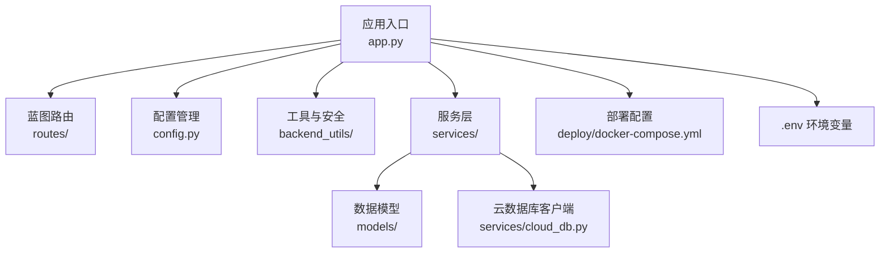

图表来源
- [app.py](file://app.py#L103-L276)
- [config.py](file://config.py#L22-L132)
- [routes/__init__.py](file://routes/__init__.py#L1-L1)
- [services/cloud_db.py](file://services/cloud_db.py#L108-L208)

章节来源
- [app.py](file://app.py#L103-L276)
- [config.py](file://config.py#L22-L132)

## 核心组件
- 应用工厂与蓝图注册：create_app() 统一初始化 Flask 应用、CORS、蓝图注册、中间件与错误处理。
- 统一响应工具：backend_utils/response.py 提供统一的成功/错误/分页响应格式。
- 安全与中间件：鉴权装饰器 require_auth、速率限制 rate_limit、审计日志 audit_log。
- 服务层：services/ 封装业务逻辑，如认证服务、询价与交易服务、云数据库访问等。
- 数据模型：models/ 定义数据结构与 CRUD 操作，兼容本地 MongoDB 与云数据库。
- 配置管理：config.py 支持开发/生产/测试多环境配置与日志轮转。

章节来源
- [app.py](file://app.py#L103-L276)
- [backend_utils/response.py](file://backend_utils/response.py#L11-L118)
- [backend_utils/security.py](file://backend_utils/security.py#L17-L117)
- [services/auth_service.py](file://services/auth_service.py#L14-L416)
- [services/trade_service.py](file://services/trade_service.py#L8-L318)
- [models/inquiry.py](file://models/inquiry.py#L10-L148)
- [models/user.py](file://models/user.py#L10-L309)
- [config.py](file://config.py#L22-L132)

## 架构总览
系统采用三层架构：
- 表现层：蓝图路由处理 HTTP 请求，调用服务层并返回统一响应。
- 业务层：服务层封装领域逻辑，协调数据模型与外部服务。
- 数据层：本地 MongoDB 与微信云数据库双写入，支持混合模式与数据同步。

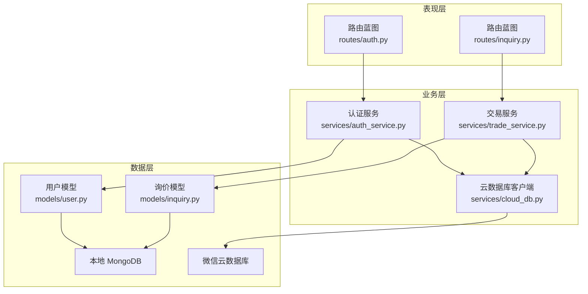

图表来源
- [routes/auth.py](file://routes/auth.py#L14-L353)
- [routes/inquiry.py](file://routes/inquiry.py#L8-L175)
- [services/auth_service.py](file://services/auth_service.py#L14-L416)
- [services/trade_service.py](file://services/trade_service.py#L8-L318)
- [services/cloud_db.py](file://services/cloud_db.py#L108-L208)
- [models/user.py](file://models/user.py#L10-L309)
- [models/inquiry.py](file://models/inquiry.py#L10-L148)

## 详细组件分析

### MVC 架构与蓝图路由系统
- 控制器：蓝图路由文件（routes/auth.py、routes/inquiry.py）作为控制器，接收请求、校验参数、调用服务层并返回响应。
- 视图：统一响应工具 backend_utils/response.py 生成标准化 JSON 响应。
- 模型：models/ 定义数据结构与持久化操作，兼容本地与云端数据源。

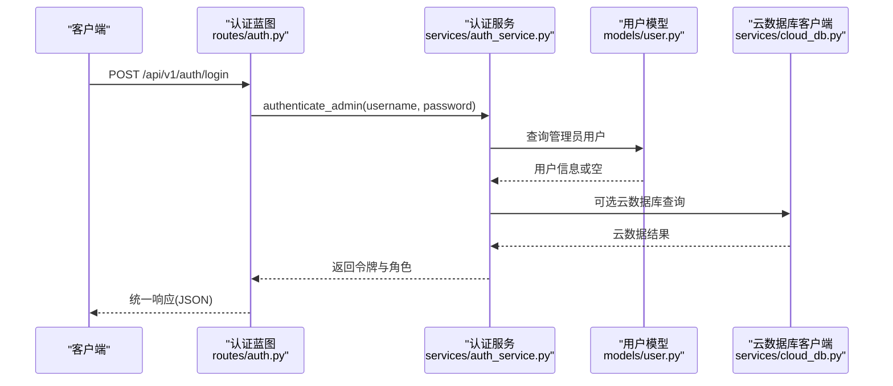

图表来源
- [routes/auth.py](file://routes/auth.py#L74-L96)
- [services/auth_service.py](file://services/auth_service.py#L196-L210)
- [models/user.py](file://models/user.py#L95-L108)
- [services/cloud_db.py](file://services/cloud_db.py#L209-L248)

章节来源
- [routes/auth.py](file://routes/auth.py#L74-L96)
- [routes/inquiry.py](file://routes/inquiry.py#L11-L34)
- [backend_utils/response.py](file://backend_utils/response.py#L64-L94)

### 中间件机制与安全防护
- 鉴权中间件：require_auth 装饰器从 Authorization 头解析 Bearer Token，解码 JWT 并注入 g.admin。
- 速率限制：rate_limit 装饰器基于内存存储实现滑动窗口限流。
- 审计日志：audit_log 装饰器记录用户行为、IP 与状态。
- CORS：全局启用，支持自定义允许的 Origin、方法与头部。

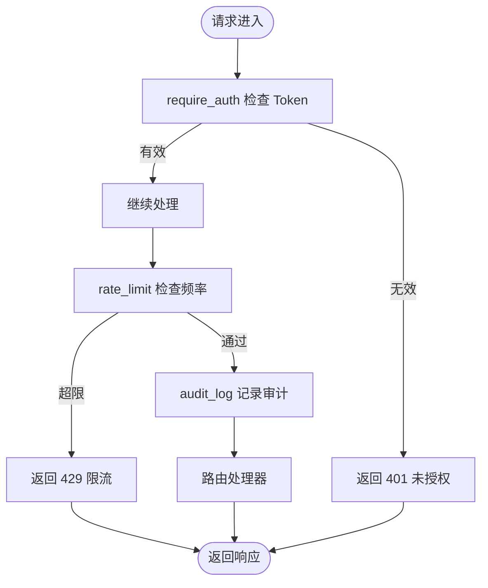

图表来源
- [routes/auth.py](file://routes/auth.py#L33-L54)
- [backend_utils/security.py](file://backend_utils/security.py#L17-L45)
- [backend_utils/security.py](file://backend_utils/security.py#L87-L117)
- [app.py](file://app.py#L170-L181)

章节来源
- [routes/auth.py](file://routes/auth.py#L33-L54)
- [backend_utils/security.py](file://backend_utils/security.py#L17-L117)
- [app.py](file://app.py#L170-L181)

### 服务层设计与业务逻辑封装
- 认证服务：处理管理员与用户登录、令牌签发与刷新、密码哈希与校验、微信登录、用户资料管理。
- 交易服务：封装询价、订单、持仓、账户资金等业务操作，聚合实时行情与历史数据。
- 云数据库服务：AccessTokenProvider 与 CloudDbClient 提供并发连接池、重试与限流，支持 upsert 批量同步。

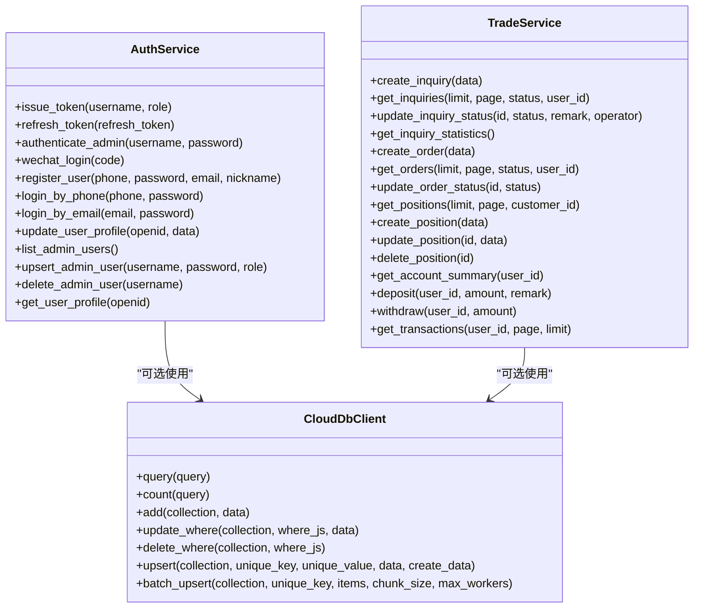

图表来源
- [services/auth_service.py](file://services/auth_service.py#L14-L416)
- [services/trade_service.py](file://services/trade_service.py#L8-L318)
- [services/cloud_db.py](file://services/cloud_db.py#L108-L533)

章节来源
- [services/auth_service.py](file://services/auth_service.py#L14-L416)
- [services/trade_service.py](file://services/trade_service.py#L8-L318)
- [services/cloud_db.py](file://services/cloud_db.py#L108-L533)

### 数据模型架构
- 用户模型：支持管理员用户与微信用户，提供会话管理、登录时间更新、余额原子更新等。
- 询价模型：支持创建、查询、按状态过滤、更新与统计，兼容本地与云端数据源。
- 位置/订单/交易模型：由 TradeService 聚合，模型层负责基础 CRUD。

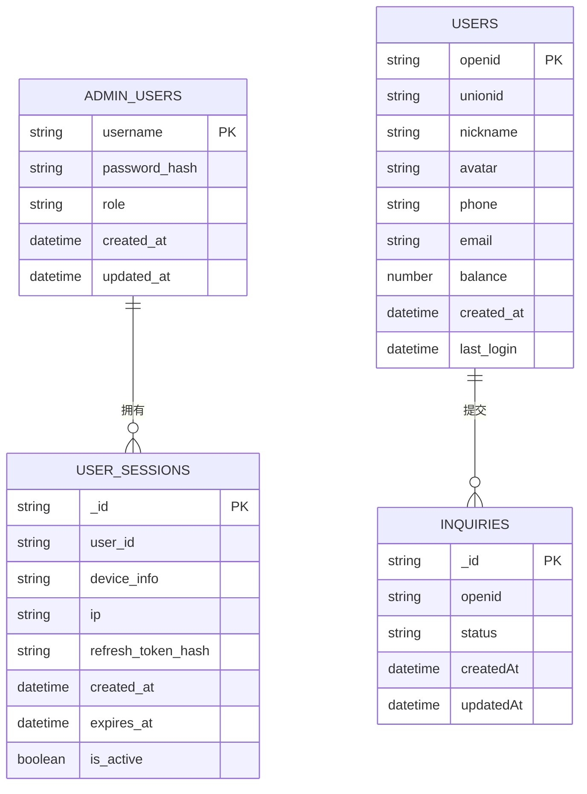

图表来源
- [models/user.py](file://models/user.py#L14-L177)
- [models/inquiry.py](file://models/inquiry.py#L14-L101)

章节来源
- [models/user.py](file://models/user.py#L10-L309)
- [models/inquiry.py](file://models/inquiry.py#L10-L148)

### RESTful API 设计与请求响应处理
- 统一响应：success_response/error_response/paginated_response 与 flask_* 版本封装，保证前后端一致的交互体验。
- 错误处理：全局 404/500 与异常捕获，生产环境隐藏内部错误细节，开发环境输出详细堆栈。
- 健康检查：/api/v1/health 返回服务状态、数据库连接状态与版本信息。

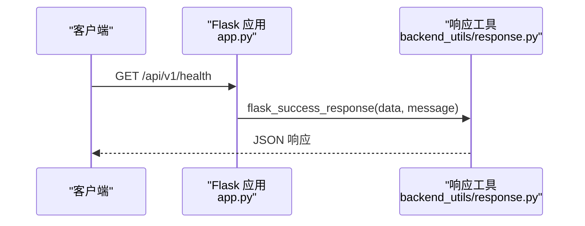

图表来源
- [app.py](file://app.py#L185-L197)
- [backend_utils/response.py](file://backend_utils/response.py#L64-L94)

章节来源
- [app.py](file://app.py#L185-L197)
- [backend_utils/response.py](file://backend_utils/response.py#L11-L118)

### 认证授权机制
- JWT 令牌：支持访问令牌与刷新令牌，刷新令牌旋转（Refresh Token Rotation）提升安全性。
- 角色与权限：require_roles 装饰器基于 payload 中的角色进行权限校验。
- 登录方式：管理员账号、邮箱登录、手机登录、微信登录（含开发模式模拟）。

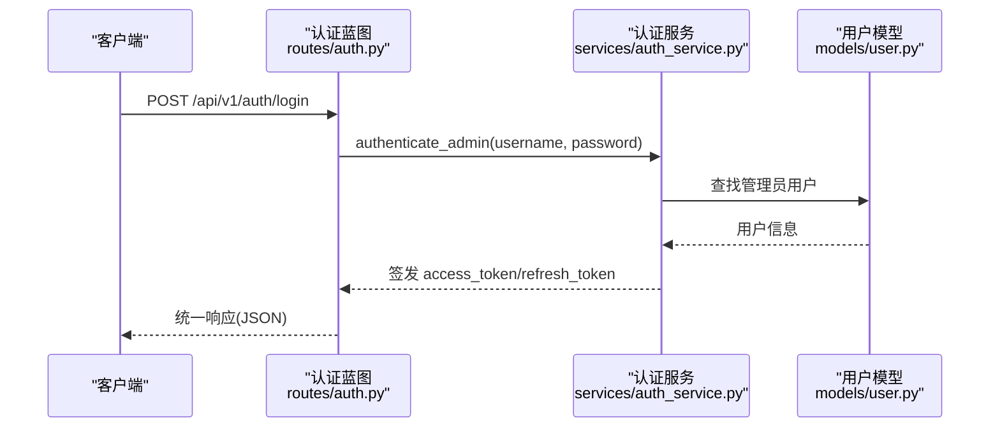

图表来源
- [routes/auth.py](file://routes/auth.py#L74-L96)
- [services/auth_service.py](file://services/auth_service.py#L196-L210)
- [models/user.py](file://models/user.py#L95-L108)

章节来源
- [routes/auth.py](file://routes/auth.py#L33-L72)
- [services/auth_service.py](file://services/auth_service.py#L86-L161)
- [models/user.py](file://models/user.py#L27-L91)

### CORS 跨域处理与安全防护策略
- CORS：允许指定 Origin、方法与头部，支持凭据传递与缓存预检请求。
- 安全：速率限制、审计日志、JWT 过期与非法令牌处理、会话撤销与刷新令牌轮换。

章节来源
- [app.py](file://app.py#L170-L181)
- [backend_utils/security.py](file://backend_utils/security.py#L17-L117)

### 数据库连接池管理与双数据源
- 本地 MongoDB：通过 MongoClient 初始化，支持 ping 验证与延迟重连。
- 微信云数据库：CloudDbClient 提供连接池、并发信号量、重试与批处理 upsert。
- 混合模式：模型层通过 _is_cloud 判断数据源，实现透明切换。

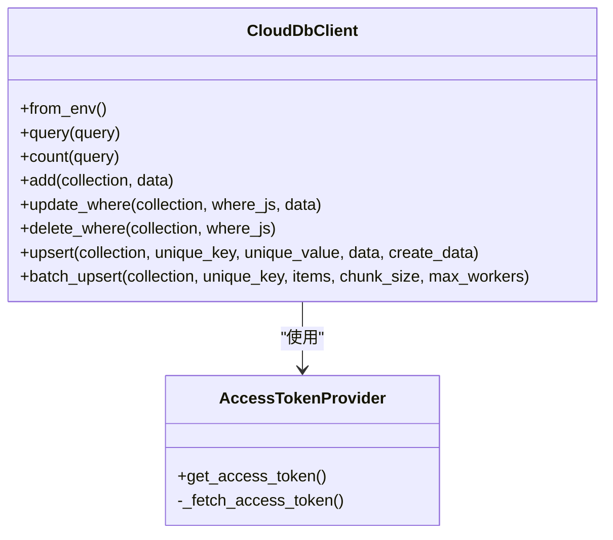

图表来源
- [services/cloud_db.py](file://services/cloud_db.py#L108-L208)
- [services/cloud_db.py](file://services/cloud_db.py#L36-L106)

章节来源
- [app.py](file://app.py#L69-L88)
- [services/cloud_db.py](file://services/cloud_db.py#L108-L533)
- [models/inquiry.py](file://models/inquiry.py#L21-L22)
- [models/user.py](file://models/user.py#L24-L25)

### 异步任务调度与后台服务
- 定时任务：启动后台线程，按环境变量配置自动同步行情，仅在交易时间段执行。
- 线程安全：使用守护线程与信号量，避免主线程阻塞。

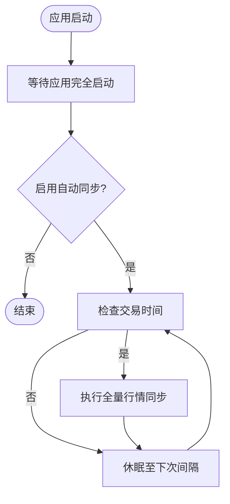

图表来源
- [app.py](file://app.py#L279-L330)

章节来源
- [app.py](file://app.py#L222-L330)

### 部署与容器化
- Docker Compose：Flask 应用与 Nginx 反向代理组合，暴露 80/443 端口，挂载日志与前端静态资源。
- 环境变量：.env 提供开发环境配置，生产环境通过 .env.production 注入。

章节来源
- [deploy/docker-compose.yml](file://deploy/docker-compose.yml#L1-L42)
- [.env](file://.env#L1-L32)

## 依赖关系分析
- Flask 依赖：Flask、Flask-CORS、pymongo、akshare、requests、python-dotenv、gunicorn、lxml、PyJWT。
- 关键耦合点：路由依赖服务层；服务层依赖模型层与云数据库客户端；应用工厂集中初始化与注册。

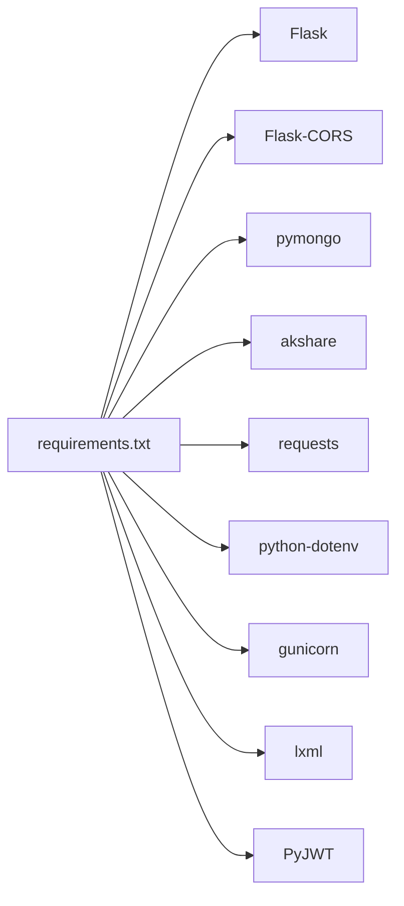

图表来源
- [requirements.txt](file://requirements.txt#L1-L12)

章节来源
- [requirements.txt](file://requirements.txt#L1-L12)

## 性能考虑
- 连接池与并发：云数据库客户端配置连接池与并发信号量，批量 upsert 提升写入效率。
- 交易时间调度：仅在交易时段执行全量同步，减少非必要开销。
- 日志轮转：生产环境使用 RotatingFileHandler，避免日志过大影响性能。
- 建议：引入 Redis 缓存热点数据、对高频接口增加缓存与限流、优化查询索引与分页。

## 故障排除指南
- 数据库连接失败：检查 MONGO_URI 与 WX_CLOUD_ENV 配置，确认网络可达性与权限。
- 认证失败：核对 JWT_SECRET、算法与过期时间，检查令牌格式与签名。
- 云数据库异常：关注 errcode 与 errmsg，确认集合存在与访问令牌有效性。
- 限流与封禁：查看速率限制与账户锁定策略，调整窗口与阈值。

章节来源
- [app.py](file://app.py#L69-L88)
- [services/cloud_db.py](file://services/cloud_db.py#L486-L533)
- [backend_utils/security.py](file://backend_utils/security.py#L17-L117)

## 结论
本后端架构以 Flask 为核心，通过蓝图路由与服务层实现清晰的职责分离，配合统一响应与安全中间件，形成稳定可靠的 RESTful API。双数据源设计兼顾灵活性与一致性，云数据库客户端提供高并发与可靠性保障。建议在生产环境中进一步完善缓存、监控与告警体系，持续优化性能与可用性。

## 附录
- 环境变量示例与用途参考 .env 文件。
- 部署参考 docker-compose.yml 与 Nginx 配置。

章节来源
- [.env](file://.env#L1-L32)
- [deploy/docker-compose.yml](file://deploy/docker-compose.yml#L1-L42)