# 数据模型架构

<cite>
**本文档引用的文件**
- [models/customer.py](file://models/customer.py)
- [models/group.py](file://models/group.py)
- [models/inquiry.py](file://models/inquiry.py)
- [models/order.py](file://models/order.py)
- [models/position.py](file://models/position.py)
- [models/settlement.py](file://models/settlement.py)
- [models/stock.py](file://models/stock.py)
- [models/transaction.py](file://models/transaction.py)
- [models/user.py](file://models/user.py)
- [services/cloud_db.py](file://services/cloud_db.py)
- [services/cloud_db.js](file://services/cloud_db.js)
- [routes/customer.py](file://routes/customer.py)
- [routes/inquiry.py](file://routes/inquiry.py)
- [mock_db.json](file://mock_db.json)
</cite>

## 目录
1. [简介](#简介)
2. [项目结构](#项目结构)
3. [核心组件](#核心组件)
4. [架构总览](#架构总览)
5. [详细组件分析](#详细组件分析)
6. [依赖关系分析](#依赖关系分析)
7. [性能考量](#性能考量)
8. [故障排除指南](#故障排除指南)
9. [结论](#结论)
10. [附录](#附录)

## 简介
本文件系统性梳理场外期权项目的MongoDB数据模型设计与ODM映射，覆盖实体模型字段定义、数据类型与验证规则；阐明模型间关系、引用与聚合查询策略；总结数据访问模式、索引策略与查询优化；给出数据迁移方案、版本管理与兼容性处理建议；并提供数据模型测试、Mock数据与数据完整性保障的实现方案。

## 项目结构
项目采用按领域模型划分的模块化组织方式，核心数据模型集中在 models 目录，配套服务层位于 services 目录，API 路由位于 routes 目录，同时提供本地 Mock 数据支持。

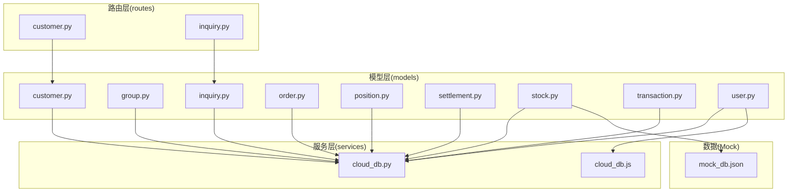

**图表来源**
- [models/customer.py](file://models/customer.py#L1-L300)
- [models/group.py](file://models/group.py#L1-L283)
- [models/inquiry.py](file://models/inquiry.py#L1-L148)
- [models/order.py](file://models/order.py#L1-L119)
- [models/position.py](file://models/position.py#L1-L206)
- [models/settlement.py](file://models/settlement.py#L1-L57)
- [models/stock.py](file://models/stock.py#L1-L386)
- [models/transaction.py](file://models/transaction.py#L1-L61)
- [models/user.py](file://models/user.py#L1-L309)
- [services/cloud_db.py](file://services/cloud_db.py#L1-L533)
- [services/cloud_db.js](file://services/cloud_db.js#L1-L327)
- [routes/customer.py](file://routes/customer.py#L1-L217)
- [routes/inquiry.py](file://routes/inquiry.py#L1-L175)
- [mock_db.json](file://mock_db.json#L1-L93359)

**章节来源**
- [models/customer.py](file://models/customer.py#L1-L300)
- [models/group.py](file://models/group.py#L1-L283)
- [models/inquiry.py](file://models/inquiry.py#L1-L148)
- [models/order.py](file://models/order.py#L1-L119)
- [models/position.py](file://models/position.py#L1-L206)
- [models/settlement.py](file://models/settlement.py#L1-L57)
- [models/stock.py](file://models/stock.py#L1-L386)
- [models/transaction.py](file://models/transaction.py#L1-L61)
- [models/user.py](file://models/user.py#L1-L309)
- [services/cloud_db.py](file://services/cloud_db.py#L1-L533)
- [services/cloud_db.js](file://services/cloud_db.js#L1-L327)
- [routes/customer.py](file://routes/customer.py#L1-L217)
- [routes/inquiry.py](file://routes/inquiry.py#L1-L175)
- [mock_db.json](file://mock_db.json#L1-L93359)

## 核心组件
- 客户模型(CustomerModel)：维护客户基本信息、分组、与用户/微信标识的关联，支持分页查询、去重校验与分组重命名。
- 分组模型(GroupModel)：管理分组及其成员（股票）列表，支持添加/移除成员与成员去重。
- 询价模型(InquiryModel)：记录询价请求，包含状态、手机号等字段，并建立相应索引。
- 订单模型(OrderModel)：生成唯一订单号，支持按状态与用户标识查询。
- 持仓模型(PositionModel)：管理客户持仓，支持统计聚合（本地Mongo可用聚合，云端受限）。
- 结算模型(SettlementModel)：记录到期/行权结算明细。
- 股票模型(StockModel)：提供股票行情数据的增删改查与批量写入，支持本地JSON Mock与MongoDB双态。
- 交易模型(TransactionModel)：记录资金流水。
- 用户模型(UserModel)：管理用户会话、管理员用户与微信用户查询/更新。

**章节来源**
- [models/customer.py](file://models/customer.py#L10-L300)
- [models/group.py](file://models/group.py#L10-L283)
- [models/inquiry.py](file://models/inquiry.py#L10-L148)
- [models/order.py](file://models/order.py#L10-L119)
- [models/position.py](file://models/position.py#L10-L206)
- [models/settlement.py](file://models/settlement.py#L5-L57)
- [models/stock.py](file://models/stock.py#L23-L386)
- [models/transaction.py](file://models/transaction.py#L6-L61)
- [models/user.py](file://models/user.py#L10-L309)

## 架构总览
系统采用“路由-模型-服务-数据库”的分层架构。路由层接收请求并调用业务服务或直接访问模型；模型层封装集合操作与ODM映射；服务层提供跨模型的业务编排；数据库层支持本地MongoDB与微信云开发数据库两种形态，通过统一的CloudDbClient适配。

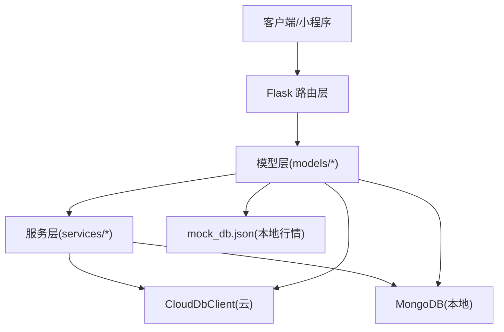

**图表来源**
- [routes/customer.py](file://routes/customer.py#L1-L217)
- [routes/inquiry.py](file://routes/inquiry.py#L1-L175)
- [models/customer.py](file://models/customer.py#L1-L300)
- [models/inquiry.py](file://models/inquiry.py#L1-L148)
- [models/stock.py](file://models/stock.py#L1-L386)
- [services/cloud_db.py](file://services/cloud_db.py#L108-L533)
- [mock_db.json](file://mock_db.json#L1-L93359)

## 详细组件分析

### 客户模型(CustomerModel)
- 字段与类型
  - 基本字段：name、phone、email、status、groupName、totalOrders、createdAt、updatedAt。
  - 关联字段：user_id（关联用户）、openid（关联微信）。
- 验证规则
  - 创建时对手机号唯一性进行检查；云端模式下若集合不存在抛出明确提示。
- 查询与分页
  - 支持按状态与关键词（名称/手机）过滤，云端与本地分别实现。
- 分组管理
  - 提供分组列表与重命名接口，云端通过字段查询与批量更新实现。

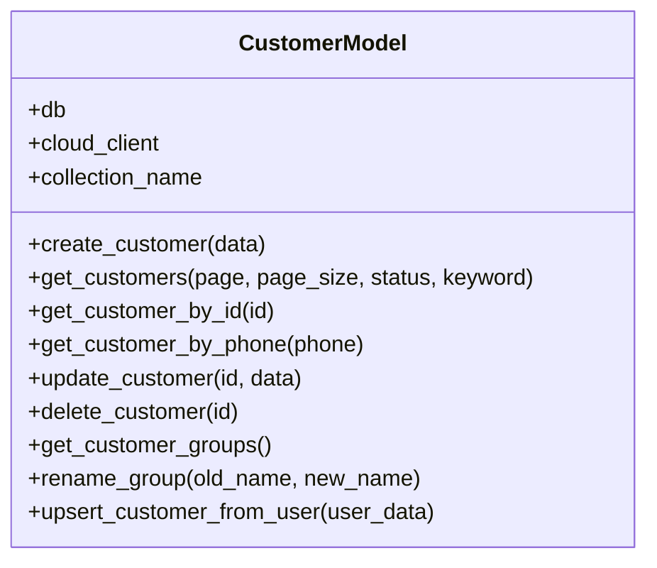

**图表来源**
- [models/customer.py](file://models/customer.py#L10-L300)

**章节来源**
- [models/customer.py](file://models/customer.py#L23-L300)

### 分组模型(GroupModel)
- 字段与类型
  - name、creator_id、members（数组，包含stock_code、market、name、added_at）。
- 成员管理
  - 添加/移除成员时进行去重校验；云端模式采用“读取-修改-写回”策略。
- 查询与更新
  - 支持按创建者过滤与按ID查询；更新仅更新元数据与时间戳。

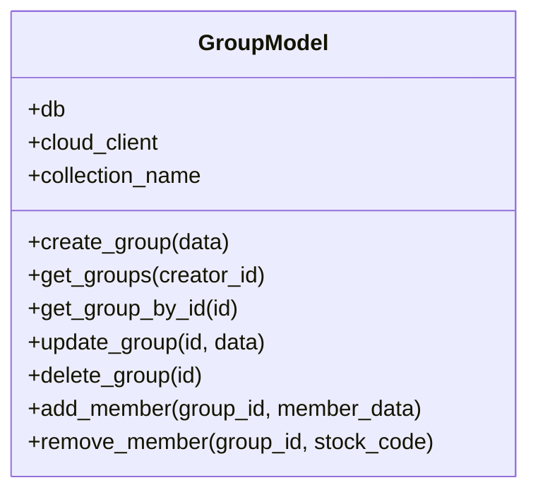

**图表来源**
- [models/group.py](file://models/group.py#L10-L283)

**章节来源**
- [models/group.py](file://models/group.py#L23-L283)

### 询价模型(InquiryModel)
- 字段与类型
  - createdAt、updatedAt、status、phone、openid（用户标识）、以及业务相关字段。
- 索引策略
  - 在本地MongoDB上创建createdAt、status、phone索引以优化查询。
- 查询与分页
  - 支持按状态与用户标识过滤，云端与本地实现一致。

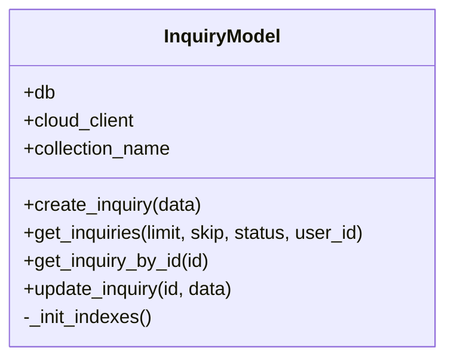

**图表来源**
- [models/inquiry.py](file://models/inquiry.py#L10-L148)

**章节来源**
- [models/inquiry.py](file://models/inquiry.py#L24-L148)

### 订单模型(OrderModel)
- 字段与类型
  - orderId（唯一索引）、createdAt、updatedAt、status、openid等。
- 索引策略
  - 在本地MongoDB上为orderId（唯一）与createdAt建立索引。
- 查询与分页
  - 支持按状态与用户标识过滤，云端与本地实现一致。

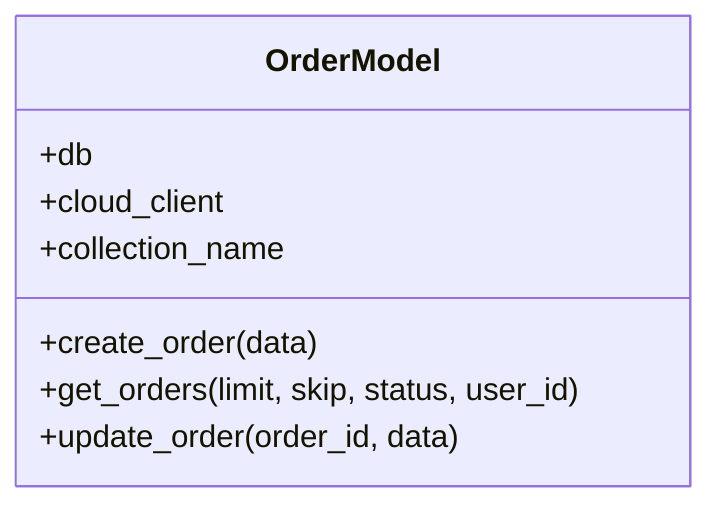

**图表来源**
- [models/order.py](file://models/order.py#L10-L119)

**章节来源**
- [models/order.py](file://models/order.py#L17-L119)

### 持仓模型(PositionModel)
- 字段与类型
  - customerId、productCode、status、market、currency、marketValue、profitLoss等。
- 统计聚合
  - 本地MongoDB支持聚合统计；云端受限，采用“读取上限后聚合”策略。
- 批量写入
  - 支持批量插入，云端逐条add，本地批量insert。

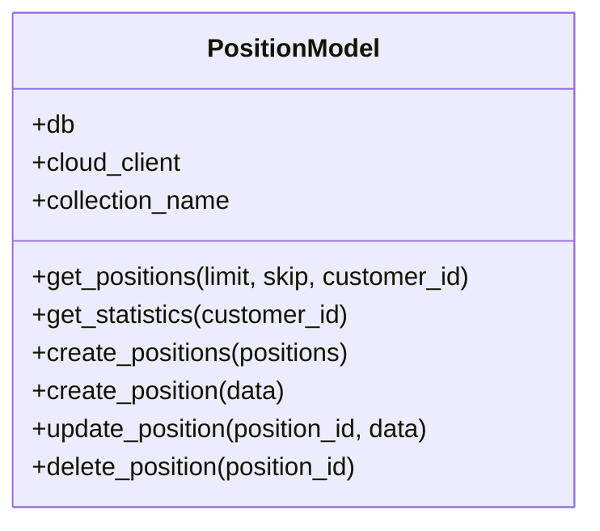

**图表来源**
- [models/position.py](file://models/position.py#L10-L206)

**章节来源**
- [models/position.py](file://models/position.py#L17-L206)

### 结算模型(SettlementModel)
- 字段与类型
  - date、position_id、user_id、type（expiry/exercise）、strike_price、settlement_price、pnl、status、created_at。
- 查询
  - 支持按用户过滤与分页排序。

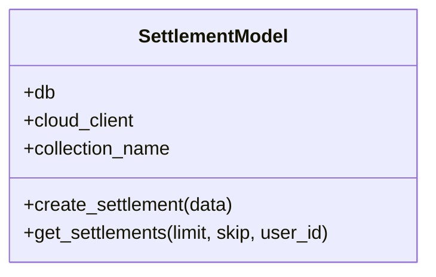

**图表来源**
- [models/settlement.py](file://models/settlement.py#L5-L57)

**章节来源**
- [models/settlement.py](file://models/settlement.py#L18-L57)

### 股票模型(StockModel)
- 字段与类型
  - stock_code（唯一索引）、name、price、changePercent、open、high、low、pre_close、volume、amount、updated_at、created_at等。
- 存储形态
  - 优先使用MongoDB集合stocks；若无连接则回退至本地JSON文件（mock_db.json）。
- 批量写入
  - 支持批量upsert，本地采用原子写入与缓存索引优化。

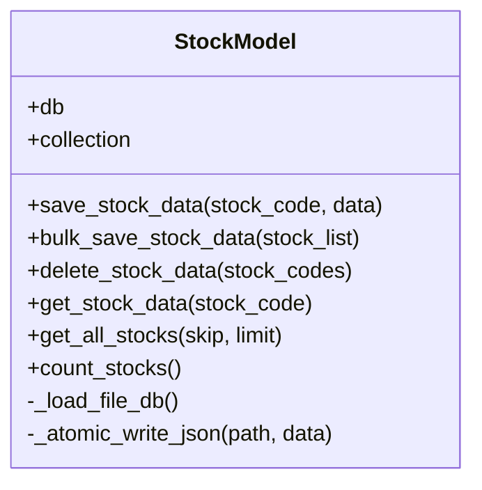

**图表来源**
- [models/stock.py](file://models/stock.py#L23-L386)

**章节来源**
- [models/stock.py](file://models/stock.py#L45-L386)
- [mock_db.json](file://mock_db.json#L1-L93359)

### 交易模型(TransactionModel)
- 字段与类型
  - user_id、type（deposit/withdraw/buy/sell/fee）、amount、balance_after、remark、created_at。
- 查询
  - 支持按用户过滤与分页统计。

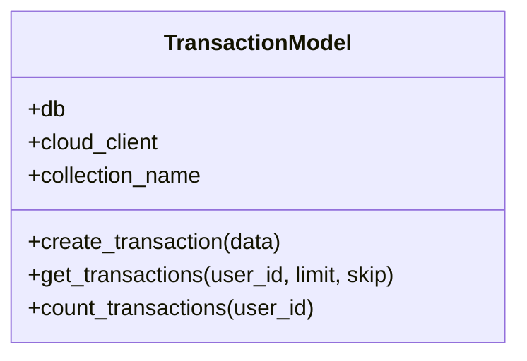

**图表来源**
- [models/transaction.py](file://models/transaction.py#L6-L61)

**章节来源**
- [models/transaction.py](file://models/transaction.py#L19-L61)

### 用户模型(UserModel)
- 字段与类型
  - 管理员用户：username、created_at、updated_at等。
  - 微信用户：openid、phone、email、balance、last_login等。
  - 会话：user_id、device_info、ip、refresh_token_hash、expires_at、is_active。
- 会话管理
  - 支持创建、查找、吊销与列出活动会话。
- 用户查询
  - 支持按用户名、手机号、邮箱查找；余额更新采用“读取-校验-更新”。

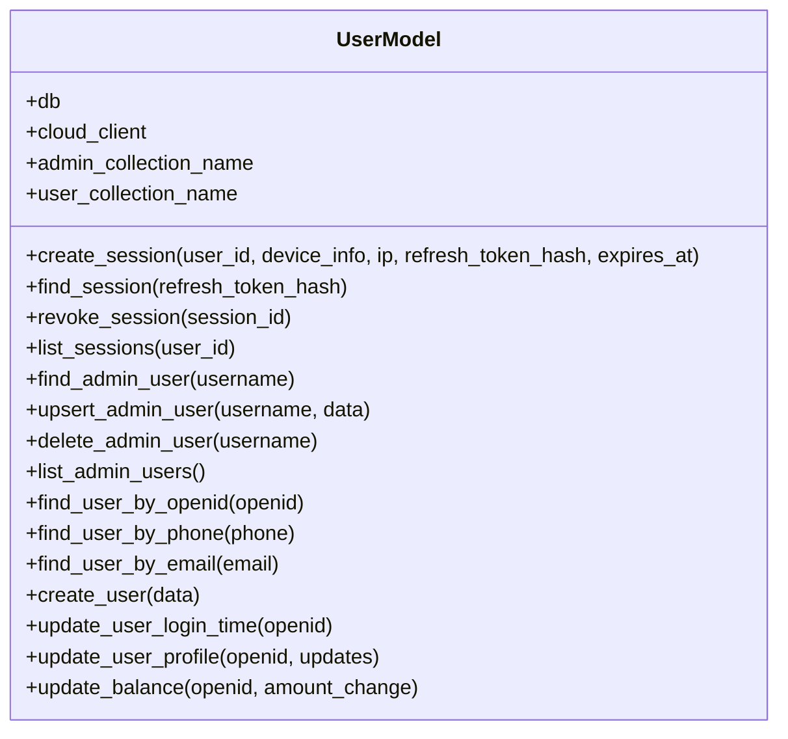

**图表来源**
- [models/user.py](file://models/user.py#L10-L309)

**章节来源**
- [models/user.py](file://models/user.py#L27-L309)

## 依赖关系分析
- 模型与服务
  - 所有模型均依赖服务层提供的CloudDbClient以适配云端与本地数据库差异。
- 路由与模型
  - 路由层通过工厂方法获取模型实例，注入db或cloud_db客户端。
- 云端适配
  - Python侧使用CloudDbClient，JS侧使用Node.js版本的CloudDbClient，二者均通过HTTP API与微信云开发交互。

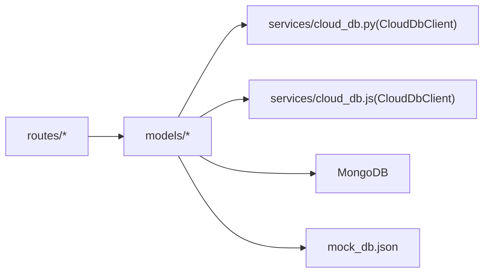

**图表来源**
- [routes/customer.py](file://routes/customer.py#L15-L24)
- [routes/inquiry.py](file://routes/inquiry.py#L1-L10)
- [models/customer.py](file://models/customer.py#L11-L18)
- [models/inquiry.py](file://models/inquiry.py#L11-L18)
- [services/cloud_db.py](file://services/cloud_db.py#L108-L533)
- [services/cloud_db.js](file://services/cloud_db.js#L7-L327)
- [mock_db.json](file://mock_db.json#L1-L93359)

**章节来源**
- [routes/customer.py](file://routes/customer.py#L15-L24)
- [routes/inquiry.py](file://routes/inquiry.py#L1-L10)
- [models/customer.py](file://models/customer.py#L11-L18)
- [models/inquiry.py](file://models/inquiry.py#L11-L18)
- [services/cloud_db.py](file://services/cloud_db.py#L108-L533)
- [services/cloud_db.js](file://services/cloud_db.js#L7-L327)

## 性能考量
- 索引策略
  - 询价、订单、持仓等高频查询集合已建立必要索引（createdAt、status、phone、orderId唯一、customerId/productCode等），显著降低查询成本。
- 批量写入
  - 股票数据批量upsert采用批量操作；云端逐条add，本地批量insert，减少往返次数。
- 云端限制
  - 云端聚合能力有限，采用“读取上限后聚合”的折衷方案；可通过云函数扩展聚合能力。
- 会话并发
  - 云端客户端内置信号量与重试机制，提升高并发下的稳定性。

**章节来源**
- [models/inquiry.py](file://models/inquiry.py#L24-L31)
- [models/order.py](file://models/order.py#L17-L21)
- [models/position.py](file://models/position.py#L17-L21)
- [models/stock.py](file://models/stock.py#L210-L226)
- [services/cloud_db.py](file://services/cloud_db.py#L137-L160)
- [services/cloud_db.py](file://services/cloud_db.py#L486-L533)

## 故障排除指南
- 集合不存在
  - 云端模式下若集合不存在，会抛出明确错误提示，需在微信云开发控制台创建对应集合。
- 查询异常
  - 云端查询/统计返回非预期格式时，客户端会记录警告并返回空结果或零计数，便于快速定位问题。
- 会话并发
  - 若出现请求繁忙，客户端内置指数退避与重试机制，必要时调整并发参数。

**章节来源**
- [models/customer.py](file://models/customer.py#L48-L54)
- [services/cloud_db.py](file://services/cloud_db.py#L241-L247)
- [services/cloud_db.py](file://services/cloud_db.py#L264-L270)
- [services/cloud_db.py](file://services/cloud_db.py#L523-L532)

## 结论
本项目通过清晰的模型分层与统一的云端适配层，实现了MongoDB与微信云开发的双态支持。模型字段设计合理，索引策略覆盖高频查询场景，数据访问模式兼顾性能与可维护性。建议后续在云端引入云函数以增强聚合与复杂查询能力，并完善版本化迁移脚本与兼容性策略。

## 附录

### 数据模型ER关系图
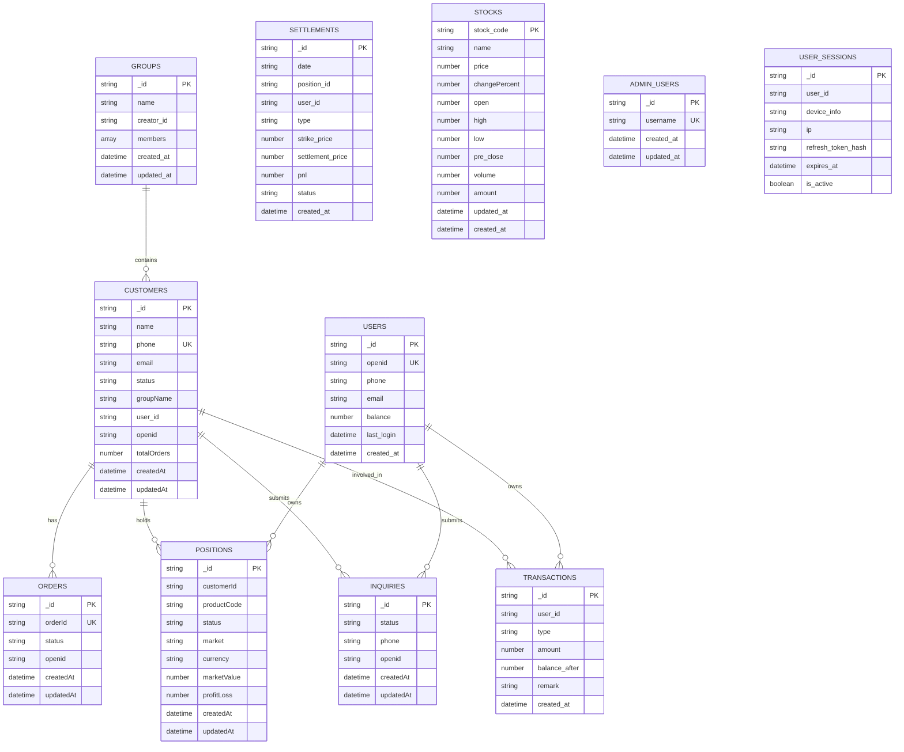

**图表来源**
- [models/customer.py](file://models/customer.py#L25-L36)
- [models/group.py](file://models/group.py#L30-L36)
- [models/inquiry.py](file://models/inquiry.py#L33-L36)
- [models/order.py](file://models/order.py#L28-L35)
- [models/position.py](file://models/position.py#L152-L170)
- [models/settlement.py](file://models/settlement.py#L18-L29)
- [models/stock.py](file://models/stock.py#L135-L159)
- [models/transaction.py](file://models/transaction.py#L19-L28)
- [models/user.py](file://models/user.py#L199-L217)
- [models/user.py](file://models/user.py#L95-L108)
- [models/user.py](file://models/user.py#L28-L44)

### 数据访问序列图（创建询价）
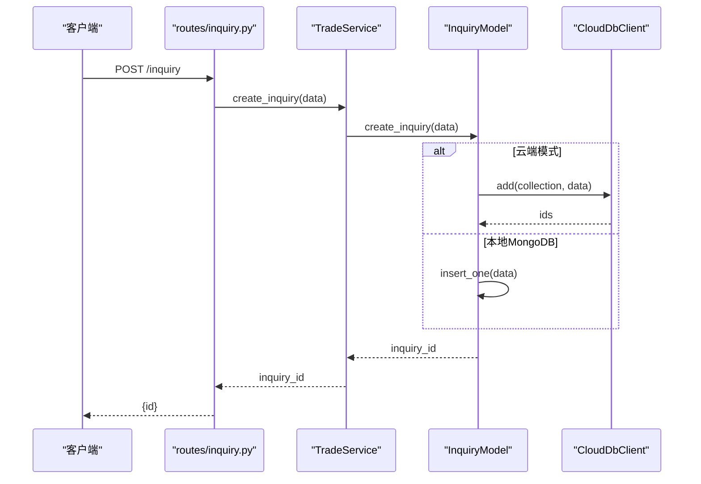

**图表来源**
- [routes/inquiry.py](file://routes/inquiry.py#L11-L34)
- [models/inquiry.py](file://models/inquiry.py#L32-L53)
- [services/cloud_db.py](file://services/cloud_db.py#L272-L283)

### 数据迁移与版本管理建议
- 版本化迁移
  - 为各集合定义版本号与迁移脚本，按需执行字段新增、索引重建与数据清洗。
- 兼容性处理
  - 云端与本地字段命名与类型保持一致；对日期字段统一ISO格式；对数组字段提供默认值。
- 兼容查询
  - 云端聚合受限时，采用“读取上限后聚合”的降级策略，并在本地MongoDB提供完整聚合能力。

**章节来源**
- [models/inquiry.py](file://models/inquiry.py#L24-L31)
- [models/order.py](file://models/order.py#L17-L21)
- [models/position.py](file://models/position.py#L65-L118)

### 数据完整性保障
- 唯一性约束
  - orderId（订单）、stock_code（股票）、openid/username（用户/管理员）等关键字段建立唯一索引。
- 时间戳一致性
  - 所有写入操作统一设置createdAt/updatedAt，云端与本地均进行ISO格式转换。
- 余额与风控
  - 用户余额更新采用“读取-校验-更新”，防止透支。

**章节来源**
- [models/order.py](file://models/order.py#L18-L18)
- [models/stock.py](file://models/stock.py#L46-L48)
- [models/user.py](file://models/user.py#L291-L309)

### 测试与Mock数据
- Mock数据
  - 使用mock_db.json作为本地行情数据源，支持读取、写入与缓存索引，便于离线测试与开发。
- 模型测试
  - 建议为各模型编写单元测试，覆盖创建、查询、更新、删除与边界条件；对云端模式增加错误场景测试。

**章节来源**
- [mock_db.json](file://mock_db.json#L1-L93359)
- [models/stock.py](file://models/stock.py#L55-L119)