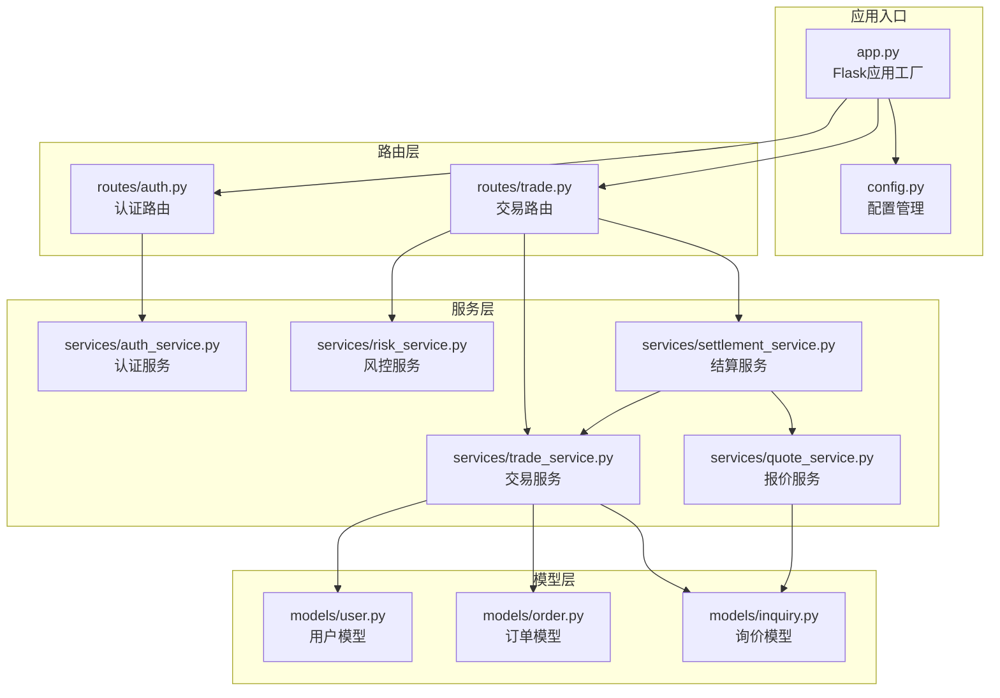
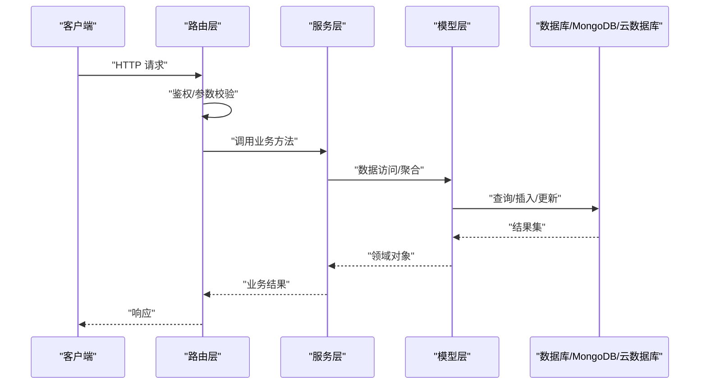
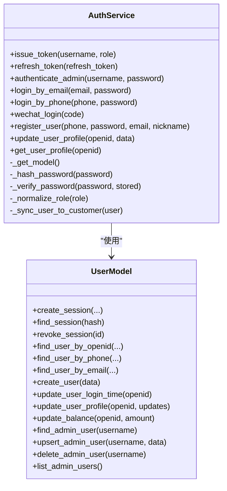
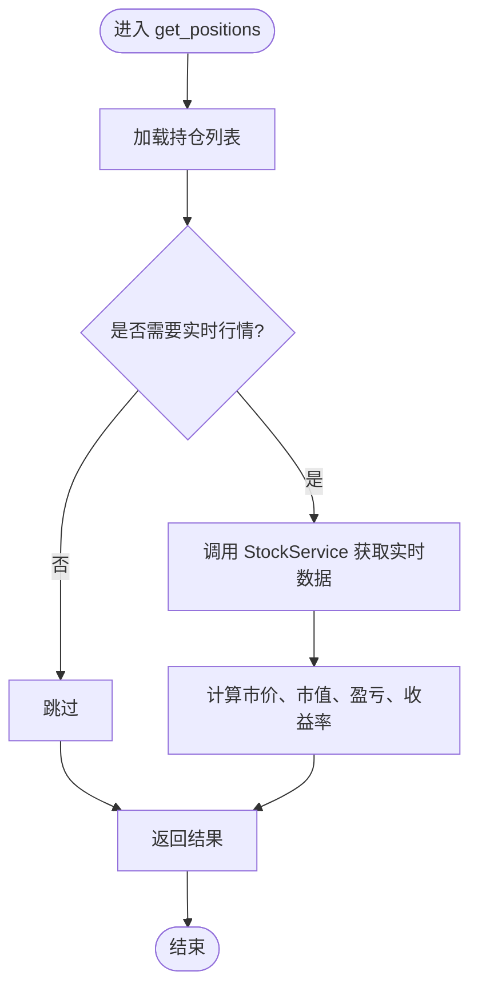
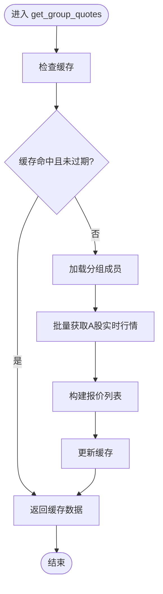
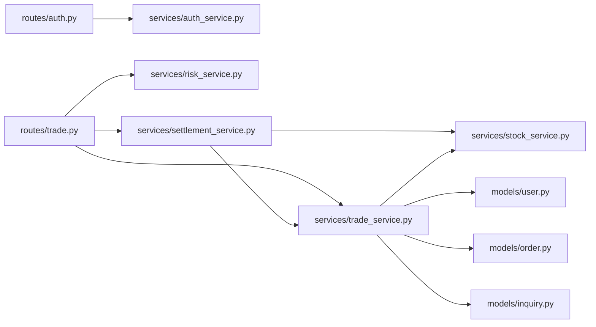

# 服务层架构

<cite>
**本文引用的文件**
- [app.py](file://app.py)
- [config.py](file://config.py)
- [routes/auth.py](file://routes/auth.py)
- [routes/trade.py](file://routes/trade.py)
- [services/auth_service.py](file://services/auth_service.py)
- [services/trade_service.py](file://services/trade_service.py)
- [services/risk_service.py](file://services/risk_service.py)
- [services/quote_service.py](file://services/quote_service.py)
- [services/settlement_service.py](file://services/settlement_service.py)
- [models/user.py](file://models/user.py)
- [models/order.py](file://models/order.py)
- [models/inquiry.py](file://models/inquiry.py)
</cite>

## 目录
1. [简介](#简介)
2. [项目结构](#项目结构)
3. [核心组件](#核心组件)
4. [架构总览](#架构总览)
5. [详细组件分析](#详细组件分析)
6. [依赖分析](#依赖分析)
7. [性能考虑](#性能考虑)
8. [故障排查指南](#故障排查指南)
9. [结论](#结论)
10. [附录](#附录)

## 简介
本文件系统性梳理该场外期权项目的“服务层架构”，重点覆盖业务逻辑封装、服务层设计模式、依赖注入与事务管理、服务间协作、数据流与异常处理，并给出测试策略、Mock实现与集成测试方案，以及性能优化、缓存策略与并发控制的实践细节。目标读者既包括技术开发者，也包括需要理解系统运作原理的产品与运营人员。

## 项目结构
服务层围绕“路由层-服务层-模型层”的分层组织，采用“按功能域”划分的服务模块，结合轻量依赖注入（通过 Flask 应用上下文共享数据库与云数据库客户端），实现清晰的职责边界与可测试性。

图表来源
- [app.py](file://app.py#L103-L276)
- [config.py](file://config.py#L22-L132)
- [routes/auth.py](file://routes/auth.py#L12-L17)
- [routes/trade.py](file://routes/trade.py#L9-L16)
- [services/auth_service.py](file://services/auth_service.py#L14-L416)
- [services/trade_service.py](file://services/trade_service.py#L8-L318)
- [services/risk_service.py](file://services/risk_service.py#L7-L60)
- [services/quote_service.py](file://services/quote_service.py#L9-L109)
- [services/settlement_service.py](file://services/settlement_service.py#L10-L113)
- [models/user.py](file://models/user.py#L10-L309)
- [models/order.py](file://models/order.py#L10-L119)
- [models/inquiry.py](file://models/inquiry.py#L10-L148)

章节来源
- [app.py](file://app.py#L103-L276)
- [config.py](file://config.py#L22-L132)

## 核心组件
- 认证服务（AuthService）：负责管理员与用户认证、令牌签发与刷新、会话管理、微信登录、用户资料同步等。
- 交易服务（TradeService）：封装询价、订单、持仓、账户与资金流水等交易相关业务。
- 风控服务（RiskService）：提供Black-Scholes希腊字母计算与交易前风控校验。
- 报价服务（QuoteService）：提供分组内股票实时行情批量获取与缓存。
- 结算服务（SettlementService）：每日到期结算、损益计算与资金入账。
- 模型层（Models）：用户、订单、询价等数据访问对象，统一支持本地MongoDB与微信云数据库。

章节来源
- [services/auth_service.py](file://services/auth_service.py#L14-L416)
- [services/trade_service.py](file://services/trade_service.py#L8-L318)
- [services/risk_service.py](file://services/risk_service.py#L7-L60)
- [services/quote_service.py](file://services/quote_service.py#L9-L109)
- [services/settlement_service.py](file://services/settlement_service.py#L10-L113)
- [models/user.py](file://models/user.py#L10-L309)
- [models/order.py](file://models/order.py#L10-L119)
- [models/inquiry.py](file://models/inquiry.py#L10-L148)

## 架构总览
服务层通过 Flask 蓝图暴露 REST 接口，路由层仅做参数解析与鉴权，核心业务逻辑集中在服务层；服务层通过模型层访问数据源（MongoDB 或微信云数据库）。应用启动时初始化数据库与云数据库客户端，注入到 Flask 应用上下文中，服务层通过 current_app 获取。

图表来源
- [routes/auth.py](file://routes/auth.py#L74-L96)
- [routes/trade.py](file://routes/trade.py#L67-L97)
- [services/auth_service.py](file://services/auth_service.py#L162-L179)
- [services/trade_service.py](file://services/trade_service.py#L38-L68)
- [models/user.py](file://models/user.py#L239-L254)
- [models/order.py](file://models/order.py#L28-L52)
- [models/inquiry.py](file://models/inquiry.py#L32-L53)

## 详细组件分析

### 认证服务（AuthService）
- 职责划分
  - 管理员与用户认证、令牌签发与刷新、会话持久化与撤销、微信登录、用户资料同步与统一身份。
- 关键能力
  - JWT 签发与刷新（Access/Refresh 双令牌）、PBKDF2 密码哈希、会话表管理、管理员用户增删改查。
  - 微信登录（支持开发环境 Mock）、用户资料更新与统一身份同步至客户集合。
- 依赖注入
  - 通过 Flask 应用上下文 current_app 获取 ensure_db/db/cloud_db，动态选择本地或云数据库。
- 异常处理
  - 登录/刷新失败、会话不存在/过期、微信接口异常等均有明确错误返回。

图表来源
- [services/auth_service.py](file://services/auth_service.py#L14-L416)
- [models/user.py](file://models/user.py#L10-L309)

章节来源
- [services/auth_service.py](file://services/auth_service.py#L14-L416)
- [models/user.py](file://models/user.py#L10-L309)

### 交易服务（TradeService）
- 职责划分
  - 询价管理（创建、查询、状态更新、统计）、订单管理（创建、查询、状态更新）、持仓管理（创建、查询、更新、删除、统计与实时盈亏计算）、账户与资金流水（余额变动、交易明细）。
- 数据流
  - 持仓查询时联动实时行情服务计算当前价格、市值与盈亏；账户汇总聚合用户余额与持仓价值。
- 并发与一致性
  - 余额更新通过模型层原子性保障（fetch-and-check 再更新），避免透支；订单/询价状态更新采用模型层条件更新。
- 依赖注入
  - 通过 current_app 获取 db/cloud_db，统一支持本地与云数据库。

图表来源
- [services/trade_service.py](file://services/trade_service.py#L125-L164)

章节来源
- [services/trade_service.py](file://services/trade_service.py#L8-L318)
- [models/order.py](file://models/order.py#L10-L119)
- [models/inquiry.py](file://models/inquiry.py#L10-L148)
- [models/user.py](file://models/user.py#L291-L309)

### 风控服务（RiskService）
- 职责划分
  - 提供 Black-Scholes 希腊字母计算（Delta/Gamma/Theta/Vega/Rho），交易前风控校验（余额与限额）。
- 复杂度与性能
  - 数学计算为 O(1)，无显著性能瓶颈；建议在路由层缓存常用参数组合以减少重复计算。

章节来源
- [services/risk_service.py](file://services/risk_service.py#L7-L60)

### 报价服务（QuoteService）
- 职责划分
  - 批量获取分组成员股票实时行情，内置进程内缓存（键空间+TTL）。
- 性能优化
  - 使用 AkShare 一次性拉取全部行情后过滤，避免多次网络请求；缓存 TTL 默认 60 秒，降低外部依赖压力。
- 异常处理
  - 失败时回退逐条获取，保证可用性。

图表来源
- [services/quote_service.py](file://services/quote_service.py#L28-L109)

章节来源
- [services/quote_service.py](file://services/quote_service.py#L9-L109)

### 结算服务（SettlementService）
- 职责划分
  - 每日扫描活跃持仓，判断到期并进行结算：计算损益、写入结算记录、向用户账户入账（若为正值）。
- 依赖协作
  - 依赖交易服务获取持仓、依赖股票服务获取实时价格、依赖结算模型持久化记录。
- 并发与一致性
  - 当前为单次扫描（限制数量）；如需全量扫描，建议引入游标/分页与幂等标识避免重复结算。

章节来源
- [services/settlement_service.py](file://services/settlement_service.py#L10-L113)

### 路由层与依赖注入
- 认证路由（routes/auth.py）
  - 提供登录、令牌刷新、用户信息、管理员用户管理、微信登录等接口；使用装饰器 require_auth/require_roles 控制鉴权与角色。
- 交易路由（routes/trade.py）
  - 提供风控计算、希腊字母计算、每日结算触发、持仓/订单/账户/资金流水等接口；统一鉴权与分页响应。
- 依赖注入
  - 路由层在模块级别创建服务实例（AuthService/TradeService/RiskService/SettlementService），服务内部通过 Flask 应用上下文 current_app 获取 db/cloud_db，实现“按需注入”。

章节来源
- [routes/auth.py](file://routes/auth.py#L12-L353)
- [routes/trade.py](file://routes/trade.py#L9-L330)

## 依赖分析
- 组件耦合
  - 路由层仅依赖服务层；服务层依赖模型层；模型层依赖数据库客户端（MongoDB 或云数据库）。
  - 服务层之间存在协作：结算服务依赖交易与股票服务；交易服务依赖用户、订单、询价模型。
- 外部依赖
  - AkShare 用于行情批量抓取；微信登录接口；JWT 令牌；Flask/CORS/环境变量加载。
- 潜在循环依赖
  - 未发现循环依赖；服务层通过“方法内导入”或“构造函数注入”避免强耦合。

图表来源
- [routes/auth.py](file://routes/auth.py#L12-L17)
- [routes/trade.py](file://routes/trade.py#L9-L16)
- [services/trade_service.py](file://services/trade_service.py#L12-L34)
- [services/settlement_service.py](file://services/settlement_service.py#L12-L13)
- [models/user.py](file://models/user.py#L10-L309)
- [models/order.py](file://models/order.py#L10-L119)
- [models/inquiry.py](file://models/inquiry.py#L10-L148)

章节来源
- [routes/auth.py](file://routes/auth.py#L12-L17)
- [routes/trade.py](file://routes/trade.py#L9-L16)
- [services/trade_service.py](file://services/trade_service.py#L12-L34)
- [services/settlement_service.py](file://services/settlement_service.py#L12-L13)

## 性能考虑
- 缓存策略
  - 报价服务：进程内缓存（键空间+TTL），批量拉取行情，减少外部依赖调用次数。
  - 建议：在高并发场景下引入分布式缓存（Redis）替代进程内缓存，提升共享与持久性。
- 并发控制
  - 余额更新采用“读取-校验-更新”原子性保障；建议在高并发场景下引入分布式锁或数据库层面的原子操作。
- 批处理与异步
  - 行情自动同步通过后台线程定时执行，建议改为消息队列+消费者模式，提升可靠性与扩展性。
- 索引与查询
  - 模型层已为常用查询建立索引（如订单/询价的创建时间、状态、手机号等），建议持续监控慢查询并补充复合索引。

[本节为通用指导，不直接分析具体文件]

## 故障排查指南
- 认证失败
  - 检查 JWT 密钥、算法与过期时间配置；确认 refresh_token 是否在会话表中存在且未过期。
- 微信登录异常
  - 核对 WX_APPID/WX_SECRET；开发环境 Mock 登录需以特定前缀触发。
- 余额不足
  - 交易路由在提现时会抛出余额不足异常，需先充值或检查账户汇总。
- 行情获取失败
  - 报价服务回退到逐条获取；检查 AkShare 可用性与网络超时。
- 结算未生效
  - 检查到期判断逻辑与日期格式；确认结算记录是否写入与入账是否成功。

章节来源
- [services/auth_service.py](file://services/auth_service.py#L133-L161)
- [services/trade_service.py](file://services/trade_service.py#L296-L310)
- [services/quote_service.py](file://services/quote_service.py#L98-L108)
- [services/settlement_service.py](file://services/settlement_service.py#L50-L57)

## 结论
该服务层采用清晰的分层与职责划分，结合 Flask 的轻量依赖注入与模型层抽象，实现了对 MongoDB 与微信云数据库的统一访问。通过路由层的鉴权与参数校验、服务层的业务编排与模型层的数据访问，形成稳定可扩展的交易与风控体系。建议在高并发场景下引入分布式缓存与消息队列，进一步完善幂等与一致性保障。

[本节为总结性内容，不直接分析具体文件]

## 附录

### 服务测试策略
- 单元测试
  - 对服务层方法进行输入输出断言，使用 Mock 替换外部依赖（如微信登录、AkShare、云数据库）。
  - 示例思路：使用 unittest.mock.patch 替换 requests/akshare/cloud_db，断言内部调用与返回值。
- 集成测试
  - 通过 Flask Test Client 发起完整请求链路，覆盖鉴权、参数校验、业务逻辑与响应格式。
  - 使用测试环境配置（TestingConfig）与独立数据库实例，确保隔离性。
- 端到端测试
  - 借助 Postman/Playwright 等工具，模拟真实用户流程（登录、下单、结算、查询）。

[本节为通用指导，不直接分析具体文件]

### Mock 实现与集成测试方案
- Mock 方案
  - 使用 unittest.mock：替换微信登录接口、AkShare 行情接口、云数据库客户端，返回可控数据。
  - 使用 pytest-mock：在测试夹具中注入 Mock，减少样板代码。
- 集成测试
  - 在测试环境中启动最小化 Flask 应用，注册测试蓝图，使用数据库快照或临时集合进行隔离测试。
  - 使用 Factory Boy/Faker 生成测试数据，覆盖边界条件（空数据、非法参数、并发冲突）。

[本节为通用指导，不直接分析具体文件]