# 路由系统设计

<cite>
**本文档引用的文件**
- [app.py](file://app.py)
- [config.py](file://config.py)
- [routes/auth.py](file://routes/auth.py)
- [routes/inquiry.py](file://routes/inquiry.py)
- [routes/trade.py](file://routes/trade.py)
- [routes/admin.py](file://routes/admin.py)
- [routes/customer.py](file://routes/customer.py)
- [routes/group.py](file://routes/group.py)
- [routes/stock.py](file://routes/stock.py)
- [routes/message.py](file://routes/message.py)
- [routes/fee.py](file://routes/fee.py)
- [routes/config.py](file://routes/config.py)
- [backend_utils/response.py](file://backend_utils/response.py)
- [backend_utils/security.py](file://backend_utils/security.py)
</cite>

## 目录
1. [简介](#简介)
2. [项目结构](#项目结构)
3. [核心组件](#核心组件)
4. [架构概览](#架构概览)
5. [详细组件分析](#详细组件分析)
6. [依赖分析](#依赖分析)
7. [性能考虑](#性能考虑)
8. [故障排除指南](#故障排除指南)
9. [结论](#结论)

## 简介

本项目采用Flask蓝图(BP)架构设计，构建了一个完整的期权交易路由系统。系统通过模块化的蓝图组织实现了清晰的功能分离，支持认证授权、询价管理、交易处理、管理后台等核心业务功能。

该路由系统采用了统一的响应格式标准化、中间件装饰器模式、权限控制机制和错误处理策略，为场外期权交易提供了稳定可靠的API接口层。

## 项目结构

项目采用基于功能模块的蓝图架构，每个功能模块都有独立的蓝图定义和路由组织：

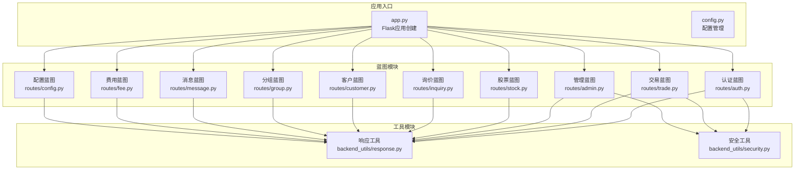

**图表来源**
- [app.py](file://app.py#L103-L210)
- [routes/auth.py](file://routes/auth.py#L14-L15)
- [routes/trade.py](file://routes/trade.py#L13-L16)

**章节来源**
- [app.py](file://app.py#L103-L210)
- [config.py](file://config.py#L22-L63)

## 核心组件

### 蓝图注册机制

系统通过统一的应用工厂模式创建Flask应用，并集中注册所有蓝图：

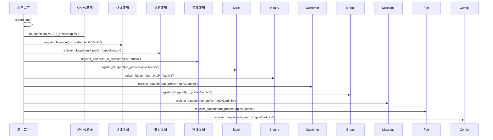

**图表来源**
- [app.py](file://app.py#L183-L209)

### 统一响应格式

系统实现了标准化的响应格式，确保所有API接口的一致性：

| 字段 | 类型 | 描述 | 默认值 |
|------|------|------|--------|
| success | boolean | 请求处理结果 | false |
| message | string | 响应消息 | "操作失败" |
| code | number | HTTP状态码 | 400 |
| data | any | 返回数据 | null |

**章节来源**
- [backend_utils/response.py](file://backend_utils/response.py#L11-L118)

## 架构概览

系统采用分层架构设计，通过蓝图实现功能模块化：

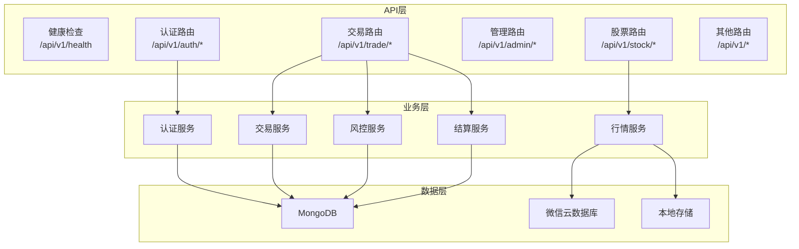

**图表来源**
- [app.py](file://app.py#L183-L209)
- [routes/auth.py](file://routes/auth.py#L14-L15)
- [routes/trade.py](file://routes/trade.py#L13-L16)

## 详细组件分析

### 认证路由系统

认证系统实现了完整的用户身份验证和权限管理机制：

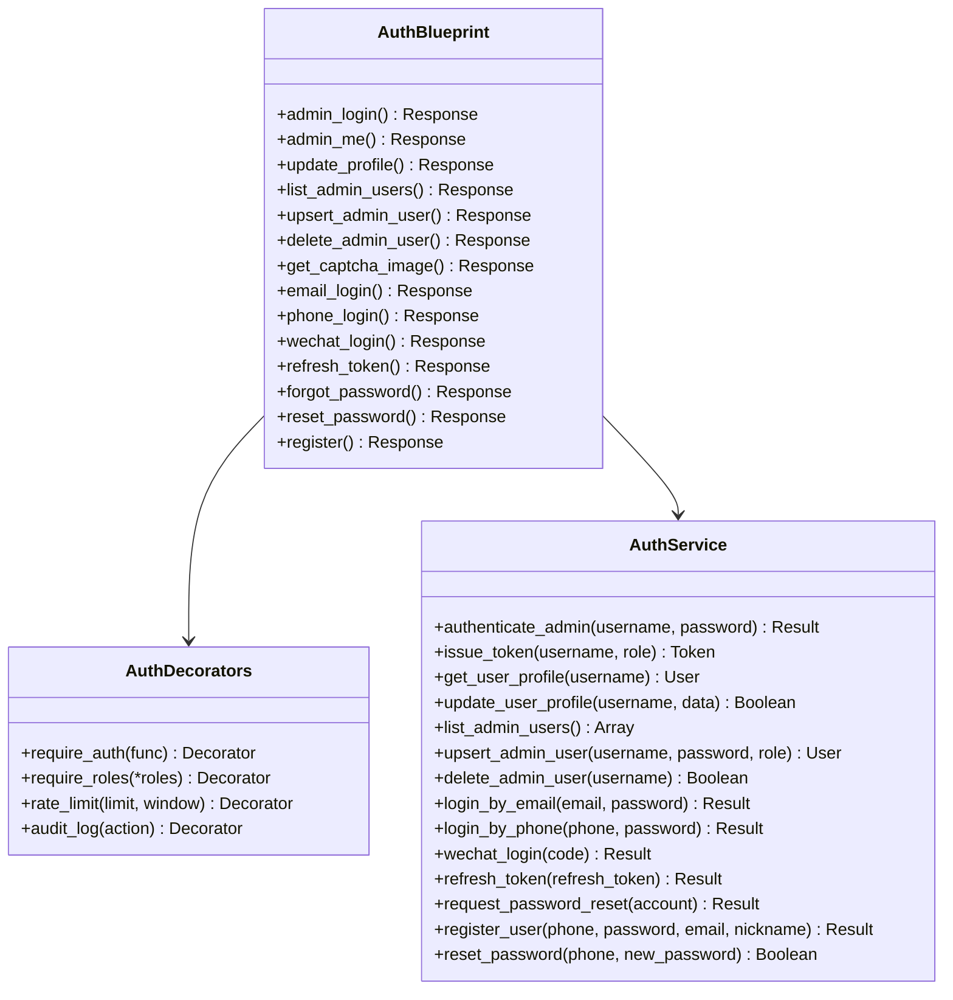

**图表来源**
- [routes/auth.py](file://routes/auth.py#L14-L353)
- [backend_utils/security.py](file://backend_utils/security.py#L17-L117)

#### 认证装饰器使用

系统实现了多层认证和授权机制：

1. **令牌验证装饰器** (`require_auth`)
   - 提取Authorization头部
   - 验证JWT令牌有效性
   - 将用户信息注入g对象

2. **角色权限装饰器** (`require_roles`)
   - 支持多角色权限控制
   - 角色标准化处理
   - 权限拒绝处理

3. **速率限制装饰器** (`rate_limit`)
   - 基于IP和端点的限流
   - 内存存储的滑动窗口算法
   - 自动清理过期记录

4. **审计日志装饰器** (`audit_log`)
   - 记录用户操作行为
   - 跟踪IP地址和状态
   - 异常情况错误记录

**章节来源**
- [routes/auth.py](file://routes/auth.py#L33-L72)
- [backend_utils/security.py](file://backend_utils/security.py#L17-L117)

### 询价路由系统

询价系统提供了完整的询价生命周期管理：

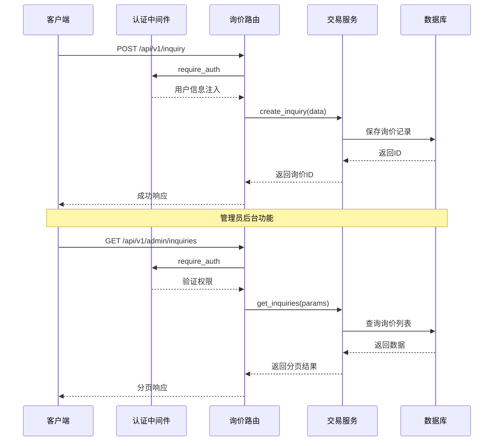

**图表来源**
- [routes/inquiry.py](file://routes/inquiry.py#L11-L175)

#### 询价功能特性

1. **用户提交询价**
   - 支持产品选择验证
   - 自动关联用户信息
   - 失败重试机制

2. **管理员管理功能**
   - 询价列表查询
   - 状态批量更新
   - 统计数据分析
   - 数据导出功能

3. **数据验证机制**
   - 必填字段检查
   - 参数类型验证
   - 业务规则约束

**章节来源**
- [routes/inquiry.py](file://routes/inquiry.py#L11-L175)

### 交易路由系统

交易系统实现了完整的交易生命周期管理：

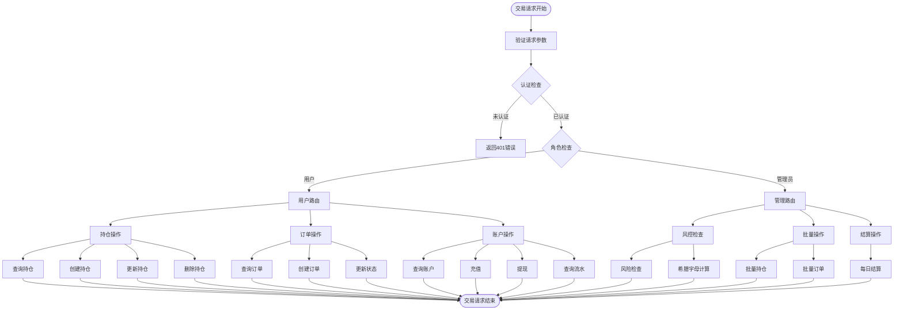

**图表来源**
- [routes/trade.py](file://routes/trade.py#L18-L330)

#### 交易功能模块

1. **风险管理模块**
   - 预交易风险检查
   - 希腊字母计算
   - 风险阈值控制

2. **持仓管理模块**
   - 持仓查询和统计
   - 持仓创建、更新、删除
   - 用户权限控制

3. **订单管理模块**
   - 订单查询和创建
   - 订单状态更新
   - 用户关联处理

4. **账户资金模块**
   - 账户余额查询
   - 充值和提现处理
   - 资金流水记录

**章节来源**
- [routes/trade.py](file://routes/trade.py#L18-L330)

### 管理后台路由系统

管理后台提供了全面的数据管理和操作功能：

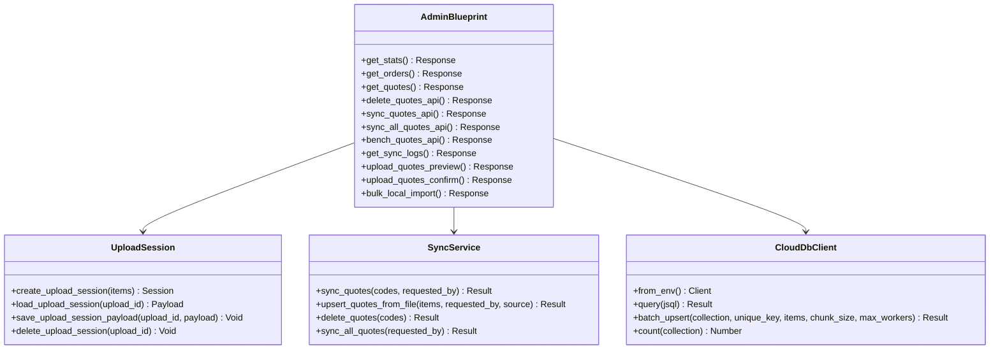

**图表来源**
- [routes/admin.py](file://routes/admin.py#L24-L937)

#### 管理功能特性

1. **数据同步功能**
   - 实时行情同步
   - 批量数据导入
   - 基准测试工具

2. **文件上传处理**
   - Excel文件解析
   - 上传会话管理
   - 异步处理机制

3. **系统监控**
   - 同步历史记录
   - 性能基准测试
   - 任务状态跟踪

**章节来源**
- [routes/admin.py](file://routes/admin.py#L47-L937)

### 股票路由系统

股票数据服务提供了完整的行情查询功能：

```mermaid
graph LR
subgraph "股票API路由"
Realtime[实时数据<br/>/api/v1/stock/realtime/{symbol}]
History[历史数据<br/>/api/v1/stock/history/{symbol}]
Search[股票搜索<br/>/api/v1/stock/search]
Compare[报价比较<br/>/api/v1/stock/quotes/compare]
Lowest[最低报价<br/>/api/v1/stock/quotes/lowest]
List[股票列表<br/>/api/v1/stock/list]
end
subgraph "数据源"
CloudDB[微信云数据库]
Mongo[本地MongoDB]
AkShare[AkShare数据源]
end
subgraph "服务层"
StockService[StockService]
QuoteService[QuoteService]
StockModel[StockModel]
end
Realtime --> StockService
History --> StockService
Search --> StockService
Compare --> QuoteService
Lowest --> QuoteService
List --> StockModel
StockService --> CloudDB
StockService --> Mongo
QuoteService --> CloudDB
QuoteService --> Mongo
StockModel --> Mongo
StockModel --> CloudDB
```

**图表来源**
- [routes/stock.py](file://routes/stock.py#L18-L353)

#### 股票数据服务

1. **实时行情获取**
   - 股票代码验证
   - 多数据源回退
   - 数据持久化

2. **历史数据查询**
   - 周期类型支持
   - 日期范围过滤
   - 数据格式标准化

3. **报价比较功能**
   - 跨交易商报价对比
   - 最低报价识别
   - 实时价格更新

**章节来源**
- [routes/stock.py](file://routes/stock.py#L21-L353)

### 其他功能模块

#### 客户管理模块

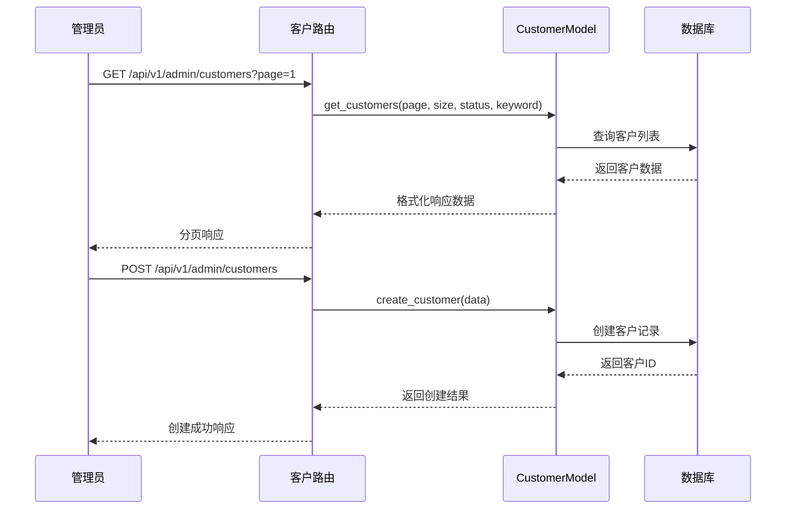

**图表来源**
- [routes/customer.py](file://routes/customer.py#L26-L217)

#### 分组管理模块

分组系统支持用户自定义股票分组和权限控制：

- **分组创建和管理**：支持用户创建自定义分组
- **成员管理**：支持添加和移除股票成员
- **权限控制**：系统保护分组不可修改或删除
- **实时行情**：支持分组内股票实时行情查询

**章节来源**
- [routes/group.py](file://routes/group.py#L42-L269)

## 依赖分析

系统采用模块化设计，各组件间依赖关系清晰：

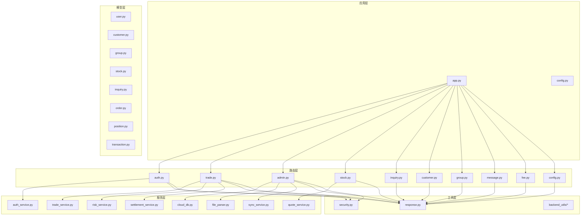

**图表来源**
- [app.py](file://app.py#L105-L114)
- [routes/auth.py](file://routes/auth.py#L12-L17)
- [routes/trade.py](file://routes/trade.py#L9-L16)

**章节来源**
- [app.py](file://app.py#L105-L114)
- [routes/auth.py](file://routes/auth.py#L12-L17)

## 性能考虑

### 路由性能优化

1. **蓝图注册优化**
   - 集中注册减少启动开销
   - URL前缀统一管理
   - 按需加载服务组件

2. **数据库连接优化**
   - 连接池管理
   - 异步查询处理
   - 查询结果缓存

3. **API响应优化**
   - 统一响应格式减少转换开销
   - 分页查询避免大数据传输
   - 错误快速失败机制

### 缓存策略

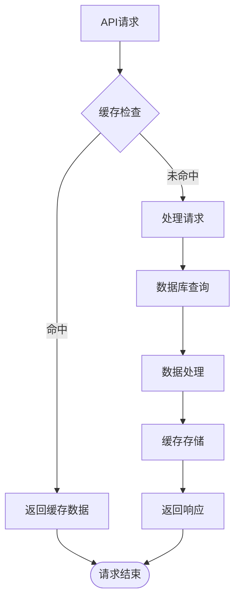

### 监控指标

系统实现了全面的监控和日志记录：

1. **请求监控**
   - 请求响应时间统计
   - 错误率监控
   - 负载均衡指标

2. **业务监控**
   - 交易成功率
   - 用户活跃度
   - 系统可用性

3. **性能监控**
   - 数据库查询性能
   - API响应延迟
   - 资源使用率

## 故障排除指南

### 常见问题诊断

1. **认证失败**
   - 检查JWT令牌有效性
   - 验证用户权限级别
   - 查看审计日志

2. **数据库连接问题**
   - 验证MongoDB连接字符串
   - 检查网络连通性
   - 查看连接池状态

3. **API响应异常**
   - 检查请求参数格式
   - 验证路由注册状态
   - 查看错误处理器日志

### 错误处理机制

系统实现了多层次的错误处理：

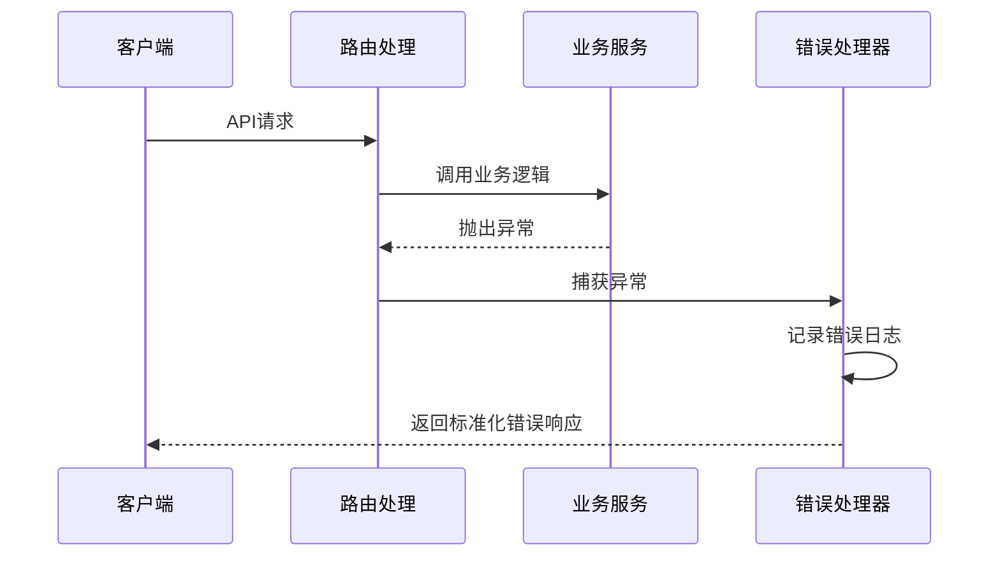

**图表来源**
- [app.py](file://app.py#L252-L275)

**章节来源**
- [app.py](file://app.py#L252-L275)
- [backend_utils/response.py](file://backend_utils/response.py#L80-L94)

## 结论

本路由系统通过Flask蓝图架构实现了高度模块化的API设计，具有以下特点：

1. **清晰的架构层次**：基于功能模块的蓝图设计，职责分离明确
2. **统一的响应标准**：标准化的API响应格式，便于前端处理
3. **完善的认证体系**：多层认证和授权机制，保障系统安全
4. **灵活的扩展性**：模块化设计支持功能快速扩展
5. **全面的监控机制**：完善的日志和审计功能

系统为场外期权交易提供了稳定可靠的技术基础，支持高并发场景下的业务需求。通过持续的性能优化和监控改进，能够满足生产环境的严格要求。