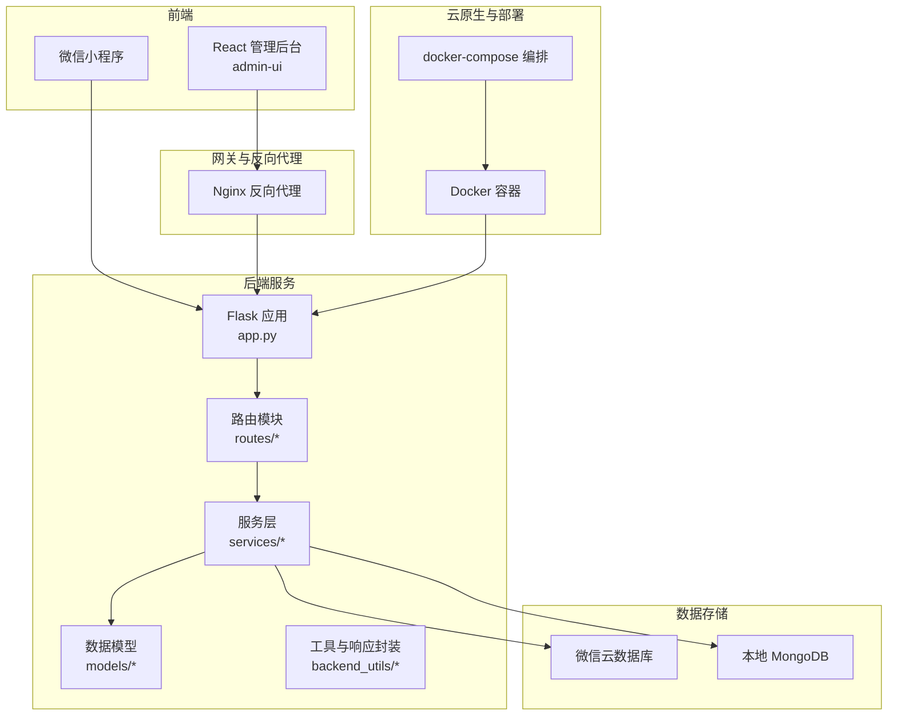
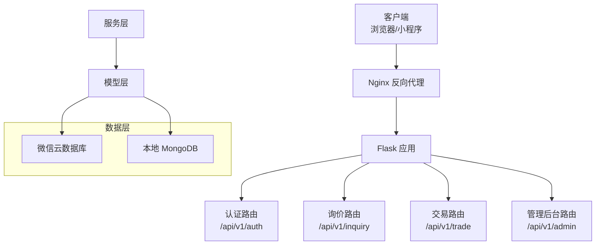
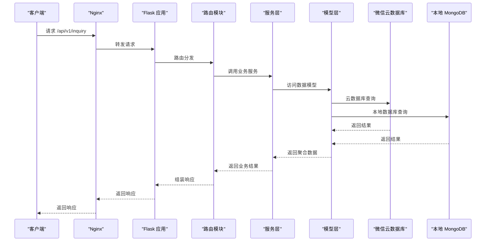
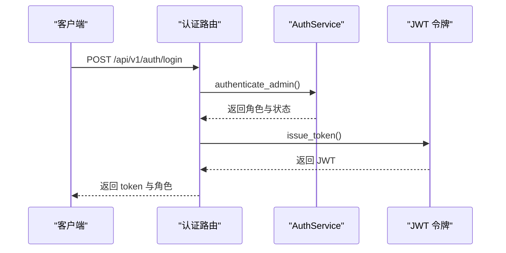
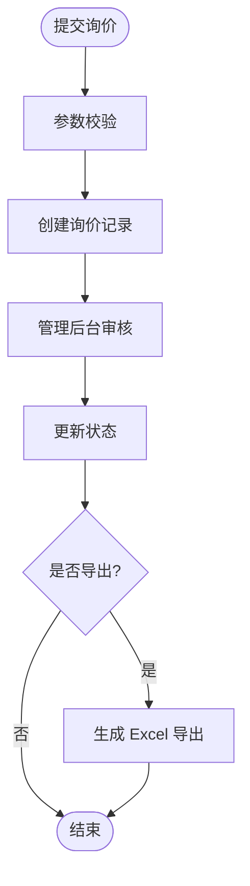
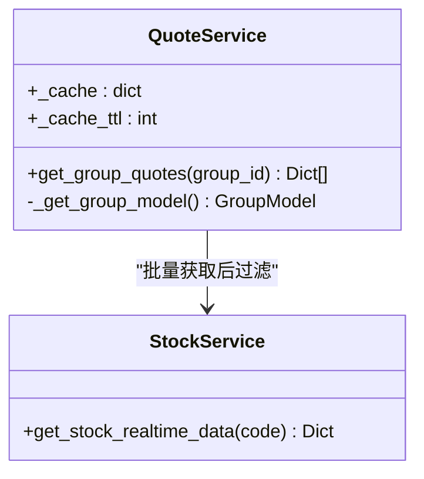
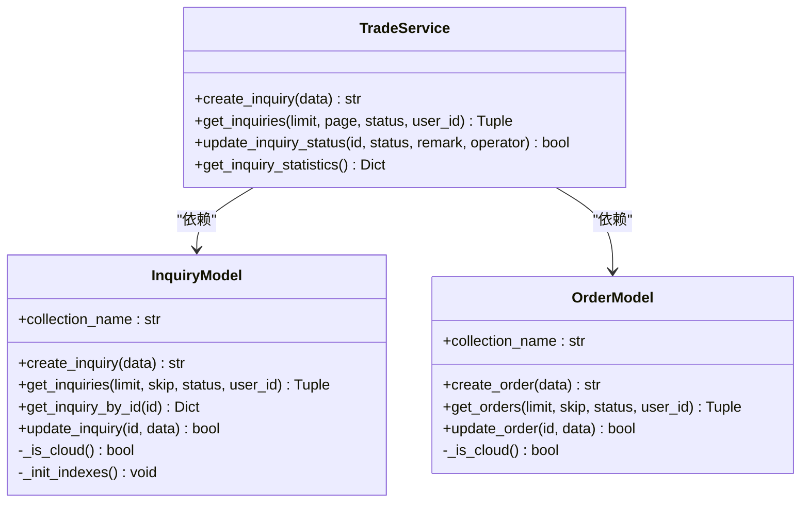
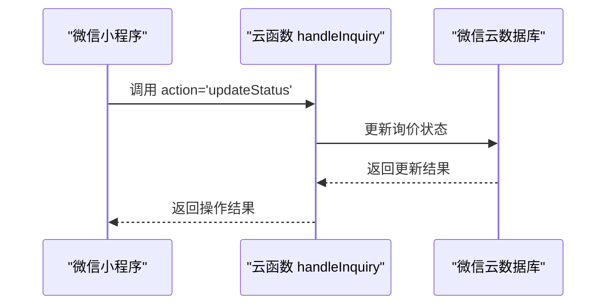
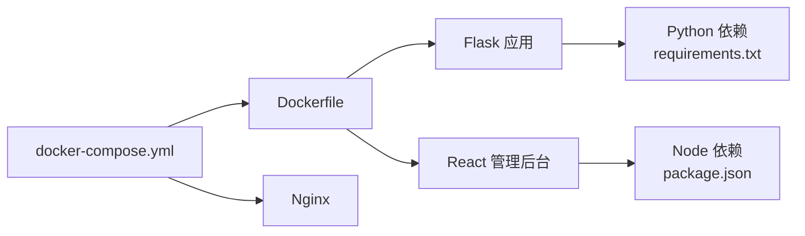

# 系统架构设计

<cite>
**本文档引用的文件**
- [README.md](file://README.md)
- [package.json](file://package.json)
- [Dockerfile](file://Dockerfile)
- [deploy/docker-compose.yml](file://deploy/docker-compose.yml)
- [app.py](file://app.py)
- [config.py](file://config.py)
- [requirements.txt](file://requirements.txt)
- [admin-ui/package.json](file://admin-ui/package.json)
- [routes/inquiry.py](file://routes/inquiry.py)
- [routes/auth.py](file://routes/auth.py)
- [services/quote_service.py](file://services/quote_service.py)
- [services/trade_service.py](file://services/trade_service.py)
- [models/inquiry.py](file://models/inquiry.py)
- [models/order.py](file://models/order.py)
- [cloudfunctions/handleInquiry/index.js](file://cloudfunctions/handleInquiry/index.js)
</cite>

## 目录
1. [简介](#简介)
2. [项目结构](#项目结构)
3. [核心组件](#核心组件)
4. [架构总览](#架构总览)
5. [详细组件分析](#详细组件分析)
6. [依赖关系分析](#依赖关系分析)
7. [性能考量](#性能考量)
8. [故障排除指南](#故障排除指南)
9. [结论](#结论)
10. [附录](#附录)

## 简介
本系统是一个场外期权交易系统，采用前后端分离架构，结合微服务设计思想与云原生部署策略，支持小程序端与管理后台双入口。系统通过 Flask 提供 REST API，React 管理后台作为前端静态资源，配合 Nginx 进行反向代理与静态资源服务；同时集成微信云数据库与本地 MongoDB，实现数据源的灵活切换与混合模式。系统具备询价、订单、持仓、账户资金等核心业务能力，并提供定时行情同步、认证授权、缓存与日志等横切关注点。

## 项目结构
系统采用多模块组织方式：
- 后端核心：Flask 应用，负责 API 路由、业务服务与数据模型封装
- 前端管理：React 管理后台，构建产物由 Flask 提供静态服务
- 云函数：微信云函数，处理特定业务操作（如询价状态更新）
- 部署：Dockerfile 与 docker-compose，实现容器化与编排
- 服务与模型：按领域拆分的服务层与数据模型层，支持云数据库与本地数据库双栈

图表来源
- [app.py](file://app.py#L103-L276)
- [routes/inquiry.py](file://routes/inquiry.py#L1-L175)
- [services/trade_service.py](file://services/trade_service.py#L1-L318)
- [models/inquiry.py](file://models/inquiry.py#L1-L148)
- [models/order.py](file://models/order.py#L1-L119)
- [Dockerfile](file://Dockerfile#L1-L48)
- [deploy/docker-compose.yml](file://deploy/docker-compose.yml#L1-L42)

章节来源
- [README.md](file://README.md#L1-L90)
- [package.json](file://package.json#L1-L50)
- [Dockerfile](file://Dockerfile#L1-L48)
- [deploy/docker-compose.yml](file://deploy/docker-compose.yml#L1-L42)

## 核心组件
- Flask 应用与配置：统一的入口与配置管理，支持开发/生产/测试环境切换，集成 CORS、日志与错误处理
- 路由模块：按业务域划分蓝图，包括认证、询价、交易、管理后台等
- 服务层：封装业务逻辑，协调模型与数据源，提供缓存与批量处理能力
- 数据模型：抽象云数据库与本地数据库的差异，提供统一的数据访问接口
- 前端管理：React 应用，构建产物由 Flask 提供静态服务
- 云函数：微信云函数，处理特定业务操作
- 部署与编排：Dockerfile 与 docker-compose，支持容器化与反向代理

章节来源
- [app.py](file://app.py#L103-L276)
- [config.py](file://config.py#L22-L132)
- [routes/inquiry.py](file://routes/inquiry.py#L1-L175)
- [routes/auth.py](file://routes/auth.py#L1-L353)
- [services/trade_service.py](file://services/trade_service.py#L1-L318)
- [models/inquiry.py](file://models/inquiry.py#L1-L148)
- [models/order.py](file://models/order.py#L1-L119)
- [cloudfunctions/handleInquiry/index.js](file://cloudfunctions/handleInquiry/index.js#L1-L81)

## 架构总览
系统采用“前端静态 + 后端 API + 多数据源”的架构模式：
- 前端：React 管理后台与微信小程序分别消费后端 API
- 网关：Nginx 作为反向代理，提供静态资源服务与 HTTPS 终端
- 后端：Flask 提供 REST API，路由按业务域划分，服务层封装业务规则
- 数据：支持微信云数据库与本地 MongoDB 双栈，通过配置决定数据源模式
- 部署：Docker 容器化，docker-compose 编排，支持生产环境部署

图表来源
- [app.py](file://app.py#L183-L209)
- [routes/auth.py](file://routes/auth.py#L1-L353)
- [routes/inquiry.py](file://routes/inquiry.py#L1-L175)
- [services/trade_service.py](file://services/trade_service.py#L1-L318)
- [models/inquiry.py](file://models/inquiry.py#L1-L148)
- [models/order.py](file://models/order.py#L1-L119)

## 详细组件分析

### Flask 应用与配置
- 应用工厂：集中初始化 CORS、蓝图、静态资源服务与错误处理
- 环境配置：支持 .env.local/.env.production/.env 的优先级加载，支持 WX_CLOUD_ENV 等云数据库配置
- 数据源初始化：支持云数据库与本地数据库，提供动态连接检测与降级策略
- 健康检查与日志：提供 /api/v1/health 接口与统一日志输出
- 定时任务：后台线程定时同步行情，仅在交易时间执行

图表来源
- [app.py](file://app.py#L103-L276)
- [routes/inquiry.py](file://routes/inquiry.py#L11-L34)
- [services/trade_service.py](file://services/trade_service.py#L38-L45)
- [models/inquiry.py](file://models/inquiry.py#L55-L101)

章节来源
- [app.py](file://app.py#L103-L276)
- [config.py](file://config.py#L22-L132)

### 认证与授权
- JWT 认证：提供 /api/v1/auth/login、/api/v1/auth/me 等接口，支持角色校验
- 装饰器：require_auth 与 require_roles 实现统一鉴权
- 登录方式：支持用户名密码、邮箱、手机、微信等多种登录方式
- 审计与限流：内置审计日志与速率限制装饰器

图表来源
- [routes/auth.py](file://routes/auth.py#L74-L96)
- [routes/auth.py](file://routes/auth.py#L33-L54)

章节来源
- [routes/auth.py](file://routes/auth.py#L1-L353)

### 询价与订单管理
- 询价流程：提交询价 → 管理后台审核 → 状态变更 → 批量导出
- 订单管理：创建订单 → 查询订单 → 更新状态
- 服务层封装：TradeService 统一协调模型与数据源，提供统计与导出能力

图表来源
- [routes/inquiry.py](file://routes/inquiry.py#L11-L34)
- [routes/inquiry.py](file://routes/inquiry.py#L36-L95)
- [routes/inquiry.py](file://routes/inquiry.py#L124-L175)

章节来源
- [routes/inquiry.py](file://routes/inquiry.py#L1-L175)
- [services/trade_service.py](file://services/trade_service.py#L38-L94)
- [models/inquiry.py](file://models/inquiry.py#L32-L53)
- [models/order.py](file://models/order.py#L28-L52)

### 行情服务与缓存
- 批量行情获取：QuoteService 对分组成员进行批量实时行情拉取
- 缓存策略：基于内存的简单 TTL 缓存，降低外部数据源调用频率
- 降级策略：批量失败时回退到逐个获取

图表来源
- [services/quote_service.py](file://services/quote_service.py#L9-L109)

章节来源
- [services/quote_service.py](file://services/quote_service.py#L1-L109)

### 数据模型与数据源
- 模型抽象：InquiryModel/OrderModel 统一封装云数据库与本地数据库的 CRUD 操作
- 索引与排序：针对常用查询字段建立索引，支持分页与排序
- 安全性：对 ID 字段进行序列化转换，避免 BSON 类型泄露

图表来源
- [models/inquiry.py](file://models/inquiry.py#L10-L148)
- [models/order.py](file://models/order.py#L10-L119)
- [services/trade_service.py](file://services/trade_service.py#L8-L35)

章节来源
- [models/inquiry.py](file://models/inquiry.py#L1-L148)
- [models/order.py](file://models/order.py#L1-L119)
- [services/trade_service.py](file://services/trade_service.py#L1-L318)

### 云函数与小程序集成
- 云函数：handleInquiry 提供询价状态更新与统计查询
- 小程序：通过微信云托管直接访问云数据库，提升小程序端性能与一致性

图表来源
- [cloudfunctions/handleInquiry/index.js](file://cloudfunctions/handleInquiry/index.js#L12-L27)
- [cloudfunctions/handleInquiry/index.js](file://cloudfunctions/handleInquiry/index.js#L34-L58)

章节来源
- [cloudfunctions/handleInquiry/index.js](file://cloudfunctions/handleInquiry/index.js#L1-L81)

## 依赖关系分析
- 后端依赖：Flask、Flask-CORS、pymongo、akshare、gunicorn 等
- 前端依赖：React、Ant Design、Axios、React Router 等
- 部署依赖：Docker、Nginx、docker-compose
- 云服务：微信云开发 SDK 与云数据库

图表来源
- [requirements.txt](file://requirements.txt#L1-L12)
- [package.json](file://package.json#L27-L48)
- [admin-ui/package.json](file://admin-ui/package.json#L13-L20)
- [Dockerfile](file://Dockerfile#L1-L48)
- [deploy/docker-compose.yml](file://deploy/docker-compose.yml#L1-L42)

章节来源
- [requirements.txt](file://requirements.txt#L1-L12)
- [package.json](file://package.json#L1-L50)
- [admin-ui/package.json](file://admin-ui/package.json#L1-L38)
- [Dockerfile](file://Dockerfile#L1-L48)
- [deploy/docker-compose.yml](file://deploy/docker-compose.yml#L1-L42)

## 性能考量
- 缓存：QuoteService 内存缓存降低外部数据源调用频率
- 批量处理：批量获取行情后过滤，减少多次网络请求
- 定时同步：仅在交易时间执行全量同步，避免非业务时段资源浪费
- 资源隔离：Nginx 作为反向代理，静态资源与 API 分离，提升并发处理能力
- 数据源选择：通过配置切换数据源模式，平衡读写与一致性需求

## 故障排除指南
- 数据库连接失败：检查 MONGO_URI 与 WX_CLOUD_* 环境变量，确认云数据库初始化日志
- CORS 跨域问题：核对 ALLOWED_ORIGINS 与前端请求头，确保允许的来源与方法
- 认证失败：确认 Authorization 头格式与 JWT 有效期，检查 require_auth 装饰器
- 定时任务未执行：检查 ENABLE_AUTO_SYNC 与 AUTO_SYNC_INTERVAL_SECONDS 环境变量
- 静态资源 404：确认 Flask 静态服务与 Nginx 映射路径一致

章节来源
- [app.py](file://app.py#L64-L88)
- [app.py](file://app.py#L170-L181)
- [routes/auth.py](file://routes/auth.py#L33-L54)
- [app.py](file://app.py#L279-L330)
- [deploy/docker-compose.yml](file://deploy/docker-compose.yml#L22-L37)

## 结论
该系统通过前后端分离与微服务化设计，结合云原生部署策略，在保证灵活性的同时提升了可维护性与可扩展性。通过多数据源支持与缓存策略，系统在性能与一致性之间取得平衡；通过统一的认证授权与日志审计，增强了安全性与可观测性。建议后续在生产环境中进一步完善监控告警、灾备与自动化运维体系。

## 附录
- 环境变量与配置：参考 .env.local/.env.production/.env 与 config.py 中的配置项
- API 端点：/api/v1 下的认证、询价、交易、管理后台等路由
- 部署拓扑：Docker 容器 + Nginx 反向代理 + docker-compose 编排