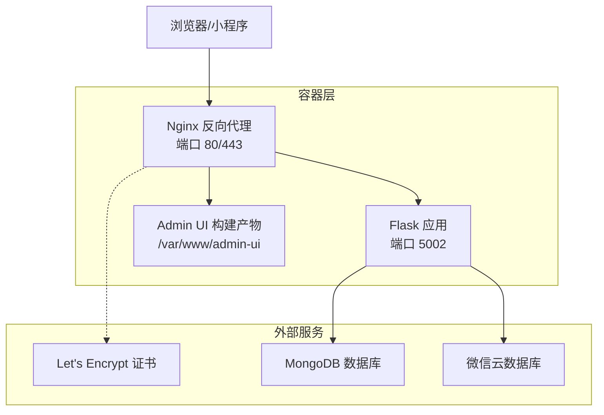
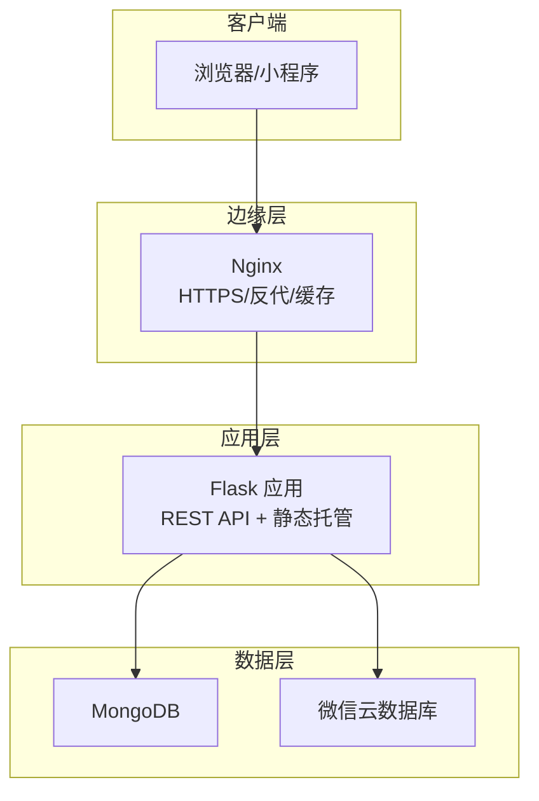
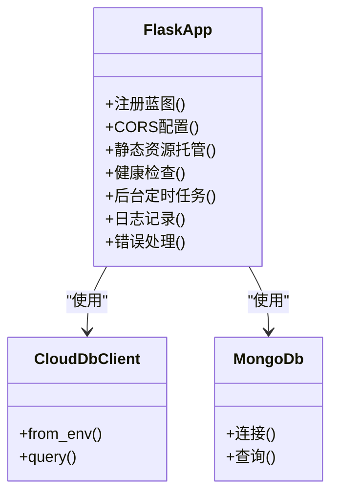
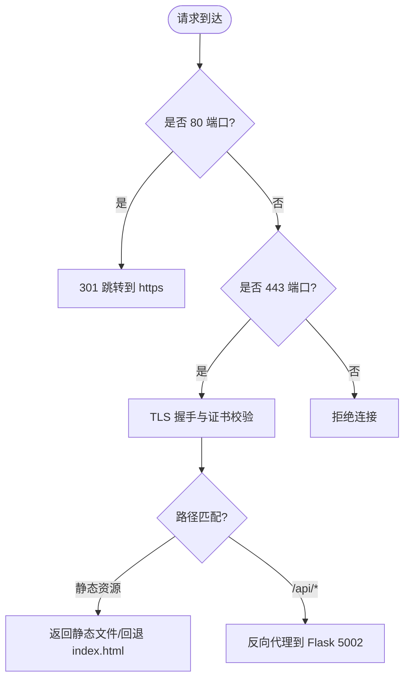
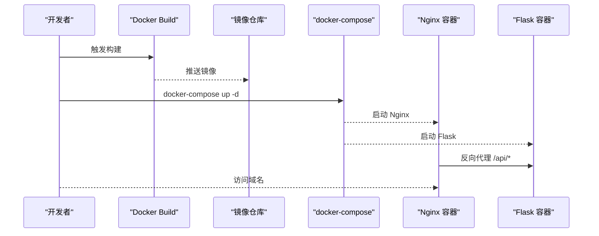
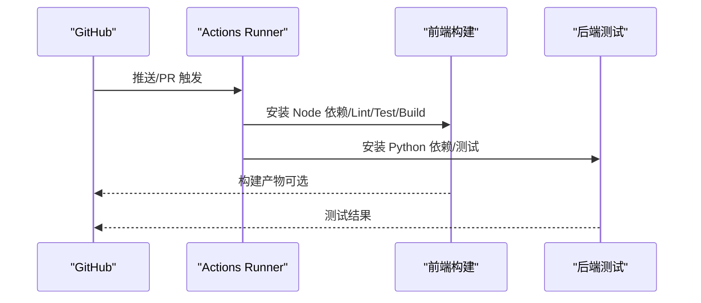
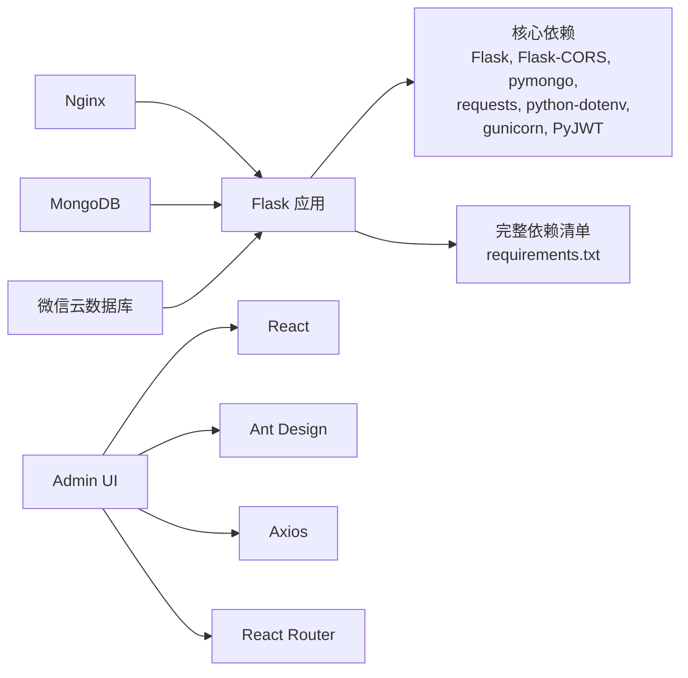

# 部署架构设计

<cite>
**本文档引用的文件**
- [Dockerfile](file://Dockerfile)
- [docker-compose.yml](file://deploy/docker-compose.yml)
- [nginx.conf](file://deploy/nginx.conf)
- [ci.yml](file://.github/workflows/ci.yml)
- [README.md](file://deploy/README.md)
- [部署指南.md](file://deploy/部署指南.md)
- [.env.production](file://.env.production)
- [.env.example](file://.env.example)
- [app.py](file://app.py)
- [config.py](file://config.py)
- [requirements.txt](file://requirements.txt)
- [package.json](file://package.json)
- [admin-ui/package.json](file://admin-ui/package.json)
- [captcha_service.py](file://services/captcha_service.py)
</cite>

## 更新摘要
**变更内容**
- 更新了Dockerfile依赖管理策略说明，反映了简化后的依赖安装策略
- 补充了requirements.txt完整依赖清单的说明
- 更新了CI/CD流水线中Python依赖安装的描述
- 增强了容器构建过程的依赖管理说明

## 目录
1. [简介](#简介)
2. [项目结构](#项目结构)
3. [核心组件](#核心组件)
4. [架构总览](#架构总览)
5. [详细组件分析](#详细组件分析)
6. [依赖关系分析](#依赖关系分析)
7. [性能考虑](#性能考虑)
8. [故障排除指南](#故障排除指南)
9. [结论](#结论)
10. [附录](#附录)

## 简介
本部署架构设计文档面向"场外期权"项目，系统采用前后端分离架构：前端为 React 管理后台（admin-ui），后端为 Python Flask API，并通过 Nginx 提供反向代理与 HTTPS 终止。系统支持容器化部署（Docker + docker-compose）与传统 Linux 服务部署两种方式；CI/CD 通过 GitHub Actions 实现前端与后端的自动化构建与测试；反向代理负责 API 路由、静态资源分发、SSL 证书与超时配置；监控与日志通过 systemd/journald 与应用日志文件实现；高可用与灾难恢复通过多实例与外部数据库（MongoDB/微信云数据库）实现。

## 项目结构
项目采用多模块组织方式，主要包含：
- 后端 API：Flask 应用，提供 REST 接口与静态资源托管
- 前端管理后台：React/Vite 构建产物，由后端统一托管
- 反向代理：Nginx 配置，负责 HTTPS、静态资源与 API 反代
- 容器化：Dockerfile 多阶段构建，docker-compose 编排
- CI/CD：GitHub Actions 工作流，分别构建前端与后端
- 部署指南：Docker Compose 与传统部署两套方案

**图表来源**
- [docker-compose.yml](file://deploy/docker-compose.yml#L1-L42)
- [nginx.conf](file://deploy/nginx.conf#L1-L61)
- [Dockerfile](file://Dockerfile#L1-L38)

**章节来源**
- [docker-compose.yml](file://deploy/docker-compose.yml#L1-L42)
- [nginx.conf](file://deploy/nginx.conf#L1-L61)
- [Dockerfile](file://Dockerfile#L1-L38)

## 核心组件
- Flask API 服务
  - 负责 REST 接口、静态资源托管、CORS、日志与后台定时任务
  - 支持微信云数据库与本地 MongoDB 双数据源模式
- Nginx 反向代理
  - 提供 HTTPS 终止、静态资源缓存、API 反向代理与超时配置
- Docker 容器化
  - 多阶段构建：前端构建 + Python 后端镜像
  - docker-compose 编排：Flask + Nginx + 网络
- CI/CD 流水线
  - GitHub Actions：前端 Lint/Test/Build，后端依赖安装与单元测试
- 部署与运维
  - Docker Compose 一键部署与传统 systemd+Nginx 方案
  - 环境变量驱动配置，支持生产密钥与域名配置

**章节来源**
- [app.py](file://app.py#L1-L358)
- [config.py](file://config.py#L1-L132)
- [requirements.txt](file://requirements.txt#L1-L12)
- [.env.production](file://.env.production#L1-L53)
- [.env.example](file://.env.example#L1-L50)

## 架构总览
系统采用"反向代理 + 应用容器"的经典三层架构：
- 反向代理层：Nginx，负责 HTTPS、静态资源、API 反代与超时控制
- 应用层：Flask，提供 REST API 与静态资源托管，支持双数据源
- 数据层：MongoDB（本地）与微信云数据库（小程序端）

**图表来源**
- [nginx.conf](file://deploy/nginx.conf#L1-L61)
- [app.py](file://app.py#L1-L358)

## 详细组件分析

### Flask API 服务
- 服务职责
  - 注册蓝图：认证、询价、股票、管理后台等路由
  - CORS 配置：支持跨域与凭证传递
  - 静态资源托管：管理后台构建产物回退到 index.html
  - 健康检查：/api/v1/health
  - 后台定时任务：自动同步行情（交易时间窗口内）
- 数据源
  - 本地 MongoDB：管理后台与复杂查询
  - 微信云数据库：小程序端数据源，支持从环境变量注入
- 日志与错误处理
  - 控制台与文件日志输出，生产环境使用轮转日志
  - 统一错误响应封装

**图表来源**
- [app.py](file://app.py#L103-L276)
- [config.py](file://config.py#L40-L46)

**章节来源**
- [app.py](file://app.py#L103-L276)
- [config.py](file://config.py#L22-L63)

### Nginx 反向代理
- 监听与重定向
  - 80 端口强制跳转 443
  - 443 端口启用 TLS，配置证书与协议
- 日志
  - 访问日志与错误日志分离
- 静态资源
  - 管理后台构建产物根目录与 React Router 支持
  - 静态资源缓存（assets 目录）
- API 反代
  - /api/ 前缀转发至 Flask（127.0.0.1:5002）
  - 透传头部（Host/X-Real-IP/X-Forwarded-*）
  - 增加重试与超时配置

**图表来源**
- [nginx.conf](file://deploy/nginx.conf#L2-L60)

**章节来源**
- [nginx.conf](file://deploy/nginx.conf#L1-L61)

### Docker 容器化与编排
- 多阶段构建策略
  - **简化依赖管理**：Dockerfile 中虽然引用了 requirements.txt，但只安装核心依赖（Flask、Flask-Cors、pymongo、requests、python-dotenv、gunicorn、PyJWT）
  - **核心依赖安装**：使用 pip install --no-cache-dir 直接安装必需的 Python 包
  - **系统依赖**：安装 build-essential 和相关开发库以支持某些 Python 包的编译
- 运行方式
  - gunicorn 启动 Flask 应用（0.0.0.0:80）
  - docker-compose 编排：Flask + Nginx，共享网络
- 卷挂载
  - 日志目录映射
  - SSL 证书目录映射
  - 管理后台构建产物映射

**更新** Dockerfile 现采用简化的依赖管理策略，只安装运行时必需的核心依赖，而非完整安装 requirements.txt 中的所有包

**图表来源**
- [Dockerfile](file://Dockerfile#L1-L38)
- [docker-compose.yml](file://deploy/docker-compose.yml#L1-L42)

**章节来源**
- [Dockerfile](file://Dockerfile#L1-L38)
- [docker-compose.yml](file://deploy/docker-compose.yml#L1-L42)

### CI/CD 流水线
- 前端构建
  - Node.js 环境，安装依赖，Lint/Test/Build
- 后端测试
  - Python 环境，**简化依赖安装**：使用 python -m pip install -r requirements.txt 安装完整依赖集
  - 跳过数据库初始化，执行单元测试
- 工作流触发
  - push 与 pull_request

**更新** CI/CD 流水线中 Python 依赖安装保持完整依赖安装策略，与生产环境的简化策略形成对比

**图表来源**
- [.github/workflows/ci.yml](file://.github/workflows/ci.yml#L1-L35)

**章节来源**
- [.github/workflows/ci.yml](file://.github/workflows/ci.yml#L1-L35)

### 部署与运维
- Docker Compose 部署
  - 一键启动：docker-compose up -d
  - 环境变量：NODE_ENV、FLASK_PORT、TZ 等
  - 卷挂载：日志、证书、静态资源
- 传统部署（Systemd+Nginx）
  - 安装 Python、MongoDB、Nginx、Git
  - Systemd 服务：option-api，开机自启
  - Nginx 配置：HTTPS、反代、日志
- 环境变量与密钥
  - .env.production：生产密钥、数据库、微信云配置、管理员账号
  - .env.example：示例配置，强调安全密钥不可硬编码

**章节来源**
- [README.md](file://deploy/README.md#L1-L44)
- [部署指南.md](file://deploy/部署指南.md#L1-L367)
- [.env.production](file://.env.production#L1-L53)
- [.env.example](file://.env.example#L1-L50)

## 依赖关系分析
- 运行时依赖
  - **核心依赖**：Flask、Flask-CORS、pymongo、requests、python-dotenv、gunicorn、PyJWT
  - **完整依赖清单**：requirements.txt 中包含 Flask>=2.0.1、Flask-Cors>=3.0.10、pymongo>=3.12.0、pandas>=1.3.3、openpyxl>=3.0.9、akshare>=1.10.1、requests>=2.26.0、python-dotenv>=0.19.0、gunicorn>=20.1.0、lxml>=4.9.0、PyJWT>=2.8.0
  - 前端依赖：React、Ant Design、Axios、React Router 等
- 构建时依赖
  - Node.js（前端构建）、Python（后端依赖）
- 外部服务
  - MongoDB（本地）
  - 微信云数据库（小程序端数据源）
  - Let's Encrypt（证书）

**更新** 依赖管理策略分为两个层面：生产环境采用简化的核心依赖安装，而 CI/CD 流水线保持完整的依赖安装以确保测试完整性

**图表来源**
- [requirements.txt](file://requirements.txt#L1-L12)
- [package.json](file://package.json#L1-L50)
- [admin-ui/package.json](file://admin-ui/package.json#L1-L38)

**章节来源**
- [requirements.txt](file://requirements.txt#L1-L12)
- [package.json](file://package.json#L1-L50)
- [admin-ui/package.json](file://admin-ui/package.json#L1-L38)

## 性能考虑
- 反向代理超时与缓冲
  - API 反代设置较长读取/连接超时，适配长查询场景
  - 静态资源缓存一年，减少带宽与延迟
- 应用并发
  - gunicorn 多进程多线程启动，提升并发处理能力
- 数据访问
  - MongoDB 连接超时与降级策略，避免启动阻塞
  - 定时同步仅在交易时间窗口内执行，降低非必要负载
- 前端构建
  - Vite 构建产物最小化与缓存，提升首屏加载速度
- **依赖管理优化**
  - **生产环境**：简化依赖安装，减少镜像大小和启动时间
  - **CI/CD 环境**：完整依赖安装，确保测试覆盖所有功能

**章节来源**
- [nginx.conf](file://deploy/nginx.conf#L50-L53)
- [Dockerfile](file://Dockerfile#L44-L47)
- [app.py](file://app.py#L78-L88)
- [app.py](file://app.py#L297-L326)

## 故障排除指南
- API 跨域问题
  - 检查 Nginx 是否添加 CORS 头（开发指南中有示例）
- MongoDB 连接失败
  - 检查服务状态、日志与防火墙；必要时重启服务
- SSL 证书获取失败
  - 检查域名解析、80 端口开放与证书颁发机构可达性
- 服务状态与日志
  - systemd+journald 实时查看应用日志
  - 应用日志文件位置与轮转配置
- **依赖相关问题**
  - **生产环境**：确认核心依赖是否正确安装，检查 Dockerfile 中的 pip install 命令
  - **CI/CD 环境**：使用完整依赖清单进行测试，确保所有功能正常
  - **验证码服务**：如遇到验证码生成问题，检查 captcha 库的安装状态

**章节来源**
- [部署指南.md](file://deploy/部署指南.md#L316-L353)
- [部署指南.md](file://deploy/部署指南.md#L284-L313)
- [captcha_service.py](file://services/captcha_service.py#L29-L35)

## 结论
本部署架构以 Nginx 作为统一入口，结合 Flask 的多数据源能力与 React 管理后台，形成稳定高效的生产环境方案。容器化与 CI/CD 提升了交付效率与一致性；反代配置强化了安全性与性能；日志与监控体系保障了可观测性。生产环境采用简化的依赖管理策略，在保证功能完整性的同时优化了镜像大小和启动性能。建议在生产环境中严格管理密钥与域名配置，定期评估数据库与证书策略，并根据业务增长规划横向扩展与灾备方案。

## 附录
- 部署验证清单
  - 健康检查接口可用
  - 报价接口可访问
  - 管理员登录成功
  - 小程序真机测试通过
- 版本与环境
  - Node.js 与 Python 版本要求
  - Docker 与 docker-compose 版本建议
- **依赖管理策略对比**
  - **生产环境**：核心依赖安装（Dockerfile）
  - **CI/CD 环境**：完整依赖安装（requirements.txt）
  - **验证码服务**：可选依赖（captcha 库）

**章节来源**
- [部署指南.md](file://deploy/部署指南.md#L250-L281)
- [package.json](file://package.json#L23-L26)
- [requirements.txt](file://requirements.txt#L1-L12)
- [Dockerfile](file://Dockerfile#L24-L25)
- [captcha_service.py](file://services/captcha_service.py#L29-L35)