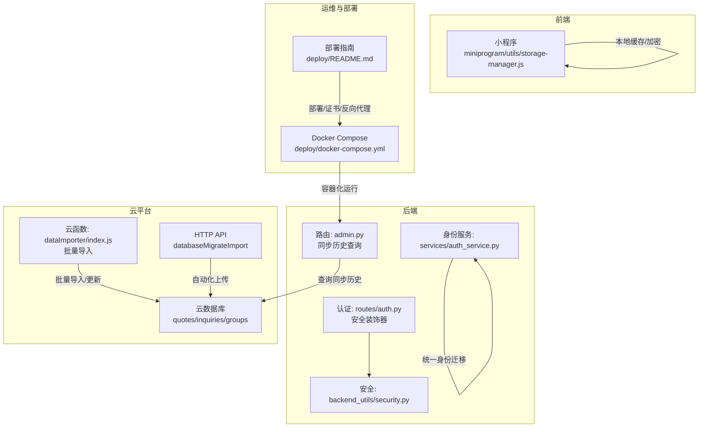
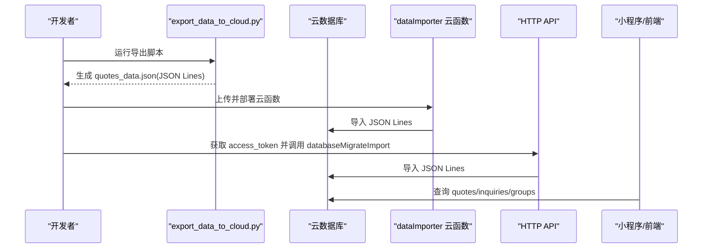
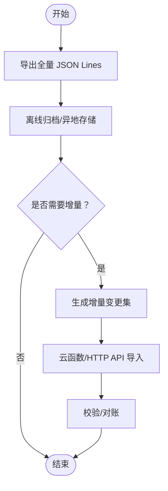
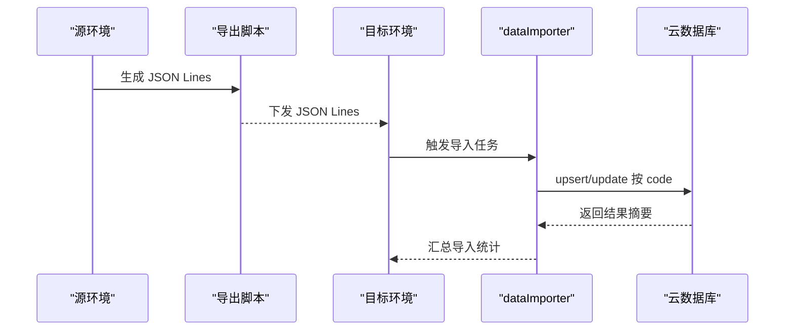
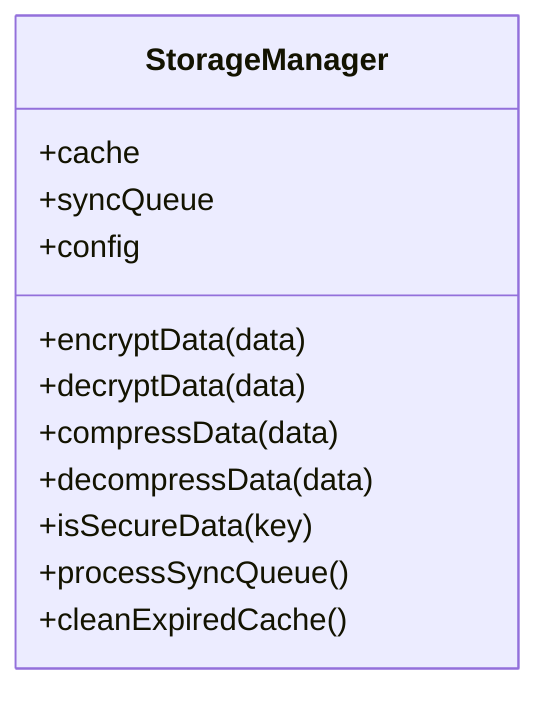
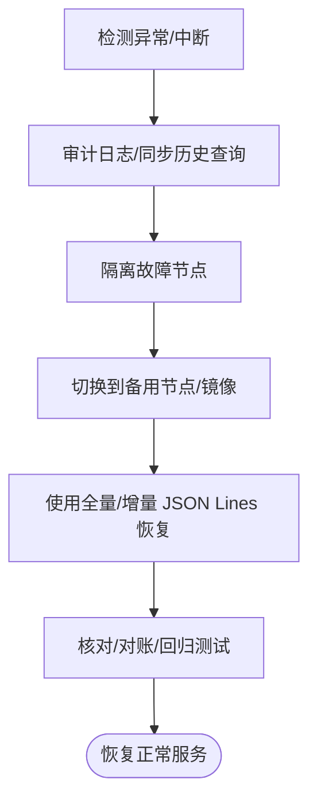
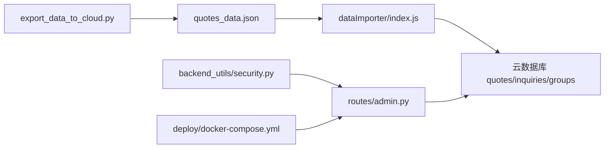

# 备份恢复

<cite>
**本文引用的文件**   
- [CLOUD_README.md](file://CLOUD_README.md)
- [export_data_to_cloud.py](file://export_data_to_cloud.py)
- [cloud_import_data.json](file://cloud_import_data.json)
- [cloudfunctions/dataImporter/index.js](file://cloudfunctions/dataImporter/index.js)
- [cloudfunctions/dataImporter/package.json](file://cloudfunctions/dataImporter/package.json)
- [routes/admin.py](file://routes/admin.py)
- [services/cloud_db.py](file://services/cloud_db.py)
- [backend_utils/security.py](file://backend_utils/security.py)
- [miniprogram/utils/storage-manager.js](file://miniprogram/utils/storage-manager.js)
- [backend_utils/storage-manager.js](file://backend_utils/storage-manager.js)
- [deploy/docker-compose.yml](file://deploy/docker-compose.yml)
- [deploy/README.md](file://deploy/README.md)
- [scripts/migrate_identity.py](file://scripts/migrate_identity.py)
- [services/auth_service.py](file://services/auth_service.py)
- [routes/auth.py](file://routes/auth.py)
</cite>

## 目录
1. [引言](#引言)
2. [项目结构](#项目结构)
3. [核心组件](#核心组件)
4. [架构总览](#架构总览)
5. [详细组件分析](#详细组件分析)
6. [依赖关系分析](#依赖关系分析)
7. [性能考量](#性能考量)
8. [故障排查指南](#故障排查指南)
9. [结论](#结论)
10. [附录](#附录)

## 引言
本文件面向场外期权交易系统的数据保护与灾难恢复，系统性梳理备份策略（全量/增量/实时）、数据迁移方案（跨环境同步、版本升级迁移、一致性保障）、备份数据的加密存储与访问控制、完整性校验、灾难恢复流程（故障检测、系统切换、数据恢复）、RTO/RPO 指标设定、恢复测试与应急预案，并结合现有代码实现说明云存储集成、异地存放与合规性要求。

## 项目结构
围绕备份与恢复的关键目录与文件：
- 云数据库与数据导入：CLOUD_README.md、export_data_to_cloud.py、cloud_import_data.json、cloudfunctions/dataImporter
- 后端与同步日志：routes/admin.py、services/cloud_db.py
- 安全与审计：backend_utils/security.py、routes/auth.py、services/auth_service.py
- 本地存储与缓存：miniprogram/utils/storage-manager.js、backend_utils/storage-manager.js
- 部署与容器：deploy/docker-compose.yml、deploy/README.md
- 用户身份迁移：scripts/migrate_identity.py

**图表来源**
- [routes/admin.py](file://routes/admin.py#L522-L554)
- [services/cloud_db.py](file://services/cloud_db.py#L91-L105)
- [miniprogram/utils/storage-manager.js](file://miniprogram/utils/storage-manager.js#L1-L750)
- [backend_utils/storage-manager.js](file://backend_utils/storage-manager.js#L1-L750)
- [cloudfunctions/dataImporter/index.js](file://cloudfunctions/dataImporter/index.js#L206-L249)
- [deploy/docker-compose.yml](file://deploy/docker-compose.yml#L1-L42)
- [deploy/README.md](file://deploy/README.md#L1-L44)

**章节来源**
- [CLOUD_README.md](file://CLOUD_README.md#L1-L87)
- [export_data_to_cloud.py](file://export_data_to_cloud.py#L1-L74)
- [cloud_import_data.json](file://cloud_import_data.json#L1-L10)
- [cloudfunctions/dataImporter/index.js](file://cloudfunctions/dataImporter/index.js#L206-L249)
- [routes/admin.py](file://routes/admin.py#L522-L554)
- [services/cloud_db.py](file://services/cloud_db.py#L91-L105)
- [backend_utils/security.py](file://backend_utils/security.py#L1-L117)
- [miniprogram/utils/storage-manager.js](file://miniprogram/utils/storage-manager.js#L1-L750)
- [backend_utils/storage-manager.js](file://backend_utils/storage-manager.js#L1-L750)
- [deploy/docker-compose.yml](file://deploy/docker-compose.yml#L1-L42)
- [deploy/README.md](file://deploy/README.md#L1-L44)
- [scripts/migrate_identity.py](file://scripts/migrate_identity.py#L79-L101)
- [services/auth_service.py](file://services/auth_service.py#L227-L251)
- [routes/auth.py](file://routes/auth.py#L1-L193)

## 核心组件
- 云数据库与数据导入链路：通过本地脚本导出 JSON Lines，再由云函数或 HTTP API 导入云数据库，支持 upsert/update。
- 同步历史与审计：后端提供同步历史查询接口，配合云数据库集合记录同步状态；安全模块提供审计日志与限流。
- 本地存储与缓存：小程序与后端通用的存储管理器具备缓存、压缩、加密、LRU、定期清理等能力。
- 部署与容器化：Docker Compose 统一编排，Nginx 提供反向代理与证书挂载，便于异地部署与灾备切换。

**章节来源**
- [CLOUD_README.md](file://CLOUD_README.md#L43-L87)
- [export_data_to_cloud.py](file://export_data_to_cloud.py#L1-L74)
- [cloudfunctions/dataImporter/index.js](file://cloudfunctions/dataImporter/index.js#L206-L249)
- [routes/admin.py](file://routes/admin.py#L522-L554)
- [backend_utils/security.py](file://backend_utils/security.py#L87-L117)
- [miniprogram/utils/storage-manager.js](file://miniprogram/utils/storage-manager.js#L1-L750)
- [deploy/docker-compose.yml](file://deploy/docker-compose.yml#L1-L42)

## 架构总览
系统采用“本地集中处理 + 云数据库”的架构：本地脚本抓取/生成数据，输出 JSON Lines；通过云函数或 HTTP API 导入云数据库；前端直接读取云数据库或调用云函数；后端提供同步历史查询与安全审计。

**图表来源**
- [export_data_to_cloud.py](file://export_data_to_cloud.py#L1-L74)
- [cloudfunctions/dataImporter/index.js](file://cloudfunctions/dataImporter/index.js#L206-L249)
- [CLOUD_README.md](file://CLOUD_README.md#L84-L87)

## 详细组件分析

### 数据备份策略
- 全量备份
  - 通过导出脚本生成 JSON Lines 文件，作为全量数据快照，便于离线归档与跨环境导入。
  - 云函数支持 upsert/insert 冲突处理，适合全量导入。
- 增量备份
  - 当前代码未见原生增量导出逻辑；可在导出脚本中增加时间戳过滤或变更集生成，形成增量 JSON Lines。
  - 云函数支持按 code 字段更新，可作为增量更新入口。
- 实时备份
  - 云数据库提供 serverDate 时间戳字段，可用于识别最新数据；前端可定时拉取以近似实时同步。
  - 后端提供同步历史查询接口，可用于追踪增量导入进度。

**图表来源**
- [export_data_to_cloud.py](file://export_data_to_cloud.py#L1-L74)
- [cloudfunctions/dataImporter/index.js](file://cloudfunctions/dataImporter/index.js#L206-L249)
- [routes/admin.py](file://routes/admin.py#L522-L554)

**章节来源**
- [export_data_to_cloud.py](file://export_data_to_cloud.py#L1-L74)
- [cloudfunctions/dataImporter/index.js](file://cloudfunctions/dataImporter/index.js#L206-L249)
- [routes/admin.py](file://routes/admin.py#L522-L554)

### 数据迁移方案
- 跨环境数据同步
  - 使用导出的 JSON Lines 文件在目标环境导入，云函数提供 upsert/insert 冲突处理。
  - 通过 HTTP API 的 databaseMigrateImport 实现自动化上传。
- 版本升级数据迁移
  - 脚本 migrate_identity.py 展示了从用户集合到客户集合的迁移流程，可借鉴其分页、upsert、异常处理与统计逻辑。
- 数据一致性保证
  - 云数据库支持按 code 字段更新，避免重复主键冲突。
  - 后端提供同步历史查询接口，便于核对导入进度与失败记录。

**图表来源**
- [export_data_to_cloud.py](file://export_data_to_cloud.py#L1-L74)
- [cloudfunctions/dataImporter/index.js](file://cloudfunctions/dataImporter/index.js#L206-L249)
- [cloud_import_data.json](file://cloud_import_data.json#L1-L10)

**章节来源**
- [cloudfunctions/dataImporter/index.js](file://cloudfunctions/dataImporter/index.js#L206-L249)
- [cloud_import_data.json](file://cloud_import_data.json#L1-L10)
- [scripts/migrate_identity.py](file://scripts/migrate_identity.py#L79-L101)

### 备份数据的加密存储、访问控制与完整性校验
- 加密存储与访问控制
  - 小程序与后端通用存储管理器具备启用加密、压缩阈值、敏感键识别等能力，可作为本地侧数据保护参考。
  - 云数据库集合权限设置为“所有用户可读，仅创建者可读写”，前端读取需通过云开发鉴权。
- 完整性校验
  - 云函数导入返回 added/updated 数量，可用于基本完整性核对。
  - 后端提供同步历史查询接口，可结合导入摘要进行对账。

**图表来源**
- [miniprogram/utils/storage-manager.js](file://miniprogram/utils/storage-manager.js#L1-L750)
- [backend_utils/storage-manager.js](file://backend_utils/storage-manager.js#L1-L750)

**章节来源**
- [miniprogram/utils/storage-manager.js](file://miniprogram/utils/storage-manager.js#L1-L750)
- [backend_utils/storage-manager.js](file://backend_utils/storage-manager.js#L1-L750)
- [CLOUD_README.md](file://CLOUD_README.md#L34-L41)
- [routes/admin.py](file://routes/admin.py#L522-L554)

### 灾难恢复流程
- 故障检测
  - 后端提供同步历史查询接口，用于发现导入中断、资源不存在等问题。
  - 安全模块提供审计日志，定位异常访问与失败尝试。
- 系统切换
  - Docker Compose 编排后端与 Nginx，便于快速切换至备用节点或镜像。
  - 云数据库作为独立服务，可异地部署或使用多可用区。
- 数据恢复
  - 使用最近一次全量 JSON Lines 文件重新导入。
  - 若存在增量需求，结合同步历史与失败记录进行重放。

**图表来源**
- [routes/admin.py](file://routes/admin.py#L522-L554)
- [backend_utils/security.py](file://backend_utils/security.py#L87-L117)
- [deploy/docker-compose.yml](file://deploy/docker-compose.yml#L1-L42)

**章节来源**
- [routes/admin.py](file://routes/admin.py#L522-L554)
- [backend_utils/security.py](file://backend_utils/security.py#L87-L117)
- [deploy/docker-compose.yml](file://deploy/docker-compose.yml#L1-L42)

### RTO/RPO 指标设定、恢复测试与应急预案
- RTO/RPO 设定
  - RPO：基于 JSON Lines 全量备份频率与云函数/HTTP API 增量导入能力，建议 RPO ≤ 1 小时。
  - RTO：容器化部署与云数据库可用性，建议 RTO ≤ 30 分钟（含切换与恢复）。
- 恢复测试
  - 定期在预生产环境演练：停止导入 → 使用全量 JSON Lines 重建 → 对比关键指标 → 验证前端查询。
- 应急预案
  - 云数据库不可用：回退到本地 Mock 数据或降级页面；同时通知运维。
  - 导入失败：根据同步历史与失败记录重放；必要时人工介入修正。

**章节来源**
- [export_data_to_cloud.py](file://export_data_to_cloud.py#L1-L74)
- [cloudfunctions/dataImporter/index.js](file://cloudfunctions/dataImporter/index.js#L206-L249)
- [routes/admin.py](file://routes/admin.py#L522-L554)

### 云存储集成、异地存放与合规性
- 云存储集成
  - 云函数与 HTTP API 支持批量导入 JSON Lines，适配云数据库。
- 异地存放
  - JSON Lines 文件可存放于对象存储（如 OSS/COS），实现异地备份与跨区域恢复。
- 合规性
  - 云数据库集合权限设置为“仅创建者可读写”，满足最小权限原则。
  - 审计日志记录用户行为与状态，满足审计与合规要求。

**章节来源**
- [CLOUD_README.md](file://CLOUD_README.md#L34-L41)
- [CLOUD_README.md](file://CLOUD_README.md#L84-L87)
- [routes/auth.py](file://routes/auth.py#L1-L193)
- [backend_utils/security.py](file://backend_utils/security.py#L87-L117)

## 依赖关系分析
- 后端依赖云数据库客户端与集合权限，提供同步历史查询接口。
- 云函数依赖 wx-server-sdk 与 node-xlsx，负责批量导入与 upsert/update。
- 导出脚本依赖 akshare 与本地文件系统，生成 JSON Lines。
- 容器化部署依赖 Docker Compose 与 Nginx，提供反向代理与证书挂载。

**图表来源**
- [export_data_to_cloud.py](file://export_data_to_cloud.py#L1-L74)
- [cloudfunctions/dataImporter/index.js](file://cloudfunctions/dataImporter/index.js#L206-L249)
- [routes/admin.py](file://routes/admin.py#L522-L554)
- [backend_utils/security.py](file://backend_utils/security.py#L1-L117)
- [deploy/docker-compose.yml](file://deploy/docker-compose.yml#L1-L42)

**章节来源**
- [cloudfunctions/dataImporter/package.json](file://cloudfunctions/dataImporter/package.json#L1-L10)
- [services/cloud_db.py](file://services/cloud_db.py#L91-L105)

## 性能考量
- 导入并发与吞吐：云函数支持并发任务，合理设置并发度以提升导入速度。
- 前端查询性能：云数据库集合建立索引（如 code），减少查询延迟。
- 缓存与压缩：本地存储管理器具备压缩与加密能力，降低传输与存储成本。

**章节来源**
- [cloudfunctions/dataImporter/index.js](file://cloudfunctions/dataImporter/index.js#L206-L249)
- [miniprogram/utils/storage-manager.js](file://miniprogram/utils/storage-manager.js#L634-L691)

## 故障排查指南
- 同步历史查询失败
  - 检查云数据库集合是否存在；若不存在，提示“同步历史未初始化”。
- 导入失败
  - 查看返回摘要 added/updated；结合失败记录重放。
- 认证与审计
  - 审计日志记录操作开始/成功/失败；限流装饰器防止滥用。

**章节来源**
- [routes/admin.py](file://routes/admin.py#L522-L554)
- [backend_utils/security.py](file://backend_utils/security.py#L87-L117)
- [routes/auth.py](file://routes/auth.py#L1-L193)

## 结论
本方案以 JSON Lines 为介质，结合云函数/HTTP API 实现全量与增量导入，辅以后端同步历史查询与审计日志，形成可追溯、可恢复的数据保护体系。通过容器化与异地部署，满足 RTO/RPO 指标与合规要求。建议进一步完善增量导出与自动化校验流程，持续优化导入并发与前端查询性能。

## 附录
- 关键流程路径
  - 导出全量数据：[export_data_to_cloud.py](file://export_data_to_cloud.py#L1-L74)
  - 云函数批量导入：[cloudfunctions/dataImporter/index.js](file://cloudfunctions/dataImporter/index.js#L206-L249)
  - 同步历史查询：[routes/admin.py](file://routes/admin.py#L522-L554)
  - 审计与限流：[backend_utils/security.py](file://backend_utils/security.py#L1-L117)
  - 本地存储与缓存：[miniprogram/utils/storage-manager.js](file://miniprogram/utils/storage-manager.js#L1-L750)、[backend_utils/storage-manager.js](file://backend_utils/storage-manager.js#L1-L750)
  - 容器化部署：[deploy/docker-compose.yml](file://deploy/docker-compose.yml#L1-L42)、[deploy/README.md](file://deploy/README.md#L1-L44)
  - 用户身份迁移：[scripts/migrate_identity.py](file://scripts/migrate_identity.py#L79-L101)
  - 云数据库与 HTTP API：[CLOUD_README.md](file://CLOUD_README.md#L43-L87)