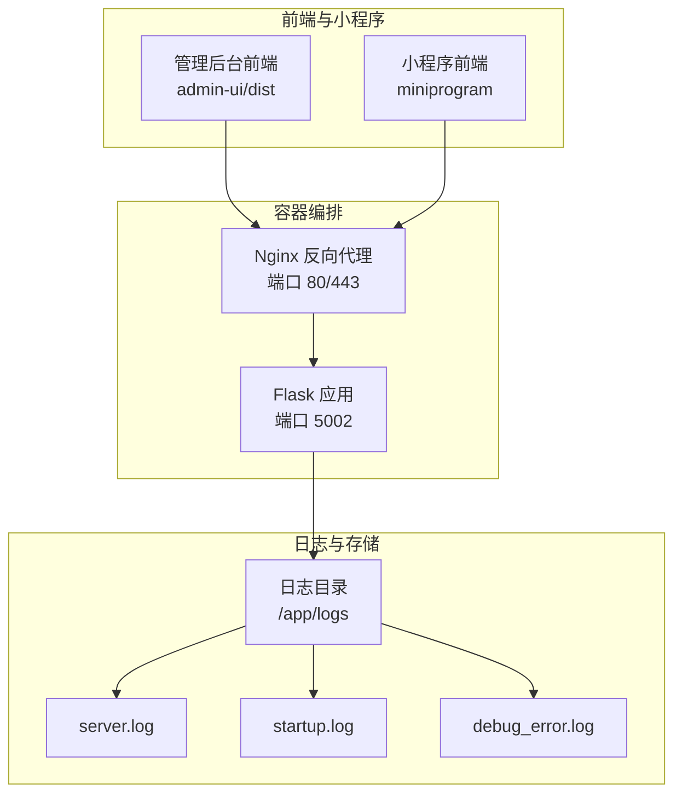
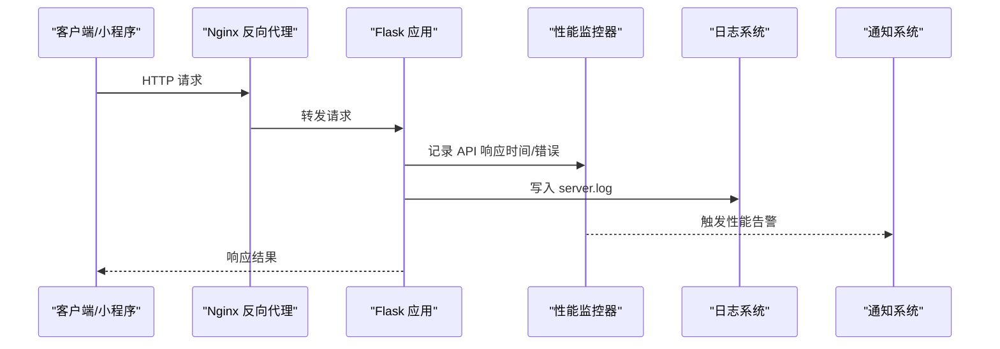
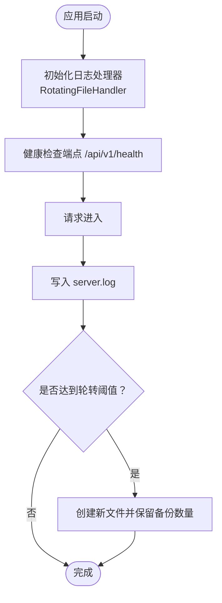
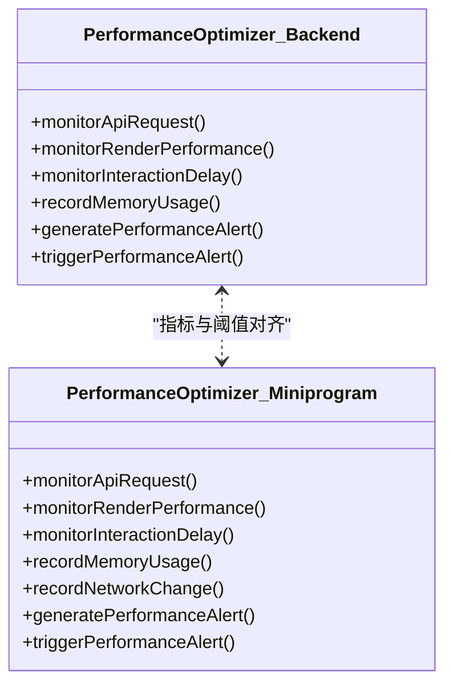
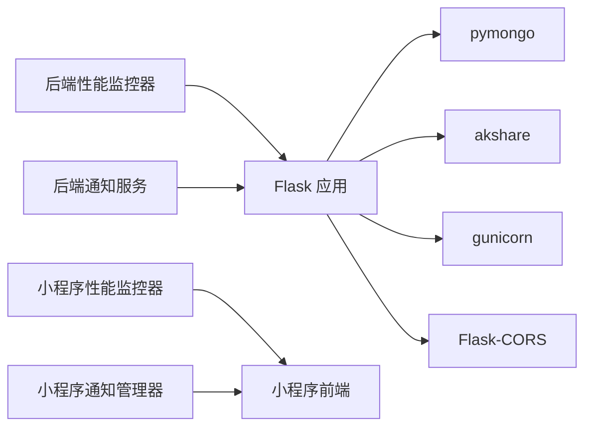

# 监控告警

<cite>
**本文引用的文件**
- [README.md](file://README.md)
- [app.py](file://app.py)
- [config.py](file://config.py)
- [docker-compose.yml](file://deploy/docker-compose.yml)
- [server.log](file://server.log)
- [startup.log](file://logs/startup.log)
- [debug_error.log](file://debug_error.log)
- [notification-manager.js](file://backend_utils/notification-manager.js)
- [notification_service.py](file://services/notification_service.py)
- [performance-optimizer.js（后端）](file://backend_utils/performance-optimizer.js)
- [performance-optimizer.js（小程序）](file://miniprogram/utils/performance-optimizer.js)
- [routes/admin.py](file://routes/admin.py)
- [risk_service.py](file://services/risk_service.py)
- [requirements.txt](file://requirements.txt)
</cite>

## 目录
1. [简介](#简介)
2. [项目结构](#项目结构)
3. [核心组件](#核心组件)
4. [架构总览](#架构总览)
5. [详细组件分析](#详细组件分析)
6. [依赖关系分析](#依赖关系分析)
7. [性能考虑](#性能考虑)
8. [故障排查指南](#故障排查指南)
9. [结论](#结论)
10. [附录](#附录)

## 简介
本文件面向场外期权交易系统的运行监控与告警，围绕日志收集与分析、性能监控指标、告警规则配置、监控仪表板搭建、异常检测与自动恢复、故障转移策略以及监控数据的存储与报表生成进行系统化说明。文档结合现有代码实现与部署配置，提供可落地的实践方案。

## 项目结构
系统采用前后端分离与多端协同的结构：
- 后端服务：基于 Flask，提供 REST API、定时任务、健康检查与日志记录。
- 前端与小程序：分别提供性能监控与告警能力，支持缓存命中率、API 响应时间、渲染性能等指标采集。
- 部署：通过 Docker Compose 将 Flask 应用与 Nginx 暴露服务，挂载日志目录以便集中采集。

图表来源
- [docker-compose.yml](file://deploy/docker-compose.yml#L1-L42)
- [app.py](file://app.py#L24-L35)
- [server.log](file://server.log#L1-L10)

章节来源
- [README.md](file://README.md#L1-L90)
- [docker-compose.yml](file://deploy/docker-compose.yml#L1-L42)

## 核心组件
- 日志系统与健康检查
  - Flask 应用统一写入 server.log；健康检查端点 /api/v1/health 返回数据库连接状态与环境信息。
- 性能监控与告警
  - 后端与小程序均内置性能监控器，采集 API 响应时间、页面加载时间、缓存命中率、渲染时间、交互延迟等指标，并在阈值越限时触发告警。
- 通知系统
  - 后端提供通知服务 stub，便于对接企业微信或其他通知通道；小程序侧提供通知管理器，支持价格预警、询价状态变更等通知。
- 风险与合规
  - 风险服务提供希腊字母计算与交易前风控校验，可用于构建风控告警与限额告警。

章节来源
- [app.py](file://app.py#L185-L197)
- [config.py](file://config.py#L73-L93)
- [performance-optimizer.js（后端）](file://backend_utils/performance-optimizer.js#L23-L36)
- [performance-optimizer.js（小程序）](file://miniprogram/utils/performance-optimizer.js#L23-L36)
- [notification-manager.js](file://backend_utils/notification-manager.js#L34-L64)
- [notification_service.py](file://services/notification_service.py#L9-L15)
- [risk_service.py](file://services/risk_service.py#L52-L60)

## 架构总览
下图展示监控与告警在系统中的位置与交互：

图表来源
- [app.py](file://app.py#L211-L220)
- [performance-optimizer.js（后端）](file://backend_utils/performance-optimizer.js#L147-L183)
- [notification-manager.js](file://backend_utils/notification-manager.js#L168-L194)

## 详细组件分析

### 日志收集与分析策略
- 日志落盘与轮转
  - Flask 应用在生产环境使用 RotatingFileHandler，按大小轮转并限制备份数量，便于集中采集与归档。
- 日志内容与分类
  - server.log：应用运行日志、请求/响应、数据库连接状态、定时任务与异常堆栈。
  - startup.log：启动脚本运行轨迹与环境变量加载信息。
  - debug_error.log：调试阶段的统计与错误信息。
- 日志采集与存储
  - Docker Compose 将宿主机 logs 目录挂载到容器 /app/logs，便于外部 ELK/日志中间件采集。

图表来源
- [config.py](file://config.py#L73-L93)
- [app.py](file://app.py#L24-L35)
- [docker-compose.yml](file://deploy/docker-compose.yml#L16-L18)

章节来源
- [config.py](file://config.py#L73-L93)
- [app.py](file://app.py#L24-L35)
- [server.log](file://server.log#L1-L10)
- [startup.log](file://logs/startup.log#L1-L10)
- [debug_error.log](file://debug_error.log#L1-L12)
- [docker-compose.yml](file://deploy/docker-compose.yml#L16-L18)

### 性能监控指标体系
- 后端性能监控（后端性能监控器）
  - 指标：页面加载时间、API 响应时间、缓存命中率、渲染时间、交互延迟、网络速度、内存使用、错误计数。
  - 阈值：内存使用率、API 响应时间、页面加载时间、渲染时间、交互延迟。
  - 告警：超过阈值时记录告警并输出控制台警告。
- 小程序性能监控（小程序性能监控器）
  - 指标：页面加载时间、API 响应时间、缓存命中率、渲染时间、交互延迟、网络状态变化、内存警告。
  - 阈值：与后端一致，支持内存警告回调与网络断开清理缓存。
- 关键性能指标映射
  - CPU/内存：通过内存警告与内存使用记录间接反映。
  - 数据库连接数：通过健康检查与连接超时日志观测。
  - API 响应时间：通过性能监控器记录与阈值告警。

图表来源
- [performance-optimizer.js（后端）](file://backend_utils/performance-optimizer.js#L23-L36)
- [performance-optimizer.js（小程序）](file://miniprogram/utils/performance-optimizer.js#L23-L36)

章节来源
- [performance-optimizer.js（后端）](file://backend_utils/performance-optimizer.js#L147-L183)
- [performance-optimizer.js（后端）](file://backend_utils/performance-optimizer.js#L586-L618)
- [performance-optimizer.js（后端）](file://backend_utils/performance-optimizer.js#L623-L668)
- [performance-optimizer.js（后端）](file://backend_utils/performance-optimizer.js#L480-L502)
- [performance-optimizer.js（后端）](file://backend_utils/performance-optimizer.js#L720-L743)
- [performance-optimizer.js（小程序）](file://miniprogram/utils/performance-optimizer.js#L147-L183)
- [performance-optimizer.js（小程序）](file://miniprogram/utils/performance-optimizer.js#L586-L618)
- [performance-optimizer.js（小程序）](file://miniprogram/utils/performance-optimizer.js#L623-L668)
- [performance-optimizer.js（小程序）](file://miniprogram/utils/performance-optimizer.js#L549-L567)
- [performance-optimizer.js（小程序）](file://miniprogram/utils/performance-optimizer.js#L480-L502)
- [performance-optimizer.js（小程序）](file://miniprogram/utils/performance-optimizer.js#L720-L743)

### 告警规则配置
- 阈值设定（建议）
  - API 响应时间 > 3 秒
  - 页面加载时间 > 2 秒
  - 渲染时间 > 16ms（约 60fps）
  - 交互延迟 > 300ms
  - 内存使用率 > 80%
  - 错误率 > 5%
- 告警级别
  - 高：API/页面/渲染/交互严重超阈
  - 中：缓存命中率低、数据库连接失败
  - 低：内存警告、网络断开
- 通知渠道
  - 后端通知服务 stub：预留微信/邮件通道；小程序通知管理器：价格预警、询价状态通知。
- 告警触发与收敛
  - 性能监控器周期性生成告警报告，控制台输出警告并保留最近 50 条告警。

章节来源
- [performance-optimizer.js（后端）](file://backend_utils/performance-optimizer.js#L27-L32)
- [performance-optimizer.js（小程序）](file://miniprogram/utils/performance-optimizer.js#L27-L32)
- [notification-manager.js](file://backend_utils/notification-manager.js#L34-L64)
- [notification-manager.js](file://backend_utils/notification-manager.js#L168-L194)
- [notification_service.py](file://services/notification_service.py#L9-L15)

### 监控仪表板搭建指南
- 指标可视化
  - API 响应时间：折线图，按接口维度聚合。
  - 页面加载时间：柱状图，按页面维度聚合。
  - 缓存命中率：折线图，按缓存键聚合。
  - 错误率：折线图，按时间窗口滚动计算。
  - 内存使用：折线图，结合内存警告事件。
- 趋势分析
  - 使用性能报告生成周期（如每 30 分钟）产出指标快照，形成趋势曲线。
- 建议的仪表板布局
  - 顶部：健康状态与告警总数。
  - 左侧：关键指标趋势图。
  - 右侧：告警列表与详情。
- 数据来源
  - 后端性能监控器的性能报告与告警数组。
  - server.log 中的请求/响应与错误日志。

章节来源
- [performance-optimizer.js（后端）](file://backend_utils/performance-optimizer.js#L306-L426)
- [performance-optimizer.js（小程序）](file://miniprogram/utils/performance-optimizer.js#L306-L426)

### 异常检测与自动恢复
- 异常检测
  - 数据库连接失败：健康检查返回数据库断开状态；日志记录连接超时与回退提示。
  - 云数据库凭证失效：路由层捕获异常并回退到本地 Mock 存储。
  - 内存警告：小程序监听内存警告并清理低优先级缓存。
- 自动恢复
  - 数据库连接失败时，应用仍可运行但部分功能受限；可通过重新配置环境变量恢复。
  - 云数据库异常时，自动回退到本地存储，保证服务可用。
  - 网络断开时，清理 API 缓存，避免脏数据影响。
- 故障转移策略
  - 云数据库不可用时，切换到本地 Mock 存储；管理后台提供分页查询与回退提示。
  - 定时任务在交易时间范围内执行行情同步，非交易时间跳过，降低无效负载。

章节来源
- [app.py](file://app.py#L122-L152)
- [routes/admin.py](file://routes/admin.py#L126-L145)
- [routes/admin.py](file://routes/admin.py#L510-L554)
- [performance-optimizer.js（小程序）](file://miniprogram/utils/performance-optimizer.js#L549-L567)
- [app.py](file://app.py#L307-L326)

### 监控数据存储、归档与报表
- 存储
  - server.log 采用轮转策略，限制单文件大小与备份数量，便于集中采集。
- 归档
  - 建议将 /app/logs 挂载到独立存储卷，按日期归档并压缩。
- 报表生成
  - 性能监控器周期性生成性能报告，包含概览、页面性能、API 性能、缓存性能、渲染性能、交互性能、网络性能与建议。
  - 管理后台提供同步历史查询接口，便于审计与报表。

章节来源
- [config.py](file://config.py#L79-L90)
- [performance-optimizer.js（后端）](file://backend_utils/performance-optimizer.js#L306-L426)
- [routes/admin.py](file://routes/admin.py#L510-L554)

## 依赖关系分析
- Flask 应用依赖
  - Flask、Flask-CORS、pymongo、akshare、gunicorn 等。
  - 环境变量驱动数据库连接、日志级别、CORS 策略等。
- 性能监控依赖
  - 后端与小程序性能监控器相互对齐指标与阈值，便于统一告警口径。
- 通知系统依赖
  - 后端通知服务 stub 与小程序通知管理器分别负责后端与前端告警推送。

图表来源
- [requirements.txt](file://requirements.txt#L1-L12)
- [app.py](file://app.py#L1-L14)
- [performance-optimizer.js（后端）](file://backend_utils/performance-optimizer.js#L1-L10)
- [performance-optimizer.js（小程序）](file://miniprogram/utils/performance-optimizer.js#L1-L10)
- [notification-manager.js](file://backend_utils/notification-manager.js#L1-L10)
- [notification_service.py](file://services/notification_service.py#L1-L5)

章节来源
- [requirements.txt](file://requirements.txt#L1-L12)
- [app.py](file://app.py#L1-L14)

## 性能考虑
- 端口与回退
  - 解析 FLASK_PORT 或 PORT，开发环境若为特权端口则回退到 5000。
- 定时任务与交易时间
  - 自动同步行情仅在工作日 9:15-11:30、13:00-15:00 执行，避免非交易时间资源浪费。
- 日志与性能
  - 生产环境启用轮转日志，避免磁盘膨胀；开发环境关闭 reloader 提升稳定性。

章节来源
- [app.py](file://app.py#L90-L100)
- [app.py](file://app.py#L289-L326)
- [config.py](file://config.py#L73-L93)

## 故障排查指南
- 数据库连接失败
  - 现象：健康检查返回数据库断开，日志记录连接超时。
  - 排查：检查 MONGO_URI、连接超时配置；必要时启用 SKIP_DB_INIT。
- 云数据库异常
  - 现象：云数据库凭证失效或查询异常，路由层回退到本地存储。
  - 排查：检查 WX_CLOUD_ENV、WX_APPID、WX_SECRET；确认集合存在与权限。
- 内存警告与网络断开
  - 现象：小程序触发内存警告并清理低优先级缓存；网络断开清理 API 缓存。
  - 排查：检查缓存 TTL、优先级与网络状态监听。

章节来源
- [app.py](file://app.py#L69-L88)
- [app.py](file://app.py#L122-L152)
- [routes/admin.py](file://routes/admin.py#L126-L145)
- [performance-optimizer.js（小程序）](file://miniprogram/utils/performance-optimizer.js#L45-L51)
- [performance-optimizer.js（小程序）](file://miniprogram/utils/performance-optimizer.js#L549-L567)

## 结论
本系统在日志、性能监控、告警与故障恢复方面具备较为完善的基础设施。建议后续补充：
- 将性能监控器输出标准化为指标格式，接入 Prometheus/Grafana。
- 将通知系统对接企业微信/钉钉等生产级通道。
- 增加数据库连接池监控与慢查询日志分析。
- 完善健康检查与自愈机制（如自动重启、熔断）。

## 附录
- 健康检查端点：/api/v1/health
- 管理后台接口：/api/v1/admin/stats、/api/v1/admin/quotes、/api/v1/admin/sync-quotes 等
- 环境变量：MONGO_URI、DATABASE_NAME、WX_CLOUD_ENV、WX_APPID、WX_SECRET、FLASK_PORT、LOG_LEVEL、LOG_FILE 等

章节来源
- [app.py](file://app.py#L185-L197)
- [routes/admin.py](file://routes/admin.py#L47-L83)
- [routes/admin.py](file://routes/admin.py#L114-L155)
- [routes/admin.py](file://routes/admin.py#L313-L335)
- [config.py](file://config.py#L35-L62)