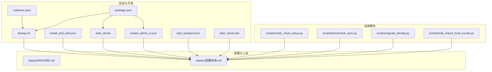
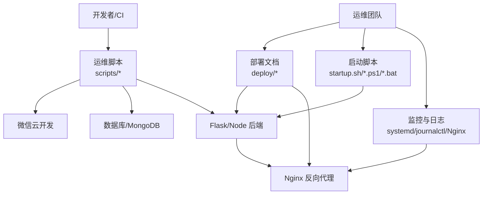
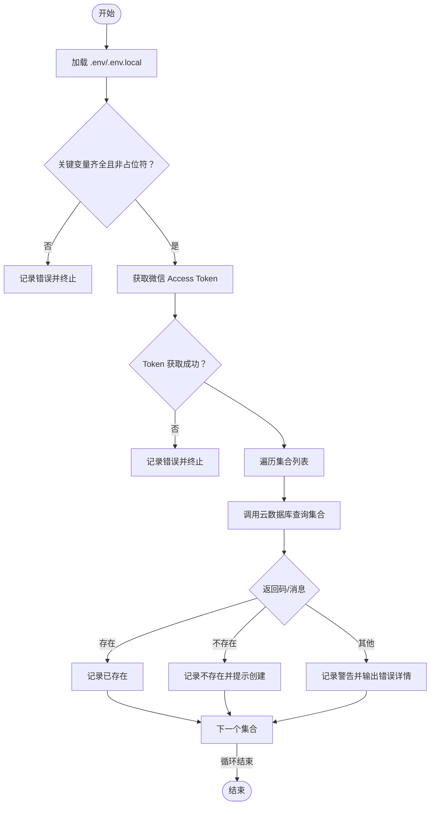
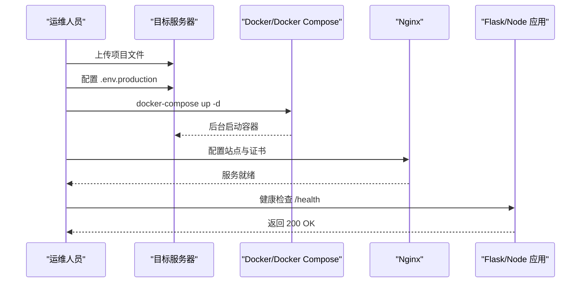
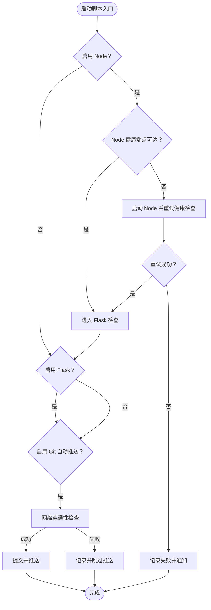
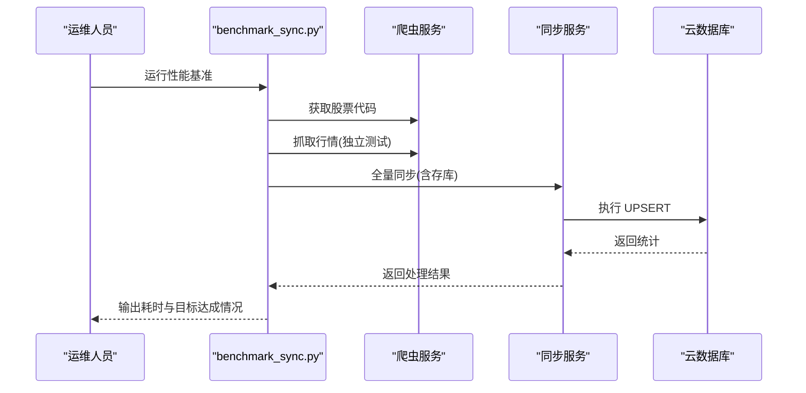
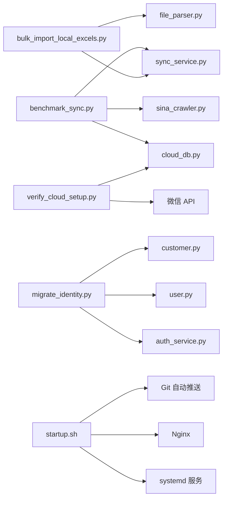

# 运维自动化

<cite>
**本文引用的文件**
- [README.md](file://README.md)
- [deploy/README.md](file://deploy/README.md)
- [deploy/部署指南.md](file://deploy/部署指南.md)
- [scripts/verify_cloud_setup.py](file://scripts/verify_cloud_setup.py)
- [scripts/benchmark_sync.py](file://scripts/benchmark_sync.py)
- [scripts/migrate_identity.py](file://scripts/migrate_identity.py)
- [scripts/bulk_import_local_excels.py](file://scripts/bulk_import_local_excels.py)
- [startup.sh](file://startup.sh)
- [install_and_start.ps1](file://install_and_start.ps1)
- [start_all.bat](file://start_all.bat)
- [restart_admin_ui.ps1](file://restart_admin_ui.ps1)
- [start_backend.ps1](file://start_backend.ps1)
- [start_server.bat](file://start_server.bat)
- [nodemon.json](file://nodemon.json)
- [package.json](file://package.json)
</cite>

## 目录
1. [简介](#简介)
2. [项目结构](#项目结构)
3. [核心组件](#核心组件)
4. [架构总览](#架构总览)
5. [详细组件分析](#详细组件分析)
6. [依赖关系分析](#依赖关系分析)
7. [性能考量](#性能考量)
8. [故障排除指南](#故障排除指南)
9. [结论](#结论)
10. [附录](#附录)

## 简介
本文件面向运维工程师与开发团队，系统化梳理场外期权交易系统的自动化运维工具集，覆盖环境验证、一键部署、故障自愈、监控与日志、任务调度与批处理、以及安全与权限管理等主题。文档以仓库内现有脚本与配置为依据，提供可操作的使用说明、流程图示与最佳实践建议。

## 项目结构
围绕运维自动化，仓库中与之直接相关的关键位置如下：
- 运维脚本与工具：scripts 目录下的各类 Python 脚本，用于云环境校验、性能基准、身份迁移与批量导入。
- 启动与开发环境脚本：多平台启动脚本与开发工具配置，便于本地快速拉起服务并进行健康检查。
- 部署与上线指南：deploy 目录包含 Docker Compose 与 Nginx 手动部署说明，以及生产环境部署手册。
- 开发工具配置：package.json 与 nodemon.json 定义了开发模式下的热重载与并发开发能力。

图表来源
- [scripts/verify_cloud_setup.py](file://scripts/verify_cloud_setup.py#L1-L99)
- [scripts/benchmark_sync.py](file://scripts/benchmark_sync.py#L1-L57)
- [scripts/migrate_identity.py](file://scripts/migrate_identity.py#L1-L102)
- [scripts/bulk_import_local_excels.py](file://scripts/bulk_import_local_excels.py#L1-L100)
- [startup.sh](file://startup.sh#L1-L234)
- [install_and_start.ps1](file://install_and_start.ps1#L1-L156)
- [start_all.bat](file://start_all.bat#L1-L58)
- [restart_admin_ui.ps1](file://restart_admin_ui.ps1#L1-L57)
- [start_backend.ps1](file://start_backend.ps1#L1-L62)
- [start_server.bat](file://start_server.bat#L1-L21)
- [nodemon.json](file://nodemon.json#L1-L13)
- [package.json](file://package.json#L1-L50)
- [deploy/README.md](file://deploy/README.md#L1-L44)
- [deploy/部署指南.md](file://deploy/部署指南.md#L1-L367)

章节来源
- [deploy/README.md](file://deploy/README.md#L1-L44)
- [deploy/部署指南.md](file://deploy/部署指南.md#L1-L367)

## 核心组件
- 环境验证脚本：对微信云开发环境进行配置校验与集合存在性检查，保障数据库与权限前置条件满足。
- 部署自动化脚本：提供 Docker Compose 一键部署与 Nginx 手动部署路径；同时包含 systemd 服务配置与 HTTPS 证书配置。
- 故障自愈脚本：通过启动脚本实现服务健康检查与重试、自动推送、通知提示等自愈行为。
- 监控与日志：提供 systemd 日志查看、Nginx 访问/错误日志与应用日志定位方法。
- 批处理与任务：性能基准测试脚本、批量 Excel 导入脚本、身份迁移脚本，支撑日常维护与数据治理。
- 安全与权限：HTTPS 证书配置、CORS 头设置、数据库权限策略、环境变量保护与最小权限原则。

章节来源
- [scripts/verify_cloud_setup.py](file://scripts/verify_cloud_setup.py#L1-L99)
- [scripts/benchmark_sync.py](file://scripts/benchmark_sync.py#L1-L57)
- [scripts/migrate_identity.py](file://scripts/migrate_identity.py#L1-L102)
- [scripts/bulk_import_local_excels.py](file://scripts/bulk_import_local_excels.py#L1-L100)
- [startup.sh](file://startup.sh#L1-L234)
- [deploy/部署指南.md](file://deploy/部署指南.md#L284-L312)

## 架构总览
下图展示运维自动化工具在整体系统中的位置与交互关系：脚本负责环境校验、部署与批处理；启动脚本负责服务生命周期与健康检查；部署文档提供生产环境落地规范；日志与监控为运维可观测性提供支撑。

图表来源
- [scripts/verify_cloud_setup.py](file://scripts/verify_cloud_setup.py#L1-L99)
- [scripts/benchmark_sync.py](file://scripts/benchmark_sync.py#L1-L57)
- [scripts/migrate_identity.py](file://scripts/migrate_identity.py#L1-L102)
- [scripts/bulk_import_local_excels.py](file://scripts/bulk_import_local_excels.py#L1-L100)
- [startup.sh](file://startup.sh#L1-L234)
- [deploy/部署指南.md](file://deploy/部署指南.md#L1-L367)

## 详细组件分析

### 环境验证脚本：微信云开发配置检查
- 功能概述
  - 加载环境变量文件（优先 .env.local，其次 .env），输出加载状态。
  - 校验微信云开发关键变量（环境 ID、AppID、Secret），若未配置或占位符则报错并终止。
  - 通过微信 API 获取 Access Token，并对 quotes、groups、inquiries、orders 等集合进行存在性检查。
  - 输出集合检查结果与权限建议。
- 关键流程（含错误处理）
  - 环境变量加载失败时采用当前环境变量继续执行。
  - Access Token 获取失败或网络异常时终止后续集合检查。
  - 集合检查返回特定错误码或错误信息时，区分“不存在”、“异常”并记录日志。
- 使用方法
  - 在项目根目录执行脚本，确保 .env(.local) 中已配置 WX_CLOUD_ENV、WX_APPID、WX_SECRET。
  - 根据日志提示修正变量或在云开发控制台创建缺失集合。
- 安全与权限
  - 建议将敏感变量放入受控的 .env.local 并纳入 .gitignore。
  - 集合权限建议遵循“所有用户可读，仅创建者可写”的最小权限原则。

图表来源
- [scripts/verify_cloud_setup.py](file://scripts/verify_cloud_setup.py#L11-L95)

章节来源
- [scripts/verify_cloud_setup.py](file://scripts/verify_cloud_setup.py#L1-L99)

### 部署自动化脚本与流程
- Docker Compose 一键部署
  - 在服务器安装 Docker 与 Docker Compose，复制项目文件，修改生产环境变量，执行 docker-compose up -d。
- 手动部署 Nginx
  - 安装 Nginx，复制站点配置，测试并重启 Nginx。
- 前端构建
  - 在部署前构建 Admin UI，产物位于 admin-ui/dist。
- systemd 服务配置
  - 创建 option-api.service，设置 ExecStart 指向 app.py，配置自动重启与日志输出。
- HTTPS 证书
  - 使用 Certbot 申请证书并配置自动续期。
- 生产环境验证
  - 通过健康检查与 API 接口验证服务可用性；进行小程序真机测试与基础性能测试。

图表来源
- [deploy/README.md](file://deploy/README.md#L13-L43)
- [deploy/部署指南.md](file://deploy/部署指南.md#L51-L171)

章节来源
- [deploy/README.md](file://deploy/README.md#L1-L44)
- [deploy/部署指南.md](file://deploy/部署指南.md#L1-L367)

### 故障自愈脚本：启动与健康检查
- 启动脚本能力
  - 自动检测 Node/Flask 服务健康端点，若未运行则启动对应进程并重试健康检查。
  - 支持 Git 自动推送：检测变更、网络连通性、提交与推送，失败时记录日志并通知。
  - 统一日志与 PID 管理，便于排障。
- PowerShell 与批处理脚本
  - Windows 下提供安装依赖、端口占用检测、Flask 启动与健康检查链接。
  - 批处理脚本用于本地开发环境快速启动 Python 静态服务器与 Node 后端。
- 自愈要点
  - 重试机制与超时控制，避免瞬时网络波动导致失败。
  - 健康检查优先使用 curl/python3，回退到 ping/curl，提升兼容性。
  - 通知机制（notify-send/osascript）在桌面环境下提供即时反馈。

图表来源
- [startup.sh](file://startup.sh#L106-L146)
- [startup.sh](file://startup.sh#L148-L187)
- [startup.sh](file://startup.sh#L189-L234)

章节来源
- [startup.sh](file://startup.sh#L1-L234)
- [install_and_start.ps1](file://install_and_start.ps1#L1-L156)
- [start_all.bat](file://start_all.bat#L1-L58)
- [restart_admin_ui.ps1](file://restart_admin_ui.ps1#L1-L57)
- [start_backend.ps1](file://start_backend.ps1#L1-L62)
- [start_server.bat](file://start_server.bat#L1-L21)

### 监控自动化工具：日志与状态
- systemd 日志
  - 使用 journalctl 查看 option-api 服务日志，支持实时跟踪与历史查询。
- 应用日志
  - 查看应用日志文件 tail -f /opt/option-trading/logs/production.log。
- 资源监控
  - top、htop、df -h、free -h 观察 CPU、内存、磁盘使用情况。
- Nginx 日志
  - 查看 access_log 与 error_log，定位反向代理层问题。

章节来源
- [deploy/部署指南.md](file://deploy/部署指南.md#L284-L312)

### 批处理与定期维护脚本
- 性能基准测试
  - 自动获取股票代码、抓取行情、全量同步并统计各阶段耗时，判断是否达到目标阈值。
- 批量 Excel 导入
  - 搜索指定模式的 Excel 文件，解析个股香草报价并同步至云数据库，记录成功/失败统计。
- 身份迁移
  - 遍历用户并为每个用户创建/更新对应的客户记录，支持分页与错误计数，便于数据一致性治理。

图表来源
- [scripts/benchmark_sync.py](file://scripts/benchmark_sync.py#L14-L56)

章节来源
- [scripts/benchmark_sync.py](file://scripts/benchmark_sync.py#L1-L57)
- [scripts/bulk_import_local_excels.py](file://scripts/bulk_import_local_excels.py#L1-L100)
- [scripts/migrate_identity.py](file://scripts/migrate_identity.py#L1-L102)

### 开发工具与热重载
- package.json
  - 定义开发脚本：dev:node、dev:flask、dev:ui、dev:node-ui、dev，支持并发启动 Node/Flask/UI。
  - 引擎版本约束（Node >=18、npm >=9）。
- nodemon.json
  - 配置 watch 与忽略目录，避免无关文件变动触发重启，提升开发体验。

章节来源
- [package.json](file://package.json#L1-L50)
- [nodemon.json](file://nodemon.json#L1-L13)

## 依赖关系分析
- 脚本与部署文档耦合度高：环境验证脚本与部署指南共同确保云数据库与集合前置条件满足；批量导入与性能基准脚本服务于上线前的数据与性能准备。
- 启动脚本与 systemd/Nginx 形成闭环：启动脚本负责进程生命周期与健康检查，systemd 负责开机自启与崩溃重启，Nginx 负责反向代理与证书终止。
- 开发工具链与运维脚本互补：开发脚本（package.json/nodemon.json）提升迭代效率，运维脚本（startup.sh/*.ps1/*.bat）保障生产稳定。

图表来源
- [scripts/benchmark_sync.py](file://scripts/benchmark_sync.py#L1-L57)
- [scripts/bulk_import_local_excels.py](file://scripts/bulk_import_local_excels.py#L1-L100)
- [scripts/migrate_identity.py](file://scripts/migrate_identity.py#L1-L102)
- [scripts/verify_cloud_setup.py](file://scripts/verify_cloud_setup.py#L1-L99)
- [startup.sh](file://startup.sh#L1-L234)

章节来源
- [scripts/benchmark_sync.py](file://scripts/benchmark_sync.py#L1-L57)
- [scripts/bulk_import_local_excels.py](file://scripts/bulk_import_local_excels.py#L1-L100)
- [scripts/migrate_identity.py](file://scripts/migrate_identity.py#L1-L102)
- [scripts/verify_cloud_setup.py](file://scripts/verify_cloud_setup.py#L1-L99)
- [startup.sh](file://startup.sh#L1-L234)

## 性能考量
- 性能基准测试
  - 通过分阶段统计（代码获取、独立抓取、完整同步）评估系统瓶颈，设定目标阈值并持续优化。
- 并发与分片
  - 在批量导入与同步过程中合理设置并发数与分片大小，避免对数据库造成过大压力。
- 资源监控
  - 结合 systemd 日志与系统监控命令，持续观察 CPU、内存、磁盘与网络使用情况，及时扩容或优化。

## 故障排除指南
- API 跨域错误
  - 检查 Nginx 配置是否包含必要的 CORS 头，确保允许的方法与头部。
- MongoDB 连接失败
  - 检查 mongod 服务状态与日志，必要时重启服务。
- SSL 证书获取失败
  - 检查域名解析与 80 端口开放情况，尝试手动获取证书。
- 服务状态与日志
  - 使用 systemctl status 查看服务状态；使用 journalctl 查看 systemd 日志；查看 Nginx 访问/错误日志与应用日志文件。

章节来源
- [deploy/部署指南.md](file://deploy/部署指南.md#L316-L352)

## 结论
本运维自动化工具集以脚本化与文档化为核心，覆盖环境验证、一键部署、故障自愈、监控日志、批处理与定期维护等关键环节。结合 systemd 与 Nginx 的生产级配置，配合日志与监控手段，可显著提升系统的稳定性与可维护性。建议在实际生产中进一步完善自动化巡检、告警与回滚机制，并持续优化性能基准与资源配额。

## 附录
- 快速参考
  - 环境验证：执行 verify_cloud_setup.py，确保 WX_* 环境变量与集合存在。
  - 一键部署：使用 Docker Compose 或按照部署指南手动配置 Nginx 与 systemd。
  - 启动服务：Windows 使用 PowerShell/批处理脚本，Linux 使用 startup.sh。
  - 监控日志：journalctl、Nginx 日志与应用日志文件。
  - 批处理：benchmark_sync.py、bulk_import_local_excels.py、migrate_identity.py。