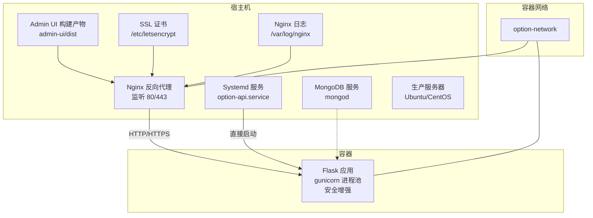
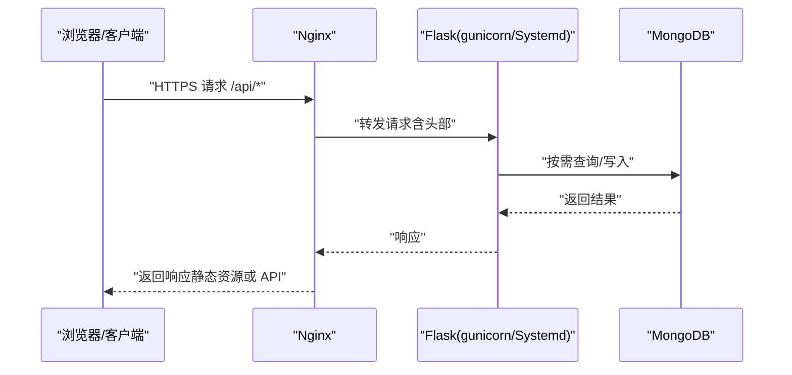
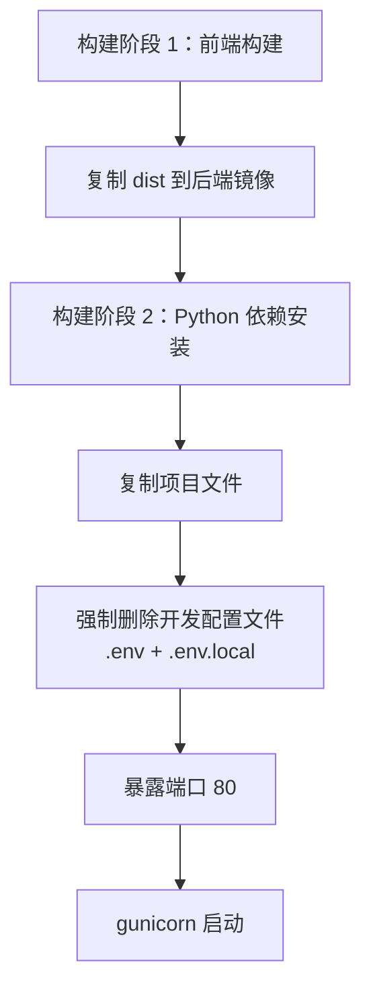
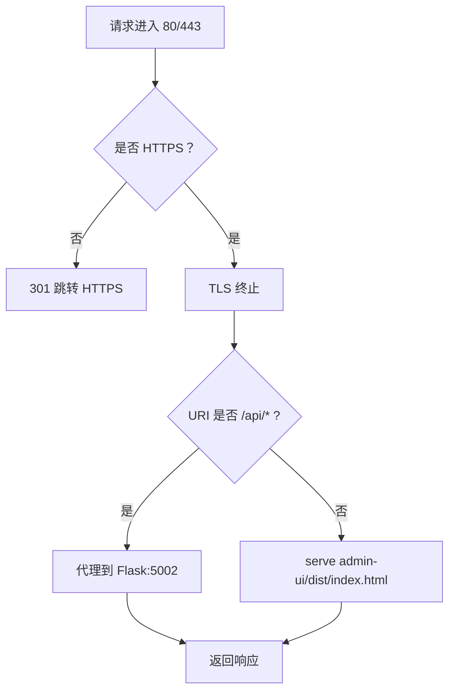
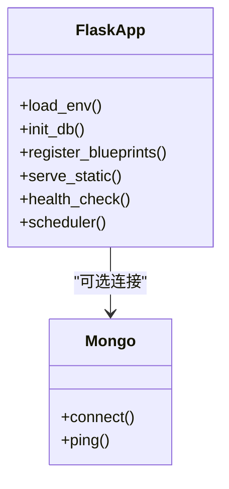
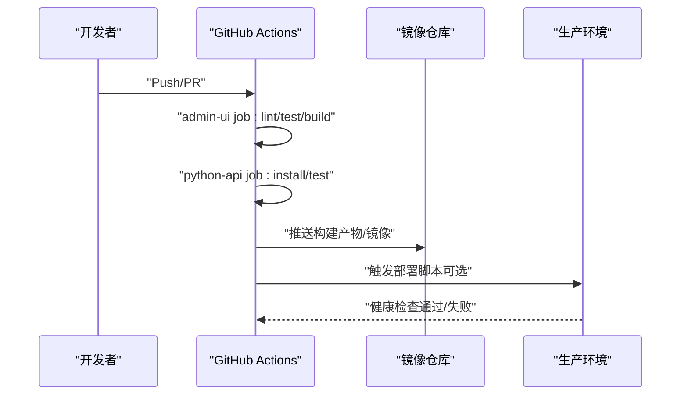
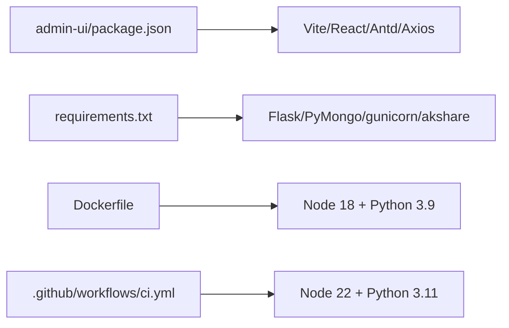

# 部署运维

<cite>
**本文引用的文件**
- [Dockerfile](file://Dockerfile)
- [docker-compose.yml](file://deploy/docker-compose.yml)
- [nginx.conf](file://deploy/nginx.conf)
- [README.md（部署指南）](file://deploy/README.md)
- [部署指南.md（生产环境部署指南）](file://deploy/部署指南.md)
- [.env.production](file://.env.production)
- [requirements.txt](file://requirements.txt)
- [package.json（根）](file://package.json)
- [package.json（admin-ui）](file://admin-ui/package.json)
- [app.py](file://app.py)
- [.github/workflows/ci.yml](file://.github/workflows/ci.yml)
- [CONTRIBUTING.md](file://CONTRIBUTING.md)
- [README.md（项目总览）](file://README.md)
- [startup.ps1](file://startup.ps1)
- [startup.sh](file://startup.sh)
</cite>

## 目录
1. [简介](#简介)
2. [项目结构](#项目结构)
3. [核心组件](#核心组件)
4. [架构总览](#架构总览)
5. [详细组件分析](#详细组件分析)
6. [依赖关系分析](#依赖关系分析)
7. [性能考量](#性能考量)
8. [故障排除指南](#故障排除指南)
9. [结论](#结论)
10. [附录](#附录)

## 简介
本文件面向场外期权交易系统的部署与运维团队，提供从容器化部署、反向代理与负载均衡、CI/CD 流程、自动化部署与回滚、监控告警与日志分析、数据库备份与高可用、安全加固与合规检查，到运维工具与故障排除的全流程指导。内容基于仓库现有配置与脚本进行归纳总结，确保可操作、可落地。

**更新** 新增完整的生产环境部署指南文档，涵盖服务器配置、HTTPS证书、Nginx配置、Systemd服务等关键部署步骤，为生产部署提供详细指导。**新增** Dockerfile中的生产环境安全增强，强制删除开发配置文件，确保生产容器不包含开发环境配置。

## 项目结构
该系统采用前后端分离架构：前端为 React 管理后台（admin-ui），后端为 Python+Flask 的 API 服务，配合 Nginx 作为反向代理与静态资源服务，使用 Docker Compose 进行容器化编排。生产环境通过 .env.production 注入密钥与配置，Dockerfile 采用多阶段构建，先构建前端再打包至后端镜像。**新增** 生产环境安全增强，强制删除开发配置文件(.env, .env.local)。

**图表来源**
- [docker-compose.yml](file://deploy/docker-compose.yml#L1-L42)
- [nginx.conf](file://deploy/nginx.conf#L1-L61)
- [Dockerfile](file://Dockerfile#L1-L51)
- [部署指南.md（生产环境部署指南）](file://deploy/部署指南.md#L138-L171)

**章节来源**
- [README.md（部署指南）](file://deploy/README.md#L1-L44)
- [docker-compose.yml](file://deploy/docker-compose.yml#L1-L42)
- [nginx.conf](file://deploy/nginx.conf#L1-L61)
- [Dockerfile](file://Dockerfile#L1-L51)
- [部署指南.md（生产环境部署指南）](file://deploy/部署指南.md#L1-L367)

## 核心组件
- Flask API 服务：提供期权相关接口、健康检查、静态资源托管与后台定时任务调度。
- Nginx 反向代理：统一入口、HTTPS 强制跳转、静态资源缓存、WebSocket/HTTP 代理、日志采集。
- Docker Compose：编排 Flask 与 Nginx，挂载证书与日志卷，定义容器网络。
- Systemd 服务：生产环境直接部署模式下的服务管理，自动重启与日志记录。
- CI/CD：GitHub Actions 自动化前端 Lint/测试/构建与后端测试。
- 环境配置：.env.production 管理密钥、数据库、跨域、API 基础地址等生产配置。
- 前端构建：admin-ui 使用 Vite 构建，产物复制到 Nginx 静态目录。
- **新增** 安全增强：Dockerfile 强制删除开发配置文件，防止敏感信息泄露。

**章节来源**
- [app.py](file://app.py#L103-L276)
- [nginx.conf](file://deploy/nginx.conf#L12-L60)
- [docker-compose.yml](file://deploy/docker-compose.yml#L3-L37)
- [部署指南.md（生产环境部署指南）](file://deploy/部署指南.md#L138-L171)
- [.github/workflows/ci.yml](file://.github/workflows/ci.yml#L1-L35)
- [.env.production](file://.env.production#L1-L53)
- [package.json（admin-ui）](file://admin-ui/package.json#L1-L38)
- [Dockerfile](file://Dockerfile#L43-L44)

## 架构总览
系统采用"Nginx + Flask + 可选 MongoDB"的三层架构。Nginx 作为统一入口，负责 TLS 终止、静态资源与 API 反向代理；Flask 使用 gunicorn 提供 WSGI 服务，承载业务逻辑与路由；MongoDB 作为可选持久化存储，连接超时与重试策略在应用层实现。生产环境支持两种部署模式：Docker Compose 容器化部署和 Systemd 直接部署。**新增** 生产环境安全增强，确保容器中不包含开发配置文件。

**图表来源**
- [nginx.conf](file://deploy/nginx.conf#L39-L53)
- [app.py](file://app.py#L103-L210)
- [Dockerfile](file://Dockerfile#L46-L47)
- [部署指南.md（生产环境部署指南）](file://deploy/部署指南.md#L138-L171)

## 详细组件分析

### Docker 容器化与编排
- 多阶段构建：前端在独立阶段构建，后端镜像复制前端产物，减少最终镜像体积。
- 运行时：gunicorn 以多进程多线程方式启动，暴露 80 端口（微信云托管默认端口）。
- 卷挂载：日志目录、SSL 证书目录、前端构建产物目录挂载至容器内对应路径。
- 网络：定义桥接网络 option-network，服务间通过服务名通信。
- **新增** 安全增强：在构建过程中强制删除 .env 和 .env.local 文件，确保生产容器不包含开发环境配置。

**图表来源**
- [Dockerfile](file://Dockerfile#L1-L51)

**章节来源**
- [Dockerfile](file://Dockerfile#L1-L51)
- [docker-compose.yml](file://deploy/docker-compose.yml#L3-L37)

### Nginx 反向代理与负载均衡
- 监听 80/443，强制跳转 HTTPS，启用 TLSv1.2/1.3 与安全套件。
- 静态资源：root 指向 admin-ui/dist，React Router 回退至 index.html。
- API 代理：/api/ 前缀转发至 Flask（127.0.0.1:5002），保留 WebSocket/HTTP 升级头，设置较长超时。
- 缓存：静态资源缓存一年，提升性能。
- 日志：独立 access/error 日志，便于审计与分析。

**图表来源**
- [nginx.conf](file://deploy/nginx.conf#L2-L60)

**章节来源**
- [nginx.conf](file://deploy/nginx.conf#L1-L61)
- [deploy/README.md](file://deploy/README.md#L23-L43)

### Flask 应用与路由
- 环境变量加载：优先 .env.local，其次 .env.production（生产），最后默认 .env。
- 数据库连接：MongoDB 连接超时与重试策略，无数据库时以"无 DB 模式"运行。
- 跨域：CORS 支持自定义允许来源、方法与头部，支持凭据。
- 蓝图注册：统一前缀 /api/v1，包含鉴权、询价、行情、交易、管理等模块。
- 静态资源：优先返回 admin-ui/dist 下的静态文件，否则回退到 index.html。
- 健康检查：/api/v1/health 返回服务状态与数据库连接状态。
- 后台任务：定时同步行情，仅在交易时间段执行，受环境变量控制。

**图表来源**
- [app.py](file://app.py#L103-L276)

**章节来源**
- [app.py](file://app.py#L1-L350)

### Systemd 服务管理（生产环境直部署）
- 服务配置：option-api.service 使用 systemd 管理 Flask 应用，自动重启与日志记录。
- 环境变量：通过 WorkingDirectory 和 Environment 设置 Python 路径。
- 启动顺序：依赖 network.target 和 mongodb.service，确保数据库可用。
- 监控：journalctl 实时查看应用日志，systemctl status 检查服务状态。

**章节来源**
- [部署指南.md（生产环境部署指南）](file://deploy/部署指南.md#L138-L171)

### CI/CD 流程与自动化部署
- 触发：push 或 pull_request。
- jobs：
  - admin-ui：安装 Node.js 22，安装依赖，Lint、测试、构建。
  - python-api：安装 Python 3.11，安装依赖，跳过数据库初始化执行单元测试。
- 建议：结合 Docker Compose 在流水线末尾进行部署（拉取镜像、启动容器、健康检查），并支持回滚（镜像标签切换）。

**图表来源**
- [.github/workflows/ci.yml](file://.github/workflows/ci.yml#L1-L35)

**章节来源**
- [.github/workflows/ci.yml](file://.github/workflows/ci.yml#L1-L35)

### 监控告警与日志
- Nginx 日志：access_log 与 error_log 分离，便于定位慢请求、错误与攻击行为。
- Flask 日志：标准输出与文件日志双写，建议在容器中集中采集（如 stdout -> Fluent Bit/Fluentd）。
- Systemd 日志：journalctl -u option-api 实时查看应用日志。
- 建议指标（基于仓库文档建议）：
  - 业务：每日新增询价数、处理时长、转化率
  - 性能：API 响应时间、数据库查询耗时、错误率
  - 系统：CPU/内存、并发连接数、队列长度
- 告警阈值示例：API 响应时间 > 3s；错误率 > 5%

**章节来源**
- [nginx.conf](file://deploy/nginx.conf#L25-L27)
- [app.py](file://app.py#L24-L35)
- [部署指南.md（生产环境部署指南）](file://deploy/部署指南.md#L284-L312)
- [INQUIRY_ENHANCEMENT_REPORT.md](file://INQUIRY_ENHANCEMENT_REPORT.md#L522-L542)

### 数据库备份与高可用
- 当前应用对 MongoDB 为可选连接，具备降级能力；生产建议：
  - 使用外部托管 MongoDB（副本集/分片）或云数据库，开启自动备份与跨区复制。
  - 备份策略：全量+增量，定期校验，异地容灾。
  - 连接池与超时：合理设置连接超时与重试次数，避免雪崩。
- 本仓库未提供数据库迁移/备份脚本，建议在运维脚本中补充。

**章节来源**
- [app.py](file://app.py#L69-L88)

### 安全加固与合规
- 密钥管理：生产密钥置于 .env.production，禁止提交；使用最小权限与轮换策略。
- CORS 与跨域：严格限定 ALLOWED_ORIGINS，避免通配。
- TLS：启用 TLSv1.2/1.3，使用安全套件，证书路径与权限需最小化。
- 日志脱敏：避免输出敏感信息（Token、完整连接串），仅记录必要上下文。
- CI 安全：禁止在流水线中明文输出密钥；使用加密变量与最小权限令牌。
- **新增** 配置文件安全：Dockerfile 强制删除 .env 和 .env.local 文件，防止开发配置泄露到生产环境。

**章节来源**
- [.env.production](file://.env.production#L10-L34)
- [nginx.conf](file://deploy/nginx.conf#L20-L24)
- [CONTRIBUTING.md](file://CONTRIBUTING.md#L20-L31)
- [Dockerfile](file://Dockerfile#L43-L44)

### 运维工具与自动化脚本
- 启动脚本：Windows PowerShell 脚本提供日志目录、PID 目录、启动日志路径管理与重试封装，可用于本地或简单自动化场景。
- Linux Shell 脚本：提供网络检测、Git 自动推送、健康检查与重试机制。
- 建议补充：Linux/Unix 部署脚本（拉取镜像、健康检查、回滚）、数据库备份/恢复脚本、证书续期脚本。

**章节来源**
- [startup.ps1](file://startup.ps1#L1-L226)
- [startup.sh](file://startup.sh#L1-L234)

## 依赖关系分析
- 前端依赖：admin-ui 使用 Vite、React、Ant Design、Axios、React Router 等。
- 后端依赖：Flask、Flask-CORS、PyMongo、pandas、openpyxl、akshare、requests、gunicorn、PyJWT 等。
- 运行时：Node 18（前端构建），Python 3.9（后端镜像），gunicorn。
- CI 依赖：Node 22（前端），Python 3.11（后端测试）。

**图表来源**
- [package.json（admin-ui）](file://admin-ui/package.json#L1-L38)
- [requirements.txt](file://requirements.txt#L1-L12)
- [Dockerfile](file://Dockerfile#L1-L51)
- [.github/workflows/ci.yml](file://.github/workflows/ci.yml#L1-L35)

**章节来源**
- [package.json（admin-ui）](file://admin-ui/package.json#L1-L38)
- [package.json（根）](file://package.json#L1-L50)
- [requirements.txt](file://requirements.txt#L1-L12)
- [.github/workflows/ci.yml](file://.github/workflows/ci.yml#L1-L35)

## 性能考量
- Nginx 层面：静态资源缓存一年；长连接与超时设置（proxy_read_timeout、proxy_connect_timeout）；TLS 优化。
- 应用层面：gunicorn 多进程多线程；后台定时任务仅在交易时段执行；MongoDB 连接超时与重试。
- 建议：引入 CDN 加速静态资源；数据库查询建立索引；对热点接口增加缓存；监控响应时间与错误率，动态扩缩容。

**章节来源**
- [nginx.conf](file://deploy/nginx.conf#L55-L59)
- [Dockerfile](file://Dockerfile#L46-L47)
- [app.py](file://app.py#L279-L330)

## 故障排除指南
- 无法访问 API：检查 Nginx 是否正确代理到 Flask；确认 Flask 端口映射与容器网络；查看 Nginx access/error 日志。
- 健康检查失败：进入容器检查 gunicorn 是否启动、端口是否被占用；查看 Flask 日志。
- 数据库连接失败：检查 MONGO_URI 与网络连通性；应用会以"无 DB 模式"运行，部分功能受限。
- CORS 跨域报错：核对 ALLOWED_ORIGINS 与请求头；确保前端与后端域名一致。
- CI 失败：查看 Actions 日志，确认 Node/Python 版本与依赖安装是否成功；前端 Lint/测试/构建是否通过。
- Systemd 服务启动失败：使用 journalctl -u option-api 查看详细错误信息；检查环境变量与依赖安装。
- HTTPS 证书问题：确认 Certbot 安装与证书续期配置；检查 80 端口可达性。
- **新增** 配置文件相关问题：检查 .env.production 文件是否存在且格式正确；确认 Docker 构建时是否正确删除了开发配置文件。

**章节来源**
- [nginx.conf](file://deploy/nginx.conf#L39-L53)
- [app.py](file://app.py#L185-L197)
- [app.py](file://app.py#L69-L88)
- [.github/workflows/ci.yml](file://.github/workflows/ci.yml#L1-L35)
- [部署指南.md（生产环境部署指南）](file://deploy/部署指南.md#L316-L352)
- [Dockerfile](file://Dockerfile#L43-L44)

## 结论
本项目已具备完善的容器化与反向代理基础，CI/CD 流水线覆盖前端与后端测试。新增的生产环境部署指南提供了完整的服务器配置、HTTPS 证书、Nginx 和 Systemd 服务配置，形成了从开发到生产的完整部署体系。**新增** Dockerfile 中的生产环境安全增强，强制删除开发配置文件，显著提升了生产环境的安全性。建议在生产环境中补充数据库高可用与备份、集中化日志与监控告警、自动化部署与回滚脚本、以及安全加固与合规检查流程，形成闭环的运维体系。

## 附录

### 部署步骤（基于现有配置）

#### Docker Compose 容器化部署
- 准备服务器与域名：购买域名并解析，申请 SSL 证书。
- 构建前端：在 admin-ui 目录执行安装与构建，产物位于 dist。
- 配置生产环境：编辑 .env.production，填写密钥、数据库、跨域与 API 基础地址。
- 启动服务：在 deploy 目录执行 docker-compose up -d，等待容器启动并健康检查通过。
- **新增** 安全验证：确认容器中不存在 .env 和 .env.local 文件。

**章节来源**
- [deploy/README.md](file://deploy/README.md#L5-L43)
- [.env.production](file://.env.production#L1-L53)
- [docker-compose.yml](file://deploy/docker-compose.yml#L1-L42)
- [Dockerfile](file://Dockerfile#L43-L44)

#### Systemd 直接部署（生产环境推荐）
- 服务器环境配置：更新系统、安装 Python 3.9+、MongoDB、Nginx、Git。
- 项目部署：创建 /opt/option-trading 目录，克隆代码，安装依赖，配置环境变量。
- HTTPS 证书配置：安装 Certbot，获取并配置 Let's Encrypt 证书。
- Nginx 配置：创建站点配置文件，启用配置并重启服务。
- Systemd 服务配置：创建 option-api.service，启动服务并设置开机自启。
- 部署验证：测试健康检查、API 接口、小程序真机测试。

**章节来源**
- [部署指南.md（生产环境部署指南）](file://deploy/部署指南.md#L22-L367)

### 关键配置清单
- 环境变量（生产）：密钥、JWT、跨域、数据库、微信云开发、管理员账号、API 基础地址、日志级别与文件、缓存与限流。
- Nginx：监听端口、HTTPS、证书路径、静态资源、API 代理、超时与缓存、日志。
- Docker：多阶段构建、gunicorn 启动参数、卷挂载、网络、**新增** 安全增强（强制删除开发配置文件）。
- Systemd：服务配置、启动顺序、日志管理。
- MongoDB：安装配置、服务管理、日志查看。

**章节来源**
- [.env.production](file://.env.production#L1-L53)
- [nginx.conf](file://deploy/nginx.conf#L1-L61)
- [Dockerfile](file://Dockerfile#L1-L51)
- [部署指南.md（生产环境部署指南）](file://deploy/部署指南.md#L138-L171)
- [deploy/docker-compose.yml](file://deploy/docker-compose.yml#L1-L42)

### 微信云开发配置
- 开通云开发：在微信开发者工具中创建云开发环境，记录环境ID。
- 创建数据库集合：quotes、inquiries、groups、users，设置权限为"所有用户可读，仅创建者可读写"。
- 导入初始数据：使用 export_data_to_cloud.py 生成数据，通过云开发控制台导入 quotes_data.json。
- 部署云函数：在微信开发者工具中右键 cloudfunctions/login，选择"上传并部署：云端安装依赖"。

**章节来源**
- [部署指南.md（生产环境部署指南）](file://deploy/部署指南.md#L175-L215)

### 微信小程序配置
- 服务器域名配置：在微信公众平台开发设置中添加 request/uploadFile/downloadFile 合法域名。
- 业务域名配置：如需 H5 页面跳转，在业务域名中添加相应域名。
- 小程序配置更新：编辑 .env.production 文件，设置 WX_APPID、WX_SECRET、WX_CLOUD_ENV、API_BASE_URL。

**章节来源**
- [部署指南.md（生产环境部署指南）](file://deploy/部署指南.md#L218-L247)

### 监控和日志管理
- 查看应用日志：使用 journalctl -u option-api -f 实时查看；查看 /opt/option-trading/logs/production.log。
- 监控服务状态：systemctl status option-api、nginx、mongod；使用 top、htop、df -h、free -h 监控资源使用。
- Nginx 日志：access_log 与 error_log 分离，便于定位慢请求、错误与攻击行为。

**章节来源**
- [部署指南.md（生产环境部署指南）](file://deploy/部署指南.md#L284-L312)

### 常见问题排查
- API请求跨域错误：检查 Nginx 配置是否包含 CORS 头部配置。
- MongoDB连接失败：检查 mongod 服务状态，查看 /var/log/mongodb/mongod.log 日志。
- SSL证书获取失败：检查域名解析、80端口开放情况，使用 certbot certonly --standalone 手动获取证书。
- Systemd服务启动失败：使用 journalctl -u option-api 查看详细错误信息。
- **新增** 配置文件相关问题：检查 .env.production 文件是否存在且格式正确；确认 Docker 构建时是否正确删除了开发配置文件。

**章节来源**
- [部署指南.md（生产环境部署指南）](file://deploy/部署指南.md#L316-L352)
- [Dockerfile](file://Dockerfile#L43-L44)

### 生产环境安全最佳实践
- **强制删除开发配置文件**：Dockerfile 已内置安全增强，确保生产容器不包含 .env 和 .env.local。
- **环境变量管理**：仅在 .env.production 中存放生产密钥，严格限制访问权限。
- **镜像安全**：定期更新基础镜像，扫描镜像漏洞，清理不必要的中间层。
- **访问控制**：限制对生产服务器的物理和远程访问，使用 SSH 密钥认证。
- **审计日志**：启用系统和应用日志审计，定期检查异常访问记录。

**章节来源**
- [Dockerfile](file://Dockerfile#L43-L44)
- [.env.production](file://.env.production#L1-L53)
- [CONTRIBUTING.md](file://CONTRIBUTING.md#L50-L53)