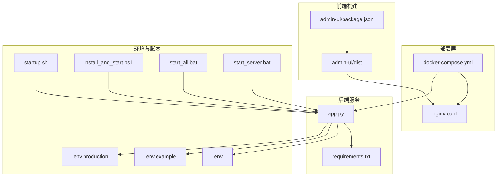
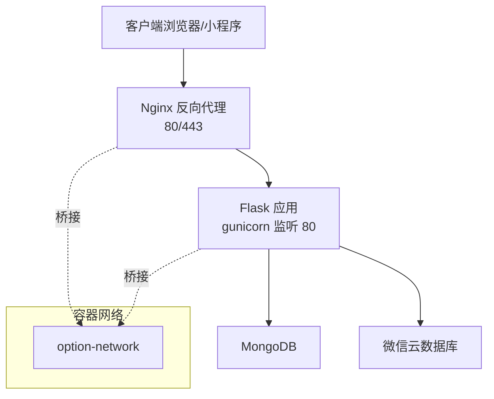
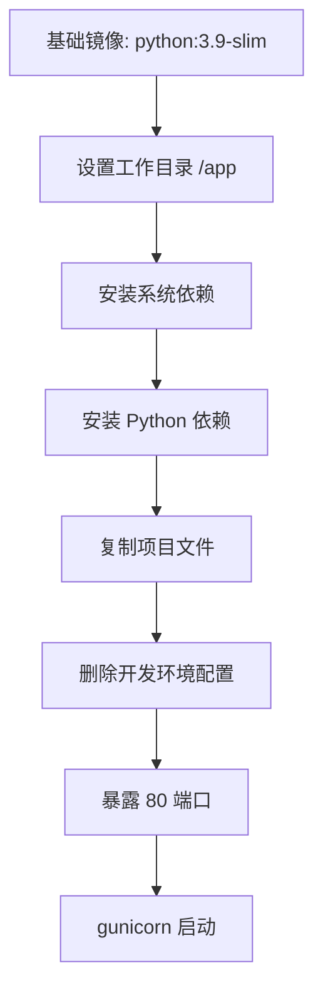
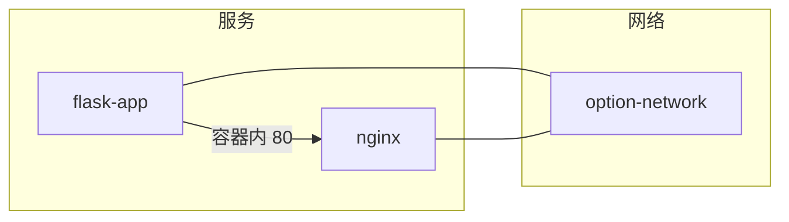
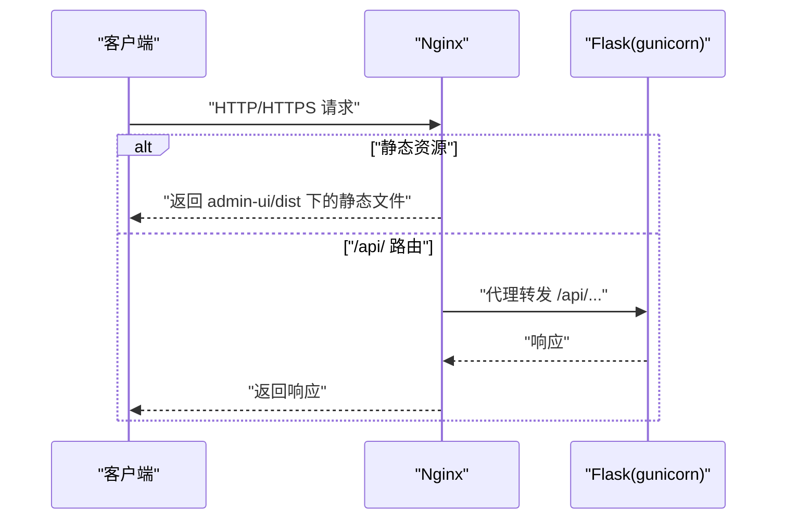
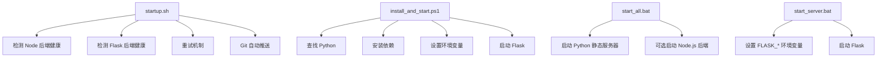
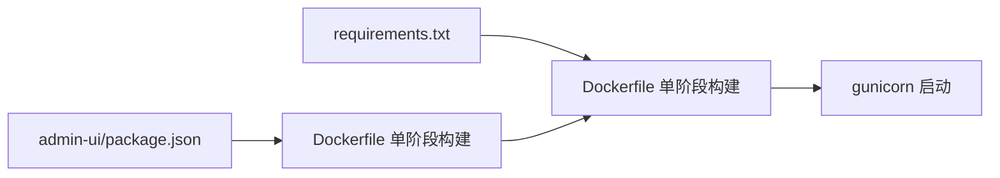

# 部署配置

<cite>
**本文引用的文件**
- [Dockerfile](file://Dockerfile)
- [docker-compose.yml](file://deploy/docker-compose.yml)
- [nginx.conf](file://deploy/nginx.conf)
- [README.md](file://deploy/README.md)
- [部署指南.md](file://deploy/部署指南.md)
- [.env](file://.env)
- [.env.example](file://.env.example)
- [.env.production](file://.env.production)
- [requirements.txt](file://requirements.txt)
- [app.py](file://app.py)
- [startup.sh](file://startup.sh)
- [install_and_start.ps1](file://install_and_start.ps1)
- [start_all.bat](file://start_all.bat)
- [start_server.bat](file://start_server.bat)
- [admin-ui/package.json](file://admin-ui/package.json)
- [admin-ui/vite.config.ts](file://admin-ui/vite.config.ts)
- [admin-ui/.env](file://admin-ui/.env)
</cite>

## 更新摘要
**变更内容**
- Dockerfile重大简化：从多阶段构建（Node.js前端构建 + Python后端）简化为单阶段构建（直接使用Python 3.9 slim）
- 移除了前端构建阶段，减少了构建复杂性和配置泄漏风险
- 更新了容器化部署架构说明，反映新的单阶段构建流程
- 调整了相关章节内容以反映新的部署模式

## 目录
1. [简介](#简介)
2. [项目结构](#项目结构)
3. [核心组件](#核心组件)
4. [架构总览](#架构总览)
5. [组件详解](#组件详解)
6. [依赖关系分析](#依赖关系分析)
7. [性能与可用性](#性能与可用性)
8. [故障排查指南](#故障排查指南)
9. [结论](#结论)
10. [附录](#附录)

## 简介
本文件面向生产与多环境部署，系统化说明场外期权交易系统的容器化部署与多环境配置，覆盖以下重点：
- Docker 单阶段构建：直接使用 Python 3.9 slim 镜像，简化构建流程
- Docker Compose 编排：服务依赖、网络与数据卷
- Nginx 反向代理：负载均衡、SSL 终止、静态资源缓存与路由转发
- 启动脚本：Windows 与 Linux 的不同部署方式
- 环境变量、端口映射与健康检查
- 生产环境最佳实践与安全配置

## 项目结构
围绕部署的关键目录与文件如下：
- 部署编排与配置：deploy 目录下的 docker-compose.yml、nginx.conf、README.md、部署指南.md
- 后端应用：app.py、requirements.txt
- 前端管理后台：admin-ui 下的 package.json、vite.config.ts、.env
- 环境变量：.env、.env.example、.env.production
- 启动脚本：startup.sh（Linux）、install_and_start.ps1（Windows）、start_all.bat、start_server.bat

**图表来源**
- [docker-compose.yml](file://deploy/docker-compose.yml#L1-L42)
- [nginx.conf](file://deploy/nginx.conf#L1-L61)
- [app.py](file://app.py#L1-L350)
- [requirements.txt](file://requirements.txt#L1-L12)
- [admin-ui/package.json](file://admin-ui/package.json#L1-L38)
- [.env](file://.env#L1-L32)
- [.env.example](file://.env.example#L1-L50)
- [.env.production](file://.env.production#L1-L53)
- [startup.sh](file://startup.sh#L1-L234)
- [install_and_start.ps1](file://install_and_start.ps1#L1-L156)
- [start_all.bat](file://start_all.bat#L1-L58)
- [start_server.bat](file://start_server.bat#L1-L21)

**章节来源**
- [docker-compose.yml](file://deploy/docker-compose.yml#L1-L42)
- [nginx.conf](file://deploy/nginx.conf#L1-L61)
- [app.py](file://app.py#L1-L350)
- [requirements.txt](file://requirements.txt#L1-L12)
- [admin-ui/package.json](file://admin-ui/package.json#L1-L38)
- [.env](file://.env#L1-L32)
- [.env.example](file://.env.example#L1-L50)
- [.env.production](file://.env.production#L1-L53)
- [startup.sh](file://startup.sh#L1-L234)
- [install_and_start.ps1](file://install_and_start.ps1#L1-L156)
- [start_all.bat](file://start_all.bat#L1-L58)
- [start_server.bat](file://start_server.bat#L1-L21)

## 核心组件
- **Docker 单阶段构建**：直接使用 python:3.9-slim 基础镜像，安装系统依赖和 Python 依赖，复制项目文件，暴露 80 端口并通过 gunicorn 启动
- **Docker Compose 编排**：定义 flask-app 与 nginx 两个服务，设置端口映射、环境变量、数据卷与网络
- **Nginx 反向代理**：80 强制跳转 443；443 提供 SSL 终止、静态资源缓存与 /api/ 路由转发至后端
- **启动脚本**：Linux 提供统一启动与健康检查、重试与 Git 自动推送；Windows 提供 PowerShell 一键安装与启动
- **环境变量**：.env、.env.example 与 .env.production 定义后端运行参数、安全密钥、数据库与微信云开发配置等

**章节来源**
- [Dockerfile](file://Dockerfile#L1-L38)
- [docker-compose.yml](file://deploy/docker-compose.yml#L1-L42)
- [nginx.conf](file://deploy/nginx.conf#L1-L61)
- [app.py](file://app.py#L1-L350)
- [.env](file://.env#L1-L32)
- [.env.example](file://.env.example#L1-L50)
- [.env.production](file://.env.production#L1-L53)
- [startup.sh](file://startup.sh#L1-L234)
- [install_and_start.ps1](file://install_and_start.ps1#L1-L156)

## 架构总览
系统采用"Nginx 反向代理 + Flask 后端 + React 管理后台"的三层架构。容器化通过 Docker 单阶段构建直接使用 Python 3.9 slim 镜像，简化了构建流程，再由 Compose 编排运行。

**图表来源**
- [docker-compose.yml](file://deploy/docker-compose.yml#L3-L41)
- [nginx.conf](file://deploy/nginx.conf#L1-L61)
- [app.py](file://app.py#L64-L88)

## 组件详解

### Docker 单阶段构建
**更新** Dockerfile 已从多阶段构建简化为单阶段构建，移除了前端构建阶段，直接使用 Python 3.9 slim 基础镜像。

- **基础镜像**：python:3.9-slim
- **工作目录**：/app
- **环境变量**：设置 PYTHONDONTWRITEBYTECODE、PYTHONUNBUFFERED、FLASK_APP、FLASK_ENV、NODE_ENV
- **系统依赖**：安装 build-essential、libxml2-dev、libxslt1-dev、zlib1g-dev
- **Python 依赖**：pip 安装 Flask、Flask-Cors、pymongo、requests、python-dotenv、gunicorn、PyJWT
- **项目复制**：复制整个项目目录
- **配置清理**：删除 .env 和 .env.local 开发环境配置文件
- **端口暴露**：80 端口
- **启动命令**：gunicorn --bind 0.0.0.0:80 --workers 1 --threads 4 --timeout 60 app:app

**图表来源**
- [Dockerfile](file://Dockerfile#L1-L38)

**章节来源**
- [Dockerfile](file://Dockerfile#L1-L38)

### Docker Compose 编排
- **flask-app 服务**
  - 构建上下文与 Dockerfile 指向根目录
  - 端口映射：5002:5002
  - 环境变量：NODE_ENV、FLASK_PORT、TZ
  - 数据卷：日志目录与生产环境变量文件挂载
  - 网络：加入 option-network
- **nginx 服务**
  - 基于 nginx:alpine
  - 端口映射：80:80、443:443
  - 数据卷：自定义 nginx.conf、admin-ui/dist、Let's Encrypt 证书目录、Nginx 日志目录
  - 依赖：先启动 flask-app 再启动自身
  - 网络：加入 option-network

**图表来源**
- [docker-compose.yml](file://deploy/docker-compose.yml#L3-L41)

**章节来源**
- [docker-compose.yml](file://deploy/docker-compose.yml#L1-L42)

### Nginx 反向代理配置
- **80 端口**：强制跳转到 https
- **443 端口**：SSL 终止（证书路径占位，需按实际替换）
- **静态资源**：指向 admin-ui/dist，支持 React Router 的 index.html 回退
- **API 路由**：/api/ 转发到 flask-app（容器内 80），设置必要的头部与超时
- **缓存策略**：/assets/ 静态资源一年缓存

**图表来源**
- [nginx.conf](file://deploy/nginx.conf#L1-L61)

**章节来源**
- [nginx.conf](file://deploy/nginx.conf#L1-L61)

### 环境变量与端口映射
- **环境变量**
  - .env：开发/本地默认值，含 JWT、管理员账号、前端代理、微信云配置等
  - .env.example：生产环境示例，含跨域、安全、缓存、日志、数据库、微信云配置、限流等
  - .env.production：生产环境专用配置，包含安全密钥、数据库连接、微信云配置等
  - app.py：按顺序加载 .env.local、系统 NODE_ENV 为 production 时的 .env.production，否则回退到 .env 或默认
- **端口映射**
  - Compose：nginx 映射 80/443；flask-app 映射 5002:5002（容器内 80）
  - app.py：resolve_port 优先 FLASK_PORT 或 PORT，默认 5002；开发模式下若端口小于 1024 且未显式允许，则回退为 5000

**章节来源**
- [.env](file://.env#L1-L32)
- [.env.example](file://.env.example#L1-L50)
- [.env.production](file://.env.production#L1-L53)
- [app.py](file://app.py#L90-L100)

### 启动脚本使用指南
- **Linux（startup.sh）**
  - 支持启动 Node/Flask 后端、健康检查、重试、Git 自动推送
  - 可通过环境变量控制启动开关、端口、重试次数与延迟
- **Windows（PowerShell）**
  - install_and_start.ps1：查找 Python、安装依赖、设置环境变量、清理端口占用、启动 Flask
- **Windows（批处理）**
  - start_all.bat：启动 Python 静态服务器与 Node.js 后端（可选）
  - start_server.bat：设置 FLASK_* 环境变量并启动 Flask

**图表来源**
- [startup.sh](file://startup.sh#L1-L234)
- [install_and_start.ps1](file://install_and_start.ps1#L1-L156)
- [start_all.bat](file://start_all.bat#L1-L58)
- [start_server.bat](file://start_server.bat#L1-L21)

**章节来源**
- [startup.sh](file://startup.sh#L1-L234)
- [install_and_start.ps1](file://install_and_start.ps1#L1-L156)
- [start_all.bat](file://start_all.bat#L1-L58)
- [start_server.bat](file://start_server.bat#L1-L21)

### 健康检查与日志
- **Flask 健康检查**：/api/v1/health 返回服务状态、数据库连接状态与环境信息
- **日志**：Flask 写入 server.log；Nginx 访问/错误日志；Systemd（部署指南）示例中 systemd 服务日志与应用日志文件
- **Compose**：flask-app 暴露日志目录到宿主机

**章节来源**
- [app.py](file://app.py#L185-L197)
- [deploy/部署指南.md](file://deploy/部署指南.md#L284-L312)
- [docker-compose.yml](file://deploy/docker-compose.yml#L16-L18)

## 依赖关系分析
- **前端依赖**：admin-ui/package.json 定义 React、Ant Design、Axios、React Router 等
- **后端依赖**：requirements.txt 定义 Flask、Flask-CORS、PyMongo、pandas、openpyxl、akshare、requests、python-dotenv、gunicorn、lxml、PyJWT 等
- **构建链路**：Dockerfile 单阶段构建 → 直接复制项目文件 → gunicorn 启动

**图表来源**
- [admin-ui/package.json](file://admin-ui/package.json#L1-L38)
- [requirements.txt](file://requirements.txt#L1-L12)
- [Dockerfile](file://Dockerfile#L1-L38)

**章节来源**
- [admin-ui/package.json](file://admin-ui/package.json#L1-L38)
- [requirements.txt](file://requirements.txt#L1-L12)
- [Dockerfile](file://Dockerfile#L1-L38)

## 性能与可用性
- **Nginx 超时**：/api/ 路由设置较长的 proxy_read_timeout 与 proxy_connect_timeout，适合长查询场景
- **静态资源缓存**：/assets/ 一年缓存，减少带宽与服务器压力
- **SSL 优化**：TLSv1.2/1.3、优选服务端密码套件
- **后端并发**：gunicorn workers 与 threads 参数已在 Dockerfile 中配置为 1 个 worker 和 4 个 threads
- **健康检查**：/api/v1/health 可作为 Kubernetes/Compose 健康探针使用

**章节来源**
- [nginx.conf](file://deploy/nginx.conf#L50-L53)
- [nginx.conf](file://deploy/nginx.conf#L20-L24)
- [Dockerfile](file://Dockerfile#L36-L38)

## 故障排查指南
- **API 跨域问题**：检查 Nginx 是否添加 CORS 头（参考部署指南中的 CORS 示例）
- **MongoDB 连接失败**：检查 mongod 服务状态与日志，必要时重启
- **SSL 证书获取失败**：检查域名解析、80 端口开放与手动获取证书
- **端口占用**：Windows 脚本会尝试关闭占用端口 5002；Linux 可使用 netstat/ss 检查
- **健康检查**：通过 https://api.your-domain.com/health 验证服务状态

**章节来源**
- [deploy/部署指南.md](file://deploy/部署指南.md#L318-L352)
- [app.py](file://app.py#L185-L197)

## 结论
本部署方案通过 Docker 单阶段构建直接使用 Python 3.9 slim 镜像，简化了构建流程，减少了构建复杂性和配置泄漏风险；配合 Compose 实现快速编排；Nginx 提供 SSL 终止、静态资源缓存与 API 转发；配套的启动脚本与环境变量配置满足多环境需求。生产部署建议严格替换 SSL 证书路径、补齐 .env.production、启用数据库与微信云配置，并结合健康检查与日志监控保障稳定运行。

## 附录

### 环境变量清单（摘要）
- **安全与认证**
  - JWT_SECRET、JWT_EXPIRES_SECONDS、ADMIN_JWT_SECRET
- **应用与端口**
  - NODE_ENV、FLASK_PORT、PORT
- **数据库**
  - MONGO_URI、DATABASE_NAME
- **微信云开发**
  - WX_APPID、WX_SECRET、WX_CLOUD_ENV、WX_VERIFY_SSL
- **跨域与日志**
  - ALLOWED_ORIGINS、LOG_LEVEL、LOG_FILE
- **其他**
  - FILE_DB_PATH、VITE_PROXY_MODE、VITE_API_PROXY_TARGET

**章节来源**
- [.env](file://.env#L1-L32)
- [.env.example](file://.env.example#L1-L50)
- [.env.production](file://.env.production#L1-L53)

### 端口与卷映射
- **端口**
  - nginx: 80、443
  - flask-app: 5002:5002（容器内 80）
- **数据卷**
  - 日志目录映射
  - 生产环境变量文件映射
  - Nginx 配置与证书目录映射
  - 前端构建产物目录映射

**章节来源**
- [docker-compose.yml](file://deploy/docker-compose.yml#L10-L37)

### 健康检查与验证
- **健康检查端点**：/api/v1/health
- **部署验证**：参考部署指南中的 curl 测试与小程序真机测试步骤

**章节来源**
- [app.py](file://app.py#L185-L197)
- [deploy/部署指南.md](file://deploy/部署指南.md#L250-L280)