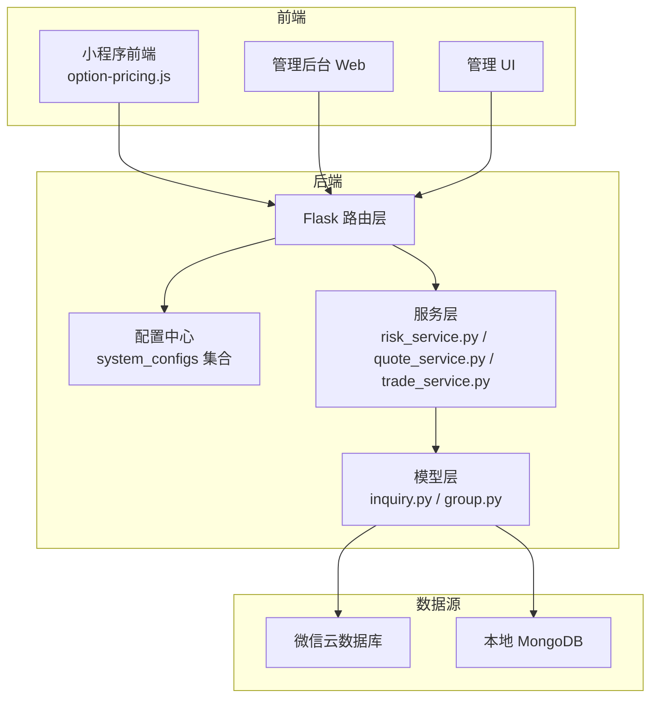
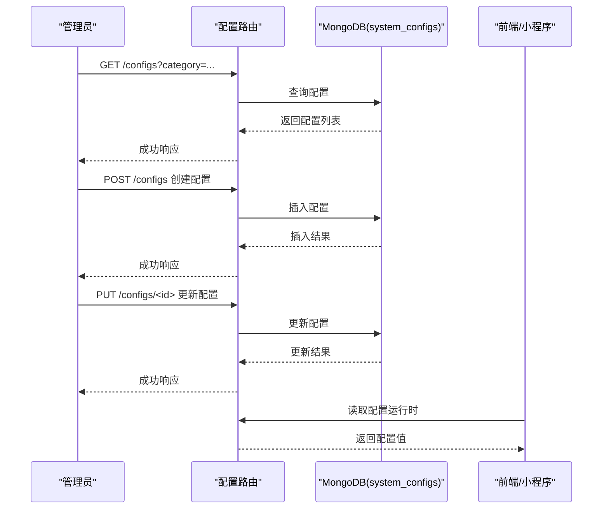
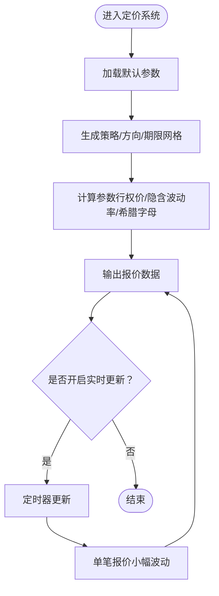
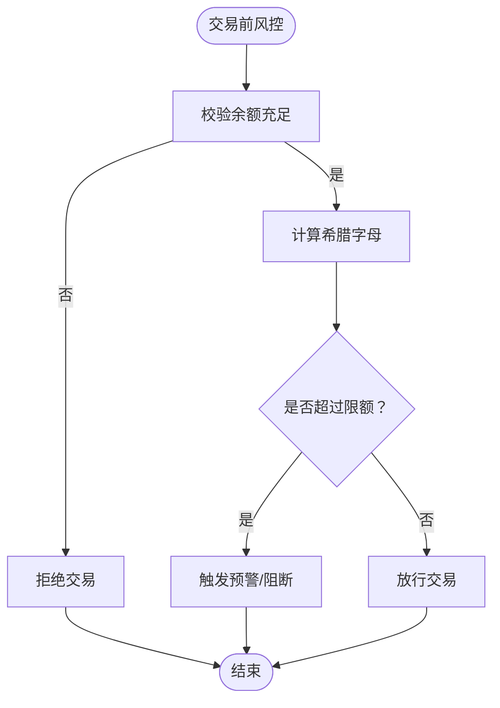
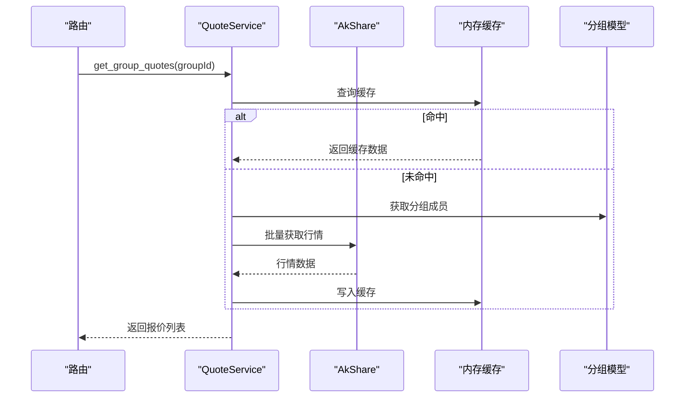
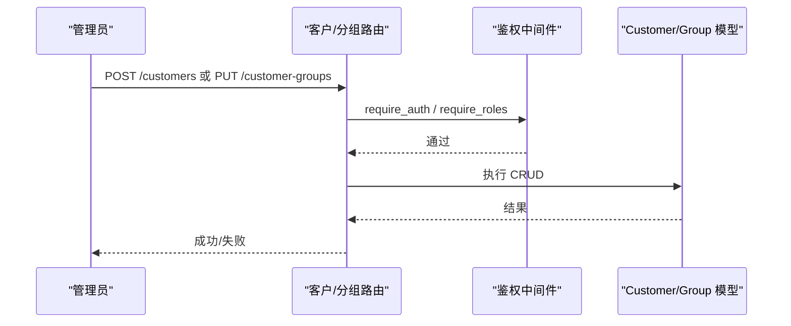
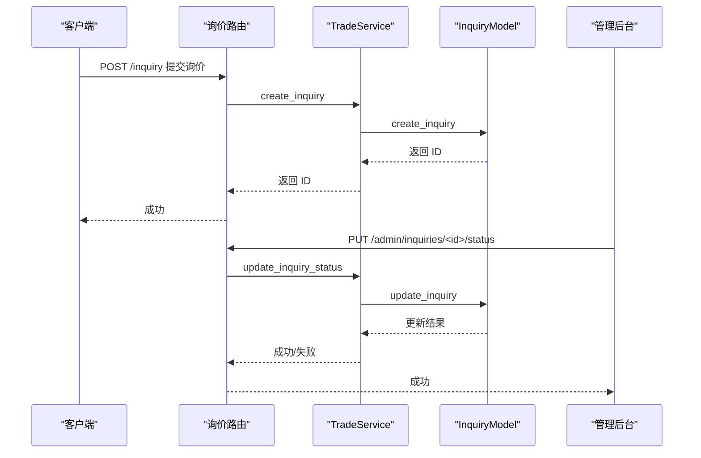
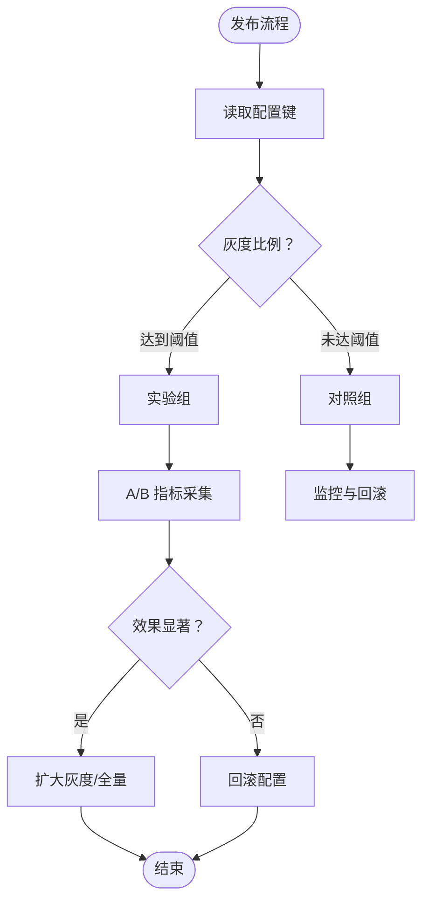
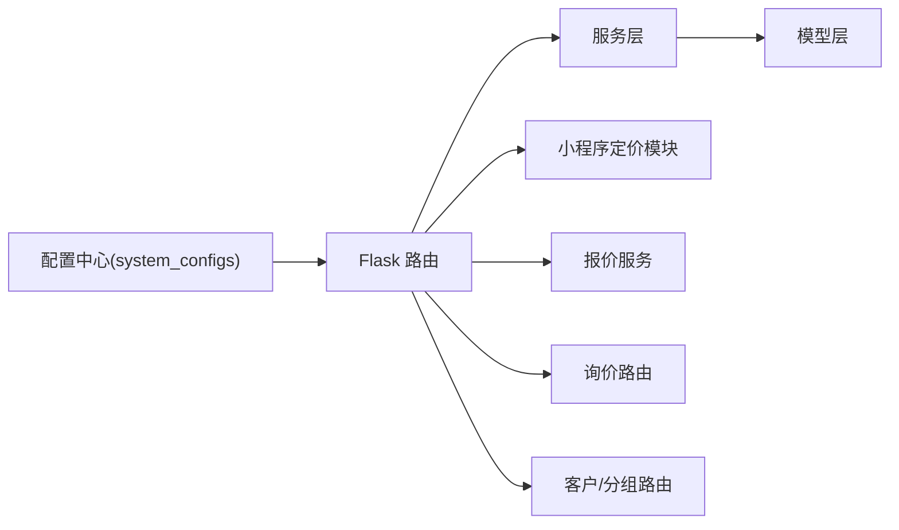

# 功能配置

<cite>
**本文引用的文件**
- [config.py](file://config.py)
- [option-pricing.js](file://backend_utils/option-pricing.js)
- [risk_service.py](file://services/risk_service.py)
- [quote_service.py](file://services/quote_service.py)
- [config.py（路由）](file://routes/config.py)
- [inquiry.py（路由）](file://routes/inquiry.py)
- [customer.py（路由）](file://routes/customer.py)
- [group.py（路由）](file://routes/group.py)
- [inquiry.py（模型）](file://models/inquiry.py)
- [group.py（模型）](file://models/group.py)
- [trade_service.py](file://services/trade_service.py)
- [dataImporter\config.json](file://cloudfunctions/dataImporter/config.json)
</cite>

## 目录
1. [简介](#简介)
2. [项目结构](#项目结构)
3. [核心组件](#核心组件)
4. [架构总览](#架构总览)
5. [详细组件分析](#详细组件分析)
6. [依赖关系分析](#依赖关系分析)
7. [性能考量](#性能考量)
8. [故障排查指南](#故障排查指南)
9. [结论](#结论)
10. [附录](#附录)

## 简介
本文件面向场外期权交易系统的功能配置，围绕以下目标展开：
- 期权定价功能：定价模型选择、参数调整与精度设置
- 风险控制功能：风险限额、阈值与预警机制
- 报价服务：数据源选择、更新频率与缓存策略
- 客户管理：权限级别、分组规则与访问控制
- 询价处理：自动处理、人工审核与批量操作
- 功能开关与动态配置：A/B测试与灰度发布
- 配置版本管理、回滚与审计

## 项目结构
系统采用前后端分离与多数据源架构：
- 后端基于 Flask，提供 REST API；配置通过环境变量与数据库“system_configs”集合进行集中管理
- 前端包含管理后台 Web（admin-web）、管理 UI（admin-ui）、小程序（miniprogram）等
- 数据源支持微信云数据库与本地 MongoDB，支持混合模式
- 关键功能模块：期权定价（小程序侧）、报价服务、询价与订单、风控、客户与分组管理、交易账户与资金

**图表来源**
- [config.py](file://config.py#L22-L63)
- [config.py（路由）](file://routes/config.py#L13-L43)
- [option-pricing.js](file://backend_utils/option-pricing.js#L6-L343)
- [quote_service.py](file://services/quote_service.py#L9-L109)
- [risk_service.py](file://services/risk_service.py#L7-L60)
- [trade_service.py](file://services/trade_service.py#L8-L318)

**章节来源**
- [config.py](file://config.py#L22-L63)

## 核心组件
- 配置中心：通过“system_configs”集合存储系统配置键值对，支持分类与描述，提供查询、创建、更新接口
- 期权定价系统：小程序侧报价核心，支持策略/方向/期限组合、参数随机扰动、实时更新与回调
- 报价服务：按分组批量获取股票行情，内置缓存与降级策略
- 风控服务：Black-Scholes希腊字母计算与交易前风控校验
- 询价与交易服务：封装询价、订单、持仓、账户与资金流水的业务流程
- 客户与分组：客户信息、分组管理与权限控制
- 云函数：定时任务触发数据导入

**章节来源**
- [config.py（路由）](file://routes/config.py#L13-L118)
- [option-pricing.js](file://backend_utils/option-pricing.js#L6-L343)
- [quote_service.py](file://services/quote_service.py#L9-L109)
- [risk_service.py](file://services/risk_service.py#L7-L60)
- [trade_service.py](file://services/trade_service.py#L8-L318)
- [customer.py（路由）](file://routes/customer.py#L26-L217)
- [group.py（路由）](file://routes/group.py#L42-L269)
- [inquiry.py（路由）](file://routes/inquiry.py#L11-L175)
- [dataImporter\config.json](file://cloudfunctions/dataImporter/config.json#L1-L13)

## 架构总览
系统通过“配置中心”实现功能开关与参数化，结合多数据源与服务层解耦，支撑报价、风控、客户与询价等核心能力。

**图表来源**
- [config.py（路由）](file://routes/config.py#L13-L118)

## 详细组件分析

### 期权定价功能配置
- 定价模型与参数
  - 支持策略类型：如“香草/雪球”等组合
  - 方向类型：看涨/看跌
  - 到期期限：1个月/3个月/6个月/12个月
  - 参数来源：当前股价、市场情绪、随机扰动
  - 精度设置：数值保留位数统一处理
- 实时报价与回调
  - 定时更新与单笔报价更新
  - WebSocket模拟连接，高频小幅波动
- 配置入口
  - 通过“配置中心”集中管理定价相关参数（如策略开关、波动率因子、情绪系数等）

**图表来源**
- [option-pricing.js](file://backend_utils/option-pricing.js#L16-L170)
- [option-pricing.js](file://backend_utils/option-pricing.js#L280-L317)

**章节来源**
- [option-pricing.js](file://backend_utils/option-pricing.js#L6-L343)

### 风险控制功能配置
- 黑箱模型与希腊字母
  - 计算 Delta/Gamma/Theta/Vega/Rho
  - 输入参数：标的价格、行权价、到期时间、无风险利率、波动率
- 交易前风控
  - 余额校验与限额检查（预留扩展点）
- 配置入口
  - 通过“配置中心”管理风控阈值、限额参数与预警策略

**图表来源**
- [risk_service.py](file://services/risk_service.py#L11-L60)

**章节来源**
- [risk_service.py](file://services/risk_service.py#L7-L60)

### 报价服务功能配置
- 数据源选择
  - 支持 AkShare 批量获取与逐个回退
  - 分组内成员批量行情拉取
- 更新频率与缓存
  - TTL 默认 60 秒
  - 缓存命中直接返回，未命中刷新并写入缓存
- 配置入口
  - 通过“配置中心”管理数据源开关、缓存 TTL、批量并发策略

**图表来源**
- [quote_service.py](file://services/quote_service.py#L28-L109)
- [group.py（模型）](file://models/group.py#L52-L108)

**章节来源**
- [quote_service.py](file://services/quote_service.py#L9-L109)
- [group.py（模型）](file://models/group.py#L10-L283)

### 客户管理功能配置
- 权限级别与访问控制
  - require_auth 与 require_roles 组合，支持 admin/editor 等角色
  - 分组保护：系统保留名称不可改名/删除
- 分组规则
  - 分组创建者限制、成员增删权限校验
  - 系统保护分组仅管理员可见/操作
- 配置入口
  - 通过“配置中心”管理权限策略、分组白名单与访问策略

**图表来源**
- [customer.py（路由）](file://routes/customer.py#L102-L217)
- [group.py（路由）](file://routes/group.py#L42-L269)

**章节来源**
- [customer.py（路由）](file://routes/customer.py#L26-L217)
- [group.py（路由）](file://routes/group.py#L8-L269)
- [group.py（模型）](file://models/group.py#L10-L283)

### 询价处理功能配置
- 自动处理与人工审核
  - 状态流转：pending/processing/completed/rejected
  - 管理后台可批量更新与导出
- 批量操作
  - 批量更新状态、导出 Excel
- 配置入口
  - 通过“配置中心”管理状态机、审核策略与导出范围

**图表来源**
- [inquiry.py（路由）](file://routes/inquiry.py#L11-L175)
- [trade_service.py](file://services/trade_service.py#L38-L94)
- [inquiry.py（模型）](file://models/inquiry.py#L32-L148)

**章节来源**
- [inquiry.py（路由）](file://routes/inquiry.py#L36-L175)
- [trade_service.py](file://services/trade_service.py#L36-L94)
- [inquiry.py（模型）](file://models/inquiry.py#L10-L148)

### 功能开关、A/B 测试与灰度发布
- 功能开关
  - 通过“配置中心”集中管理开关键，前端/后端按需读取
- A/B 测试
  - 通过配置键区分实验组与对照组，结合埋点与指标评估
- 灰度发布
  - 通过配置键控制流量比例，逐步扩大发布范围
- 云函数定时任务
  - dataImporter 定时触发，配合配置键控制导入策略

**图表来源**
- [config.py（路由）](file://routes/config.py#L13-L118)
- [dataImporter\config.json](file://cloudfunctions/dataImporter/config.json#L5-L12)

**章节来源**
- [config.py（路由）](file://routes/config.py#L13-L118)
- [dataImporter\config.json](file://cloudfunctions/dataImporter/config.json#L1-L13)

### 配置版本管理、回滚与审计
- 版本管理
  - system_configs 集合记录 createdAt/updatedAt，便于追踪变更
- 回滚机制
  - 建议：在“配置中心”增加“历史版本”与“一键回滚”能力（当前路由未实现，可在模型层扩展）
- 审计功能
  - 路由层记录错误日志与异常堆栈，便于审计与定位

**章节来源**
- [config.py（路由）](file://routes/config.py#L13-L118)

## 依赖关系分析
- 配置中心依赖 MongoDB 集合 system_configs
- 报价服务依赖 AkShare 与分组模型
- 询价与交易服务依赖询价/订单/持仓模型
- 客户与分组路由依赖鉴权中间件与模型层
- 期权定价系统为小程序侧独立模块，不依赖后端服务

**图表来源**
- [config.py（路由）](file://routes/config.py#L13-L118)
- [quote_service.py](file://services/quote_service.py#L9-L109)
- [trade_service.py](file://services/trade_service.py#L8-L318)
- [inquiry.py（路由）](file://routes/inquiry.py#L11-L175)
- [customer.py（路由）](file://routes/customer.py#L26-L217)
- [option-pricing.js](file://backend_utils/option-pricing.js#L6-L343)

**章节来源**
- [config.py（路由）](file://routes/config.py#L13-L118)
- [quote_service.py](file://services/quote_service.py#L9-L109)
- [trade_service.py](file://services/trade_service.py#L8-L318)
- [inquiry.py（路由）](file://routes/inquiry.py#L11-L175)
- [customer.py（路由）](file://routes/customer.py#L26-L217)
- [option-pricing.js](file://backend_utils/option-pricing.js#L6-L343)

## 性能考量
- 报价服务
  - 批量获取行情减少多次请求
  - 内存缓存降低重复查询压力
- 询价处理
  - 管理后台批量更新建议改为服务端批量操作以减少往返
- 风控计算
  - 希腊字母计算为纯数学运算，注意输入参数边界与精度
- 配置中心
  - 建议对热点配置键增加本地缓存与失效策略

[本节为通用指导，无需列出具体文件来源]

## 故障排查指南
- 配置中心
  - 未连接数据库：检查 db/cloud_db 注入与连接状态
  - 缺少必填字段：确认 key/value/category 存在
- 报价服务
  - AkShare 获取失败：检查网络与接口可用性，回退至逐个获取
  - 缓存未命中：检查 TTL 与缓存键构造
- 询价处理
  - 状态更新失败：检查权限与状态机合法性
  - 导出失败：检查数据格式与 Excel 写入
- 客户/分组
  - 权限不足：确认 require_auth 与角色要求
  - 保护分组操作：禁止对系统保留名称进行改名/删除

**章节来源**
- [config.py（路由）](file://routes/config.py#L13-L118)
- [quote_service.py](file://services/quote_service.py#L56-L108)
- [inquiry.py（路由）](file://routes/inquiry.py#L60-L175)
- [customer.py（路由）](file://routes/customer.py#L102-L217)
- [group.py（路由）](file://routes/group.py#L108-L269)

## 结论
本系统通过“配置中心”实现了对定价、风控、报价、客户与询价等核心功能的参数化与动态化管理。建议在现有基础上补充：
- 配置历史与回滚能力
- 服务端批量更新与导出优化
- 小程序侧配置热更新与灰度控制
- 风控限额与阈值的可视化配置界面

[本节为总结性内容，无需列出具体文件来源]

## 附录
- 环境变量与数据源模式
  - 支持环境：development/production/testing，默认 development
  - 数据源模式：cloud/local/hybrid
- 配置键建议
  - 定价：策略开关、波动率因子、情绪系数、精度位数
  - 风控：日累计限额、单笔限额、超限预警阈值
  - 报价：AkShare开关、批量并发、缓存TTL
  - 客户/分组：权限角色映射、保护分组白名单
  - 询价：状态机定义、导出范围、审核时效

**章节来源**
- [config.py](file://config.py#L22-L63)
- [config.py（路由）](file://routes/config.py#L13-L118)