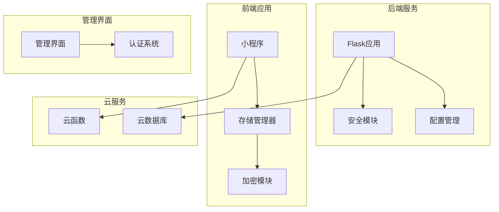
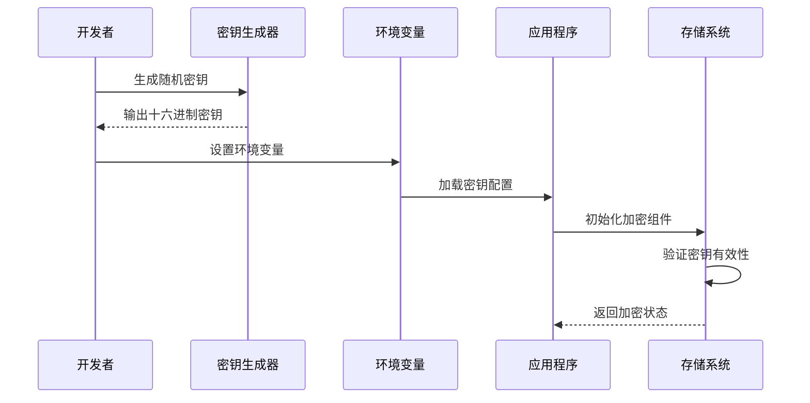
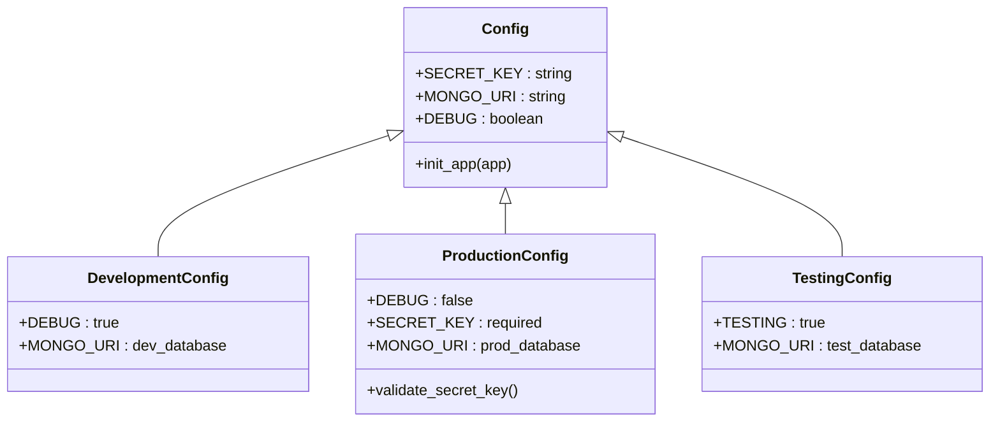
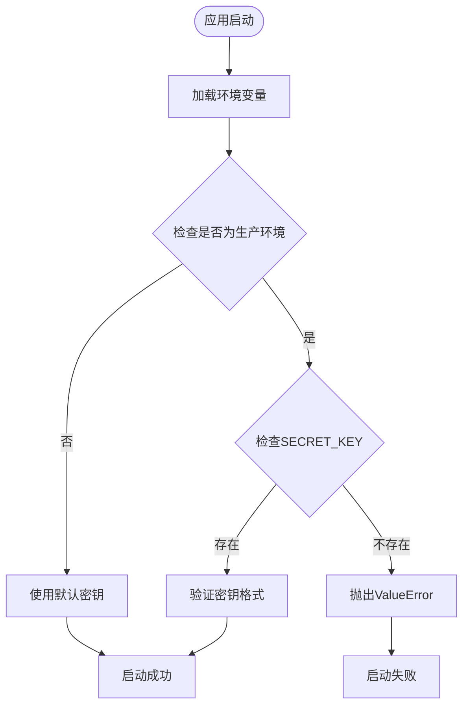
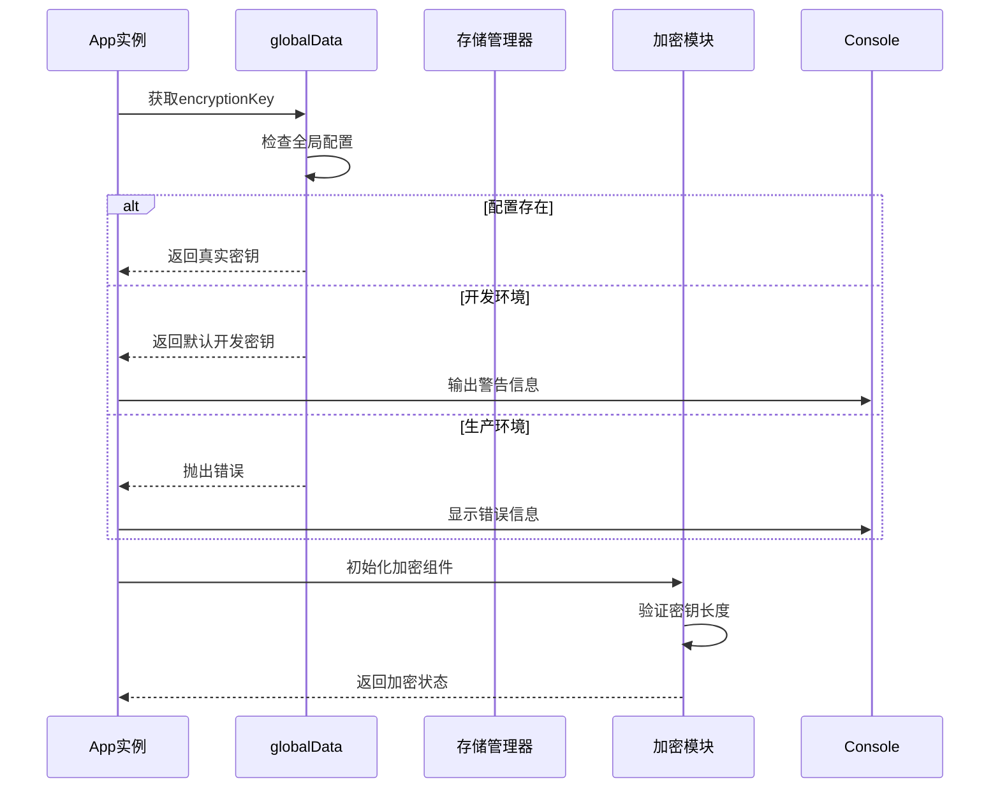
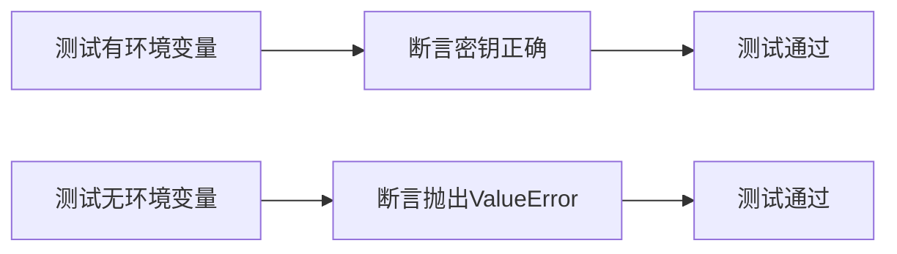
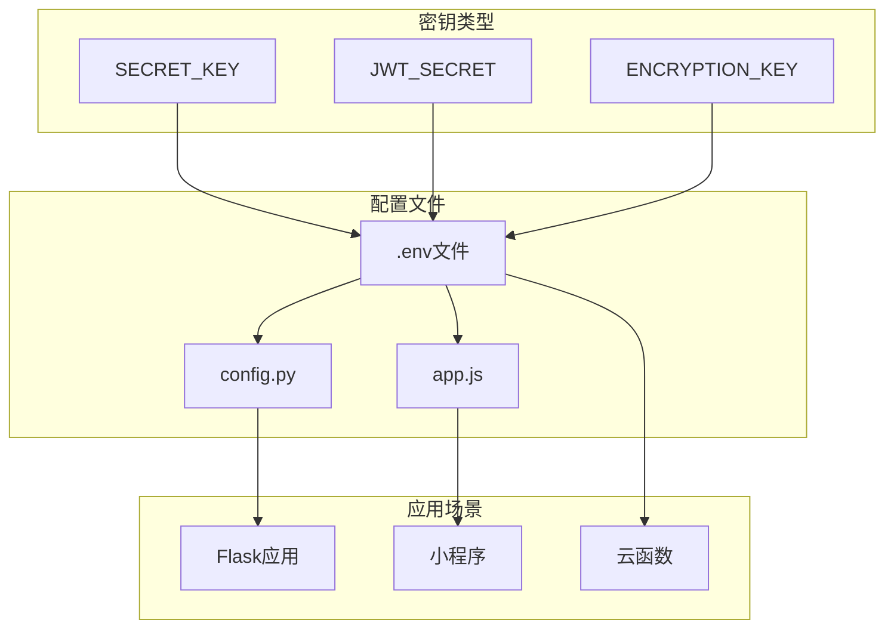

# 加密密钥配置指南

<cite>
**本文档引用的文件**
- [config.py](file://config.py)
- [tests/test_security_config.py](file://tests/test_security_config.py)
- [docs/ENCRYPTION_KEY_SETUP.md](file://docs/ENCRYPTION_KEY_SETUP.md)
- [miniprogram/app.js](file://miniprogram/app.js)
- [miniprogram/utils/storage-manager.js](file://miniprogram/utils/storage-manager.js)
- [generate_keys.py](file://generate_keys.py)
- [.env](file://.env)
- [backend_utils/security.py](file://backend_utils/security.py)
</cite>

## 目录
1. [简介](#简介)
2. [项目结构](#项目结构)
3. [核心组件](#核心组件)
4. [架构概览](#架构概览)
5. [详细组件分析](#详细组件分析)
6. [依赖关系分析](#依赖关系分析)
7. [性能考虑](#性能考虑)
8. [故障排除指南](#故障排除指南)
9. [结论](#结论)

## 简介

本指南详细介绍了该期权交易系统的加密密钥配置体系，包括后端Flask应用的SECRET_KEY配置和前端小程序的加密密钥管理。系统实现了AES-256-CBC数据加密，替代了之前的base64编码方案，确保敏感数据的安全传输和存储。

## 项目结构

该项目采用多层架构设计，包含后端Web服务、小程序前端、管理界面等多个组件：

**图表来源**
- [config.py:1-132](file://config.py#L1-L132)
- [miniprogram/app.js:1-381](file://miniprogram/app.js#L1-L381)

## 核心组件

### 后端配置管理

系统使用Python的Flask框架，通过配置类管理不同环境的密钥设置：

- **开发环境**：允许使用默认密钥进行开发测试
- **生产环境**：强制要求设置SECRET_KEY，否则启动失败
- **测试环境**：使用独立的测试配置

### 前端加密管理

小程序端实现了完整的加密密钥管理系统：

- **密钥生成**：支持多种生成方式（Node.js、OpenSSL、Python）
- **密钥存储**：支持环境变量和配置文件两种存储方式
- **密钥轮换**：提供平滑迁移机制

**章节来源**
- [config.py:32-112](file://config.py#L32-L112)
- [miniprogram/app.js:25-28](file://miniprogram/app.js#L25-L28)

## 架构概览

系统采用分层安全架构，确保密钥在不同层级的有效管理和使用：

**图表来源**
- [generate_keys.py:1-7](file://generate_keys.py#L1-L7)
- [config.py:108-112](file://config.py#L108-L112)

## 详细组件分析

### 后端Flask密钥配置

#### 配置类层次结构

**图表来源**
- [config.py:22-132](file://config.py#L22-L132)

#### 生产环境密钥验证流程

**图表来源**
- [config.py:103-112](file://config.py#L103-L112)
- [tests/test_security_config.py:12-31](file://tests/test_security_config.py#L12-L31)

**章节来源**
- [config.py:103-112](file://config.py#L103-L112)
- [tests/test_security_config.py:11-35](file://tests/test_security_config.py#L11-L35)

### 小程序加密密钥管理

#### 密钥获取流程

**图表来源**
- [miniprogram/app.js:25-28](file://miniprogram/app.js#L25-L28)
- [miniprogram/utils/storage-manager.js:756-774](file://miniprogram/utils/storage-manager.js#L756-L774)

#### 加密实现细节

系统实现了多层次的加密回退机制：

1. **原生API优先**：使用微信原生crypto API进行加密
2. **自定义实现**：基于XOR和PKCS7填充的加密实现
3. **降级处理**：当所有加密方式失败时使用base64编码

**章节来源**
- [miniprogram/utils/storage-manager.js:756-807](file://miniprogram/utils/storage-manager.js#L756-L807)
- [docs/ENCRYPTION_KEY_SETUP.md:156-176](file://docs/ENCRYPTION_KEY_SETUP.md#L156-L176)

### 安全配置测试

#### 测试用例设计

**图表来源**
- [tests/test_security_config.py:12-31](file://tests/test_security_config.py#L12-L31)

**章节来源**
- [tests/test_security_config.py:1-38](file://tests/test_security_config.py#L1-L38)

## 依赖关系分析

### 环境变量依赖图

**图表来源**
- [.env:8-11](file://.env#L8-L11)
- [config.py:32-43](file://config.py#L32-L43)
- [miniprogram/app.js:25-28](file://miniprogram/app.js#L25-L28)

### 密钥生成工具链

系统提供了多种密钥生成方式：

| 生成方式 | 命令示例 | 输出格式 | 适用场景 |
|---------|---------|---------|---------|
| Node.js | `node -e "console.log(require('crypto').randomBytes(32).toString('hex'))"` | 64位十六进制 | 推荐方式 |
| OpenSSL | `openssl rand -hex 32` | 64位十六进制 | 云环境 |
| Python | `import secrets print(secrets.token_hex(32))` | 64位十六进制 | 开发环境 |
| 内置脚本 | `python generate_keys.py` | 生成随机密钥 | 自动化部署 |

**章节来源**
- [docs/ENCRYPTION_KEY_SETUP.md:25-48](file://docs/ENCRYPTION_KEY_SETUP.md#L25-L48)
- [generate_keys.py:1-7](file://generate_keys.py#L1-L7)

## 性能考虑

### 密钥管理性能优化

1. **延迟加载**：密钥在首次使用时才进行验证
2. **缓存机制**：验证通过的密钥会被缓存，避免重复验证
3. **异步处理**：密钥获取过程采用异步方式，不影响应用启动速度

### 加密性能影响

- **AES-256-CBC**：提供强加密但有一定性能开销
- **原生API优先**：利用硬件加速，性能最优
- **回退机制**：仅在极端情况下使用，对正常操作无影响

## 故障排除指南

### 常见问题及解决方案

#### 后端启动失败

**问题**：生产环境启动时报错，提示未设置SECRET_KEY

**原因**：生产环境配置要求必须设置SECRET_KEY环境变量

**解决方案**：
1. 检查`.env`文件中是否设置了`SECRET_KEY`
2. 确认环境变量已正确加载
3. 验证密钥格式为64位十六进制字符串

#### 小程序启动异常

**问题**：小程序启动时报错，提示未配置加密密钥

**原因**：生产环境中未正确配置`encryptionKey`

**解决方案**：
1. 在`miniprogram/app.js`中设置真实的32字节密钥
2. 确保密钥长度为32字节（64位十六进制字符）
3. 验证密钥格式正确

#### 密钥轮换问题

**问题**：密钥轮换后旧数据无法解密

**解决方案**：
1. 实施双密钥机制，同时支持新旧密钥
2. 逐步迁移历史数据到新密钥
3. 使用deprecated数组保存历史密钥

**章节来源**
- [docs/ENCRYPTION_KEY_SETUP.md:232-261](file://docs/ENCRYPTION_KEY_SETUP.md#L232-L261)
- [config.py:108-112](file://config.py#L108-L112)

## 结论

该加密密钥配置体系提供了完整的企业级安全解决方案：

1. **多层次防护**：后端和前端双重密钥管理
2. **灵活部署**：支持多种密钥存储方式
3. **安全审计**：完整的密钥使用记录和验证机制
4. **平滑迁移**：完善的密钥轮换和回退机制

建议在生产环境中：
- 使用强随机密钥，长度至少32字节
- 实施定期密钥轮换策略
- 建立密钥备份和应急响应机制
- 定期进行安全审计和漏洞评估

通过遵循本指南的配置要求，可以确保系统的数据安全和合规性，为用户提供可靠的服务保障。