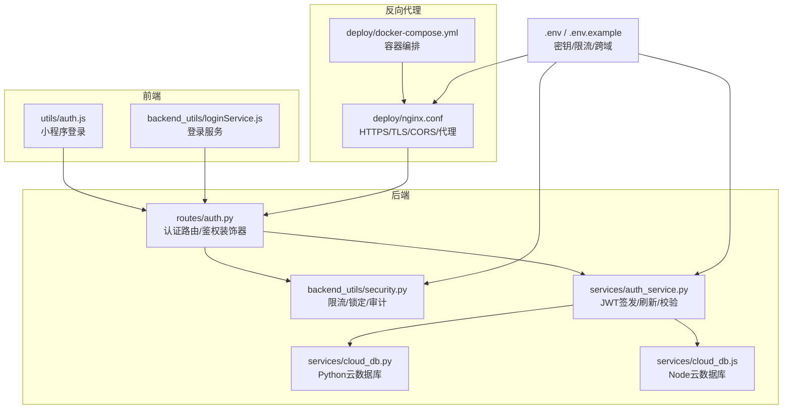
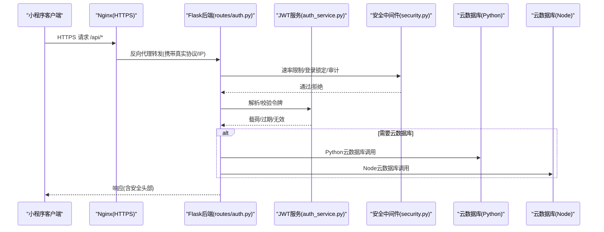
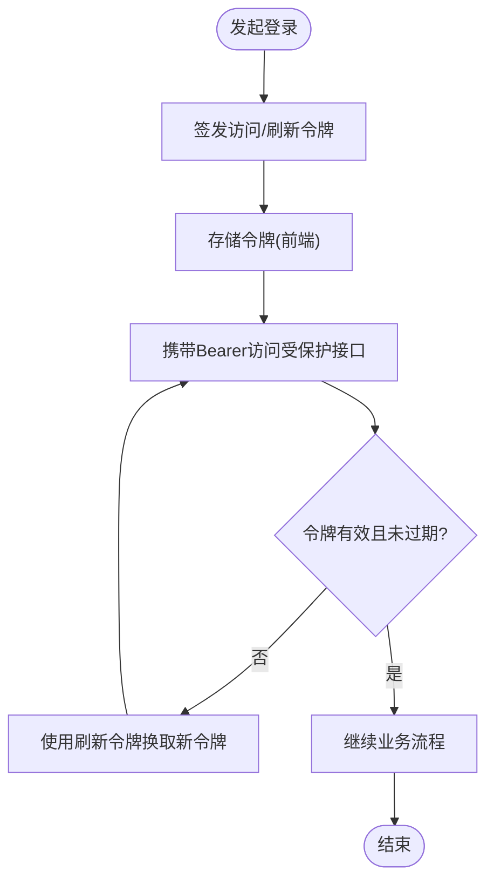
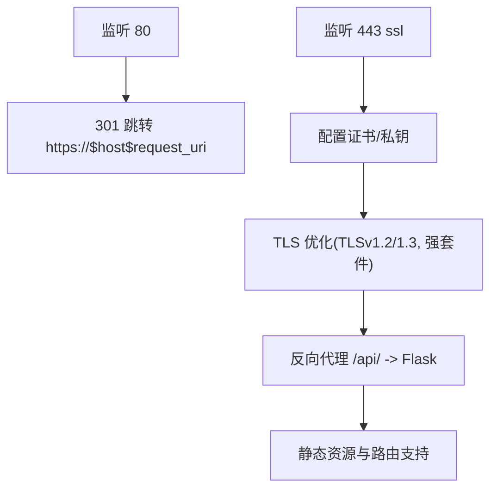
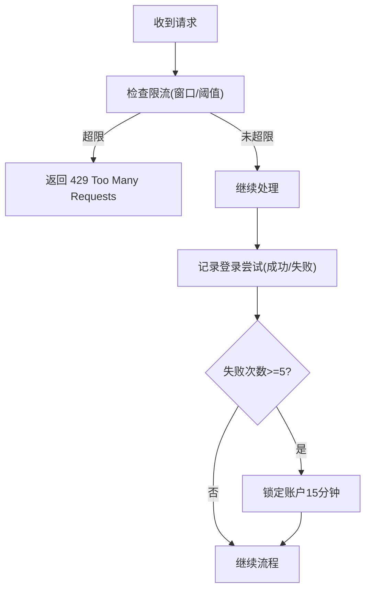
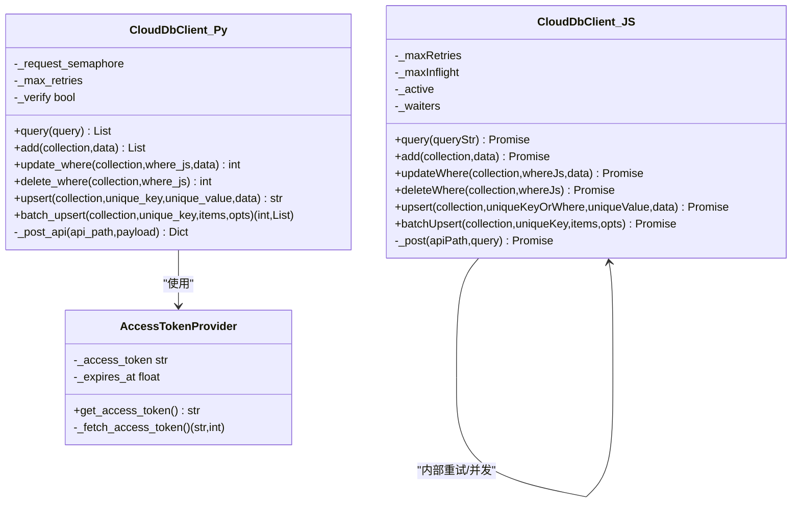
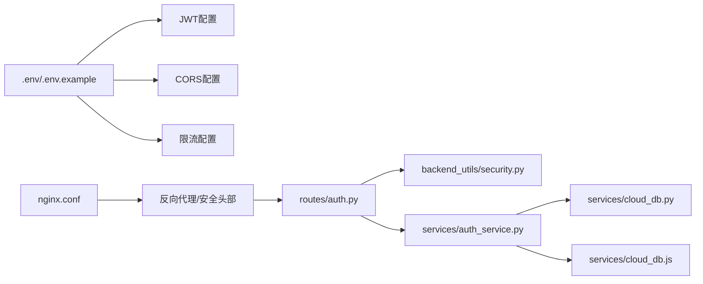

# 安全配置

<cite>
**本文引用的文件**
- [.env](file://.env)
- [.env.example](file://.env.example)
- [deploy/nginx.conf](file://deploy/nginx.conf)
- [deploy/docker-compose.yml](file://deploy/docker-compose.yml)
- [backend_utils/security.py](file://backend_utils/security.py)
- [routes/auth.py](file://routes/auth.py)
- [services/auth_service.py](file://services/auth_service.py)
- [services/cloud_db.py](file://services/cloud_db.py)
- [services/cloud_db.js](file://services/cloud_db.js)
- [utils/auth.js](file://utils/auth.js)
- [backend_utils/loginService.js](file://backend_utils/loginService.js)
</cite>

## 目录
1. [简介](#简介)
2. [项目结构](#项目结构)
3. [核心组件](#核心组件)
4. [架构总览](#架构总览)
5. [详细组件分析](#详细组件分析)
6. [依赖关系分析](#依赖关系分析)
7. [性能考量](#性能考量)
8. [故障排查指南](#故障排查指南)
9. [结论](#结论)
10. [附录](#附录)

## 简介
本文件聚焦于场外期权交易系统的安全配置专项文档，覆盖以下关键领域：
- JWT 令牌配置：密钥管理、算法选择、过期时间、刷新机制与会话管理
- HTTPS 与 SSL 证书：Nginx 配置、证书路径与 TLS 优化
- 安全头部与 CORS：跨域策略、预检请求与白名单
- API 限流与防刷：速率限制、账户锁定与审计日志
- 数据库连接安全：云数据库访问令牌、SSL 校验与并发控制
- 最佳实践与应急响应：密钥轮换、配置审计与漏洞防护

## 项目结构
围绕安全配置的关键文件分布如下：
- 环境变量与示例：.env、.env.example
- 反向代理与 HTTPS：deploy/nginx.conf、deploy/docker-compose.yml
- 后端安全中间件与装饰器：backend_utils/security.py
- 认证路由与鉴权：routes/auth.py
- JWT 签发与刷新：services/auth_service.py
- 云数据库安全访问：services/cloud_db.py、services/cloud_db.js
- 前端登录与令牌管理：utils/auth.js、backend_utils/loginService.js

图表来源
- [deploy/nginx.conf](file://deploy/nginx.conf#L1-L61)
- [deploy/docker-compose.yml](file://deploy/docker-compose.yml#L1-L42)
- [routes/auth.py](file://routes/auth.py#L1-L353)
- [backend_utils/security.py](file://backend_utils/security.py#L1-L117)
- [services/auth_service.py](file://services/auth_service.py#L86-L160)
- [services/cloud_db.py](file://services/cloud_db.py#L108-L207)
- [services/cloud_db.js](file://services/cloud_db.js#L7-L37)
- [.env](file://.env#L1-L32)
- [.env.example](file://.env.example#L1-L50)

章节来源
- [deploy/nginx.conf](file://deploy/nginx.conf#L1-L61)
- [deploy/docker-compose.yml](file://deploy/docker-compose.yml#L1-L42)
- [routes/auth.py](file://routes/auth.py#L1-L353)
- [backend_utils/security.py](file://backend_utils/security.py#L1-L117)
- [services/auth_service.py](file://services/auth_service.py#L86-L160)
- [services/cloud_db.py](file://services/cloud_db.py#L108-L207)
- [services/cloud_db.js](file://services/cloud_db.js#L7-L37)
- [.env](file://.env#L1-L32)
- [.env.example](file://.env.example#L1-L50)

## 核心组件
- JWT 令牌与会话
  - 密钥与算法：通过环境变量配置，生产环境需使用强随机密钥与安全算法
  - 过期时间：访问令牌短期有效，刷新令牌长期有效并配合会话表管理
  - 刷新与轮换：刷新令牌旋转与会话撤销，降低泄露风险
- HTTPS 与 SSL
  - Nginx 强制跳转 HTTPS，TLSv1.2+，禁用弱密码套件
  - 证书路径与日志分离，便于运维与审计
- CORS 与安全头部
  - 明确允许来源、方法与头部；预检请求处理
  - 生产环境建议使用严格白名单
- API 限流与防刷
  - 基于内存的简单限流器，按 IP+端点维度统计
  - 登录失败锁定策略，15 分钟锁定
  - 审计日志记录操作、用户与状态
- 数据库连接安全
  - 云数据库访问令牌获取与缓存，带过期保护
  - Python/Node 客户端均支持 SSL 校验开关
  - 并发与重试退避，避免 QPS 抖动

章节来源
- [routes/auth.py](file://routes/auth.py#L74-L96)
- [services/auth_service.py](file://services/auth_service.py#L86-L160)
- [backend_utils/security.py](file://backend_utils/security.py#L17-L45)
- [backend_utils/security.py](file://backend_utils/security.py#L47-L86)
- [backend_utils/security.py](file://backend_utils/security.py#L87-L117)
- [deploy/nginx.conf](file://deploy/nginx.conf#L12-L60)
- [services/cloud_db.py](file://services/cloud_db.py#L58-L105)
- [services/cloud_db.js](file://services/cloud_db.js#L72-L98)

## 架构总览
下图展示从客户端到后端与云数据库的端到端安全交互路径，强调 HTTPS、JWT、限流与审计。

图表来源
- [deploy/nginx.conf](file://deploy/nginx.conf#L39-L53)
- [routes/auth.py](file://routes/auth.py#L33-L54)
- [backend_utils/security.py](file://backend_utils/security.py#L17-L45)
- [services/auth_service.py](file://services/auth_service.py#L133-L160)
- [services/cloud_db.py](file://services/cloud_db.py#L486-L533)
- [services/cloud_db.js](file://services/cloud_db.js#L106-L139)

## 详细组件分析

### JWT 令牌配置与实现
- 密钥管理
  - 环境变量提供密钥与算法，生产环境务必使用强随机密钥
  - 建议定期轮换密钥，并在新旧密钥过渡期内支持双解码
- 算法选择
  - 示例采用对称算法，生产建议使用安全算法并启用签名验证
- 过期时间
  - 访问令牌短期有效，刷新令牌长期有效并配合会话表
- 刷新与会话
  - 刷新令牌旋转与会话撤销，防止令牌泄露扩大影响
- 前端令牌管理
  - 小程序登录后存储令牌与用户信息，自动刷新与失效处理

图表来源
- [services/auth_service.py](file://services/auth_service.py#L86-L132)
- [services/auth_service.py](file://services/auth_service.py#L133-L160)
- [routes/auth.py](file://routes/auth.py#L74-L96)
- [utils/auth.js](file://utils/auth.js#L3-L33)
- [backend_utils/loginService.js](file://backend_utils/loginService.js#L83-L100)

章节来源
- [.env.example](file://.env.example#L13-L17)
- [.env](file://.env#L8-L11)
- [services/auth_service.py](file://services/auth_service.py#L86-L160)
- [routes/auth.py](file://routes/auth.py#L33-L54)
- [utils/auth.js](file://utils/auth.js#L3-L33)
- [backend_utils/loginService.js](file://backend_utils/loginService.js#L260-L280)

### HTTPS 与 SSL 证书管理
- Nginx 配置要点
  - 强制 80->443 跳转
  - TLSv1.2+，禁用弱套件，启用服务器优先
  - 证书与私钥路径配置，日志分离
- 容器编排
  - 暴露 80/443，挂载证书与日志目录
  - 反向代理至后端服务端口

图表来源
- [deploy/nginx.conf](file://deploy/nginx.conf#L2-L10)
- [deploy/nginx.conf](file://deploy/nginx.conf#L12-L28)
- [deploy/nginx.conf](file://deploy/nginx.conf#L39-L53)
- [deploy/docker-compose.yml](file://deploy/docker-compose.yml#L22-L37)

章节来源
- [deploy/nginx.conf](file://deploy/nginx.conf#L1-L61)
- [deploy/docker-compose.yml](file://deploy/docker-compose.yml#L1-L42)

### CORS 跨域安全策略
- 允许来源
  - 通过环境变量配置允许的来源列表
- 预检请求
  - 明确允许的方法与头部，避免通配符带来的安全风险
- 白名单
  - 生产环境建议使用严格白名单，避免过度放行

章节来源
- [.env.example](file://.env.example#L10-L11)
- [deploy/nginx.conf](file://deploy/nginx.conf#L39-L53)

### API 限流与防刷机制
- 速率限制
  - 基于内存的限流器，按 IP+端点统计窗口内请求数
- 登录锁定
  - 多次失败后锁定账户一段时间，防止暴力破解
- 审计日志
  - 记录用户、动作与状态，便于追踪与取证

图表来源
- [backend_utils/security.py](file://backend_utils/security.py#L17-L45)
- [backend_utils/security.py](file://backend_utils/security.py#L62-L86)
- [backend_utils/security.py](file://backend_utils/security.py#L87-L117)

章节来源
- [backend_utils/security.py](file://backend_utils/security.py#L1-L117)
- [routes/auth.py](file://routes/auth.py#L196-L203)
- [routes/auth.py](file://routes/auth.py#L236-L245)
- [routes/auth.py](file://routes/auth.py#L248-L259)
- [routes/auth.py](file://routes/auth.py#L279-L287)

### 数据库连接安全配置
- 访问令牌管理
  - 获取与缓存 access_token，带过期保护与并发信号量
- SSL 校验
  - Python/Node 客户端均支持 SSL 校验开关
- 并发与重试
  - 限流并发，指数退避重试，避免 QPS 波动

图表来源
- [services/cloud_db.py](file://services/cloud_db.py#L36-L105)
- [services/cloud_db.py](file://services/cloud_db.py#L108-L207)
- [services/cloud_db.py](file://services/cloud_db.py#L486-L533)
- [services/cloud_db.js](file://services/cloud_db.js#L7-L37)
- [services/cloud_db.js](file://services/cloud_db.js#L106-L139)

章节来源
- [services/cloud_db.py](file://services/cloud_db.py#L108-L207)
- [services/cloud_db.js](file://services/cloud_db.js#L7-L37)

## 依赖关系分析
- 环境变量驱动
  - JWT 密钥、算法、过期时间、限流阈值、跨域来源
- 中间件与装饰器
  - 限流、登录锁定、审计日志贯穿认证与业务路由
- 反向代理
  - Nginx 提供统一入口、强制 HTTPS、CORS 与代理
- 云数据库
  - 通过访问令牌与 SSL 校验保障远端调用安全

图表来源
- [.env](file://.env#L8-L11)
- [.env.example](file://.env.example#L10-L17)
- [deploy/nginx.conf](file://deploy/nginx.conf#L39-L53)
- [routes/auth.py](file://routes/auth.py#L1-L353)
- [backend_utils/security.py](file://backend_utils/security.py#L1-L117)
- [services/auth_service.py](file://services/auth_service.py#L86-L160)
- [services/cloud_db.py](file://services/cloud_db.py#L108-L207)
- [services/cloud_db.js](file://services/cloud_db.js#L7-L37)

章节来源
- [.env](file://.env#L1-L32)
- [.env.example](file://.env.example#L1-L50)
- [deploy/nginx.conf](file://deploy/nginx.conf#L1-L61)
- [routes/auth.py](file://routes/auth.py#L1-L353)
- [backend_utils/security.py](file://backend_utils/security.py#L1-L117)
- [services/auth_service.py](file://services/auth_service.py#L86-L160)
- [services/cloud_db.py](file://services/cloud_db.py#L108-L207)
- [services/cloud_db.js](file://services/cloud_db.js#L7-L37)

## 性能考量
- 限流窗口与阈值需结合业务峰值与后端承载能力调整
- 云数据库并发与重试策略应与上游限流协同，避免雪崩
- Nginx 代理超时参数需根据查询复杂度适当延长
- 审计日志写入应异步化，避免阻塞主请求链路

## 故障排查指南
- JWT 相关
  - 令牌过期：触发刷新流程；若刷新失败，引导重新登录
  - 无效令牌：检查密钥一致性与算法配置
- HTTPS 与证书
  - 443 端口不可达：确认证书路径与权限、防火墙放行
  - TLS 握手失败：核对 TLS 版本与套件配置
- CORS 与预检
  - 预检失败：检查允许来源、方法与头部是否匹配
- 限流与锁定
  - 429 频繁：检查限流阈值与窗口，或临时放宽策略
  - 账户被锁：等待锁定时间结束或管理员解锁
- 云数据库
  - 访问令牌获取失败：检查 AppID/Secret/Env 配置与网络连通性
  - QPS 限制：降低并发或增加重试退避

章节来源
- [routes/auth.py](file://routes/auth.py#L41-L54)
- [services/auth_service.py](file://services/auth_service.py#L133-L160)
- [deploy/nginx.conf](file://deploy/nginx.conf#L12-L28)
- [backend_utils/security.py](file://backend_utils/security.py#L17-L45)
- [backend_utils/security.py](file://backend_utils/security.py#L62-L86)
- [services/cloud_db.py](file://services/cloud_db.py#L162-L207)
- [services/cloud_db.js](file://services/cloud_db.js#L72-L98)

## 结论
本项目在安全配置上已具备基础框架：JWT 令牌、HTTPS、CORS、限流与审计、云数据库访问控制。建议在生产环境中进一步强化：
- 密钥轮换与多密钥过渡
- CORS 白名单与安全头部加固
- 限流与熔断联动
- 云数据库访问令牌与 SSL 校验的统一策略
- 审计与告警联动

## 附录
- 环境变量最佳实践
  - 生产环境使用随机强密钥，避免硬编码
  - 严格区分开发/测试/生产环境变量
  - 定期审计敏感变量变更历史
- 应急响应
  - 密钥泄露：立即轮换并撤销受影响会话
  - 高频攻击：临时收紧限流、开启更严格锁定策略
  - 证书到期：提前续期并验证 Nginx 加载