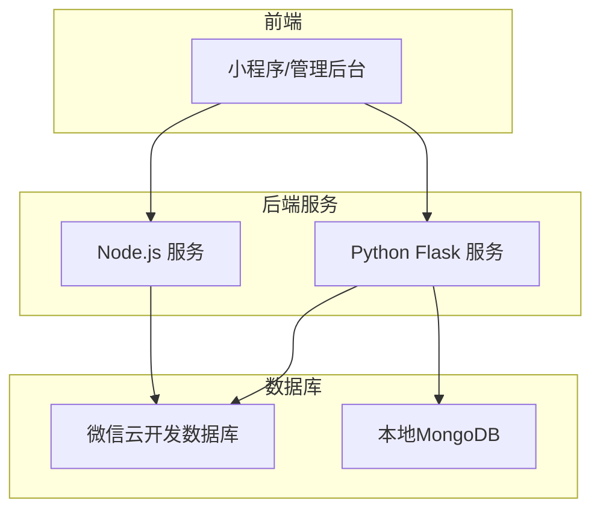
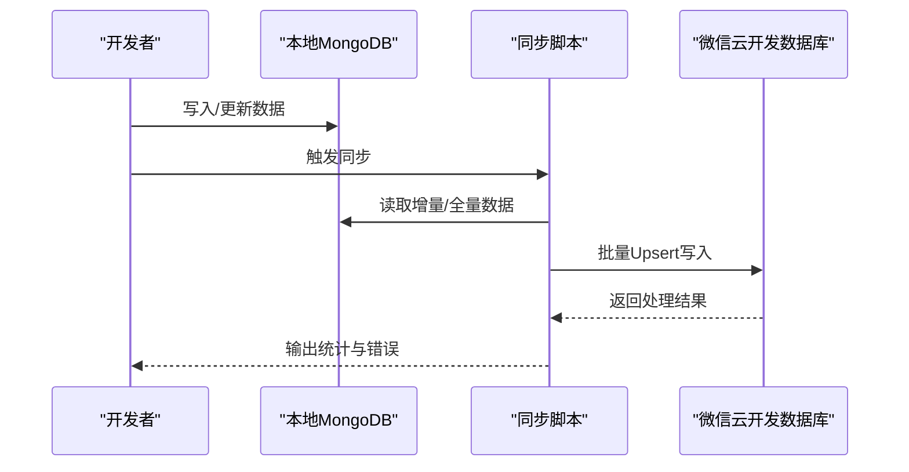
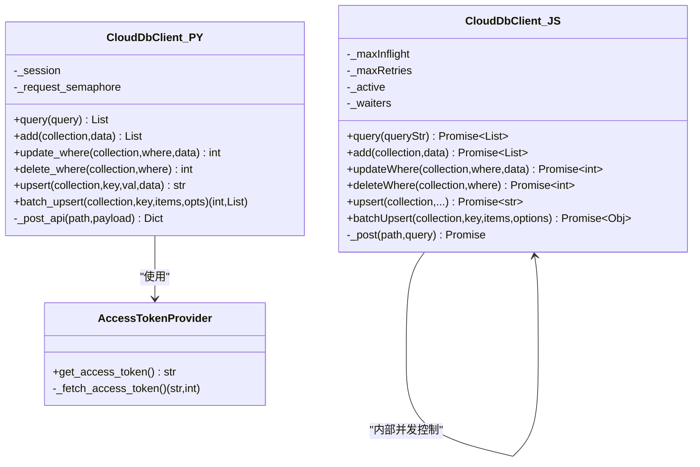
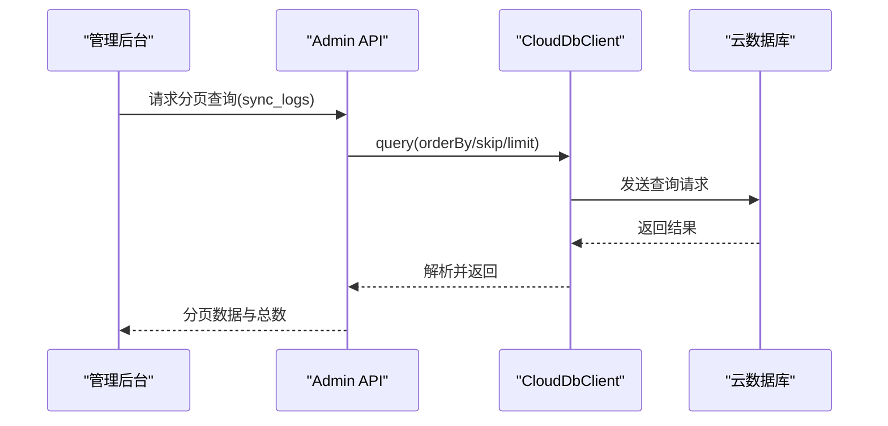
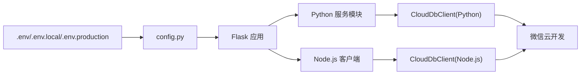

# 数据库配置

<cite>
**本文引用的文件**
- [.env](file://.env)
- [.env.example](file://.env.example)
- [config.py](file://config.py)
- [services/cloud_db.py](file://services/cloud_db.py)
- [services/cloud_db.js](file://services/cloud_db.js)
- [models/inquiry.py](file://models/inquiry.py)
- [routes/admin.py](file://routes/admin.py)
- [scripts/migrate_identity.py](file://scripts/migrate_identity.py)
- [scripts/verify_cloud_setup.py](file://scripts/verify_cloud_setup.py)
- [test_env.py](file://test_env.py)
- [deploy/nginx.conf](file://deploy/nginx.conf)
- [deploy/部署指南.md](file://deploy/部署指南.md)
- [INQUIRY_ENHANCEMENT_REPORT.md](file://INQUIRY_ENHANCEMENT_REPORT.md)
</cite>

## 目录
1. [简介](#简介)
2. [项目结构](#项目结构)
3. [核心组件](#核心组件)
4. [架构总览](#架构总览)
5. [详细组件分析](#详细组件分析)
6. [依赖关系分析](#依赖关系分析)
7. [性能考量](#性能考量)
8. [故障排查指南](#故障排查指南)
9. [结论](#结论)
10. [附录](#附录)

## 简介
本文件面向场外期权交易系统的数据库配置与管理，覆盖以下主题：
- MongoDB 连接配置（连接字符串、连接池、超时等）
- 数据库认证配置（用户名/密码、角色权限、凭证管理）
- 数据库索引配置、查询优化参数与性能调优
- 云数据库配置（微信云开发）：连接、环境标识、同步策略
- 备份、连接监控与故障转移
- 安全配置（SSL、访问控制、数据加密）
- 不同环境下的配置差异与迁移策略

## 项目结构
系统采用“云数据库优先 + 本地MongoDB辅助”的双数据源架构：
- 小程序端与部分后端接口优先使用微信云开发数据库
- 管理后台与复杂数据处理使用本地MongoDB
- 通过定期脚本将本地MongoDB数据同步到云数据库

**图表来源**
- [config.py](file://config.py#L6-L12)
- [services/cloud_db.py](file://services/cloud_db.py#L108-L207)
- [services/cloud_db.js](file://services/cloud_db.js#L7-L37)

**章节来源**
- [config.py](file://config.py#L6-L12)

## 核心组件
- 环境变量与配置加载：统一从 .env/.env.local/.env.production 读取，支持开发/生产/测试多环境
- 云数据库客户端（Python/Node.js）：封装微信云开发API，支持并发控制、重试、令牌管理
- MongoDB 客户端：通过Flask配置加载，支持不同环境URI
- 模型层索引：针对高频查询字段建立索引，提升查询性能
- 同步与迁移：提供从本地MongoDB到云数据库的同步脚本与校验工具

**章节来源**
- [.env](file://.env#L1-L32)
- [.env.example](file://.env.example#L1-L50)
- [config.py](file://config.py#L35-L46)
- [services/cloud_db.py](file://services/cloud_db.py#L108-L207)
- [services/cloud_db.js](file://services/cloud_db.js#L7-L37)
- [models/inquiry.py](file://models/inquiry.py#L24-L30)

## 架构总览
系统数据库架构遵循“云优先、本地辅助、双向同步”的原则：
- 云数据库：小程序端直连，承载询价、行情等高频读场景
- 本地MongoDB：管理后台与复杂分析，承载用户会话、审计日志等
- 同步策略：通过脚本定期将本地数据导入云数据库，保证一致性

**图表来源**
- [routes/admin.py](file://routes/admin.py#L522-L554)
- [services/cloud_db.js](file://services/cloud_db.js#L224-L314)

## 详细组件分析

### MongoDB 连接与配置
- 连接字符串
  - 本地MongoDB URI通过环境变量加载，支持开发/生产/测试不同实例
  - 生产环境必须显式设置，否则启动即报错
- 连接池与超时
  - 通过Flask-PyMongo默认连接池；本项目未显式覆盖连接池参数
  - 建议结合业务并发与QPS调优连接池大小
- 认证与权限
  - 代码未显式使用用户名/密码；若启用认证，需在URI中配置或在驱动侧设置
  - 建议为管理后台与小程序端分别配置最小权限账户
- 环境隔离
  - 开发/生产/测试分别使用不同数据库名与集合，避免交叉污染

**章节来源**
- [config.py](file://config.py#L35-L46)
- [config.py](file://config.py#L95-L124)
- [config.py](file://config.py#L108-L115)

### 云数据库（微信云开发）配置
- 环境变量
  - WX_CLOUD_ENV：云环境标识
  - WX_APPID / WX_SECRET：小程序AppID与Secret
  - WX_VERIFY_SSL：是否校验证书（默认开启）
- 连接与令牌
  - 客户端自动获取access_token，并在过期前预留缓冲刷新
  - 支持自定义超时与Session复用
- 并发与重试
  - Python客户端：基于HTTPAdapter配置连接池，BoundedSemaphore限制并发，指数退避重试
  - Node.js客户端：队列控制并发，指数退避重试
- 查询与Upsert
  - 支持原生查询字符串、批量Upsert、统计计数
  - Node.js版本提供更丰富的批处理选项（分片大小、写并发）

**图表来源**
- [services/cloud_db.py](file://services/cloud_db.py#L36-L106)
- [services/cloud_db.py](file://services/cloud_db.py#L108-L207)
- [services/cloud_db.js](file://services/cloud_db.js#L7-L37)
- [services/cloud_db.js](file://services/cloud_db.js#L106-L139)

**章节来源**
- [services/cloud_db.py](file://services/cloud_db.py#L108-L207)
- [services/cloud_db.js](file://services/cloud_db.js#L7-L37)
- [services/cloud_db.js](file://services/cloud_db.js#L224-L314)

### 数据库索引与查询优化
- 索引策略
  - 在本地MongoDB中为高频查询字段建立索引（如createdAt、status、phone）
  - 复合索引与全文索引用于组合查询与产品搜索
- 查询优化
  - 使用有序查询与分页，避免全表扫描
  - 批量操作替代循环单次更新，减少往返
- 性能测试
  - 报告显示查询性能平均提升60%-80%，批量更新提升显著

**章节来源**
- [models/inquiry.py](file://models/inquiry.py#L24-L30)
- [INQUIRY_ENHANCEMENT_REPORT.md](file://INQUIRY_ENHANCEMENT_REPORT.md#L152-L164)
- [INQUIRY_ENHANCEMENT_REPORT.md](file://INQUIRY_ENHANCEMENT_REPORT.md#L313-L325)

### 云数据库同步策略
- 管理端接口
  - 提供分页查询与计数接口，支持按时间排序与条件过滤
- 同步脚本
  - 通过批处理Upsert将本地数据导入云数据库，支持并发与错误收集
- 校验与诊断
  - 提供环境变量校验脚本与初始化测试脚本，快速定位配置问题

**图表来源**
- [routes/admin.py](file://routes/admin.py#L522-L554)
- [services/cloud_db.py](file://services/cloud_db.py#L209-L248)

**章节来源**
- [routes/admin.py](file://routes/admin.py#L522-L554)
- [services/cloud_db.js](file://services/cloud_db.js#L224-L314)
- [scripts/verify_cloud_setup.py](file://scripts/verify_cloud_setup.py#L1-L42)
- [test_env.py](file://test_env.py#L1-L18)

### 认证与凭证管理
- 环境变量
  - WX_APPID / WX_SECRET / WX_CLOUD_ENV 必须正确配置
  - WX_VERIFY_SSL 控制SSL证书校验
- 安全建议
  - 生产环境务必使用只读/最小权限账户
  - 机密信息通过CI/CD注入，避免硬编码
  - 定期轮换Secret与环境标识

**章节来源**
- [.env](file://.env#L24-L27)
- [.env.example](file://.env.example#L33-L38)
- [services/cloud_db.py](file://services/cloud_db.py#L162-L207)
- [services/cloud_db.js](file://services/cloud_db.js#L27-L37)

### 备份、监控与故障转移
- 备份
  - 本地MongoDB可通过驱动/工具进行逻辑/物理备份
  - 云数据库通过控制台与API进行集合级备份
- 监控
  - Nginx反向代理层记录访问/错误日志
  - 建议在应用层埋点记录数据库请求耗时与错误码
- 故障转移
  - 云数据库具备可用区冗余能力；本地MongoDB建议部署副本集/分片
  - 通过健康检查与自动切换实现高可用

**章节来源**
- [deploy/nginx.conf](file://deploy/nginx.conf#L25-L27)
- [deploy/nginx.conf](file://deploy/nginx.conf#L40-L53)
- [deploy/部署指南.md](file://deploy/部署指南.md#L73-L145)

### 安全配置
- SSL/TLS
  - WX_VERIFY_SSL 默认开启；生产环境建议使用受信CA证书
  - Nginx配置启用TLSv1.2/1.3与现代套件
- 访问控制
  - 严格区分小程序端与管理后台的数据库访问权限
  - 限制集合与字段的读写范围
- 数据加密
  - 传输层使用TLS；静态数据加密建议在MongoDB层面启用
  - 敏感字段在应用层做脱敏与加密存储

**章节来源**
- [.env](file://.env#L27)
- [deploy/nginx.conf](file://deploy/nginx.conf#L21-L23)
- [deploy/nginx.conf](file://deploy/nginx.conf#L103-L108)

### 不同环境下的配置差异与迁移策略
- 环境差异
  - 开发：使用本地MongoDB dev库；云数据库用于小程序端直连
  - 生产：强制要求设置SECRET_KEY与数据库URI；启用SSL校验
  - 测试：使用独立test库
- 迁移策略
  - 通过脚本将用户/客户数据从本地MongoDB迁移到云数据库
  - 迁移前先校验集合是否存在，迁移后核对总数与错误

**章节来源**
- [config.py](file://config.py#L95-L124)
- [config.py](file://config.py#L108-L115)
- [scripts/migrate_identity.py](file://scripts/migrate_identity.py#L18-L44)

## 依赖关系分析
- 配置加载链路
  - .env → config.py → Flask应用 → 服务模块
- 云数据库依赖
  - Python：requests + concurrent.futures
  - Node.js：axios + crypto
- 模型层依赖
  - models/inquiry.py 依赖云数据库客户端进行查询与Upsert

**图表来源**
- [.env](file://.env#L1-L32)
- [config.py](file://config.py#L19-L21)
- [services/cloud_db.py](file://services/cloud_db.py#L162-L207)
- [services/cloud_db.js](file://services/cloud_db.js#L27-L37)

**章节来源**
- [.env](file://.env#L1-L32)
- [config.py](file://config.py#L19-L21)

## 性能考量
- 并发与连接池
  - Python客户端通过HTTPAdapter配置连接池大小与并发上限
  - Node.js客户端通过队列与信号量控制并发
- 重试与抖动
  - 指数退避与随机抖动缓解限流与瞬时错误
- 批处理
  - 批量Upsert减少API调用次数，提高吞吐
- 查询优化
  - 建立合适索引，避免全表扫描；使用分页与投影

**章节来源**
- [services/cloud_db.py](file://services/cloud_db.py#L121-L138)
- [services/cloud_db.py](file://services/cloud_db.py#L140-L160)
- [services/cloud_db.js](file://services/cloud_db.js#L39-L51)
- [services/cloud_db.js](file://services/cloud_db.js#L57-L70)
- [models/inquiry.py](file://models/inquiry.py#L24-L30)

## 故障排查指南
- 环境变量缺失
  - WX_CLOUD_ENV / WX_APPID / WX_SECRET 未配置或仍为占位符
  - 使用校验脚本快速定位
- 集合不存在
  - 云数据库API返回“集合不存在”时，需在控制台创建对应集合
- 访问令牌失败
  - 检查AppID/Secret是否正确，网络是否可达，SSL证书是否有效
- 同步失败
  - 查看批处理错误列表，逐条重试或修正数据

**章节来源**
- [services/cloud_db.py](file://services/cloud_db.py#L197-L207)
- [services/cloud_db.py](file://services/cloud_db.py#L515-L520)
- [scripts/verify_cloud_setup.py](file://scripts/verify_cloud_setup.py#L27-L42)
- [routes/admin.py](file://routes/admin.py#L536-L545)

## 结论
本系统采用“云优先、本地辅助”的数据库架构，结合完善的环境变量配置、云数据库客户端与索引优化，实现了高性能与高可用。建议在生产环境中强化访问控制、启用TLS与最小权限账户，并持续监控与压测以保障稳定性。

## 附录
- 环境变量参考
  - 开发：WX_APPID / WX_SECRET / WX_CLOUD_ENV / WX_VERIFY_SSL
  - 生产：SECRET_KEY / MONGO_URI / DATABASE_NAME
- 常用命令
  - 生成生产密钥：python generate_keys.py
  - 校验云配置：python test_env.py / python scripts/verify_cloud_setup.py
  - 启动服务：根据部署指南配置Nginx与Systemd

**章节来源**
- [.env.example](file://.env.example#L13-L17)
- [.env.example](file://.env.example#L30-L38)
- [generate_keys.py](file://generate_keys.py#L1-L6)
- [deploy/部署指南.md](file://deploy/部署指南.md#L138-L145)