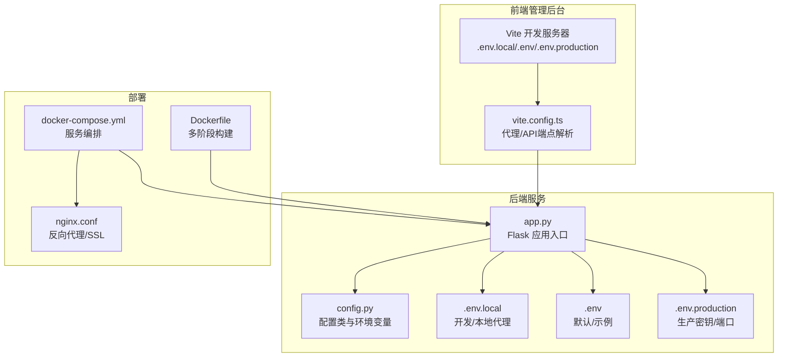
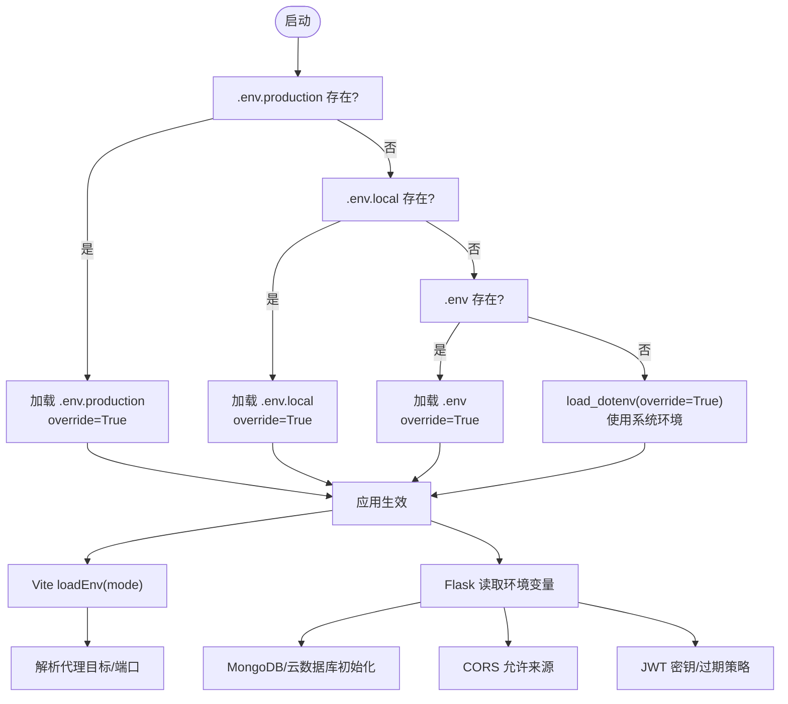
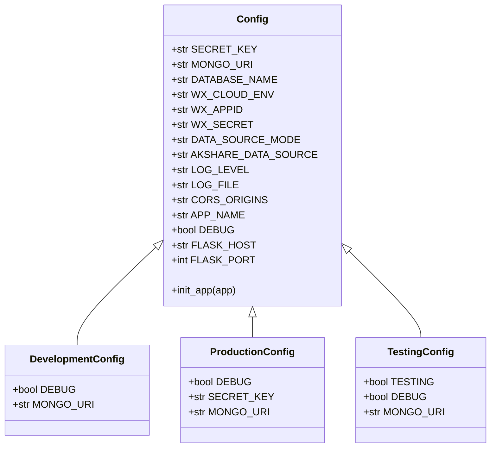
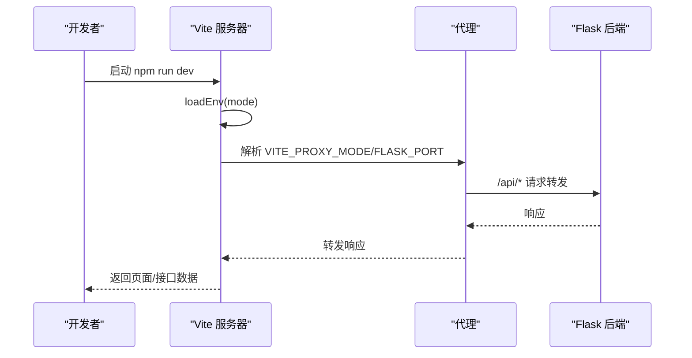
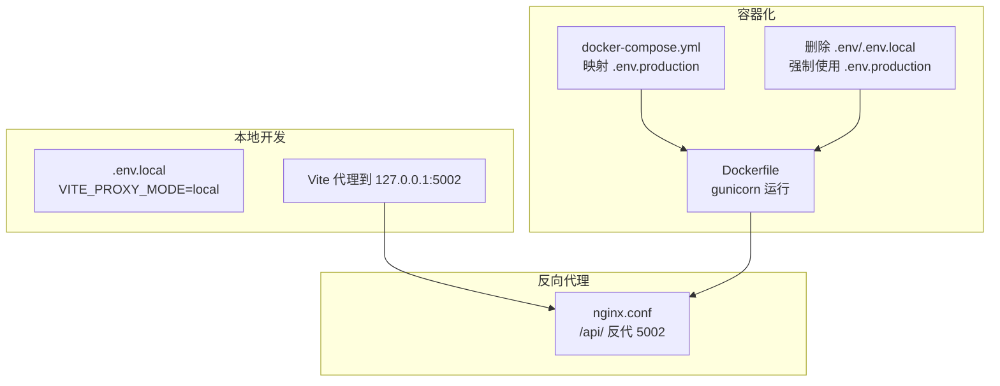
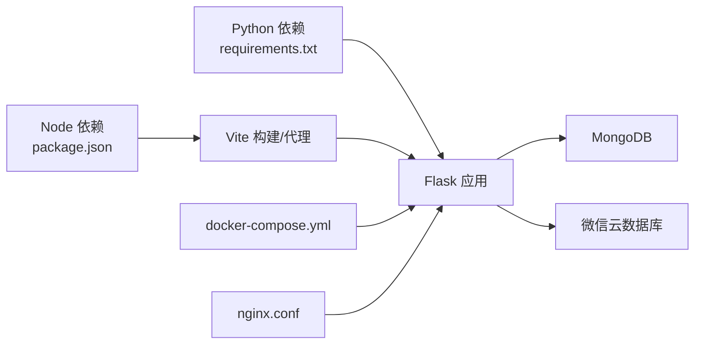

# 环境配置

<cite>
**本文引用的文件**
- [.env](file://.env)
- [.env.local](file://.env.local)
- [.env.production](file://.env.production)
- [.env.example](file://.env.example)
- [app.py](file://app.py)
- [config.py](file://config.py)
- [vite.config.ts](file://admin-ui/vite.config.ts)
- [package.json](file://package.json)
- [docker-compose.yml](file://deploy/docker-compose.yml)
- [nginx.conf](file://deploy/nginx.conf)
- [Dockerfile](file://Dockerfile)
- [requirements.txt](file://requirements.txt)
- [CONTRIBUTING.md](file://CONTRIBUTING.md)
</cite>

## 更新摘要
**所做更改**
- 更新了环境配置加载逻辑，强调生产配置优先级
- 增强了生产环境安全性措施
- 完善了开发配置文件的安全管理
- 更新了容器化部署中的配置文件处理

## 目录
1. [简介](#简介)
2. [项目结构](#项目结构)
3. [核心组件](#核心组件)
4. [架构总览](#架构总览)
5. [详细组件分析](#详细组件分析)
6. [依赖分析](#依赖分析)
7. [性能考虑](#性能考虑)
8. [故障排除指南](#故障排除指南)
9. [结论](#结论)
10. [附录](#附录)

## 简介
本文件系统性梳理场外期权交易系统的环境配置，覆盖开发、测试与生产三类环境的配置差异与用途；文档化 Flask 后端的环境变量（应用端口、跨域、JWT 密钥、数据库连接等），以及前端管理后台的环境配置（API 端点、代理模式、调试模式等）。同时给出环境变量的优先级规则、继承关系与覆盖机制，提供安全与敏感信息保护的最佳实践，并附带不同部署场景下的配置模板与示例。

**更新重点**：重新组织了环境配置加载逻辑，优先加载生产配置(.env.production)，增强了生产环境安全性，确保开发配置文件不会意外包含在生产容器中。

## 项目结构
该仓库采用"前后端分离 + 多环境配置"的组织方式：
- 后端 Flask 服务通过 app.py 与 config.py 管理环境变量与配置类。
- 前端管理后台位于 admin-ui，使用 Vite 的 loadEnv 按模式加载 .env.* 文件。
- 部署层通过 Dockerfile、docker-compose.yml 与 nginx.conf 提供容器化与反向代理方案。

**图表来源**
- [app.py](file://app.py#L37-L62)
- [config.py](file://config.py#L19-L20)
- [vite.config.ts](file://admin-ui/vite.config.ts#L6-L15)
- [docker-compose.yml](file://deploy/docker-compose.yml#L3-L20)
- [nginx.conf](file://deploy/nginx.conf#L1-L10)

**章节来源**
- [app.py](file://app.py#L37-L62)
- [config.py](file://config.py#L19-L20)
- [vite.config.ts](file://admin-ui/vite.config.ts#L6-L15)
- [docker-compose.yml](file://deploy/docker-compose.yml#L3-L20)
- [nginx.conf](file://deploy/nginx.conf#L1-L10)

## 核心组件
- Flask 后端配置加载与优先级
  - app.py 决定加载顺序：优先 .env.production，其次 .env.local，最后 .env 或默认环境。
  - config.py 定义基础配置类与开发/生产/测试配置类，统一从环境变量读取。
- 前端管理后台配置加载
  - vite.config.ts 使用 loadEnv(mode, repoRoot, '') 按模式加载 .env* 文件，解析代理目标与端口。
- 部署与反向代理
  - Dockerfile 多阶段构建，暴露端口并使用 gunicorn 运行。
  - docker-compose.yml 将 .env.production 映射到容器内，nginx.conf 提供 API 反向代理与静态资源服务。

**更新**：重新组织了环境配置加载逻辑，优先加载生产配置(.env.production)，增强了生产环境安全性。

**章节来源**
- [app.py](file://app.py#L43-L57)
- [config.py](file://config.py#L22-L132)
- [vite.config.ts](file://admin-ui/vite.config.ts#L6-L15)
- [Dockerfile](file://Dockerfile#L1-L51)
- [docker-compose.yml](file://deploy/docker-compose.yml#L12-L18)
- [nginx.conf](file://deploy/nginx.conf#L39-L53)

## 架构总览
下图展示环境变量在不同组件间的流向与覆盖关系：

**图表来源**
- [app.py](file://app.py#L43-L57)
- [vite.config.ts](file://admin-ui/vite.config.ts#L6-L15)
- [config.py](file://config.py#L32-L62)

**章节来源**
- [app.py](file://app.py#L43-L57)
- [vite.config.ts](file://admin-ui/vite.config.ts#L6-L15)
- [config.py](file://config.py#L32-L62)

## 详细组件分析

### Flask 后端环境变量与配置
- 环境变量来源与优先级
  - .env.production（生产密钥/端口）> .env.local（开发/本地代理）> .env（默认/示例）> 系统环境变量。
- 关键配置项
  - 应用与端口：NODE_ENV、FLASK_PORT、PORT（优先级：FLASK_PORT > PORT）。
  - 安全与认证：JWT_SECRET、JWT_EXPIRES_SECONDS、SECRET_KEY（生产必须设置）。
  - 数据库：MONGO_URI、DATABASE_NAME；云数据库 WX_APPID/WX_SECRET/WX_CLOUD_ENV。
  - 跨域：ALLOWED_ORIGINS（逗号分隔）。
  - 日志：LOG_LEVEL、LOG_FILE。
  - 微信云开发：WX_VERIFY_SSL 控制 SSL 校验。
  - API 限流：API_RATE_LIMIT。
  - 数据源：STOCK_DATA_SOURCE、CACHE_TYPE、CACHE_DEFAULT_TIMEOUT。
- 配置类继承关系
  - Config 基类提供通用配置；DevelopmentConfig/ProductionConfig/TestingConfig 继承并按需覆盖。
  - 生产环境强制要求 SECRET_KEY，否则启动即报错。

**更新**：环境配置加载逻辑已重新组织，优先加载 .env.production 以增强生产环境安全性。

**图表来源**
- [config.py](file://config.py#L22-L132)

**章节来源**
- [app.py](file://app.py#L43-L67)
- [config.py](file://config.py#L22-L132)

### 前端管理后台环境变量与代理
- 模式加载
  - vite.config.ts 使用 loadEnv(mode, repoRoot, '')，mode 通常来自 NODE_ENV。
- 关键配置项
  - VITE_PROXY_MODE：local/cloud，决定代理目标。
  - FLASK_PORT：后端 Flask 端口，默认 5002。
  - VITE_API_PROXY_TARGET：本地代理目标 http://127.0.0.1:FLASK_PORT。
  - NODE_ENV：development/production。
- 代理行为
  - local 模式：代理到 http://127.0.0.1:FLASK_PORT。
  - cloud 模式：代理到云端地址（示例）。
  - 超时与错误处理：统一 300 秒超时，开发模式输出详细错误信息。

**图表来源**
- [vite.config.ts](file://admin-ui/vite.config.ts#L6-L15)
- [vite.config.ts](file://admin-ui/vite.config.ts#L21-L59)

**章节来源**
- [vite.config.ts](file://admin-ui/vite.config.ts#L6-L15)
- [vite.config.ts](file://admin-ui/vite.config.ts#L21-L59)

### 环境文件对比与用途
- .env（默认/示例）
  - 提供默认端口、JWT 示例密钥、管理员账号示例、前端代理目标、微信云开发参数等。
  - 适合初次使用或演示环境。
- .env.local（开发/本地）
  - 本地开发常用，包含 ALLOWED_ORIGINS、STOCK_DATA_SOURCE、CACHE_TYPE、WX_VERIFY_SSL 等。
  - 与 .env 的差异在于允许来源与本地调试开关。
- .env.production（生产）
  - 包含生产密钥（JWT_SECRET、SECRET_KEY）、生产数据库连接、生产域名、日志文件、API 限流、第三方 Token 等。
  - 严禁将该文件纳入版本控制。

**更新**：环境配置加载逻辑已重新组织，优先加载 .env.production 以确保生产环境的配置优先级。

**章节来源**
- [.env](file://.env#L1-L32)
- [.env.local](file://.env.local#L1-L16)
- [.env.production](file://.env.production#L1-L53)
- [.env.example](file://.env.example#L1-L50)

### 环境变量优先级、继承与覆盖机制
- Flask 后端
  - 优先级：.env.production > .env.local > .env > 系统环境变量。
  - 覆盖策略：load_dotenv(..., override=True)。
- 前端
  - 优先级：按 Vite 模式加载 .env.local/.env/.env.production，最终由系统环境变量覆盖。
- 继承关系
  - config.py 的配置类之间通过继承实现差异化覆盖（如开发/生产数据库、调试开关）。

**更新**：重新组织了环境配置加载逻辑，优先加载生产配置(.env.production)，增强了生产环境安全性。

**章节来源**
- [app.py](file://app.py#L43-L57)
- [config.py](file://config.py#L95-L125)
- [vite.config.ts](file://admin-ui/vite.config.ts#L6-L15)

### 部署场景与配置模板
- 本地开发
  - 使用 .env.local，VITE_PROXY_MODE=local，FLASK_PORT=5002。
  - 前端通过本地代理访问后端。
- Docker 容器化
  - Dockerfile 多阶段构建，使用 gunicorn 运行 Flask。
  - docker-compose.yml 将 .env.production 映射至容器内，设置 NODE_ENV=production。
  - **重要**：Dockerfile 中明确删除 .env 和 .env.local 文件，强制使用 .env.production。
- 反向代理
  - nginx.conf 将 /api/ 反代至 Flask 服务端口，支持 SSL 与静态资源缓存。

**更新**：Dockerfile 中增加了删除开发配置文件的安全措施，确保生产环境中只使用 .env.production。

**图表来源**
- [Dockerfile](file://Dockerfile#L1-L51)
- [docker-compose.yml](file://deploy/docker-compose.yml#L12-L18)
- [nginx.conf](file://deploy/nginx.conf#L39-L53)

**章节来源**
- [Dockerfile](file://Dockerfile#L1-L51)
- [docker-compose.yml](file://deploy/docker-compose.yml#L12-L18)
- [nginx.conf](file://deploy/nginx.conf#L39-L53)

## 依赖分析
- 后端依赖
  - Flask、Flask-Cors、pymongo、akshare、python-dotenv、gunicorn 等。
- 前端依赖
  - Vite、React、Ant Design、Axios、React Router 等。
- 部署依赖
  - Docker、Nginx、Let's Encrypt 证书（按需）。

**图表来源**
- [requirements.txt](file://requirements.txt#L1-L12)
- [package.json](file://package.json#L27-L48)
- [docker-compose.yml](file://deploy/docker-compose.yml#L3-L20)
- [nginx.conf](file://deploy/nginx.conf#L39-L53)

**章节来源**
- [requirements.txt](file://requirements.txt#L1-L12)
- [package.json](file://package.json#L27-L48)
- [docker-compose.yml](file://deploy/docker-compose.yml#L3-L20)
- [nginx.conf](file://deploy/nginx.conf#L39-L53)

## 性能考虑
- 代理超时与稳定性：前后端代理均设置较长超时（300 秒），适配长查询与行情同步。
- 自动同步：后台调度器仅在交易时间执行全量行情同步，降低非交易时段负载。
- 反向代理：Nginx 提供静态资源缓存与 SSL 优化，减少后端压力。

## 故障排除指南
- 后端无法连接数据库
  - 检查 MONGO_URI 与 DATABASE_NAME 是否正确；开发环境可临时设置 SKIP_DB_INIT=1 跳过初始化。
- 云数据库初始化失败
  - 检查 WX_CLOUD_ENV、WX_APPID、WX_SECRET 是否完整；必要时调整 WX_VERIFY_SSL。
- CORS 跨域问题
  - 确认 ALLOWED_ORIGINS 包含前端访问域名；生产环境务必精确配置。
- 代理不通
  - 开发模式下若代理失败，Vite 会在错误响应中提示代理目标与错误详情；检查 FLASK_PORT 与 VITE_PROXY_MODE。
- 生产启动失败
  - 若未设置 SECRET_KEY，生产配置类会直接抛出致命错误，需补充密钥。
- **新增**：环境配置加载失败
  - 检查 .env.production 是否存在且格式正确；确认 Dockerfile 中的配置文件删除操作是否执行。

**更新**：增加了环境配置加载失败的故障排除指导。

**章节来源**
- [app.py](file://app.py#L70-L88)
- [app.py](file://app.py#L121-L152)
- [app.py](file://app.py#L168-L181)
- [vite.config.ts](file://admin-ui/vite.config.ts#L26-L56)
- [config.py](file://config.py#L108-L112)

## 结论
本系统通过清晰的环境文件分层与严格的加载优先级，实现了开发、测试与生产的无缝切换。Flask 与前端分别独立加载各自环境变量，配合 Docker 与 Nginx 形成稳定的部署方案。**最新更新**：重新组织了环境配置加载逻辑，优先加载生产配置(.env.production)，增强了生产环境安全性，确保开发配置文件不会意外包含在生产容器中。生产环境强调密钥与跨域配置的安全性，开发与测试环境注重灵活性与可观测性。建议在团队内统一约定环境变量命名规范与密钥轮换策略，持续完善 CI/CD 中的密钥注入与审计。

## 附录

### 环境变量清单与用途
- Flask 后端
  - NODE_ENV：应用环境（development/production/testing）。
  - FLASK_PORT/PORT：后端端口（优先 FLASK_PORT）。
  - SECRET_KEY/JWT_SECRET：Flask 会话密钥与 JWT 密钥（生产必须设置）。
  - MONGO_URI/DATABASE_NAME：MongoDB 连接与数据库名。
  - WX_APPID/WX_SECRET/WX_CLOUD_ENV：微信云数据库凭证。
  - ALLOWED_ORIGINS：CORS 允许来源列表。
  - LOG_LEVEL/LOG_FILE：日志级别与文件。
  - API_RATE_LIMIT：API 限流阈值。
  - STOCK_DATA_SOURCE/CACHE_TYPE/CACHE_DEFAULT_TIMEOUT：数据源与缓存策略。
- 前端管理后台
  - VITE_PROXY_MODE：local/cloud。
  - FLASK_PORT：后端端口。
  - VITE_API_PROXY_TARGET：代理目标地址。
  - NODE_ENV：开发/生产模式。

**更新**：强调了 .env.production 的优先级和生产环境的安全性要求。

**章节来源**
- [.env](file://.env#L5-L31)
- [.env.local](file://.env.local#L1-L16)
- [.env.production](file://.env.production#L6-L52)
- [.env.example](file://.env.example#L6-L49)
- [vite.config.ts](file://admin-ui/vite.config.ts#L10-L15)
- [config.py](file://config.py#L32-L62)

### 安全与最佳实践
- 密钥管理
  - 生产环境必须设置 SECRET_KEY 与 JWT_SECRET，使用强随机字符串；定期轮换。
- 敏感信息
  - 不将 .env.production 提交至版本控制；使用 CI/CD 注入密钥。
- 跨域与日志
  - 生产环境 ALLOWED_ORIGINS 严格限定；开启 LOG_FILE 并配置轮转。
- 代理与证书
  - 本地开发可关闭 WX_VERIFY_SSL，生产务必启用并校验证书链。
- 数据源与缓存
  - 明确 STOCK_DATA_SOURCE 与 CACHE_DEFAULT_TIMEOUT，避免缓存穿透与雪崩。
- **新增**：配置文件安全管理
  - Dockerfile 中明确删除 .env 和 .env.local 文件，确保生产环境只使用 .env.production。
  - 开发配置文件应加入 .gitignore，避免意外提交。

**更新**：增加了配置文件安全管理的最佳实践。

**章节来源**
- [.env.local](file://.env.local#L1-L16)
- [.env.production](file://.env.production#L1-L53)
- [docker-compose.yml](file://deploy/docker-compose.yml#L12-L18)
- [nginx.conf](file://deploy/nginx.conf#L39-L53)
- [CONTRIBUTING.md](file://CONTRIBUTING.md#L45-L63)

### 部署模板与示例
- 本地开发模板
  - 使用 .env.local，设置 VITE_PROXY_MODE=local，FLASK_PORT=5002。
- Docker 容器化模板
  - docker-compose.yml 映射 .env.production，设置 NODE_ENV=production。
  - Dockerfile 删除 .env 和 .env.local，强制使用 .env.production。
- Nginx 反向代理模板
  - nginx.conf 将 /api/ 反代至 Flask 端口，启用 SSL 与静态资源缓存。

**更新**：强调了 Dockerfile 中的安全配置措施。

**章节来源**
- [.env.local](file://.env.local#L1-L16)
- [.env.production](file://.env.production#L1-L53)
- [docker-compose.yml](file://deploy/docker-compose.yml#L12-L18)
- [nginx.conf](file://deploy/nginx.conf#L39-L53)
- [Dockerfile](file://Dockerfile#L43-L44)