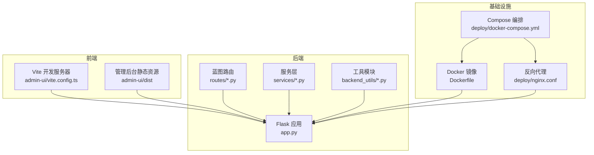
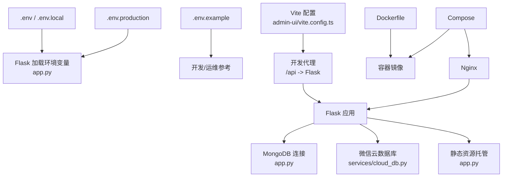
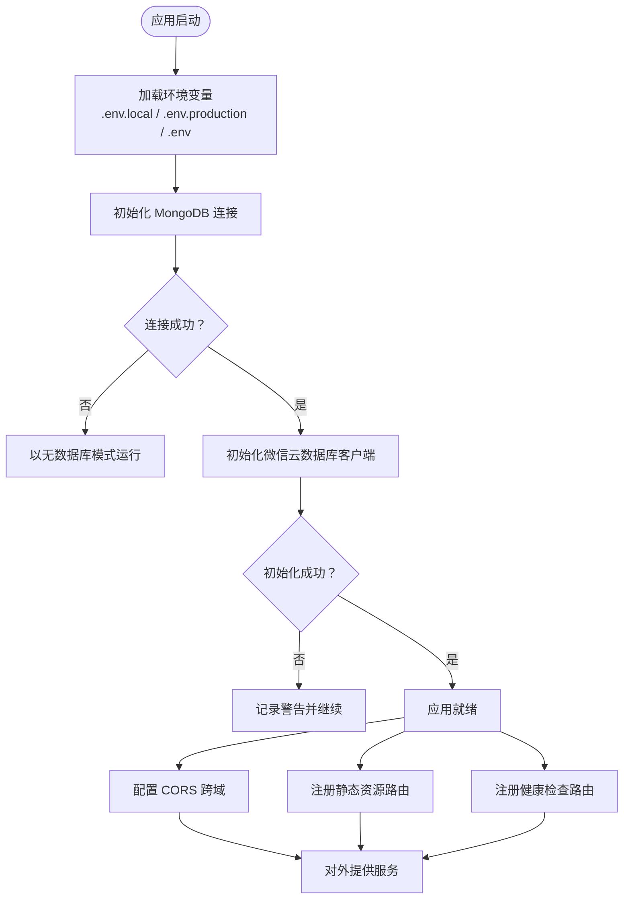
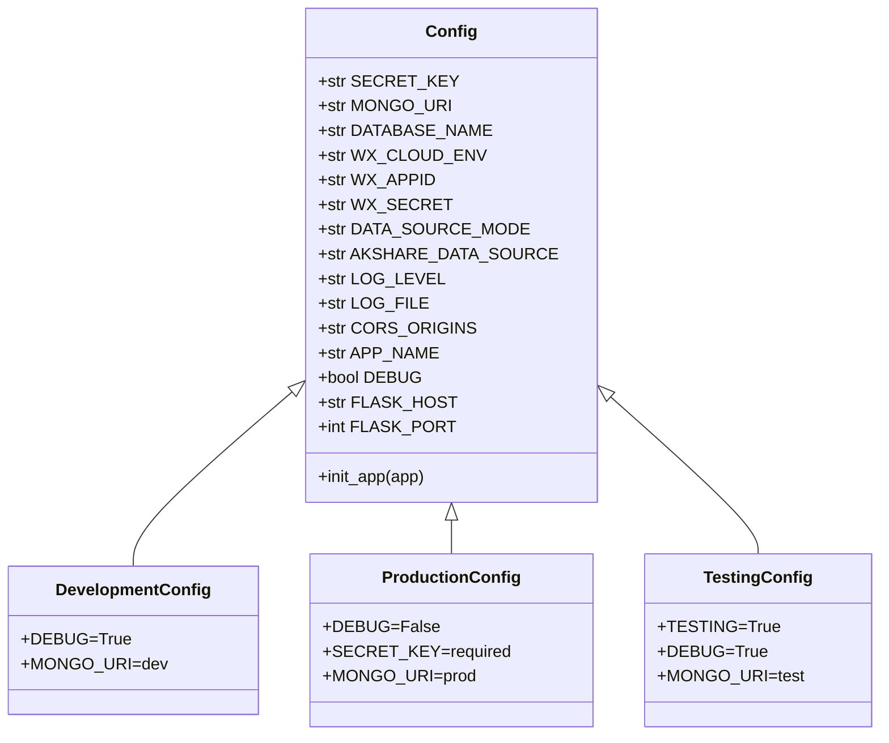
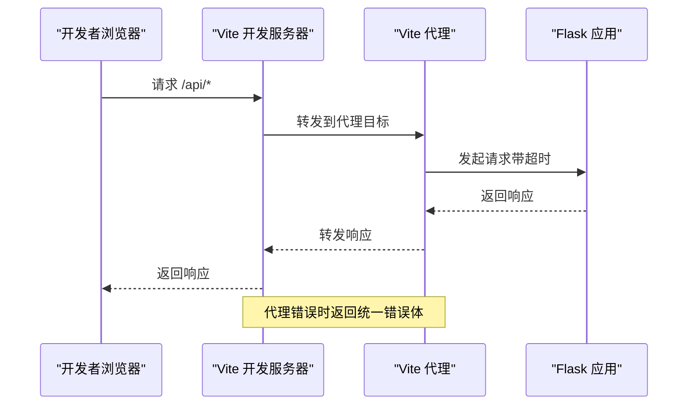
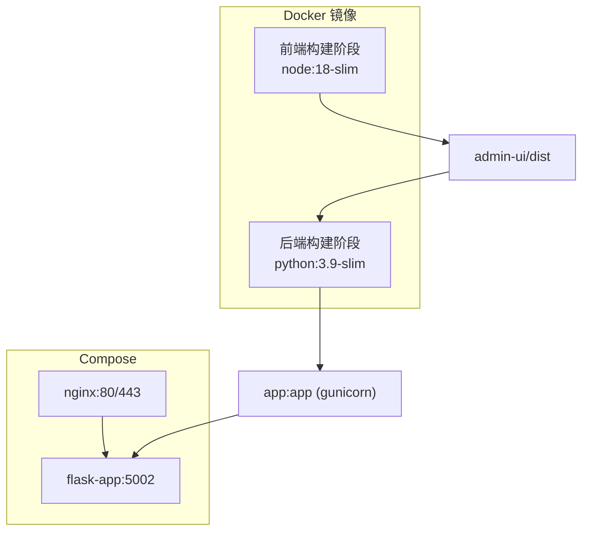
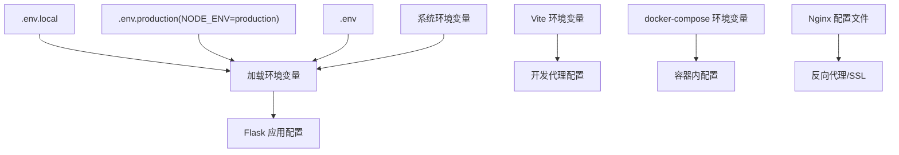
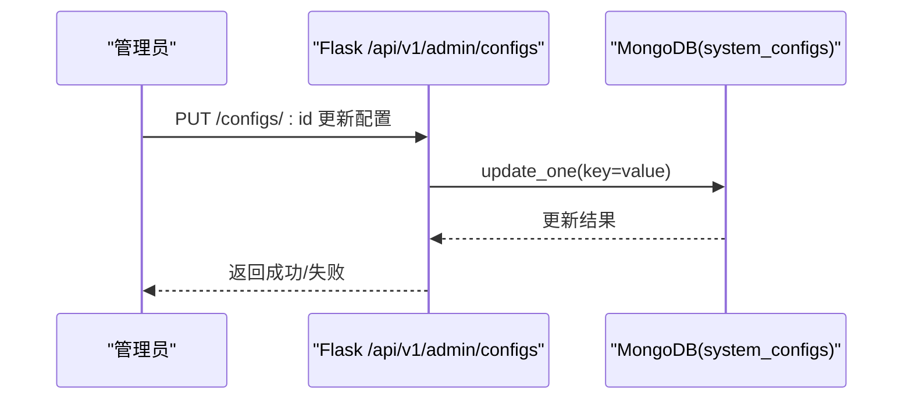
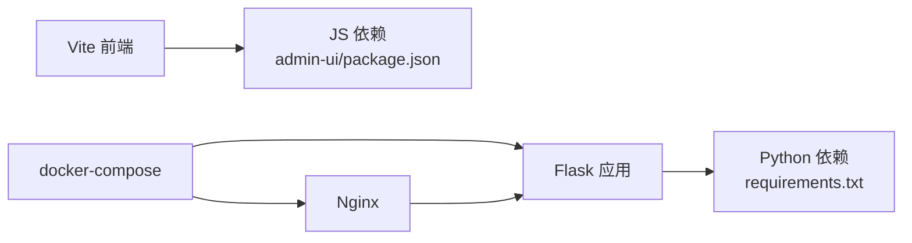

# 系统配置

<cite>
**本文引用的文件**   
- [config.py](file://config.py)
- [app.py](file://app.py)
- [vite.config.ts](file://admin-ui/vite.config.ts)
- [Dockerfile](file://Dockerfile)
- [docker-compose.yml](file://deploy/docker-compose.yml)
- [.env](file://.env)
- [.env.example](file://.env.example)
- [.env.production](file://.env.production)
- [requirements.txt](file://requirements.txt)
- [package.json](file://package.json)
- [admin-ui/package.json](file://admin-ui/package.json)
- [nginx.conf](file://deploy/nginx.conf)
- [routes/config.py](file://routes/config.py)
- [services/cloud_db.py](file://services/cloud_db.py)
- [backend_utils/db.js](file://backend_utils/db.js)
- [backend_utils/response.py](file://backend_utils/response.py)
</cite>

## 目录
1. [简介](#简介)
2. [项目结构](#项目结构)
3. [核心组件](#核心组件)
4. [架构总览](#架构总览)
5. [详细组件分析](#详细组件分析)
6. [依赖关系分析](#依赖关系分析)
7. [性能考虑](#性能考虑)
8. [故障排查指南](#故障排查指南)
9. [结论](#结论)
10. [附录](#附录)

## 简介
本文件系统性梳理场外期权交易系统的“系统级配置”，覆盖以下方面：
- Flask 应用核心配置：CORS 跨域、数据库连接池与可用性、缓存与日志、安全密钥与主机端口等
- 前端构建配置：Vite 代理、资源打包策略、开发/生产模式差异
- 容器化部署：Docker 多阶段构建、端口映射、卷挂载、Nginx 反向代理
- 配置加载顺序、合并策略与优先级
- 配置验证、热重载与动态更新策略
- 性能优化参数与调优建议

## 项目结构
系统采用前后端分离架构：
- 后端基于 Flask，提供 REST API 与静态资源托管
- 前端使用 Vite + React，开发时通过代理转发到后端
- 容器化部署通过 Dockerfile 多阶段构建，结合 docker-compose 与 Nginx

图表来源
- [app.py](file://app.py#L103-L276)
- [vite.config.ts](file://admin-ui/vite.config.ts#L1-L78)
- [Dockerfile](file://Dockerfile#L1-L48)
- [docker-compose.yml](file://deploy/docker-compose.yml#L1-L42)
- [nginx.conf](file://deploy/nginx.conf#L1-L61)

章节来源
- [app.py](file://app.py#L103-L276)
- [vite.config.ts](file://admin-ui/vite.config.ts#L1-L78)
- [Dockerfile](file://Dockerfile#L1-L48)
- [docker-compose.yml](file://deploy/docker-compose.yml#L1-L42)
- [nginx.conf](file://deploy/nginx.conf#L1-L61)

## 核心组件
- Flask 应用配置与初始化：环境变量加载、CORS、数据库连接、日志、健康检查、静态资源回退
- 配置管理模块：按环境选择配置类，集中管理密钥、数据库、日志、CORS 等
- 前端 Vite 配置：代理目标切换、超时、错误处理、测试环境
- 容器化与反向代理：多阶段构建、端口暴露、卷挂载、Nginx SSL/代理
- 云数据库客户端：访问令牌、连接池、并发与重试、批量 upsert
- 统一响应与分页：标准化 API 响应格式

章节来源
- [config.py](file://config.py#L22-L132)
- [app.py](file://app.py#L37-L101)
- [app.py](file://app.py#L103-L276)
- [services/cloud_db.py](file://services/cloud_db.py#L108-L208)
- [backend_utils/response.py](file://backend_utils/response.py#L11-L118)

## 架构总览
系统配置贯穿三层：前端、后端、基础设施。

图表来源
- [.env](file://.env#L1-L32)
- [.env.production](file://.env.production#L1-L53)
- [.env.example](file://.env.example#L1-L50)
- [vite.config.ts](file://admin-ui/vite.config.ts#L1-L78)
- [app.py](file://app.py#L37-L101)
- [services/cloud_db.py](file://services/cloud_db.py#L108-L208)
- [Dockerfile](file://Dockerfile#L1-L48)
- [docker-compose.yml](file://deploy/docker-compose.yml#L1-L42)
- [nginx.conf](file://deploy/nginx.conf#L1-L61)

## 详细组件分析

### Flask 应用配置与初始化
- 环境变量加载顺序与优先级
  - 后端启动时优先加载 .env.local；若不存在则检查 NODE_ENV 判断是否加载 .env.production；否则回退到 .env；最后回退到系统环境变量
  - 该策略确保本地开发优先使用 .env.local，生产环境优先使用 .env.production
- 数据库连接
  - 支持 MongoDB 连接，启动时进行 ping 探测；失败时以“无数据库模式”运行，部分功能降级
  - 支持微信云数据库客户端初始化，失败时记录警告并提供配置指引
- CORS 跨域
  - 通过 Flask-CORS 对 /api/* 路由开放指定 origins、methods、headers，并支持凭据与缓存
  - 允许的来源来自 ALLOWED_ORIGINS 环境变量
- 日志
  - 生产环境启用 RotatingFileHandler，日志文件位于 logs/app.log，最大 10MB，保留 10 份
- 主机与端口
  - 优先使用 FLASK_PORT，其次 PORT；开发环境若端口小于 1024 且未显式允许，回退到 5000
- 健康检查与静态资源
  - 提供 /api/v1/health 健康检查接口
  - 静态资源托管：优先返回 admin-ui/dist 下的文件，否则回退到 index.html（支持 React Router）

图表来源
- [app.py](file://app.py#L37-L101)
- [app.py](file://app.py#L103-L276)

章节来源
- [app.py](file://app.py#L37-L101)
- [app.py](file://app.py#L103-L276)

### 配置管理模块（Flask）
- 配置类层次
  - Config：基础配置，包含密钥、数据库、云数据库、日志、CORS、应用名、调试、主机与端口等
  - DevelopmentConfig / ProductionConfig / TestingConfig：按环境扩展
  - config 字典：根据环境变量选择具体配置类
- 关键配置项
  - SECRET_KEY：生产环境必须设置，否则启动即报错
  - MONGO_URI / DATABASE_NAME：MongoDB 连接
  - WX_CLOUD_*：微信云数据库环境、AppId、Secret、模式
  - LOG_*：日志级别与文件
  - CORS_ORIGINS：跨域来源
  - APP_NAME / DEBUG / FLASK_HOST / FLASK_PORT：应用元信息与运行参数

图表来源
- [config.py](file://config.py#L22-L132)

章节来源
- [config.py](file://config.py#L22-L132)

### 前端构建配置（Vite）
- 代理目标选择
  - VITE_PROXY_MODE 控制代理目标：local 或 cloud，默认 cloud
  - 本地代理指向 http://127.0.0.1:${FLASK_PORT}，云端代理指向指定云托管地址
- 超时与错误处理
  - 代理超时与请求超时均为 300 秒
  - 代理错误时返回统一 JSON 错误体，包含目标地址与错误信息
- 其他
  - 基准路径 base=/，去重 react/react-dom，测试环境 jsdom

图表来源
- [vite.config.ts](file://admin-ui/vite.config.ts#L1-L78)

章节来源
- [vite.config.ts](file://admin-ui/vite.config.ts#L1-L78)

### 容器化与部署配置
- Dockerfile 多阶段构建
  - 前端构建阶段：Node 18 slim，安装依赖并构建 admin-ui
  - 后端阶段：Python 3.9 slim，安装系统依赖与 Python 依赖，复制前端构建产物与项目代码
  - 暴露端口 80，使用 gunicorn 启动（2 workers × 4 threads）
- docker-compose
  - flask-app：映射 5002:5002，挂载日志与 .env.production，加入自定义网络
  - nginx：映射 80/443，挂载 Nginx 配置与 admin-ui/dist，依赖 flask-app
- Nginx
  - 反向代理 /api/ 到 flask-app:5002
  - SSL 证书路径与协议配置，静态资源缓存与 React Router 回退

图表来源
- [Dockerfile](file://Dockerfile#L1-L48)
- [docker-compose.yml](file://deploy/docker-compose.yml#L1-L42)
- [nginx.conf](file://deploy/nginx.conf#L1-L61)

章节来源
- [Dockerfile](file://Dockerfile#L1-L48)
- [docker-compose.yml](file://deploy/docker-compose.yml#L1-L42)
- [nginx.conf](file://deploy/nginx.conf#L1-L61)

### 配置文件加载顺序、合并策略与优先级
- 后端（Python/Flask）
  - 优先级：.env.local > 系统 NODE_ENV=production 且存在 .env.production > .env > 系统环境变量
  - 作用：决定运行环境、密钥、数据库、云数据库、日志、CORS 等
- 前端（Vite）
  - 优先级：VITE_PROXY_MODE 决定代理目标；FLASK_PORT 决定本地代理端口
  - 作用：开发时代理转发、错误提示、超时控制
- 容器化
  - docker-compose 通过环境变量与卷挂载注入配置；Nginx 通过 conf 文件注入 SSL 与反代

图表来源
- [app.py](file://app.py#L37-L57)
- [vite.config.ts](file://admin-ui/vite.config.ts#L10-L15)
- [docker-compose.yml](file://deploy/docker-compose.yml#L12-L18)
- [nginx.conf](file://deploy/nginx.conf#L1-L61)

章节来源
- [app.py](file://app.py#L37-L57)
- [vite.config.ts](file://admin-ui/vite.config.ts#L10-L15)
- [docker-compose.yml](file://deploy/docker-compose.yml#L12-L18)
- [nginx.conf](file://deploy/nginx.conf#L1-L61)

### 配置验证方法
- Flask 端
  - 启动日志输出环境变量状态与连接测试结果
  - 健康检查接口 /api/v1/health 返回数据库连接状态
- 云数据库
  - 初始化时打印环境变量状态，失败抛出 CloudDbConfigError
  - 查询/统计接口对“集合不存在”等场景给出明确警告
- 前端
  - 代理错误回调返回统一错误体，便于定位后端未启动或网络问题

章节来源
- [app.py](file://app.py#L122-L152)
- [app.py](file://app.py#L185-L197)
- [services/cloud_db.py](file://services/cloud_db.py#L197-L207)
- [vite.config.ts](file://admin-ui/vite.config.ts#L26-L58)

### 配置热重载与动态更新策略
- Flask
  - 开发模式禁用 reloader 以提升稳定性；生产使用 gunicorn，需重启容器生效
- 云数据库
  - 通过环境变量动态调整并发与重试：WX_DB_MAX_INFLIGHT、WX_DB_MAX_RETRIES、WX_DB_MAX_WORKERS
- 系统配置管理
  - 提供 /api/v1/admin/configs 的增删改查接口，支持将系统配置持久化到 MongoDB 集合 system_configs

图表来源
- [routes/config.py](file://routes/config.py#L45-L75)

章节来源
- [app.py](file://app.py#L340-L349)
- [services/cloud_db.py](file://services/cloud_db.py#L141-L160)
- [routes/config.py](file://routes/config.py#L45-L75)

### 性能优化相关配置与调优建议
- 数据库连接池与并发
  - 云数据库客户端使用 requests.Session 并配置 HTTPAdapter，连接池大小与并发上限由 WX_DB_MAX_INFLIGHT/WX_DB_MAX_WORKERS 控制
  - 默认并发提升至 64（inflight）与 32（workers），满足全量行情同步需求
- 超时与重试
  - 云数据库请求超时与重试次数可通过 WX_DB_MAX_RETRIES 控制；对 QPS 限制场景自动退避
- Nginx 与 Gunicorn
  - Nginx 增加 proxy_read_timeout/proxy_connect_timeout，适配长查询
  - Dockerfile 使用 gunicorn（2 workers × 4 threads），可根据 CPU/内存调优
- 前端代理
  - Vite 代理超时 300 秒，减少因后端延迟导致的前端错误

章节来源
- [services/cloud_db.py](file://services/cloud_db.py#L121-L139)
- [services/cloud_db.py](file://services/cloud_db.py#L141-L160)
- [nginx.conf](file://deploy/nginx.conf#L50-L53)
- [Dockerfile](file://Dockerfile#L47-L48)

## 依赖关系分析
- 后端依赖
  - Flask、Flask-CORS、pymongo、akshare、requests、python-dotenv、gunicorn 等
- 前端依赖
  - React、@vitejs/plugin-react、antd、axios、vitest 等
- 配置依赖
  - Flask 依赖 .env(.local/.production)；Vite 依赖 .env；Compose/Nginx 依赖各自配置文件

图表来源
- [requirements.txt](file://requirements.txt#L1-L12)
- [admin-ui/package.json](file://admin-ui/package.json#L1-L38)
- [docker-compose.yml](file://deploy/docker-compose.yml#L1-L42)

章节来源
- [requirements.txt](file://requirements.txt#L1-L12)
- [admin-ui/package.json](file://admin-ui/package.json#L1-L38)
- [docker-compose.yml](file://deploy/docker-compose.yml#L1-L42)

## 性能考虑
- 后端
  - 使用 gunicorn 多进程/多线程模型，结合容器资源限制
  - 云数据库并发与重试参数可调，避免突发流量导致限流
- 前端
  - 代理超时合理设置，避免长时间等待
- 基础设施
  - Nginx SSL 与静态缓存优化，减少后端压力

## 故障排查指南
- 启动失败（生产环境密钥缺失）
  - 现象：ProductionConfig 启动时报错
  - 处理：设置 SECRET_KEY
- 数据库连接失败
  - 现象：日志显示连接失败，服务以无数据库模式运行
  - 处理：检查 MONGO_URI/DATABASE_NAME，确认 MongoDB 可达
- 云数据库初始化失败
  - 现象：记录警告，提示检查 WX_CLOUD_ENV/WX_APPID/WX_SECRET
  - 处理：核对环境变量，确认 SSL 验证开关 WX_VERIFY_SSL
- 健康检查异常
  - 现象：/api/v1/health 返回 db=disconnected
  - 处理：检查数据库连通性与权限
- 前端代理错误
  - 现象：代理错误回调返回统一错误体
  - 处理：确认后端已启动、代理目标正确、端口映射无冲突

章节来源
- [config.py](file://config.py#L109-L112)
- [app.py](file://app.py#L85-L88)
- [app.py](file://app.py#L137-L152)
- [app.py](file://app.py#L185-L197)
- [vite.config.ts](file://admin-ui/vite.config.ts#L26-L58)

## 结论
本系统通过清晰的配置分层与多源注入，实现了开发、测试、生产的平滑过渡。Flask 侧集中管理密钥、数据库、日志与跨域；Vite 侧提供灵活的代理与错误反馈；容器化与 Nginx 提供稳定的线上运行环境。配合云数据库的并发与重试策略，以及系统配置的动态管理能力，整体具备良好的可维护性与可扩展性。

## 附录
- 环境变量清单（节选）
  - Flask：NODE_ENV、FLASK_PORT、SECRET_KEY、MONGO_URI、DATABASE_NAME、WX_CLOUD_ENV、WX_APPID、WX_SECRET、ALLOWED_ORIGINS、LOG_LEVEL、LOG_FILE
  - 前端：VITE_PROXY_MODE、FLASK_PORT、VITE_API_PROXY_TARGET
  - 容器：NODE_ENV、FLASK_PORT、TZ、WX_VERIFY_SSL、API_RATE_LIMIT 等

章节来源
- [.env](file://.env#L1-L32)
- [.env.production](file://.env.production#L1-L53)
- [.env.example](file://.env.example#L1-L50)
- [docker-compose.yml](file://deploy/docker-compose.yml#L12-L18)
- [nginx.conf](file://deploy/nginx.conf#L1-L61)