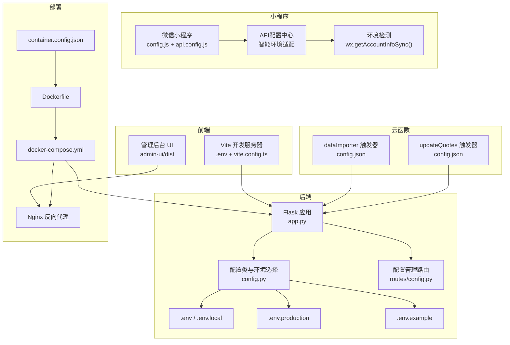
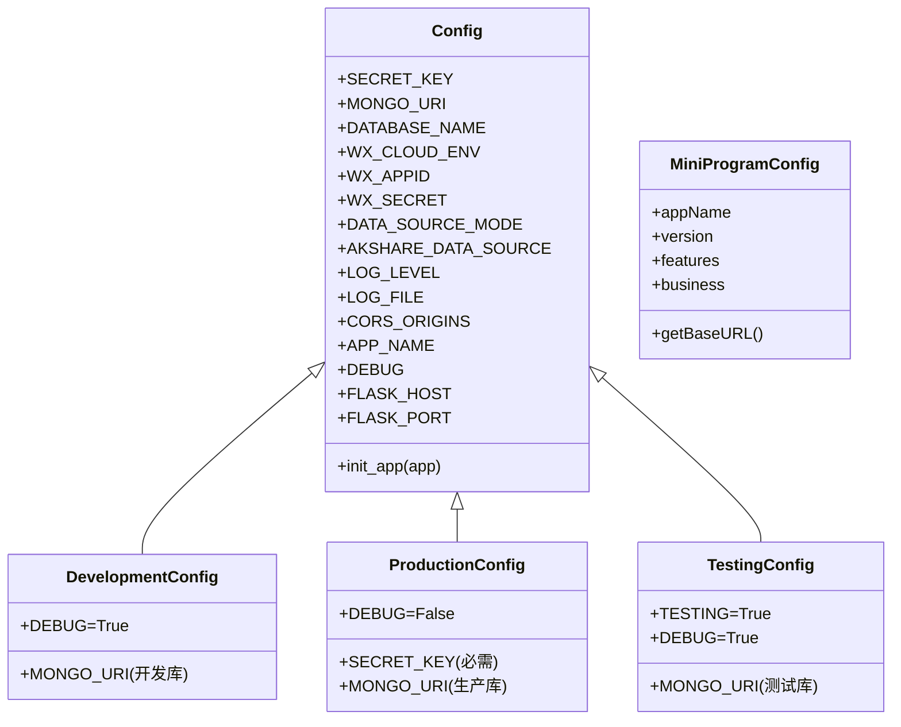
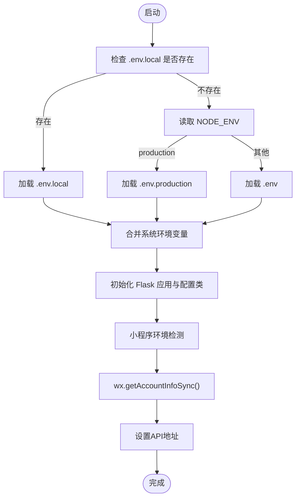
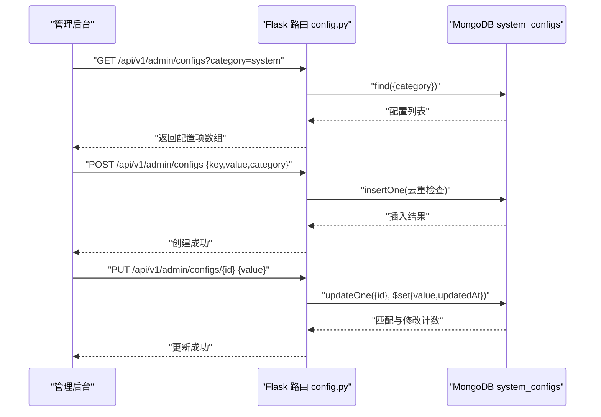
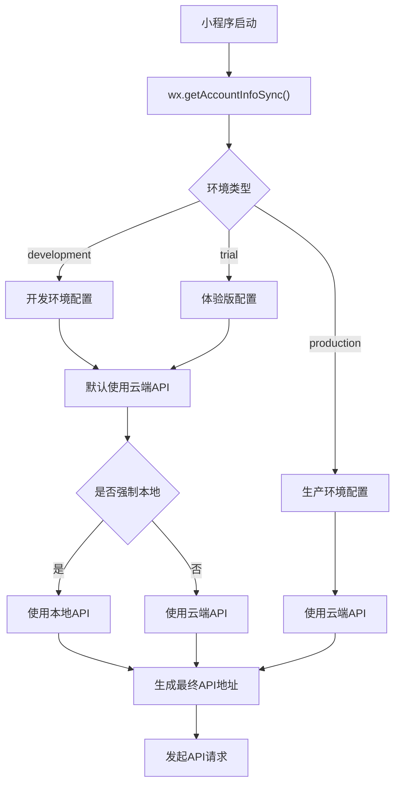
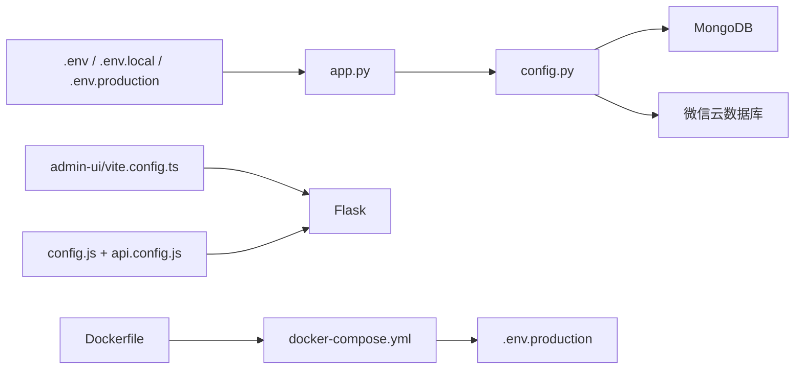

# 配置管理

<cite>
**本文引用的文件**
- [.env](file://.env)
- [.env.example](file://.env.example)
- [.env.production](file://.env.production)
- [package.json](file://package.json)
- [admin-ui/.env](file://admin-ui/.env)
- [admin-ui/vite.config.ts](file://admin-ui/vite.config.ts)
- [config.py](file://config.py)
- [app.py](file://app.py)
- [routes/config.py](file://routes/config.py)
- [cloudfunctions/dataImporter/config.json](file://cloudfunctions/dataImporter/config.json)
- [cloudfunctions/updateQuotes/config.json](file://cloudfunctions/updateQuotes/config.json)
- [deploy/docker-compose.yml](file://deploy/docker-compose.yml)
- [Dockerfile](file://Dockerfile)
- [container.config.json](file://container.config.json)
- [config.js](file://config.js)
- [utils/request.js](file://utils/request.js)
- [miniprogram/config/api.config.js](file://miniprogram/config/api.config.js)
</cite>

## 更新摘要
**所做更改**
- 新增小程序配置系统章节，涵盖config.js配置文件和环境特定URL配置
- 更新环境配置与优先级章节，增加小程序环境检测机制
- 新增API配置中心章节，详细说明智能环境适配机制
- 更新配置验证与热重载章节，增加小程序配置验证方法
- 新增配置安全与审计章节，涵盖小程序配置安全实践

## 目录
1. [引言](#引言)
2. [项目结构](#项目结构)
3. [核心组件](#核心组件)
4. [架构总览](#架构总览)
5. [详细组件分析](#详细组件分析)
6. [依赖分析](#依赖分析)
7. [性能考虑](#性能考虑)
8. [故障排除指南](#故障排除指南)
9. [结论](#结论)
10. [附录](#附录)

## 引言
本文件面向场外期权交易系统的配置管理，系统性梳理环境配置、系统配置与运行时配置的分类、作用与优先级；阐明配置文件的层次结构与继承关系；给出各类配置项的用途、默认值与推荐设置；覆盖开发、测试、生产三类环境的差异与切换方法；并提供配置验证、热重载与动态配置更新机制的设计思路，以及配置安全、敏感信息保护与配置审计的实践要点。最后总结配置迁移、版本管理与最佳实践。

**更新** 新增小程序配置系统，包括环境特定的URL配置、功能开关、业务配置等新功能，以及智能API配置中心的实现。

## 项目结构
本项目采用"前端 + 后端 + 小程序 + 部署"分层组织，配置贯穿于各层：
- 前端（React 管理后台）：Vite 开发服务器与代理配置，支持本地或云端代理模式。
- 后端（Python Flask）：基于环境变量的多环境配置，支持开发、测试、生产三态。
- 小程序（微信小程序）：智能API配置中心，支持开发、体验版、生产环境自动切换。
- 云函数与定时触发：通过独立配置文件定义触发器与权限。
- 部署（Docker + Nginx）：容器化部署，挂载生产环境变量与日志卷。

**图表来源**
- [admin-ui/vite.config.ts](file://admin-ui/vite.config.ts#L1-L78)
- [app.py](file://app.py#L37-L57)
- [config.py](file://config.py#L126-L132)
- [routes/config.py](file://routes/config.py#L1-L118)
- [cloudfunctions/dataImporter/config.json](file://cloudfunctions/dataImporter/config.json#L1-L13)
- [cloudfunctions/updateQuotes/config.json](file://cloudfunctions/updateQuotes/config.json#L1-L17)
- [deploy/docker-compose.yml](file://deploy/docker-compose.yml#L1-L42)
- [Dockerfile](file://Dockerfile#L1-L48)
- [container.config.json](file://container.config.json#L1-L10)
- [config.js](file://config.js#L1-L28)
- [miniprogram/config/api.config.js](file://miniprogram/config/api.config.js#L1-L174)

**章节来源**
- [admin-ui/vite.config.ts](file://admin-ui/vite.config.ts#L1-L78)
- [app.py](file://app.py#L37-L57)
- [config.py](file://config.py#L126-L132)
- [routes/config.py](file://routes/config.py#L1-L118)
- [cloudfunctions/dataImporter/config.json](file://cloudfunctions/dataImporter/config.json#L1-L13)
- [cloudfunctions/updateQuotes/config.json](file://cloudfunctions/updateQuotes/config.json#L1-L17)
- [deploy/docker-compose.yml](file://deploy/docker-compose.yml#L1-L42)
- [Dockerfile](file://Dockerfile#L1-L48)
- [container.config.json](file://container.config.json#L1-L10)
- [config.js](file://config.js#L1-L28)
- [miniprogram/config/api.config.js](file://miniprogram/config/api.config.js#L1-L174)

## 核心组件
- 环境变量与配置文件
  - 后端通过 app.py 与 config.py 组合加载 .env、.env.local、.env.production，并按 NODE_ENV 选择配置类。
  - 前端通过 Vite 的 loadEnv 与 vite.config.ts 读取 .env 与 .env.local，支持本地或云端代理模式。
  - 小程序通过 config.js 和 api.config.js 实现智能环境检测与API地址配置。
- 配置管理路由
  - 提供系统配置的增删改查接口，存储于 MongoDB 的 system_configs 集合。
- API配置中心
  - 小程序端智能API配置中心，支持开发、体验版、生产环境自动切换。
- 云函数与定时任务
  - dataImporter 与 updateQuotes 通过各自 config.json 定义定时触发器。
- 部署与容器化
  - Dockerfile 分阶段构建前端与后端，docker-compose.yml 挂载 .env.production 与日志卷，Nginx 提供反向代理。

**章节来源**
- [app.py](file://app.py#L37-L57)
- [config.py](file://config.py#L22-L94)
- [routes/config.py](file://routes/config.py#L13-L117)
- [cloudfunctions/dataImporter/config.json](file://cloudfunctions/dataImporter/config.json#L1-L13)
- [cloudfunctions/updateQuotes/config.json](file://cloudfunctions/updateQuotes/config.json#L1-L17)
- [deploy/docker-compose.yml](file://deploy/docker-compose.yml#L12-L18)
- [Dockerfile](file://Dockerfile#L1-L48)
- [config.js](file://config.js#L1-L28)
- [miniprogram/config/api.config.js](file://miniprogram/config/api.config.js#L1-L174)

## 架构总览
系统配置分为四层：
- 环境配置（Environment）
  - 由 .env、.env.local、.env.production 与系统环境变量共同构成，决定应用运行时行为与数据源。
- 系统配置（System）
  - 由 config.py 中的 Config/DevelopmentConfig/ProductionConfig/TestingConfig 类定义，控制应用特性开关、数据库与日志等。
- 运行时配置（Runtime）
  - 由 routes/config.py 提供的 API 动态维护，存储于 MongoDB，支持在线调整与审计。
- 小程序配置（MiniProgram）
  - 由 config.js 和 api.config.js 实现，包含应用信息、功能开关、业务配置和智能API环境适配。

**图表来源**
- [config.py](file://config.py#L22-L132)
- [config.js](file://config.js#L1-L28)

**章节来源**
- [config.py](file://config.py#L22-L132)
- [config.js](file://config.js#L1-L28)

## 详细组件分析

### 环境配置与优先级
- 文件加载顺序（后端）
  - 优先加载 .env.local（若存在），否则根据 NODE_ENV 判断加载 .env.production（生产）或 .env（默认），最终回退到系统环境变量。
- 前端加载顺序
  - Vite 通过 loadEnv(mode, repoRoot, '') 读取 .env 与 .env.local，mode 由 npm scripts 决定（如 development/production）。
- 小程序环境检测
  - 通过 wx.getAccountInfoSync() 获取小程序环境版本，支持 development、trial、production 三种环境自动识别。
- 代理目标选择
  - Vite 依据 VITE_PROXY_MODE 选择本地 Flask 或云端代理目标，便于开发与联调。

**图表来源**
- [app.py](file://app.py#L37-L57)
- [admin-ui/vite.config.ts](file://admin-ui/vite.config.ts#L8-L15)
- [utils/request.js](file://utils/request.js#L4-L19)

**章节来源**
- [app.py](file://app.py#L37-L57)
- [admin-ui/vite.config.ts](file://admin-ui/vite.config.ts#L8-L15)
- [.env](file://.env#L1-L32)
- [.env.production](file://.env.production#L1-L53)
- [.env.example](file://.env.example#L1-L50)
- [utils/request.js](file://utils/request.js#L4-L19)

### 系统配置（Flask 配置类）
- 基础配置（Config）
  - 密钥与数据库：SECRET_KEY、MONGO_URI、DATABASE_NAME。
  - 微信云数据库：WX_CLOUD_ENV、WX_APPID、WX_SECRET。
  - 数据源模式：DATA_SOURCE_MODE（cloud/local/hybrid）。
  - API 与日志：AKSHARE_DATA_SOURCE、LOG_LEVEL、LOG_FILE。
  - 跨域与应用：CORS_ORIGINS、APP_NAME、DEBUG、FLASK_HOST、FLASK_PORT。
  - 日志初始化：非调试模式下启用轮转文件日志。
- 环境派生配置
  - DevelopmentConfig：DEBUG=True，使用开发数据库。
  - ProductionConfig：DEBUG=False，要求设置 SECRET_KEY，使用生产数据库。
  - TestingConfig：DEBUG=True，TESTING=True，使用测试数据库。

**章节来源**
- [config.py](file://config.py#L22-L94)
- [config.py](file://config.py#L95-L125)

### 运行时配置（动态配置管理）
- 接口能力
  - GET /api/v1/admin/configs：按类别查询系统配置列表。
  - POST /api/v1/admin/configs：创建配置（校验 key+value+category，且 key+category 唯一）。
  - PUT /api/v1/admin/configs/{config_id}：更新配置（需提供 value）。
- 存储与约束
  - 存储于 MongoDB 的 system_configs 集合，包含 key、value、category、description、createdAt、updatedAt 等字段。
- 审计与一致性
  - 所有变更记录 updatedAt，便于审计与回溯。

**图表来源**
- [routes/config.py](file://routes/config.py#L13-L117)

**章节来源**
- [routes/config.py](file://routes/config.py#L13-L117)

### 小程序配置系统
- config.js 配置文件
  - 应用信息：appName、version。
  - 功能开关：guestMode、wechatLogin、phoneLogin、emailLogin、qqLogin。
  - 业务配置：sessionTimeout、tokenRefreshThreshold、maxRetryTimes。
- 智能API配置中心
  - 支持开发、体验版、生产环境自动检测。
  - 自动回退机制：开发环境默认使用云端API地址。
  - 手动切换：支持强制使用本地或云端地址。
  - 环境常量：CLOUD_API_URL、LOCAL_API_URL。

**图表来源**
- [config.js](file://config.js#L1-L28)
- [miniprogram/config/api.config.js](file://miniprogram/config/api.config.js#L50-L86)
- [utils/request.js](file://utils/request.js#L4-L19)

**章节来源**
- [config.js](file://config.js#L1-L28)
- [miniprogram/config/api.config.js](file://miniprogram/config/api.config.js#L1-L174)
- [utils/request.js](file://utils/request.js#L1-L164)

### 云函数与定时任务
- dataImporter
  - 触发器：定时器（每 5 分钟）。
- updateQuotes
  - 触发器：工作日市场时段与收盘后定时任务。
- 用途：周期性数据导入与行情更新，减少人工干预。

**章节来源**
- [cloudfunctions/dataImporter/config.json](file://cloudfunctions/dataImporter/config.json#L5-L12)
- [cloudfunctions/updateQuotes/config.json](file://cloudfunctions/updateQuotes/config.json#L5-L16)

### 部署与容器化
- Dockerfile
  - 分阶段构建：先构建 admin-ui 前端产物，再安装 Python 依赖，复制前后端产物。
  - 暴露端口与启动命令（Gunicorn）。
- docker-compose.yml
  - 挂载 .env.production 与日志卷，设置网络与端口映射。
- container.config.json
  - 容器端口、最小/最大实例数、CPU/内存配额等。

**章节来源**
- [Dockerfile](file://Dockerfile#L1-L48)
- [deploy/docker-compose.yml](file://deploy/docker-compose.yml#L12-L18)
- [container.config.json](file://container.config.json#L1-L10)

## 依赖分析
- 前端对后端的依赖
  - Vite 代理目标由 VITE_PROXY_MODE 决定，开发时指向本地 Flask（FLASK_PORT），生产时可指向云端。
- 后端对配置的依赖
  - app.py 依据 NODE_ENV 与 .env* 文件加载环境变量；config.py 依据环境变量选择配置类。
- 小程序对后端的依赖
  - 通过智能API配置中心自动选择合适的API地址，支持开发、体验版、生产环境。
- 配置对数据源的依赖
  - Config.MONGO_URI 与 DATABASE_NAME 控制 MongoDB 连接；WX_* 控制微信云数据库可用性。
- 部署对配置的依赖
  - docker-compose.yml 将 .env.production 挂载至容器内，确保生产密钥与参数生效。

**图表来源**
- [app.py](file://app.py#L37-L67)
- [config.py](file://config.py#L35-L46)
- [admin-ui/vite.config.ts](file://admin-ui/vite.config.ts#L10-L15)
- [config.js](file://config.js#L1-L28)
- [miniprogram/config/api.config.js](file://miniprogram/config/api.config.js#L1-L174)
- [deploy/docker-compose.yml](file://deploy/docker-compose.yml#L12-L18)
- [Dockerfile](file://Dockerfile#L1-L48)

**章节来源**
- [app.py](file://app.py#L37-L67)
- [config.py](file://config.py#L35-L46)
- [admin-ui/vite.config.ts](file://admin-ui/vite.config.ts#L10-L15)
- [config.js](file://config.js#L1-L28)
- [miniprogram/config/api.config.js](file://miniprogram/config/api.config.js#L1-L174)
- [deploy/docker-compose.yml](file://deploy/docker-compose.yml#L12-L18)
- [Dockerfile](file://Dockerfile#L1-L48)

## 性能考虑
- 启动与连接优化
  - Flask 启动时对 MongoDB 进行短超时连接测试，失败则降级为无数据库模式，保证服务可用性。
  - 自动同步定时任务仅在交易时间执行，降低非必要开销。
- 日志与监控
  - 非调试模式启用轮转文件日志，避免磁盘膨胀。
- 前端代理
  - Vite 代理设置较长超时，便于长时间请求与调试。
- 小程序API优化
  - 智能环境检测减少不必要的API调用失败重试。
  - 本地开发自动回退到云端，避免127.0.0.1连接问题。

**章节来源**
- [app.py](file://app.py#L70-L88)
- [app.py](file://app.py#L279-L330)
- [config.py](file://config.py#L74-L93)
- [admin-ui/vite.config.ts](file://admin-ui/vite.config.ts#L21-L59)
- [miniprogram/config/api.config.js](file://miniprogram/config/api.config.js#L36-L46)

## 故障排除指南
- 环境变量未生效
  - 确认 .env.local/.env.production 是否存在，NODE_ENV 是否正确，Vite 模式是否匹配。
- 数据库连接失败
  - 查看 Flask 启动日志，确认 MONGO_URI 与 DATABASE_NAME；必要时启用无数据库模式进行功能验证。
- 云数据库初始化失败
  - 检查 WX_CLOUD_ENV、WX_APPID、WX_SECRET 是否完整；查看 CloudDbConfigError 相关日志。
- 代理连接失败
  - 检查 VITE_PROXY_MODE 与 FLASK_PORT；确认后端已启动；查看 Vite 代理错误回调输出。
- 定时任务未触发
  - 检查 ENABLE_AUTO_SYNC 与 AUTO_SYNC_INTERVAL_SECONDS；核对云函数触发器配置。
- 小程序API访问失败
  - 检查 wx.getAccountInfoSync() 是否可用；确认环境检测逻辑；验证API地址配置。
  - 开发环境下可使用 switchToLocal() 切换到本地API地址。

**章节来源**
- [app.py](file://app.py#L46-L57)
- [app.py](file://app.py#L121-L152)
- [admin-ui/vite.config.ts](file://admin-ui/vite.config.ts#L26-L58)
- [cloudfunctions/dataImporter/config.json](file://cloudfunctions/dataImporter/config.json#L5-L12)
- [cloudfunctions/updateQuotes/config.json](file://cloudfunctions/updateQuotes/config.json#L5-L16)
- [miniprogram/config/api.config.js](file://miniprogram/config/api.config.js#L133-L142)
- [utils/request.js](file://utils/request.js#L138-L149)

## 结论
本系统通过"文件 + 环境变量 + 配置类 + 动态配置 + 小程序配置"的组合，实现了清晰的环境隔离与灵活的运行时调整能力。新增的小程序配置系统提供了智能API环境适配，大大简化了多环境部署和调试流程。建议在生产环境中严格管理密钥与敏感信息，完善配置审计与变更流程，并结合容器化与定时任务实现稳定可靠的配置生命周期管理。

## 附录

### 环境配置清单与推荐设置
- 开发环境
  - NODE_ENV=development
  - PORT/FLASK_PORT=5000/5002
  - MONGO_URI=本地开发库
  - WX_* 保持示例值或本地可用值
  - VITE_PROXY_MODE=local
  - 小程序：开发环境自动使用云端API，可通过switchToLocal()切换到本地
- 测试环境
  - NODE_ENV=testing
  - MONGO_URI=测试库
  - SKIP_DB_INIT=1（可选，跳过数据库初始化）
  - 小程序：体验版环境，使用云端API地址
- 生产环境
  - NODE_ENV=production
  - SECRET_KEY=强随机密钥
  - MONGO_URI=生产库
  - ALLOWED_ORIGINS=受控域名
  - LOG_FILE=只写路径（挂载卷）
  - 小程序：生产环境，使用稳定的云端API地址

**章节来源**
- [.env](file://.env#L5-L31)
- [.env.production](file://.env.production#L6-L49)
- [.env.example](file://.env.example#L6-L49)
- [config.py](file://config.py#L109-L112)
- [deploy/docker-compose.yml](file://deploy/docker-compose.yml#L12-L18)
- [config.js](file://config.js#L4-L6)
- [miniprogram/config/api.config.js](file://miniprogram/config/api.config.js#L30-L46)

### 配置验证与热重载
- 配置验证
  - 后端启动时打印环境变量状态；云数据库初始化失败时输出明确提示。
  - 前端代理错误回调返回结构化错误信息，便于定位问题。
  - 小程序通过console.log输出当前环境和API地址，便于调试验证。
- 热重载与动态更新
  - 建议通过 routes/config.py 的动态配置接口进行运行时调整；结合数据库审计字段实现变更追踪。
  - 对于前端代理与端口等静态配置，建议通过重新构建或重启容器生效。
  - 小程序配置可通过全局函数switchToLocal()和switchToCloud()进行实时切换。

**章节来源**
- [app.py](file://app.py#L59-L62)
- [app.py](file://app.py#L137-L152)
- [admin-ui/vite.config.ts](file://admin-ui/vite.config.ts#L38-L55)
- [routes/config.py](file://routes/config.py#L45-L75)
- [miniprogram/config/api.config.js](file://miniprogram/config/api.config.js#L133-L152)

### 配置安全与审计
- 敏感信息保护
  - 生产环境必须设置 SECRET_KEY 与 JWT_SECRET；避免将 .env.production 提交至版本库。
  - 使用只读挂载与最小权限原则管理 .env.production。
  - 小程序配置中的API地址应使用HTTPS协议，避免明文传输。
- 审计
  - system_configs 记录 createdAt/updatedAt，便于审计与回溯。
  - 启用轮转日志，保留关键操作日志。
  - 小程序通过console输出环境信息，便于运行时审计。
- 配置管理
  - config.js中的功能开关可用于快速禁用某些功能，便于安全控制。
  - 业务配置中的会话超时和重试次数应根据安全策略合理设置。

**章节来源**
- [.env.production](file://.env.production#L10-L13)
- [.env.example](file://.env.example#L13-L17)
- [routes/config.py](file://routes/config.py#L94-L107)
- [config.py](file://config.py#L74-L93)
- [config.js](file://config.js#L12-L26)
- [miniprogram/config/api.config.js](file://miniprogram/config/api.config.js#L155-L162)

### 配置迁移与版本管理
- 迁移策略
  - 通过 routes/config.py 的接口批量导入/导出配置；结合数据库备份与恢复脚本。
  - 小程序配置迁移时，注意环境检测逻辑的兼容性。
- 版本管理
  - 将 .env.* 与 docker-compose.yml 纳入版本控制；对敏感配置使用 .gitignore 与占位符。
  - config.js中的版本号可用于跟踪小程序配置版本。
- 最佳实践
  - 使用 .env.example 作为模板；在 CI 中校验关键配置项是否存在；在部署前进行配置预检。
  - 小程序配置应遵循渐进式发布策略，先在体验版验证，再推广到生产环境。
  - 建立配置变更审批流程，确保每次配置更新都有据可查。

**章节来源**
- [routes/config.py](file://routes/config.py#L77-L117)
- [.env.example](file://.env.example#L1-L50)
- [deploy/docker-compose.yml](file://deploy/docker-compose.yml#L12-L18)
- [config.js](file://config.js#L9-L10)
- [miniprogram/config/api.config.js](file://miniprogram/config/api.config.js#L4-L8)