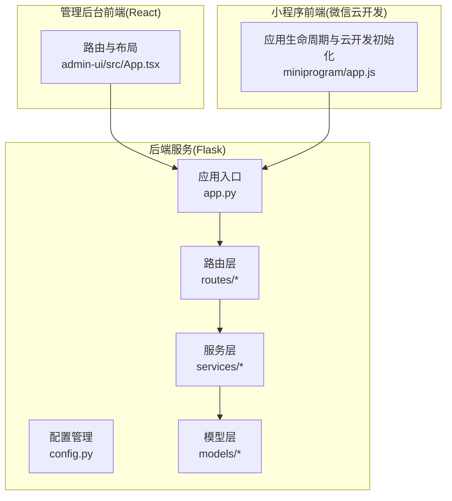
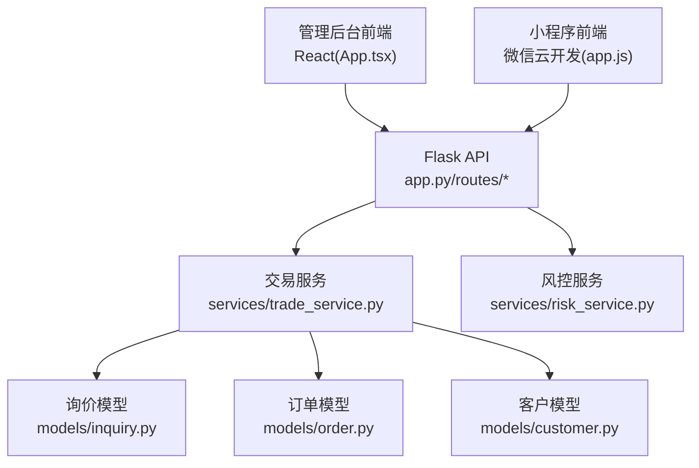
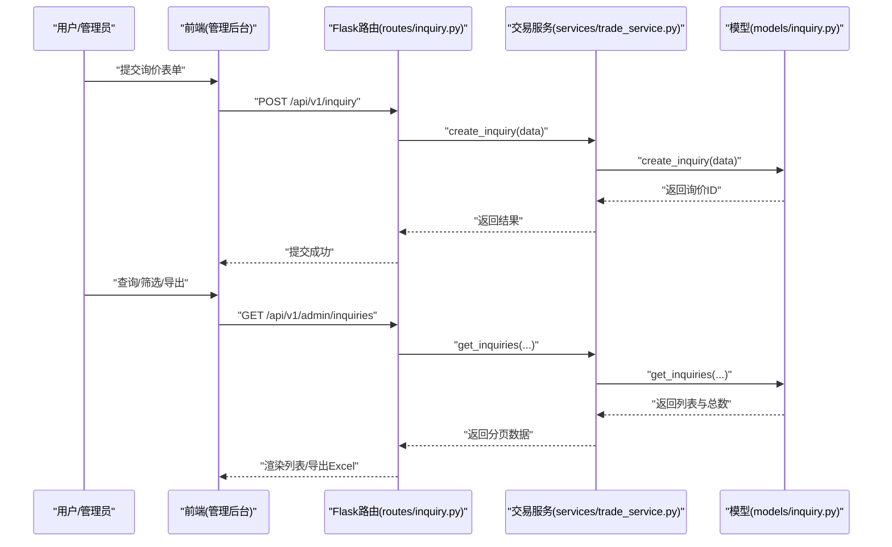
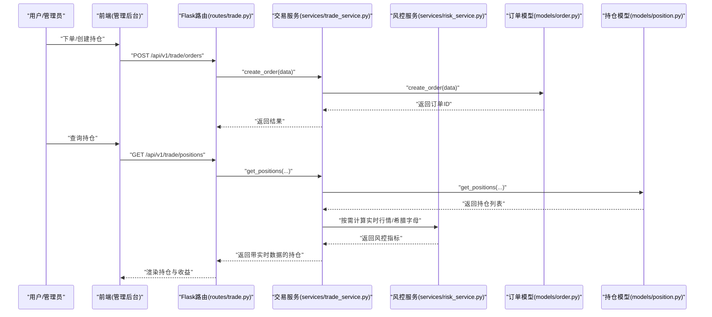
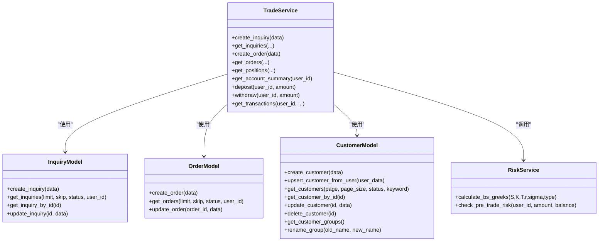
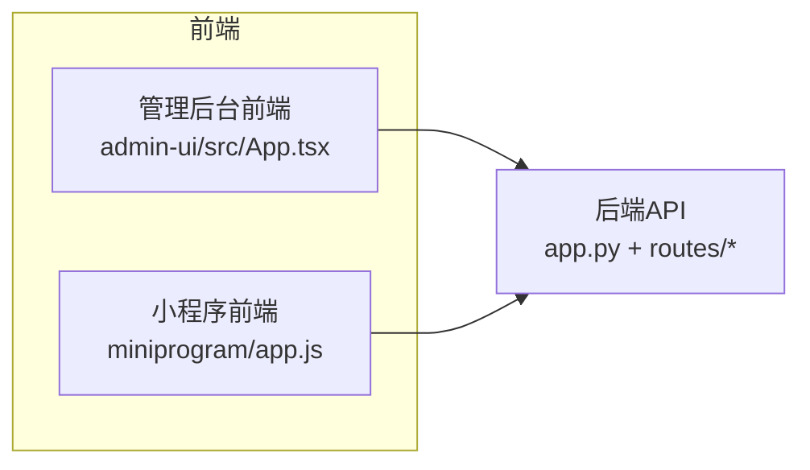
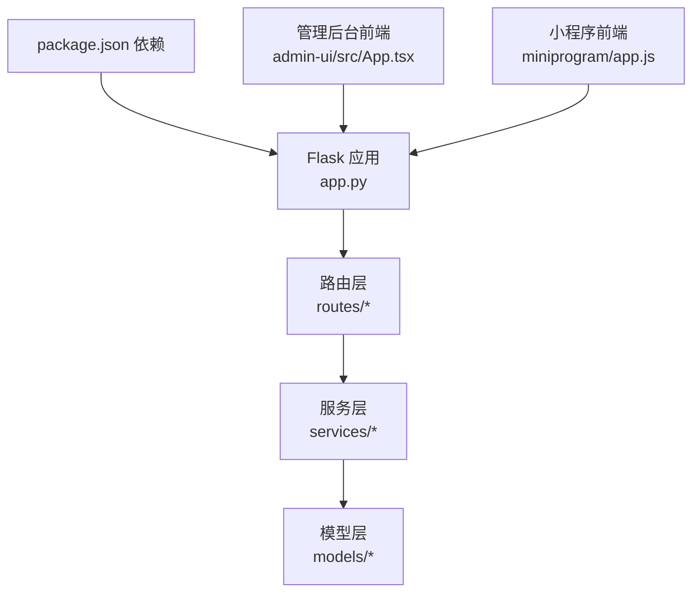

# 项目概述

<cite>
**本文引用的文件**
- [README.md](file://README.md)
- [package.json](file://package.json)
- [app.py](file://app.py)
- [config.py](file://config.py)
- [models/inquiry.py](file://models/inquiry.py)
- [models/order.py](file://models/order.py)
- [models/customer.py](file://models/customer.py)
- [routes/inquiry.py](file://routes/inquiry.py)
- [routes/trade.py](file://routes/trade.py)
- [services/trade_service.py](file://services/trade_service.py)
- [services/risk_service.py](file://services/risk_service.py)
- [admin-ui/src/App.tsx](file://admin-ui/src/App.tsx)
- [miniprogram/app.js](file://miniprogram/app.js)
</cite>

## 目录
1. [简介](#简介)
2. [项目结构](#项目结构)
3. [核心组件](#核心组件)
4. [架构总览](#架构总览)
5. [详细组件分析](#详细组件分析)
6. [依赖关系分析](#依赖关系分析)
7. [性能考量](#性能考量)
8. [故障排查指南](#故障排查指南)
9. [结论](#结论)
10. [附录](#附录)

## 简介
本项目是一个面向场外期权交易的综合系统，覆盖期权询价、报价、交易与风险管理等核心业务流程。系统采用多端协同架构：后端基于 Flask 提供 REST API 与定时任务；管理后台采用 React + TypeScript 的前端工程；小程序端基于微信云开发提供移动端交互体验。系统支持数据源双轨（云数据库与本地 MongoDB），并内置风控计算与实时行情更新能力，满足业务对灵活性与扩展性的需求。

## 项目结构
项目采用“后端服务 + 管理后台前端 + 小程序前端”的三层结构，并通过统一的后端 API 提供数据与业务能力。

**图表来源**
- [app.py](file://app.py#L103-L276)
- [config.py](file://config.py#L22-L132)
- [routes/inquiry.py](file://routes/inquiry.py#L1-L175)
- [routes/trade.py](file://routes/trade.py#L1-L330)
- [services/trade_service.py](file://services/trade_service.py#L1-L318)
- [models/inquiry.py](file://models/inquiry.py#L1-L148)
- [models/order.py](file://models/order.py#L1-L119)
- [models/customer.py](file://models/customer.py#L1-L300)
- [admin-ui/src/App.tsx](file://admin-ui/src/App.tsx#L1-L57)
- [miniprogram/app.js](file://miniprogram/app.js#L1-L225)

**章节来源**
- [README.md](file://README.md#L1-L90)
- [package.json](file://package.json#L1-L50)
- [app.py](file://app.py#L103-L276)
- [config.py](file://config.py#L22-L132)
- [admin-ui/src/App.tsx](file://admin-ui/src/App.tsx#L1-L57)
- [miniprogram/app.js](file://miniprogram/app.js#L1-L225)

## 核心组件
- 应用入口与中间件
  - 统一 JSON 序列化、CORS 跨域、健康检查、静态资源托管、错误处理与日志记录。
- 配置管理
  - 支持开发/生产/测试三套配置，数据库连接、跨域、日志、AkShare 数据源等集中管理。
- 路由与权限
  - 以蓝图划分业务域（询价、交易、风控、结算、客户、报价等），结合鉴权装饰器实现细粒度权限控制。
- 服务层
  - 交易服务封装询价/订单/持仓/账户资金等业务编排；风控服务提供希腊字母计算与交易前风控校验。
- 模型层
  - 面向云数据库与本地数据库的统一抽象，支持查询、分页、计数、更新与索引管理。
- 前端生态
  - 管理后台 React 应用，小程序基于微信云开发，均通过后端 API 进行数据交互。

**章节来源**
- [app.py](file://app.py#L103-L276)
- [config.py](file://config.py#L22-L132)
- [routes/inquiry.py](file://routes/inquiry.py#L1-L175)
- [routes/trade.py](file://routes/trade.py#L1-L330)
- [services/trade_service.py](file://services/trade_service.py#L1-L318)
- [services/risk_service.py](file://services/risk_service.py#L1-L60)
- [models/inquiry.py](file://models/inquiry.py#L1-L148)
- [models/order.py](file://models/order.py#L1-L119)
- [models/customer.py](file://models/customer.py#L1-L300)
- [admin-ui/src/App.tsx](file://admin-ui/src/App.tsx#L1-L57)
- [miniprogram/app.js](file://miniprogram/app.js#L1-L225)

## 架构总览
系统采用“后端 API + 多端前端”的分层架构，后端通过蓝图组织业务域，服务层聚合模型层与外部数据源，前端通过 REST 接口进行数据交互。

**图表来源**
- [app.py](file://app.py#L103-L276)
- [routes/inquiry.py](file://routes/inquiry.py#L1-L175)
- [routes/trade.py](file://routes/trade.py#L1-L330)
- [services/trade_service.py](file://services/trade_service.py#L1-L318)
- [services/risk_service.py](file://services/risk_service.py#L1-L60)
- [models/inquiry.py](file://models/inquiry.py#L1-L148)
- [models/order.py](file://models/order.py#L1-L119)
- [models/customer.py](file://models/customer.py#L1-L300)
- [admin-ui/src/App.tsx](file://admin-ui/src/App.tsx#L1-L57)
- [miniprogram/app.js](file://miniprogram/app.js#L1-L225)

## 详细组件分析

### 询价流程（提交、查询、状态变更、导出）
- 管理端提供分页查询、状态批量更新、统计与导出能力。
- 小程序端通过云开发直连云数据库，支持公开接口提交询价。
- 服务层对模型层进行编排，保证云/本地数据源一致性。

**图表来源**
- [routes/inquiry.py](file://routes/inquiry.py#L11-L175)
- [services/trade_service.py](file://services/trade_service.py#L36-L94)
- [models/inquiry.py](file://models/inquiry.py#L32-L101)

**章节来源**
- [routes/inquiry.py](file://routes/inquiry.py#L1-L175)
- [services/trade_service.py](file://services/trade_service.py#L36-L94)
- [models/inquiry.py](file://models/inquiry.py#L1-L148)

### 交易与风控流程（持仓、订单、账户、希腊字母）
- 交易路由提供持仓、订单、账户资金、结算触发等接口。
- 风控服务提供 Black-Scholes 希腊字母计算与交易前风控校验。
- 服务层在获取持仓时补充实时行情，计算浮动盈亏与收益率。

**图表来源**
- [routes/trade.py](file://routes/trade.py#L188-L330)
- [services/trade_service.py](file://services/trade_service.py#L111-L205)
- [services/risk_service.py](file://services/risk_service.py#L11-L60)
- [models/order.py](file://models/order.py#L28-L97)

**章节来源**
- [routes/trade.py](file://routes/trade.py#L1-L330)
- [services/trade_service.py](file://services/trade_service.py#L111-L205)
- [services/risk_service.py](file://services/risk_service.py#L1-L60)
- [models/order.py](file://models/order.py#L1-L119)

### 数据模型与数据源策略
- 模型层对云数据库与本地 MongoDB 进行统一抽象，支持创建索引、分页查询、条件过滤与更新。
- 配置层定义数据源优先级与模式（云/本地/混合），并提供环境隔离。

**图表来源**
- [models/inquiry.py](file://models/inquiry.py#L10-L148)
- [models/order.py](file://models/order.py#L10-L119)
- [models/customer.py](file://models/customer.py#L10-L300)
- [services/trade_service.py](file://services/trade_service.py#L8-L318)
- [services/risk_service.py](file://services/risk_service.py#L7-L60)

**章节来源**
- [models/inquiry.py](file://models/inquiry.py#L1-L148)
- [models/order.py](file://models/order.py#L1-L119)
- [models/customer.py](file://models/customer.py#L1-L300)
- [services/trade_service.py](file://services/trade_service.py#L1-L318)
- [services/risk_service.py](file://services/risk_service.py#L1-L60)

### 前端与系统边界
- 管理后台前端通过 React 路由组织页面，与后端 API 以 REST 协议通信。
- 小程序前端通过微信云开发初始化环境，直接访问云数据库，减少后端耦合。
- 系统边界以 API 蓝图为界，前端仅感知接口契约，不关心具体数据源实现。

**图表来源**
- [admin-ui/src/App.tsx](file://admin-ui/src/App.tsx#L1-L57)
- [miniprogram/app.js](file://miniprogram/app.js#L1-L225)
- [app.py](file://app.py#L103-L276)

**章节来源**
- [admin-ui/src/App.tsx](file://admin-ui/src/App.tsx#L1-L57)
- [miniprogram/app.js](file://miniprogram/app.js#L1-L225)
- [app.py](file://app.py#L103-L276)

## 依赖关系分析
- 后端依赖
  - Flask、CORS、PyMongo、dotenv、AkShare、Socket.IO、Better SQLite3 等。
  - package.json 定义了 Node.js 侧依赖与脚本命令，便于前后端联调与开发。
- 前端依赖
  - React、React Router、TypeScript 等，支撑管理后台的页面与交互。
- 数据与云服务
  - 支持本地 MongoDB 与微信云数据库双数据源，通过配置切换。

**图表来源**
- [package.json](file://package.json#L27-L48)
- [app.py](file://app.py#L103-L276)
- [routes/inquiry.py](file://routes/inquiry.py#L1-L175)
- [routes/trade.py](file://routes/trade.py#L1-L330)
- [services/trade_service.py](file://services/trade_service.py#L1-L318)
- [models/inquiry.py](file://models/inquiry.py#L1-L148)
- [models/order.py](file://models/order.py#L1-L119)
- [models/customer.py](file://models/customer.py#L1-L300)
- [admin-ui/src/App.tsx](file://admin-ui/src/App.tsx#L1-L57)
- [miniprogram/app.js](file://miniprogram/app.js#L1-L225)

**章节来源**
- [package.json](file://package.json#L1-L50)
- [app.py](file://app.py#L103-L276)
- [routes/inquiry.py](file://routes/inquiry.py#L1-L175)
- [routes/trade.py](file://routes/trade.py#L1-L330)
- [services/trade_service.py](file://services/trade_service.py#L1-L318)
- [models/inquiry.py](file://models/inquiry.py#L1-L148)
- [models/order.py](file://models/order.py#L1-L119)
- [models/customer.py](file://models/customer.py#L1-L300)
- [admin-ui/src/App.tsx](file://admin-ui/src/App.tsx#L1-L57)
- [miniprogram/app.js](file://miniprogram/app.js#L1-L225)

## 性能考量
- 后端
  - 自动行情同步仅在交易时段执行，降低非必要开销。
  - 日志轮转与错误处理分级，保障生产环境稳定性。
- 前端
  - 管理后台前端采用路由懒加载与按需构建；小程序端对关键模块进行预加载与性能监控。
- 数据访问
  - 模型层统一抽象云/本地数据源，减少重复逻辑；对热点字段建立索引提升查询效率。

[本节为通用性能建议，无需特定文件引用]

## 故障排查指南
- 健康检查
  - 通过健康端点快速判断服务与数据库连接状态。
- 日志定位
  - 后端日志输出到文件与标准输出，结合错误处理器定位异常。
- 数据源问题
  - 若云数据库未就绪或配置缺失，将记录警告/错误日志，需检查环境变量与集合是否存在。
- 前端联调
  - 确认跨域配置允许来源，检查路由与鉴权头是否正确传递。

**章节来源**
- [app.py](file://app.py#L185-L275)
- [config.py](file://config.py#L64-L94)

## 结论
本项目围绕场外期权交易的关键业务闭环，提供了从询价、报价到交易与风控的完整能力。通过多端协同与双数据源策略，系统在灵活性与可维护性之间取得平衡。建议后续持续完善数据聚合与报表能力，强化自动化测试与可观测性，以支撑业务的规模化演进。

[本节为总结性内容，无需特定文件引用]

## 附录
- 快速启动
  - 安装依赖后启动后端与前端，分别访问管理后台与小程序端进行功能验证。
- API 示例
  - 询价提交、订单创建、持仓查询、风控校验等均可通过对应路由进行验证。

**章节来源**
- [README.md](file://README.md#L24-L90)
- [routes/inquiry.py](file://routes/inquiry.py#L11-L175)
- [routes/trade.py](file://routes/trade.py#L188-L330)
- [services/risk_service.py](file://services/risk_service.py#L52-L60)